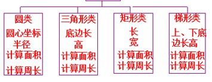
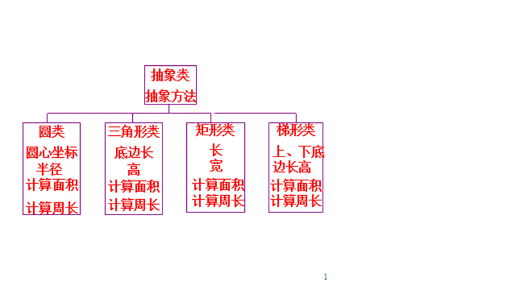

# **作业(程序设计题)**

**解释:包含作业中出现的所有程序的解释和建立**

## **1.第一单元:二维数组(杨辉三角)**

###### **1.题目**

**编写Java程序，输出杨辉三角形的前10行。要求：**

**1）二维数组每一行的列数恰好够用**

**2）输出格式每列数据左对齐。提示: 用“ \t”控制**

###### **2.程序主体**

```java
public class Main{
    public void main(String args[]){
        int[][] triangle = new int[10][];// 初始化+分配
        for(int i=0;i<triangle.length;i++){
            // 每行的列数等于行数+1
            triangle[i] = new int[i+1]
            //每行的第一个和最后一个元素都是1
            triangle[i][0] = 1;
            trianglr[i][i] = 1;
            for(int j=1;j<i;j++){
                triangle[i][j] = triangle[i-1][j-1]+triangle[i-1][j];          
            }      
        }
        for(int i =0;i<triangle.length;i++){
            for(int j =0;j<triangle[i].length;j++){
            	System.out.println(triangle[i][j]+"\t");
        	}
        }
    }
}
```

###### **3.注意事项**

>   **1.初始化数组的行,按照需求初始化列**
>
>   **2.数学关系(列数和行数的关系/首元末尾元素设置/正常元素设置)**
>
>   **3.双for输出流**


## **2.第二单元:键盘输入数组(类型)**

###### **1.题目**

**在main中,使用for循环完成以下问题：**

**(1)定义长度为10的实型一维数组，键盘输入任意10个浮点数，在一维数组中。**

**(2)求出数组合中的最大数据以及位置，并输出结果**

**(3)求出这10个数据的平均值，并统计大于，小于和等于均值的数据个数**

**(4)将数组中数据进行转置，即0号单元数据与9号单元数据，1号与8号...交换**

**<font color=red>(如果数组是double,scanner输入int合法吗?是的)</font>**

[隐式转换&显式转换](F:\desktop\期末复习用\大二上\java\md\Java面向对象程序设计第2章_基本数据类型.md#2.基本数据类型)

###### **2.程序主体**

```java
import java.util.Scanner
public class ArrayOperations{
    public static void main(String args[]){
        Scanner scanner = new Scanner(System.in);
        //(1) 输入array
        double[] array = new double[10];
        System.out.println("输入10个float");
        for(inr i=0;i<array.length;i++){
            array[i] = scanner.nextDouble();
        }
        //(2) 求最大值
        double maxValue = array[0];
        int maxIndex=0;
        for(int i=1;i<array.length;i++){
            if(arrayp[i]>maxValue){
                maxValue = array[i];
                maxIndex = i;
            }
        }
        System.out.println("Max"+maxValue+"Index"+maxIndex);
        //(3) 求平均值,求和平均值相差的个数
        double sum = 0;
        for(double num:array){
            sum+=num;
        }
        double average = sum/array.length;
        int greatCount = 0;
        int lessCount = 0;
        int equalCount = 0;
        for(double num:array){
            if(num>average){
                greatCount++;
            }else if(num<average){
                lessCount++;
            }else{
                equalCount++;
            }
        }
        System.out.println("average"+average);
        System.out.println("Greater average"+greaterCount);
        System.out.println("less average"+lessCount);
        System.out.println("equal average"+equalCount);
        // 4.数组转置
        for(int i=0;i<array.length/2;i++){
            // 基于swap算法(建立一个temp)
            double temp = array[i];
            array[i] = array[array.length - 1 - i];
            //因为数组长度为10,而最后一个索引为9
            array[array.length-1-i] = temp;
        }
        System.out.println("after transition:")
        for (double num:array) {
            System.out.println(num+""); //注意数组输出样式
        }
    }

}
```

###### **3.注意事项**

>   **1.<font color=red>注意导入`utils.Scanner`</font>**
>
>   >   **以及创建`Scanner scanner = new Scanner(System.in);`**
>   >
>   >   **以及输入语法`array[i] = scanner.nextDouble();`**
>   >
>   >   [输入语法](F:\desktop\期末复习用\大二上\java\md\Java面向对象程序设计第2章_基本数据类型.md#1.命令行输入)
>
>   **2.for循环的迭代用法:` for(double num:array)`**
>
>   **3.Swap的temp用法**


## **3.第三单元:循环语句**

###### **1.题目**

**键盘输入任意一个整数，判断是否是回文数字，**

**例如 12321，即从左到右、从右到左阅读一致**

**提示： 利用循环求出相反数据，然后比较**

###### **2.程序主体**

```java
import java.util.Scanner
public class Main{
	public static void main(String[] args){
        Scanner scanner = new Scanner(System.in);
        int num = scanner.nextInt();
        System.out.println("Insert a num");
        int flag = 0;
        // 主程序
        while(num > 0){
            int remainder = num % 10; // 取最后一位 
            flag = flag*10 + remainder; // 最后结果:逐渐进位
            num = num / 10; // 最后一位消去
        }
        if(originalNum == flag){
            System.out.println(oringalNum+" 是回文数");
        }else{
            System.out.println(oringalNum+" 不是回文数");
        }
        scanner.close();
    }
}
```

###### **3.注意事项**

>   **1.主要还是scanner的创建**
>
>   **2.主程序的思想**

## **4.第四单元:类与对象**

###### **1.题目**

**1、设计一个长方形的类**

>   **属性:长方形的长和宽**
>
>   **方法:长方形的面积和周长。**

**主类中创建两个长方形对象，调用类中的方法输出面积周长。**

**2、设一个圆的类**

>   **属性:圆的半径**
>
>   **方法：set方法修改半径，get方法返回半径，求面积、周长的方法。**

**3.主类**

>   **创建两个圆对象，调用类中的方法输出面积、周长**
>
>   **修改其中一个圆的半径查看是否会影响另一个圆的半径。**

###### **2.程序主体**

```java
class Rectangle {
    private double length;
    private double width;
    public Rectangle(double length, double width) {//构造方法
        this.length = length;
        this.width = width;
    }
    public double area() {
        return length * width;
    }
    public double perimeter() {
        return 2 * (length + width);
    }
}

class Circle {
    private double r; // 所以只能在该类内使用
    public Circle(double r) {
        this.r = r;
    }
    public void setRadius(double r) { //[1]
        this.r = r;
    }
    public double getRadius() {
        return r;
    }
    public double area() {
        return Math.PI * r * r;
    }
    public double perimeter() {
        return 2 * Math.PI * r;
    }
}

public class Main {
    public static void main(String[] args) {
        
        Rectangle rect1 = new Rectangle(5.0, 3.0);
        Rectangle rect2 = new Rectangle(7.5, 4.0);
        System.out.println(String.format("Rectangle 1 - Area: %.4f, Perimeter: %.4f", rect1.area(), rect1.perimeter()));
        System.out.println(String.format("Rectangle 2 - Area: %.4f, Perimeter: %.4f", rect2.area(), rect2.perimeter()));

        Circle circle1 = new Circle(3.0);
        Circle circle2 = new Circle(5.0);
        System.out.println(String.format("Circle 1 - Area: %.4f, Perimeter: %.4f", circle1.area(), circle1.perimeter()));
        System.out.println(String.format("Circle 2 - Area: %.4f, Perimeter: %.4f", circle2.area(), circle2.perimeter()));


        circle1.setRadius(6.0);
        System.out.println("修改后:");
        System.out.println(String.format("Circle 1 - Radius: %.4f, Area: %.4f, Perimeter: %.4f", circle1.getRadius(), circle1.area(), circle1.perimeter()));
        System.out.println(String.format("Circle 2 - Radius: %.4f, Area: %.4f, Perimeter: %.4f", circle2.getRadius(), circle2.area(), circle2.perimeter()));
        
    }
}
/*
输出:
Rectangle 1 - Area: 15.0000, Perimeter: 16.0000
Rectangle 2 - Area: 30.0000, Perimeter: 23.0000
Circle 1 - Area: 28.2743, Perimeter: 18.8496
Circle 2 - Area: 78.5398, Perimeter: 31.4159
修改后:
Circle 1 - Radius: 6.0000, Area: 113.0973, Perimeter: 37.6991(变化)
Circle 2 - Radius: 5.0000, Area: 78.5398, Perimeter: 31.4159(无变化)
*/
```

###### **3.注意事项**

>   **1.<font color=red>Java的void是强制的,对于类中的方法,如果不返回值就要加</font>**
>
>   **2.`String.format`的格式和Python不一样,是逗号**
>
>   **3.Java的`Math.PI`是固定格式!!!包开头大写,方法全部大写**
>
>   **4.(目前思想)创建类(属性/方法)后在主函数中实现(new)**
>
>   **5.<font color=red>输出的时候注意:`对象.属性`而不是`类.属性`</font>**

## **5.第四单元:类与对象(构造方法)**

**构造方法的主要目的:初始化对象**

###### **1.题目**

**1.设计一个圆的类**

>   **属性:圆的半径**
>
>   **方法：无参构造方法，有参数构造方法，set方法，get方法，求面积的方法，求周长的方法** 
>
>   **主类:创建2个圆类对象，调用set方法修改半径的值，最后输出圆的面积，周长和半径**

**2.设计一个校园卡用户的类**

>   **属性：姓名、身份证号、密码（初始值为666666），账户余额；**
>
>   **方法：构造方法初始化属性值，修改密码，充值，消费等方法** 
>
>   **在主类中，创建两个校园卡用户，操作每个用户对象，并输出信息。**

###### **2.程序主体**

```java
class Circle {
    private double radius;
    public Circle() {
        this.radius = 0.0; 
    }
    public Circle(double radius) {
        this.radius = radius;
    }
    public void setRadius(double radius) {
        this.radius = radius;
    }
    public double getRadius() {
        return this.radius;
    }
    public double getArea() {
        return Math.PI * Math.pow(radius, 2);
    }
    public double getPerimeter() {
        return 2 * Math.PI * radius;
    }
}
class CampusCardUser {
    private String name;
    private String idNumber;
    private String password;
    private double balance;
    ===================================================================
    // 构造方法(唯一)
    public CampusCardUser(String name, String idNumber, double balance) {
        this.name = name;
        this.idNumber = idNumber;
        this.password = "666666";
        this.balance = balance;
    }
    ===================================================================
    public void changePassword(String newPassword) {
        this.password = newPassword;
    }
    public void recharge(double amount) {
        if (amount > 0) {
            this.balance += amount;
            System.out.println(name + "充值成功，当前余额：" + balance);
        } else {
            System.out.println("充值金额无效！");
        }
    }
    public void consume(double amount) {
        if (amount > 0 && amount <= this.balance) {
            this.balance -= amount;
            System.out.println(name + "消费" + amount + "元，剩余余额：" + balance);
        } else {
            System.out.println("余额不足或消费金额无效！");
        }
    }
    public void displayInfo() {
        System.out.println("姓名: " + name);
        System.out.println("身份证号: " + idNumber);
        System.out.println("账户余额: " + balance);
    }
}
public class Main {
    public static void main(String[] args) {
        Circle circle1 = new Circle(5.0);
        Circle circle2 = new Circle(7.0);

        circle1.setRadius(6.0);
        circle2.setRadius(8.0);
        System.out.println("================================");
        System.out.println("圆1的半径: " + circle1.getRadius());
        System.out.println("圆1的面积: " + circle1.getArea());
        System.out.println("圆1的周长: " + circle1.getPerimeter());

        System.out.println("圆2的半径: " + circle2.getRadius());
        System.out.println("圆2的面积: " + circle2.getArea());
        System.out.println("圆2的周长: " + circle2.getPerimeter());
        System.out.println("================================");

        CampusCardUser user1 = new CampusCardUser("张三", "123456789012345678", 100.0);
        CampusCardUser user2 = new CampusCardUser("李四", "987654321098765432", 50.0);

        user1.changePassword("123456");
        user2.changePassword("654321");

        user1.recharge(50.0);
        user2.recharge(20.0);

        user1.consume(30.0);
        user2.consume(70.0); // 余额不足

        user1.displayInfo();
        user2.displayInfo();
    }
}
/*
================================
圆1的半径: 6.0
圆1的面积: 113.09733552923255
圆1的周长: 37.69911184307752
圆2的半径: 8.0
圆2的面积: 201.06192982974676
圆2的周长: 50.26548245743669
================================
张三充值成功，当前余额：150.0
李四充值成功，当前余额：70.0
张三消费30.0元，剩余余额：120.0
李四消费70.0元，剩余余额：0.0
姓名: 张三
身份证号: 123456789012345678
账户余额: 120.0
姓名: 李四
身份证号: 987654321098765432
账户余额: 0.0
*/
```

###### **3.注意事项(构造方法)**

>   **1.构造方法和普通方法不一样!(在名称/调用/有无参数表现出唯一性)**
>
>   >   **0.主要目的**
>   >
>   >   >   **构造方法:初始化对象的状态**
>   >   >
>   >   >   **普通方法:定义对象的行为**
>   >
>   >   **1.名称上**
>   >
>   >   >   **构造方法:<font color=red>必须和类名一致</font>**
>   >   >
>   >   >   **普通方法:不能是类名**
>   >
>   >   **2.定义成员上**
>   >
>   >   >   **构造方法:<font color=red>没有要求其中必须包含所有属性</font>**
>   >   >
>   >   >   **普通方法:需要什么用什么**
>   >
>   >   **3.返回值**
>   >
>   >   >   **构造方法:没有返回值也不用void**
>   >   >
>   >   >   **普通方法:<font color=red>如果没有返回值,必须适用void</font>**
>   >
>   >   **4.无函数体**
>   >
>   >   >   **当使用new创建对象,不管是否是构造方法,没有函数体都会有默认值**
>   >   >
>   >   >   **(`num:0`/`str:null`/`flag:false`/`obj:null`)**
>   >
>   >   **5.无参数**
>   >
>   >   >   **Java是静态语言,所以对象调用的参数和方法参数类型必须兼容**
>   >
>   >   **6.函数调用方式:**
>   >
>   >   >   **构造方法:直接new调用**
>   >   >
>   >   >   **普通方法:先new,再调用方法**
>   >   >
>   >   >   ```java
>   >   >   public class Person {
>   >   >       private String name;
>   >   >       private int age;
>   >   >       public Person(String name, int age) {
>   >   >           this.name = name;
>   >   >           this.age = age;
>   >   >       }
>   >   >       public void init(String name, int age) {
>   >   >           this.name = name;
>   >   >           this.age = age;
>   >   >       }
>   >   >   
>   >   >       public void sayHello() {
>   >   >           System.out.println("我是" + name + "，今年" + age + "岁。");
>   >   >       }
>   >   >   
>   >   >       public static void main(String[] args) {
>   >   >           // 使用构造方法
>   >   >           Person person1 = new Person("张三", 20);
>   >   >           person1.sayHello(); 
>   >   >           // 输出：你好，我是张三，今年20岁。
>   >   >   
>   >   >           // 使用普通方法初始化对象（容易遗漏）
>   >   >           Person person2 = new Person(null, 0); // 对象创建时没有初始化
>   >   >           person2.init("李四", 25); // 需要手动调用init方法
>   >   >           person2.sayHello(); // 输出：你好，我是李四，今年25岁。
>   >   >   
>   >   >           Person person3 = new Person(null, 0); 
>   >   >           // 对象创建时没有初始化，并且忘记调用init方法
>   >   >           person3.sayHello(); // 输出：你好，我是null，今年0岁。 出现错误！
>   >   >       }
>   >   >   }
>   >   >   ```


## **6.第四单元:对象组合(构造方法)**

###### **1.题目**

**1.长方形的类**

>   **属性:长和宽**
>
>   **方法:构造方法，set方法，get方法，求面积方法，求周长方法**   

**2.设计长方体的类**

>   **属性:长方形对象和高**
>
>   **方法:构造方法，set方法，get方法，求体积的方法**

**3.主类**

>   **创建长方体对象，输出长方体的体积，底部长方形的面积、周长、长、宽**

###### **2.程序主体**

```java
class Rectangle {
    private double length;
    private double width;
    public Rectangle(double length, double width) {
        this.length = length;
        this.width = width;
    }
    public void setLength(double length) {
        this.length = length;
    }
    public void setWidth(double width) {
        this.width = width;
    }
    public double getLength() {
        return length;
    }
    public double getWidth() {
        return width;
    }
    public double getArea() {
        return length * width;
    }
    public double getPerimeter() {
        return 2 * (length + width);
    }
}

class Cuboid {
    ==================================================
    private Rectangle rec; // 这里使用了对象的组合
    ==================================================
    private double height;
    public Cuboid(Rectangle rec, double height) {
        this.rec = rec;
        this.height = height;
    }
    public void setHeight(double height) {
        this.height = height;
    }
    public void setRectangle(Rectangle rec) {
        this.rec = rec;
    }
    public double getHeight() {
        return height;
    }
    public Rectangle getRectangle() {
        return rec;
    }
    public double getVolume() {
        return rec.getArea() * height;
    }
}
public class Main {
    public static void main(String[] args) {
        Rectangle rec = new Rectangle(5, 3);
        Cuboid cuboid = new Cuboid(rec, 4);
        System.out.println("长方体的体积: " + cuboid.getVolume());
        System.out.println("底部长方形的面积: " + rec.getArea());
        System.out.println("底部长方形的周长: " + rec.getPerimeter());
        System.out.println("底部长方形的长: " + rec.getLength());
        System.out.println("底部长方形的宽: " + rec.getWidth());
    }
}
/*
长方体的体积: 60.0
底部长方形的面积: 15.0
底部长方形的周长: 16.0
底部长方形的长: 5.0
底部长方形的宽: 3.0
*/
```

###### **3.注意事项**

>   **注意对象组合的表达形式:`引用类名+name`**
>
>   (此时的属性定义就只能通过方法了)

## **7.第四单元:static+包**

###### **1.题目**

**1.在`src`下新建包``com.cn.pap`**

**2.在包`com.cn.pap`下，设计梯形的类**

>   **1.成员变量:上底 下底 高，** 
>
>   **2.一个static变量count（static int count=0;）统计创建的梯形对象个数**
>
>   >   **（提示： 在构造方法中写代码： count++），**  
>
>   **3.一个static变量sum（static double sum=0;）放置所有创建的梯形的面积的和**
>
>   >   **（提示：在计算面积的方法中，将计算的面积累加到sum中，即sum=sum+"计算的面积")** 
>
>   **4.方法**
>
>   >   **构造方法，set方法，get方法，返回静态量的static等，所有方法都要加上public** 

**3.在src中新建主类（文件前面需要导入包：`import com.cn.pap`)**

>   **创建多个梯形，调用静态方法分别输出创建的梯形的个数和所有梯形的面积的和。**

###### **2.程序主体**

```java
// src/com/cn/pap:
package com.cn.pap;
public class Trapezoid {
    private double topBase;     
    private double bottomBase;  
    private double height;     
    
    public static int count = 0;     
    public static double sum = 0;  

    public Trapezoid(double topBase, double bottomBase, double height) {
        this.topBase = topBase;
        this.bottomBase = bottomBase;
        this.height = height;
        count++;  
        sum += calculateArea(); 
    }
	// 方法1:修改值方法
    public void setTopBase(double topBase) {
        this.topBase = topBase;
    }
    public void setBottomBase(double bottomBase) {
        this.bottomBase = bottomBase;
    }
    public void setHeight(double height) {
        this.height = height;
    }
    public double getTopBase() {
        return topBase;
    }
    // 方法2:返回方法
     public double calculateArea() {
        return (topBase + bottomBase) * height / 2;
    }
    public double getBottomBase() {
        return bottomBase;
    }
    public double getHeight() {
        return height;
    }
    public static int getCount() {
        return count;
    }
    public static double getSum() {
        return sum;
    }
}

// src/main:
import com.cn.pap.Trapezoid;

public class Main {
    public static void main(String[] args) {
        // 创建多个梯形对象
        Trapezoid t1 = new Trapezoid(5.0, 7.0, 4.0);
        Trapezoid t2 = new Trapezoid(6.0, 8.0, 3.0);
        Trapezoid t3 = new Trapezoid(4.5, 6.5, 5.0);

        // 调用静态方法输出创建的梯形个数和面积和
        System.out.println("创建的梯形个数: " + Trapezoid.getCount());
        System.out.println("所有梯形的面积和: " + Trapezoid.getSum());
    }
}
/*
创建的梯形个数:3
所有梯形的面积数:72.5
*/
```

###### **3.注意事项**

>   **1.主要是建立包的方法:`package com.cn.pap;`**
>
>   **2.对应的路径:**
>
>   >   **比如在这里`src/com/cn/pap`,主类在`src/main`**
>   >
>   >   **(所以相对路径是`com.cn.pap.(Trapezoid)`)**

## **8.第五单元:继承(extends)**

###### **1.题目**

**1.设计一个圆的类**

>   **其私有数据成员为圆的半径，构造方法初始化成员，set，get方法，**
>
>   **成员方法求圆的面积和周长。** 

**2.设计圆锥体的类(继承圆类)**

>   **新增私有成员为圆锥体的高，构造方法初始化成员，set，get方法**
>
>   **成员方法求圆锥体的体积.**

**3.编写主类**

>   **创建圆锥体对象，输出圆锥体的底面积、体积。**

###### **2.程序主体**

```java
// Circle.java
public class Circle {
    private double radius;
    public Circle(double radius) {
        this.radius = radius;
    }
    public void setRadius(double radius) {
        this.radius = radius;
    ｝
    public double getRadius() {
        return radius;
    }
    public double getArea() {
        return Math.PI * radius * radius;
    }
    public double getCircumference() {
        return 2 * Math.PI * radius;
    }
}
// Cone.java
public class Cone extends Circle {
    private double height;
    public Cone(double radius, double height) {
    =======================
        super(radius); 
    =======================
        this.height = height;
    }
    public double getHeight() {
        return height;
    }
    public void setHeight(double height) {
        this.height = height;
    }
    public double getVolume() {
        return (1.0 / 3) * getArea() * height;
    }
}
// Main.java
public class Main {
    public static void main(String[] args) {
        Cone cone = new Cone(5.0, 10.0);
        System.out.printf("圆锥体的底面积: %.2f%n", cone.getArea());
        System.out.printf("圆锥体的体积: %.2f%n", cone.getVolume());
    }
}
```

###### **3.注意事项**

>   **1.super关键字是用于调用父类的构造方法(而不是自动构造方法)**
>
>   **2.父类的私有成员也可以被子类继承**
>
>   **3.[super关键字](F:\desktop\期末复习用\大二上\java\md\Java面向对象程序设计第5章_继承与接口.md#6.super关键字)**

## **9.第五单元:子类(上传型)**

###### **1.题目**

**（1）设计一个公共父类Shape，有下图中各类的公共的数据成员变量，方法有:**

>   **double getArea(){}  表示计算面积**
>
>   **double getPri(){} 表示计算周长**

 **<font color=red>方法体中不用设计代码，即大括号中空着，为后续上转型认识该方法做准备</font>**

**编写构造方法完成对公共数据成员的初始化**

**（2）继承Shape，设计各个图形类**

>   **如果需要就增加新的成员变量，**
>
>   **如果继承的变量就足够不用增加，编写构造方法，**
>
>   **调用Shape类构造方法对继承的数据初始化，并对有新增变量初始化；**

>   **重写方法 getArea 和 getPri，计算各图形的面积和周长并返回**
>
>   **其中：梯形的周长不用计算，直接返回0**

**（3）主类中使用弗雷Shape 定义一个对象名 p，然后创建各子类对象，将子类对象的引用（地址）赋值给p，使用上转型的知识调用个子类的求面积和周长方法，并输出结果。**



###### **2.程序主体**

```java
// 需要每个类都单独定义一个.java,然后编译运行
// 父类 Shape
=========================================================
abstract class Shape {
    // 公共成员变量
    protected double dimension1;
    protected double dimension2;
    public Shape(double dimension1, double dimension2) {
        this.dimension1 = dimension1;
        this.dimension2 = dimension2;
    }
    public abstract double getArea();
    public abstract double getPri();
}
=========================================================

class Circle extends Shape {
    ==============================
    public Circle(double radius) {
        super(radius, 0); 
    }
    ==============================
    @Override
    public double getArea() {
        return Math.PI * dimension1 * dimension1; // πr²
    }
    @Override
    public double getPri() {
        return 2 * Math.PI * dimension1; // 2πr
    }
}


class Triangle extends Shape {
    =============================
    private double side3; // 第三条边
    public Triangle(double side1, double side2, double side3) {
        super(side1, side2);
        this.side3 = side3;
    }
    =============================
    @Override
    public double getArea() {
        double s = (dimension1 + dimension2 + side3) / 2; // 半周长
        return Math.sqrt(s * (s - dimension1) * (s - dimension2) * (s - side3));
    }
    @Override
    public double getPri() {
        return dimension1 + dimension2 + side3; 
    }
}

class Rectangle extends Shape {
    public Rectangle(double length, double width) {
        super(length, width);
    }

    @Override
    public double getArea() {
        return dimension1 * dimension2; 
    }

    @Override
    public double getPri() {
        return 2 * (dimension1 + dimension2);
    }
}

// 梯形类
class Trapezoid extends Shape {
    private double height; 
    public Trapezoid(double base1, double base2, double height) {
        super(base1, base2);
        this.height = height;
    }
    @Override
    public double getArea() {
        return 0.5 * (dimension1 + dimension2) * height; 
    }
    @Override
    public double getPri() {
        return 0; 
    }
}

// 主类
public class Main {
    public static void main(String[] args) {
        // 定义父类对象
        Shape p;

        // 创建各子类对象并赋值给父类引用
        p = new Circle(5); // Circle with radius 5
        System.out.println("Area of the circle: " + p.getArea());
        System.out.println("Circumference of the circle: " + p.getPri());

        p = new Triangle(3, 4, 5); // Triangle with sides 3, 4, 5
        System.out.println("Area of the triangle: " + p.getArea());
        System.out.println("Perimeter of the triangle: " + p.getPri());

        p = new Rectangle(4, 6); // Rectangle with length 4, width 6
        System.out.println("Area of the rectangle: " + p.getArea());
        System.out.println("Perimeter of the rectangle: " + p.getPri());

        p = new Trapezoid(3, 5, 4); // Trapezoid with top 3, bottom 5, height 4
        System.out.println("Area of the trapezoid: " + p.getArea());
        System.out.println("Perimeter of the trapezoid: " + p.getPri());
    }
}
/*
Area of the circle: 78.53981633974483
Circumference of the circle: 31.41592653589793
Area of the triangle: 6.0
Perimeter of the triangle: 12.0
Area of the rectangle: 24.0
Perimeter of the rectangle: 20.0
Area of the trapezoid: 16.0
Perimeter of the trapezoid: 0.0
*/
```

**3.注意事项**

>   **1.主要是super方式重写(不够就单独开一个private成员)**
>
>   **2.<font color=red>上传型以后,如果涉及计算操作,则都在父类完成</font>**

## **10.第五单元:抽象类(上传型)**

###### **1.题目**

实现下述要求的各类，每个类中都要求有构造方法以及其他方法

各图形含有部分公共代码，包括数据成员和成员方法，

**<font color=red>这些代码不要在每个类中设计，要写在父类即抽象类中</font>**

抽象类中有抽象方法，也有非抽象的方法，下述各子类公共代码在抽象类中设计。

(子类调用父类的构造方法使用：super完成)

**<font color=red>设计一个模拟类，内有方法 show，形参为抽象类对象，主方法调用给方法传递个子类对象，输出各自的面积、周长。其中梯形周长返回值为0</font>**

**抽象类中需要有各子类共同的变量以及方法**

(子类构造方法调用父类构造方法，抽象类的设计，上转型对象)



###### **2.程序主体**

```java
public abstract class Shape {
    // 成员变量方法
    protected double area;
    protected double perimeter;
    public Shape() {
        this.area = 0;
        this.perimeter = 0;
    }
    // 计算方法:抽象方法(符合题意)
    public abstract void calculateArea();
    public abstract void calculatePerimeter();
    // 成员变量返回方法
    public double getArea() {
        return area;
    }
    public double getPerimeter() {
        return perimeter;
    }
    // 方法
    public void show() {
        System.out.println("Area: " + area);
        System.out.println("Perimeter: " + perimeter);
    }
}

public class Circle extends Shape {
    private double radius;
    public Circle(double radius) {
        super();
        this.radius = radius;
        calculateArea();
        calculatePerimeter();
    }
    @Override
    public void calculateArea() { 
        area = Math.PI * radius * radius; 
    }
    @Override
    public void calculatePerimeter() {
        perimeter = 2 * Math.PI * radius;
    }
}

public class Triangle extends Shape {
    private double a, b, c;
    public Triangle(double a, double b, double c) {
        super();
        this.a = a;
        this.b = b;
        this.c = c;
        calculateArea();
        calculatePerimeter();
    }

    @Override
    public void calculateArea() {
        double s = (a + b + c) / 2;
        area = Math.sqrt(s * (s - a) * (s - b) * (s - c));
    }
    @Override
    public void calculatePerimeter() {
        perimeter = a + b + c;
    }
}

public class Rectangle extends Shape {
    private double length;
    private double width;

    public Rectangle(double length, double width) {
        super();
        this.length = length;
        this.width = width;
        calculateArea();
        calculatePerimeter();
    }

    @Override
    public void calculateArea() {
        area = length * width;
    }
    @Override
    public void calculatePerimeter() {
        perimeter = 2 * (length + width);
    }
}

public class Trapezoid extends Shape {
    private double topBase;
    private double bottomBase;
    private double height;

    public Trapezoid(double topBase, double bottomBase, double height) {
        super();
        this.topBase = topBase;
        this.bottomBase = bottomBase;
        this.height = height;
        calculateArea();
        calculatePerimeter();
    }

    @Override
    public void calculateArea() {
        area = 0.5 * (topBase + bottomBase) * height;
    }
    @Override
    public void calculatePerimeter() {
        perimeter = 0;
    }
}

public class ShapeTest {
    public static void main(String[] args) {
        Shape circle = new Circle(5);
        Shape triangle = new Triangle(3, 4, 5);
        Shape rectangle = new Rectangle(4, 6);
        Shape trapezoid = new Trapezoid(3, 5, 4);

        System.out.println("Circle:");
        circle.show();

        System.out.println("\nTriangle:");
        triangle.show();

        System.out.println("\nRectangle:");
        rectangle.show();

        System.out.println("\nTrapezoid:");
        trapezoid.show();
    }
}

```


###### **3.注意事项**

>   **1.父类的成员变量**
>
>   **2.因为上传,所以在子类声明对应方法时,使用父类的成员**
>
>   ```java
>   // 比如
>   public class Circle extends Shape {
>       private double radius;
>       public Circle(double radius) {
>           super();
>           this.radius = radius;
>           calculateArea(); // 父类方法
>           calculatePerimeter(); //父类方法
>       }
>       @Override
>       public void calculateArea() {  // 方法重写
>           area = Math.PI * radius * radius;
>       }
>       @Override
>       public void calculatePerimeter() {
>           perimeter = 2 * Math.PI * radius;
>       }
>   }
>   
>   ```
>
>   **3.<font color=red>在构造函数中调用父类方法:不是必须的(super继承完了)</font>**
>
>   >   **主要目的是偷懒,主类声明就不用写成**
>   >
>   >   **`circle.calculateArea();` 和`circle.calculatePerimeter();`**
>   >
>   >   **<font color=red>(如果在大型项目,初始化顺序错了就寄了)</font>**
>
>   **4.上传类本质就是父类方法的重写**

## **11.第五单元:接口的创建与实现**

###### **1.题目**

1.   **接口中声明抽象方法**
2.   **公共类shape，需要有各子类共同的变量以及方法。子类调用父类的构造方法使用： super完成**
3.   **设计一个模拟类，内有方法 show，形参为接口对象，主方法调用，给方法传递个子类对象，输出各自的面积、周长。其中梯形周长返回值为0**
4.   **主类实现**


###### **2.程序主体**

```java
================================================
public interface ShapeInterface {
    void calculateArea();
    void calculatePerimeter();
}
public class Shape implements ShapeInterface {
    protected double area;
    protected double perimeter;
    public Shape() {
        this.area = 0;
        this.perimeter = 0;
    }

    @Override
    public void calculateArea() {
    }
    @Override
    public void calculatePerimeter() {
    }

    public double getArea() {
        return area;
    }
    public double getPerimeter() {
        return perimeter;
    }

    public void show() {
        System.out.println("Area: " + area);
        System.out.println("Perimeter: " + perimeter);
    }
}
=======================================
public class Circle extends Shape {
    private double radius;
    public Circle(double radius) {
        super();
        this.radius = radius;
        calculateArea();
        calculatePerimeter();
    }

    @Override
    public void calculateArea() {
        area = Math.PI * radius * radius;
    }
    @Override
    public void calculatePerimeter() {
        perimeter = 2 * Math.PI * radius;
    }
}

public class Triangle extends Shape {
    private double a, b, c;

    public Triangle(double a, double b, double c) {
        super();
        this.a = a;
        this.b = b;
        this.c = c;
        calculateArea();
        calculatePerimeter();
    }

    @Override
    public void calculateArea() {
        double s = (a + b + c) / 2;
        area = Math.sqrt(s * (s - a) * (s - b) * (s - c));
    }

    @Override
    public void calculatePerimeter() {
        perimeter = a + b + c;
    }
}

public class Rectangle extends Shape {
    private double length;
    private double width;

    public Rectangle(double length, double width) {
        super();
        this.length = length;
        this.width = width;
        calculateArea();
        calculatePerimeter();
    }

    @Override
    public void calculateArea() {
        area = length * width;
    }

    @Override
    public void calculatePerimeter() {
        perimeter = 2 * (length + width);
    }
}

public class Trapezoid extends Shape {
    private double topBase;
    private double bottomBase;
    private double height;

    public Trapezoid(double topBase, double bottomBase, double height) {
        super();
        this.topBase = topBase;
        this.bottomBase = bottomBase;
        this.height = height;
        calculateArea();
        calculatePerimeter();
    }

    @Override
    public void calculateArea() {
        area = 0.5 * (topBase + bottomBase) * height;
    }

    @Override
    public void calculatePerimeter() {
        perimeter = 0;
    }
}

public class ShapeTest {
    public static void show(ShapeInterface shape) {
        shape.calculateArea();
        shape.calculatePerimeter();
        System.out.println("Area: " + shape.getArea());
        System.out.println("Perimeter: " + shape.getPerimeter());
    }

    public static void main(String[] args) {
        ShapeInterface circle = new Circle(5);
        ShapeInterface triangle = new Triangle(3, 4, 5);
        ShapeInterface rectangle = new Rectangle(4, 6);
        ShapeInterface trapezoid = new Trapezoid(3, 5, 4);

        System.out.println("Circle:");
        show(circle);

        System.out.println("\nTriangle:");
        show(triangle);

        System.out.println("\nRectangle:");
        show(rectangle);

        System.out.println("\nTrapezoid:");
        show(trapezoid);
    }
}

```


###### **3.注意事项**

>   **1.关键字`interface`和`implements`**
>
>   **2.接口定义了行为规范，即对象应该具备哪些方法。它不能直接创建对象**
>
>   >   **这是不能写出成`ShapeInterface.Shape.circle = new Circle(5);`的原因**
>
>   **3.接口的主要作用是定义一组方法规范，从而实现多态性，并促进代码的解耦和复用。**
>
>   >   **解耦**
>   >
>   >   **`ShapeTest` 类只需要知道 `ShapeInterface` 接口，而不需要知道具体的图形类**
>   >
>   >   **（`Circle`、`Triangle` 等）。**
>   >
>   >   **即使添加了新的图形类（例如 `Square`、`Pentagon`），只要它们实现了 **
>   >
>   >   **`ShapeInterface` 接口，`ShapeTest` 类就不需要修改。**

**上传型没有固定的学术描述,但是可以描述为**

>   **1.抽象:忽略具体实现(比如抽象类和接口)**
>
>   **2.多态:允许父类根据对象的实际类型调用方法**
>
>   >   **向上转型(Upcasting"):子类类型的引用上传到父类的引用**
>
>   **3.契约式设计:按照一种规范,进行方法的具体实现**
>
>   **4.接口式设计**

## **12.第五单元:抽象类继承**

###### **1.题目**

设计一个抽象类T

内有抽象方法：

double getArea(); 表示求图形面积并返回值

double getPri(); 表示求图形周长并返回值

设计一个长方形的类，继承抽象类T，

其私有数据成员为长和宽，写出构造方法初始化长和宽，

并分别实现抽象方法getArea()和getPri()求面积和周长。

然后继承长方形，设计长方体的类，

新增私有成员为长方体的高，写出构造方法初始化长方体的数据成员，并写出成员方法求长方体的体积。编写主类，创建长方体对象，输出长方体的底面积、周长以及体积。

###### **2.程序主体**

```java
abstract class T {
    public abstract double getArea();
    public abstract double getPri();
}
/*
interface T {
    double getArea();
    double getPri();
}
*/
class Rectangle extends T { // class Rectangle implements T {
    private double length;
    private double width;
    public Rectangle(double length, double width) {
        this.length = length;
        this.width = width;
    }
    // 重写父类方法
    @Override
    public double getArea() {
        return length * width;
    }
    @Override
    public double getPri() {
        return 2 * (length + width);
    }
}
class Cuboid extends Rectangle {
    private double height;
    public Cuboid(double length, double width, double height) {
        super(length, width); // Rectangle
        this.height = height;
    }
    public double getVolume() {
        return getArea() * height;
    }
}
public class Main {
    public static void main(String[] args) {
        Cuboid cuboid = new Cuboid(5, 3, 4);
        System.out.println("底面积: " + cuboid.getArea());
        System.out.println("底周长: " + cuboid.getPri());
        System.out.println("体积: " + cuboid.getVolume());
    }
}

```

###### **3.注意事项**

| 特性     | 抽象类 (extends)                                             | 接口 (implements)                                            |
| -------- | ------------------------------------------------------------ | ------------------------------------------------------------ |
| 关系     | “是一个 (is-a)”                                              | “具有 (has-a)” / “能够 (can-do)”                             |
| 继承方式 | 单继承                                                       | 多实现                                                       |
| 实现程度 | 可以包含部分实现                                             | 完全不包含任何实现                                           |
| 主要用途 | 代码复用、定义类的基本属性和行为                             | 定义行为规范、实现多态性、解耦合                             |
| 适用场景 | 当类之间存在明显的继承关系，且需要共享一些代码时。例如，Animal 和 Dog。 | 当需要定义一组规范，并让不同的类去实现这些规范时。例如，Flyable 接口可以被 Bird 和 Airplane 实现。 |

>   **使用抽象类 `extends` 强调的是 继承关系 和 代码复用。**
>
>   **使用接口 `implements` 强调的是 行为规范 和 多态性。**

## **13.Last 图形界面设置**

```java
import javax.swing.*; // 框架包
import java.awt.*; // 框架位置包
import java.awt.event.*; // 行为事件包

class Win extends JFrame implements ActionListener {
    JLabel b1 = new JLabel("one");
    JLabel b2 = new JLabel("two");
    JLabel b3 = new JLabel("result");
    JTextField tf1 = new JTextField(10);
    JTextField tf2 = new JTextField(10);
    JTextField tf3 = new JTextField(10);
    JButton btn1 = new JButton("compute");
    JButton btn2 = new JButton("clear");
    //JCheckBox c =new JCheckBox("read");//不讲不考(打勾的框)

    Win(String S) {
        //this.add("North",b1);
        setLayout(new FlowLayout());
        add(b1);
        add(tf1);
        add(b2);
        add(tf2);
        add(b3);
        add(tf3);
        add(btn1);
        add(btn2);
        btn1.addActionListener(this); // 因为当前的类实现了这个接口(对象)
        btn2.addActionListener(this);
        tf3.setEditable(false); // 结果框不可编辑
        // super(s);//子类调用父类,第一行
        setTitle(S); // 设置窗口标题
        setLocation(300, 300); // 设置窗口位置
        // 必不可少的函数,必考

        setSize(400, 400); // 设置窗口大小
        setVisible(true); // 显示窗口
        setDefaultCloseOperation(JFrame.EXIT_ON_CLOSE); // 设置关闭操作
    }

    public void actionPerformed(ActionEvent e) { // 交互式处理
        if (e.getSource() == btn1) {
            //b1.setText("Aaaaaaaaaaaaaaaa"); // 反馈信息
            String s1 = tf1.getText(); // 获取第一个文本框的内容
            String s2 = tf2.getText(); // 获取第二个文本框的内容
            try {
                // 将字符串转换为double类型
                double m = Double.parseDouble(s1);
                double n = Double.parseDouble(s2);
                double sum = m + n;
                tf3.setText(String.valueOf(sum));//设置结果框的值
                //方法1: ""+sum
                //方法2: String.ValueOf(sum)
            } catch (Exception e1) {
                // 异常捕获，输出错误信息
                System.out.println("error");
            }
        }
        if (e.getSource() == btn2) {
            tf1.setText(""); // 清空第一个文本框
            tf2.setText(""); // 清空第二个文本框
            tf3.setText(""); // 清空结果框
            // 或者tf1.setText(null);
        }
    }
}
public class Main {
    public static void main(String args[]) {
        new Win("Hello"); // 创建窗口
    }
}
```

