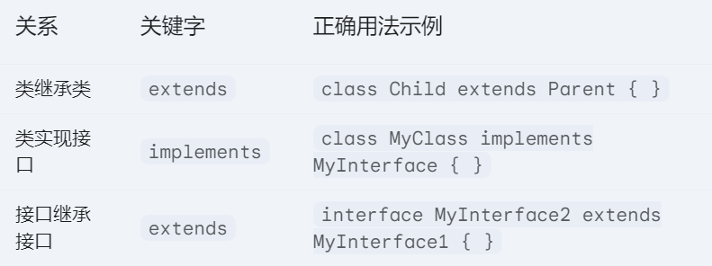
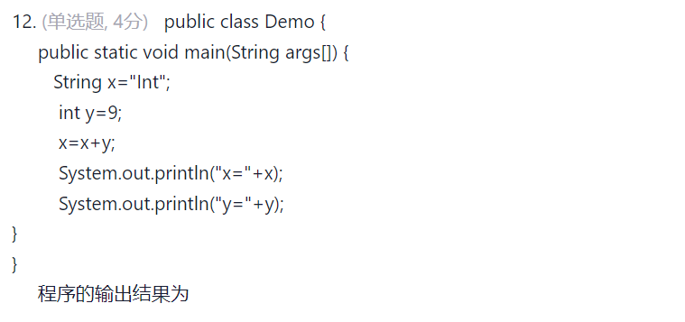
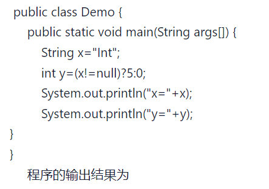
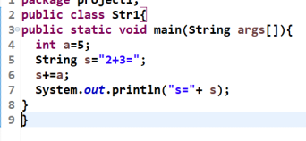
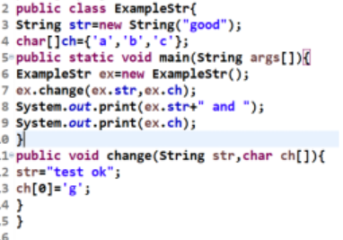
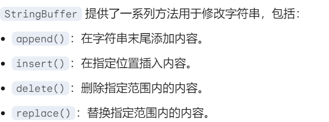

# **选择题**

## **1.综合选择题(每日必刷)**

(注意:2/3/7/9/12/13\*/14/15/16\*/28/30)

**试卷原题:**

为AB类的一个无形式参数无返回值的方法method书写方法头，使得使用**类名AB作为前缀就可以调用它**，该方法头的形式为( A )。

A. static void method( )    B.public void method( ) 

C. final void method( )     D.abstract void method( ) 

抽象方法不能通过类名直接调用，因为抽象类不能被实例化。

>   **加了static的变量也可以直接通过(class.name)进行访问**

****

Java源文件经编译后形成字节码文件，字节码文件的后缀是（B）

  A. .java   B. .class  C. .txt  D. .exe 

```java
.java（源代码） → 编译 → .class（字节码） → 类加载 → JVM执行 → 操作系统
```

****

设有类A，接口B，以下正确的使用格式为（C ）

A. class A extends B {  } B. interface B extends A { }

C. class A implements B { } D. interface B implements A { }



****

1. **(单选题)下列哪项字符序列可以做为Java标识符( C )?**

  A. true
  B. default
  C. _int
  D. good-class

  >   **只能包含字母/数字/美元符号/下划线->且不能数字开头<font color=red>(区分大小写)</font>**

***

2. **<font color=red>已知语句:int a=3; 则System.out.println(a++)的结果是( C )</font>**

  A. 2
  B. 5
  C. 3
  D. 4

***

**3. <font color=red>(单选题)字符序列( C )不是Java标识符。</font>**
  A. \$abc
  B. _abc
  C. good lucky
  D. Abcde

  >   **不能有空格**

****

4. **(单选题)JDK提供的编译器是( B )。**

  A. java.exe
  B. javac.exe
  C. javaw.exe
  D. javap.exe

****

5. **(单选题)对于int [][] a = {{1,2},{1,2,3},{1,2,3,4}}; 哪个叙述是错误的( C )?**

  A. a.length的值是3
  B. a[2].length的值是4
  C. a\[0][1]的值是1
  D. a\[2][0]的值是1

  >   **应该是2**

***

6. **(单选题)已知:int x=3,y=8;System.out.println(y%x);**
    **以上代码段执行后的输出结果为(B)。**

  A. 3
  B. 2
  C. 1
  D. 0

****

7. **<font color=red>(单选题)以下关于构造方法的描述错误的是( A )</font>**

  A. 构造方法的返回类型只能是void型。
  B. 构造方法是类的一种特殊方法，它的方法名必须与类名相同。
  C. 构造方法的主要作用是完成对类的对象的初始化工作。
  D. 一般在创建新对象时，系统会自动调用构造方法。

  >   **<font color=red>构造方法,根本就没有返回类型</font>**

****

8. (单选题)Java语言中，不能定义整型变量的是( C )。

  A. int
  B. byte
  C. double
  D. short

  >   **不是看精度,而是能存储的数据类型**

****

9. (单选题)下列类的定义中，错误的是( B )。

  A. class x { .... }
  B. public x extends y { .... }
  C. public class x extends y { .... }
  D. class x extends y implements y1 { .... }

  >   **<font color=red>权限可以省,但是class不能掉</font>**

****

10. **(单选题)下列( C )语句用于导入已创建的包。**

    A. class
    B. package
    C. import
    D. static

    ****

11. **(单选题)如果一个类被声明为( B )时，此类不能实例化对象。**
    A. final
    B. abstract
    C. protected
    D. static

    ****

12. **<font color=red>(单选题)下列对float变量的不正确声明是( D )。</font>**

    A. float foo = 12;
    B. float foo = (float)1.23;
    C. float foo = 2.02f;
    D. float foo = 3.03;

    >   **float的小数必须跟f或者float**

    ****

13. **<font color=red>(单选题)下列关于成员变量与局部变量的说法，正确的是( C )。</font>**!!

    A. 成员变量名不能与局部变量同名
    B. 成员变量没有默认值
    C. 局部变量没有默认值
    D. 成员变量的类型只能为Java的基本数据类型

    (**成员变量有默认值,局部变量没有默认值)**

    **(成员变量可以是引用类型[类/接口/数组]**)

    ```java
    public class Example {
        int memberVar; // 成员变量，默认值为 0
        public void myMethod() {
            int localVar; // 局部变量，没有默认值
            localVar = 10; // 显式初始化
        }
    }
    ```

    ****

14. **(单选题)下列关于修饰符混用的说法，错误的是( D )。**
    A. abstract不能与final并列修饰同一个类
    B. 含有abstract方法的类必须是abstract类
    C. abstract类中可以有非abstract方法
    D. static方法中能处理非static的数据成员

>   **解释**
>
>   **A.**
>
>   >   **`abstract` 表示抽象，意味类不完整，需要被继承并重写抽象方法才能用**
>   >
>   >   **`final` 表示最终的，不可被继承。这两个修饰符是互斥的**
>
>   **B.<font color=red>一个类有抽象方法,一定是个抽象类</font>**
>
>   **C.<font color=red>一个类是抽象类,里面也可以有非抽象类</font>**
>
>   **D.<font color=red>静态方法只能处理静态成员</font>**

****

15.   **<font color=red>(单选题)以下关于继承的叙述正确的是( A )。</font>**
      
      A. 在Java中类只允许单一继承
      B. 在Java中一个类只能实现一个接口
      C. 在Java中一个类不能同时继承一个类和实现一个接口
      D. 在Java中接口只允许单一继承

**解释:**

>   **单一继承:`class dog extends Animal`(正确)**
>
>   **非单一继承:`class dog extends Animal,mammals`(错误)**

**如果需要非单一继承:使用类+继承/+接口的表示**


****

16.   (单选题)下列哪个叙述是正确的(  D )。
      A. 一个类最多可以实现两个接口。
      B. 如果一个抽象类实现某个接口，那么它必须要重写接口中的全部方法。
      C. 如果一个非抽象类实现某个接口，那么它可以只重写接口中的部分方法。
      D. 允许接口中只有一个抽象方法。

**解释:**

>   **1.一个类可以有多个接口**
>
>   **2.一个<font color=red>抽象类</font>实现某接口,可以实现接口中的部分或全部方法或完全不实现。**
>
>   >   **可以交给子类实现,但是最终还是要实现的**
>   >
>   >   **<font color=red>->如果子类是抽象类,还可以继续下传</font>**
>   >
>   >   **<font color=red>->如果子类是非抽象类,就必须实现方法</font>**
>   >
>   >   ```java
>   >   //Drawable(AB)->Shape(AB)->Circle(NAB)(必须实现)
>   >   interface Drawable {
>   >      void draw();
>   >      void resize(int width, int height);
>   >   }
>   >   
>   >   abstract class Shape implements Drawable {
>   >      protected int x;
>   >      protected int y;
>   >      public Shape(int x, int y) {
>   >          this.x = x;
>   >          this.y = y;
>   >      }
>   >      @Override
>   >      public void resize(int width, int height) {
>   >          System.out.println("Resizing shape to width: " + width + ", height: " + height);
>   >      }
>   >   }
>   >   
>   >   class Circle extends Shape {
>   >      private int radius;
>   >      public Circle(int x, int y, int radius) {
>   >          super(x, y);
>   >          this.radius = radius;
>   >      }
>   >   
>   >      @Override
>   >      public void draw() { // Circle 必须实现 draw() 方法
>   >          System.out.println("Drawing a circle at (" + x + ", " + y + ") with radius " + radius);
>   >      }
>   >   }
>   >   
>   >   public class Main {
>   >      public static void main(String[] args) {
>   >          Circle circle = new Circle(10, 20, 5);
>   >          circle.draw();
>   >          circle.resize(100, 50);
>   >      }
>   >   }
>   >   ```
>   >
>   >   **<font color=red>Shape不是继承,它是实现了接口,所以使用implements(所以不用super)</font>**
>   >
>   >   **Circle需要继承,所以在构造方法中调用super关键字**
>
>   **3.一个非抽象类实现一个接口时，必须实现接口中的所有方法**
>
>   >   ```java
>   >   interface MyInterface {
>   >       void method1();
>   >       void method2();
>   >   }
>   >   
>   >   // 错误！ConcreteClass 没有实现 method2，编译错误
>   >   // class ConcreteClass implements MyInterface {
>   >   //     @Override
>   >   //     public void method1() {
>   >   //         System.out.println("ConcreteClass implements method1");
>   >   //     }
>   >   // }
>   >   
>   >   // 正确！ConcreteClass 实现了 MyInterface 的所有方法
>   >   class ConcreteClass implements MyInterface {
>   >       @Override
>   >       public void method1() {
>   >           System.out.println("ConcreteClass implements method1");
>   >       }
>   >      @Override
>   >       public void method2() {
>   >           System.out.println("ConcreteClass implements method2");
>   >       }
>   >    }
>   >   ```
>   >   

****

17.   <font color=red>**(单选题)Parent类为Child类的父类，Child类的正确声明语句为( C )。**</font>
      A. class Child extend Parent
      B. class Parent extends Child
      C. class Child extends Parent
      D. final abstract class Child extends Parent

      >   **还是经典的final和abstract矛盾**

****

18.   **(单选题)下列( D )语句是正确的float变量的定义语句。**
      A. float math=65.1D;
      B. float math=65.0;
      C. float math=6e2;
      D. float math=65.1f;

      >   **<font color=red>float仅对整数可以不加f,其余都要加</font>**

****

19.   **(单选题)下列关于成员变量与局部变量的说法，正确的是( C )。**
      
      A. 成员变量名不能与局部变量同名
      B. 成员变量没有默认值
      C. 局部变量没有默认值
      D. 成员变量的类型只能为Java的基本数据类型
      
      >   **第13题一样的**

****

20.   **(单选题)下列( C )语句用来创建包。**
      
      A. import
      B. class
      C. package
      D. public

****

21.   **(单选题)关于被私有访问控制符private修饰的成员变量，以下说法正确的是**( C )。
      
      A. 可以被三种类所引用:该类自身、与它在同一个包中的其他类、在其它包中的该类的子类。
      B. 可以被两种类访问和引用:该类本身、该类的所有子类。
      C. 只能被该类自身所访问和修改。
      D. 只能被同一个包中的类访问。

>   **结论记住!!**

****

22.   **(单选题)如果一个类被声明为( A )时，此类不能有子类。**
      
      A. final
      B. abstract
      C. protected
      D. static

****

23.   **(单选题)以下关于构造方法的描述错误的是( A )**

      A. 构造方法的返回类型只能是void型。
      B. 构造方法是类的一种特殊方法，它的方法名必须与类名相同。
      C. 构造方法的主要作用是完成对类的对象的初始化工作。
      D. 一般在创建新对象时，系统会自动调用构造方法。

>   **上面的一个意思,构造方法没有返回类型**

****

24.   **(单选题)下列哪个方法与public void add(int a){}不是合理的重载方法( B )。**
      A. public void add(float a){}
      B. public int add(int a){}
      C. public void add(long a,double b){}
      D. public void add(int a,int b){}

>   **重载仅允许修改参数的数量和类型**
>
>   (这里修改方法了,不能返回值)

****

25.   **(单选题)若有定义语句**
      int array[]={1,2,3,4,5};
      则对array数组元素正确的引用是( B )。
      A. array[5]
      B. array[4]
      C. array(5)
      D. array(4)

>   **就是查找数组的元素,只有B没有越界**

****

26.   **(单选题)下面哪个是Java中<font color=red>main()函数</font>的合法参数( C )。**
      A. char args[]
      B. char args[][]
      C. String args[]
      D. String args

>   **定义了一个字符串数组**
>
>   **`public void main(String args[]){}`**

****

27.   **(单选题)要使类中的某个数据成员变量只能被同一个类中访问到，该变量可用什么修饰符修饰( C )?**
      A. protected
      B. public
      C. private
      D. 应不加修饰符

****

28.   **<font color=red>(单选题)下列哪个叙述是正确的 ( A ) 。</font>**
      A. 5.0/2+10的结果是double型数据。
      B. (int)5.8+1.0的结果是int型数据。// double
      C. '苹'+ '果'的结果是char型数据。 // String
      D. 10+'a'的结果是char型数据。 // int Unicode

****

29.   **(单选题)以下选项中能正确表示Java语言中一个整型常量的是( B )。**
      A. 12.0 //浮点数
      B. -20 
      C. 1,000 //不能用逗号
      D. 4 5 6 //不能用空格

****

30.   **<font color=red>(单选题)有一java程序，主类名是AB，那么保存它的源文件名是( C )。</font>**
      A. AB
      B. AB.class
      C. AB.java
      D. AB.c

      >   **`AB.class`是`AB.java` 编译后生成的文件**
      >
      >   **`AB.class`是JVM可以执行的字节码文件,是编译器的输出**
      >
      >   (.java->javac->.class)

****

## **2.单元测试题**

#### **1.第2章选择作业**

(1(原题)/3(原题)/6/7/8(原题)/13/15/18)

1. **<font color=red>判断合法性</font>**

-   A. $abc
-   B. _abc
-   C. good lucky //有空格
-   D. Abcde

****

2. (单选题, 4分) 字符序列（  C ）是正确的Java标识符。

-   A. true  //不能关键字
-   B. 2ab //不能数字开头
-   C. _int  
-   D. good-class //符号只能使用美元和下划线

****

3. **<font color=red>(单选题, 4分)Java语言中，不能定义整型变量的是（ C ）。 (综合)</font>**

-   A. int
-   B. byte
-   C. double
-   D. short

****

4.   在Java 中，表示换行符的转义字符是( C  )。

-   A. \t
-   B. \b
-   C. \n
-   D. \d

****

5. (单选题, 4分)下列字符串中，不是Java关键字的是（  C  ）。 

-   A. while 
-   B. switch 
-   C. number 
-   D. import

****

6. **<font color=red>(单选题, 4分) 以下 Java语句中的变量均已正确定义且数据类型不会产生冲突，合法的赋值语句是（ B  ）。</font>**  

-   A. x==y; //不是赋值语句
-   B. ++j;
-   C. x=int(y); //<font color=red>强制转换的语法错误->x = (int) y;(类型打括号)</font> 
-   D. x=x+1=6; // =是右结合的<font color=red>(和C和C++不一样,a=b=1都不合法)</font>

****

7.   **<font color=red>(单选题, 4分) 以下的变量定义中，不合法的语句是（ A ）。</font>** 

-   A. char ch="a"; // <font color=red>java中使用""是不合法的,char只能是''</font>
-   B. boolean flag=true; 
-   C. float r=1/2; 
-   D.  int k=1+'a';

****

8. **<font color=red> 下列（ D ）语句是正确的float变量的定义语句。</font>**

-   A. float math=65.1; // 缺f

-   B. float math=65.0; // 缺f

-   C. float math=6e2; // 默认double,缺f

-   D. float math=65.1f;

    <font color=red>(只要除了整数,都要加f)</font>

****

9.   (单选题, 4分) 下列哪项结果不是double型数据？(D)

-   A. 5.0/2+10
-   B. (int)5.8+1.0
-   C. '苹'+1.2
-   D. (int)1.5+2

****

11. (单选题, 4分) 下面(  D  )表达式是不合法的。

-   A. String x="Int";

     int y=0;

     x+=y; 

-   B. String x="Int ";

    int y=(x!=null)?5:0;

-   C. String x="Int ";

     int y=9;

     x=x+y; 

-   D. String x="Int "; 

    int y=5;

     if(x==y){x=x+8;}  // <font color=red>x是字符串,不能和数字比较</font>

****

12.   **D**

      

      A. 语法错误，编译不通过

      B. 编译通过，无输出结果

      C. x=Int+9;y=9;

      D. x=Int9;y=9;

****

12.   **<font color=red>(单选题, 4分)下列语句执行后，i的值为（ C ）。 int i=6; i+=++i-1</font>**;

-   A. 11
-   B. 7
-   C. 12 // 6+(7-1)=12
-   D. 10

****

14.   



x=Int y=5

****

**15.若 int x=5，y=28，z=31，w=9;  **

**<font color=red>System.out.println( x>y?x:z<w?z:w );  输出结果为（ 9 ）</font>**

>   **x>y?[x]:[z<w?z:w]**(后件Ture)
>
>   **z<w?[z]:[w]**(后件True)
>
>   >   最后的结果为w,即9
>>
>   >   满足则执行对应的位置

****

16. **数学运算-5< x <18在Java中的正确表示形式为（ D ）。** 

-   A. x>-5||x<18
-   B. x！=-5|| x！=18
-   C. x！=-5&& x！=18
-   D. x>-5 && x<18

****

17.   **<font color=red>字符变量ch是小写英文字符的逻辑表达式为（ B ）。</font>**

-   A. ch>='z’&& ch<='a’
-   B. ch>='a’&& ch<='z’
-   C. ch>='A’&& ch<='Z’
-   D. ch>='a’|| ch<='z’

****

18. **<font color=red>int i=5,j; j=i--; i和j的值为（ B ）。</font>** 

-   A. i=5,j=5
-   B. i=4,j=5
-   C. i=5,j=4
-   D. i=4,j=4

****

20.   ```java
      import java.util.Scanner;
      public class Example2_3 {
          public static void main (String args[ ]){
              System.out.println("请输入若干个数，每输入一个数回车确认");
              System.out.println("最后输入数字0结束输入操作");
              ======================================
              Scanner reader=new Scanner(System.in);
              double  x, sum=0;
              x = reader.nextDouble(); //输入的形式
              ======================================
              while(x!=0){
                 sum=sum+x;
                 x=reader.nextDouble(); //输入的形式
              }
              System.out.println("sum="+sum);
          }
      }
      ```
      
21.   ```java
      import java.util.Scanner;
      public class Example2_3 {
          public static void main (String args[ ]){
             System.out.println("请输入若干个数，每输入一个数回车确认");
             System.out.println("最后输入数字0结束输入操作");
             Scanner reader=new Scanner(System.in); //输入初始化的形式
             int x, sum=0;
             x = reader.nextInt();
              while(x!=0){
                 sum=sum+x;
                 x=reader.nextInt();
              }
              System.out.println("sum="+sum);
          }
      }
      ```

****

#### **2.第3章选择作业**

***

(2/4/7/8/10)

1.   已知语句：double price[]={23.7,78.9,123.5,890,1234.7};          

     price.length( )的值为（  D  ）。

A. 4

B. 8

C. 6

D. 5

****

2.   **<font color=red>关于break语句和continue语句的说法，不正确的是（C）。</font>** 

A. break语句可出现在循环体中，用以终止整个循环

B. continue语句现在循环体中，用以结束本次循环

C. continue语句可出现在swtich语句中，用以结束swtich语句

   <font color=red>("在循环语句中"continue语句不能结束switch,只能跳过当前语句)</font>

D. break语句可出现在swtich语句中，用以结束swtich语句

****

3. (单选题, 5分)若有定义语句; int array[]={1，2，3，4，5};则对array数组元素正确的引用是（ C ）。  

-   A.  array[5]   // 越界
-   B.  array(5)   // 非法
-   C.  array[4]   
-   D.  array(4)   // 非法

****

4. **<font color=red>若a和b为int型变量且已赋值，下列语句中不正确的是 (C)</font>**

-   A. switch(a+b) { } 
-   B. switch(a){  }
-   C. switch(a+b*2.0) { } 
-   D. switch(a%b){ }

**<font color=red>switch的表达式后面类型:byte/short/char/int/enum/String</font>**

>   **C选项的表达式中数据类型是double,不合法**

6.   ```java
     public class Example{
         public static void main(String args[]){
             int m=10,n=0;
             while(【代码】){
                 n++;
             }
         }
     }
     ```

     关于【代码】的表示，不正确的是（ B ）。 

-   A. m-->0
-   B. m--=0
-   C. m--==0 //自减运算符只能用于变量，而不能用于赋值表达式的左侧。
-   D. m--<0

7.   ```java
     // 下列代码实现计算1！+2！+...+7!的功能
     
     public class Xiti1 {
               public static void main(String args[]) {
               int sum = 0, i = 1, p = 1;
               do {  
                   p = p * i;
               	  sum = sum + p;
               	  i++; 
               } while(i<=7); // 注意是小于等于
           System.out.println("sum=1!+2!+3!+...7!="+sum);
        }
     }
     ```

8.   ```java
     public  class Test{
         public  static  void   main(String  args[ ]){  
             int  temp ;
             int  a[ ] = {7,2,1,4,8,9,5,3,6,7};
                 for  ( int i = 0 ; i < a.length-1; i ++ ){
                     for  (int  j = i+1 ; j < a.length ; j++ ){
                       if  ( a[j]<a[i] ) {
                        temp =a[i];
                        a[i] = a[j];
                        a[j] = temp;  
                       }    
                     }  
                 }
                 for (int i =0 ; i<a.length; i++ )
                     System.out.print (a[i]+"  ");  
         }  
     }
     // D. 1  2  3  4  5  6  7  7  8  9 
     // 这是?冒泡排序?
     ```

9.   ```java
     // 输出1~100内的素数
     public class Example {
        public static void main(String args[]) {
            int i, j;
            for(j=2;j<=100;j++) {   
               for( i=2;i<j;i++) {
                  if(j%i==0) 
                    break;
               }
               if(i>j/2) {  
                  System.out.println(""+j+"是素数");
               }
            }      
        }
     ｝
     ```

10.   ```java
      // 判断执行次数
      int  x=5,y=17;
      	 do {
      		 y-=x;
      		 x+=2;
           } while(
               x<y
           );
      // 循环体需要执行两次
      ```

11.   ```java
      // 计算1+3+5+9+11+13+15的和
      public class Example {
         public static void main(String args[]) {
             int sum=0,i;
             for( i=1;i<=15;i++) {
                if(i%2==0) {           
                   continue; // 跳过偶数
                }     
                sum=sum+i;
             }
             System.out.println("1+3+5+...+15的和sum="+sum);
      	}
      }
      ```

****

#### **3.第4章选择作业(父类和修饰)**

****

(1/2/4(错题)/5(错题)<->10/ 6(原题)/8)

1.   关于Java源程序的说法，正确的是（ C  ）。 

-   A. Java应用程序由若干个类构成，这些类必须存放在同一个.java文件中
-   B. Java源文件必须含有包含main()方法的主类
-   C. Java应用程序由若干个类构成，这些类可以存放在同一个.java文件中，也可以存放在不同的.java文件中，但只能有一个.java文件中含有包含main()方法的主类
-   D. Java源文件如果含有包含main()方法的主类，该主类必须为public类

>   **A:这些类不用放到一个.java文件**
>
>   **B:文字游戏:运行必须需要包含main()方法,但是没有也成立**
>
>   **D:<font color=red>.java源文件可以没有public的类(其中的每个类名可以和文件名不一样)(如果有且仅有一个public类,该类的名字和源文件的文件名相同)</font>**

****

2. **<font color=red>(单选题, 4分)下列哪个特点不是面向对象的主要特征（ C ）</font>** 

-   A. 封装
-   B. 继承
-   C. 解释执行
-   D. 多态

****

3. 下列类声明语句中，不正确的是（ C  ）。 

-   A. class Hello{}
-   B. abstract class Hello{}
-   C. protected class Hello{}
-   D. public class Hello{}

****

4. **<font color=red>有一段java 应用程序，它的主类名是Bc，那么保存它的源文件名是（ A ）</font>**

-   A. Bc.java  
-   B. Bc.class 
-   C. Bc 
-   D. 都对

****

5. <font color=red>定义一个类名为"MyClass.java"的类，**并且该类只能被同一个包中的所有类访问**，那么该类的正确声明应为（B）。</font>

-   A. private class MyClass {}
-   B. class MyClass{}  // 默认访问权限(同包)
-   C. public class MyClass{}  // 包括不同包的不同类
-   D. public abstract class MyClass{}

****

6. (单选题, 4分)下列关于成员变量与局部变量的说法，正确的是（ C  ）。

-   A. 成员变量名不能与局部变量同名
-   B. 成员变量没有默认值
-   C. 局部变量没有默认值
-   D. 成员变量的类型只能为Java的基本数据类型

****

7.   ```java
     // 长方形的类的实现
     class Rectangle{
         double len，width;  
         void setRec(double  a, double b) {   
             len=a;   
             width=b; 
         }
         double computeArea(){      
     		return  len*width; // 问题
         }
     }
     ```

****

8.   **<font color=red>下列关于成员变量与局部变量的说法，不正确的是（ D  ）。</font>**

A. 成员变量是指在类内、方法外声明的变量

B. 成员变量的类型可以是Java的基本数据类型，也可以是数组、对象和接口等引用类型

C. 如果方法中的局部变量与成员变量同名，则该成员变量在方法内被隐藏

D. 在方法中无法使用被隐藏的成员变量 

>   **隐藏:指子类声明的成员变量 和 父类 同名,可以通过super关键字**
>
>   >   **如果是类中的不同方法 则使用this关键字**

****

**9.关键字中能作为Java类及其成员修饰符的是 public**

****

10.   **若要定义某类所在的包外的所有类都能访问该类，则该类的修饰符应该为 D**

-   A. frendly
-   B. abstract
-   C. protected
-   D. public

>   **对应第5题目,同包导入**

****

#### **4.第4章选择作业(构造方法)**

****

(1/2(原题)/3(原题)/6/8~10(简单看一下即可))

1.   **<font color=red>下列关于构造方法的说法，不正确的是（D）。</font>**

-   A. 构造方法与所在的类同名且无返回值类型
-   B. 一个类中可以包含若干个构造方法，这些构造方法必须具有不同的参数
-   C. 若类中没有构造方法，创建该类的对象时系统用默认的构造方法
-   D. 构造方法可以出现在类定义体中的任何位置

>   **必须在所有成员变量声明之后,才能构造方法(成员必须先声明)**

****

2.   **<font color=red>以下关于构造方法的描述，错误的是（ A ）。</font>**

-   A. 构造方法的返回类型只能是void型
-   B. 构造方法是类的一种特殊方法，它的名字必须与类名相同
-   C. 构造方法的主要作用是完成对类的对象的初始化工作
-   D. Java通过new运算符调用类的构造方法创建该类的对象

**(原题:没有任何返回类型)**

****

3.   **<font color=red>关于构造方法的说法，哪个是正确的（C）。</font>**

-   A. 一个类只能有一个构造方法 
-   B. 一个类可以有多个不同名的构造方法
-   C. 构造方法的名字与类名相同
-   D. 构造方法必须有返回数据类型

****

4.下列关于Hello类的叙述，叙述正确的是（D）。

```java
class Hello {   
    Hello(int m){   }   
    hello() {   }   
    int hello() {     
        return 20;   
    }   
} 
// 错误原因:第二个hello和第三个hello的参数列表相同,违反重载
```

-   A. Hello类有两个构造方法
-   B. Hello类的int hello()方法是错误的方法
-   C. Hello类没有构造方法
-   D. Hello无法通过编译，因为其中的hello()方法的方法头错误（没有类型）

****

5.   (单选题, 4分)设有如下已定义的类 Point，实例化 Point类的对象的正确语句是（ D ）。

     ```java
     class Point {   
         int x,y; 
         Point(int a,int b) {    
             x=a;    
             y=b; 
         }
     }
     ```

-   A. Point p1=new (10,10)；
-   B. Point p1=new point(10,10)；
-   C. Point p1=new Point()；
-   D. Point p1=new Point(10,10)；

****

6.   **<font color=red>下列Example类体定义中哪个【代码】是错误的？ 【代码3】</font>**

```java
class Example{
    float x;  //【代码1】
    long y=(int)x;   //【代码2】
    public void  f_method(int n){
        double m;  //【代码3】 错误局部变量在使用前必须初始化。
        double t=n+m;  //【代码4】 n是传入的已知,所以没错
        return t;
    }
}
```

****

7. (单选题, 4分)下列关键字中能作为Java类及其成员修饰符的是（ B）。

-   A. import
-   B. public
-   C. this 
-   D. class

****

8.   运行结果是?

     ```java
     class Bc{
           int x=100,y=200;
           public void setX(int x) {
           	this.x=x;
           }
           public void setY(int y) {
          	 this.y=y;
           }
           public int getSum() {
           	return x+y;
           }
         }
         public class ThisDemo {
             public static void main(String args[]) {
                 Bc bc=new Bc();
                 bc.setX(-100);
                 bc.setY(-200);
                 System.out.println("sum="+bc.getSum());
             }
     }
     // sum = -300
     ```

****

9.填入代码

```java
class Shape{ 
   float  height，depth; 
   Box(float a,【代码】)  {  //float c
        height =a;
        depth = c;
   }
    float area()  {
        return  height * depth;
    }
}
```

****

10.运行结果

```java
public class Example {
    public static void main(String args[]) {
        int d=32;
        Dec dec=new Dec();
        d-=dec.decrement(21);
        System.out.println(d);
        }
    }
    class Dec{
        public int decrement(int decMe) {
            decMe-=1;
            return  decMe;
   		 }
	}
}
// 12   
// 因为32-(21-1)=12
```

****

#### **5.第4章选择作业(包和调用)**

(4(重点!!)<->7(原题)/6)

****

1.   Java中用来创建包的关键字是（ C ）。 

A. import

B. class

C. package

D. public

****

2. (单选题, 5分)Java中用于导入已创建的包的关键字是（  C ）。

-   A. class
-   B. package
-   C. import
-   D. static

****

3. (单选题, 5分)下列类声明语句中，不正确的是（ A  ）。

-   A. protected class Hello{}
-   B. public abstract class Hello{}
-   C. class Hello{}
-   D. public class Hello{}

****

4. **<font color=red>关于被保护访问控制符 protected修饰的成员变量，以下说法正确的是（ A ）。</font>**

-   A. 可以被三种类所引用：该类自身、同一个包中的其他类、在其他包中的该类的子类 
-   B. 只能被两种类访问和引用：该类本身、该类的所有子类 
-   C. 只能被该类自身所访问和修改  
-   D. 只能被同一个包中的类访问

```txt
Java控制访问符:

public:可以被任何类访问
protected:可以被该类自身/同一个包中的其它类/其它包的该类的子类 访问
default:同一个包的其它类访问
private:只能被该类自身访问
```

****

5.不能作为常量的修饰符(void)(final/static/public可以用作修饰符)

****

6. **<font color=red>下列关于包的说法，不正确的是（ B ）。</font>**

-   A. <font color=red>同一包内的类和接口不能重名，同名类可放在不同包内</font>

-   B. 1个Java源程序中可以有两条或两条以上的package 语句

    >   **一个 Java 源文件中最多只能有一个package语句。明确规定**

-   C. 包package是一组相关的类和接口的集合

-   D. package 创建包语句必须为Java源程序的第1条可执行语句

****

7. **<font color=red>要使类中的某个成员变量只能被同一个类中访问到，使用的访问控制符是（ C）。</font>**

-   A. protected
-   B. public
-   C. private
-   D. 应不加修饰符

****

8.   (单选题, 5分)下列关键字中（ D ）不能用作Java类中成员变量的访问权限修饰符。

-   A. public
-   B. private
-   C. protected
-   D. abstract

****

9.

```java
class Tom {
  private int x = 120;
  protected int y = 20;
  int z = 11;
  private void f() {
     x = 200;
     System.out.println(x);  
  }
  void g() {
     x = 200;
     System.out.println(x); 
  }
}
public class A {
  public static void main(String args[]) {
       Tom tom = new Tom();
       tom.y = 33;   //【代码1】
       tom.z = 55;   //【代码2】 错误
       tom.f();     //【代码3】
       tom.g();     //【代码4】
   }
}
// 默认访问权限,如果想要使用需要调包or写成public语句
```

****

10.代码填空,字符数组a中的所有字母都变成大写

```java
public class Example { 
 public static void main(String args[ ]) { 
   char a[]={'a','b','1','D','E','2'};
   for(int i=0;i<a.length;i++) { 
       if(【代码】)   
         a[i]=Character.toUpperCase(a[i]);
     for(int i=0;i<a.length;i++) 
         System.out.print(" "+a[i]);
    } 
}
// D. Character.isLowerCase(a[i])
"题目有错,具体方法没说"
```

****

#### **6.第5章选择作业(继承)**

(1(原题)/3/5/7/8(重点!!)/9)

**<font color=red>重写的方法访问权限必须为public</font>**

****

1.   **<font color=red>下列关于子类继承父类的成员的描述中，不正确的是（ C ）</font>**

-   A. 当子类中出现成员方法头与父类成员方法头相同的方法时，子类成员方法覆盖父类中的同名成员方法
-   B. 方法重载是在程序编译时处理，方法覆盖是在程序运行时处理
-   C. 子类继承父类中的所有成员变量和成员方法  // 可选
-   D. 子类使用super关键字访问和调用被子类隐藏的父类中的同名成员变量和方法

****

2. **假设C是B的子类，B是A的子类，cat是C类的一个对象，bird是B类的一个对象，下列哪个叙述是错误的？ D**

-   A. cat instanceof B的值是true

-   B. bird instanceof A的值是true

-   C. cat instanceof A的值是true

-   D. bird instanceof C的值是true

    ```
    A
    |
    B-bird
    |
    C-cat
    
    //instanceof 在 Java 中是一个二元运算符
    用于测试一个对象是否是一个类的实例，或者是一个接口的实现类的实例。
    它返回一个布尔值（true 或 false）。
    ```

****

3.

```java
class Father {
   private int money =12;
   float height;
   int seeMoney(){
      return money ;     //【代码A】
   } 
}
class Son extends Father {
   int height;
   int lookMoney() {
      int m = seeMoney();      //【代码B】
      return m;             
   }
}
class E {
   public static void main(String args[]) {
      Son erzi = new Son();
      erzi.money = 300;       // 【代码C】
      erzi.height = 178;      //【代码D】
   }
}
// 代码B错误,private不允许修改
```

****

4.   Parent类为Child类的父类，Child类的正确声明语句为（ C ）。

-   A. class Child extend Parent
-   B. class Parent extends Child
-   C. class Child extends Parent
-   D. final abstract class Child extends Parent

****

5.**<font color=red>判断不正确</font>**

```java
class Am {
   static int m;
   static void f(){
       m = 20 ;          //【代码A】
   } 
}
class Bm extends Am {
   void f()              //【代码B】 // 静态方法不能被重写
   {  
       m = 222 ;         //【代码C】      
   } 
}
class Em {
   public static void main(String args[]) {
      Am.f();            // 【代码D】  
   }
}

//静态方法(static)
属于类的方法，而不是类的实例。可以通过类名直接调用，例如 Am.f()。
静态方法不能被重写（Override），但可以被隐藏（Hide）。
    
//实例方法（Instance）
属于类的实例的方法。必须通过对象实例调用，例如 am.f()
（其中 am 是 Am 类的实例）。实例方法可以被重写。

// 方法重写（Method Override）
子类提供了一个与其父类具有相同方法签名（方法名、参数列表和返回类型）的方法。
"注意,这里的方法名.参数列表,返回类型都是完全相同的"
    
//方法隐藏（Method Hiding）： 
子类定义了一个与其父类具有相同方法签名（方法名和参数列表），
但是是静态的方法。父类的静态方法被子类的静态方法隐藏。
```

****

6.

```java
class A { 
   public float getNum() {
       return 3.0f;
   }     
} 
public class B extends A { 
      public void getNum(){ } 
}  
// 编译错误
// 前面一样的错误,方法重写但是参数相同
```

****

7.**<font color=red>注意这里super的用法</font>**

```java
class Aw {
	double f(double x,double y){
		return x+y;
	}		
}
class Bw extends Aw{
	double f(double x,double y){
		double m= super(x,y); //注意这里super的用法
		return m+x*y;	}

	｝
```

****

**<font color=red>8.判断子定义是否正确</font>**

```java
class A{
    protected float methd_A(float x,float y){
       return x-y;
    }
}
```

```java
A.
class B extends A{
     float methd_A(float x,float y){ 
        return x+y;
  }
}
B.
class B extends A{
	public float methd_A(float x,float y){
        return x*y;
  }
}
C.
class B extends A{
     double methd_A(float x,float y){
        return x+y;
  }
}
D.
class B extends A{
 	private float methd_A(float x,float y){
        return 2*x+y;
  }
}

// 重写方法
1.名称:和被重写的方法 具有相同的名称和类型
2.访问修饰符:重写方法的修饰符,比原先方法一样或者更宽纵
    public > protected > (default) > private
```

****

9.关于下面代码说法正确的是:

```java
class Ad{
	public int getNum(){
		return 25;
	}
}
class Ba extends Ad{
	public void getNum(double d){}//【代码】
}
```

关于【代码】的说法，正确的是（ C ）。

-   A. 产生编译错误
-   B. 【代码】对父类中的getNum()方法进行重写
-   C. 【代码】与父类中的getNum()方法互为重载
-   D. 以上说法都不对

****

10.

```java
class Aw {
	static int g(int n){
		return n*n;	}	
}
class Bw extends Aw{
	static int g(int n){//重写父类中的g()方法.这里考察修饰符
	  	int m=Aw.g(n);
	  	return m+n;
    }	
}
```

****

#### **7.第5章选择作业(抽象继承)**

****

(1(原题)/4(原题)/5(重要,原题)/11/13)

**<font color=red>重写的方法访问权限必须为public</font>**

1. **<font color=red>(单选题, 5分)下列哪些叙述是正确的（ B ）。</font>** 

-   A. abstract类中只能有abstract方法
-   B. abstract类中可以有非abstract方法
-   C. final类可以有子类
-   D. 可以用final和abstract同时修饰一个方法

****

2.

```java
abstract class A{
  abstract protected int getID();
}
class B  extends A {
    int getID()｛
        return 2020001;
    ｝
}
// 编译错误
// A中是protected修饰符,B中是默认修饰符default,子类不能比父类更严格
```

****

3.

```java
abstract class A{
  abstract protected int getID();
}
class B  extends A {
	public  int  getID(){
         return 20;
	}
}
```

****

4. **<font color=red>(单选题, 5分)下列关于修饰符混用的说法，错误的是（ D  ）。</font>**

-   A. abstract不能与final并列修饰同一个类
-   B. 含有abstract方法的类必须是abstract类
-   C. abstract类中不可以有private的成员
-   D. static方法中能处理非static的数据成员

****

5.   **<font color=red>下列哪个叙述是正确的？(D)</font>**

-   A. final 类可以有子类
-   B. abstract类中只可以有abstract方法
-   C. abstract类中可以有非abstract方法，但该方法不可以用final修饰
-   D. 不可以同时用final和abstract修饰同一个方法

****

6.   (单选题, 5分)下列哪个叙述是正确的（ B ）。

-   A. 子类继承父类的构造方法
-   B. 子类继承的方法只能操作子类继承和隐藏的成员变量
-   C. 子类重写或新增的方法也能"直接操作"被子类隐藏的成员变量
-   D. abstract类的子类必须为非abstract类

>   **子类方法**
>
>   **不能直接访问被隐藏的父类成员变量。它们只能访问子类自己声明的同名变量。**

****

7.   (单选题, 5分)如果一个类被声明为（V ）时，此类不能实例化对象。

-   A. final
-   B. public
-   C. abstract 
-   D. 都不对

****

8.

```java
abstract class Takecare {
     static int f() { 
         return 2020 ;
     }          //【代码A】
     protected void speakHello() {}     //【代码B】
     public abstract  static void cry();    //【代码C】
     abstract float g();                        //【代码D】 
    
 // 代码C错误,因为static比默认
```

****

9.

```java
abstract class A {            
   abstract float getFloat ();  //【代码A】
   void f()                //【代码B】
   { }

public class B extends A {
   private float m = 1.0f      //【代码C】
   private float getFloat ()     //【代码D】
   {  
       return m;
   }
}
// 错误是D,子类的修饰符严格
```

****

10.下列叙述正确的是（ B ）。

-   A. 子类重写父类方法时可以降低访问权限
-   B. 子类重写父类方法时不可以降低访问权限
-   C. final类可以被继承   
-   D. 抽象类中只能含有抽象方法

****

11.<font color=red>一个Java类可以用extends继承多个父类。(FALSE)</font>

>   **文字游戏:这里指的是同时extends多个类**

****

12.   (判断题, 3分)Java程序中，所有类的共同祖先类为Object。(TRUE)

****

13.   <font color=red>父类中的非static方法可以被子类重写为static方法(FALSE)</font>

      >   **static要求严格,如果父类的static动了,子类就不符合了**

****

14.   创建子类对象时，Java虚拟机先执行子类构造方法，再执行父类构造方法(F)

****

#### **8.第5章选择作业(抽象继承2)**

(1(原题)/2/6(重点)/10)**<font color=red>重写的方法访问权限必须为public</font>**

1.   <font color=red>下列哪些叙述是正确的（ B ）。</font> 

-   A. abstract类中只能有abstract方法
-   B. abstract类中可以有非abstract方法
-   C. final类可以有子类
-   D. 可以用final和abstract同时修饰一个方法

****

2.

```java
bstract class A{
  abstract protected int getID();
}
class B  extends A {
/* // 下面是错误的,default的标识符比protected严格
    int getID()｛
        return 2020001;
    ｝
*/
}
// public > protected > default > private
/*
    public:任何类
    protected:同包+其它包
    default:仅同包
    private:仅自身类	
*/
```

****

3.

```java
abstract class A{
  abstract protected int getID();
}
class B  extends A {
    public  int  getID(){ // 正确的实现(类型正确)
       return 20;
    }
}
// 注意一定要和定义方式一致
```

****

4. (单选题, 5分)下列关于修饰符混用的说法，错误的是（ D  ）。

-   A. abstract不能与final并列修饰同一个类
-   B. 含有abstract方法的类必须是abstract类
-   C. abstract类中不可以有private的成员
-   D. static方法中能处理非static的数据成员

****

5. 下列哪个叙述是正确的？(D)

-   A. final 类可以有子类
-   B. abstract类中只可以有abstract方法
-   C. abstract类中可以有非abstract方法，但该方法不可以用final修饰
-   D. 不可以同时用final和abstract修饰同一个方法

****

6. **<font color=red>下列哪个叙述是正确的（ B ）。</font>**

-   A. 子类继承父类的构造方法 
-   B. 子类继承的方法只能操作子类继承和隐藏的成员变量
-   C. 子类重写或新增的方法也能直接操作 被子类隐藏的成员变量()
-   D. abstract类的子类必须为非abstract类

>   **隐藏:子类和父类的方法完全相同**
>
>   **重写:存在参数序列不同**
>
>   **子类新增的方法 也能 直接操作被子类隐藏的成员变量：这句话是正确的**
>
>   **子类重写的方法 也能 直接操作被子类隐藏的成员变量：这句话是错误的**
>
>   >   **<font color=red>子类隐藏的成员变量:通过和父类成员同名 隐藏的 父类对象</font>**
>   >
>   >   **所以这里子类重写的方法并不能直接操作父类隐藏成员变量(使用super)**

****

7.   (单选题, 5分)如果一个类被声明为（C）时，此类不能实例化对象。

-   A. final
-   B. public
-   C. abstract 
-   D. 都不对

****

8.   (单选题, 5分)抽象类TakeCare的定义代码中，不正确的语句是（ C ）。

```java
abstract class Takecare {   
    static int f() { 
        return 2020 ;
    }     //【代码A】   
    protected void speakHello() {}   //【代码B】  
    public abstract static void cry();  //【代码C】   
    // public static 重复
    abstract float g();            //【代码D】 
}  
```

-   A. 【代码A】
-   B. 【代码B】
-   C. 【代码C】
-   D. 【代码D】

****

9.【代码D】有问题(标识符严格)

```java
abstract class A {            
   abstract float getFloat ();  //【代码A】
   void f()                //【代码B】
   { }
}
public class B extends A {
   private float m = 1.0f;      //【代码C】
   private float getFloat ()     //【代码D】
   {  return m;
   }
}
```

****

10. **<font color=red>(单选题, 5分)下列叙述正确的是（ B ）。</font>**

-   A. 子类重写父类方法时可以降低访问权限
-   B. 子类重写父类方法时不可以降低访问权限
-   C. final类可以被继承   
-   D. 抽象类中只能含有抽象方法

>   **<font color=red>这里有个文字游戏,降低权限是指更加严格</font>**

****

11.   final类中的属性和方法都必须被final修饰符修饰。(FALSE)

****

#### **9.第7章选择作业(接口)**

(1(原题)/5/7(错题)/8/9/10/11/14(结论))

****

1. **<font color=red>关于接口的说法，正确的是（  C  ）。</font>**

-   A. 一个类最多只能实现两个接口
-   B. 抽象类实现某个接口，必须全部重写接口中的抽象方法
-   C. 接口的定义中可以只有1个抽象方法
-   D. 非抽象类实现某个接口，可以只重写接口中的部分抽象方法

>   **抽象类实现某个接口，可以不全部重写接口中的抽象方法。**
>
>   **非抽象类实现某个接口，必须全部重写接口中的抽象方法。**

****

2.   Java中用（ C ）关键字定义接口。 

-   A. class
-   B. extends
-   C. interface
-   D. implements

****

3.   Java中某个类实现接口，在类声明语句中用（ D ）关键字实现接口。 

-   A. interface
-   B. extends
-   C. abstract
-   D. implements

****

4. (单选题, 4分)下列哪个关键字不能用作常量的修饰符? (C)

-   A. final
-   B. static
-   C. void
-   D. public

>   **常量必须具有确定的类型,所以选择void**

****

5.

```java
interface TakeCare {
    void speakHello();          //【代码A】
    public abstract static void cry();        //【代码B】
    int f();                            //【代码C】
    abstract float g();                   //【代码D】
}
// B还是重复定义了
```

****

```java
interface Icom{
    int M=2000;
    int method();
}
class Example implements Icom{
	public int method(){
  		return 20+M;
	}
}
```

**<font color=red>接口定义的方法（包括方法名和参数列表）必须与实现类中的方法签名完全一致</font>**

****

7.**<font color=red>设以上类及接口均正确定义，下列语句中正确的是（ D ）。</font>**

```java
class A{}
class B{}
interface C{}
interface D{}
```

-   A. interface E implements C,D
-   B. interface E extends A,B
-   C. interface E implements A,B
-   D. interface E extends C,D

>   **<font color=red>接口可以用extends继承多个父接口</font>**

****

8.**<font color=red>设以上类及接口均正确定义，下列语句中正确的是（ D）。</font>**

```java
class A{}
class B{}
interface C{}
interface D{}
```

-   A. class E extends A,B  implements C,D
-   B. class E implements A,B extends C
-   C. class E implements B  extends C
-   D. class E extends A implements C,D

>   **<font color=red>Java中类只能单继承，接口可以多实现</font>**
>
>   **<font color=red>(类和接口唯一的搭配只能在类中实现接口)</font>**

****

9.

```java
interface AA{
   double f(double x,double y);
 }
class BB implements AA{
    public double f(double x,double y){
         return x*y;

    }
    int g(int a,int b){
        return a+b;
    }
}
```

>   **<font color=red>重写的方法访问权限必须为public</font>**

****

10.

```java
A.
interface Pcom {
   final int MAX=12.5;
   protected void add(int x,int y);
   float sum(float a,float b);
}
// 接口中的方法不能使用 protected 或 private 修饰符。
B.
interface Pcom {
   final int MAX=12.5;
   void add(int x,int y){};
   float sum(float a,float b){};
}
// 违反了接口方法不能有空方法体的规则
C.
interface Pcom {
   final int MAX=12.5;
   void add(int x,int y);
   float sum(float a,float b);
}
D.
interface Pcom {
   final int MAX=12.5;
   int add(int x, y); // 这里
   float sum(float a, b);
}
//缺少了 int 类型的参数 y 的类型声明。参数必须明确指定类型。
```

****

11. **<font color=red>下列关于接口的说法，不正确的是（ D ）。</font>** 

-   A. 如果一个非抽象类实现了某个接口，则该类必须重写接口中的所有方法
-   B. 如果一个类实现了某个接口，但没有重写接口中的所有方法，则该类必须为抽象类
-   C. 接口中的常量可以用接口名.常量名的方式访问
-   D. 接口中不仅可以定义常量，还可以定义变量

>   **<font color=red>接口的本质是契约或规范,所以不能定义变量</font>**
>
>   **可以定义的是:**
>
>   >   **1.常量（`public static final` 变量）**
>   >
>   >   **2.抽象方法（`public abstract` 方法）**
>   >
>   >   **3.默认方法（`default` 方法）**
>   >
>   >   **4.静态方法（`static` 方法）**

****

12.   以下关于继承的叙述正确的是（A）。

-   A. Java中类只允许单一继承 
-   B. Java中一个类只能实现一个接口 
-   C. Java中一个类不能同时继承一个类且实现一个接口
-   D. Java中接口只允许单一继承 

>   **<font color=red>Java中一个类能同时继承一个类且实现一个接口</font>**

****

13. (单选题, 4分)下列关于接口的说法，正确的是（ A ）。

-   A. 一个非抽象类实现某接口必须实现该接口中的所有方法 
-   B. 一个类只能实现一个接口 // 可以对应多个接口
-   C. 接口间不能有继承关系 // 可以有
-   D. 接口和抽象类没有区别 // 接口侧重定义行为规范,抽象类提供部分实现

****

14.   使用interface关键字声明接口时，只可以使用（ B ）修饰符修饰该接口。 

A. private

B. public

C. final

D. protected

****

15. (单选题, 4分)下列关于接口的叙述，正确的是（ C ）。

-   A. 一个类最多可以实现两个接口
-   B. 如果一个抽象类实现某个接口，必须重写接口中的所有方法
-   C. 接口中的方法可以是抽象方法和static方法
-   D. 如果一个非抽象类实现某个接口，它可以只重写接口中的部分方法

>   **接口中只能:抽象方法/默认方法(有方法体提供默认实现)/静态方法/私有方法**
>
>   **不能是:构造方法/普通的实例方法**
>
>   ( 默认方法属于接口，而实例方法属于类。)

```java
// 默认方法
interface Drawable {
    void draw(); // 抽象方法
    default void displayMessage() { // 默认方法
        System.out.println("Default");
    }
}

// 实例对象
class Circle implements Drawable {
	 public void displayMessage() {
        System.out.println("Circle-specific message.");
    }
}
```


****

#### **10.第8章选择作业(String类)**

(1/2/3/5/8/9/10)

1. **<font color=red>关于String 类的叙述，正确的是（ D ）。</font>**

-   A. String 类在java.util包中

-   B. "abc"=="abc"的值是false 

-   C. "abc".equals("Abc")的值是true

-   D. String 类是final 类，不可以有子类

    

>   (A)**String类位于java.lang包中**
>
>   (B)**"abc" == "abc"的值是true**
>
>   (D)**String 类的 equals() 方法用于比较两个字符串的内容是否相等**

****

2.   **<font color=red>关于m和n值，正确的是（C）。</font>**

     ```java
     String s1="Hello";
     String s2="好好学习，天天快乐";
     int m=s1.length();
     int n=s2.length(); // 算上
     ```

-   A. m=5 ,n=18
-   B. m=10 ,n=18
-   C. m=5 ,n=9
-   D. m=10,n= 9

****

3.   **<font color=red>下列哪个表达式是正确的（无编译错误）？(B)</font>**

-   A. float m =Float.parseDouble("2.9") ; // 2.9要加f
-   B. byte m =Byte.parseByte("2"); // 不存在该方法

>   **正确的修改:**
>
>   **short m = Short.parseShort("567");**
>
>   **int m = Integer.parseInt("567");**

-   C. int m =Short.parseInt("567");
-   D. int m =Float.parseFloat("567");//返回的是float,但是m定义int

****

4.



答案:s=2+3=5

****

5.   **<font color=red>下列哪个表达式是正确的（无编译错误）？</font>** 

-   A. String s1=String.valueOf("123.4");
-   B. String s1=string.valueOf(123.4);
-   C. String s1=String.valueOf(123.4);
-   D. String s1=string.valueOf("123.4");

>   **将各种数据类型转换为字符串**

****

6.下面的语句序列中出现编译错误的是（  D  ）。

```java
A.
String x="Int"; 
int y=0;
x+=y; 

B.
String x="Int ";
int y=(x!=null)?5:0;

C.
String x="Int "; 
int y=9;
x=x+y;  

D.
String x="Int ";
int y=5; 
if(x==y){x=x+8;}
```

>   **C和D选项不一样,C会组成字符串,D不合法**

****

7.结果:good and gbc



****

8. **<font color=red>执行String[] s=new String[10]; 后,哪个结论是不正确的 C</font>**

-   A. s[9] 为 null
-   B. s.length = 10
-   C. s.length = 11
-   D. s[0] 为 null

****

9. **<font color=red>关于String 与 StringBuffer类的说法，不正确的是（ C ）。</font>**

-   A. String对象一旦实例化之后，就不能改变其值
-   B. StringBuffer类与String类都是final类
-   C. 若需要对某个字符串数据进行插入、修改、删除等操作，可将该字符串定义为String 类型的字符串
-   D. 若需要对某个字符串数据进行插入、修改、删除等操作，可将该字符串定义为StringBuffer类型的字符串

>   String对象是不可变的(concat()/replace()/substring()都是创建新的)
>
>   StringBuffer是可变的:
>
>   

****

10. **<font color=red>关于m和n值，正确的是（ B）。</font>** 

    ```java
    StringBuffer  s=new StringBuffer（ "Hello"）;
    int m=s.length(); 
    int n=s.capacity();
    ```

-   A. m=21, n=5
-   B. m=5, n=21
-   C. m=5, n=16
-   D. m=16, n=5

>   **初始容量为字符串的长度加上 16。这里就是5+16=21**

****

13.   **<font color=red>"\hello"是正确的字符串常量(False)</font>**

>   **" \\\hello"才是正确的字符串常量**

14.   **<font color=red>String 类是final 类，不可以有子类;</font>**

      StringBuffer 类是final 类，不可以有子类

15.   s为String 类型的字符串，"可以"用字符串连接符号“+”在字符串s后面添加字符序列。

      s为StringBuffer 类型的字符串，"不可以"用字符串连接符号“+”在字符串s后面添加字符序列。

16.   char ch[]="abcde";不是正确的字符型数组定义语句。

17.   s为String型的字符串，s.length语句不可以获取字符串s中的字符个数。

>   **属于StringBuffer**
