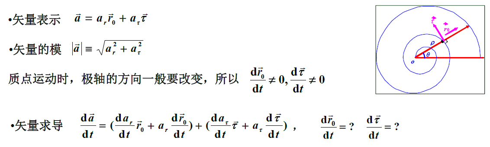
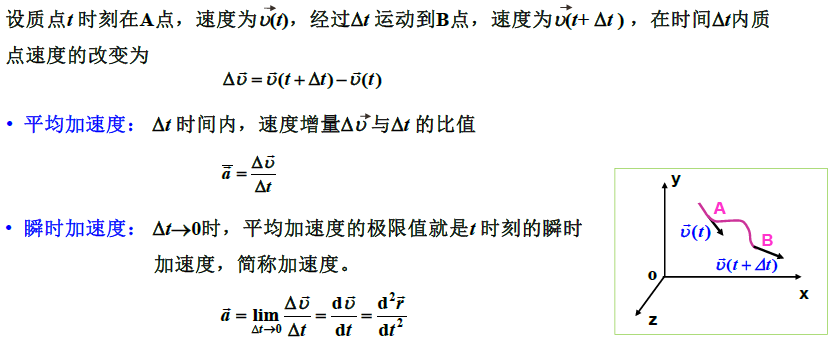
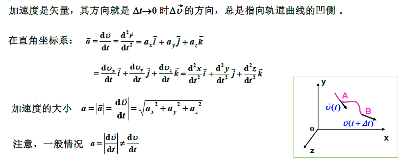

# **1.质点运动学**

## **1.参考系坐标系**

#### **1.运动的绝对性和相对性**

>   **运动是普遍的、绝对的，但运动的描述是相对的。**

#### **2.参考系**

>   **为了描述一个物体的运动，被选取且能用来描述物体运动状态的另一个物体**

#### **3.坐标系**

>**为了定量描述物体的运动，在选定的参考系上建立的带有数学标尺的坐标。**

#### **1.直角坐标系**

###### **1.定义**

>   

###### **2.矢量方向**

>   
>
>   

#### **2.极坐标系**

###### **1.定义**

>   

###### **2.向量变化率**

(i,j是x轴y轴方向的单位向量)

>   (径向单位向量的变化率 = 角速度$\frac{d\theta}{dt} \times$切向单位向量)
>
>   
>
>   
>
>   (切向单位向量的变化率 = 负角速度$-\frac{d\theta}{dt} \times$径向单位向量)
>
>   
>
>   

#### **3.自然坐标系**

###### **1.定义**

>   

###### **2.曲率/曲率半径/曲率圆**

>   

#### **4.质点**

###### **1.定义**

>当物体的形状、大小对其运动状态的影响可以忽略不计，用一个集中了物
>体全部质量的数学点来代表物体的运动，这样的点称为质点。

## **2.位置矢量 位移**

#### **1.位置矢量**

###### **1.定义**

>   

###### **2.位矢的模和方向**

>   

#### **2.运动方程与轨道方程**

###### **1.运动参数方程**

>   

###### **2.轨道方程**

>   

###### **3.位移与路程**

>   (位移的表示方法/大小/分量)
>
>   
>
>   **路程:在时间$\Delta t$内，质点走过的路径的长度$\Delta S $**

###### **4.位移与路程的比较**

>   **1.位移和路程不相等**
>
>   
>
>   **2.直线运动 的位移和路程 不相同**
>
>   **3.曲线运动 的位移和路程 不相同**
>
>   **4.位移的大小和位移不相同**
>
>   

###### **5.Eg(求运动方程和轨道方程)**

>   
>
>   
>
>   (设位移矢量->参数方程)
>
>   (运动方程:代入位置矢量->得到运动方程)
>
>   (轨道方程:参数方程消参->得到轨道方程)

## **3.速度加速度**

#### **1.速度和速率**

###### **1.平均速度**

>   

###### **2.瞬时速度**

>   

###### **3.瞬时速率**

>   

###### **4.Eg(极坐标表达式,解释内容)**

(速度 = 径向速度 + 切向速度)

>   

#### **2.平均加速度与加速度**

###### **1.平均加速度和瞬时加速度**

>   

###### **2.加速度的表达式和大小**

>   

###### **3.加速度在自然坐标系的表示**

>   
>
>   ****
>
>   
>
>   

###### **4.加速度**

>   **1.切向加速度**
>
>   
>
>   **2.法向加速度**
>
>   

## **4.角参量**

###### **1.角参量(一系列物理量)**

>   **1.角位移(标量)**
>
>   
>
>   **2.角速度(矢量)**
>
>   
>
>   **3.角加速度**
>
>   

###### **2.角参量与线参量的关系**

>   

###### **3.圆周运动和直线运动的比较**

>   

###### **4.Eg(求切向加速度/法向加速度/总加速度)**

>   
>
>   
>
>   
>
>   ****
>
>   (或者积分:最常用)
>
>   

###### **5.Eg(求平均速度和瞬时速度)**

>   (平均速度略/瞬时速度(对运动方程求导->代入t))
>
>   

###### **6.Eg(求夹角,求路程)**

>   

##　**5.运动学的两类问题**

**1.描述一般曲线运动的两类问题**

>   **1.已知运动方程,求速度加速度**
>
>   
>
>   **2.已知质点的加速度和初态,求质点的运动方程**
>
>   

**2.Eg**

>   

**3.Eg**

>   

**4.Eg**

>   
>
>   

**5.Eg**

>   

## **6.相对运动**

**1.伽利略变换**

>   
>
>   
>
>   
>
>   
>
>   
>
>   ****
>
>   