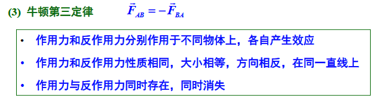
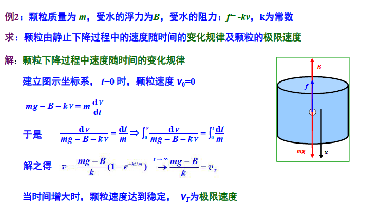
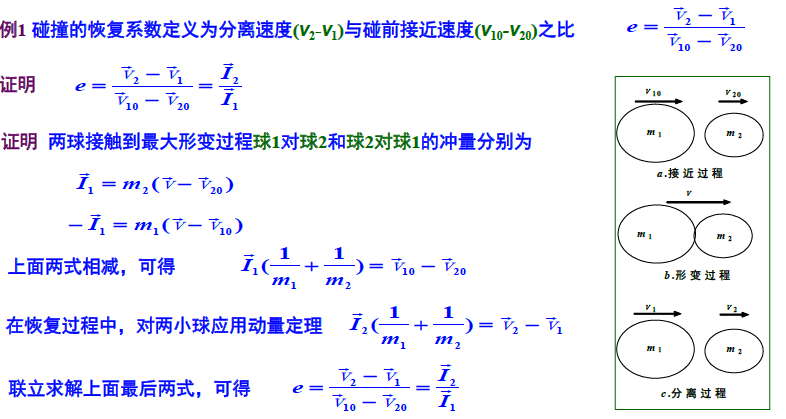
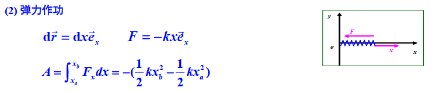

# **2.质点动力学**

## **1.质点动力学中的作用力**

**1.力的定义**

>   

**2.四种基本作用力**

>   

**3.质点力学中常见的力**

>   
>
>   

## **2.牛顿三定律**

#### **1.牛顿第一定律(和惯性)**

>   

#### **2.牛顿第二定律**

>   

#### **3.牛顿第三定律**

>   

#### **4.牛顿定律的应用**

>   

#### **5.Eg**

>   

#### **6.Eg**

>   (求速度随时间的变化规律,所以v和t分到等式两边)
>
>   

## **3.非惯性系与惯性力**

#### **1.非惯性系中的运动**

>   

#### **2.平动非惯性系的牛顿定律**

>   (解释:重力和其它所有的外力)
>
>   

#### **3.Eg(求相对加速度)**

>   (对m在升降机受力分析)
>
>   >   **重力 *mg*，方向竖直向下。**
>   >
>   >   **斜面施加的弹力 *N*，方向垂直于斜面向上。**
>   >
>   >   **惯性力 Fg = *ma*，方向竖直向下。**
>
>   (对m在地面受力分析)
>
>   >**先对刚刚求出的加速度进行分解**
>   >
>   >***a2x* = (g + a)sinθcosθ，方向水平向右**
>   >
>   >***a2y* = -(g + a)sin²θ，方向竖直向下。**
>   >
>   >**升降机相对于地面的加速度 *a* 的大小为 *a*，方向竖直向上。**
>   >
>   >-   ***ax* = 0**
>   >-   ***ay* = a**
>
>   **(最后对加速度进行矢量求和(体现出非惯性力))**
>
>   > ***mg* + *N* + *Fg* = *ma2***
>
>   

#### **4.转动非惯性系与离心力**

>   

#### **5.转动系中的科里奥利力**

>   

#### **6.转动系的解题思路**

###### 1.确定参考系

###### 2.分析真实力:重力弹力摩擦力

###### 3.引入惯性力:离心力和科里奥利力:$mr\omega^2+2mv\omega $

###### 4.牛二

## **4.动量定理**

#### **1.时间累计效应的参量**

>   

#### **2.单质点的动量定理**

>   
>
>   

#### **3.质点系的动量定理**

>   

#### **4.质点系动量定理举例**

>   

#### **5.Eg**

>   

#### **6.Eg**

>   

## **5.质心与质心运动定理**

#### **1.质心/质心坐标系/运动定理**

>   
>
>   

#### **2.Eg(求质心坐标)**

###### **1.建立坐标系**

###### **2.确定微元**

###### **3.表示微元质量dm**

>   设面密度为 ρ，微元的面积为 2Rsinθdx，因此 dm = ρ * 2Rsinθdx。

###### **4.表示微元位置**

###### **5.计算质心坐标**

>   对于二维物体，质心坐标 (*xc*, *yc*) 的计算公式为：
>
>   *xc* = (∫*xdm*) / (∫*dm*)
>
>   *yc* = (∫*ydm*) / (∫*dm*)
>
>   其中 ∫*dm* 表示整个物体的总质量。
>
>   (如果是对称的,算一半就好)

###### **6.Eg**

>   

#### **3.质心运动定理**

>   **系统所受合外力为零时，质心保持静止或做匀速直线运动。**
>
>   

#### **4.Eg(求移动距离)**

>   

#### **5.质心坐标系及其性质**

>   
>
>   

## **6.功和动能**

#### **1.功和功率**

>   
>
>   

#### **2.常见的力做功**

>   
>
>   
>
>   
>
>   

#### **3.保守力与势能**

>   
>
>   

#### **4.Eg**

>   

## **7.功能原理与机械能守恒定律**

#### **1.单质点的动能与动能定理**

>   

#### **2.Eg(求摩擦力做功)**

>   (摩擦力与速度v有关->v与t有关->t换成角度theta)
>
>   >   (替代方式,根据弧长公式$ s=R\theta $ 对t进行求导得到v)
>   >
>   >   化简至d*v*/v = -μdθ后继续分离变量积分得到v
>
>   

#### **3.质点系的功和能量**

**1.质点系内力做功的特点**

>   
>
>   
>
>   
>
>   

#### **2.Eg(内力为摩擦力的情况)**

>   
>
>   