# **1.刚体物理学**

## **1.刚体运动学**

#### **1.刚体**

###### **刚体的定义**

>   **运动中形状和大小都保持不变的物体**

#### **2.刚体的平动和转动**

###### **1.刚体的平动**

>   **刚体内任何两点的连线在运动中始终保持平行，这样的运动就称为平动。**
>
>   **(平动刚体内各质点的运动状态完全相同)**
>
>   **(平动刚体可视为质点。质心是平动刚体的代表。)**

###### **2.刚体的转动**

>   **刚体内的每个质点都绕同一直线(转轴)作圆周运动**
>
>   (转轴固定不动的转动为定轴转动)
>
>   (刚体一般运动可看作是平动和转动的结合)

#### **3.定轴转动的描述**

>   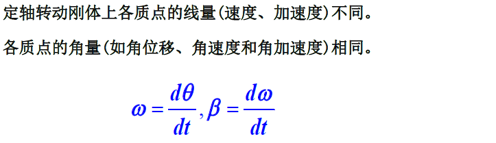
>
>   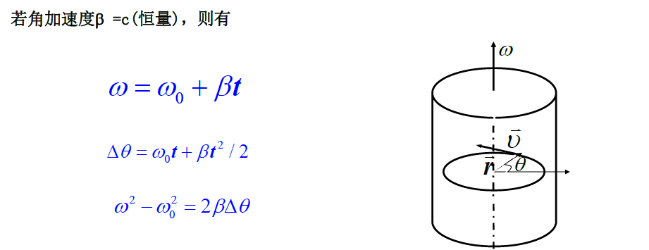
>
>   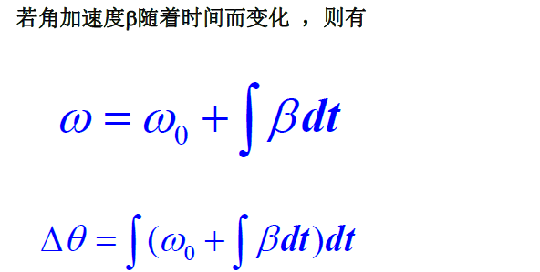

## **2.力矩/转动惯量**

#### **1.力矩**

>   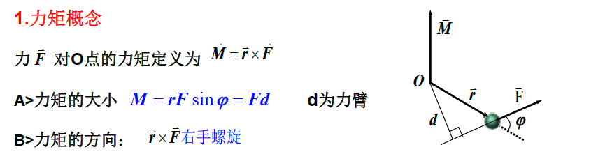
>
>   (注意对定轴转动)
>
>   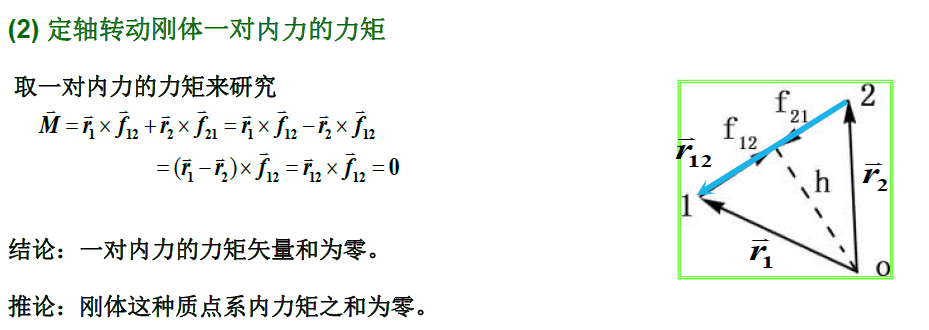

#### **2.转动惯量**

>   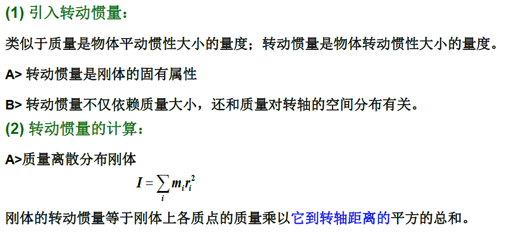
>
>   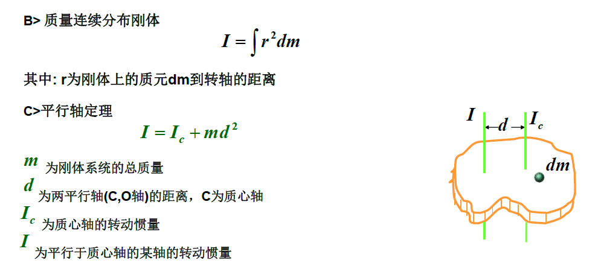

#### **3.Eg转动惯量**

>   **公式:**
>
>   >   对于一个质点，其质量为 *m*，到转轴的距离为 *r*，
>   >
>   >   则该质点相对于该转轴的转动惯量定义为：*I* = mr²
>
>   >对于一个由多个质点组成的系统，
>   >
>   >其总的转动惯量等于各个质点转动惯量的总和：I = Σmiri²
>
>   **平行轴定理:**
>
>   >   平行轴定理指出，刚体绕任意轴的转动惯量 = 绕平行于该轴通过质心的轴的转动惯量 + 刚体质量乘以两轴间距离的平方。
>
>   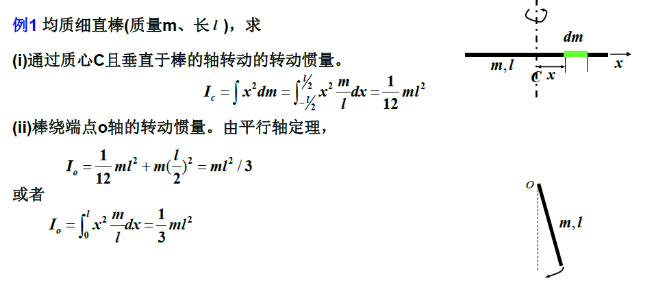

## **3.定轴转动定理**

#### **1.定轴转动定理**

>   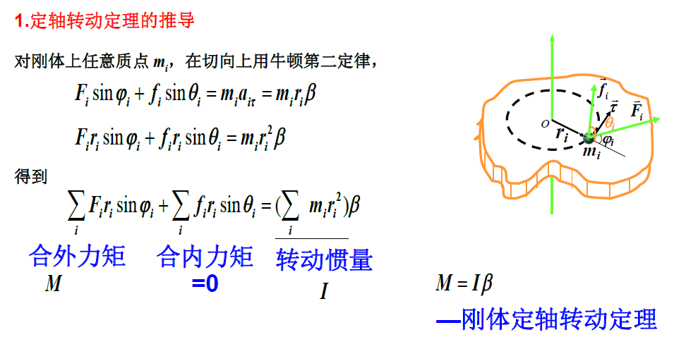
>
>   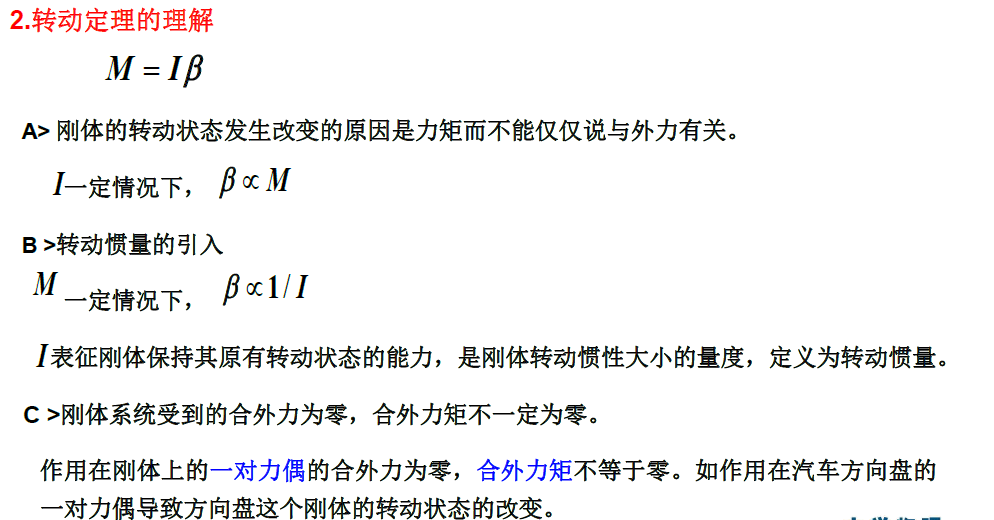
>
>   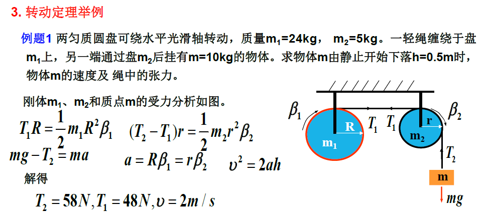
>
>   ($\beta $指的是角加速度)
>
>   T₁R = (1/2)m₁R²β₁：这个方程是针对圆盘 m₁ 的转动定律方程。
>
>   T₁R 是作用在 m₁ 上的力矩，(1/2)*m₁R² 是 m₁ 的转动惯量，
>
>   β₁ 是 m₁ 的角加速度。
>
>   该方程表明力矩与角加速度成正比，比例系数是转动惯量。)

## **4.质点角动量定理和角动量守恒**

#### **1.质点角动量**

>   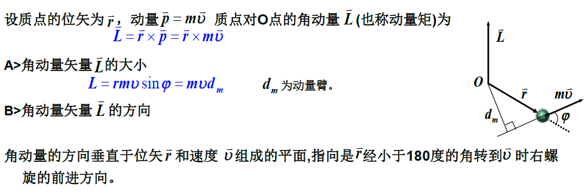
>
>   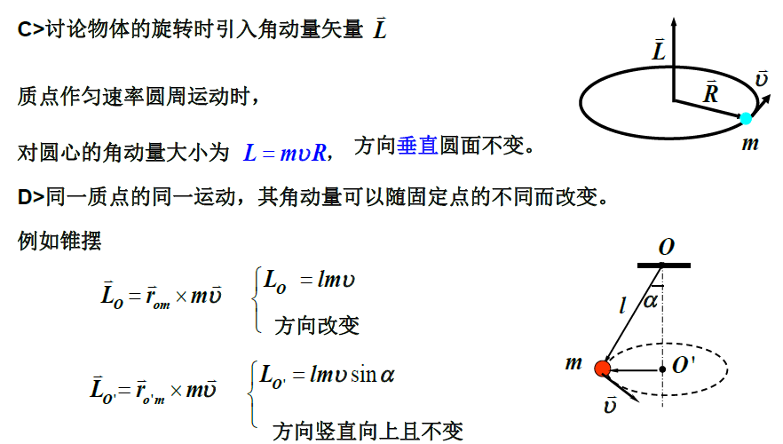

#### **2.质点的角动量方程**

>   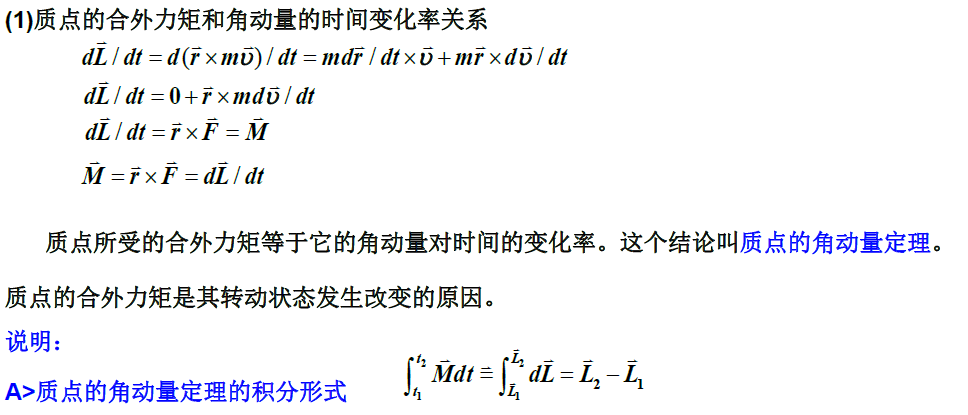
>
>   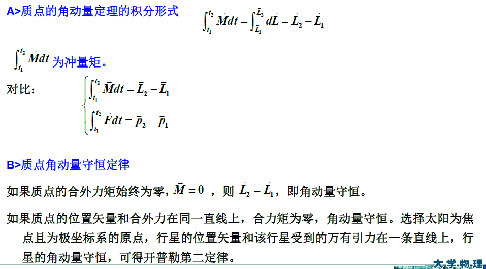

#### **3.质点系的角动量守恒**

>   参考点 O 的角动量 L 定义为：L = r × mv
>
>   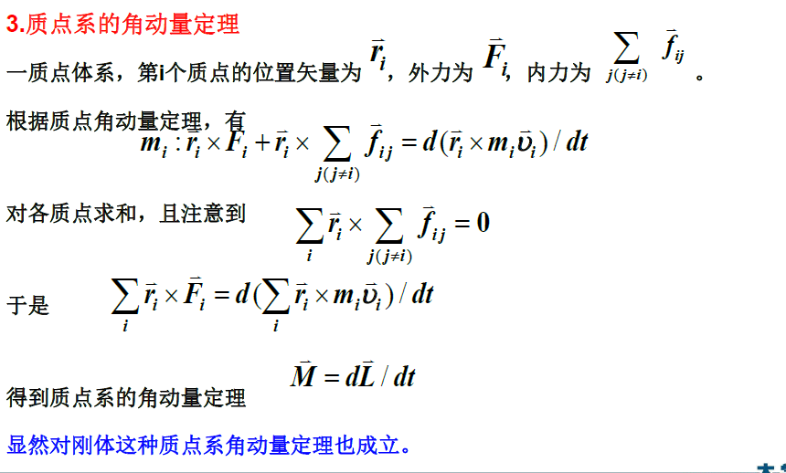

## **5.刚体角动量定理和角动量守恒**

#### **1.定轴转动刚体的角动量**

>   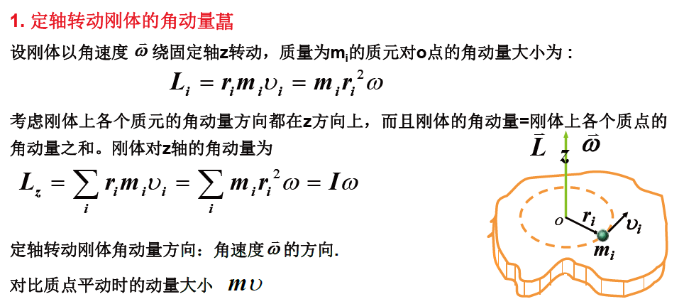

#### **2.刚体的角动量定理**

>   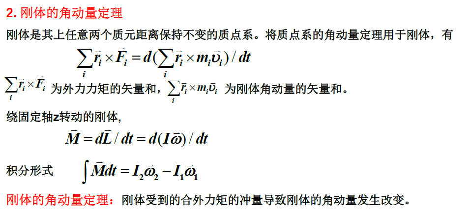

#### **3.刚体的角动量守恒**

>   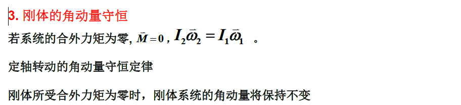

## **6.定轴转动的功和能**

#### **1.刚体的转动动能**

>   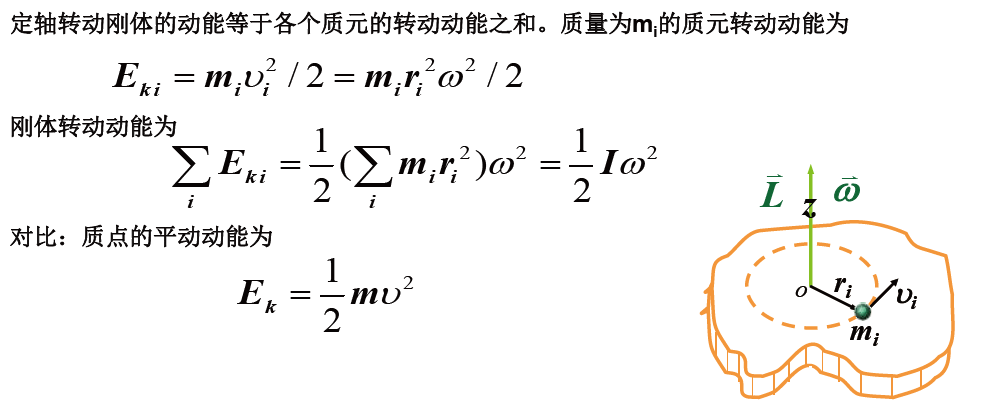

#### **2.力矩的功**

>   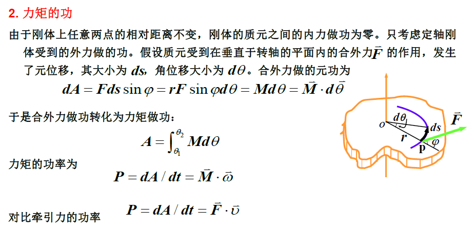

#### **3.定轴转动刚体的动能定理**

>   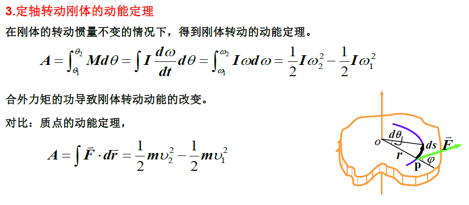

#### **4.机械能守恒定律**

>   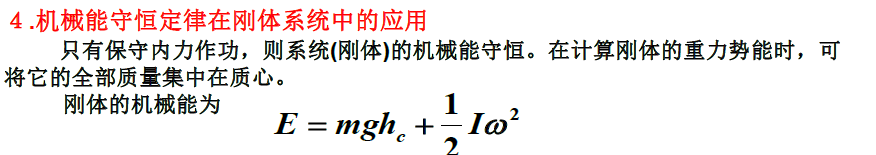

#### **5.Eg**

>   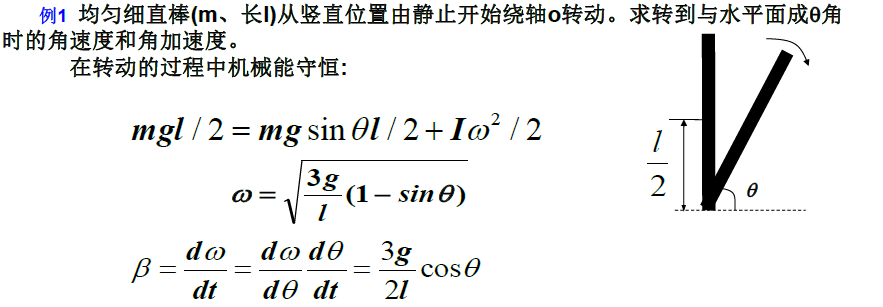
>
>   Δ*Ep* = *Ep末* - *Ep初始* = *mglsinθ/2* - *mgl/2* = *mg*(l/2)(sinθ - 1)
>
>   *Ep初始* = *Ep末* + *Ek转动*
>
>   *mgl/2* = *mglsinθ/2* + (1/2)*Iω²*
>
>   (I = ∫r²dm = ∫₀ˡ x²(m/l)dx = (1/3)ml² 代入原式)
>
>   *mgl/2* = *mglsinθ/2* + (1/6)*ml²ω²*
>
>   ω = sqrt[(3g/l)(1 - sinθ)]

**6.Eg**

>   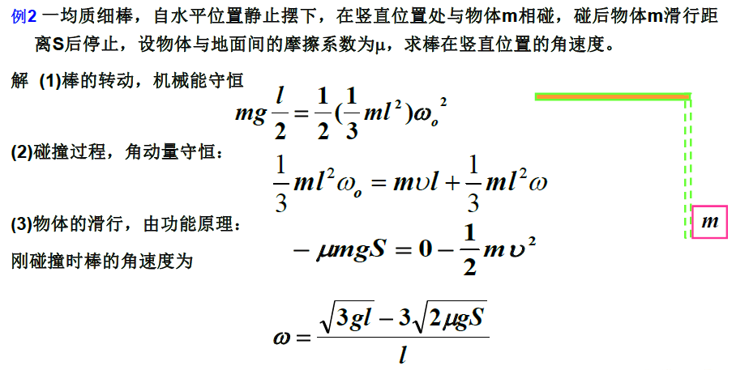