# **4.简谐运动**

## **1.简谐振动的运动学**

#### **1.机械振动的特点**

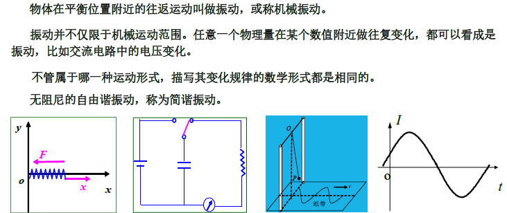

#### **2.简谐振动的参量**

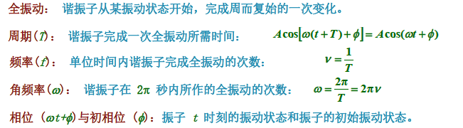

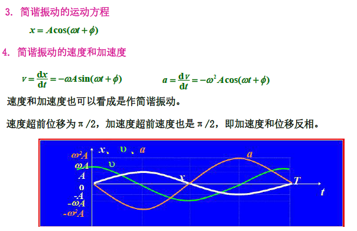

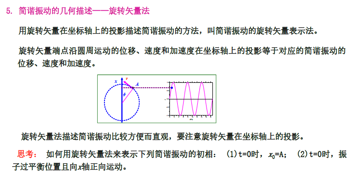

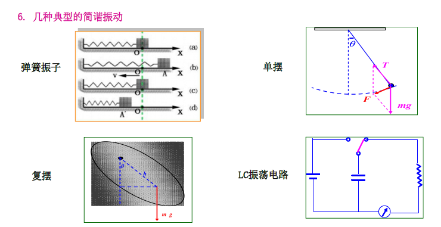

## **2.简谐振动的动力学**

#### **1.简谐振动的动力学特征**

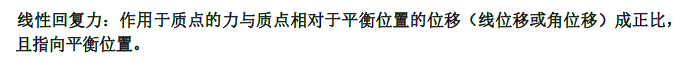

#### **2.简谐振动的动力学方程**

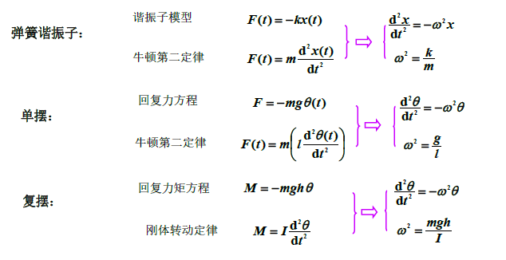

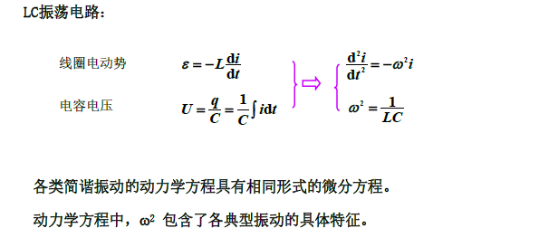

## **3.简谐振动的能量**

#### **1.简谐振动的机械能**

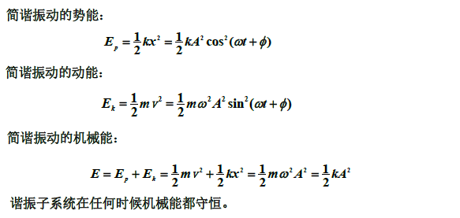

#### **2.简谐振动的能量平均值**

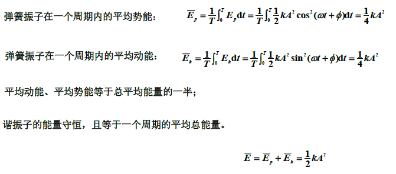

#### **3.简谐振动的能量与运动学方程的关系**

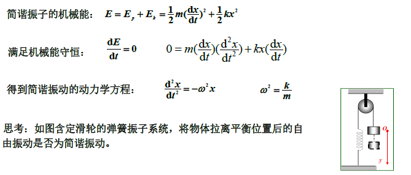

## **4.特殊的振动**

#### **1.阻尼振动**

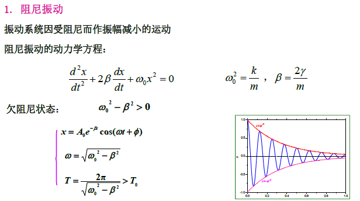

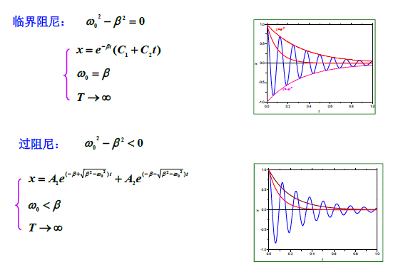

#### **2.受迫振动**

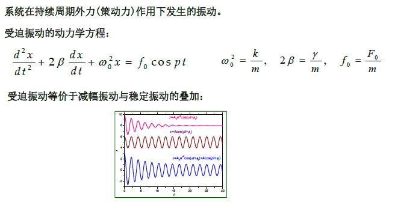

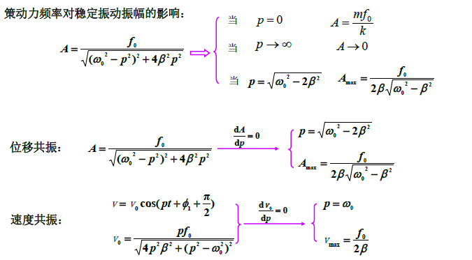

## **5.简谐振动的合成**

#### **1.同振动方向、同振动频率的简谐振动合成**

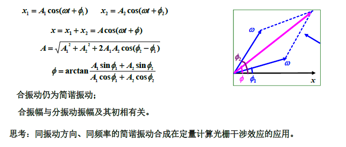

#### **2.同振动方向、不同振动频率的简谐振动合成**

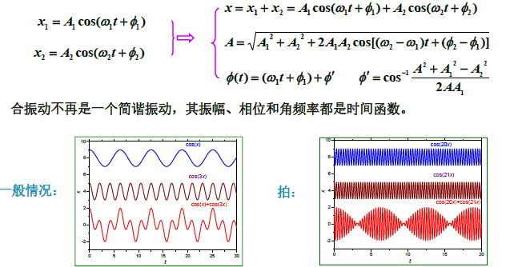

#### **3.偏振方向相互垂直的简谐振动合成**

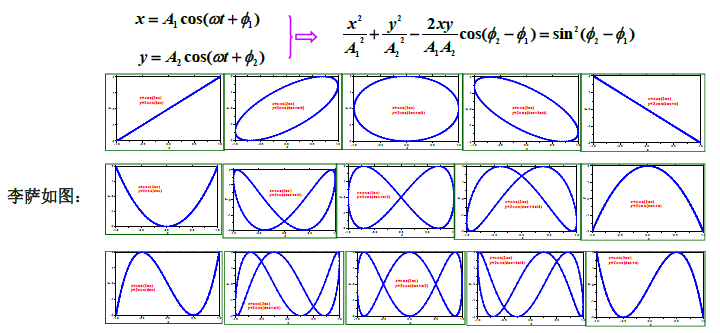