# **1.波动学基础**

## **1.机械波的基本特征**

**相关概念**

>   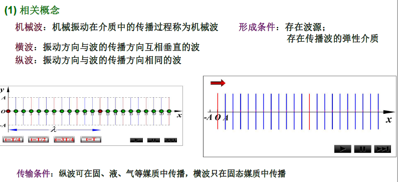
>
>   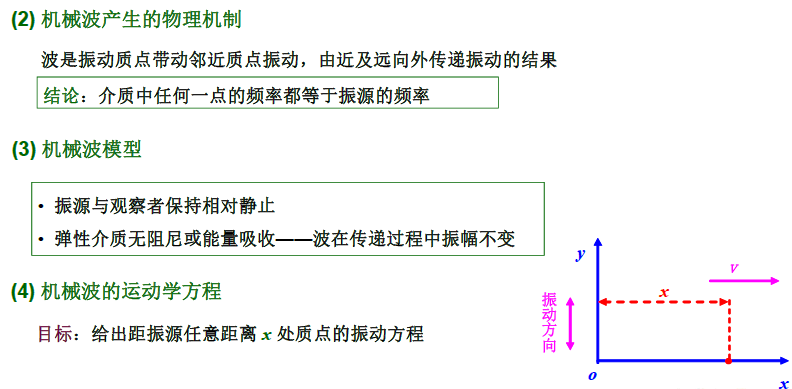
>
>   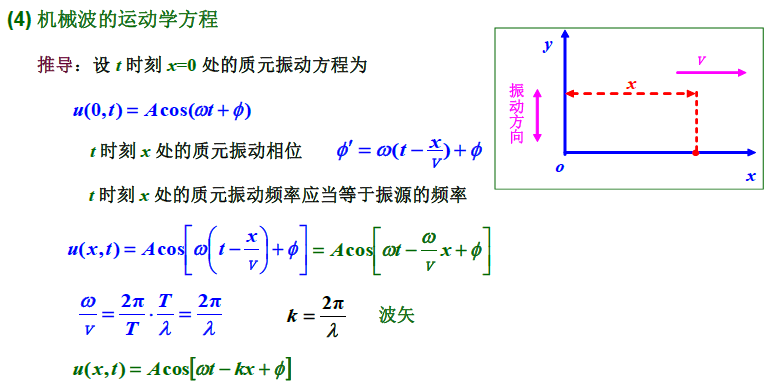
>
>   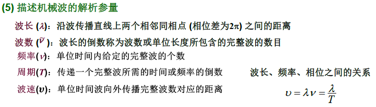

## **2.机械波的动力学方程**

#### **1.典型波动的动力学方程**

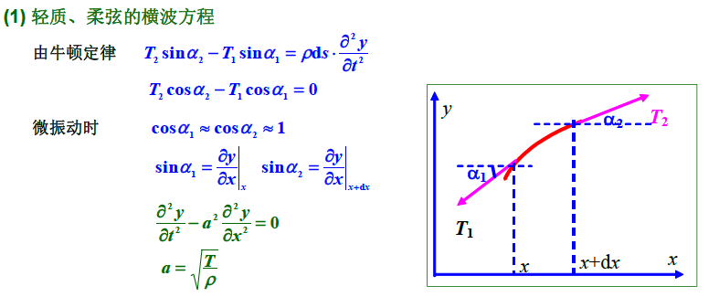

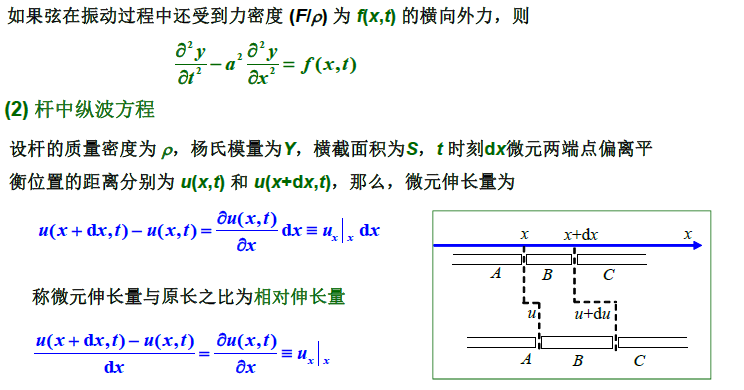

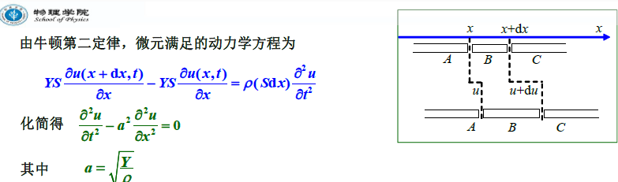

#### **2.波动动力学方程的解**

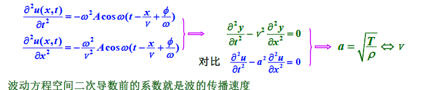

#### **3.波速**

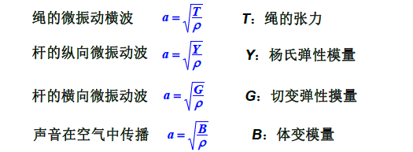

## **3.波的能量:声波**

#### **1.机械波的能量**

>   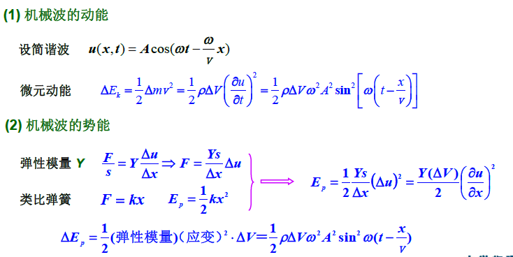
>
>   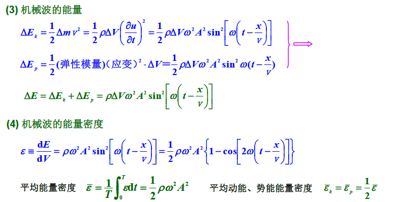
>
>   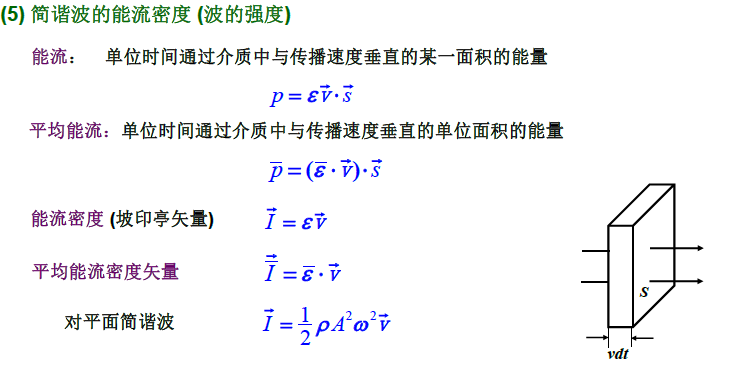

#### **2.声波**

>   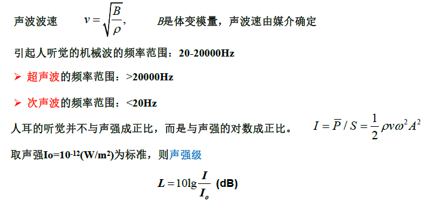

## **4.惠更斯原理:波的干涉**

#### **1.惠更斯原理**

>   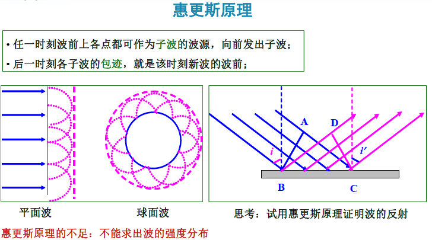

#### **2.波的叠加原理/波的干涉**

>   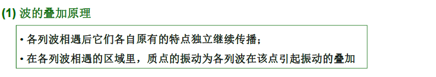
>
>   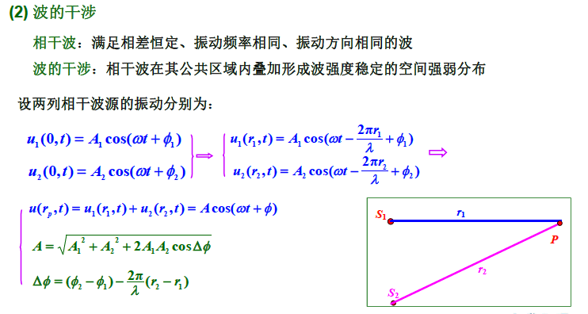
>
>   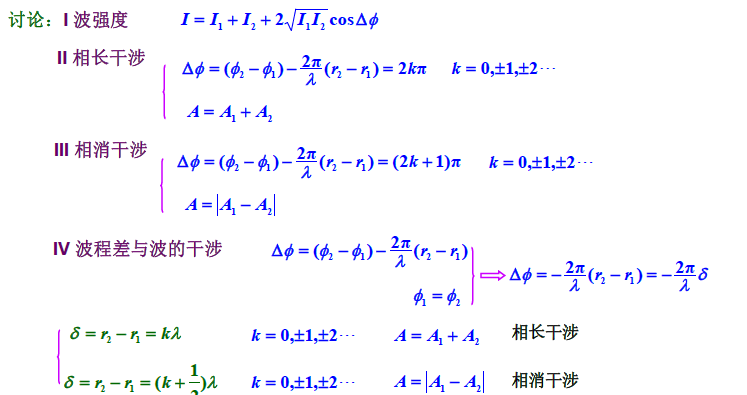

## **5.驻波**

#### **1.驻波**

>   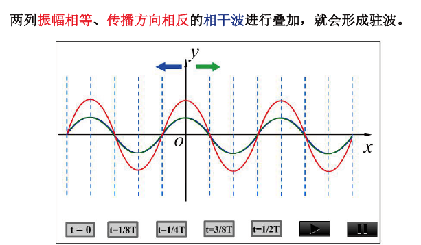

#### **2.驻波方程**

>   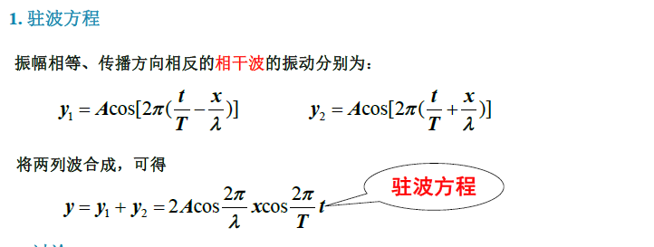
>
>   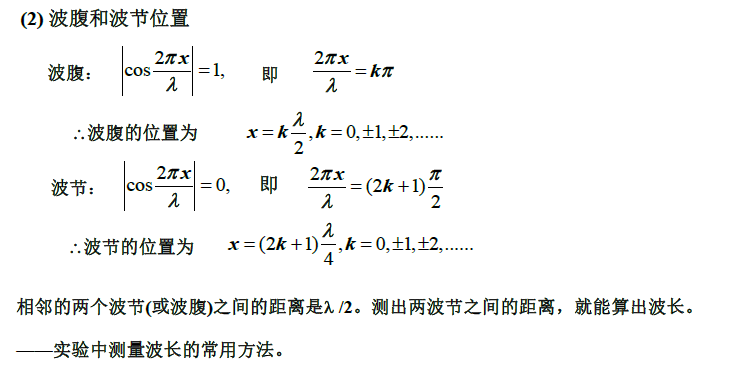
>
>   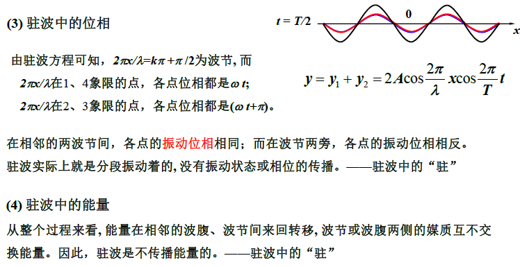
>
>   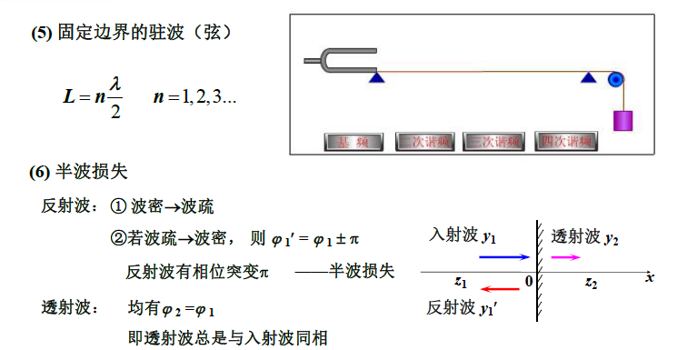

#### **3.驻波的应用**

>   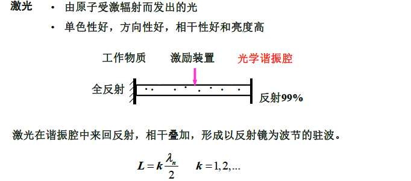

## **6.多普勒效应**

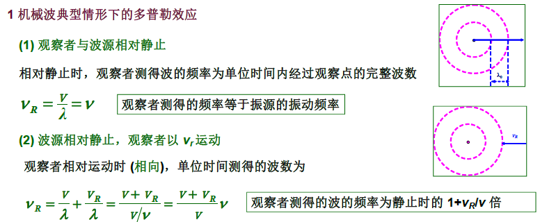

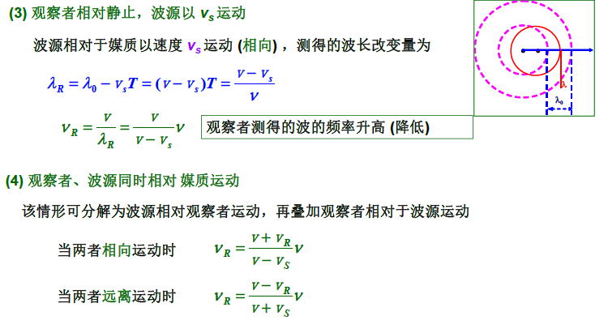

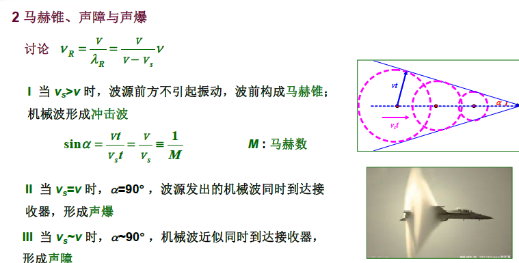