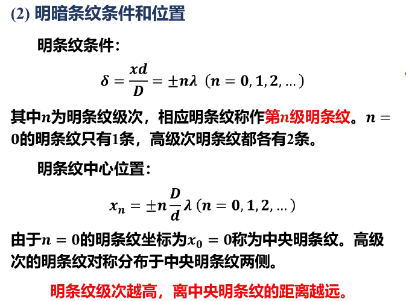
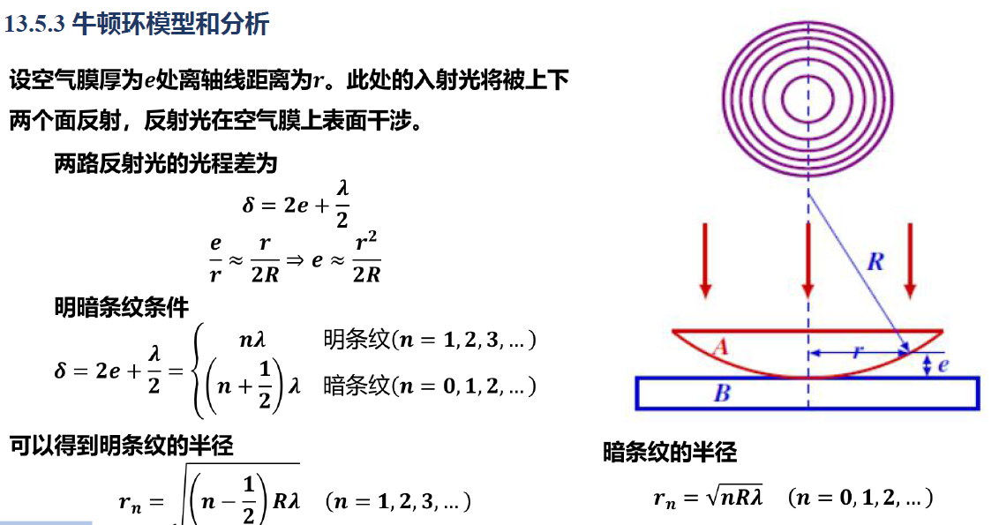

# **7.光的干涉**

## **1.光的相干叠加和非相干叠加**

#### **1.光的相关概念**

#### **2.光的产生机制**

#### **3.光波的叠加和干涉条件**

## **2.光程与光程差**

**1.光程和光程差**

>   
>
>   
>
>   

**2.薄透膜的等光程性**

>   
>
>   

## **3.双缝干涉与空间相干性**

**1.杨氏双缝干涉**

>   
>
>   
>
>   
>
>   

## **4.两面平行的薄膜干涉**

**1.基本模型**

>   
>
>   
>
>   
>
>   
>
>   
>
>   

## **5.劈尖干涉和牛顿环**

## **6.迈克尔逊干涉仪和时间相干性**

