# **期末复习**

## **1.试卷组成**

1.选择题(3*10=30)

>   圆周运动/弹簧做功/角速度/角角速度/静电场/电流/磁场

2.填空题(3*4+ 6\*3=30)

>   方程推导/张力/运动学/电场/磁场

3.大题(4*10=40)

## **2.大题必考**

#### **2-4:Eg1/Eg2**

****

**Eg1:(求张力/求相对加速度)**

**(1)如图所示,一根细绳跨过定滑轮,在细绳两侧各悬挂质量分别为$m_1$，和$m_2$的物体,且$m1,>m2$**

假设滑轮的质量与细绳的质量均略去不计,滑轮与细绳间无滑动以
及轮轴的摩擦力略去不计

试求重物释放后,物体的加速度和细绳的张力.

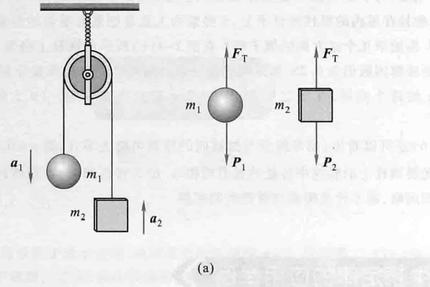

****

解:取地面为参考系,按照图示受力分析,拉力T和重力P

细绳的张力$F_{T1} = F_{T2} = F_T$,所以$a_1=a_2=a $

对$m_1:m_1g - F_T = m_1 a$

对$m_2:F_T-m_2g = m_2 a$
$$
\therefore a = \frac{m_1-m_2}{m_1+m_2}g \ , \ F_T = \frac{2m_1m_2}{m_1+m_2}g(代入受力分析)
$$

****

(2)若将上述装置固定在如图所示的电梯顶部.当电梯以加速度a相对地面竖直向上运动时,试求两物体相对电梯的加速度和细绳的张力.

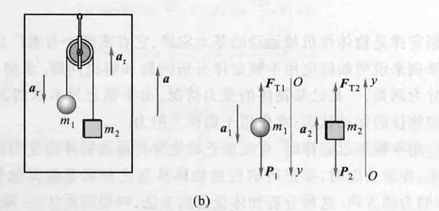

解:取电梯为参考系,按照图示受力分析,只有拉力T和重力P

对加速运动的电梯,引入惯性力,电梯向上,惯性力向下,大小为ma

(因此，对于物体 m1 和 m2，它们受到的合力应该等于其质量乘以相对于电梯的加速度 *ar*)

对物体$m_1$:(重力+惯性力-拉力=合力)
$$
m_1(g+a)-F_T = m_1a_r
$$
对物体$m_2$:(拉力-重力-惯性力=合力）
$$
F_T- m _2(g + a) = m_2a_r 
$$
联立得:
$$
(m_1-m_2)(g+a) = (m_1+m_2)a_r
$$
带回任意一个方程:
$$
F_T = \frac{2m_1m_2}{(m_1+m_2)}*(g+a)
$$

****

#### **3-2:Eg1(动量守恒+几何方程)**

设有一静止的原子核,衰变辐射出一个电子和一个中微子后成为一个新的原子核
已知电子和中微子的运动方向相互垂直,

电子的动量为$1.2 \times 10^{-22}kg \cdot m \cdot s^{-1} $,

中微子的动量为$6.4 \times 10^{-23}kg \cdot m \cdot s^{-1} $.

问新的原子核的动量的值和方向如何?

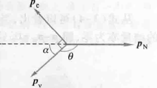

****

解:忽略外力,设动量$p_c / p_v / p_N$,为电子/中微子/新原子核的动量

存在动量守恒$ \ p_c + p_v + p_N = 0$

因为垂直根据勾股定理:$ \ (p_c)^2 + (p_v)^2 = (p_N)^2$

代入数据:$p_N= [(1.2\times 10^{22})^2 + (6.4\times 10^{-23})^2]^{\frac{1}{2}} = 1.36 \times 10^{-22}kg \cdot m \cdot s^{-1} $

计算$\alpha$角度:$\ \alpha = arctan\frac{P_c}{P_v} = 61.9\degree。$

之间的夹角为:$\ \theta = 180\degree-61.9\degree=118.1\degree $

#### **3-4:Eg2**

如图所示,一质量为1.0kg的小球系在长为1.0m的细绳下端,绳的上端固定在天花板上.起初把绳子放在与竖直线成0-30°角处，然后放手使小球沿圆弧下落.试求绳与竖直线成0=10°角时小球的速率.

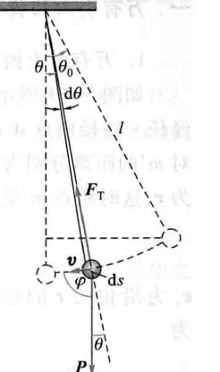

对小球受力分析:拉力$F_T$和重力$P$,设小球在圆弧上有无限小位移ds

则合力F做的功:
$$
dW = F\cdot ds = F_T\cdot ds+P \cdot ds
$$

>   **其中$F_T\cdot ds$始终与运动方向垂直,所以做功为0**
>
>   **其中$P \cdot ds$始终与运动夹角有关:**
>
>   >   **$F = mglsin\theta$(做负功)**
>   >
>   >   **$P\cdot s = -mglsin\theta d\theta $**

根据动能定理:
$$
\therefore W = -mgl\int^{\theta}_{\theta_0}sin\theta d\theta = mgl(cos\theta - cos\theta_0) = \frac{1}{2}mv^2 - \frac{1}{2}m v_0^2
$$

$$
\therefore v = \sqrt{2gl(cos\theta - cos\theta_0)}
$$

将数据代入后:
$$
v = \sqrt{2\times 9.8 \times 1.0 \times(cos 10\degree-cos 30\degree)}m/s = 1.53 \ m/s
$$

****

#### **3-6:Eg1**

如图所示,

一雪橇从高度为50m的山顶上点A沿冰道由静止下滑,山顶到山下的坡道长为500m.

雪橇滑至山下点B后,又沿水平冰道继续滑行,滑行若干米后停止在C处.

若雪橇与冰道的摩擦因数为0.050.求此雪沿水平冰道滑行的路程.点B附近可视为连续弯曲的滑道.略去空气阻力的作用.
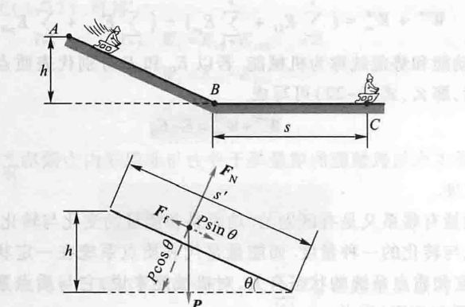

受力分析:重力$P$/支持力$F_N$/摩擦力$F_f$,其中只有重力和摩擦力做功

等价关系:重力做的所有功=摩擦力(山上)的功+摩擦力(平面)的功

$W_G=mgh$

$W1 = \int F \cdot r = -\int^{B}_{A}F_f dr = -\int^B_A \mu mg cos\theta dr$

>   **(因为$\theta$角度小,可以近似为平面,即)$\ -\mu mg s_1 $**

$W_2 = \mu mg s_2$

将$W_1,W_2$代入等价关系,得:
$$
s2 =\frac{h}{\mu} s_1
$$
从题意知,$h=50m,μ=0.050,s_1=500m$,代入上式,雪橇沿水平冰道滑行的路程为$s=500 m$

****

#### **4-2:Eg1/Eg3**

###### **Eg1**

有一大型水坝高110m、长1000m,水深100m,水面与大坝表面垂直,如图4所示.

求水作用在大坝上的力,以及这个力对通过大坝基点Q且与x轴平行的轴的力矩

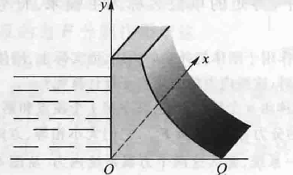

解 如下图所示,设水深为h、坝长为L,坝的高度从底到高为h,在坝面上取一面积元 dA=Ldy(小长方形).

若在此面积元上的压强为P,则作用在此面积元上的力为$dF = p\cdot dA = p\cdot L \cdot dy $

计算压强p:大气压为$p_0$,则有
$$
p = p_0(大气压力) + \rho g(h-y)(水的压力)
$$

>   >   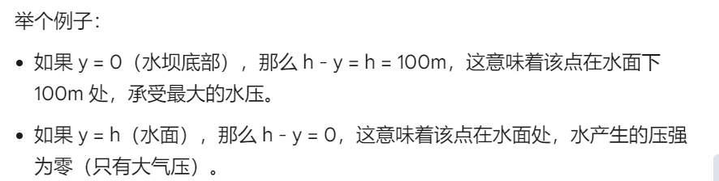

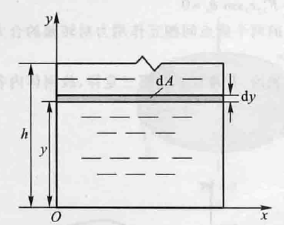

带回F,则有:
$$
dF = p_0\cdot L \cdot dy + \rho g (h-y)L dy
$$
对大坝,所有压强都是仅对h部分做功:
$$
F= \int^h_0 p_0 L dy + \int^{h}_{0}\rho g (h-y)Ldy = p_0 L h + \frac{1}{2}\rho g L h^2 = 5.91\times 10^{10}N
$$
**其实这里得到了一个结论:直接按照标准正方体做:$F = p_0s+\rho g V$**

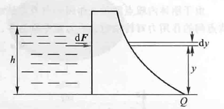

求力对基点Q,且与x轴平行的轴的力矩:力矩(M)=力(F)×力臂(r):dM=ydF
$$
\therefore dM = y[p_0\cdot L \cdot y+ \rho g(h-y)Ldy]
\\
\\
(对水深h的水域进行叠加)
\\
\\
M = \int dM = \int^h_0 p_0\cdot L \cdot dy + \int^h_0 \rho gL(h-y)ydy = \frac{1}{2}p_0 \cdot L \cdot h^2+\frac{1}{6}g\rho L h^2 = 2.14\times 10^{12}N/m
$$

****

###### **Eg3**

如图所示,质量为m,的物体A静止在光滑水平面上,它和一质量不计的绳索相连接,此绳索跨过一半径为R、质量为m。的圆
柱形滑轮C,并系在另一质量为m的物体B上,B竖直悬挂.圆柱形滑轮可绕其几何中心轴转动.当滑轮转动时,它与绳索间没有滑动,且滑轮与轴承间的摩擦力可略去不计.问:
(1)这两物体的线加速度为多少?水平和竖直两段绳索的张力各为多少?(2)物体B从静止落下距离y时,其速率为多少?

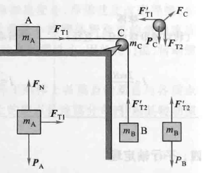

对物体A:$F_{T1} = m_A a $

对物体B:$m_Bg - F_{T2} = m_B a $

对滑轮C:$RF_{T2} - RF_{T1} = J\alpha = \frac{1}{2}m_cR^2 a$(合力矩=转动惯量)

****

物体B的线加速度a和角速度$\alpha$存在关系:$\alpha= \frac{a}{R}$
$$
RF_{T2} - RF_{T1} = \frac{1}{2}m_ca
$$

>   **滑轮为均匀圆盘状/绳子与滑轮之间无滑动/绳子质量忽略不计/滑轮轴摩擦忽略不计时可用**

联立方程:$F_{T2}-F_{T1} = \frac{1}{2}m_C a $

再代入:
$$
a= \frac{m_Bg}{m_A+m_B+\frac{1}{2}m_c},F_{T1}=\frac{m_A m_Bg}{m_A+m_B+\frac{1}{2}m_C},F_{T2} = \frac{(m_A+\frac{1}{2}m_c)m_b g}{m_A+m_B+\frac{1}{2}m_c}
$$
(当滑轮的质量很小,即可以得到)
$$
F_{T1} = F_{T2} = \frac{m_A m_B}{m_A + m_B} g
$$
2.物体B做匀加速运动,所以速率
$$
v = \sqrt{2ay} = \sqrt{\frac{2m_B gy}{m_A+m_B+\frac{1}{2}m_C}}
$$

#### **4-3:Eg1/Eg2**

###### **Eg1(角动量定理)**

如图所示,一半径为R的光滑圆环置于竖直平面内,有一质量为m的小球穿在圆环上,并可在圆环上滑动,

小球开始时静止于圆环上的点A(该点在通过环心O的水平面上),然后从点A开始下滑,

设小球与圆环间的摩擦略去不计,求小球滑到点B时对环心O的角动量和角速度.

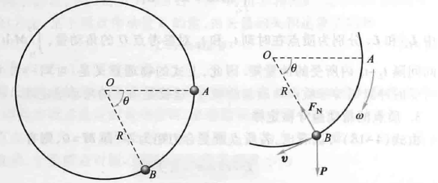

对小球受力分析:支持力$F_N$和重力$P$

合外力矩$\ M = mgcos\theta R$(仅重力做功)

又,角动量 L 的变化率等于作用在物体上的力矩($M = \frac{dL}{dt}$)

角动量大小随时间改变:$\therefore mgRcos\theta = \frac{dl}{dt} 即 dL = mgRcos\theta dt  $

$\because \omega = \frac{d\theta}{dt} $,$ L = mRv = mR^2\omega $ $\therefore dt = \frac{d\theta}{\omega}, ω = \frac{d\theta}{[\frac{L}{mR^2}]}$

$\therefore dt = \frac{mR^2}{L}d\theta$
$$
\therefore dL = mgRcos\theta \times (\frac{d\theta}{[\frac{L}{mR^2}]})
\\
\therefore LdL = m^2gR^3 cos\theta d\theta
$$

进行实际情况的积分:
$$
\int^{L}_{0}LdL = m^2gR^3\int^\theta_0 cos\theta d\theta (对两边同时积分)\\
\\
\frac{1}{2}L^2 = m^2gR^3sinθ\\
\\
\therefore L = mR^{\frac{3}{2}}(2gsin\theta)^{\frac{1}{2}}\\
\\
\therefore \omega = (\frac{2g}{R}sin\theta)^\frac{1}{2}
$$

###### **Eg2**

如图所示,一质量$m=1.20\times 10^4kg$的登月飞船,在离月球表面高度$h=100 km$处绕月球作圆周运动.

飞船采用如下登月方式:

当飞船位于图中点A时,它向外侧(即沿月球中心O到点A的位矢方向)短时间喷射出粒子流,使飞船与月球相切地到达点
B,且OA与OB垂直.飞船所喷出的粒子流相对飞船的速度为$u=1.00\times10^4 m·s^{-1}$.已知月球的半径$R=1740km$;在飞
船登月过程中，月球的重力加速度可视为常量$m=1.62m·s^{-2}$.试问登月飞船在登月过程中所需消耗燃料的质量$\Delta m$是多少?

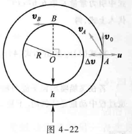

万有引力等于向心力:
$$
G \frac{m_M m}{(R+h)^2} = m \frac{v_0^2}{R+h}
$$
月球表面的重力加速度:
$$
g_M = G\frac{m_M}{R^2}
$$
联立得:
$$
v_o^2 = (\frac{g_M R^2}{R+h}) = 1633m/s
$$
减速时:减少的重力转化为速度的增量:
$$
合速度:v_A^2 = v_0^2 + \Delta v^2
$$
飞船喷出粒子流,有$m'$和$\Delta m$组成,只有$m'$有向心力作用,根据角动量守恒
$$
m'v_0 (R+h) = m'v_B R
$$
联立:
$$
v_B = \frac{R+h}{R}v_0 = 1727m/s
$$
机械能守恒:
$$
\frac{1}{2}m'v_A^2 - G\frac{m_mm'}{R+h} = \frac{1}{2}m'V_B^2 - G\frac{m_Mm'}{R} ,\therefore v_A = 1636m/s,\Delta v = 100m/s
$$
动量守恒:
$$
\Delta m u = m\Delta v,\therefore \Delta m =120kg
$$

#### **4-4:Eg2/Eg3**

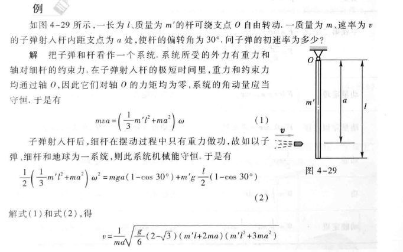

## **下面不讲不考**

****

#### **5-2:Eg1/Eg2**

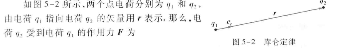

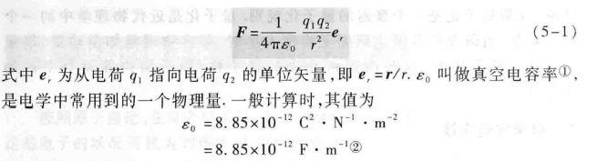

###### **Eg1线电荷分布($\lambda$)**

如图所示,正电荷q均匀地分布在半径为R的圆环上,计算通过环心点O,并垂直圆环平面的轴线上任一点P处的电场强度.

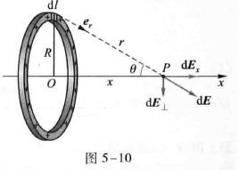

均匀分布,所以电荷线密度$\lambda  =\frac{q}{2\pi R} $,取电荷元$dq = \lambda dl $
$$
库伦定律:dE = \frac{1}{4\pi \epsilon_0}\frac{\lambda dl\times e}{r^2}
$$
消去上下对称抵消的电场,只有水平电场
$$
E  =\int _l dE_x = \int_l dEcos\theta = \frac{\lambda x}{4\pi \epsilon_0 r^3}\int^{2\pi}_{0}dl
$$
**又$r^2 =x^2+R^2$,$\lambda = \frac{q}{2\pi R} $**
$$
\therefore E = \frac{1}{4\pi\epsilon_0}\frac{\lambda x}{(x^2+R^2)^{\frac{3}{2}}}2\pi R = \frac{1}{4\pi \epsilon_0}\frac{qx}{(x^2+R^2)^{\frac{3}{2}}}
$$
分类讨论:

>   1.x>>R:$E \approx \frac{1}{4\pi \epsilon_0}\frac{q}{x^2} $
>
>   2.$x\approx 0 ,E\approx 0 $,电场强度为0
>
>   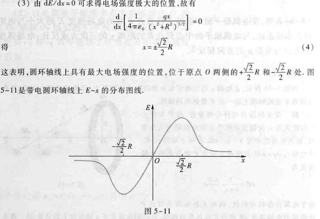

****

###### **Eg2(面电荷分布$\sigma $)**

如图所示,有一半径为R,电荷均分布的薄圆盘,其电荷面密度为$\sigma$,

求通过盘心且垂直盘面的轴线上任意一点处的电场强度.

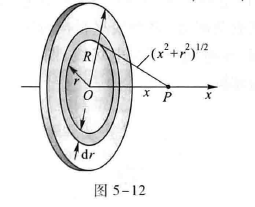

解:取如图所示的坐标,薄圆盘的平面在yx平面内,盘心位于坐标原点0.

由于圆盘上的电荷分布是均匀的,故圆盘上的电荷为$q = \sigma \pi R^2 $,微元法$dq = \sigma 2\pi r dr $

设x为场点 P 到圆盘中心的垂直距离,

所以微元电荷在点p的电场强度为
$$
dE_x = \frac{xdq}{4\pi \epsilon_0 (x^2+r^2)^{\frac{3}{2}}} = \frac{\sigma}{2\epsilon_0} \frac{xrdr}{(x^2+r^2)^{\frac{3}{2}}}
$$
整体积分:
$$
E = \int dE_x = \frac{\sigma x}{2\epsilon_0}\int^R_0\frac{rdr}{(x^2+r^2)^{\frac{3}{2}}} =\frac{\sigma x}{2\epsilon_0}(\frac{1}{\sqrt{x^2}}-\frac{1}{x^2+R^2})
$$
如果x<<R:$E=\frac{\sigma}{2\epsilon_0} $

****

#### **6-2:Eg1/Eg2**

****

## 3.**真题**

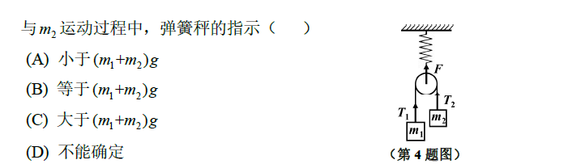

>   **C**
