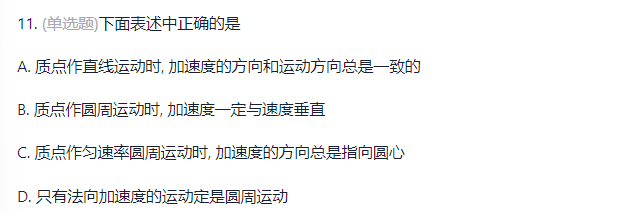
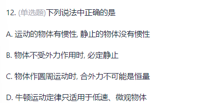
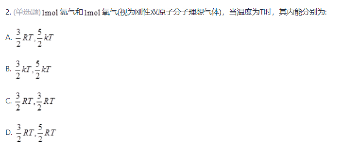

# **选择题原题**

## **第一章**

1. (单选题)敦煌曲子词中有这样的诗句:“满眼风波多闪烁，看山恰似走来迎，仔细看山山不动，是船行。”其中“看山恰似走来迎”和“是船行”所选的参考系分别是:C

-   A. 船和河岸
-   B. 河岸和流水
-   C. 山和船
-   D. 地面和山

****

2.   (单选题)描述物体地运动，必须选择参考系，关于参考系，下列说法中错误的是: C

-   A. 地球绕太阳近似做圆周运动，参考系是太阳
-   B. 早晨太阳从东方升起，参考系是地面
-   C. 研究地面上物体的运动只能取地面为参考系
-   D. 在不同参考系中描述物体的运动，简繁程度会不同

****

3. (单选题)下列关于质点的概念叙述正确的是 :C

-   A. 只要是静止的物体都可以看作质点。
-   B. 在研究某个问题时，一物体可以看做质点，那么在研究另一个问题时，该物体也一定可看做质点。
-   C. 一个物体可否可以看做质点，要看所研究问题的具体情况而定。
-   D. 只要是细小的物体都可以看作质点。

****

C(矢量,标量对半砍)

****

#### 注意

D(直接除以$\Delta t $,然后展开)

****

A(加速度不确定)

****

#### 注意

D(求导得到分速度,标量勾股定理)

****

#### 注意

C

****

#### 注意

B(对运动方程求导得到速度方程,对速度方程求导得到加速度,两者都随时间变化)

****

#### 注意

A(反向进行积分,因为要移动v,所以肯定有$\frac{1}{v} $.因为变项则变号)

****

C

****

D(y上的匀变速运动)

****

#### 注意

C(水平方向的匀速运动,所以x不变,y变)

****

#### 注意

D(平均速度是位移,位移等于0;平均速率是路程,$\frac{4\pi R}{2T} = \frac{2\pi R}{T} $)

****

#### 注意

B,切向加速度和角加速度:$a = R\alpha = \frac{Rt}{2}$,线加速度和角加速度:$a = \omega^2R = \frac{Rt^4}{16}$

****

#### 注意

D,

求两次导得到切向加速度

求一次导得到切向速度,除以R得到角速度,$a = \omega^2R$

****

#### 判断题

1.   做匀速圆周运动的物体相等时间内通过的弧长相等。

2.   做匀速圆周运动的物体相等时间内通过的位移不相同。

3.   匀速圆周运动是一种匀速运动。
4.   做圆周运动的物体，其速度一定是变化的。
5.   角速度是标量&矢量，它有方向。
6.   圆周运动线速度公式v=Δt(Δs)中的Δs表示路程。

## **第二章**

#### 注意

D(受到小木块的重力,换成水平向左的力,则cot)

****

#### 注意

A(静摩擦会变,但是物体保持静止,导致摩擦力和重力大小相等,方向相反)

****

C(高考题)

****

#### 注意

B 重力mgcos会增加速度,从而增大向心力;方向和物体的位置有关

****

#### 注意

C 绳子一直受力2mg,B不动

****

C

****

#### 注意原题

****

C(猴+板子在板子上)

****

#### 注意

A.根据$F = m\omega^2R = \frac{mg}{cos\theta} $

****

#### 注意

B

****

B .惯性

****

#### 注意

C B选项静止或匀速直线运动,D选项只适用于低速宏观物体

****

#### 注意

D.存在法向加速度,切向加速度为0

****

#### 注意

D

****

#### 注意原题

C

## **第三章**

#### 注意

C

>   作用力与反作用力的冲量恒为零，故内力**不会改变质点系的总动量**。
>
>   一对内力所**做功**之和不一定为零
>
>   保守内力即使**有可能改变质点系的动能，但也不可能改变质点组的机械能。**

****

#### 注意

D 重力做功将势能转化为动能+弹性内力转化动能,但水平方向无外力

****

#### 注意

C  保守力做正功时，系统内相应势能应该减少。

****

#### 注意原题

D

****

A.相乘即可

****

#### 注意

A  

>**动能不变，势能改变，所以机械能不守恒。**
>
>**速度方向在改变，所以动量不守恒。**
>
>**它所受的合力指向圆心，力矩为零，所以角动量守恒。**

****

#### 注意

****

#### 注意

C 制动力做功相同

****

A 重力势能做了mg,期间的动能做了(1/2)mg,最低点支持力大于重力

****

#### 注意

C 弹簧(1/2)kx^2做正功

****

#### 注意

C  能量守恒

****

#### 注意

C  动能不变=速度不变.若物体在水平面做曲线运动,势能不变

****

C (提速的速度翻倍了,但是提速的大小不变)

****

#### 注意

B 不知道外力如何,但是冲量总是存在,冲量不存在,W一定为0

****

#### 注意

冲量相同,动量增量相同

****

#### 注意

A $x=\frac{2(F-\mu mg)}{k} , E = \frac{1}{2}kx^2 $

****

D.一个总冲量公式,一个分冲量公式

****

#### 注意

B.对$mgh = \frac{1}{2}mv_1^2+\frac{1}{2}Mv_2^2 $进行的两次变项,滑梯对物块做负功

****

B

## **第四章**

#### 注意

1.   有两个力作用在一个有固定转轴的刚体上，下列哪些说法正确:

(1)这两个力都平行于轴作用时，它们对轴的合力矩一定是零;

(2)这两个力都垂直于轴作用时，它们对轴的合力矩可能是零;

(3)当这两个力的合力为零时，它们对轴的合力矩也一定是零;

(4)当这两个力对轴的合力矩为零时，它们的合力也一定为零。

**B (1)和(2)正确**

力矩为零的两种情况:一是力的作用线通过转轴，二是力平行于转轴

两个只要满足两力矩大小相等，方向相反，两力矩对同一轴的合外力矩也可以为零

作用**刚体上的两个力为共点力**，当合力为零时，它们对同一轴的合外力矩也一定为零

****

#### 注意

2.   关于力矩有以下几种说法:

(1)对某个定轴转动刚体而言，内力矩不会改变刚体的角加速度;

(2)一对作用力和反作用力对同一轴的力矩之和必为零;

(3)质量相等，形状和大小不同的两个刚体，在相同力矩的作用下，它们的运动状态一定相同。

B. (1)和(2)正确

****

#### 注意原题

3.   (单选题)一个人站在有光滑固定转铀的转动平台上，双臂伸直水平地举二哑铃，在该人把此二哑铃水平收缩到胸前的过程中，人、哑铃与转动平台组成的系统的

C. 机械能不守恒，角动量守恒

>   水平收缩到胸前的过程中，消耗人的内能转变为机械能

****

C 

当棒处于水平位置，重力矩最大，当棒处于竖直位置时，重力矩为零 。

因此在棒下落过程中重力矩由大到小,角加速度也由大到小.

****

#### 注意

C 

并无外力矩作用，故系统对轴O的角动量守恒，故L不变

弹留在盘中后改变系统惯量

****

#### 注意

6.   (单选题)假设卫星环绕地球中心作椭圆运动，则在运动过程中，卫星对地球中心的: B

-   A. 角动量守恒，动能守恒
-   B. 角动量守恒，机械能守恒
-   C. 角动量不守恒，机械能守恒
-   D. 角动量不守恒，动量也不守恒
-   E. 角动量守恒，动量也守恒

****

#### 注意

****

#### 注意

****

#### 注意

****

****

****

****

****

****

## **第五章**

#### 注意

B

****

#### 注意原题

B

****

C

****

C

****

#### 注意

B

****

D

****

D

****

A

## **第六章**

B

****

A

****

B

****

A

****

D

****

C

****

## **第七章**

C

****

****

#### 注意原题

C

****

C 平方比

****

B

****

B

