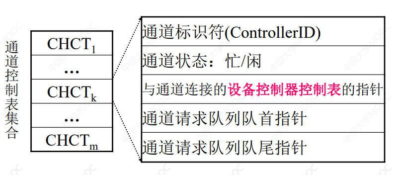
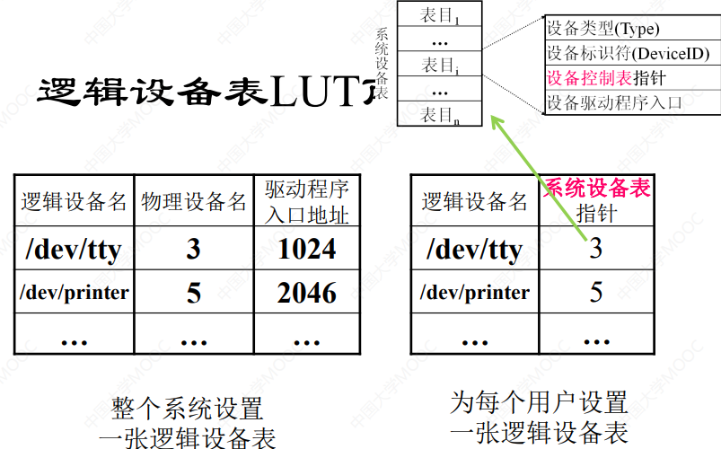
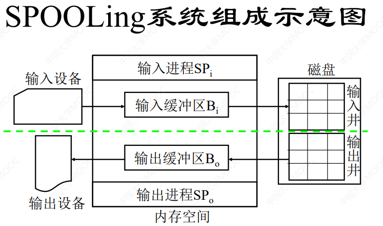
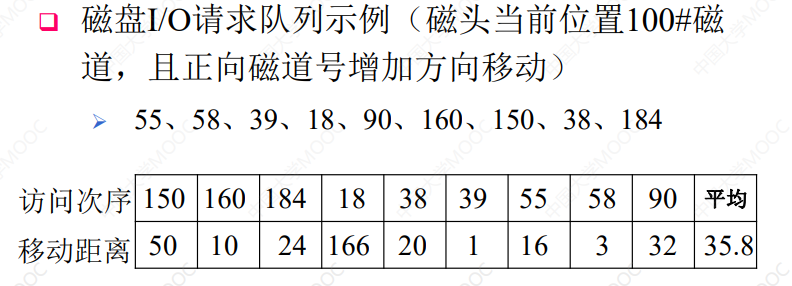

# **7.I/O管理**

## **1.I/O组成**

#### **1.I/O系统结构**

##### **1.I/O系统结构**


###### **1.控制器**

>   **总线控制器/打印机控制器/其它设备控制器/硬盘控制器/显卡**

###### **2.总线**

>   (16位)**ISA总线:Industry Standard Architecture,最早的标准总线(连接外设)**
>
>   (32位)**EISA总线:Extend,拥有更高的性能和32位架构**
>
>   **局部总线:为了特定外设的 直接连接到CPU的高速总线**
>
>   >   **VESA总线:Video Electronics Standards Association:主要用于显示器和显卡之间的数据传输**
>   >
>   >   (32或64位)**PCI总线:Peripheral Component Interconnect:如其名,主要用于连接外围设备**
>   >
>   >   **AGP总线:Accelerated Graphics Port:主要用于显卡,提供比PCI更高的带宽**
>   >
>   >   **PCI-Express:现代计算机常见的高速总线标准(高性能计算/服务器)**

###### **3.I/O设备**

>   **硬盘/显卡/打印机/Oth**

###### **4.处理器(CPU)/高速缓冲器**

>   **主机总线 直接连接 总线控制器**

###### **5.内存/内存管理部件**

>   **和CPU 和总线控制器 直接连接**

***

##### **2.微机总线型I/O系统**


###### **北桥:处理器(CPU)/显示器/内存**

>   **CPU总线/PCI Express总线/内存总线**

###### **南桥:硬盘/IO设备/USB接口**

>   **IDE(SCSI)/拓展槽口/USB接口**

***

##### **3.主机通道型I/O系统结构**


###### **简单的主机 to I/O关系**

****

#### **2.I/O设备分类及接口**

##### **1.按数据传输速率分类**

>   **高速设备/中速设备/低速设备**

##### **2.按信息交换单位分类**

>   **1.块设备(传输速率高/可寻址/DMA[内存直接存取])**
>
>   **2.字符设备(传输速率低/不可寻址/中断)**

##### **3.按设备共享属性分类**

>   **独占设备/共享设备/虚拟设别**

##### **4.设备与设备控制器之间的接口**


**总的来说:数据传输+数据控制**

>   **设备控制器 to IO设备:数据信号线/控制信号线**
>
>   **IO设备 to 设备控制器:状态信号线**

***

#### **3.设备控制器**

##### **1.设备控制器的功能**

>   **接收和识别信号**
>
>   **数据交换(数据寄存器)**
>
>   **标识和报告设备状态(状态寄存器)**
>
>   **地址识别(地址译码器)**
>
>   **数据缓冲(缓冲器)**
>
>   **差错控制(差错检查码)**

##### **2.设备控制器的组成**


**总的来说:数据传输+数据控制+地址查询**

###### **数据寄存器+状态控制寄存器+IO逻辑**

###### **IO逻辑主导的一系列接口**

***

#### **4.I/O通道**

***

##### **1.I/O通道的引入**

###### **1.目的**

**主要在提高I/O过程的独立性使得数据的传输独立于CPU**

###### **2.过程**

**设置通道后,CPU发出一条指令后,IO通道取出对应程序,完成对应的任务,通道发出中断信号**

###### **3.特性**

**通道为特殊的处理机,指令类型单一/无专有内存/通过执行通道程序控制IO操作**

***

##### **2.通道指令与通道程序**

###### **1.通道指令**

>   **读指令:外设->内存**
>
>   **写指令:内存->外设**
>
>   **控制指令:和具体控制设备有关(磁带机反绕/打印机换页)**

###### **2.通道程序**

>   **通道指令的逻辑集合,由设备驱动程序自动生成**

***

###### **3.通道类型**

>   **1.字节多路通道(连接低/中速IO)**
>
>   **含有许多<font color=red>非分配型子通道</font>在低/中速IO上,按时间片轮转共享主通道(按字节方式进行数据传送)**
>
>   **2.数组选择通道(连接高速IO)**
>
>   **只含有一个<font color=red>分配型子通道</font>一段时间内只能执行一道通信程序,控制一台设备<font color=red>按照数组方式进行数据传送,通道独占且利用率低</font>**
>
>   **3.数组多路通道(连接高/中速IO)**
>
>   **含有多个<font color=red>非分配型子通道</font>子通道按时间片轮转方式共享主通道,按数组方式进行数据传送**

***

**4.通道瓶颈问题及解决方案**


>   **设备控制器和设备之间加上联系**

## **2.I/0控制方式**

#### **1.程序I/O控制方法**

**(简单的忙-等待方式)**


#### **2.中断驱动I/O控制方式**

**(中断机制的引入)**


#### **3.直接内存存取型I/O控制方式**

**(DMA控制器/数据传输单位的扩大)**

##### **1.直接内存存取型控制方式组成**

>   **数据传输单位:数据块**
>
>   **数据传输途径:设备->内存**
>
>   **CPU干预:数据块传送开始与结束**


##### **2.DMA控制器的组成**


**总结:寄存器/计数器/控制逻辑/接口**

>   **寄存器:数据寄存器DR/命令寄存器CR/内存寄存器MAR**
>
>   **计数器:数据计数器DC**
>
>   **控制逻辑:IO控制逻辑**
>
>   **接口:设别控制器与块设备接口+设备控制器与设备接口**

##### **3.基于DMA磁盘读入数据的流程**


#### **4.通道型I/O控制方式**

**(通道/IO操作组织和数据传送的独立)**


**通道程序的执行流程:**


## **3.设备管理目标/功能及结构**

#### **1.设备管理程序的作用**

**用于控制与管理实现信息输入输出和存储的设备**

#### **2.设备管理的主要目标**

**方便用户使用/提高IO效率/设备管理的可扩充性**

#### **3.设备管理的功能**

**提供设备使用的用户接口/设备的管理(分配释放访问控制)/IO的调度和缓冲**

#### **4.设备管理的结构**


##### **1.用户空间IO请求支持层**

**提供对逻辑设备的控制**

>   **用户接口:提供抽象的命令**
>
>   **通信设备:提供通信体系结构的网络协议栈**
>
>   **文件存储设备:文件系统的逻辑结构控制**

##### **2.设备独立性软件层**

**逻辑设备与物理设备间过渡协调机构**

>   **目的:实现用户命令到操作序列的转换,也是一种缓冲机构**

##### **3.设备调度与控制层**

>   **目的:实现硬件物理设备的设备驱动/设备控制/状态维护/中断处理**

## **4.缓冲管理**

#### **1.缓冲技术的引入**

**1.缓冲技术引入的原因**

>   **缓和CPU和IO速度的不匹配/减少CPU的中断频率/提高CPU对IO设备的并行性**

**2.缓冲技术引入的主要功能**

>   **缓冲区的组织/缓冲区的获得与释放**

**3.利用缓冲技术降低中断频率**


>   **对于a:每$100\mu s$中断CPU一次,每秒传输1万位,响应处理$100 \mu s $**
>
>   **对于b:每$800\mu s$中断CPU一次,每秒传输1万位,响应处理$100 \mu s $**
>
>   **对于c:每$800\mu s$中断CPU一次,每秒传输1万位,响应处理$800 \mu s $**

#### **2.单缓冲**


#### **3.双缓冲**

>   **解释:不需要等待缓冲区为空的时间**


#### **4.循环缓冲**

>   **解释:多个缓冲区/多个指针**


#### **5.缓冲池**

**缓冲池的组成**

>   **三个队列及队首尾指针:空缓冲队列/输入队列/输出队列**
>
>   **四种工作缓冲区:**
>
>   >   **收容输入数据 的 工作缓冲区 Hin**
>   >
>   >   **提取输入数据 的 工作缓冲区 Sin**
>   >
>   >   **收容输出数据 的 工作缓冲区 Hout**
>   >
>   >   **提取输出数据 的 工作缓冲区 Sout**
>   >
>   >   
>   >
>   >   ```cpp
>   >   // type是队列的type
>   >   Getbuf(type){
>   >       Wait(RS(type));
>   >       Wait(MS(type));
>   >       B(number)=Takebuf(type);
>   >       Signal(MS(type));
>   >   }
>   >   Putbuf(type, number){
>   >       Wait(MS(type));
>   >       Addbuf(type, number);
>   >       Signal(MS(type));
>   >       Signal(RS(type));
>   >   }
>   >   ```


## **5.设备分配**

#### **1.设备分配用数据结构**

##### **系统设备表(SDT)**

>   **作用:记录系统全部设备的情况**
>
>   

##### **设备控制表(DCT)**

>   **作用:针对每台设备进行设置和记录**
>
>   

##### **控制器控制表(COCT)**

>   **作用:针对每个设备控制器而设置和记录对应的情况**
>
>   

##### **通道控制表(CHCT)**

>   **作用:针对每个通道而设置和记录对应的情况**
>
>   

#### **2.设备分配考虑因素**

###### **1.设备的故有属性(独占or共享or虚拟)**

###### **2.设备分配算法(FIFO/权值)**

###### **3.设备分配中的安全性(安全分配/不安全分配)**

>   **安全分配:**
>
>   **每当进程发出IO请求和获取某种资源,<font color=red>陷入阻塞状态,IO操作完成才唤醒</font>**
>
>   **不安全分配:**
>
>   **每当进程发出IO请求后继续执行(n个IO请求);<font color=red>仅当进程的请求被占用才阻塞</font>**

###### **4.设备独立性**


#### **3.设备独立性**

##### **概念**

>   **应用程序 独立于 具体使用的 物理设备**
>
>   **应用程序 以逻辑程序名称来请求 以物理设备名称实际执行**

##### **目的**

>   **保证 灵活性/可扩展性/适用性**
>
>   **易于实现IO重定向**

##### **逻辑设备名到物理设备名的映射**

>   **逻辑设备表LUT及设置问题**:记录进程的 逻辑设备名+系统分配的物理设备名
>
>   **方式:**
>
>   **1.整个系统设置一张逻辑设备表(单用户系统)**
>
>   **2.每个用户设置一张逻辑设备表(放入进程的PCB中)**
>
>   

##### **设备独立性软件**

**作用:**

>   **1.向用户空间IO请求支持层软件提供同一接口**
>
>   **2.执行所有设备的公有操作**
>
>   >   **设备的分配和回收/逻辑设备的映射/逻辑到物理的转换/缓冲管理/设备保护/差错控制(处理设备驱动程序返回错误)**

***

#### **4.独占设备的分配程序**

**1.基本的设备分配流程**

>   **分配设备->分配设备控制器->分配通道**
>
>   **物理设备名->SDT->DCT->COCT->CHCT**
>
>   **(即状态&计算分配安全性->分配或插入请求进程队列)**

**2.设备分配程序的改进**

>   **1.基本设备分配程序的不足**
>
>   >   **进程以物理设备名提出要求**
>   >
>   >   **采用单通路IO系统结构,产生瓶颈现象**
>
>   **2.改进**
>
>   >   **进程以逻辑设备名提出要求(逻辑设备->SDT->DCT)**
>   >
>   >   **考虑多通路IO系统结构**

#### **5.假脱机技术(SPOOLING)**

**1.主要思想**

**将一台独占设备改造成共享设备**

(Simultaneous Peripheral Operations On-line)

>   **不同于加一个外围机控制(这里使用了软件代替硬件,使用了两道程序)**
>
>   **所以是一个多道程序系统**


**2.SPOOLING系统的组成**

>   **输入井/输出井(开辟存储空间收容数据)**
>
>   **输入缓冲区/输出缓冲区(开辟存储空间暂存数据)**
>
>   **输入进程SPi/输出进程SPo(模拟脱机输入输出的外围控制机)**
>
>   **请求输入队列/请求输出队列(由用户请求输入输出表构成)**
>
>   

**3.SPOOLING系统实例:共享打印机**

>   **广泛存在于多用户系统和局域网络中**
>
>   **流程**
>
>   >   **1.用户提出打印请求**
>   >
>   >   **2.输出程序->输出井申请空闲区->放入打印的数据**
>   >
>   >   **3.输出进程->申请空白用户请求打印表->填入用户要求->挂到请求队列**
>   >
>   >   **4.进程判断空闲->取出一张请求打印表->从输出井到内存缓冲区并打印**
>   >
>   >   **5.进程判断空闲(no)->自己被阻塞->再次请求(唤醒)**

**4.SPOOLING系统的特点**

>   **1.提高了I/O速度**
>
>   >   **将I/O操作转化为对输入输出井的存取**
>   >
>   >   **CPU数据处理和I/O操作的并行**
>
>   **2.将独占设备改造为共享设备**
>
>   **3.实现了虚拟设备功能**

***

#### ***重点问题解析:内存地址映射**


***


>   **1.有效地址32位,所以虚拟地址大小为$2^{32} = 4GB$**
>
>   **2.页长位8KB,即一页有$2^{13}$字节**
>
>   **$页数 = \frac{进程地址空间大小}{页大小} = \frac{2^{32}}{2^{13}} = 2^{19}=512K $**
>
>   **3.**
>
>   ```TXT
>   处理器给出的有效地址:ABCDE,又有效地址为32位
>   ABCDE:1010 1011 1100 1101 1110(只有20位)
>   补位后:0000 0000 0000 1010 1011 1100 1101 1110
>   一页13位(作为偏移量)
>   所以
>   页号:000 0000 0000 0101 0101 (00055即0x55)
>   //之前讲过,换成十进制也行,1+4+16+64=85
>   页内偏移:1 1100 1101 1110 (0x1CDE)
>   
>   ```
>
>   **4.**
>
>   ```TXT
>   该页对应的物理块号为222(十进制),则对应的物理地址?
>   //之前的公式:物理块号的二进制+偏移量
>   
>   将 222 除以 2，得到商 111 和余数 0。
>   将 111 除以 2，得到商 55 和余数 1。
>   将 55 除以 2，得到商 27 和余数 1。
>   将 27 除以 2，得到商 13 和余数 1。
>   将 13 除以 2，得到商 6 和余数 1。
>   将 6 除以 2，得到商 3 和余数 0。
>   将 3 除以 2，得到商 1 和余数 1。
>   将 1 除以 2，得到商 0 和余数 1。
>   现在，我们可以将这些步骤中的余数从后向前排列，得到 222 的二进制表示：
>   11011110
>   因此，222 的二进制表示是 11011110。
>   
>   所以1 1011 1101 1100 1101 1110
>   0x1bdcde
>   
>   ```


```txt
虚拟地址逻辑:32位
页大小:4KB,也就是12位(偏移量)
页表项大小:32位
状态位位1表示在内存中,0表示页面缺页
给定的逻辑地址0000AE25H

0000AE25H:(只取32位,H是)
0000 0000 0000 0000 1010 1110 0010 0101 

前20位作为页号:0000 0000 0000 0000 1010 = 10页->没有物理块
后12位为偏移量:1110 0010 0101 

没有对应映射;所以页失效
```

***

## **6.设备处理**

#### **1.设备处理程序的功能**

>   **1.接收IO请求,转化为具体要求**
>
>   **2.检查IO请求合法性**
>
>   **3.检查IO设备并且挂起**
>
>   **4.传递IO设备相关参数和方法**
>
>   **5.发送IO指令,分配IO设备**
>
>   **6.及时响应中断请求并且进行处理**

#### **2.设备处理方式**

**基本思想:根据设备处理时是否设置进程/设置何种进程而划分**

**处理方式类型:**

>   **1.每一类设备设置一个进程**
>
>   **2.整个系统设置一个IO进程**
>
>   **3.不设置专门的设备处理进程(只是设置相应设备处理程序或独立性软件)**

#### **3.设备处理程序的特点**

>   **1.用于IO请求 进程 与 设备控制器间通信**
>
>   **2.与IO设备特性相关:不同类型设备 配置 不同驱动程序**
>
>   **3.与IO控制方式相关: 中断/DMA(内存直接存取)/通道IO**
>
>   **4.与硬件紧密相关,需要用汇编语言书写**

#### **4.设备驱动过程**

>   **1.转换IO请求 为 具体需求**
>
>   **2.检查IO请求合法性**
>
>   **3.检查IO设备是否可用**
>
>   **4.传递和设置 相关参数和工作方式**
>
>   **5.发出IO命令,启动IO设备**

#### **5.中断处理过程**

>   **保护现场->分析原因->处理问题->恢复现场->继续执行**
>
>   
>
>   

## **7.磁盘存储器管理**

#### **1.磁盘性能描述**

###### **1.磁盘存储器(实现虚拟存储的必须硬件)**

**容量大/存储速度块/随机存取/存放文件的主要外存**

###### **2.磁盘存储器管理的主要任务**

>   **1.为文件分配必要的存储空间**
>
>   **2.提高存储空间利用率**
>
>   **3.合理组织文件结构,提高文件访问速度**
>
>   **4.提高磁盘IO速度**
>
>   **5.采取必要冗余措施,确保文件系统的可靠性**

###### **3.数据的组织和格式**

**主要层次:盘片(盘面)/磁道/扇区(盘块)**


###### **4.磁盘的类型**

**1.硬盘和软盘/单片盘/多片盘**

**2.固定头磁盘:每个磁道有一个读写磁头,并行读写,有效提高速度(大容量磁盘)**

**3.活动头磁盘:每个盘面只有一个读写磁头,串行读写(中小型磁盘)**


#### **2.磁盘调度**

##### **主要目标**

**对于多个进程共享的设备,采用调度算法,使得评价访问时间(寻道时间)最小**

>   **<font color=red>但是查询距离直接影响寻道时间,因此使用平均查找距离作为标准</font>**

##### **磁盘访问时间**

**1.寻道时间**

>   **定义:磁头移动到指定磁道所需时间(启动磁臂s+移动n条磁道所花费时间和)**
>
>   $$T_s = m \times n +s (m为常数)$$
>
>   (一般磁臂启动时间为2ms,对于一般的温盘,寻道时间随寻道距离的增加增大)

**2.旋转延迟时间$T_r $:指定扇区移动到磁头下面所经历的时间**

**3.传输时间$T_t $:数据读出或写入所经历时间(与字节数和转数有关)**

>   $$T_t= \frac{b}{rN} (其中r为磁盘每秒钟专属,N为一条磁道上的字节数)$$

**<font color=red>综上:访问时间$T_a = T_s + T_r + \frac{b}{rN}  $ </font>**

##### **常用的磁盘调度算法**

###### **1.先来先服务FCFS**

>   **基本思想:所访问磁道 与磁头当前所在磁道 距离最短 的进程优先调度**
>
>   (按照队列顺序,从左往右)(寻道时间较长)


###### **2.最短寻道优先SSTF**

(Shortest Seek Time First)

>   **基本思想:选择距离最短的进程优先调度(会导致饥饿)**


###### **3.扫描算法(电梯算法)**

>   **基本思想:不仅考虑欲访问磁道与磁头当前所在磁道的间距，更优先考虑的是磁头当前移动的方向**
>
>   (下面的例子中,先顺时针扫描,再逆时针扫描,先上楼再下楼)
>
>   

###### **4.循环扫描算法(CSCAN)**

>   **基本思想:规定磁头单向移动，避免某些进程磁盘请求的严重延迟**
>
>   

###### **5.N步扫描算法/FSCAN算法**

>   (为了避免磁臂黏着,只在一个区域)
>
>   **N步:分为N的子队列,按FCFS依次处理这些子队列,各队列用扫描算法**
>
>   **FSCAN:请求分为执行队列和等待队列,执行队列用扫描算法**

#### **3.磁盘高速缓冲**

###### **1.基本概念**

**利用内存中的存储空间 暂存 磁盘中读出的盘块的信息**

**(逻辑上是磁盘,实际上是内存的盘块)**

###### **2.磁盘高速缓冲在内存的形式**

>   **1.开辟单独的固定大小**
>
>   **2.与虚拟存储器共享内存缓冲池**

###### **6.磁盘高速缓冲的环节**

>   **1.数据交付:高速缓冲->请求者进程(数据/指针)**
>
>   **2.置换算法(最久未使用算法LRU)**
>
>   **3.周期性写回磁盘(防止突然丢失:写穿透高速缓存Write-Through Cache)**

#### **4.提高磁盘IO速度的方法**

**1.读写方法:提前读/延迟写/虚拟盘(RAM)**

**2.读取内容:优化物理块的分布/优化索引结点的分布**

#### **5.廉价磁盘冗余序列RAID**

**主要思想:利用一台 磁盘阵列控制器 来 统一控制 磁盘驱动器**

**好处:可靠性高/IO速度高/性价比高**

**主要方式:并行交叉存储:**

>   **每个盘分为子盘块/存储到不同硬盘相同位置/并行传输**

***

## **补充:磁盘IO全过程剖析**


缓冲+设备独立性+打印机如何进行共享(Spooling)+磁盘调度
