# **8.文件管理**

## **1.文件和文件系统**

#### **1.文件管理目标及功能**

**文件管理目标:方便用户/保证安全/存取快速/资源利用**

**文件管理功能:管理在外存的文件/提供文件存取共享保护手段**

**文件系统技术:目录/索引结点/结构优化/存取控制矩阵/容错技术**

#### **2.文件/记录/数据项**

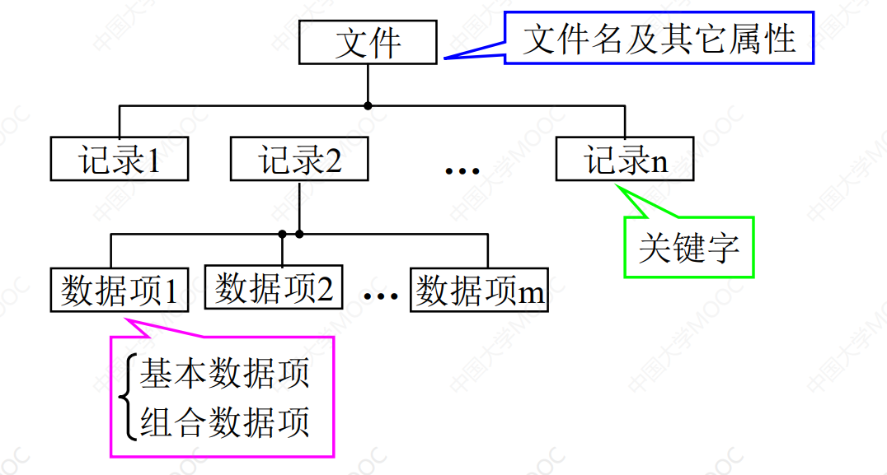

#### **3.文件类型**

**按文件性质分类:系统文件/用户文件/库文件**

**按文件中 数据形式分类:源文件/目标文件/可执行文件**

**按存取控制属性分类:只执行文件/只读文件/读写文件**

**按文件 逻辑物理结构 分类**

#### **4.文件系统模型**

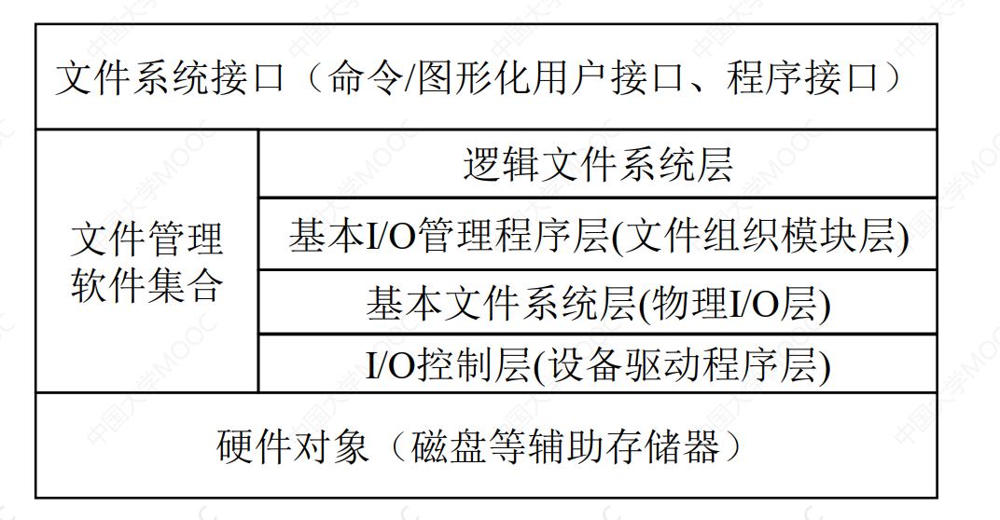

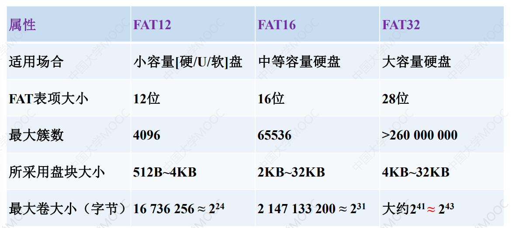

#### **5.文件操作**

**创建/删除/读写/截断/设置位置/打开关闭/属性设置获取/目录/共享**

## **2.文件的逻辑结构**

#### **1.文件逻辑结构及设计要求**

**提高检索效率/方便修改/降低存储成本**

#### **2.文件逻辑结构类型**

**1.有结构文件(记录式文件)**

>   **顺序文件/索引文件/分组索引文件**

**2.无结构文件**

>   **基于读写指针和字符进行存取**

#### **3.顺序文件**

**1.逻辑记录的排序:(串结构与顺序结构)**

**2.顺序文件的读写操作:**

**3.顺序文件评析:**

>   **适用于批量存取及磁带介质**
>
>   **交互性差,低效**

**4.顺序文件直接存取分析**

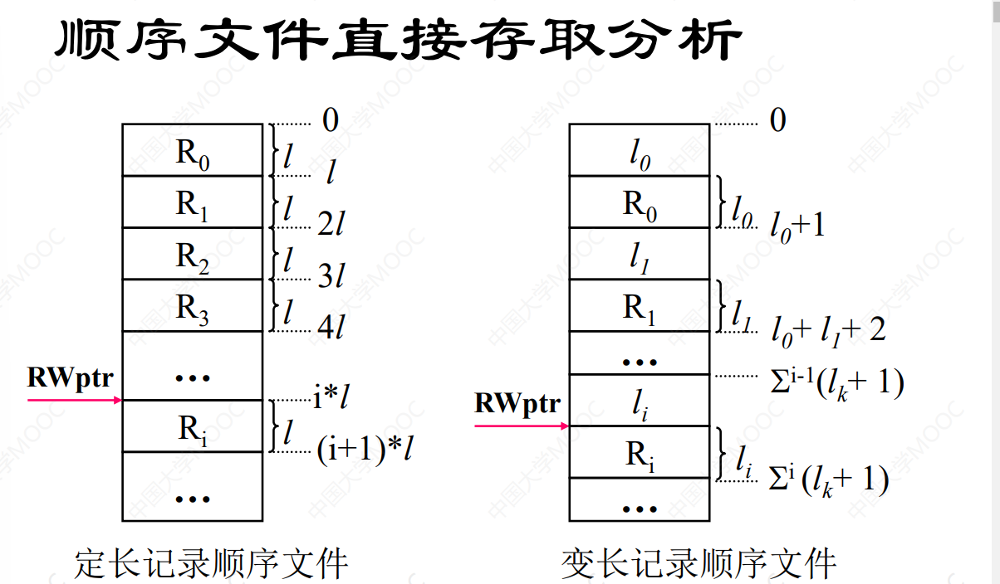

#### **4.索引文件**

**组成:索引表+主数据文件**

>   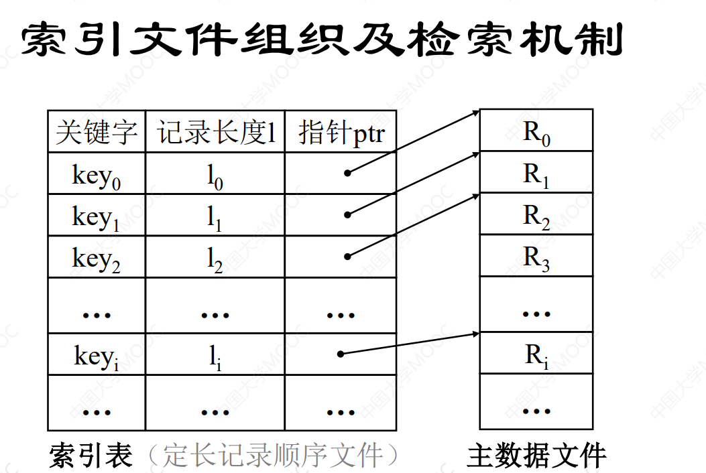

#### **5.索引顺序文件**

>   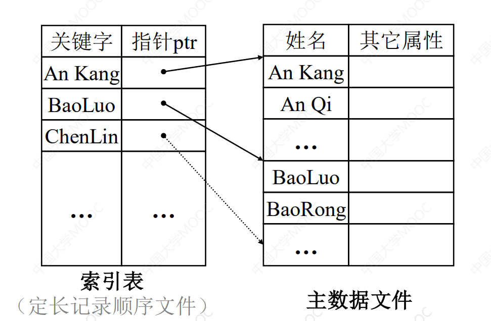
>
>   **2.索引顺序文件效率分析(学校不讲)**

## **3.外存分配方式**

#### **1.文件物理结构与外存分配**

**1.文件物理结构(存储结构):即文件在外存中的存储组织形式**

**2.外存空间分配方法设计目标:提高 空间利用及文件访问速度**

**3.外存分配方式与文件物理结构**

>   **连续分配<->顺序文件结构**
>
>   **链接分配<->链接式文件结构**
>
>   **索引分配<->索引式文件结构**
>
>   **直接文件与散列文件**

#### **2.连续分配**

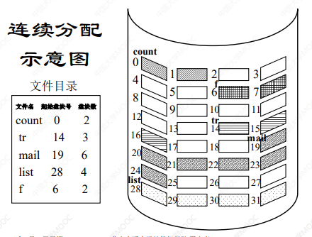

**缺点:**

>   **外部碎片问题:空间分割后形成的较小的无法储存文件的连续区**
>
>   **要求有连续的存储空间,空间利用率低**
>
>   **必须事先知道文件的长度**

**优点:访问速度快/支持直接存取**

#### **3.链接分配**

###### **基本思想**

**支持离散分散方式,通过盘块上的指针实现多个离散盘块的链接**

###### **优点**

>   **消除了外部碎片,提高外存利用率**
>
>   **按需分配,无需知道文件长度**
>
>   **支持文件动态增长,方便文件增删改查**

###### **链接方式**

**1.隐式链接**

**在该结构中，文件目录的每个目录项中，包含指向链接文件第一
个盘块和最后一个盘块的指针，其他盘块号则由链接指针记录。**

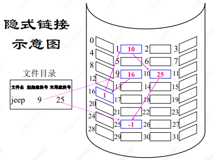

>   **缺点**
>
>   **只适合顺序访问,随机存取及其低效**
>
>   **指针依赖大.任何指针出现问题都会导致整体的问题**

**2.显式链接**

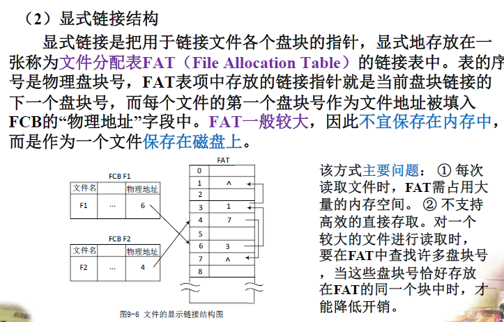

#### **4.索引分配**

**基本思想**

>   **文件打开后把该文件所占用盘块编号调入内存即可**
>
>   (索引块->文件->文件目录项->索引块指针)

**缺点**

>   **不能支持高效的直接存取**
>
>   **FAT占用的内存较大并且文件所占盘块号随机**

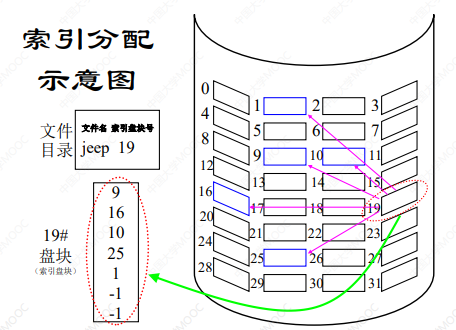

**拓展:两级多级索引分配**

>   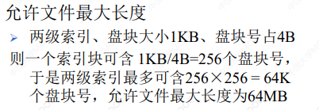
>
>   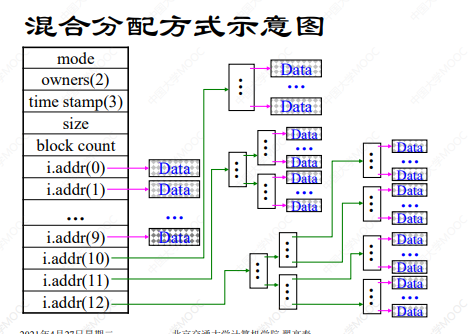

#### **5.直接文件和散列文件**

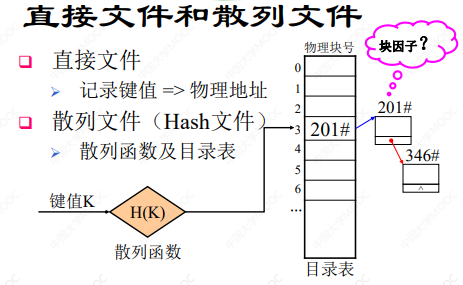

#### **6.文件分配表空间开销计算**

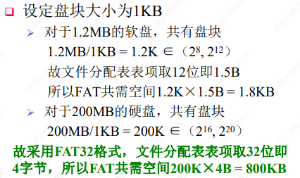

## **4.文件存储空间管理**

#### **1.管理目标与技术**

**文件存储空间管理目标:外存空间的利用与文件访问速度**

**文件存储空间管理技术要领**

>   **离散分配与连续分配的优劣**
>
>   **文件物理结构与存储组织方式**
>
>   **分配以掌握空间使用情况**

#### **2.空闲表法**

**性质:连续分配方式**

**空闲盘区的分配:**

>   **首次适应算法**
>
>   **循环首次适应算法**
>
>   **最佳适应算法**

**空闲盘区的回收:考虑回收区域和插入点是否相邻接**

#### **3.空闲链表法**

**目的:将所有空闲盘区拉成一条空闲链**

**定义:**

>   **1.空闲盘块链:以盘块为基本元素链接**
>
>   **2.空闲盘区链:以盘区为基本元素链接,且每个盘区包括(指针+具体信息)**

#### **4.位示图法**

###### **1.位示图定义**

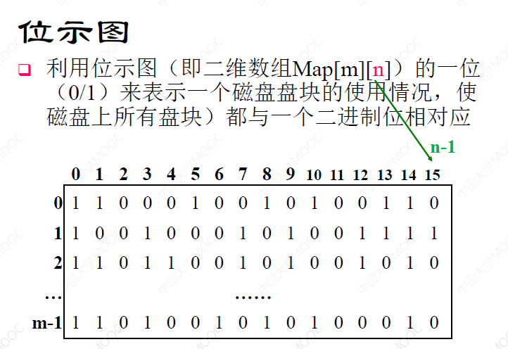

###### **2.物理块(盘块)的分配**

>   **1.顺序扫描:找到一个空闲的二进制区域**
>
>   **2.将找到的行列号转换为盘块号(公式:$b = n \times i +j $)**
>
>   **3.按照盘块号分配盘块,同时修改位示图**

###### **3.物理块(盘块)的回收**

>   **1.将盘块号转化位位示图的行号列号**
>
>   >   **(i = b DIV n;j = b MOD n)**
>
>   **2.按盘块号回收盘块**
>
>   **3.根据回收盘块对应的二进制修改位示图**

#### **5.成组链接法**

**1.成组链接法示意图**

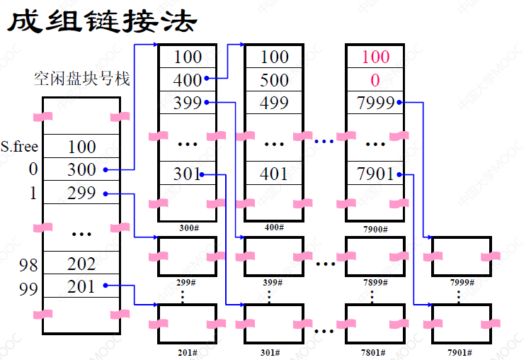

**2.空闲盘块的分配**

>   **1.检查空闲盘块号 栈 是否上锁**
>
>   >   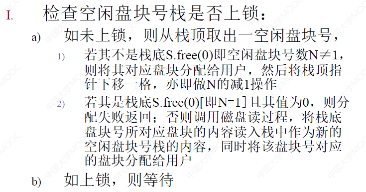
>
>   **2.分配盘块缓冲,然后返回**

**3.空闲盘块的回收**

>   **1.检查空闲盘块号 栈 是否上锁**
>
>   >   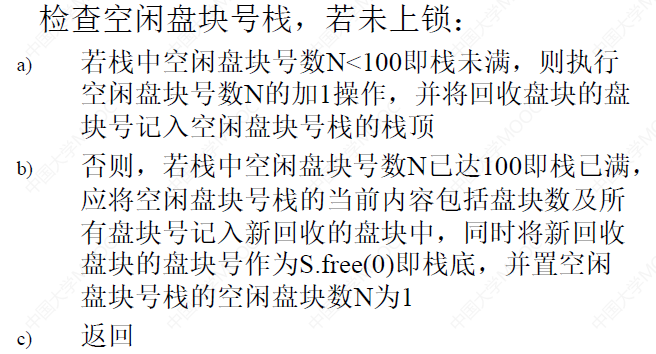
>
>   **2.等待**

********

 # **(下面不讲不考)**

**

## **5.目录管理**

**1.目录管理基本要求**

**2.文件控制块**

**3.索引结点**

**4.目录结构**

**5.目录查询技术**

## **6.文件共享与保护**

## **7.数据一致性控制**