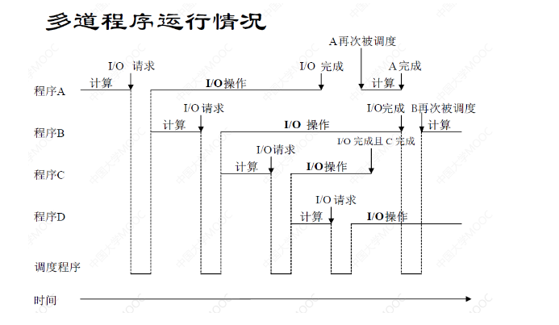
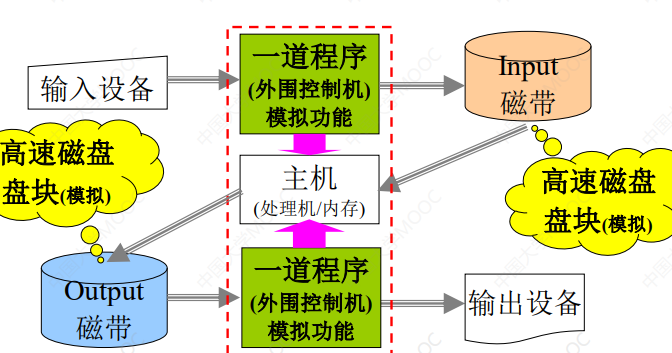
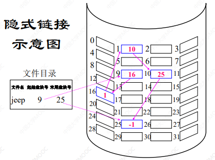
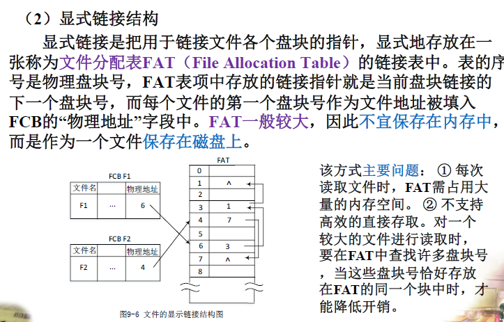
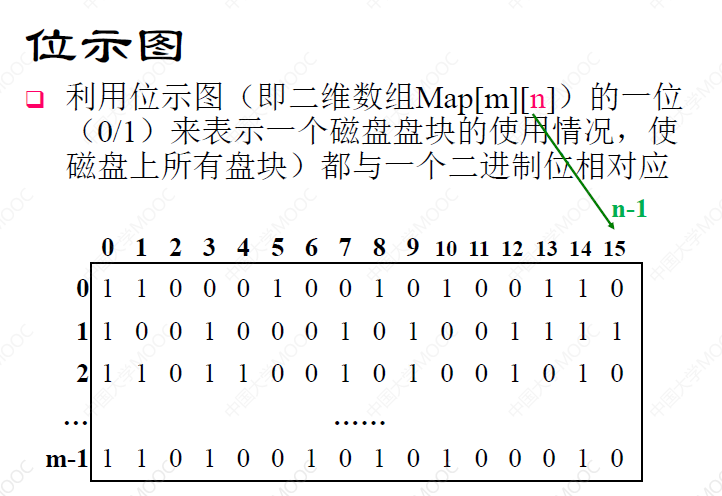
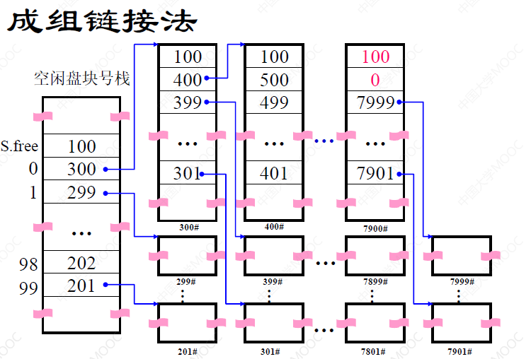
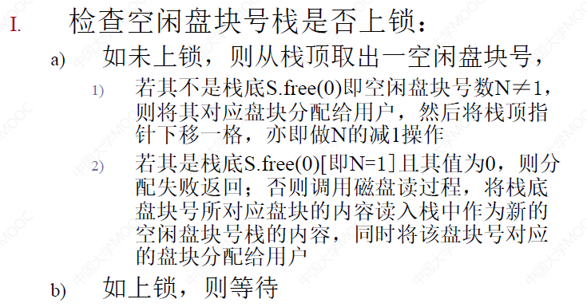
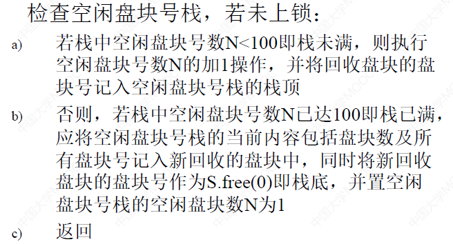

# **操作系统知识梳理** 

## **0.WarmUp**

<font color=Deeppink>1.死锁的四个必要条件:互斥条件/请求和保持状态/不可抢占条件/循环等待</font>

<font color=Deeppink>2.一次仅允许一个进程访问的共享资源称为**临界资源**，对其实施操作的那段程序称为**临界区**。</font>

<font color=Deeppink>3.操作系统定义:操作系统是计算机系统中的一个"系统软件"，是一些程序模块的集合</font>

<font color=Deeppink>4.操作系统四大特征:并发/共享/虚拟/异步</font>


```txt
有5 个批处理作业A、B、C、D、E 几乎同时到达，预计它们的运行时间为12、8、4、6、10min。采用短作业优先算法，求平均周转时间和平均带权周转时间分别是多少。

|:执行次序:|:到达时间:|:运行时间:|:开始时间:|:完成时间:|:周转时间:|:带权周转时间: |
|   C	  |  0		|	4    |  0	   |  4      | 4-0=4 |   4\4 = 1    |
|   D     |  0      |   6    |  4      |  10     |10-0=10|   10\6 = 1.67|
|   B	  |  0		|   8    |  10     |  18     |18-0=18|   18\8=2.25  |
|   E	  |  0		|	10   |  18	   |  28     |28-0=28|   28\10=2.8	|
|   A     |  0		|   12	 |  28     |  40     |40-0=40|   40\12=3.33 |

平均周转时间: (4 + 10 + 18 + 28 + 40) / 5 = 100 / 5 = 20
平均带权周转时间:(1 + 1.67 + 2.25 + 2.8 + 3.33) / 5 = 11.05 / 5 = 2.21
```


```txt
在一个分页存储管理系统中，设某作业有0~3 共4 页，每页大小4KB，
页表:0->2  1->4  2->1  3->6
每页4KB:地址偏移12位  0~3共4页:所以页号2位
（1）若给出逻辑地址LA
	（1）[ 0，190 ]、（2）[ 2，40 ]、（3）[ 5，70 ]，请判断逻辑地址是否有效，并计算有效的逻辑地址所映射的内存（物理）地址PA。
    解:首先4KB=2^12,所以取12位
       (1)[0,190]:0->2+190:2 * 4KB + 190 = 8192 + 190 = 8382
       (2)[2,40]:2->1+40:：1 * 4KB + 40 = 4096 + 40 = 4136
       (3)[5,70]:不合法,5不存在对应物理块映射
   
（2）试将以下三个逻辑地址：1011、3000、5012 分别转化为相应的物理地址。
(页号是2位,偏移量是后12位,取14位,物理地址 = 物理块号 * 页大小 + 页内偏移)
注意是十进制:

1011：
    页号：1011 / 4096 = 0
    页内偏移：1011 % 4096 = 1011
    物理块号（查表）：2
    物理地址：2 * 4096 + 1011 = 9203
3000：
    页号：3000 / 4096 = 0
    页内偏移：3000 % 4096 = 3000
    物理块号（查表）：2
    物理地址：2 * 4096 + 3000 = 11192
5012：
    页号：5012 / 4096 = 1
    页内偏移：5012 % 4096 = 916
    物理块号（查表）：4
    物理地址：4 * 4096 + 916 = 17300
================================================================================================
如果是16进制
(32页,所以是2^5,1KB,所以说2^10,共取15位)
对于0A5C:000 1010 0101 1100  前5位为页号,后10位为偏移量 (00010)_2,(1001011100)_2
从右往左:0*2^0+1*2^1+0*2^2....=2,所以页号为4,对应(0100)_2
映射的物理块号的二进制和偏移量结合:(00)01 0010 0101 1100,即125C
```

```
朋友	已占有资源Max 	最大需求数Allocation 	Need 		Work		A+W      序列 	
		R M G 				R M G 			R M G 		R M G		R M G	 
A 		0 1 0 				7 5 3 			7 4 3 		7 4 3       7 5 3     3      
B 		2 0 0 				3 2 2 			1 2 2       5 4 3       7 4 3     2
C 		3 0 2 				9 0 2 			6 0 0       7 5 5       10 5 7    5     
D 		2 1 1 				2 2 2 			0 1 1       (3 3 2)     5 4 3     1
E 		0 0 2		 		4 3 3 			4 3 1       7 5 3       7 5 5     4

根据已有资源和T0算出总数:10 5 7
目前Available 3 3 2
```


## **第一部分 绪论**

#### **1.操作系统定义**

><font color=red>**操作系统是计算机系统中的一个"系统软件"，是一些程序模块的集合**</font>

#### **2.操作系统的五大功能**

>   **<font color=red>处理机管理功能/存储器管理功能/设备管理功能/文件管理功能/用户系统(用户接口)</font>**

#### **3.现代操作系统的四大特征；并发性；并行性**

>**<font color=red>四大特征:并发/共享/虚拟/异步</font>**

>   **<font color=red>并行性和并发性的区别</font>**
>
>   **<font color=navy>并发性（Concurrency）： 指的是多个任务在重叠的时间段内发生。</font>**
>
>   >这些任务可以交替执行，但不一定在同一时刻同时进行。
>   >
>   >重点是多个任务在时间上有重叠。
>
>   **<font color=navy>并行性（Parallelism）： 指的是多个任务在同一时刻同时进行。</font>**
>
>   >   这通常需要多个处理单元（例如多核 CPU 或多个计算机）才能实现。

#### **4.操作系统的三个基本类型及其特点**

**<font color=navy>三个基本类型:批处理操作系统/分时操作系统/实时操作系统</font>**

>   **<font color=red>批处理操作系统特点</font>**
>
>   >   **任务的批处理/脱机运行/<font color=purple>系统资源利用率高</font>**
>   >
>   >   **交互性差/周转时间长**

>   **<font color=red>分时操作系统</font>**
>
>   >   **多用户共享/<font color=purple>时间片轮转</font>/交互性强/响应及时**

>**<font color=red>实时操作系统</font>**
>
>>   **实时性强/可靠性/<font color=purple>优先级调度</font>**

#### **5.多道程序设计技术及其本质**

>(**解决了CPU和IO速度不匹配的问题**)
>
>>   **<font color=red>和缓冲区解决速度不匹配的思路不同</font>**
>>
>>   **多道程序设计技术:通过并发执行多个程序，最大限度地利用CPU时间，减少CPU的空闲时间。**
>>
>>   **缓冲区技术:通过缓冲区的缓冲作用，协调CPU和I/O设备之间的数据传输速度，减少CPU的等待时间。**
>
>**作业后备队列/作业调度算法/系统资源共享**
>
>**优点:CPU、内存、IO设备利用率提高，系统吞吐量提高,提高资源利用率**
>
>**特征:多道性(存放多个数据)/宏观上并行/微观上串行**
>
>**本质:提高资源利用率**
>
>
>
>
>
>
>
>

## **第二部分 处理机管理**

#### **1.进程和线程**

进程及引入的背景；进程的特征；线程及引入背景；进程和线程的区别 

###### **<font color=red>1.进程出现的原因</font>**

>   **基于程序的概念不能完整描述程序在内存的状态**
>
>   **比如前驱图**

###### **<font color=red>2.进程的特征</font>**

>   **结构特征:程序段/数据段/进程控制块PCB**
>
>   **运行特征:动态性/并发性/独立性/异步性**
>
>   >**<font color=red>动态性:具有生命周期</font>**
>   >
>   >**<font color=red>并发性:从内存上宏观同时运行</font>**
>   >
>   >**<font color=red>独立性:调度\资源分配\运行</font>**
>   >
>   >**<font color=red>异步性:相互独立速度未知</font>**

###### **<font color=red>3.线程及引入背景</font>**

>**引入:进程操作的时空开销较大,进程并发执行程度及通信效率受限**
>
>**解决方法:资源调度分配**
>
>**<font color=purple>定义:线程是进程内"相对独立的","可独立调度和指派的"执行单元</font>**
>
>>**进程是第一属性任务,线程是辅助执行的第二属性任务,也是CPU调度单位**
>
>**性质:**
>
>>   **线程只能共享资源,不占有资源(独立调度和分派的基本单位)**
>>
>>   **一个线程至少有一个线程,但一个线程不能独立存在**
>
>

###### **<font color=red>4.线程和进程的区别</font>**

>   

###### **5.进程的相互制约关系**

>   **直接制约:相互合作关系🥹谁先执行都行,但是必须互斥(Mutual Exclusion)**
>
>   **间接制约:资源共享关系🥵有明显的执行次序,进程间同步(Synchronization,按照次序)**

****

#### **2.PCB**

###### 2.进程控制块PCB

>   **<font color=red>进程的一部分,"描述进程情况"以及"控制进程运行所需所有信息"的数据结构</font>**
>
>   **作用:**
>
>   >   **使多道程序环境不能独立运行的程序,成为能独立运行和并行运行的基本单位**
>   >
>   >   (同时提供重要信息,实现和其它进程的同步与协调)
>
>   **内容:**
>
>   >**1.进程标识符:内部/外部,父/子进程,用户标识符**
>   >
>   >**2.处理器状态信息:寄存器/计数器/程序状态字/用户栈指针**
>   >
>   >**3.进程调度信息:进程状态/进程优先级**
>   >
>   >**4.进程控制信息:程序和数据地址/进程同步指针/资源清单/链接指针**
>
>   **意义:**
>
>   >**操作系统"控制和管理并发进程"的依据**
>   >
>   >**进程存在的唯一标志**
>   >
>   >**常驻内存并且存放在PCB区**
>
>   **组织方式:PCB栈和PCB队列**

****

#### **3.状态模型**

3.进程三个基本状态模型及其状态转换

（包括状态转换原因，会用图示加以说明）； 

###### **<font color=red>1.两状态模型</font><font color=purple>(运行态\非运行态)</font>**

>   **1.状态转换原因**
>
>   >   **进程执行完毕/时间片用完/请求中断**
>
>   **2.缺点**
>
>   >**即使时间片没有用完也会中断->资源共享/响应/避免饥饿**
>
>   **3.图示**
>
>   >   

###### **<font color=red>2.三状态模型</font><font color=purple>(就绪态\运行态\阻塞态)(就绪队列)</font>**

>   **1.状态转换原因**
>
>   >   **1.就绪状态:进程获取必要资源,但是没有空闲CPU,进入就绪队列**
>   >
>   >   >   **(多个进程PCB组成就绪队列)**
>   >
>   >   **2.运行状态:进程获取必要资源和CPU,正在运行**
>   >
>   >   **3.阻塞状态:发生等待事件而处于阻塞队列**
>   >
>   >   (阻塞态->运行态不合法(未分配资源),就绪态->阻塞态不合法(语义冲突))
>
>   **2.图示**
>
>   >   

###### **<font color=red>3.五状态模型</font><font color=purple>(就绪态\运行态\阻塞态\新建态\终止态)</font>**

>   **1.状态转换原因**
>
>   >   **1.就绪状态:进程获取必要资源,但是没有空闲CPU,进入就绪队列**
>   >
>   >   **2.运行状态:进程获取必要资源和CPU,正在执行**
>   >
>   >   **3.阻塞状态:发生等待事件而处于阻塞队列**
>   >
>   >   **4.新建态:新创建进程,分配必要资源,还没有进入就绪队列**
>   >
>   >   **5.终止态:进程执行完成 或 产生错误 ,系统正在回收**
>   >
>   >   **<font color=red>不存在阻塞-执行(插队执行)/就绪-阻塞(语义冲突)</font>**
>
>   **2.图示**
>
>   >   

****

#### **4.进程的挂起与激活**

(这里都复习一遍,属于PCB控制块中的内容)

[进程控制块PCB](【操作系统】2&3.进程管程线程_同步与通信.md#2.2 进程控制块)

###### **<font color=purple>1.进程的创建与终止</font>**

>   **创建:用户登录/作业调度/提供服务/应用请求**
>
>   >   **`Create()`原语**
>   >
>   >   ```TXTX
>   >   1.分配 标识符 & 申请 空白进程控制块
>   >   2.分配 必要的内存空间
>   >   3.初始化 进程控制块
>   >   4.新进程 插入 就绪进程队列
>   >   ```
>
>   **终止:正常结束/异常结束/外界干预**
>
>   >   **`Terminate()`原语**
>   >
>   >   ```TXT
>   >   1. 检索 被终止进程的PCB(找到进程)
>   >   2. 如果正在进行 则立即终止并且进行调度
>   >   3. 终止子孙进程
>   >   4. 资源归还
>   >   5. 移除PCB,等待其它程序的利用
>   >   ```

###### **<font color=purple>2.进程的阻塞与唤醒</font>**

>   **阻塞:请求不能立即满足的系统服务/启动某种不能立即满足的操作/新数据未到达/无新工作**
>
>   >   **`Block`原语:**
>   >
>   >   ```TXT
>   >   1.立即停止执行,PCB状态从"执行"到"阻塞",插入阻塞队列中
>   >   2.调度程序进行重新调度,处理机分配给另一就绪进程,并进行切换
>   >   ```
>
>   **唤醒:系统服务/操作/数据/新任务 满足要求,继续执行**
>
>   >   **`Wakeup()`原语**
>   >
>   >   ```TXT
>   >   1.从阻塞进程队列中移出
>   >   2.将PCB中的状态从"阻塞态"改为"就绪态"
>   >   3.插入就绪队列中
>   >   ```

###### **<font color=red>3.进程的挂起与激活</font>**

挂起的原因:终端用户请求\父进程请求\操作相同要求\负载要求(两请求,两要求)

>   **挂起:**
>
>   >   **`Suspend()`原语**
>   >
>   >   ```TXT
>   >   1.检查被挂进程 的 现行状态 修改or插队
>   >   2.复制PCB到指定区域
>   >   3.若被挂进程正在执行 转向 调度程序重新调度
>   >   ```
>
>   **激活:**
>
>   >   **`Activate()`原语**
>   >
>   >   ```TXT
>   >   1.检查进程现行状态并修改和插队
>   >   2.若新进程进入就绪程序
>   >   3A.如果是抢占式,可能直接抢占
>   >   3B.如果不是抢占式,检查和决定是否重新调度
>   >   ```

****

#### **5.什么是同步？互斥？**

##### **<font color=red>1.互斥</font>**

>   **1.定义**
>
>   >   (**在一段时间内，只允许一个进程访问某个共享资源。(其它必须等待)**)
>   >
>   >   当一个进程正在使用某个独占性资源时，其他想要使用该资源的进程必须等待。只有当该进程释放资源后，其他进程才能访问。这种因争夺共享资源而产生的制约关系称为互斥。
>
>   **2.实现方式**
>
>   >   **互斥锁(Mutex)/信号量/管程**
>
>   **解释:**
>
>   >   **间接的制约关系，进程之间不知道彼此的存在，因为共享同一资源而竞争。**
>   >
>   >   (比如若干同学去图书馆借书/打印机打印资料)

##### **<font color=red>2.同步</font>**

>   **1.定义**
>
>   >   **(多个进程为了完成某个共同的任务而相互协作,按照先后次序执行)**
>   >
>   >   为了完成某个任务，多个进程需要按照一定的顺序协同工作。一个进程的执行依赖于另一个或多个进程的执行结果或状态。这种进程之间为了互相协作而产生的制约关系称为同步。
>
>   **2.实现方式**
>
>   >   **信号量/条件变量**
>
>   **3.解释**
>
>   >   **一种直接的制约关系，进程之间互相通信或发送信号来协调执行顺序。**
>   >
>   >   (比如生产者-消费者问题/流水线问题/参加比赛)

****

#### **6.临界资源和临界区**

临界资源；临界区；进程进入临界区要遵循的准则（即同步机制应遵循的规则）；

###### **<font color=red>1.临界资源</font>**

>   **一段时间内只允许一个进程访问的资源**
>
>   **如果两个进程对临界资源<font color=red>不互斥访问</font>:**
>
>   >   **直接导致前一个缓冲数组元素被冲掉,先执行的数据丢失**

###### **<font color=red>2.临界区</font>**

>**临界区:每个代码访问临界资源的代码**
>
>**对临界资源互斥访问的充要条件:进程互斥地进入自己的临界区**
>
>

###### **<font color=red>3.进程同步机制准则</font>**

>   **<font color=purple>空闲让进/忙则等待/有限等待/让权等待</font>**

#### **7.信号量**

整型信号量及存在问题；记录型信号量；信号量的取值范围；物理意义

###### **<font color=red>1.整型信号量</font>**

>   **原子操作`wait(s)` 和`signal(s)`(P操作和V操作)**
>
>   >   **(Proberen,尝试试图,表示请求)(Verhogen增加提升,表示释放唤醒)**

###### **<font color=red>2.记录型信号量</font>**

>   **记录变量`count`和进程链表指针`queue`**

###### **<font color=red>3.信号量的取值范围</font>**

>   最大值：通常是信号量的初始值。
>
>   最小值：是在所有竞争进程都执行了P操作，但只有一个进程进入临界区的情况下，信号量所能达到的最小值。
>
>   ```txt
>   例1：简单互斥,m 个进程竞争一个临界资源。信号量初始值为 1。
>   最大值：1
>   最小值：1 - (m - 1) = 2 - m
>   
>   例2：允许 n 个进程同时访问资源
>   m 个进程竞争一个资源，但允许 n 个进程同时访问。信号量初始值为 n。
>   最大值：n
>   最小值：n - (m - n) = 2n - m
>   ```
>
>   

**<font color=red>4.物理意义</font>**

>   **1.二元信号量:表示申请资源和释放资源,表示占用/空闲**
>
>   **2.一般信号量:表示申请一个资源和释放一个资源,表示资源数量**

****

#### **8.PV原语和三大问题**

定义信号量并用PV原语解决同步和互斥问题；三大经典模型及相关练习

>   **<font color=red>1.同步和互斥的框架</font>**
>
>   ```cpp
>   // 1.用于实现互斥,设共享信号量 mutex
>   void Pi(){ //Process n:
>       semaphore mutex =1
>       do{
>           wait(mutex) // P(mutex);
>           critical section;
>           signal(mutex);// V(mutex)
>           remainder section;
>       }while(true)
>   }
>   
>   // 2.用于实现同步,两个P并发程序,共享信号量S
>   semaphore S = 0;
>   void P1(){
>       ...
>       S1;    
>       signal(S); //V(S)
>       ...
>   }
>   void P2(){
>       ...
>       wait(S); //P(S)
>       S2;
>       ...
>   }
>   void main(){
>       Parbegin(P1(),P2());
>   }
>   ```

>   **<font color=red>2.信号量机制应用</font>**
>
>   
>
>   ```python
>   Var a,b,c,d,e,f,g: semphore:=0,0,0,0,0,0,0;
>   begin
>       parbegin
>           begin S1; signal(a); signal(b); end;
>           # 如果有前驱,则需要wait,否则直接begin
>           # begin wait(前驱分支);当前信号量结点;signal(后继);end
>           begin wait(a); 		S2; signal(c); signal(d); 	end;
>           begin wait(b); 		S3; signal(e); 		end;
>           begin wait(c); 		S4; signal(f); 		end;
>           begin wait(d); 		S5; signal(g); 		end;
>           begin wait(e); wait(f); wait(g); 	S6; 		end;
>       parend
>   end 
>   ```

>   **<font color=red>3.3大问题</font>**
>
>   >   **1.生产者消费者问题**
>   >
>   >   ```cpp
>   >   // 注意互斥锁的位置
>   >   const int n = /*buffer size*/;
>   >   semaphore empty = n;
>   >   semaphore full = 0;
>   >   semaphore mutex = 1;
>   >   
>   >   void producer() {
>   >       while (true) {
>   >           // 生产一个产品
>   >           Wait(empty);      // 先申请空缓冲区
>   >           Wait(mutex);      // 再申请互斥锁
>   >           // 将产品放入缓冲区
>   >           in = (in + 1) % n;
>   >           Signal(mutex);    // 释放互斥锁
>   >           Signal(full);     // 释放满缓冲区
>   >       }
>   >   }
>   >   
>   >   void consumer() {
>   >       while (true) {
>   >           Wait(full);     // 先申请满缓冲区
>   >           Wait(mutex);      // 再申请互斥锁
>   >           // 从缓冲区中取产品
>   >           out = (out + 1) % n;
>   >           Signal(mutex);    // 释放互斥锁
>   >           Signal(empty);      // 释放空缓冲区
>   >           // 消费该产品
>   >       }
>   >   }
>   >   
>   >   void main() {
>   >       parbegin(producer, consumer);
>   >   }
>   >   ```
>
>   **2.读者写者问题**
>
>   >   ```cpp
>   >   // 最简单的实现
>   >   void reader(){ 
>   >       while(true){
>   >   		wait(wsem);
>   >   		readunit();
>   >   		signal(wsem);
>   >   	}
>   >   }
>   >   void writer(){ 
>   >       while(true){
>   >   		wait(wsem);
>   >   		writeunit();
>   >   		signal(wsem};
>   >                  }
>   >                  }
>   >   ```
>   >
>   >   
>
>   >   ```cpp
>   >   semaphore wrt = 1; // 控制写者互斥
>   >   semaphore mutex = 1; // 控制readcount的互斥
>   >   int readcount = 0;
>   >   int writecount = 0; // 记录写者数量，用于实现写者优先
>   >   
>   >   void reader() {
>   >       while (true) {
>   >           wait(mutex);
>   >           readcount++;
>   >           if (readcount == 1) {
>   >               wait(wrt); // 第一个读者需要等待写者完成
>   >           }
>   >           signal(mutex);
>   >           // 执行读取操作
>   >           wait(mutex);
>   >           readcount--;
>   >           if (readcount == 0) {
>   >               signal(wrt); // 最后一个读者释放写者锁
>   >           }
>   >           signal(mutex);
>   >       }
>   >   }
>   >   
>   >   void writer() {
>   >       while (true) {
>   >           wait(mutex);      //先互斥访问写者计数器
>   >           writecount++;
>   >           if(writecount==1)  //第一个写者要阻止读者读
>   >               wait(wrt);
>   >           signal(mutex);
>   >   
>   >           wait(wrt);      //获取写锁
>   >           // 执行写入操作
>   >           signal(wrt);      //释放写锁
>   >           wait(mutex);      //互斥访问写者计数器
>   >           writecount--;
>   >           if(writecount==0)  //最后一个写者可以释放读锁
>   >               signal(wrt);
>   >           signal(mutex);
>   >       }
>   >   }
>   >   void main(){
>   >       readcount=writecount=0;
>   >       parbegin(reader(),writer());
>   >   }
>   >   ```
>
>   **3.哲学家吃饭**
>
>   >   **解决方法:奇数先拿左后拿右,偶数相反/最多有四个哲学家拿筷子**
>   >
>   >   ```cpp
>   >   void Philosophers(int i){
>   >   while(true){
>   >        think();
>   >        if(i%2 ==0){
>   >            wait(chopsticks[i])
>   >            wait(chopsticks[[i+1] mod 5])
>   >        }else{
>   >            wait(chopsticks[[i+1] mod 5])
>   >            wait(chopsticks[i])
>   >        }
>   >        eat();
>   >        signal(chopsticks[i])
>   >        signal(chopsticks[[i+1] mod 5])
>   >       }
>   >   }
>   >   
>   >   int i;
>   >   semaphore room =4;
>   >   void Philosophers(int i){
>   >       while(true){
>   >          think();
>   >          wait(room);
>   >          wait(chopsticks[i]);
>   >          wait(chopsticks[[i+1] mod 5])
>   >          eat();
>   >          signal(chopsticks[i]);
>   >          signal(chopsticks[[i+1] mod 5]);
>   >          signal(room);
>   >       }
>   >   }
>   >   void main(){ 
>   >       parbegin(
>   >       Philosophers(0),Philosophers(1),
>   >       Philosophers(2),Philosophers(3),Philosophers(4))
>   >   }
>   >   ```

>**<font color=red>4.作业</font>**
>
>1.有三个进程，
>
>进程get从输入设备上不断读数据，并存入buffer1;
>
>进程copy 不断将buffer1的内容复制到缓冲区buffer2,
>
>进程put则不断将buffer2的内容在打印机上输出。
>
>三个进程并发执行，协调工作。假设buffer1和buffer2最初都为空,且只能存放1
>个数据,试写出这三个进程并发执行的同步模型。
>
>```cpp
>// 信号量设置
>S1 // 初始值为1,get进程从设备获取数据到buffer1
>    // S1 (empty1) 和 S2 (full1) 的配合使用，实际上隐含了对 buffer1 的互斥访问。get 进程只有在 S1 > 0 时才能写入，copy 进程只有在 S2 > 0 时才能读取，
>S2 // 初始值为0,copy进程能否从buffer1复制到buffer2
>    // 实现了 get 进程和 copy 进程之间的同步。get 进程生产数据后，通过 V(S2) 发出信号，copy 进程才能执行 P(S2) 读取数据。
>S3 // 初始值为1,put进程能否将buffer2的内容输出
>S4 // 初始值为0,最后buffer2缓冲区内容可用
>
>// 进程get
>while(get){
>   P(S1);
>   //从input设备读取data,放入buffer1
>   V(S2);
>}
>// 进程copy
>	while(true){
>   P(S2);
>   P(S4);
>   // 将buffer1 copy到buffer2
>   V(S1);
>   V(S3);
>}
>// 进程put
>	while(true){
>   P(S3);
>   // 将buffer2 内容打印输出
>   V(S4);
>}
>
>```

#### **9.进程高级通信机制分类；管道**

**<font color=red>1.进程通信概念及其分类</font>**

>**<font color=red>1.进程通信概念:进程之间的信息交换</font>**
>
>**<font color=red>2.进程通信实现机制分类:</font>**
>
>**低级进程通信:效率低,主要针对控制信息**
>>
>>   **(信号量机制)**
>>
>**高级进程通信:传递大量数据,效率高,实现细节由操作系统提供**
>>
>>   **包括(共享存储器系统/管道通信系统/消息传递系统)**
>
>**<font color=red>3.进程通信的类型:</font>**
>
>>   **<font color=navy>共享存储器系统:基于数据结构/基于共享数据区 的通信方式</font>**
>>
>>   >   **解释:开辟一个共享存储区,多进程可以通过映射指向数据区**
>>   >
>>   >   **特点:数据不需要移动/通信效率高/同步互斥需要人工实现**
>>
>>   **<font color=navy>消息传递系统:直接/间接通信方式</font>**
>>
>>   **<font color=navy>管道通信系统:用于连接(一个读进程)和(一个写进程)实现数据通信的共享文件(pipe文件)</font>**
>>
>>   >   **特点:管道只能1对1/同步问题(不能只流出)/需要状态测试(管道两端存在)**
>>   >
>>   >   <font color=red>(即需要互斥\同步\通信前提)</font>

**<font color=red>2.管道</font>**

>   **用于连接(一个读进程)和(一个写进程)实现数据通信的共享文件(pipe文件)**
>
>   >**特点:**
>   >
>   >**管道只能1对1**
>   >
>   >**同步问题(不能只流出)**
>   >
>   >**需要状态测试(管道两端存在)**

****

#### **10.死锁**

死锁；死锁产生的原因；产生死锁的四个必要条件；如何预防死锁；银行家算法避免死锁；死锁定理

###### **<font color=red>1.死锁</font>**

>   **1.定义**
>
>   >   **在多道程序中,并发执行的多个进程,因抢占资源产生的僵局(无外力不解除)**
>   >
>   
>   **2.分类**
>   
>   >   **资源(可剥夺资源/不可剥夺资源)(可重用资源/消耗性资源)**

###### **<font color=red>2.死锁产生原因</font>**

>   ###### **1.竞争资源**
>
>   >
>   
>   ###### **2.进程推进次序非法**
>   
>   >**解释:4号线越过对角线,导致进程P1P2都申请R1,又都申请R2**
>   
>   
>   
>   

###### **<font color=red>3.死锁的必要条件</font>**

>   **1.互斥条件:资源排它性使用**
>
>   **2.请求和保持状态:请求未果还抢占资源**
>   
>   **3.不可抢占条件:在已获得资源未使用完前不能被剥夺**
>   
>   **4.循环等待(进程-资源产生环)**

###### **<font color=red>4.死锁对策</font>**

>**1.预防死锁:破坏必要条件**
>
>**2.避免死锁:资源动态分配前,检查是否为安全状态**
>>
>**3.检测死锁:运行过程中检测死锁,并确定好相关资源和进程**
>>
>**4.解除死锁:撤销或挂起进程,进行资源再分配**

**<font color=red>5.预防死锁</font>**

>   **1.一次性申请(而不是请求和保持)**
>
>   >**缺点:(简单安全)(资源浪费/进程延迟)**
>   
>   **2.主动释放(得不到满足应该释放)**
>   
>   >**缺点:实现复杂/代价大/进程周转时间延长/系统开销增加**
>   
>   **3.有序申请(而不是环路等待)**
>   
>   >**缺点:资源次序不灵活/浪费硬件资源**

**<font color=red>6.银行家算法</font>**

**1.内容**

>**允许进程动态申请资源,并且分配之前就安全性进行检查,不安全则拒绝分配**
>
>**<font color=red>安全状态一定不会死锁,但是死锁不一定是不安去状态</font>**

**2.所需算法结构**

>**1.可利用资源向量/请求向量[M]:**
>
>>**$Available[j]=k\quad$表示系统有k个$R_j$类资源**
>
>>**$Request_i [j]=k\quad$表示进程$P_i$请求k个$R_j$类资源**
>>
>**2.最大需求矩阵/分配矩阵/需求矩阵[n,m]**
>
>>**$Max[i,j]=k\quad$表示系统现有k个$R_j$类资源**
>
>>$Allocation[i,j] = k\quad$**表示进程$P_i$已有k个$R_j$类资源**
>>
>>$Need[i,j]=k\quad$**表示进程$P_i$尚需k个$R_j$类资源**
>>>
>**3.工作向量[m]/Finish布尔向量[n]**
>>
>>$Work[j]=k\quad$**表示系统可以提供k个$R_j$类资源**
>>
>>$Finish[i]\quad$**表示进程$P_i$可否拥有足够资源完成运行**
>>>

**3.Eg**

>```txt
>// MAX:进程需要的资源
>// Allocation:目前已经拥有的资源
>// Need:进程需要的资源(MAX - Allocation)
>// Work:目前资源可用的(会随着进程的解决逐渐增加)
>>// A+W:Allocation+Work,当前进程执行后可用的资源,算好了以后誊到下一个进程的Work
>// Finish:Ture或False
>```
>

>```
>================
>
>(银行家算法:1 安全性序列)
>
>进程    MAX    Allocation   Need    Work   A+W(New Avai)   Finish
>P0    7 5 3    0 1 0       7 4 3   
>P1    3 2 2    2 0 0       1 2 2   
>P2    9 0 2    3 0 2       6 0 0   
>P3    2 2 2    2 1 1       0 1 1   
>P4    4 3 3    0 0 2       4 3 1   
>
>进程    MAX    Allocation   Need    Work   A+W(New Avai)   Finish
>P0    7 5 3    0 1 0       7 4 3   7 4 5    7 5 5          True(4)
>P1    3 2 2    2 0 0       1 2 2   3 3 2    5 3 2          True(1)
>P2    9 0 2    3 0 2       6 0 0   7 5 5    10 5 7         True(5)
>P3    2 2 2    2 1 1       0 1 1   5 3 2    7 4 3          True(2)
>P4    4 3 3    0 0 2       4 3 1   7 4 3    7 4 5          True(3)
>
>// Available[A,B,C] = {10,5,7} 表示系统拥有的资源
>// T0_Available[A,B,C] = {3,3,2} 表示系统T0时刻分配给进程后剩余可用的资源
>// 求法 Available - Allocation(ALL)
>// 所以安全分配序列<P1,P3,P4,P0,P2>
>
>================
>(银行家算法:2 假设其中申请小于总需求)
>进程    MAX    Allocation   Need    Work   A+W(New Avai)   Finish
>P0    7 5 3    0 1 0       7 4 3   
>P1    3 2 2    2 0 0       1 2 2   
>P2    9 0 2    3 0 2       6 0 0   
>P3    2 2 2    2 1 1       0 1 1   
>P4    4 3 3    0 0 2       4 3 1  
>进程    MAX    Allocation    Need          Work     A+W(New Avai)    Finish
>P0    7 5 3    0 1 0        7 4 3         7 4 5    7 5 5             True(4)
>P1    3 2 2    2 0 0(3 0 2) 1 2 2(0 2 0)  2 3 0    5 3 2             True(1)
>P2    9 0 2    3 0 2        6 0 0         7 5 5    10 5 7            True(5)
>P3    2 2 2    2 1 1        0 1 1         5 3 2    7 4 3             True(2)
>P4    4 3 3    0 0 2        4 3 1         7 4 3    7 4 5             True(3)
>// T1时刻Available[A,B,C] = {3,3,2}->{2,3,0}(经过t1以后) 
>// 进程P1发出资源请求 Request_t1(1,0,2)＜Need1(1,2,2)
>// 所以安全分配序列<P1,P3,P4,P0,P2>
>================
>(银行家算法:3 假设其中申请小于总需求)
>进程    MAX    Allocation   Need    Work   A+W(New Avai)   Finish
>P0    7 5 3    0 1 0       7 4 3   
>P1    3 2 2    2 0 0       1 2 2   
>P2    9 0 2    3 0 2       6 0 0   
>P3    2 2 2    2 1 1       0 1 1   
>P4    4 3 3    0 0 2       4 3 1  
>// T3时刻Available[A,B,C] = {2,3,0} 
>// 进程P4发出资源请求 Request_t4(3,3,0)＜Need1(4,3,1)
>// 但是(3,3,0)>{2,3,0},直接拒绝,让P4等待
>================
>(银行家算法:4 假设其中申请小于总需求)
>进程    MAX    Allocation     Need     Work    A+W(New Avai)   Finish
>P0    7 5 3    0 1 0(0 3 0)  7 4 3                            False(0)
>P1    3 2 2    2 0 0         1 2 2                            False(0)
>P2    9 0 2    3 0 2         6 0 0                            False(0)
>P3    2 2 2    2 1 1         0 1 1                            False(0)
>P4    4 3 3    0 0 2         4 3 1                            False(0)
>
>// T3时刻Available[A,B,C] = {2,3,0} 
>// 进程P0发出资源请求 Request_t0(0,2,0)＜Need1(7,4,3)
>// 尝试,未找到
>
>```
>
>
>
>>**Homework**
>
>
>
>```txt
>进程	 MAX	Allocation    Need	  Work		A+W			Finish		
>P1	  5 5 9		2 1 2	   3 4 7		 
>P2	  5 3 6		4 0 2      1 3 4	  		 
>P3	  4 0 11	4 0 5	   0 0 6		 
>P4	  4 2 5 	2 0 4	   2 2 1		 
>>P5	  4 2 4     3 1 4	   1 1 0	 
>一共:(17,5,20)
>T0剩余:2 3 3
>==========================================================================================================================
>>1.T0是否是安全状态
>进程	 MAX	Allocation    Need	    Work		A+W			Finish		
>P1	  5 5 9		2 1 2	   3 4 7	 15 4 18     17 5 29      True(5)	 
>P2	  5 3 6		4 0 2	   1 3 4 	 4 3 7       8 3 9        True(2)
>P3	  4 0 11	4 0 5	   0 0 6	 11 4 13     15 4 18      True(4)	 
>P4	  4 2 5 	2 0 4	   2 2 1	 2 3 3		 4 3 7		  True(1)        
>P5	  4 2 4     3 1 4	   1 1 0     8 3 9		 11 4 13	  True(3)
>T0:2 3 3
>// 心得:
>	对于之后的进程,如果可行,上一个A+W转移到Work,Work+当前的Allocation
>
>==========================================================================================================================
>2.T0时,T2提出[0,3,4],是否能实现?
>进程	 MAX	Allocation    Need	    Work		A+W			Finish		
>P1	  5 5 9		2 1 2	   3 4 7		 
>>P2	  5 3 6		4 0 2      1 3 4	  		 
>>P3	  4 0 11	4 0 5	   0 0 6		 
>P4	  4 2 5 	2 0 4	   2 2 1		 
>P5	  4 2 4     3 1 4	   1 1 0
>一共:(17,5,20)
>T0剩余:2 3 3
>答:Request(0,3,4)>Available(2,3,3)Request不合法
>==========================================================================================================================
>3.T0时,T4提出[2,0,1],是否能实现?
>进程	 MAX	Allocation     Need	       		 Work		A+W			Finish		
>P1	  5 5 9		2 1 2	    3 4 7		      4 3 7      6 4 9        True(2)
>P2	  5 3 6		4 0 2       1 3 4	  		  10 4 14    14 4 16      True(4)
>P3	  4 0 11	4 0 5	    0 0 6		      6 4 9      10 4 14      True(3)
>P4	  4 2 5 	2 0 4(4 0 5)2 2 1(0 2 0)      0 3 2      4 3 7        True(1)   
>P5	  4 2 4     3 1 4	    1 1 0             14 4 16    17 5 20      True(5)
>一共:(17,5,20)
>T0剩余:2 3 3(0 3 2)
>答:
>	Request_T4(2,0,1) < Available(2,3,3)
>	Request_T4(2,0,1) < Need_T4(2,2,1)
>	Therefore:
>	Allocation_T4:(2 0 4) + (2 0 1) = (4 0 5)
>	Need_T4:(2 2 1) - (2 0 1) = (0 2 0)
>	Allocation:(2 3 3) - (2 0 1) = (0 3 2)
>	...
>答:正确的序列:41325
>// 心得:
>		对于第一个进程,应该是(0 3 2)-(0 2 0)=(0 1 2)设置为work
>```
>
>

**<font color=red>7.死锁定理</font>**

>   **1.内容**
>
>   >   **系统状态S为死锁状态的充要条件是当且仅当该状态下的资源分配图是不可完全化简的**
>
>   **2.举例**
>
>   >   ```txt
>>   不可化简的情况:
>   >             +--------+      +--------+
>   >             |   P1   |      |   P2   |
>   >             +--------+      +--------+
>   >                 |               |
>   >                 v               v
>   >             +--------+      +--------+
>   >             |   R1   |<-----|   R2   |
>   >             +--------+      +--------+
>   >                 |               |
>   >                 v               v
>   >             +--------+      +--------+
>   >             |   R2   |<-----|   R1   |
>   >             +--------+      +--------+
>   >   
>   >   // 进程 P1 请求资源 R2，而 R1被它占用。
>   >   // 进程 P2请求资源R1，而 R₂ 被它占用。
>   >   // 这形成了一个循环依赖关系:
>   >      P1等待 P2释放 R2，而 P2等待 P1 释放 R1，从而导致死锁。
>   >   ===========================================================
>   >   可化简的情况:
>   >             +--------+      +--------+
>   >             |   P1   |      |   P2   |
>   >             +--------+      +--------+
>   >                 |               |
>   >                 v               v
>   >             +--------+      +--------+
>   >             |   R1   |----->|   R2   |
>   >             +--------+      +--------+
>   >                 |               |
>   >                 v               v
>   >             +--------+      +--------+
>   >             |   R2   |      |   R1   |
>   >             +--------+      +--------+
>   >   // 继续化简(解除限制)
>   >   		  +--------+      +--------+
>   >             |   P1   |      |   P2   |
>   >             +--------+      +--------+
>   >                 |               |
>   >                 v               v
>   >             +--------+      +--------+
>   >             |   R1   |      |   R2   |
>   >             +--------+      +--------+
>   >   ```

#### **11.安全状态**

安全状态；不安全状态是否会导致死锁？

**<font color=red>1.内容</font>**

>   **系统可以按照某种序列为每个进程分配其所需资源,使每个进程能顺利完成**

**<font color=red>2.死锁和安全状态的关系</font>**

>**<font color=red>安全状态一定不会死锁,但是死锁不一定是不安去状态</font>**

#### **12.处理机调度**

处理机调度的类型及各自的任务；处理机调度算法：FCFS，RR，SJF,HRRN，优先级调度等；并会计算周转时间等指标值

**<font color=red>1.处理机调度类型及其任务</font>**

>   **1.高级调度(作业/长程/宏观调度)**
>
>   >   **对象:多个进程组成的作业**
>   >
>   >   **任务:**
>   >
>   >   >   **0.控制多道程序的个数**
>   >   >
>   >   >   **1.决定哪些作业进入内存**
>   >   >
>   >   >   **2.创建进程,分配资源**
>   >   >
>   >   >   **3.将新进程插入就绪队列中**
>   >
>   >   **调度机制:批处理系统的多道程序度+调度算法**
>
>   **2.中级调度(中程调度)**
>
>   >**将暂时不能运行的进程调至外存上去等待,如果空闲再调入**
>
>   **3.进程调度**
>
>   >   **对象:进程**
>   >
>   >   **任务:**
>   >
>   >   >   **1.决定哪个进程获得处理机**
>   >   >
>   >   >   **2.分派程序进行分配**
>   >
>   >   **调度机制:基本调度**
>   >
>   >   **分类:非抢占式和抢占式调度**

**<font color=red>2.处理机调度算法(FCFS/RR/SPN(SJN)/HRRN/Op)</font>**

>#### **<font color=Deeppink>0.多级反馈队列法(混合)</font>**
>
>>   **多级反馈队列是一种CPU调度算法，旨在结合多种调度算法的优点，例如先来先服务（FCFS）、时间片轮转（RR）和优先级调度。**
>
>>   **它的主要思想是设置多个就绪队列，每个队列有不同的优先级和时间片大小。**
>
>#### **<font color=Deeppink>1.(FCFS)先来优先服务</font>**
>
>>   **<font color=red>先来先服务,有利于长作业(进程),有利于CPU繁忙型作业(进程)</font>**
>
>>   **不利于短作业(进程),不利于IO繁忙型作业(进程)**
>
>>   
>
>***
>
>#### **<font color=Deeppink>2.(SJF)进程(短作业) 优先服务</font>**
>
>>   **基本思想:选取<font color=red>服务时间最短的</font><font color=purple>若干道</font>作业装入内存**
>
>>   >   **适用于:单道批处理系统/多道批处理系统**
>
>>   **<font color=navy>特点:降低平均等待时间/提高吞吐量/不利于长作业/没考虑特权作业/服务时间不确定</font>**
>
>>   >   **如果是交互式作业:在IO操作之后,仅运行很短时间**
>>   >
>>   >   **如果是批处理作业:在IO操作之后,可能运行很长时间**
>
>>   
>
>>   ```txt
>>   时刻 A B C D E
>>   0   3
>>   1   2
>>   2   1
>>   3          2
>>   4          1
>>   5     3
>>   6     2
>>   7     1
>>   8           4 
>>   9           3
>>   10          2
>>   11          1
>>   12      5
>>   13...........
>>   所以ADBEC
>>   ```
>
>>   >   **FCFS的顺序:ABCDE**
>>   >
>>   >   **SFJ的顺序:ADBEC**
>>   >
>>   >   **<font color=red>SJF需要注意的是,只有到达了才可选(不是B开始),不能只看服务时间</font>**
>
>***
>
>#### **<font color=Deeppink>3.(RR)时间片轮转 调度算法</font>**
>
>>   **基本思想:先来先服务排队+时间片及时钟中断**
>
>>   **<font color=red>时间片大小的确定:</font>系统对响应时间的要求,就绪队列中进程的数量,系统能力**
>
>>   ```TXT
>>   		A B C D E
>>   到达时间 0 1 2 3 4
>>   服务时间 4 3 4 2 4
>
>>   ```txt
>>   (q=1)                                (q=4)退化成FCFS
>>   时刻  执行(剩余) 进程就绪队列(<-)         时刻  执行(剩余)       进程就绪队列(<-)
>>   0     A(4-1=3)     A^                 0     A(4-4=0)           ABCDE
>>   1     B(3-1=2)     BA^                4     B(3-3=0)C(4-1=3)   BCDE
>>   2     A(3-1=2)     ACB^(先入C,再调B)   8     C(3-3=0)D(2-1=1)   CDE
>>   3     C(4-1=3)     CBDA^(先入D,再调A)  12    D(1-1=0)E(4-3=1)    DE
>>   4     B(2-1=1)     BDAEC(先入E,再调C)  16    E(1-1=0)            E
>>   5     D(2-1=1)     DAECB(调B)         17    无                  NULL
>>   6     A(2-1=1)     AECBD(调D)         // 所以(q=4)一共需要17时钟
>>   7     E(4-1=3)     ECBDA(调A)
>>   8     C(3-1=2)     CBDAE(调E)
>>   9     B(1-1=0)     BDAEC(调C)
>>   10    D(1-1=0)     DAEC(删B)
>>   11    A(1-1=0)     AEC(删D)
>>   12    E(3-1=2)     EC(删A)
>>   13    C(2-1=1)     CE(调E)
>>   14    E(2-1=1)     EC(调C)
>>   15    C(1-1=0)     CE(调E)
>>   16    E(1-1=0)     E(删C)
>>   17    检查           NULL
>>   // 所以(q=1)时一共需要 17时钟
>>   ```
>>
>>   
>
>****
>
>#### **<font color=Deeppink>4.(HRRN)高响应比 优先调度</font>**
>
>>   **基本思想:短作业优先调度算法+动态优先权机制**
>
>>>   **<font color=red>优先权(动态比$R_p$) = $\frac{等待时间+服务时间}{服务时间}$</font>**
>
>>>   **特点:短作业和先后次序的兼顾,且不会使长作业长期得不到服务**
>
>>>   
>
>>>   ```txt
>>   时刻     调度队列         服务时间    等待时间   		         响应比
>>>   0		P1			    P1(0)		-				        -
>>   1		P1 P2			P1(1)		P2(0)		  R2 = (0 + 3) / 3 = 1
>>   2		P1 P2 P3        P1(2)		P2(1)P3(0)    R2 = (1 + 3) / 3 ≈ 1.33  R3 = (0 + 2)/2 = 1
>>   3       P1 P2 P3        P1(3)       P2(2)P3(1)    R2 = (2 + 3) / 3 ≈ 1.66  R3 = (1 + 2)/2 = 1.5
>>   4       P1 P2 P3		P1(4)       P2(3)P3(2)    R2 = (3 + 3) / 3 = 2  R3 = (2 + 2)/2 = 2
>>   5       P1 P2 P3		P1(5)       P2(4)P3(3)    R2 = (4 + 3) / 3 = 2.33  R3 = (3 + 2)/2 = 2.5
>>   6       P2 P3		    P3(1)       P2(5)					-
>>   ...
>>   所以序列应该是 P1P3P2
>>   ```
>
>****
>
>#### **<font color=Deeppink>5.(PS)优先级调度</font>**
>
>>   **基本思想:按照划分的优先级依次执行**
>
>>   **Eg**
>
>>   
>
>>   

**<font color=red>3.周转时间/带权平均周转时间</font>**

>   **周转时间:完成时间-<font color=red>到达时间(而不是开始时间)</font> **
>
>   **带权周转时间 = $\frac{周转时间}{服务时间}$**
>
>   **平均周转/带权周转时间:**
>   $$
>   T = \frac{1}{n}[\sum^n_{i=1} T_i] \quad W = \frac{1}{n}[\sum^{n}_{i=1}\frac{T_i}{S_i}]
>   $$
>   
>
>   
>
>   
>
>   

## **第三部分 存储管理**

**（常规存储管理方法和虚拟内存管理）**

#### **1.虚拟存储器定义；特征**

**<font color=red>0.引入:</font>**

>   **将一个作业全部装入内存中才能运行->提高内存容量 or 设置虚拟存储技术**
>
>   (逻辑上扩充,实际上放入磁盘中)

**<font color=red>1.虚拟存储器的定义</font>**

>   **将作业的一部分装入内存便可以运行的存储器系统**
>
>   (具有请求调入功能和置换功能,从逻辑上对内存容量进行扩充)

**<font color=red>2.虚拟存储器的特征</font>**

>   **离散性/多次性/对换性/虚拟性**
>
>   **1.离散性:将逻辑地址划分,并且分散存储在不连续的空闲区域**
>
>   **2.多次性:一个程序不必一次性全部加载到内存中,一部分内存,一部分外存**
>
>   **3.对换性:允许暂不使用的程序调到外存,将要使用的程序调到内存**
>
>   **4.虚拟性:从逻辑上扩充内存容量,非物理上**

#### **2.地址重定位**

定义、种类及各自的优缺点

**<font color=red>地址重定位</font>**

>   **定义:程序装入或执行时对装入模块中的程序指令,修改它们地址的过程**
>
>   **分类:**
>
>   >   **静态重定位:(软件)通过重定位装入程序,在装入内存时,一次性完成重定向<font color=red>(要求连续空间)</font>**
>   >
>   >   >   **优点:简单易于实现/执行效率高**
>   >   >
>   >   >   **缺点:装入后不能再移动位置/必须要求连续空间(否则存在碎片)**
>   >
>   >   **动态重定位:(硬件)通过特殊硬件支持(重定位寄存器),可在内存中移动<font color=red>(不要求连续)</font>**
>   >
>   >   >   **优点:程序可以再内存中移动位置,不连续存放有利于内存碎片管理**
>   >   >
>   >   >   **缺点:需要硬件支持/每次访问内存都要地址转换**

#### **3.存储管理**

3.管理的基本思想：分区存储管理(固定分区、动态分区)、基本分页存储管理、基本分段存储管理、段页式存储管理、请求调页存储管理、请求调段存储管理


**<font color=red>1.分区存储管理(固定分区\动态分区)</font>**

>**固定分区:在系统启动时，将内存划分为若干个固定大小的分区。**
>
>**动态分区:在进程装入内存时，根据进程的大小动态地划分分区。**

**<font color=red>2.基本分页存储管理</font>**

>   **逻辑地址分为大小相同的页,物理内存划分为大小相同的块**
>
>   进程以页加载到内存中,页可以分散存储再不同的块中

**<font color=red>3.基本分段存储管理</font>**

>   **将进程的逻辑地址空间划分为若干个大小不同的段，每个段代表一个逻辑完整的单位**
>
>   段可以分散地存储在不连续的内存区域中。

**<font color=red>4.段页式存储管理</font>**

>   **结合了分页和分段的优点。**
>
>   **先将进程的逻辑地址空间划分为若干个段，然后将每个段再划分为若干个页。内存也划分为若干个块。**

**<font color=red>5.请求调页存储管理</font>**

>   **在基本分页存储管理的基础上，增加了请求调页和页面置换功能。**
>
>   (只将其一部分页面加载到内存中，当需要访问的页面不在内存时，产生缺页中断)
>
>   (内存不足的时候会根据某种算法将不用的页面换出到外存)

**<font color=red>6.请求调段存储管理</font>**

>   **类似请求调页**
>
>   (只将其一部分段加载到内存中，当需要访问的段不在内存时，产生缺段中断)
>
>   (内存空间不足时，操作系统会根据某种算法将内存中暂时不用的段换出到外存。)


#### **4.动态分区分配存储管理**

动态分区（可变分区）存储管理的主存分配算法；碎片

**<font color=red>1.使用的数据结构:空闲分区表/空闲分区链</font>**


**<font color=red>2.使用的分配算法</font>**

>###### **1.首次适应算法FF**
>
>**<font color=navy>(当进程请求内存时,系统会从头开始搜索空闲分区)</font>**
>
>>   **要求空闲分区链 以地址递增次序 链接**
>>
>>   **缺点:查找开销大,有利于大作业分配**
>
>###### **2.循环首次适用算法NF**
>
>**<font color=navy>(从上次分配结束位置开始找下一个适合区域)</font>**
>
>>   **过程:首次适用 + 起始查寻指针 + 循环查找**
>>
>>   **缺点:减少查找开销以及碎片化,但是不利于大作业分配**
>
>###### **3.最佳适应算法(BF)**
>
>**<font color=navy>空闲空间最小但又大于等于请求的空闲区域(多留了一点)</font>**
>
>>   **过程:要求空闲分区按大小递增次序链接**
>>
>>   **优点:能够减少内存碎片,尽量选择合适的空闲区域**
>>
>>   **缺点:会扫描所有空闲区域,效率极低,且会产生很多微小的内存碎片,导致内存的浪费**
>
>###### **4.最差适应算法(BF)**
>
>**<font color=navy>遍历整个空闲分区表,找到最大的空闲分区(最浪费)</font>**
>
>可以减少分配次数，使剩余的空闲分区尽可能大

**<font color=red>3.碎片</font>**

>   **<font color=navy>定义:碎片是指内存中无法被利用的空闲空间。</font>**
>
>   **分类**
>
>   >   **1.内部碎片:分配给进程的内存空间大于进程实际需要的空间**
>   >
>   >   >   一个分区的大小为4MB，而一个进程只需要3MB的内存，那么就会产生1MB的内部碎片。
>   >
>   >   **2.外部碎片:内存的分配和释放导致内存中出现许多小的、不连续的空闲分区，由于不连续无法满足较大进程的需求**
>   >
>   >   >   三个空闲分区，大小分别为1MB、2MB和1.5MB。如果一个进程需要3MB的连续空间,不能使用

#### **5.分页与分段的区别**

>**从设计看:**
>
>>   **分页:分页大小是固定的,一般为2的n次幂**
>
>>   **分段:根据实际大小规定**
>
>**从目的看:**
>
>>**分页：主要目的是提高内存利用率，减少内存碎片（主要是外部碎片）**
>
>>**分段：主要目的是方便程序员进行程序模块化设计**
>
>**从形式看:**
>
>>**<font color=red>分页的每个空间是相同且固定的,分段的每个大小是动态的</font>**
>
>>**<font color=red>分页的逻辑地址是单维的(页号+页内偏移),分段二维的(短号+段内地址)</font>**
>
>**从时机看:一个是设计好的,一个是装入内存时确定的**
>
>
>
>

#### **5.5 段页式/固定分区/动态分区的时机**

**段式:(用户编程时决定)**

>   **在段式存储管理中，“段”是按照程序的逻辑意义划分的。例如，程序可以分为代码段、数据段、堆栈段等。在编写程序时根据程序的逻辑结构和功能模块来决定的。**

**页式:(*操作系统设计时就已经确定的)**

>   **属于系统级参数。**
>
>   操作系统会将逻辑地址空间和物理地址空间划分为固定大小的页和页框。

**固定分区:分区的大小是在 *系统初始化时* 就静态划分好的。**

**动态分区： 分区的大小是在 *作业装入内存时* 根据作业的需求动态分配的。**

#### **6.快表**

快表（转移后备缓冲器）；设置快表的目的

>**<font color=navy>快表:存储最近访问的虚拟地址到物理地址的映射</font>**
>
>**设置快表的目的:**
>
>>   页表通常存储在主存中，因此每次访问内存都需要至少两次内存访问：一次访问页表，一次访问实际数据。
>>
>>   **通过设置快表提高地址转换的速度/减少内存访问次数/加速地址转换**
>
>**<font color=red>但是快表是小容量的表,不是所有时候都能击中</font>**

#### **7.局部性原理；抖动及原因**

**<font color=red>局部性原理</font>**

>   **在一个较短时间内,程序的执行仅限于某个部分(时间局限性/空间局限性),而不是均匀地访问整个地址空间**

**<font color=red>抖动以及原因</font>**

>**抖动:如果淘汰算法使用不当,刚换出的页面又被访问,又被调入(类似抽动的现象)**
>
>>   **影响:大多数时间都在页面抽动,而不是执行程序,崩溃的现象**
>>
>>   **原因:分配给进程的物理页面太少，无法满足进程的基本运行需求。/算法**
>>
>>   >   (如果分配给进程的物理页面数量远小于进程运行所需的页面数量，那么进程在执行过程中会频繁地发生缺页中断，导致大量的页面换入换出操作，从而引发抖动。)
>>
>>   **解决方法:增内存(最直接)/换算法/限制并发进程数**

#### **8.页面置换算法**

OPT，FIFO，LRU等

>##### **<font color=Deeppink>1.最佳淘汰算法OPT</font>**
>
>>   **基本思想:选择 永不使用/最长时间内不再访问的页面 淘汰出内存**
>
>>   **具有最好的性能(即获得最低的缺页率)**
>
>>   ```TXT
>>   给定页面访问序列:	
>>   7 0 1 2 0 3 0 4 2 3 0 3 2 1 2 0 1 7 0 1
>>   (假设该进程分配了三个物理块,因此一开始分配给最先的三个页面)
>
>>   当前访问  物理块序列
>>   7	T0:7
>>   0	T1:7 0 
>>   1	T2:7 0 1
>>   0   T补充:7 0 1
>>   2	T3:2 0 1 (距离下一个7比距离下一个01远,所以换掉7)
>>   3	T4:2 0 3 (距离下一个1比距离下一个02远,所以换掉1)
>>   0   T5:2 0 3
>>   4   T6:2 4 3 (距离下一个0比距离下一个23远,所以换掉0)
>>   2	T7:2 4 3 
>>   3	T8:2 4 3
>>   0	T9:2 0 3 (距离下一个4比距离下一个23远,所以换掉4)
>>   3   T10:2 0 3
>>   2	T11:2 0 3
>>   1	T12:2 0 1(距离下一个3比距离下一个20远,所以换掉3)
>>   2	T13:2 0 1
>>   0	T14:2 0 1
>>   1	T15:2 0 1
>>   7	T16:7 0 1(距离下一个2比距离下一个10远,所以换掉2)
>>   0   T17:7 0 1
>>   1	T18:7 0 1
>
>>   // 经过了6次缺页中断,缺页率为30%
>>   ```
>
>##### **<font color=Deeppink>2.先进先出淘汰算法FIFO</font>**
>
>>   **基本思想:选择最先进入内存的换出到外存.**
>
>>   **具体实现:形成一个队列,并且设置淘汰指针**
>
>>   **评价:理论上简单,但性能较差**
>
>>   ```TXT
>>   给定页面访问序列:	
>>   7 0 1 2 0 3 0 4 2 3 0 3 2 1 2 0 1 7 0 1
>>   (假设该进程分配了三个物理块,因此一开始分配给最先的三个页面)
>
>>   当前访问  物理块序列
>>   7	T0:7     (FIFO)
>>   0	T1:7 0   (FIFO)
>>   1	T2:7 0 1 (FIFO)
>>   2	T3:2 0 1 (FIFO,换掉最早的7) 
>>   3	T4:2 3 1 (FIFO)
>>   0   T5:2 3 0 (FIFO)
>>   4   T6:4 3 0 (FIFO)
>>   2	T7:4 2 0 (FIFO)
>>   3	T8:4 2 3 (FIFO)
>>   0	T9:0 2 3 (FIFO)
>>   3   T10:0 2 3
>>   2	T11:0 2 3
>>   1	T12:0 1 3(FIFO)
>>   2	T13:0 1 2(FIFO)
>>   0	T14:0 1 2
>>   1	T15:0 1 2
>>   7	T16:7 1 2(FIFO)
>>   0   T17:7 0 2(FIFO)
>>   1	T18:7 0 1(FIFO)
>
>>   // 经过了15次缺页中断,缺页率为75%
>>   ```
>
>##### **<font color=Deeppink>3.最长时间未使用淘汰算法LRU</font>**
>
>>   **基本思想:最长时间未被淘汰的页面淘汰出页面**
>
>>   **评价:性能较好,但是需要大量硬件支持(移位寄存器/栈)**
>
>>   ```TXT
>>   给定页面访问序列:	
>>   7 0 1 2 0 3 0 4 2 3 0 3 2 1 2 0 1 7 0 1
>>   (假设该进程分配了三个物理块,因此一开始分配给最先的三个页面)
>
>>   当前访问  	    物理块序列            访问时间   
>>   7		    T0:7     (LRU)      (0)         
>>   0		    T1:7 0   (LRU)      (1,0)
>>   1		    T2:7 0 1 (LRU)      (2,1,0)
>>   2    		T3:2 0 1 (LRU)      (0,2,1)
>>   0                   T4:2 0 1            (1,0(reset),2)
>>   3                   T5:2 0 3 (LRU)      (2,1,0)
>>   0                   T6:2 0 3            (3,0(reset),1)
>>   4                   T7:4 0 3 (LRU)      (0,1,2)
>>   2                   T8:4 0 2 (LRU)      (1,2,0)
>>   3                   T9:4 3 2 (LRU)      (2,0,1)
>>   0                   T10:0 3 2 (LRU)     (0,1,2)
>>   3                   T11:0 3 2           (1,0,3)
>>   2                   T12:0 3 2           (2,1,0)
>>   1                   T13:1 3 2 (LRU)     (0,2,1)
>>   2                   T14:1 3 2           (1,3,0)
>>   0                   T15:1 0 2 (LRU)     (2,0,1)
>>   1                   T16:1 0 2           (0,1,2)
>>   7                   T17:1 0 7 (LRU)     (1,2,0)
>>   0                   T18:1 0 7           (2,0,1)
>>   1                   T19:1 0 7           (3,1,0)
>>   // 经过了12次缺页中断,一共20次排序,缺页率为60%
>>
>>   ```
>
>##### **4.时钟式淘汰算法**
>
>>   **基本思想:**
>
>>   >   **步骤1:从起始开始扫描循环队列,选择访问位为0和修改位为0的进程(没有转步骤2)**
>>   >
>>   >   **步骤2:如果修改位都是1,那么再找访问位为0的进行淘汰(没有转步骤1)**
>
>
>
>##### **5.最少使用淘汰算法LFU**
>
>>   **基本思想:为内存各页设置一个移位寄存器(用于记录被访问),选择最近使用最少的页面**
>
>##### **6.页面缓冲算法PBA**
>
>>   **基本思想:**
>
>>   **相关数据结构:设立空闲页面链表(物理块分配)和已修改页面链表(总结,到一定上限后写回)**
>
>>   **相关算法:局部FIFO,但是不被淘汰,而是在两个链表的最后挂起**
>
>## **<font color=red>页面置换算法例题</font>**
>
>```TXT
>4.12[必做]某请求分页系统中,假定一个作业的页面走向为1,2,3,4,1,2,5,1,2,3,4,5,目前它还没有任何页装入内存,当分配给该作业的物理块数目M分别为3和4时,计算采用FIFO过程中的缺页次数,是否有异常
>
>当前访问		物理块序列(M=3)			物理块序列(M=4)
>1				1	(FIFO)					1(FIFO)	
>2				1,2	(FIFO)					1,2(FIFO)	
>3				1,2,3(FIFO)					1,2,3(FIFO)	
>4				2,3,4(FIFO)					1,2,3,4(FIFO)	
>1				3,4,1(FIFO)					1,2,3,4
>2				4,1,2(FIFO)					1,2,3,4
>5				1,2,5(FIFO)					2,3,4,5(FIFO)
>1				1,2,5						3,4,5,1(FIFO)
>2				1,2,5						4,5,1,2(FIFO)
>3				2,5,3(FIFO)					5,1,2,3(FIFO)
>4				5,3,4(FIFO)					1,2,3,4(FIFO)
>5				5,3,4						2,3,4,5(FIFO)
>总查询:12次		 缺页次数:9次,75%			 缺页次数:10次,65.5%
>
>这种增大框架数但是不改善情况的反intuition的现象:Belady's Anomaly
>```
>

#### **9.逻辑地址转化**

9.各存储管理方式中，会用图示表示地址变换过程，并能够根据给出的逻辑地址求物理地址

>## **<font color=red>逻辑地址转换例题</font>**
>
>```TXT
>4.11[必做] 某虚拟存储器的用户空间共有32个页面，每页1KB，主存16KB。假定某时刻系统为用户的第0、1、2、3页分别分配的物理块号为5、10、4、7，用户的作业长为6页,将虚拟地址0A5C\103C\1A5C变换为物理地址。
>
>(32页,所以是2^5,1KB,所以说2^10,共取15位)
>解:1KB = 2^10,所以页内偏移量为10位,因为一共就32K页面:2^15,所以就取15位
>0A5C:000 1010 0101 1100 
>093C:000 1001 0011 1100
>
>对于0A5C:000 1010 0101 1100  前5位为页号,后10位为偏移量 (00010)_2,(1001011100)_2
>从右往左:0*2^0+1*2^1+0*2^2....=2,所以页号为4,对应(0100)_2
>映射的物理块号的二进制和偏移量结合:(00)01 0010 0101 1100,即125C(后移前补0)
>
>对于103C: (0)001 0000 0011 1100  前5位为页号,后10位为偏移量
>页号:00100 即2^2*1 = 4 < 5(0~5),但是页号4无对应关系
>// 页号合法,但是该页未装入内存(没有映射关系),缺页中断
>
>对于1A5C:(0)001 1010 0101 1100 前5位为页号,后10位为偏移量
>页号:00110,即2^2*1+2^1*1 = 4+2 = 6 >5(0~5)
>// 页号为6不合法,越界错误
>```
>
>```TXT
>虚拟地址 5292
>并且假设系统使用 48位虚拟地址 和 4KB页（即页内偏移量12位）。(4页,每页1KB)
>页号 = 5292 % (2^12) = 1
>页面偏移量 12(4KB=2^12)
>
>5292->0x14AC
>5292 ÷ 16 = 330 余 12  (12 = C)
>330 ÷ 16 = 20  余 10  (10 = A)
>20 ÷ 16 = 1   余 4   (4 = 4)
>1 ÷ 16 = 0   余 1   (1 = 1)
>
>(14AC)0001 0100 1010 1100
>		   1111 1111 1111
>           0100 1010 1100 ->4ac ->0x4ac(页内偏移量)
>右移12位:0001 ->1
>```


## **第四部分 设备管理**

#### **1.I/O控制方式和适用场合**

**<font color=red>IO控制方式</font>**

>   **1.程序直接控制**
>
>   >   **定义:CPU 通过执行程序指令直接控制 I/O 设备。**
>   >
>   >   **使用场景:适用场合：适用于简单的、速度慢的、对实时性要求不高的 I/O 设备，例如早期的键盘、打印机**
>
>   **2.中断驱动方式**
>
>   >   **定义:CPU收到中断信号会处理该任务,利用这个特性I/O 设备会向 CPU 发送一个中断信号。会暂停当前正在执行的程序，转而执行中断处理程序，处理 I/O 事件**
>   >
>   >   **适用场合： 适用于速度相对较慢、需要及时响应的 I/O 设备，例如鼠标、键盘、低速网络设备等。**
>
>   **3.直接存储器访问方式DMA**
>
>   >   **DMA定义:DMA是一种独立的硬件设备，可以直接在内存和 I/O 设备之间进行数据传输，而无需 CPU 的干预。**
>   >
>   >   **定义:CPU 只需在开始时设置 DMA 控制器，指定传输的数据块大小、内存地址和 I/O 设备地址等信息，然后 DMA 控制器就会自动完成数据传输。**
>   >
>   >   **适用场合:适用于高速、大批量的数据传输，例如磁盘驱动器、高速网络设备、图像采集卡等。**
>
>   **4. I/O 通道控制方式**
>
>   >   **定义:相当于专门负责 I/O 操作的小型处理器**
>   >
>   >   (CPU 将 I/O 任务交给 I/O 通道，I/O 通道执行一系列 I/O 指令（通道程序）来完成 I/O 操作。)
>   >
>   >   **适用场合：适用于大型计算机系统，需要处理大量并发 I/O 操作的情况**

#### **2.缓冲和缓冲区**

为什么引入缓冲？或者说缓冲区的作用？有哪些实现方式？

>   **1.缓冲技术引入的原因**
>
>   >   **缓和CPU和IO速度的不匹配/减少CPU的中断频率/提高CPU对IO设备的并行性**
>
>   >**<font color=red>主要目的是为了解决高速设备和低速设备之间速度不匹配的问题，从而提高系统的整体效率。</font>**
>
>   **2.缓冲区的作用**
>
>   >   **缓解速度不匹配/减少IO操作次数/支持异步操作/提供数据缓冲**
>
>   **3.缓冲区的实现方式**
>
>   >   **硬件缓冲区： 这是由硬件电路实现的缓冲区，例如 CPU 中的高速缓存（Cache）、磁盘控制器中的磁盘缓存**
>   >
>   >   **软件缓冲区： 这是由软件在内存中分配的一块区域作为缓冲区。软件缓冲区比硬件缓冲区速度慢，但容量大**
>   >
>   >   >   **单缓冲： 系统只设置一个缓冲区。当 CPU 向缓冲区写入数据时，I/O 设备从缓冲区读取数据；**
>   >   >
>   >   >   
>   >   >
>   >   >   **双缓冲： 系统设置两个缓冲区。当 CPU 向一个缓冲区写入数据时，I/O 设备可以同时从另一个缓冲区读取数据。**
>   >   >
>   >   >   
>   >   >
>   >   >   **循环缓冲： 系统设置多个缓冲区，组成一个循环队列。CPU 和 I/O 设备可以轮流使用这些缓冲区**
>   >   >
>   >   >   

#### **3.I/O软件层次；设备独立性**

>   **<font color=red>IO软件层次</font>**
>
>   >   **用户层IO软件/设备独立性软件(向上提供统一的接口,屏蔽设备差异)/设备驱动程序/中断处理程序**

>**<font color=red>设备独立性</font>**
>
>>   **定义:应用程序 独立于 具体使用的 物理设备**
>>
>>   **实现方法:应用程序 以逻辑程序名称来请求IO操作 以物理设备名称实际执行物理设备**
>>
>>   **目的:保证 灵活性/可扩展性/适用性/易于实现IO重定向**
>
>**逻辑设备名到物理设备名的映射**
>
>>   **逻辑设备表LUT及设置问题**:记录进程的 逻辑设备名+系统分配的物理设备名
>>
>>   **方式:**
>>
>>   **1.整个系统设置一张逻辑设备表(单用户系统)**
>>
>>   **2.每个用户设置一张逻辑设备表(放入进程的PCB中)**
>>
>>   
>
>**解释:设备独立性软件**
>
>>   **1.向用户空间IO请求支持层软件提供同一接口**
>>
>>   **2.执行所有设备的公有操作**
>>
>>   >   **设备的分配和回收/逻辑设备的映射/逻辑到物理的转换/缓冲管理/设备保护/差错控制(处理设备驱动程序返回错误)**

#### 4.**虚拟设备技术**

**<font color=red>虚拟设备技术</font>**

>   **定义:将物理设备进行抽象和模拟的技术，模拟另一类物理设备的技术**
>
>   (允许一个物理设备表现得像多个逻辑设备，或者模拟另一种类型的物理设备)
>
>   **目的:提高资源利用率/简化系统管理/增强系统灵活性**
>
>   **分类:**
>
>   >   **将独占设备转换为共享设备:SPOOLING**
>   >
>   >   **模拟不同类型的设备:软件模拟虚拟磁盘**
>   >
>   >   **将一个设备划分为多个逻辑设备:硬盘划分为多个子盘**

#### **5.SPOOLING**

什么是Spooling技术？SPOOLing系统的组成?从虚拟设备技术角度理解共享打印机的实现

**<font color=red>SPOOLING</font>**

>   **主要思想:将一台独占设备改造成共享设备**
>
>   **核心部件:两道程序模拟功能(所以是多道程序系统)**
>
>   >   
>
>   **SPOOLING系统的组成**
>
>   >   **输入井/输出井(开辟存储空间收容数据)**
>   >
>   >   **输入缓冲区/输出缓冲区(开辟存储空间暂存数据)**
>   >
>   >   **输入进程SPi/输出进程SPo(模拟脱机输入输出的外围控制机)**
>   >
>   >   **请求输入队列/请求输出队列(由用户请求输入输出表构成)**
>   >
>   >   
>
>   **SPOOLING系统的特点**
>
>   >   **1.提高了I/O速度**
>   >
>   >   >   **将I/O操作转化为对输入输出井的存取**
>   >   >
>   >   >   **CPU数据处理和I/O操作的并行**
>   >
>   >   **2.将独占设备改造为共享设备**
>   >
>   >   **3.实现了虚拟设备功能**

**<font color=red>从虚拟设备的角度看SPOOLING</font>**

>   **共享打印机利用了虚拟设备技术中的将独占设备转换为共享设备的思想。**
>
>   通过输入井存储多个任务和输出进程SPO接收请求并管理队列


(1.分配空白盘块->2.申请打印请求表,挂到队列上->3.如果空闲则按照队列依次打印,直到为空)

#### **6.磁盘调度**

磁盘存取时间的组成；磁盘调度算法

**<font color=red>磁盘存储时间的组成</font>**

>   **1.寻道时间**
>
>   >   **定义:磁头移动到指定磁道所需时间(启动磁臂s+移动n条磁道所花费时间和)**
>   >
>   >   $$T_s = m \times n +s (m为常数)$$
>   >
>   >   (一般磁臂启动时间为2ms,对于一般的z温盘,寻道时间随寻道距离的增加增大)
>
>   **2.旋转延迟时间$T_r $:指定扇区移动到磁头下面所经历的时间**
>
>   **3.传输时间$T_t $:数据读出或写入所经历时间(与字节数和转数有关)**
>
>   >   $$T_t= \frac{b}{rN} (其中r为磁盘每秒钟专属,N为一条磁道上的字节数)$$
>
>   **<font color=red>综上:访问时间$T_a = T_s + T_r + \frac{b}{rN}  $ </font>**

**<font color=red>磁盘调度算法</font>**

>   **主要目的:采用调度算法,使得评价访问时间(寻道时间)最小**
>
>   ###### **1.先来先服务FCFS**
>
>   >   **基本思想:所访问磁道 与磁头当前所在磁道 距离最短 的进程优先调度**
>   >
>   >   (按照队列顺序,从左往右)(寻道时间较长)
>
>   
>
>   ###### **2.最短寻道优先SSTF**
>
>   (Shortest Seek Time First)
>
>   >   **基本思想:选择距离最短的进程优先调度(会导致饥饿)**
>
>   
>
>   ###### **3.扫描算法(电梯算法)**
>
>   >   **基本思想:不仅考虑欲访问磁道与磁头当前所在磁道的间距，更优先考虑的是磁头当前移动的方向**
>   >
>   >   (下面的例子中,先顺时针扫描,再逆时针扫描,先上楼再下楼)
>   >
>   >   
>
>   ###### **4.循环扫描算法(CSCAN)**
>
>   >   **基本思想:规定磁头单向移动，避免某些进程磁盘请求的严重延迟**
>   >
>   >   
>
>   ###### **5.N步扫描算法/FSCAN算法**
>
>   >   (为了避免磁臂黏着,只在一个区域)
>   >
>   >   **N步:分为N的子队列,按FCFS依次处理这些子队列,各队列用扫描算法**
>   >
>   >   **FSCAN:请求分为执行队列和等待队列,执行队列用扫描算法**

## **第五部分 文件管理**

#### **1.文件系统基本功能**

>   **1.分配磁盘空间**
>
>   **2.文件命名和组织**
>
>   **3.文件访问控制**
>
>   **4.数据完整性保护**
>
>   **5.提供文件操作接口**

#### **2.文件结构**

**记录式文件和流式文件**

**<font color=red>记录式文件</font>**

>   **记录式文件由一组相似的记录组成，每条记录包含若干个数据项。**
>
>   (记录是文件内部的逻辑单位，数据项是记录内部的最小数据单位。)
>
>   **特点:有固定的格式(长度/类型/顺序)/可以随便访问**
>
>   **<font color=navy>顺序文件/索引文件/分组索引文件</font>**

**<font color=red>流式文件</font>**

>   **流式文件由一系列连续的字节或字符组成，没有固定的内部结构。**
>
>   **特点:没有固定格式/只能顺序访问**
>
>   **<font color=navy>基于读写指针和字符进行存取</font>**

#### **3.文件结构的两种形式**

文件逻辑结构；文件物理结构

**<font color=red>文件逻辑结构:</font>**

>   **上面所说,分为记录式文件和流式文件**

**<font color=red>文件物理结构</font>**

>   **定义:即文件在外存中的存储组织形式**
>
>   **分配方式及其对应文件物理结构**
>
>   >**连续分配<->顺序文件结构**
>   >
>   >**链接分配<->链接式文件结构**
>   >
>   >**索引分配<->索引式文件结构**
>   >
>   >**直接文件与散列文件**

#### **4.三种外存分配方式**

**<font color=red>1.连续分配</font>**

>   **操作:文件的数据存放在磁盘上连续的块中。**
>
>   **优点:简单易操作**
>
>   **缺点:容易产生磁盘碎片/要求有连续的存储空间/空间利用率低/必须事先知道文件的长度**

**<font color=red>2.链接分配</font>**

>   **操作:文件的每个磁盘块都包含一个指向下一个磁盘块的指针。**
>
>   >   **链接方式:隐式链接/显式链接(链接指针显式存储在FAT表)**
>
>   **优点:灵活分配磁盘空间,不会产生磁盘碎片**
>
>   **缺点:不支持高效的随机访问**
>
>   
>
>   

**<font color=red>3.索引分配</font>**

>   **定义: 为每个文件建立一个索引表，记录文件各个逻辑块对应的物理块号。**
>
>   **优点:高效查询**
>
>   **缺点:额外的存储空间保存索引**

#### **5.文件控制块FCB；索引结点**

**<font color=red>FCB</font>**

>   **定义:FCB是操作系统为每个文件创建的数据结构，用于存储文件的各种信息。**
>
>   (包含了操作系统管理和控制文件所需的所有信息，是文件存在的唯一标识。)
>
>   (文件名/文件物理地址/文件逻辑地址/文件物理地址)
>
>   **存储位置:在每个目录项中,直接包含在目录文件中**

**<font color=red>索引结点</font>**

>   **引入目的:早期FCB太大,存在目录检索效率问题**
>
>   **定义:索引结点是一种单独的数据结构，用于存储文件的描述信息。**
>
>   (只包含文件描述信息，而不包含文件名)
>
>   **存储位置:单独存储在磁盘的特定位置**

#### **6.目录**

目录；文件目录管理的要求；三种目录结构形式：单级目录，两级目录，多级目录（树型目录）

**<font color=red>1.目录</font>**

>   **目录是一种特殊的文件，它包含了一组目录项。**
>
>   每个目录项记录了一个文件名以及该文件的相关信息

**<font color=red>2.文件目录管理的要求</font>**

>   **1.按名存取**
>
>   **2.提高检索速度**
>
>   **3.文件共享**
>
>   **4.文件重命名**
>
>   **5.方便管理和组织文件**

**<font color=red>3.三种目录结构形式</font>**

>**三种主要的目录结构形式：单级目录、两级目录和多级目录（树型目录）。**

**<font color=red>4.单级目录</font>**

>**特点：** 整个系统中只有一个目录，所有文件都存放在这个目录下。
>
>**优点：** 实现简单，管理方便。
>
>**缺点：** **<font color=red>不允许文件重名</font>**，不方便文件分类和组织，不适用于多用户环境。
>
>```txt
>/ (根目录)
>├── file1.txt
>├── file2.doc
>└── file3.exe
>```

**<font color=red>5.两级目录</font>**

>**将目录分为两级：**
>
>一级是主文件目录（MFD），记录了所有用户的用户名和用户目录的位置；
>
>二级是用户文件目录（UFD），每个用户都有独立的UFD，存放该用户的文件
>
>**优点：** 解决了文件重名的问题，提高了文件管理的效率。
>
>**缺点：** **<font color=red>用户之间无法共享文件</font>**，仍然不方便文件的进一步分类和组织。
>
>**例子：** 一些早期的分时操作系统使用两级目录。
>
>```txt
>/ (根目录)
>├── MFD (主文件目录)
>│   ├── user1
>│   │   ├── file1.txt
>│   │   └── file2.doc
>│   └── user2
>│       └── file3.exe
>```

**<font color=red>6.多级目录（树型目录）</font>**

>**特点：** 将目录组织成树状结构，每个目录可以包含文件和其他子目录。这是现代操作系统中最常用的目录结构形式。
>
>**优点：** 方便文件分类和组织，支持多用户环境下的文件共享，解决了文件重名的问题，提高了文件管理的灵活性和效率。
>
>**组成较为复杂:根目录/父目录/子目录/路径**
>
>```txt
>/ (根目录)
>├── home
>│   ├── user1
>│   │   ├── documents
>│   │   │   └── report.txt
>│   │   └── pictures
>│   │       └── image.jpg
>│   └── user2
>│       └── music
>│           └── song.mp3
>└── bin
>    └── ls
>```

#### **7.当前常用的文件共享方式?**

**<font color=red>常用的文件共享方式</font>**

>   **1.基于操作系统的共享机制（本地共享)**
>
>   >   **同一台计算机或同一局域网内的计算机之间进行**
>
>   **2.基于文件传输协议（FTP/SFTP）**
>
>   >   **用户通过 FTP 客户端连接到 FTP 服务器，然后可以上传或下载文件。**
>
>   **3.基于云存储服务**
>
>   **4.基于分布式文件系统**
>
>   >   **将文件分割成多个块分布存储在不同的节点上，通过元数据服务器管理。**

#### **8.文件存储空间的管理方法**

**<font color=red>文件存储管理方法</font>**

>###### **1.文件存储空间管理目标**
>
>>   **外存空间的利用和文件的访问速度**
>
>****
>
>###### **2.空闲表法**
>
>**性质:连续分配方式**
>
>**空闲盘区的分配:**
>
>>   **首次适应算法**/**循环首次适应算法**/**最佳适应算法**
>
>**空闲盘区的回收:考虑回收区域和插入点是否相邻接**
>
>**缺点:如果磁盘上的空闲区很多且分散，空闲表会很大**
>
>```txt
>| 序号 | 起始盘块号 | 空闲盘块数 |
>| -- | -------- | -------- |
>| 1  | 10       | 5        |
>| 2  | 20       | 3        |
>| 3  | 30       | 7        |
>```
>
>****
>
>###### **3.空闲链表法**
>
>**目的:将所有空闲盘区拉成一条空闲链**
>
>**定义:**
>
>>   **1.空闲盘块链:以盘块为基本元素链接**
>>
>>   **2.空闲盘区链:以盘区为基本元素链接,且每个盘区包括(指针+具体信息)**
>
>**缺点:分配和回收效率较低，特别是当空闲区比较分散时。**	
>
>```txt
>空闲区1（起始盘块号：10，盘块数：5） -> 空闲区2（起始盘块号：20，盘块数：3） -> 空闲区3（起始盘块号：30，盘块数：7）
>```
>
>****
>
>###### **4.位示图法**
>
>**1.位示图定义**
>
>
>
>**2.物理块(盘块)的分配**
>
>>   **1.顺序扫描:找到一个空闲的二进制区域**
>>
>>   **2.将找到的行列号转换为盘块号(公式:$b = n \times i +j $)**
>>
>>   **3.按照盘块号分配盘块,同时修改位示图**
>
>**3.物理块(盘块)的回收**
>
>>   **1.将盘块号转化位位示图的行号列号**
>>
>>   >   **(i = b DIV n;j = b MOD n)**
>>
>>   **2.按盘块号回收盘块**
>>
>>   **3.根据回收盘块对应的二进制修改位示图**
>
>**4.缺点:需要较大的内存空间来存储位图，特别是对于大型磁盘。**
>
>****
>
>###### **5.成组链接法**
>
>**1.成组链接法示意图**
>
>
>
>**2.空闲盘块的分配**
>
>>   **1.检查空闲盘块号 栈 是否上锁**
>>
>>   >   
>>
>>   **2.分配盘块缓冲,然后返回**
>
>**3.空闲盘块的回收**
>
>>   **1.检查空闲盘块号 栈 是否上锁**
>>
>>   >   
>>
>>   **2.等待**

## **第六部分 用户接口**

#### **1.操作系统接口分类**

**<font color=red>1.用户接口</font>**

>   **定义:用户直接与操作系统交互的界面**
>
>   **命令接口:联机命令接口/脱机命令接口**
>
>   **图形用户接口(GUI)**
>
>   **程序接口**

**<font color=red>2.程序接口</font>**

>   **只有系统调用(程序接口是对系统调用的封装)**
>
>   (应用程序可以通过这些接口来请求操作系统内核的服务)

#### **2.系统调用**

**<font color=red>系统调用</font>**

>   **定义:系统调用是操作系统内核提供的一组预定义的函数或例程**
>
>   **应用程序可以通过这些函数或例程来请求操作系统内核的服务**
>
>   >例如文件操作、进程管理、内存管理、网络通信等。
>
>   **作用:**
>
>   >   **1.提供应用程序访问硬件资源的途径**
>   >
>   >   **2.保护操作系统内核**
>   >
>   >   **3.提高系统的可移植性**
>
>   **流程:程序接口->系统调用->操作系统内核**
>
>   