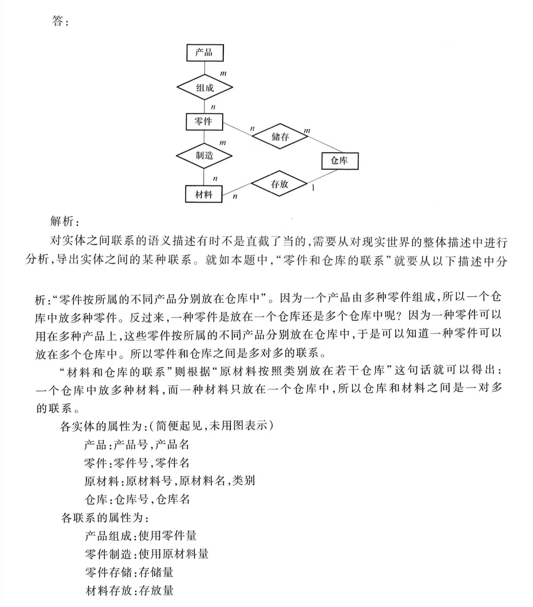
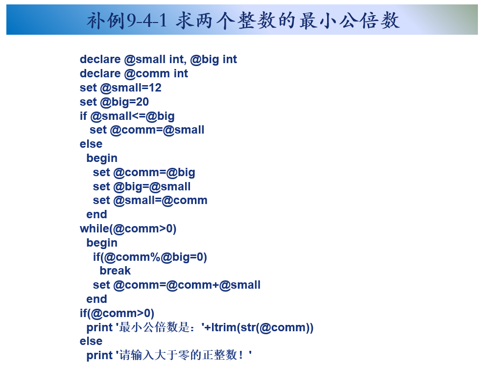

# **数据库复习**

## **1.课程分数**

46开

```sql
数据定义语言 (DDL)
	CREATE： 用于创建数据库对象。
	ALTER： 用于修改数据库对象的结构。
	DROP： 用于删除数据库对象。
	TRUNCATE： 用于快速删除表中的所有数据，但保留表结构。
数据操作语言 (DML)
	INSERT： 用于向表中插入新的记录。
	UPDATE： 用于修改表中已存在的记录。
	DELETE： 用于从表中删除记录。
数据控制语言 (DCL)	
	GRANT： 授予用户或角色权限。
	REVOKE： 撤销用户或角色的权限。
协作方法:
	FROM： 在 SELECT、UPDATE 和 DELETE 语句中用于指定要操作的表。
	JOIN： 用于连接多个表。
	INNER JOIN、LEFT JOIN、RIGHT JOIN、FULL OUTER JOIN：不同类型的连接。
	GROUP BY： 用于将结果集按一个或多个列进行分组(GROUP BY class;)
	IN： 用于指定一个值列表，用于 WHERE 子句中的比较。
	BETWEEN： 用于指定一个范围，用于 WHERE 子句中的比较。
	AS： 用于为表或列指定别名。
+++++++++++++++++++++++++++++++++++++++++++++++=
-- 查询学生表中年龄大于 18 岁的学生的姓名和班级，并按年龄降序排序
SELECT name, class
FROM student
WHERE age > 18
ORDER BY age DESC;

-- 统计每个班级的学生人数
SELECT class, COUNT(*) AS student_count
FROM student
GROUP BY class;

-- 创建一个名为 student_view 的视图，包含学生的姓名和年龄
CREATE VIEW student_view AS
SELECT name, age
FROM student;

-- 查询居住在北京或上海的学生的信息。使用 IN 关键字\
SELECT *
FROM students
WHERE city IN ('北京', '上海');
```


## **2.期末题型**

1.单项选择题(2->30)

2.名词解释(4->12)3个

3.简答题(6->18)3个

4.填空题(2->10)5个

5.综合应用题(2->30)

## **3.复习要点**

#### **1.数据库定义**

P4  数据库是什么

**<font color=red>1.数据库的定义</font>**

>   **数据库是长期存储在计算机内,有组织,可共享的大量数据的集合**
>
>   (数据在数据库中有较小的冗余度/较高的数据独立性/易扩展性)

**<font color=red>2.数据库数据的特性</font>**

>   **永久存储/有组织/可共享**

****

#### **2.数据库管理系统**

P5  数据库管理系统(不要和系统混淆了)

**<font color=red>1.数据库管理系统的定义</font>**

>   **数据库管理系统是位于 用户与操作系统之间 的一层数据管理 软件**

**<font color=red>2.数据库管理系统的主要功能</font>**

>   **数据定义功能/数据组织存储管理/数据操纵功能/数据库事务管理/数据库的建立**

****

#### **3.数据库系统**

P5  数据库系统（定义+是什么）<font color=red>尽量使用原话（关键词）</font>

**<font color=red>1.数据库系统的定义</font>**

>   **数据库系统 **= 数据库 + 数据库管理系统 + 应用程序 + 数据库管理员
>
>   **组成的存储/管理/处理/维护数据的系统**

**<font color=red>2.全流程</font>**

>   **用户\*n->应用系统->应用开发工具->数据库管理系统->操作系统->数据库 **

****

#### **4.文件系统**

P8  文件系统的优缺点（特点和缺点）

**<font color=red>0.发展简介:人工管理阶段->文件系统阶段->数据库系统阶段</font>**

**<font color=red>1.文件系统的特点</font>**

>   **优点:数据可以长期保存/由文件系统管理数据**
>
>   **缺点:数据共享性差冗余度大(浪费空间)/数据独立性差(文件的逻辑结构使得失去弹性)**

****

#### **5.数据库系统的特点(独立性)**

P9~P13 数据库系统的特点，特别是13页的物理独立性和逻辑独立性

**<font color=red>1.数据结构化</font>**

>   **数据结构化是区分数据库系统和文件系统的本质区别**
>
>   (整体是结构化的,数据之间是有相互关联的)

**<font color=red>2.数据的共享性高,冗余度低且易扩充</font>**

>   **节约存储空间,避免数据之间的不一致性(不同应用修改出现多个副本的情况)**

**<font color=red>3.数据独立性高</font>**

>   (包括物理独立性和逻辑独立性)
>
>   **物理独立性:用户的应用程序 与 数据库中数据的物理存储 是相互独立的**
>
>   **逻辑独立性:用户的应用程序 与 数据库中数据的逻辑结构 是相互独立的**
>
>   >   **实现方式:数据库管理系统中的二级映像功能**
>
>   (数据的物理/逻辑发生改变时,用户程序可以不变)

**<font color=red>4.数据由数据库管理系统统一管理和控制</font>**

>   **1.数据的安全性保护**
>
>   **2.数据的完整性检查**
>
>   **3.并发控制**
>
>   **4.数据库恢复**

****

#### **6.数据模型**

P15 数据模型（概念模型+逻辑模型物理模型）：是什么

**<font color=red>0.数据模型:是一种模型,对现实世界数据特征的抽象</font>**

>   **数据模型是数据库系统的核心和基础**

**<font color=red>1.概念模型(面向用户)</font>**

>   **定义:按照用户的观点 对数据进行建模,主要用于数据库设计**

**<font color=red>2.逻辑模型和物理模型(面向计算机)</font>**

>   **定义:对数据最底部的抽象,描述数据在系统内部的表示方式和存取方式**
>
>   **分类:层次模型/网状模型/关系模型/面向对象数据模型/半结构化数据模型**


>   **广义的数据模型：概念模型+逻辑模型和物理模型**
>
>   **狭义的数据模型:仅概念模型**

****

#### **7.实例关系**

P16  一对一、多对多的关系（最好能举例）

**<font color=red>0.信息世界的组成</font>**

>   **1.实体:客观存在并且相互区别的事物**
>
>   **2.属性:实体具有的某种特性**
>
>   **3.码:唯一标识实体的属性集合**
>
>   **4.实体型:使用 实体名+属性名 来抽象刻画同类实体**
>
>   **5.实体集:同一类型实体的集合称为实体机集**
>
>   **6.联系:不同实体集 之间的联系**
>
>   ```txt
>    (属性)-
>   ((属性)- ->码)->实体->实体集合
>    (属性)-              (联系)
>   ```

**<font color=red>1.概念模型的标识方法:实体联系方法(E-R模型)</font>**

>   **实体之间的联系有一对一,一对多,多对多**
>
>   **一对一:公民与身份证(一个公民只能拥有一个身份证号码)**
>
>   **一对多:一个班级可以有多名学生，而一个学生只能属于一个班级。**
>
>   **多对多:一个作者可以写多本书，一本书也可以由多位作者合著。**

>**Eg:**
>
>用E-R图来描述信息结构但不涉及信息在计算机中的表示，它属于数据库设计的概念设计阶段

****

P17 (最后一段)数据模型的组成要素

**<font color=red>数据模型的组成要素:数据结构+数据操作+数据的完整性约束</font>**

>   **数据结构:描述数据库的组成对象以及对象之间的联系**
>
>   **数据操作:对数据库中各种对象的实例 允许执行的操作 的集合**
>
>   **数据的完整性约束条件:给定的数据模型中 数据及其联系所具有的制约和依存规则**


****

#### **8.关系与关系模型**

P25  关系模型（主要数据结构（规范的二维表））

**<font color=red>1.关系模型的数据结构</font>**

>   **从用户的角度看,关系模型由一组关系组成,每个关系的数据结构是一张规范化的二维表**

**<font color=red>2.关系模型的术语</font>**

>   **关系:就是一张规范化的二维表**
>
>   **元组:表中的一行**
>
>   **属性:表中的一列**
>
>   ****
>
>   **码:某个属性组(多个列)->可以确定一个元组**
>
>   **域:属性的取值范围,是具有相同数据类型的值的集合**
>
>   **分量:元组中的一个属性值(一个特征)**
>
>   ****
>
>   **<font color=red>关系模式的表现形式</font>**
>
>   >   **学生(学号,姓名,性别,年龄)**
>   >
>   >   (其中主键有下划线)

**<font color=red>3.关系模型的规范:要求关系是规范化的,每个分量都是一个不可分的数据项</font>**

****

#### **9.关系模型的数据操作与完整性约束**

P26  关系模型的数据操作与完整性约束

**<font color=red>*4.关系模型的数据操作以及完整性约束</font>**

>   **关系模型的数据操作:**
>
>   >   **查询/输入/删除/更新数据**
>
>   **关系模型的完整性约束:实体完整性/参照完整性/用户完整性**
>
>   >   **实体完整性:实体完整性要求表中的每一行数据（即一个实体）都必须是可唯一标识的。**<font color=purple>(可以通过主键PRIMARY KEY的方法实现)</font>
>   >
>   >   **参照完整性:定义了表与表之间的关系，确保表之间的数据一致性。**<font color=purple>(它通过外键FOREIGN KEY来实现)</font>
>   >
>   >   **用户完整性:根据特定的业务规则或应用需求而定义的约束。**<font color=purple>(它通过触发器和CHECK关键字来实现)</font>

****

#### **10.数据模型**

P28  数据模型的三种模式

>   (具体什么是内模式外模式.../以及实现逻辑【比如外模式对应逻辑关系】)

**<font color=red>0.模式的定义</font>**

>   **模式是指数据库中 全体数据的逻辑结构和特征的描述 **
>
>   >   **相当于java中的一个实例,但是需要具体赋值才会形成对象**

**<font color=red>1.三级模式结构</font>**

>   **1.模式**
>
>   >   **又称做逻辑模型,是数据库中全体数据的逻辑结构和特征描述,是所有用户的公共视图**
>
>   **2.外模式(子模式/用户模型)**
>
>   >   **数据库用户能够看见和使用的 局部数据的逻辑结构 和 特征描述,是数据库用户的数据视图**
>
>   **内模式(存储模式)**
>
>   >   **<font color=purple>一个数据库只有一个内模式</font>它是数据物理结构和存储方式的描述**
>   >
>   >   (比如是否按照cluster存储,是B+树索引还是hash索引)

#### **11.关系数据库**

P40 关系（所有）/什么是关系数据库（解释：给出所有的关系集合的数据库）

**<font color=red>1.集合论角度的关系</font>**

>   **1.域:一组具有相同数据类型的值的集合(范围??)**
>
>   **2.笛卡儿积:**
>
>   ```txt
>   学生表（Students）
>   | StudentID | StudentName |
>   | --------- | ----------- |
>   | 1         | 张三        |
>   | 2         | 李四        |
>   
>   课程表（Courses）
>   | CourseID | CourseName |
>   | -------- | ---------- |
>   | 101      | 语文       |
>   | 102      | 数学       |
>   
>   StudentID	StudentName	CourseID	CourseName
>   1			张三			101			语文
>   1			张三			102			数学
>   2			李四			101			语文
>   2			李四			102			数学
>   ```
>
>   (n个域组成的集合叫做一个n元组,其中里面的每个值都是一个分量)
>
>   (一个域中允许的不同取值的个数叫做基数)

**<font color=red>2.关系</font>**

>   **由一系列域组成的笛卡儿积称为 在域上的关系,标识为R(D1,D2..Dn)**
>
>   (其中n是关系的目/度,n=1时,该关系为单元关系,n=2)

>   **候选码:如果某一属性组能唯一地标识一个元组,该属性组就是**
>
>   **全码:关系模式中的所有属性都是这个关系模式的候选码**
>
>   **主码:存在多个候选码,从中选一个出来**
>
>   **非主码:不包含在候选码中的属性(而不是不包含在主码内的)**

**<font color=red>3.关系的三种类型</font>**

>   **基本表:实际存在的表,是实际存储数据的逻辑表示,对应实际存储的数据文件**
>
>   **查询表:是经过SQL查询后的结果对应的表,是临时表**
>
>   **视图表:由基本表或其它视图表导出的表,是虚表,不对应实际存储的数据**
>
>   (比如在查询students表,只挑选学生姓名和所在班级)

**<font color=red>4.关系数据库</font>**

>   **关系数据库:给定应用领域中,所有关系的集合构成一个关系数据库**
>
>   **关系数据库的型:关系数据库模式(对数据库的描述)**
>
>   **关系数据库的值:关系模型在某一时刻的关系的集合**

****

#### **12.关系的完整性约束**

P45 关系的完整性（三种完整性是什么，会举实例）

**<font color=red>关系的完整性</font>**

**关系模型的完整性约束:实体完整性/参照完整性/用户完整性**

>**实体完整性:实体完整性要求表中的每一行数据（即一个实体）都必须是可唯一标识的。**<font color=purple>(可以通过主键的方法实现)</font>
>
>**<font color=red>实体完整性规则:若属性A是基本关系R的主属性,则A不能取空值</font>**
>
>```txt
>学生表中的 学号(主键)/姓名/年龄
>```
>
>**参照完整性:定义了表与表之间的关系，确保表之间的数据一致性。**<font color=purple>(它通过外键来实现)</font>
>
>**<font color=red>参照完整性规则:</font>**
>
>**1.外码F确定**
>
>>   **F是基本关系R的一个(组)属性,但不是R的一个码;Ks是主码,**
>>
>>   **如果F和Ks对应(F的值必须是Ks中已存在的值),则称F是Ks的外码,**
>>
>>   **并称基本关系R是参照关系,基本关系s是被参照关系**
>
>**2.参照完整性规则:**
>
>>   **<font color=red>若属性F是基本关系R的外码,它与基本关系S的主码Ks相对应,则对于R中每个元组在F上的值</font>**
>>
>>   >   **或者取空值/或者等于S中某个元组的主码值**
>
>```txt
>班级表:班级ID(Ks)/班级名称
>学生表:班级ID(F)/学号/姓名
>// 学生表中的 班级ID (F) 对应于班级表中的 班级ID (Ks)。
>// 则对于班级名称,要不是空值(不存在这个班),要不是其中一个名称
>
>班级ID作为外键,引用班级表的班级ID.
>
>如果尝试插入一个学生记录,班级ID不存在,则拒绝访问
>```
>
>**用户完整性:根据特定的业务规则或应用需求而定义的约束。**<font color=purple>(它通过触发器来实现)</font>
>
>```txt
>对于已有的学生表,得到子表(年龄在20~25岁的学生)
>```

****

#### **补充:触发器**

**触发器**

>   **定义:一种响应数据操作语言事件**
>
>   (在用户对某一表中的数据进行UPDATE、INSERT和DELETE操作时触发执行)
>
>   **主要作用:实现主键和外键的 参照完整性 和 数据一致性**
>
>   >   4
>
>   **<font color=red>触发器和存储过程的比较</font>**
>
>   >   
>
>   **触发器的分类:根据触发事件:DML触发器和DDL触发器**
>
>   >   **DML:INSERT、UPDATE或DELETE语句时被激活的触发器。**
>   >
>   >   **DDL:AFTER触发器、INSTEAD OF触发器和CLR触发器。**
>
>   **触发器的工作原理:**
>
>   
>
>   **触发器的创建**
>
>   >   
>
>   **Eg:**
>
>   ```sql
>   # 1.
>   # 为student表创建一个触发器，用来禁止更新学号字段的值。
>   CREATE TRIGGER Tri_stu
>   ON student
>   AFTER UPDATE
>   # 触发执行体
>   AS
>   BEGIN
>       IF UPDATE(studentno)
>       BEGIN
>           RAISERROR('不能修改学号', 16, 1) -- 修改状态码为1，更通用
>           # 如果学号被修改,则引发一个错误
>           ROLLBACK TRANSACTION -- 显式使用ROLLBACK TRANSACTION
>           # 回滚当前事务，撤销 UPDATE 操作。
>           RETURN -- 立即退出触发器
>       END
>   END
>   GO
>   ```

****

#### **数据库设计习题**

****

P241 习题(7/8/10 理解掌握其中知识点)

<font color=red>根据关系模型<->画ER图</font>

**1.概念结构设计:**将需求分析得到的用户需求抽象为信息结构的过程

**2.实体型联系**

>   **1.两个实体型之间的联系:**
>
>   >   **一对一联系(1:1)**
>   >
>   >   >   对于实体集A中的每一个实体，实体集B中至多有一个实体与之联系
>   >   >
>   >   >   **学校里一个班级只有一个正班长，而一个班长只在一个班中任职**
>   >
>   >   **一对多联系(1:n)**
>   >
>   >   >对于实体集A中的每一个实体，实体集B中有n个实体与之联系
>   >   >
>   >   >**一个班级中有若干名学生，而每个学生只在一个班级中学习**
>   >
>   >   **多对多联系(m:n)**
>   >
>   >   >对于实体集A中的每一个实体，实体集B中有n个实体与之联系
>   >   >
>   >   >对于实体集B中的每一个实体，实体集A中有m个实体与之联系
>   >   >
>   >   >**一门课程同时有若干个学生选修，而一个学生可以同时选修多门课程**
>   >
>   >   
>
>   **2.两个以上的实体型之间的联系**
>
>   >   **也存在着一对一、一对多、多对多联系。**
>   >
>   >   
>
>   **3.单个实体型内的联系**
>
>   >**也存在着一对一、一对多、多对多联系。**
>   >
>   >

**3.E-R模型**

>   **1.表示方法**
>
>   >   **实体型:实体型使用矩阵表示,并且写上实体名**
>   >
>   >   **属性(特征):属性使用椭圆形表示,并用无向边和对应实体链接**
>   >
>   >   
>   >
>   >   **联系:联系用矩阵表示,并用无向边和对应实体链接(写上实体型联系)**
>   >
>   >   (1:1,1:n,n:m)
>   >
>   >   

****

### **<font color=red>例题</font>**

**<font color=red>(注意的是每个实体型都要写关系...)</font>**

7.学校中有若干系，每个系有若干班级和教研室，每个教研室有若干教员，其中有的教授和副教授每人名带若于研究生，每个班有若干学生，每个学生选修若干课程，每门课可由若干学生选修。请用E-R图画出此学校的概念模型。


8.某工厂生产若于产品，每种产品由不同的零件组成，有的零件可用在不同的产品上。这些零件由不同的原材料制成，不同零件所用的材料可以相同。这些零件按所属的不同产品分别放在仓库中原材料按照类别放在若于仓库中。请用E-R图画出此工厂产品、零件、材料、仓库的概念模型。




10.试把习题7和习题8中的 E-R图转换为关系模型。

**<font color=red>(注意的是这里关系模型使用叙述法...)</font>**


## **程序题**

#### **1.做的作业题**





#### **2.存储过程的改写(完整的流程)**

[触发器](SDUFE课件\第9章 存储过程与触发器.ppt)


****

## **选择题**

DBMS全称数据库管理系统

(3/5)

2.假设存在一张职工表，包含“性别”属性，要求这个属性的值只能取“男”或“女”，这属于(C)。
A 实体完整性
B 参照完整性
C 用户定义的完整性
D 关系不变性

****

3.DBMS是一类系统软件，它是建立在下列(C)系统
之上的。
A 应用系统
B 编译系统
C 操作系统
D 硬件系统

****

4.下列说法中，正确的是(A)。
A 候选码都可以唯一地标识一个元组
B 候选码中只能包含一个属性
C 主属性可以取空值
D 关系的外码不可以取空值

****

5.触发器是一种特殊类型的存储过程，被捆绑到(C)
A 数据库或数据表
B 数据表或临时表
C 数据表或视图

D 视图或临时表

****

6.数据库中的数据具有的特点是(D)。
A 冗余度小
B 独立性高
C 易扩展
D 以上全部

****

7.下列表格的主关键字是? C<font color=red>(看是否重复)</font>


A studentno

B courseno

C (studentno,courseno)

D (studentno,courseno,usually,finally)

****

8.删除学生表(student)中所有男生记录的命令是(B)  (RE错误语法的正确形式)
A DELETE TABLE student WHERE sex='男'--删除全部
B DELETE FROM student WHERE sex='男'
C DELETE sex='男' FROM student --条件反了
D DELETE FROM student FOR sex='男' --没有 `FOR` 关键字

****

9.实现将现实世界抽象为信息世界的是(B)。
A 物理模型
B **概念模型**
C 关系模型
D 逻辑模型

****

10.在SQLScrvcr中，利用(B)约束可以实现参照完整性。
A PRIMARY KEY
B FOREIGN KEY
C UNIQUE
D CHECK

****


答:studentno

****

12.创建和修改数据库分别使用(B)命令。
A CREATE DATABASE,ALTER DATABASE
B CREATE DATABASE,DROP DATABASE
C CREATE TABLE,ALTER DATABASE
D CREATE TABLE,DROP DATABASE

****

13.更新表中记录的关键字是( B )。
A INSERT INTO
B UPDATE //修改表中已存在的记录。
C DELETE
D ALTER TABLE //[RE] 修改数据库对象的结构，包括表、视图、索引等

****

<font color=red>14.下列说法中，正确的是(D)。</font>
A 数据库中的概念模型与具体的DBMS有关
B 三级模式中描述全体数据的逻辑结构和特征的是外模式
C 数据库管理员负责设计和编写应用系统的程序模块
D 从逻辑模型到物理模型的转换一般是由DBMS完成的

****

15.有两个关系R(A,B.C)核S(B,C,D),将R和S进行自然连
接，得到的结果包含几个列(B)。
A 6          (A,B,C,D)

B 4

C 5
D 2

****

<font color=red>16.数据库系统的核心和基础是(C)。</font>
A 物理模型
B 概念模型
C 数据模型
D 逻辑模型

****

17.一个SELECT查询中如果同时有WHERE，GROUPBY和HAVING子句，

运行的顺序是(A)
A 先WHERE，再GROUPBY，最后HAVING
B 先GROUPBY，再WHERE，最后HAVING
C 先HAVING，再GROUPBY，最后WHERE
D 没有先后顺序，对查询结果无影响

>   **WHERE过滤不需要的行**
>
>   **GROUP BY将过滤后的结果进行分组**
>
>   **HAVING 语句最后再过滤(和聚合函数使用)**

****

18.关于索引，以下(C )说法是不正确的,
A 一个表只能创建一个聚集索引
B 应避免对经常更新的表创建过多的索引
C 唯一索引只能是非聚集索引   可以是聚集索引,可以是非聚集索引
D 聚集索引的顺序与数据表中记录的物理顺序相同

****

19.数据库外模式是在下列哪个阶段设计(B)
A 数据库概念结构设计
B 数据库逻辑结构设计
C 数据库物理设计
D 数据库实施和维护

****

20.在SQL Scrver系统的tcaching数据库中，正确删除
lcachcr表中所有记录的命令是(A)。
A DELETE FROM teacher
B TRUNCATE FROM teacher
C DELETE teacher
D DELETE TABLE teacher

>TRUNCATE table teacher 删除表中所有记录
>
>DROP table teacher 删除表中所有记录(包括其数据结构)

****

以下存储过程获取输入正整数@num，判断@num是否是素数，将其补充完整。

(思路:判断一个正整数@num是否是素数，

只需让@num 被2~@num-1 之间的每一个整数去除，

如果都不能被整除，那么 @num 就是一个素数。)

```sql
CREATE PROCEDURE IfPrime()
@num int
AS
declare @div int
set @div = 2
while @div<@num
	begin
	if @num%@div=0
		begin
        print convert(varchar(10), @num) + 'not Prime'  
        RETURN  
    end
	else
		set @div = @div + 1
	end
if @num > 1
	print convert(varchar(10),@num)+"is Prime"
else
	print convert(varchar(10),@num)+"not Prime"
GO
```

