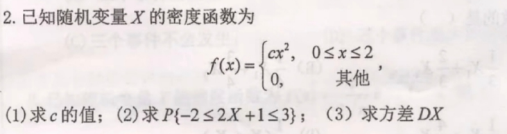

# **概率论与数理统计复习**

**老教材的题目页号**

***

**考试范围1~6章(到6.4章,第四章矩不考,条件数学期望不考)**

***

填空题(5小题,20分)

单项选择题(20分)

四个大题(每个题15分,共60分!)

***

## **第一章:事件**

(所有都容易考选择填空)

**$A+B+C =1-\overline{ABC}$ 表示至少一个会发生**

(大题:全概率公式+贝叶斯公式求概率(其中可能套用条件概率))

## **第二章:随机变量**

(离散型随机变量:会根据背景设条件求概率函数(涉及古典概型)待定参数<->求分布函数(累加)->任意事件概率)

>   **结合第四章考一元函数期望方差**
>
>   **0-1分布/泊松分布/二项分布(实际背景)**

(连续型随机变量:会根据密度函数求待定参数[性质3/4]/[根据多方程求参数]<->求密度函数<->求分布函数(一阶导))

>   **结合第四章考一元函数期望方差**
>
>   **均匀分布/指数分布/正态分布(所有性质都要背)**

(一元函数的分布:Y=kx+b的套路->如果不是这种,需要求分布函数)

**注意设事件概率要注意是否已经是条件概率**

**注意不要想当然,使用长度或者均匀分布求答案**

**注意范围不得超限**

>   
>
>   这里第二问化为$-\frac{3}{2}\leq x\leq 1$,但是超限了,所以还是[0,1]

**(两种随机变量的结合 sj2018-2019)**

## **第三章:二维随机变量**

(离散型:)

(根据实际情况,xy配对,求配对情况)

(求边缘分布->判断独立性)

(会求对应概率)

(会求期望方差协方差相关系数)

(连续型:)

(求待定参数[上下界为1]->独立性->求联合密度的概率[二重积分])

(求期望方差协方差相关系数)

**注意求边缘函数的公式:$F_X(x) = \int^{y_1}_{y_2}f(x,y)dy $ **

**注意正态分布标准化的公式 $\frac{(x-\mu)}{\sigma}$ **

(二维随机变量函数的分布)

(离散型考例1,较为简单)

(连续型考:Z=X+Y,Z=max{X,Y})

## **第四章:不会单独考,和其它章节一起考**

(期望方差协方差)

(单独考性质/常见的数学期望和方差)

**注意离散型随机变量的线性期望变换**

>   

**注意几何分布的期望,不能线性**

>   
>
>   EX=6 DX=2.4
>
>   所以$E(X^2+2X) = E(X^2)+2EX = 38.4+12=50.4$
>
>   $E(X^2) = DX+(EX)^2 = 2.4+36 = 38.4$

## **第五章:大数定律**

(1.切比雪夫->考填空题[两个公式])

(2.中心极限定理[必考,可能大题3456])

>**注意(EX,DX)以及利润函数的设计**

大数定律不会出大题(考到概率小)

**注意大于等于+小于等于**

## **第六章:数理统计**

(不考大题)

(理解样本的定义,选择题)

会求$\overline{X},S^2 $

数理统计分布(卡方分布,t分布,f分布)

****

****

