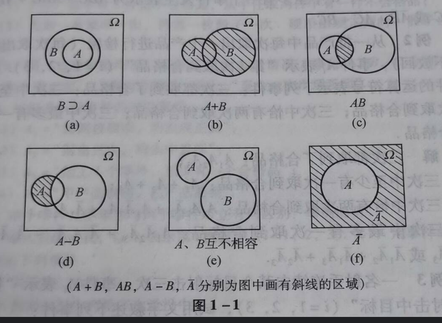
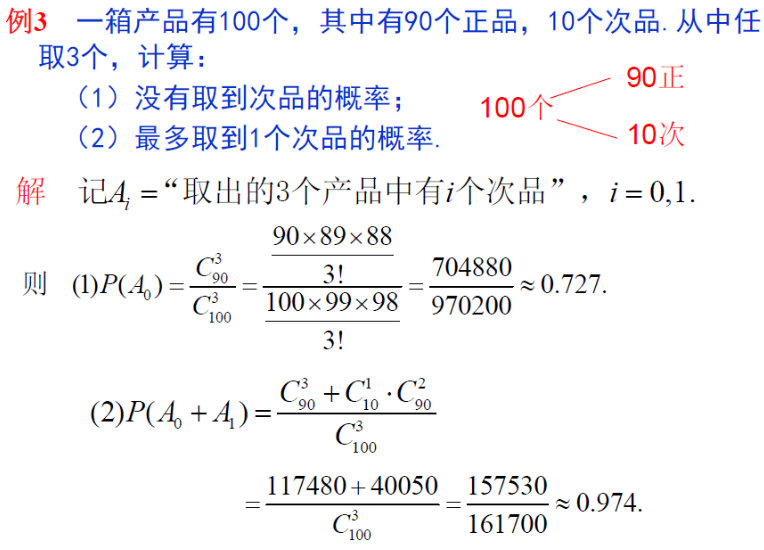
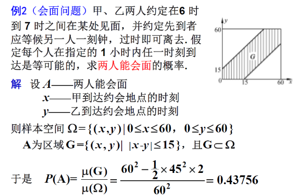
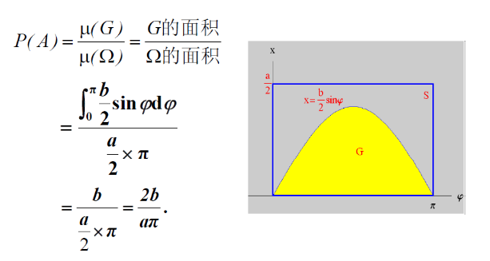
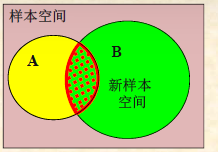

# **1.随机事件**

## **1.随机事件**

#### **1.随机试验与随机事件**

##### **1.随机试验的定义**

>**1. 试验可以再相同条件下重复进行**
>
>**2. 试验的所有结果可能不止一个**
>
>**3. 每次试验之前不能确切预言此次结果**

##### **2.事件的定义**

**事件:随机试验的可能出现可能不出现的每次结果**

>**按照概率分类:随机事件/必然事件/不可能事件**
>
>**按事件可分:基本事件/复合事件**

***
#### **2.样本空间与事件的集合表示**

##### **1.样本空间**

**定义:试验E中所有基本事件构成的集合称为样本空间,用$\ \Omega \ $表示**

>**其中的元素称为样本点,用$\ \omega \ $表示**

**表示方法:集合的方法**

>$$\ \Omega_1 = {\omega_1 , \omega_2 , \omega_3 , \omega_4 , \omega_5 , \omega_6} $$
>
>$$ \  \Omega_2 = \{(i , j) | i , j = 1 , 2 , 3 , 4 , 5 , 6 \cdots \}  $$
>
>$$ \ \Omega_3 = \{(x , y) | a \leq x \leq y \leq b \}$$
>
>$$ \ \Omega_4 = \{\omega_1 , \omega_2 \}$$

##### **2.事件的集合表示**

**定义**

**如果$\ A = \{ \omega_1 , \omega_2 ,\cdots \omega_n \} \ $中发生一件事A就成立,则这些点是有利样本点(或者A包含的样本点)**

>$$ A = \{ \omega | \omega 为A的有利样本点 \}$$

**必然事件是样本空间$\quad \Omega \quad$,不可能事件是集合$\quad\emptyset\quad $**

#### **3 事件间的关系与运算**

###### **1. 事件的包含和相对**

**A->B,A=B,$\emptyset \subset A \ \subset \Omega$**

**定义:事件A直接导致事件B发生,则事件B包含A,或事件A包含于事件B**

###### **2. 事件的并(和)**

**从单个事件来看:定义:事件A与事件B至少有一个发生,记作A$\bigcup$B或A+B**

**从一系列事件来看:定义:事件$A_1 , A_2 , \cdots , A_n$至少有一个发生,记作$\quad\bigcup^{n}_{i=1}A_i\quad$或者$\quad\sum^{n}_{i=1}A_i\quad$**

###### **3. 事件的交(积)**

**从单个事件来看:定义:事件A与事件B同时发生,记作A$\bigcap$B或AB**

**从一系列事件来看:定义:事件$A_1 , A_2 , \cdots , A_n$全部同时发生,记作$\quad\bigcap^{n}_{i=1}A_i\quad$**

###### **4. 事件的差**

**定义:事件A发生而B不发生,记作A-B=A-AB**

###### **5. 互不相容事件**

**从单个事件来看:定义:事件A和事件B不能同时发生,记作AB=$\emptyset$;否则相容**

**从一系列事件来看:定义:事件$A_1 , A_2 , \cdots , A_n$任意两个事件都互不相容**

>**如果此时$A_n$又满足每个都是单独事件构成样本空间$\Omega$,则$A_1 , A_2 , \cdots , A_n$构成完备事件组**

###### **6. 对立事件**

**定义:事件A和事件B满足:$A \bigcup B = \Omega$或者$A \bigcap B = \emptyset$**

**集合事件Venn图**


***
**运算律:$\bigcap$是乘积运算(同时),$\bigcup$是加法运算(至少)**

**交换律:$\quad A \bigcup B = B \bigcup A , AB = BA$**

**结合律:$\quad(A \bigcup B)\bigcup C = A \bigcup (B \bigcup C),(AB)C = A(BC) $**

**分配律:$\quad(A \bigcup B)\bigcap C = AC \bigcup BC)$**

**\*德摩根律:$\quad \overline{\bigcap^{n}_{i = 1}A_i} =  \bigcup^{n}_{i = 1}\overline{A_i},\quad \overline{\bigcup^{n}_{i = 1}A_i} =  \bigcap^{n}_{i = 1}\overline{A_i}$**

>**“反交集等于并反集”，“反并集等于交反集”**

**运算公式:**

>   **$A \bigcap B = A + B$**
>
>   **$A \bigcup B = AB$**
>
>   **$A - B = A - AB = A\overline{B}$**
>
>   **$AB = \emptyset \quad$互不相容**
>
>   **$A \bigcap B = \emptyset,A + B = \Omega \quad$表示对立**

## **2.事件的概率**

#### **1.概率的初等描述(描述性定义)**

###### **定义**

**在概率论中，用来刻划事件A发生的可能性大小[的数量指标]称为事件的概率**

###### **性质**

>**1.$P(\Omega) = 1 , P(\emptyset) = 0$**
>
>**2.$0 \leq P(A) \leq 1$**

#### **2.古典概型**

##### **1.定义**

**若一随机试验满足下述两个条件：**

>**1. 试验的样本空间只有有限个样本点（有限性）**
>
>**2. 试验中每个样本点出现的可能性相等（等可能性）**
>
>$$P(A) = \frac{m}{n} = \frac{A的有利样本数}{\Omega 中样本总数} \quad = \quad \frac{A中包含的基本事件数}{基本事件总数}$$
>
>**3. 有限可加性,对于完备事件组:**$$P(\bigcup^{n}_{i=1}A_i) = \sum^{n}_{i=1}P(A_i)$$
>
>**做题方法:写出所有样本空间以后套公式**

##### **2.基本计算原理**

###### **1.基本计数原理**

>**加法原理:分类加法计数原理**
>
>**乘法原理:分布乘法计数原理**
>
>**混合:对于每一步都有若干方法,此时需要加法乘法一起用**

###### **2.排列组合公式**

**不重复排列**

>   **从n个不同元素任取m个不同元素,记作$\ P^m_n$,也可以先组合再排列**
>
>   $$\ P^m_n = n(n-1)\cdots(n-m+1) = \frac{n!}{(n-m)!}$$

**重复排列**

>   **从n个不同元素有放回地取m个元素,排列总数为 $n^m$**
>
>   **组合:从n个不同元素中任取m个不同元素,不排列,记作$\ C^m_n$**
>
>   $$\ C^m_n = \frac{P^m_n}{m!} = \frac{n!}{m! (n-m)!} \quad \quad 其中0! = 1$$
>
>   

###### **3.抽签公平性**

**抽签结果和抽签顺序无关**

****

#### **3.几何概型**

##### **1.定义**

###### **1.测度**

**对某区域D的大小的一种数量描述(长度、面积、体积)，用$\mu $(D) 表示.**

###### **2.几何概型**

**向区域$\Omega$中投点,点落入G的概率和G的度量成正比,和形状位置无关**

###### **3.几何概率**

**在定义的基础上有 $P(A) = \frac{\mu(G)}{\mu(\Omega)}$**

##### **2.会面问题**

**(一种几何概型,不考)**

>

##### **3.蒲丰投针**

>

#### **4.频率与概率**

***

##### **1.定义**

>**设A是试验E的一个事件，若在n次重复试验中.事件A发生了m次，则称m 为事件A发生的频数，比值$\frac{m}{n}$为事件A发生的频率，记为$\omega_{n}(A)$**

***

##### **2.性质**

###### **1. 非负性**

>**任意事件A,$ 0 \leq \omega(A) \leq 1$**

###### **2. 规范性**

>**对于必然事件$\Omega$,有$\omega_{n}(\Omega) = 1 , \omega_{n}(\emptyset) = 0$**

###### **3. 可加性**

$$\omega_{n}(\sum^{n}_{i=1}A_i) = \sum^{n}_{i=1}\omega_{n}(A_i)$$**和的概率等于概率的和**

***

##### **3.特点**

**随机波动性/频率稳定性**

$$From 伯努利大数定理: \lim_{n \rightarrow \infty} P{|\frac{m}{n} - p| < \epsilon} = 1$$

***

##### **4.概率定义**

>**事件A发生的频率的稳定值p称为A的概率,即P(A)=p**

***

#### **5.概率的公理化定义及性质**

***

###### **1.定义**

***

**从上述定义/古典概率/几何概率/统计概率,得到下面三条公理:**

>**基本要求:**
>
>$$\forall A \rightarrow_{only} P(A) \in [0,1]$$
>
>$$\forall x \in D \rightarrow_{only} y \in R$$

**主要内容**

$$1. 非负性:对于任何事件 \quad P(A) \geq 0$$

$$2. 规范性:对于必然事件 \quad P(\Omega) = 1$$

$$3. 可列可加性: 设A_1,A_2,\cdots,两两互斥,则有: \quad P(\sum^{\infty}_{k=1}A_k) = \sum^{\infty}_{k=1}P(A_k)$$

**<font color=red>$概率等于0/1,并不能决定事件不可能发生/必然发生$</font>**

$$(注意下面的A表示\Omega空间中的一个点,不是整个事件)$$

***
###### **2.性质**

>**1. $不可能事件的概率等于0,即P(\emptyset) = 0$**
>
>****
>
>**2. $设A_1,A_2,\cdots,互不相容,则有:$**
>
>$$
>P(A_1 + A_2 + \cdots + A_n) = P(A_1)+P(A_2)+\cdots+P(A_n)
>$$
>
>****
>
>**3.设$A_1,A_2,\cdots$构成完备事件组则有: **
>$$
>\ \sum^{n}_{i=1}P(A_i) = 1
>$$
>
>****
>
>**4.**
>$$
>P(\overline{A}) = 1 - P(A)
>$$
>
>****
>
>**5.**
>$$
>\ P(A - B) = P(A) - P(AB)
>$$
>
>>**$如果A \supset B,则P(A - B) = P(A) - P(B)[此时B在A内部]$**
>>
>>$\therefore \quad P(A+B) = P(A) + P(B) - P(AB)$
>
>****
>
>**6.**
>$$
>P(A\overline{B}) = P(A-B)
>$$
>
>****
>
>**7.**
>$$
>若A \supset B , 则P(A) \geq P(B)
>$$
>
>****
>
>**8.对任何事件AB**
>
>**[当事件组不满足不相容,不能说和的概率等于概率的和,要用如下公式]**
>
>$$P(A \bigcup B) = P( A + B ) = P(A) + P(B) - P(AB)$$

$$推广:P(A \bigcup B \bigcup C) = P( A + B + C ) $$

$$= P(A) + P(B) + P(C) - P(AB) - P(AC) - P(BC) + P(ABC)$$

****

## **差事件的概率公式**

>   **$P(\overline{A}B) = P(B)-P(AB) $**
>
>   $P(A\overline{B}) = P(B) - P(AB)$

***

###### **3.例题**

****

**例1:设A,B是两个随机事件,且$P(A) = P \ \overline{B} = \frac{3}{5},P(A+B) = \frac{6}{7}$**

**求$P(AB),P(A-B),P(B-A)$**

>   **解:P(A+B)公式计算P(AB)**
>
>   $\because P(A+B) = P(A) + P(B) - P(AB),P(\overline{B}) = 1 - P(B)$
>
>   $$\therefore P(AB) = P(A) + 1 - P(\overline{B}) - P(A+B)$$
>
>   $$\therefore P(AB) = \frac{3}{5} + 1 - \frac{3}{5} - \frac{6}{7} = \frac{1}{7}$$
>
>   **解:求P(A-B)公式计算**
>
>   $P(A-B)=P(A)-P(AB) = \frac{3}{5} - \frac{1}{7} = \frac{16}{35}$
>
>   **解:求P(B-A)公式计算**
>
>   $P(B-A)=P(B)-P(AB) = \frac{2}{5} - \frac{1}{7} = \frac{13}{35}$

***
**例2:已知$P(A) = P(B) = P(C) = \frac{1}{4},P(AB) = 0, P(AC) = P(BC) = \frac{1}{16}$**

**求ABC至少发生一个的概率和不可能发生的概率**

>   **解: 数学语言转换(至少->和)P(AB)公式计算P(A+B+C), 计算$P(\overline{ABC})$**
>
>   $$\because P(AB) = 0 \quad P(ABC) \subset P(AB) \therefore P(ABC) = 0$$
>
>   $$P( A + B + C ) = P(A) + P(B) + P(C) - P(AB) - P(AC) - P(BC) + P(ABC) = \frac{5}{8}$$
>
>   $$P(\overline{ABC}) = 1 - P(A+B+C) = \frac{3}{8}$$

***

**例3:生日问题:求n个人中至少有两个人生日相同的概率:**

$$P(A) = 1 - P(\overline{A}) = 1 - \frac{P^{n}_{365}}{365^n}$$

$$n = 55 \quad P(A) \approx 0.99 $$

###### **4.总结**

>   **1.P(A+B) P(A-B)的公式最重要**
>
>   **2.至少发生一个->并集关系->容斥定理**
>
>   **3.至少发生一个<-(对立事件)->不可能发生**

## **3.条件概率**

#### **1.条件概率**

##### **1.定义**

>**设E为试验,$\omega$为其样本空间,AB为两个事件:**
>
>**在事件B已发送的条件下发生条件A,称A为B的条件概率P(A|B)**
>
>**P(A)为无条件概率**
>>**样本空间发生变化:原来中间交集的部分只取B的部分**
>>
>>
>>
>>$$P(A|B) = \frac{P(AB)}{P(B)} = \frac{n(AB)}{n(B)}$$
>

***

##### **2.性质**

###### **1.非负性**

>   **对于任意事件A,$P(A|B) \geq 0$**

###### **2.规范性**

>**$P(\Omega | B) = 1$**

###### **3.可列可加性**

>   **对于任意两个互不相容事件A sets**$$P(\sum^{\infty}_{i=1}A_i|B) = \sum^{\infty}_{i=1}P(A|B)$$

###### **4.可拓展至n个**

>**Eg:$\quad P(A+B) = P(A) + P(B) - P(AB)$**
>
>**->$\quad P((B_1+B_2)|A) = P(B_1|A) + P(B_2|A) - P(B_{1}B_{2}|A)$**

###### **5.事件可控,条件不可控**

>$$P(A|B) + P(\overline{A}|B) = 1$$
>
>$$(But) \quad P(A|B) + P(A|\overline{B}) \neq 1$$

**一般求P(AB)使用加法公式,而不是独立事件公式!!!**

***

##### **3.例题**

***
**Eg1:一个家庭中有三个小孩,已知其中是女孩,求另一个是男孩的概率**

**(德摩根律的巧妙运用)**

>**解:设其中一个是女孩为A,至少有一个男孩为B**
>
>$$\Omega = 2^3 = 8$$
>
>$$\because$$**（∃至少一个女孩）对立事件（∀所有孩子都是男孩）**
>
>$$\therefore P(\overline{A}) = \frac{1}{8} \quad P(A) = 1 - \frac{1}{8} = \frac{7}{8}$$
>
>$$P(AB) = 1 - \overline{A \bigcup B} = 1 - \overline{A} \bigcap \overline{B} = 1 - \frac{1}{8} - \frac{1}{8} = \frac{3}{4}\quad (德摩根律)$$
>
>$$\therefore P(B|A) = \frac{P(AB)}{P(A)} = \frac{6}{7}$$

***
#### **2.乘法公式**

***
##### **1.定义**

$$\because P(A|B) = \frac{P(AB)}{P(B)}$$

$$\therefore P(AB) = P(A|B)P(B)$$
***
##### **2.公式**

$$P(AB) = P(A|B)P(B)$$

$$P(ABC) = P(A)P(B|A)P(C|AB)$$

$$P(ABC\cdots n) = P(A)P(B|A)P(C|AB)\cdots P(n|ABC\cdots (N-1))$$

****

##### **3.例题**

***

**Eg1:灯泡中甲厂占60%，乙厂占40%，甲厂的合格率为90%，乙厂的合格率为80%**

**(1)从市场上买一个灯泡是甲厂生产的合格灯泡的概率.**

**(2)从市场上买一个灯泡是乙厂生产的合格灯泡的概率。**

>**解:设A表示甲厂产品,B表示合格率**

$$P(A) = 0.6 \quad P(B) = 0.4 \quad P(B|\overline{A}) = 0.9 \quad P(B|
\overline{A}) = 0.8$$

$$\therefore P(AB) = P(A)P(B|A) = 0.6 \times 0.9 = 0.54$$

$$\therefore P(\overline{A}B) = P(\overline{A})P(B|\overline{A}) = 0.4 \times 0.8 = 0.32$$

***

**Eg2:(适用于抽取不放回问题)**

**一批零件共100个，其中有次品10个。每次任取一个零件，取出不放回.现在任取三次零件，求第三次才取到合格品的概率。**

$$P(\overline{A_1} \ \overline{A_2} A_3) = P( \overline{A_1} )P(\overline{A_2}| \ \overline{A_1})P(A_3|\overline{A_1} \ \overline{A_2})$$

***
**Eg3:(适用于抽取再加问题)**

**a个红球，b个黑球，每次摸出一个球，看过它的颜色后仍放回盒中，并且加进与这个球颜色相同的球c个. 求连续三次都摸到红球的概率.**

>**解:设A表示摸到红球的概率**
>
>$$P(A_1) = \frac{a}{a+b} \quad P(A_2|A_1) = \frac{a+c}{a+b+c} \quad P(A_3|A_{1}A_{2}) = \frac{a+2c}{a+b+2c}$$ 
>
>$$\therefore P(A_{1}A_{2}A_{3}) = P(A_1)P(A_2|A_1)P(A_3|A_{1}A_{2})$$ 
>
>$$= \frac{a(a+c)(a+2c)}{(a+b)(a+b+c)(a+b+2c)}$$

## **4.全概率公式与贝叶斯**

#### **!!!!期末考试第一大题必出**
#### **1.全概率公式**

##### **1.定义**

**设事件$A_1,A_2,\cdots,A_n$是试验E的一个完备事件组,且$P(A_i)>\sum^{n}_{i=1}P(A_i)P(B|A) \ $则有**

$$P(B) = \sum^{n}_{i=1}P(A_i)P(B|A_i)\quad$$ 

**<font color=red>(虽然P(B|A_i)是条件下概率,但是一般题干就是一个数字不用求)</font>**

>**进一步拓展:**
>
>$P(B) =P(A_1 B) + P(A_2 B) + P(A_3 B) + \cdots = P(A_1 )P(B | A_1 )+ P(A_2)P(B | A_2)+\cdots + P(A_n)P(B | A_n)$

***

>**特别的, 当n=2时,$P(B) = P(A)P(B|A) + P(\overline{A})P(B|\overline{A}) \quad$**
>
>**解释:在A条件下发生B,不在A条件下也可能发生B**
>
>**因此使用全概率公式解题的时候要找到对事件B有直接影响的完备事件组$A_1,A_2,\cdots,A_n$**
>
>>**若试验可看作分两个阶段进行,第一阶段有多种可能的结果,求第二阶段则使用全概率公式**
>
***

##### **2.例题**

**Eg:四种商品占产量的15%/20%/30%/35%,不合格率为0.05/0.04/0.03/0.02,求不合格品的概念**

$$\because P(B) = \sum^{4}_{i=1}P(A_i)P(B|A_i)$$

$$\therefore 0.15*0.05+0.2*0.04+0.3*0.03+0.35*0.02 = 0.0315$$
***
#### **2.贝叶斯公式**

**直接点就是权重概率(由结果推原因)**

##### **1.定义**

**设事件$A_1,A_2,\cdots,A_n$是试验E的一个完备事件组,B为E的任意事件,\*A的所有事件概率大于零!**

**才有**$$P(A_K|B) = \frac{P(A_k)P(B|A_K)}{\sum^{n}_{i=1}P(B|A_i)} = \frac{(乘法公式)}{(全概率公式)} \quad \quad 更简单的形式:P(A|B) = P(B|A) * P(A) / P(B)$$

**贝叶斯公式也叫逆概率公式,$P(A_i)$叫做先验概率,$P(A_i|B)$称为后验概率**

**解释:使用乘法公式的目的是得到满足分子的条件概率,使用全概率公式是为了满足所有样本空间**
>**因为带有条件所以一般都是多对象之间定量,因此也称为贝叶斯决策**
***

**Eg :在一个工厂中，生产了三种类型的零件：A类、B类和C类。工厂的生产比例为：A类占40%，B类占35%，C类占25%。其中，A类零件的次品率是2%，B类零件的次品率是3%，C类零件的次品率是4%。现在从工厂随机抽取了一个零件，检测到它是次品。请问，这个次品来自A类零件的概率是多少？**

**1. 计算P(D):$$P(D) = \frac{P(D|A)\cdot{P(A)}}{P(D)}$$**

>**解:$次品来自A类的概率 = \frac{A的次品率 \times 产品A的占比}{抽到次品的总概率} \quad  \quad (将先验信息和证据结合更新的权重概率)$**
>
>$$P(A|D) = \frac{P(D|A)\cdot{P(A)}}{P(D)} = \frac{0.02 \cdot 0.4}{0.0285} \approx{0.2807}$$
>
>```
>时序:先场后次品率
>       (0.4)A	 (0.35)B  (0.25)C
>     		| 		|		|
>     		|		|		|
>     		2%		3%	   4%
>     		 \		|	   /
>     		  \		|	  /
>     		  	\	|	 /
>     		  		次品
>求次品来自A的概率=A的路径除以全概率
>=0.02*0.4/0.02*0.4+0.03*0.35+0.04*0.25
>=0.008/0.008+0.0105+0.01
>=0.008/0.0285
>\approx 0.2807 		
>```

***

**Eg:某疾病发病率0.0004,患病的99%都能检测为阳性,没患病的99%都能检测阴性,现在有一个人做检查,他患病的概率**

>**A表示患病,B表示阳性**

$$\therefore P(A) = 0.0004,P(\overline{A}) = 0.9996,P(B|A) = 0.99,P(B|\overline{A}) = 0.001$$

$$\therefore P(B) = P(A)P(B|A) + P(\overline{A})P(B|\overline{A}) = 0.0004 \times{0.99}+0.9996\times{0.001}=0.0013956$$

$$\therefore P(A|B) = \frac{P(AB)}{P(B)} \approx 0.284$$

```
时序:先患病后检测
结果:患病
	       患病        未患病
	     	|			|
	      检测阳性      检测阳性
	         \         /
	     		\    /
	     		 阳性

患病检测P(A)以及对立事件
检测后P(B|A)以及对立事件

全部情况:患病且阳性+未患病且阳性
求:患病路径
P(A|B) = P(A)P(B|A)/P(A)P(B|A)+P(\notA)P(B|\notA)
= 0.0004*0.099/0.0004 *0.99 + 0.9996*0.001}
= 0.0000396/0.0013956
= 0.0384	     		
```

## **4.5 全概率与贝叶斯的理解**

```
                        |	|	|	|	|
                        |	|	|	|	|
                        A1	A2	A3	A4	An
                        \   \	|	/   /
                         \	 \  |  /   /
                           \  \	| /  /
                            \  \|/	/
                                B
================================================================
对于一条路径:
	A1的概率:P(A1)
	A1到B的概率:P(A1)P(B|A1)
===============================================================	
对于所有路径(求B的概率):
使用全概率公式:P(A1)P(B|A1)+P(A2)P(B|A2)+P(B|A3)+...+P(An)P(B|An)
===============================================================	
对于已知结果B求一条路径的概率:
使用贝叶斯公式:         
 P(B|A1) = _____第一条路径的概率___ = _________P(A1)P(B|A1)_______
			所有路径的和(全概率公式)	P(A1)P(B|A1)+...P(An)P(B|An)
```


## **5.事件的独立性**

#### **1.事件的独立性**

###### **定义**

>   **若事件A的概率不受事件B发生与否的影响,即$P(A|B)=P(A)(P(B)>0)$,则称事件A对于事件B独立**

###### **定理**

>   **如果P(A)>0,P(B)>0,则A和B相互独立的充要条件是$P(A|B)=P(A)P(B)$**

###### **结论**

>   **不可能事件$\emptyset$,必然事件$\Omega$,与必然事件A相互独立**

###### **推论**

>**事件A与事件B相互独立,则$A与\overline{B}$$\overline{A}与B$$\overline{A}与\overline{B}$中每对事件都相互独立**
>
>**若P(A)=0或者P(A)=1,则事件A与任意事件独立**
***

#### **2.证明事件独立性**

###### **1.主要方法**

**在证明两事件独立时,使用乘法公式的证明方式最佳**

**$\Phi \ and  \ A$:**

>**$P(\Phi|A) = P(\Phi) = 0$**
>
>**$P(\Phi)P(A) = 0 \quad 永假律?$**
**$\Omega \ and \ A$:**

>   **$P(\Omega A) = P(A)$**
>
>   **$P(\Omega)P(A) = P(A) \quad 永真律?$**

**注意两码事:概率为0和$\Phi$的关系**

>**P = 0不一定为$\Phi$**
>
>**P = 1不一定为$\Omega$**
>

***
###### **2.公式**

**(相互独立事件的乘法公式不一样)**

$$P(AB) = P(A)P(B)$$

$$P(AC) = P(A)P(C)$$

$$P(BC) = P(B)P(C)$$

$$P(ABC) = P(A)P(B)P(C)$$

***

###### **3.例题**

>**已知P(A+B)=0.9,P(A)=0.4,求A与B互不相容和A与B相互独立时的概率**

$$(互不相容)P(A+B) = P(A) + P(B) = 0.5 \quad(P(AB) = \emptyset)$$

$$(相互独立)P(A+B) = P(A) + P(B) - P(AB) = P(A) + P(B) - P(A)P(B) = \frac{5}{6}$$

>**设事件A和B,且$0<P(A)<1,0<P(B)<1,P(A|B)+P(\overline{A}|\overline{B}) = 1$,证明AB相互独立**

$$\because P(A|\overline{B}) = 1 - P(\overline{A}|\overline{B})$$

$$\therefore P(A|B) = P(A|\overline{B})$$

$$\therefore \frac{P(AB)}{P(B)} = \frac{P(A\overline{B})}{P(\overline{B})}$$

$$\because P(A|B) = P(A) - P(AB) \quad P(\overline{B}) = 1 - P(B)$$

$$\therefore \frac{P(A) - P(AB)}{1 - P(B)} = \frac{P(AB)}{P(B)}$$

$$\therefore P(AB) = P(A)P(B)$$

***
#### **3.伯努利概型**

**设有n个试验$E_1,E_2,\cdots,E_n$若事件$A_1,A_2,\cdots,A_n$相互独立,其中$A_i是E_i$的任一事件,则称$E_n$是独立试验序列,重复n此叫做n重独立试验**

**若一个试验E的样本空间为$\Omega = \{A,\overline{A}\}$,则称E为伯努利试验(结果只有两种),称n重伯努利试验为伯努利概型(n次/独立/结果只有两种)**

>****

**二项概率公式:设伯努利试验E中事件A的概率为P(0<p<1),则n重伯努利试验$E^n$中事件A恰发生k次的概率**

$$P_n(k) = C^{k}_{n}p^{k}q^{n-k},其中q = 1-p,\quad \therefore P_n(k) = C^{k}_{n}p^{k}(1-p)^{n-k}$$

**例题:**
>**一批产品的废品率是0.1,每次抽取一个要放回,连续取三次求下列事件的概率**

$三次恰有一次废品:\quad C^{1}_{3} \times 0.1 \times {0.9^2} = 0.243$

$三次恰有两次废品:\quad C^{2}_{3} \times {0.1}^2 \times 0.9 = 0.027$

$三次都是废品:\quad C^{3}_{3} \times {0.1}^3 = 0.001$

$三次没有废品:\quad C^{3}_{0} \times {0.9}^3 = 0.729$
