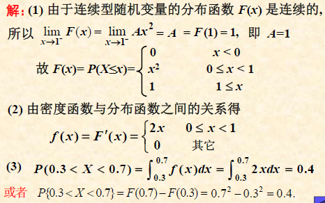

# **2.常见的随机变量及其分布**

## **1.随机变量**

##### **1.随机变量**

>**设随机变量E的样本空间$\Omega = \{ \omega \}$对每个$\omega \in \Omega$都有唯一实数$X(\omega)$与其对应**
>
>**并且对任意实数x,$\{\omega|X(\omega)\leq{x},\omega \in \Omega \}$是随机事件,则称定义在$\Omega$上的实值单值函数$X(\omega)$为随机变量**
>
>**一般用大写字母$X,Y,Z$或希腊字母$\alpha , \eta , \epsilon$表示**

##### **2.解释**

**如果对于一个样本空间,可以用实数表示其中的情况,并且满足样本空间小于标准值是随机的,那么这个样本空间就是随机事件**

>**显然随机变量X的取值由$\omega$确定,反过来部分X的取值构成$\omega$,可以表示为**
>
>$$A = \{\omega|X(\omega) = a\} \subset \Omega$$

##### **3.举例**

**将硬币投掷三次, 将证明出现的情况记作X**

>**实值函数:**

|  ω   | HHH  | HHT  | HTH  | THH  | HTT  | THT  | TTH  | TTT  |
| :--: | :--: | :--: | :--: | :--: | :--: | :--: | :--: | :--: |
|  X   |  3   |  2   |  2   |  2   |  1   |  1   |  1   |  0   |
>**则称X是试验的一随机变量,其取值可能是0/1/2/3**
>
>**对于不同的实数有不同的样本划分,从而得到概率**

##### **4.分类**

**若随机变量恶的取值为有限个或可列个,**

>   **则称之为离散型随机变量**
>
>   **否则为非离散型随机变量**

## **2.随机变量及其分布函数**

#### **1.离散型随机变量及其概率分布**

**(Discrete random variables and their probability distributions)**

###### **1.定义**

**如果随机变量X只取有限个或可列个可能值,则X称为离散型随机变量**

>**X的可能取值$x_k$使得概率为$P\{X = x_k\} = p_k$**
>
>**(称之为概率函数/概率分布/分布律/分布列)**

###### **2.表现形式**

***

**概率函数还可以用下面的函数进行表示**

|  X   | ...  | ...  |
| :--: | :--: | :--: |
|  P   | ...  | ...  |

***

**概率函数还可以用矩阵表示**
$$
\mathbf{P(X)} = 
\begin{pmatrix}
 x_1 \ x_2 \ \cdots x_k\\ 
 p_1 \ p_2 \ \cdots p_k\\
\end{pmatrix}
$$

****

**概率函数主要使用集合表示:**$$P \{X \in S\} = \sum_{x_i\in s}P{X = x_i}$$

>**主要性质$p_k \geq{0},k = 1,2,\cdots \quad$,$\sum_k p_k = 1 \quad $(概率和等于1)**

***

**概率函数还使用概率函数图表示:**

***
###### **3.例题(结合古典概型)**

**Eg:5个球,2白3黑,任取3个,设X为取到的白球,求随机变量X的概率函数:**

>**事件$\Omega$的可能取值:X=0,1,2**
>
>$P(x = 0) = \frac{C^3_3}{C^3_5} = \frac{1}{10}$
>
>$P(x = 1) = \frac{C^3_2 C^2_1}{C^3_5} = \frac{6}{10}$
>
>$P(x = 2) = \frac{C^3_1 C^2_2}{C^3_5} = \frac{3}{10}$
>
>$\therefore \ $**可以使用下列表格表现出离散的概率**

|  X   |  0   |  1   |  2   |
| :--: | :--: | :--: | :--: |
|  P   | 1/10 | 6/10 | 3/10 |
***
**从1,2,3,4中任取一个数记为X,再从1,2,…,X中任取一个数记为Y,求P{Y=2}**

**解:事件$\{X=1\},\{X=2\},\{X=3\},\{X=4\}$构成完备事件组**

**$\therefore$由全概率公式：**

**$P\{Y=2\}=P\{X=1\}P\{Y=2|X=1\}+P\{X=2\}P\{Y=2|X=2\}+P\{X=3\}P\{Y=2|X=3\} +P\{X=4\} P\{Y=2|X=4\}$**

**$= \ \frac{1}{4} \times 0 + \frac{1}{4} \times \frac{1}{2} + \frac{1}{4} \times \frac{1}{3} + \frac{1}{4}\times \frac{1}{4} = \frac{13}{48}$**

***
###### **4.概率函数的性质**

(由x=离散点,y=概率组成的函数)

**1.$p_k \geq{0},k = 1,2,\cdots,n$(概率大于0)**

**2.$\sum_{k} p_k= 1$(所有概率和等于1)**

>**具有上述两个性质的数列pk,都可以作为随机变量X的分布列**

****

###### **5.例题(根据性质+无穷级数)**

**Eg:设随机变量X的概率分布为:**

**$P\{X = k\} = a\frac{\lambda^k}{k!} \quad (k = 0,1,2,\cdots,\lambda>0),确定常数a$**

>**根据概率分布的性质:$P(X=k)\geq 0 \quad \sum^{+ \infty}_{k = 0}P(X = k) = 1$**
>
>**根据无穷级数 $e^x = \sum^{\infty}_{k=0}\frac{x^k}{k!}$**
>
>$a \geq{0} \quad且 \quad \sum^{\infty}_{k=0} a \frac{\lambda^k}{k!} = a \sum^{\infty}_{k=0}\frac{\lambda^k}{k!} = ae^{\lambda} = 1$
>
>$\therefore a = \frac{1}{e^{\lambda}}$

***
###### **6.重要的无穷级数公式**
| 级数公式                                                     | 描述                     |
| ------------------------------------------------------------ | ------------------------ |
| $ e^ x = \sum^{\infty }_{k=0}\frac{x^k}{k!} $                | 指数函数的泰勒级数       |
| $ \ln(1+x) = \sum_{n=1}^{\infty} (-1)^{n+1} \frac{x^n}{n}, \ |x| < 1 $ | 自然对数的泰勒级数       |
| $ \frac{1}{1-x} = \sum_{n=0}^{\infty} x^n, \ |x| < 1 $       | 几何级数                 |
| $ \sin(x) = \sum_{n=0}^{\infty} (-1)^n \frac{x^{2n+1}}{(2n+1)!} $ | 正弦函数的泰勒级数       |
| $ \cos(x) = \sum_{n=0}^{\infty} (-1)^n \frac{x^{2n}}{(2n)!} $ | 余弦函数的泰勒级数       |
| $arctan(x) = \sum_{n=0}^{\infty} (-1)^n \frac{x^{2n+1}}{2n+1}, \ |x| \leq 1 $ | 反正切函数的泰勒级数     |
| $ f{(1-x)^2} = \sum_{n=1}^{\infty} n x^{n-1}, \ |x| < 1 $    | 二阶几何级数             |
| $ \quad (1+x)^r = \sum_{n=0}^{\infty} \binom{r}{n} x^n, \ |x| < 1 $ | 二项式定理的无穷级数表示 |
| $ \quad \sinh(x) = \sum_{n=0}^{\infty} \frac{x^{2n+1}}{(2n+1)!} $ | 双曲正弦函数的泰勒级数   |
| $\quad  \cosh(x) = \sum_{n=0}^{\infty} \frac{x^{2n}}{(2n)!} $ | 双曲余弦函数的泰勒级数   |
| $ \frac{1}{x} = \sum_{n=0}^{\infty} (-1)^n x^n, \ |x| < 1 $  | 反函数的几何级数         |
| $ \ln(1-x) = -\sum_{n=1}^{\infty} \frac{x^n}{n}, \ |x| < 1 $ | 负自然对数的泰勒级数     |
| $ \frac{ \ln(1+x)}{x} = \sum_{n=0}^{\infty} (-1)^n \frac{x^n}{n+1}, \ |x| < 1 $ | 对数的无穷级数变体       |
序列收敛，则无穷级数收敛。

**利用分布律求概率:整合范围内离散点的个数**

***

#### **2.连续型随机变量及其概率密度**

**(Continuous random variables and probability density functions)**

***
###### **1.定义**

**设随机变量X的所有可能取值是某一区间上的所有实数, 若存在非负可积函数f(x), 使得对任意（a,b]**

>   $$P(a<X<\leq{b}) = \int^{b}_{a}f(x)dx$$
>
>   **则称X 为连续型随机变量,f(x)为X的概率分布密度函数,记作X~f (x)**
>
>   

**掌握X的大致分布情况**

>**1.找到最大值**
>
>**2.分组定组距**
>
>**3.定区间确定作图区间**
>
>**4.将频率和频数做表**
>
>**5.作频率密度直方图**
>
>**6.定积分:$P\{a < X \leq{b} \} = \int^{b}_{a}f(x)dx$**

###### **2.性质**

>**1.对任意的实数x,$f(x)\geq{0}$**
>
>**2.在区间里面的概率等于1:**
>
>**$\quad \int^{A}_{B} = 1(A,B \in R)(用于计算原函数的参数/反推区间)$**
>
>**3.$P\{X = X_0\}=0$不但做不到且毫无意义,只能区间操作**
>
>>**原因:对一个点取值相当于取极限,对应定积分的面积为0**
>
>**4.区间是否包含端点是不需要考虑的**

###### **3.概率**

>**(仅对于连续随机变量性质):**
>
>$$P\{a\leq{X}\leq{b}\} = P\{a\leq{X}<{b}\} = P\{a<{X}\leq{b}\} = P\{a<{X}<{b}\}$$
>
>**(对于无上限函数):设I是任意区间,则$P\{X \in I \} = \int_I f(x)dx$**
>
>**(对于分段随机概率):对分段区域的定积分进行相加**
>
>***

###### **4.对于f(x)中{X=x}的解释**

>**并不是f(x)中x对应的值,而是概率在x点处的密集程度**
>
>**证明(积分中值定理):**
>
>$$P\{x < X \leq x + \Delta x\} = \int_{x}^{x + \Delta x} f(t) \, dt = f(\epsilon) \Delta x = f(x) \Delta x \quad (\text{当 } x \rightarrow 0)$$

***

#### **3.(所有的)随机变量的分布函数**

***
###### **1.分布函数**

**设X是一个随机变量,x是任意函数,则**

**$F(x) = P\{X \leq x\} (-\infty < x < +\infty)$为随机变量X的分布函数**

>**注意:此处的x可以是离散型随机变量,也可以是连续性随机变量**
>
>**作用:表示随机变量落在一个区间的概率**

###### **2.性质**

>**1.(概率的范围)**
>
>**$0 \leq F(x) \leq 1,x \in (-\infty < x < +\infty)$** 
>
>**2.(概率的极限)**
>
>>   **F(x)是x的不减函数,即对任意实数$x_1<x_2$,有$F(x_1)\leq{F(x_2)}$;**
>
>>   **且${lim}_{x \rightarrow{+\infty}}F(x) = F(+\infty) = 1 , {lim}_{x \rightarrow{-\infty}}F(x) = F(-\infty) = 0$**
>
>**3.F(x)是右连续的,且至多有可列个间断点**
>
>**(使用性质2和性质3来求参数)**

###### **3.推广性质**

>**1.$P\{X\leq{a}\} = F(a)$**
>
>**2.$P\{X\geq{a}\} = 1-F(a)$**
>
>**3.$P\{a < X \leq{b}\} = F(b)-F(a)$**
>***
>**4.$P\{X\leq{a}\} = F(a) - 0$**
>
>**5.$P\{a < X \leq{b}\} = F(b)-F(a-0)$**
>
>**6.$P\{X<a\} = F(a-0)$**
>
>**7.$P\{X\geq{a}\} = 1 - F(a-0) = 1-F(a)+P\{x=a\}$**
***

***
###### **4.例题**

**(1.根据性3求参数)**

**Eg1:设$\lambda > 0$为常数,求常数a的值**
$$
y =
\begin{cases}
a-e^{-\lambda x},& x>0 \\
0,& x\leq{0}
\end{cases}
$$
**解:保证函数在某个点上连续,可以检查在x=0处的连续性**
>**$x \rightarrow 0^{+} , y = a-e^{-\lambda \dot 0} = a-1$**
>
>**$x = 0 ,y = 0 $**
***
**(2.根据性质2求参数)**

**Eg:设连续型随机变量X的分布函数为$F(x) = a + arctanx,-\infty<x<\infty$**

>
>**解:确定a,b并计算$P\{X\leq{0}\}$**
>
>**$F(-\infty) = lim_{x\rightarrow{-\infty}}F(x) = lim_{x\rightarrow{-\infty}}(a+b arctanx) = a - \frac{\pi}{2}b = 0$**
>
>**$F(+\infty) = lim_{x\rightarrow{+\infty}}F(x) = lim_{x\rightarrow{+\infty}}(a+b arctanx) = a + \frac{\pi}{2}b = 1$**
>
>**$\therefore a = \frac{1}{2} \quad b = \frac{1}{\pi}$**
>
>$\therefore F(x) = \frac{1}{2} + \frac{1}{\pi}arctan0 = \frac{1}{2}$
***
#### **4.离散型随机变量的分布函数**

###### **1.概率分布$p_k$与分布函数F(x)的相互确定**

>
>**(正向范围可推性),区间都是左闭右开!!:**

$$
p_k = P{X = x_k}\quad k=1,2,3\cdots 
$$

**进行范围求和**
$$
F(x) = P(X\leq{x}) = \sum_{x_i \leq{x}}P(X = x_i) = \sum_{x_i \leq{x}}p_i
$$

***

**结论**

**离散型随机变量的分布函数的图形都是阶梯形曲线,间断点为X的所有取值,且高度对应就是概率**

###### **2.由随机变量X的分布函数F(x),求概率分布$p_k$**

>**$p_k = P\{X = x_k\} = F(x_k) - F(x_k-0) = F(x_k) - lim_{x\rightarrow{k}}=此时概率-上层概率$**

***
#### **5.连续型随机变量的分布函数**

**设X是连续型随机变量,f(x)是密度函数,则分布函数F(x)为:**

**$F(x) = P(X\leq x) = \int^{x}_{-\infty}f(t)dt$**

>**1.连续型随机变量X的分布函数F(x)是连续函数**
>
>**2.若f(x)在x处连续,则F(x)在x处可导且f(x)=F'(x)**

**结论:已知分布函数F(x),如何求密度函数f(x)**

>   **1.在f(x)连续点x处,有F'(x) = f(x)**
>
>   **2.在f(x)不连续x处,可任意定义其值,但一般补充0**
>   $$
>   y =
>   \begin{cases}
>   F'(x),& 当F'(x)存在 \\
>   0,& 当F'(x)不存在
>   \end{cases}
>   $$

**例题**

***

## **3.常见随机变量的分布**

#### **1.常见离散型随机变量的分布**

**(注意k的取值范围)**

***
##### **1.两点分布(0-1分布)**

|  X   |  x0  |  x1  |
| :--: | :--: | :--: |
|  P   | 1-p  |  p   |

**任取0和1两个值的两点分布,称为0-1分布或伯努利分布,记作X~B(1,p)**

|  X   |  0   |  1   |
| :--: | :--: | :--: |
|  P   | 1-p  |  p   |

$$P\{X=K\} = p^k(1-p)^{(1-k)} , k=0,1,\cdots$$

***
##### **2.几何分布**

**(至少做一次试验,并且成功)**

###### **定义**

**对于成功概率为p的伯努利试验进行重复试验,"直到成功为止",rv服从的分布**

**$P\{X=k\} = (1-p)^{(k-1)}p , k=1,2,\cdots$**

***
##### **3*.二项分布**

**(对于事件的讨论,所以可以从0开始)**

###### **定义**

**X表示n重伯努利试验中"事件A发生的次数"，则X服从参数为(n,p)的二项分布**

**$P\{X=k\} = C^{k}_{n}p^{k}(1-p)^{(n-k)} , k=0,1,\cdots$**

>   **(*特别的,当n=1时,二项分布就是0-1分布)**

###### **图形特性**

>   **先单调上升到最大值然后单调下降**
>
>   **P{x=$k_0$}的时候取最大概率,$k_0$称为二项分布的最可能值,可能有两个$k_0$**
>   $$
>   f(x) = 
>   \begin{cases} 
>   (n+1)p \ 或 \ (n+1)p-1, & 当(n+1)p为整数 \\
>   (n+1)p, & Oth
>   \end{cases}
>   $$
>   

>***

**Eg: 一批产品共100 件, 其中有10 件次品, 进行有放回抽样检查,连续抽取5次, 设X表示被抽查的5 件产品中的次品数**

>**a.求次品数不超过2件的概率**
>
>**b.求至少一件次品的概率**
>
>**解:X服从n=5,p=10/100=0.1的二项分布,X~B(5,0.1)**
>
>则$P\{X=k\}=C^{k}_{5} \times {0.1}^k \times {0.9}^{(5-k)} , k = 0,1,2,3,4,5$
>
>****
>
>**a.$P\{x \leq 2\} = P\{X=0\}+P\{X=1\}+P\{X=2\}$**
>
>$$= \sum^{2}_{k=0}C^{k}_{5} \times {0.1}^k \times {0.9}^{(5-k)} $$
>
>****
>
>**b.$P\{X \geq 1\} = 1 - P\{X<1\} = 1 - P(X=0) = 1-{0.9}^5$**
>
>**(连续型+离散型必考)**
>
>
>
>

***
##### **4*.泊松分布**

**概率函数:$$P = \{X = k\} = \frac{\lambda^k}{k!}e^{-\lambda} , k=0,1,2 \cdots$$**

**其中$\lambda > 0$为常数则rv服从参数为$\lambda$的泊松分布,$X$~$ P(\lambda)$**

**转换定理**

>   **在n重伯努利实验中,事件A在每次试验中发生的概率是$p_n$,$n\rightarrow \infty$时有**

>   $${lim}_{n\rightarrow \infty}P\{X=k\} = {lim}_{n\rightarrow \infty}C^{k}_{n}\cdot p^{k}_{n}\cdot (1-p_n)^{(n-k)}$$**$\Rightarrow$**$$ \frac{\lambda^k}{k!}e^{-\lambda}$$

>**二项分布(n很大,p很小)->泊松分布近似($n\geq 100,np\leq 10$)效果最好**

****

**例题**

(1.直接使用泊松分布公式进行计算)

**Eg:某个交换台收到用户传呼次数X~P(3)**

**写出X的概率函数/一分钟传呼5次的概率/一分钟内不超过5次的概率**

**解:$P\{X=k\}= \frac{3^k}{k!}e^{-3},(k=0,1,2,\cdots) $**

$b. P\{X=5\} = \frac{3^5}{5!}e^{-3} = 0.100819$

$c. P\{X \leq 5\} = \sum^{5}_{k=0} = 0.916082$

****

(2.转换定理)

***
##### **5.超几何分布**

###### **1.定义**

**设N个元素分为两类,第一类有$N_1$个,第二类有$N-N_1$个,从其中任选n个**

**X是n个元素中第一种的个数,则X的概率函数:**

**$P \{X = k\} = \frac{C^{k}_{N_1}\cdot C^{n-k}_{N_2}}{C^{n}_{N}} ,(K=0,1,2,\cdots)$**

**(转换定理)**

**若X服从超几何分布,N很大,n相对于N较小,则X服从二项分布$B(n,\frac{N_1}{N})$**
$$
\frac{C^{k}_{N_1}\times C^{n-k}_{N_2}}{C^n_N} \approx C^n_N (\frac{N_1}{N})^k(\frac{N_2}{N})^{n-k}
$$

>   **例题:**
>
>   
>
>   

****

#### **2.常见连续型随机变量的分布**

****

##### **1.均匀分布**

###### **1.概率密度**

$$
f(x) = \begin{cases}\frac{1}{b-a} & a\leq x\leq b \\ \\0, & Oth\end{cases}
$$

**则称X服从区间[a,b]上的均匀分布,记作  X~U[a,b]**

###### **2.分布函数**

$$
f(x) = \begin{cases}
0 & x<a \\
\frac{x-a}{b-a} & a\leq x\leq b 
\\1, & b\leq x
\end{cases}
$$

###### **3.计算均匀分布概率**

$$
P\{c\leq x\leq d\} = \int^{d}_{c}f(x)dx = \int^{d}_{c}\frac{1}{b-a}dx = \frac{d-c}{b-a}
$$

###### **4.例题**

***

***

**(2021-2022 sj)**

>   **Y服从[0,10]上的均匀分布,故$P\{Y\leq 4\}=0.4 $**

****

##### **2.指数分布**

###### **1.概率密度**

$$
f(x) = \begin{cases} \lambda e^{-\lambda x} & x>0 \\0 & x\leq0\end{cases}
$$

###### **2.分布函数**

$$
F(x) =\int^{x}_{-\infty}f(t)dt= \begin{cases} 1- e^{-\lambda x} & x>0 \\0 & x\leq0\end{cases}
$$

###### **3.例题**

**(混合离散+连续 2021-2022sj)**

****

****

##### **3.正态分布**

###### **1.概率密度**

$$
\phi(x) = \frac{1}{\sqrt{2\pi}\sigma}e^{-\frac{(x-\mu)2}{2\sigma^2}},-\infty<x<+\infty
$$

###### **2.分布函数**

$$
\Phi(x) =P\{X\leq x\}= \int^{x}_{-\infty}\frac{1}{\sqrt{2\pi}\sigma}e^{-\frac{(t-\mu)2}{2\sigma^2}},x\in R
$$

###### **3.性质**

>**1.$\phi(x) > 0 , x\in R $**
>
>**2.$\int^{+\infty}_{-\infty}\phi(x)dx=1 $**

###### **4.密度函数曲线的特点**

>   **1.钟形曲线,关于$x=\mu $对称,且取得最大值 $\frac{1}{\sqrt{2\pi}\sigma} $**
>
>   **2.$\phi(x)$在x轴上方,且以x轴为水平渐近线**
>
>   **3.参数$\mu $决定曲线$\phi(x) $的位置,参数$\sigma $决定形状**
>
>   ($\sigma $越大时曲线越平缓,$\sigma $越小时曲线越陡峭)

###### **5.正态分布的可加性**

>   **1.X~N($\mu_1,\sigma_1^2 $),Y~N($\mu_2,\sigma_2^2 $),且X与Y相互独立**
>   $$
>   X+Y to N(\mu_1+\mu_2,\sigma^2_1+\sigma^2_2)
>   \\
>   \\
>   aX+bY ~N(a\mu_1+b\mu_2,b^2\sigma^2_2) (ab不全为0)
>   $$
>   **2.X~N($\mu_1,\sigma_1^2 $),则**
>   $$
>   a_i(X_i~ N(\mu_i,\sigma^2)) = a_iX_i~ N(a_i\mu_i,a_i^2\sigma^2)
>   $$

***

##### **4.标准正态分布**

###### **1.定义**

**当参数$\mu = 0,\sigma = 1$时的正态分布,记作X~N(0,1) **

###### **2.概率密度函数**

$\phi_o(x) = \frac{1}{\sqrt{2\pi}}e^{-\frac{x}{2}},x \in R $

###### **3.分布函数**

$$
\Phi_0(x) = P\{X\leq x\} = \int^{x}_{-\infty}\phi_0(t)dt = \frac{1}{\sqrt{2\pi}}\int^{x}_{-\infty}e^{-\frac{t^2}{2}dt}
$$

###### **4.性质**

>   **1.关于y轴对称的偶函数(左侧单调递增,右侧单调递减)**
>
>   **2.在x=0处取得最大值 $\ \phi_0(0) = \frac{1}{\sqrt{2\pi}} \approx 0.3989 $**

###### **5.公式**

>   **1.(标准化):$P\{X\leq x\}=\Phi_0(x) $ **
>
>   **2.(求区间):$P\{a<X\leq b\}=\Phi_0(b) - \Phi_0(a) $ **
>
>   **3.(对称性):$(x>0时)P\{|X|\leq x\}=P\{-x\leq X \leq x\} = 2\Phi_0(x)-1 $ **
>
>   **4.(查表近似):$|x|\geq 5,P=0 $**

###### **6.计算标准正态分布**

>   **1.为小于等于绝对值:使用对称性公式**
>
>   >   $(x>0时)P\{|X|\leq x\}=P\{-x\leq X \leq x\} = 2\Phi_0(x)-1 $
>
>   **2.为大于等于:符号转为<,然后标准化**
>
>   >   **a.标准化后直接查表**
>   >
>   >   **b.标准化后X有负数:对立事件**
>   >
>   >   

****

##### **5.一般正态和标准正态分布**

**1.标准化的关系**

>   **(对于概率密度):$\phi(x) = \frac{1}{\sigma}\phi_0(\frac{x-\mu}{\sigma}) $**
>
>   **(对于分布函数):$\Phi(x) = \Phi_0(\frac{x-\mu}{\sigma})  $**
>
>   ****
>
>   **例题**
>
>   **1.设置X~N(1,4),求$\ P\{0<X<1.6\},P\{|X|\leq 2\} $**
>
>   >   **1.$P\{0<X<1.6\} = \Phi(1.6)-\Phi(0) = \Phi_0(\frac{1.6-1}{2}) - \Phi_0(\frac{0-1}{2}) $**
>   >
>   >   $\Leftrightarrow \Phi_0(0.3) - \Phi_0(-0.5) = \Phi_0(0.3) - [1-\Phi_0(-0.5)] = \Phi_0(0.3) +\Phi_0(-0.5)-1 $
>   >
>   >   **2.$P\{|X|\leq 2\} = P\{-2\leq X \leq 2\} = \Phi(2)-\Phi(-2) = \Phi_0(\frac{2-1}{2})- \Phi_0(\frac{-2-1}{2}) $**
>   >
>   >   **$\Leftrightarrow \Phi_0(0.5)-\Phi_0(-1.5) = \Phi_0(0.5)-[1-\Phi_0(1.5)] = \Phi_0(0.5)+\Phi_0(1.5)-1 $**
>
>   >   **或者使用下一章的线性函数化简**
>   >
>   >   

**2.例题**

****

**3.$3\sigma $原则**

>   **$P\{|x-\mu|\leq \sigma\}  =0.6826$**
>
>   **$P\{|x-\mu|\leq 2\sigma\}  =0.9545 $**
>
>   $P\{|x-\mu|\leq 2\sigma\}  =0.9973 $

## (表格汇总)

|   分布名称   |                           概率密度                           |     期望$E(X)$      |      变形$E(X^2)$       |      方差$D(X)$       |      表示方式       |
| :----------: | :----------------------------------------------------------: | :-----------------: | :---------------------: | :-------------------: | :-----------------: |
|   0-1分布    |                   $P\{X=K\} = p^k q^{1-k}$                   |        $$p$$        |           $p$           |         $pq$          |      X~B(1,p)       |
|   二项分布   |                $P\{X=K\} = C^k_n p^k q^{n-k}$                |        $np$         |      $npq+n^2-p^2$      |         $npq$         |      X~B(n,p)       |
|   几何分布   |                  $P\{X=k\} = (1-p)^{k-1}p$                   |    $\frac{1}{p}$    |    $\frac{2-p}{p^2}$    |   $\frac{1-p}{p^2}$   |       X~GE(p)       |
|   泊松分布   |        $P\{X=k\} = \frac{\lambda^k}{k!}e^{-\lambda}$         |      $\lambda$      |   $\lambda^2+\lambda$   |       $\lambda$       |   X~P($\lambda$)    |
|   均匀分布   | $$f(x) = \begin{cases}\frac{1}{b-a} & a\leq x\leq b \\0, & Oth\end{cases}$$ |   $\frac{a+b}{2}$   | $\frac{a^2+b^2+c^3}{3}$ | $\frac{(b-a)^2}{12}$  |      X~U[a,b]       |
|   指数分布   | $$f(x) = \begin{cases} \lambda e^{-\lambda x} & x>0 \\0 & x\leq0\end{cases}$$ | $\frac{1}{\lambda}$ |  $\frac{2}{\lambda^2}$  | $\frac{1}{\lambda^2}$ |  X~Exp($\lambda$)   |
|   正态分布   | $\phi(x) = \frac{1}{\sqrt{2\pi}\sigma}e^{-\frac{(x-\mu)^2}{2\sigma^2}}$ |        $\mu$        |            -            |      $\sigma^2$       | X~N($\mu,\sigma^2$) |
| 标准正态分布 |      $\phi(x) = \frac{1}{\sqrt{2\pi}}e^{-\frac{x}{2}}$       |          0          |            -            |           1           |      X~N(0,1)       |

## **4.随机变量函数的分布**

**目的:已知X的分布,根据Y=g(X),求出Y的分布**

**有关是否符合线性 Y=kx+b**

##### **1.离散型随机变量概率质量函数**

###### **1.方法**

**直接根据Y=g(x)求出新的X,再查表,存在多值则求和**

###### **2.例题**

****

**CDF (概率分布函数)：**

-   FX(x) = P(X ≤ x)
    -   FX(-2) = 0
    -   FX(-1) = 0.1
    -   FX(0) = 0.1 + 0.3 = 0.4
    -   FX(1) = 0.1 + 0.3 + 0.4 = 0.8
    -   FX(2) = 0.1 + 0.3 + 0.4 + 0.2 = 1
    -   FX(3) = 1 (及之后的所有值)
-   FY(y) = P(Y ≤ y)
    -   FY(-1) = 0
    -   FY(0) = 0.3
    -   FY(1) = 0.3 + 0.5 = 0.8
    -   FY(2) = 0.8
    -   FY(3) = 0.8
    -   FY(4) = 0.3 + 0.5 + 0.2 = 1
    -   FY(5) = 1 (及之后的所有值)

****

##### **2.连续型随机变量函数的分布**

###### **1.方法**

**(或者直接代入后使用积分变现公式求导)**

**2.例题**

**设X服从[0,4]上的均匀分布,求Y=3X+1的密度函数**
$$
f(x) = \begin{cases}\frac{1}{4} & 0\leq x\leq 4 \\0, & Oth\end{cases}
$$
**解:先求y边缘分布:**

**$F_Y(y) = P\{Y\leq y\} = P\{3X+1\leq y\} = P\{X\leq \frac{y-1}{3}\} = \int^{\frac{y-1}{3}}_{-\infty}f_x(x)dx  $**

>   **1.当$\frac{y-1}{3}<0 $,$F_Y(y)=0 $**
>
>   **2.当$0\leq \frac{y-1}{3} \leq 4 $时:**
>
>   **$F_Y(y) = \int^{\frac{y-1}{3}}_{-\infty}f_X(x) dx = \int^{0}_{-\infty}0dx+\int^{\frac{y-1}{3}}_{0}\frac{1}{4}dx = \frac{y}{12}-\frac{1}{12} $ **
>
>   **3.当$0\leq \frac{y-1}{3} > 4 $时:**
>
>   **$F_Y(y) = \int^{\frac{y-1}{3}}_{-\infty}f_X(x) dx = \int^{0}_{-\infty}0dx+\int^{4}_{0}\frac{1}{4}dx +\int^{\frac{y-1}{3}}_{4}= 1  $**
>   $$
>   f(x) = \begin{cases}
>   0 & y<1 \\
>   \frac{y-1}{12} & 1\leq y\leq 13 \\
>   1 & y>13
>   \end{cases}
>   $$
>   **再求导得到新分布**
>   $$
>   f(x) = \begin{cases}
>   \frac{1}{12} & 1\leq y \leq 13\\
>   \\
>   0 & Oth
>   \end{cases}
>   $$

**或者直接对y求导:**

>   $F_Y(y) = P\{Y\leq y\} = P\{3X+1\leq y\} = P\{X\leq \frac{y-1}{3}\} = \int^{\frac{y-1}{3}}_{-\infty}f_x(x)dx   $
>
>   $\therefore f_Y(y) = \frac{d}{dy}\int^{\frac{y-1}{3}}_{-\infty}f_X(x)dx = f_X(\frac{y-1}{3})\cdot (\frac{y-1}{3})' = \frac{1}{3}f_X(\frac{y-1}{3}) $
>
>   $\because$
>   $$
>   f(x) = \begin{cases}\frac{1}{4} & 0\leq x\leq 4 \\0, & Oth\end{cases} 
>   \Rightarrow
>   f_X(\frac{y-1}{3}) = \begin{cases}\frac{1}{4} & 0\leq \frac{y-1}{3}\leq 4 \\0, & Oth\end{cases}
>   \Rightarrow
>   f(x) = \begin{cases}\frac{1}{4} & 1\leq y\leq 13 \\0, & Oth\end{cases}
>   $$
>   $\therefore $
>   $$
>   f_Y(y) = \begin{cases}\frac{1}{12} & 1\leq x\leq 13 \\0, & Oth\end{cases}
>   $$
>

##### **3.结论**

**1.对于均匀分布和正态分布,X的线性函数也服从相应区间的均匀分布**

**在Y=kx+c的前提下:**

>   **均匀分布:[a,b]->[ka+c,kb+c]**
>
>   **正态分布:[$\mu,\sigma^2 $]->[$k\mu+c,k^2\sigma^2 $]**

**2.(线性密度函数)设X的密度函数为$f_X(x)$,则Y=kx+b的密度函数为: **

>   $$
>   f_Y(y) = \frac{1}{|k|}f_X(\frac{y-b}{k})
>   $$
>
>   (所以以后做题可以:1.求分布函数[函数不满足kx+b] 2.直接带公式)
>
>   ***
>
>   **例题(2017-2018sj)(可用)**
>
>   **设X的密度函数是$f_x(x) = \frac{1}{2}e^{-|x|} $,则Y=2X的密度函数$f_Y(y) $?**
>
>   >   **解:k=2,b=0**
>   >
>   >   $\therefore \ f_Y(y) = \frac{1}{|2|}(\frac{1}{2})e^{-|\frac{y}{2}|} = \frac{1}{4}e^{-|\frac{y}{2}|} $
>
>   ****
>
>   **例题(不可用)**
>
>   **设X~N(0,1)求$Y = X^2 $的密度函数**
>
>   >   **解:Y的分布函数:$F_Y(y)=P\{Y\leq y\} = P\{X^2\leq y\} $**
>   >
>   >   **当$y\leq 0 $时,$F_Y(y)=P\{X^2\leq y\}=0 $(不可能事件)**
>   >
>   >   **当$y > 0 $时**
>   >
>   >   $F_Y(y)=P\{X^2\leq y\}= P\{-\sqrt{y}\leq X \leq \sqrt{y}\} = \int^{\sqrt{y}}_{-\sqrt{y}}\phi_0(t)dt $
>   >
>   >   $\Leftrightarrow \int^{\sqrt{y}}_{-\sqrt{y}}\frac{1}{\sqrt{2\pi}}e^{\frac{t^2}{2}} dt = 2 \int^{\sqrt{y}}_{0}\frac{1}{\sqrt{2\pi}}e^{\frac{t^2}{2}} dt$
>   >
>   >   $\therefore$
>   >   $$
>   >   F_Y(y) = \begin{cases}
>   >   0 & y\leq 0\\
>   >   \\
>   >   2 \int^{\sqrt{y}}_{0}\frac{1}{\sqrt{2\pi}}e^{\frac{t^2}{2}} dt & y>0
>   >   \end{cases}
>   >   $$
>   >   $\therefore$
>   >   $$
>   >   F_Y(y) = \begin{cases}
>   >   \frac{1}{\sqrt{2\pi}} e^{\frac{y}{2}} y^{-\frac{1}{2}} & y>0\\
>   >   \\
>   >   0 & y\leq 0\\
>   >   \end{cases}
>   >   $$

**例题(教材)抽象函数只能用变现积分求**

****

(直接求范围然后变限积分)