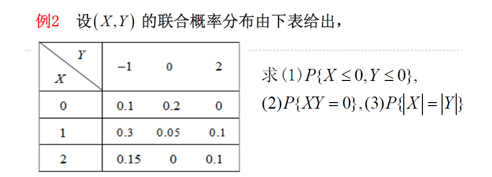
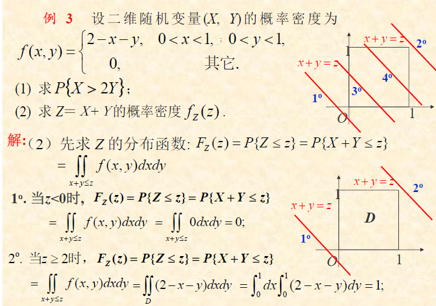

# **3.二维随机变量及其分布**

## **1.二维随机变量及其分布函数**

#### **1.(X,Y)的联合分布**

##### **1.二元Var定义**

**设E是随机试验,样本空间是$\Omega$,XY是随机变量,则(X,Y)是二维随机变量**

>**研究方向:分布函数/分布律/概率密度**

***

##### **2.二维Var联合分布函数定义**

**$\quad F(x,y) = P\{X\leq x,Y\leq y\}$**

>**称之为(X,Y)的分布函数/X与Y的联合分布函数**
>
>**几何意义:无穷矩形区域$\quad G = \{(u,v)|-\infty < u \leq x,-\infty < y \leq y\}$**
>
>

##### **3.二维Var联合分布函数性质**

>**1.$0 \leq F(x,y) \leq 1 $**
>
>**2.$F(x,y)$是x或y的不减函数,自变量直接改变大小**
>
>**3.F(x,y)分别关于x和y为右连续函数**
>
>**4.$F(+\infty,+\infty) = 1$(用于求参数)**
>
>**5.除此之外的$F(-\infty,y) \ F(x,-\infty) \ F(-\infty,-\infty)$都等于0**
>
>**6.$\{X>a,X>c\} $的对立事件是$\{X\leq a 或 Y\leq c\} $**

****

##### **4.二维Var联合分布函数概率**

**重要公式:(只能计算完全矩形)**

**$ \ P\{x_1<X\leq x_2,y_1<Y\leq y_2\} = F(x_1,y_1) + F(x_2,y_2) - F(x_2,y_1) - F(x_1,y_2)$**

**计算出来的值肯定大于0,所以可用来判断是否是联合分布函数**

>
>
>
>
>****
>
>

**更加常用的做法**

**2021-2022sj**

P{-1<X≤1,Y≤1}=P(X≤1,Y≤1)-P(X≤-1,Y≤1) =F(1,1)-F(-1,1)

(考点一:不能超限)当x<0或 y<0 时，F(x,y)=0。因此F(-1,1)=0。

(考点二:代入计算):

****

#### **2.(X,Y)的边缘分布**

##### **1.二元Var边缘分布函数定义**

###### **1.定义**

**对于每个一维随机变量也有自己的随机变量,成为关于X和Y的边缘分布函数**

###### **2.计算方式**

$F_x(X) = P(X\leq x) = P(X\leq x,Y\leq +\infty) = F(x,+\infty)$

$F_Y(y) = P(Y\leq y) = P(X\leq +\infty,Y\leq y) = F(+\infty,y)$

(也就是说概率分开取无穷)

###### **3.性质**

**由"联合分布"可以确定"边缘分布",但是"边缘分布"不能确定"联合分布"**

###### **4.*例题**

**首先通过("二维随机变量"的双无穷=1)求出参数,然后通过求其中一个随机变量的无穷来求最后的值**

***

##### **2.二维离散型Var联合分布+边缘分布**

***
###### **1.二维离散型Var定义**

**[二维随机变量的所有取值是"有限个"]**

###### **2.二维离散型Var联合分布定义**

**$\quad P\{X = x_i,Y = y_j\} = p_{ij},(i,j = 1,2,\cdots)$**

**表示方法:联合概率分布表**

###### **3.二维离散型Var联合分布性质**

**每个概率都大于0,概率和大于1**

###### **4.二维离散型Var的联合分布作用**

**求出(X,Y)取值在D上的概率**

>$P\{(X,Y) \in D\} = \sum_{(x_i,y_i) \in D} P\{X = x_i,Y = y_j\} = \sum_{(x_i,y_i) \in D} p_{ij}$
>
>

***

###### **5.例题**

**(1.根据乘法定理求出概率后写出联合概率分布表即可)**

**(2.查表问题,找到对应的概率求和)**

****

###### **6.二维离散型Var边缘分布定义**

**"二维离散型随机变量"的边缘分布的"定义":求行和,求列和**

>>

###### **7.二维离散型Var边缘分布性质**

**边缘分布概率大于0,行+列=1**

###### **8.例题**

(和上面说的一样,求行和,求列和)

****

##### **3.二维连续型Var联合密度+边缘密度**

***
###### **1.二维连续型Var联合密度函数定义**

>**设二维随机变量(X,Y)的"联合分布函数F(x,y)"使得存在一个函数f(x,y)**
>$$
>F(x,y) = P\{X\leq x , Y\leq y\} = \int^{x}_{-\infty} \int^{y}_{-\infty}f(s,t)dsdt
>$$

###### **2.二维连续型Var联合密度函数性质**

>**1.联合概率肯定大于0**
>
>**2.$\int^{+\infty}_{-\infty} \int^{+\infty}_{-\infty}f(x,y)dxdy = 1$**

###### **3.二维连续型Var分布函数和联合密度**

>   **1.From"分布函数"to"联合密度"**
>   $$
>   \frac{\partial^2 F(x,y)}{\partial x \partial y} = f(x,y)
>   $$
>
>   ****
>
>   **2.From"联合密度"to"分布函数"(可以单次or累次积分计算)**
>   $$
>   F_X(x) = P(X ≤ x) = ∫_{-∞}^x ∫_{-∞}^{+∞} f(u, v) dv du
>   \\
>   F_Y(y) = P(Y ≤ y) = ∫_{-∞}^{+∞} ∫_{-∞}^{y} f(u, v) du dv
>   $$
>   **3.几何意义**
>
>   **事件$\{(X,Y)\in G\}$的概率,以G为底,z=f(x,y)为曲顶的柱体体积**

****

###### **4.例题**

$$
设(X,Y)~f(x,y) = \begin{cases}
1 & 0<x<1,0<y<1 \\ 
\\
0, & Oth\end{cases}
$$
**求$P\{X>Y\}$**

>   **解:首先画出规划交集G,确定了G的范围**
>
>   
>
>   **$\ G = \{(x,y)|0\leq x \leq 1,0\leq y 
>   \leq x\}$**
>
>   $\therefore P\{X>Y\} = \int\int_G f(x,y)dxdy = \int^{1}_{0}dx \int^{x}_{0}1 dy = \frac{1}{2} $
>
>   **注意$\int_G 1 dy$的大小就是G的面积**

***
###### **5.联合密度特例+例题**

**二维连续型随机变量的"均匀分布"**
$$
f(x,y) = 
\begin{cases} 
    \frac{1}{S_G}, & (x,y)\in G \\ 
    \\
    0, & Oth
\end{cases}
$$
>比如$$G\{(x,y)|x^2 + y^2 \leq R^2\}$$对应的均匀分布
>$$
>\therefore f(x,y) = 
>\begin{cases} 
>    \frac{1}{\pi R^2}, & x^2 + y^2 \leq R^2 \\ 
>    \\
>    0, & Oth
>\end{cases}
>$$

**(X,Y)落在G中的子区域D的概率与D面积成正比,和形状无关**
***
**Eg2:设(X,Y)是服从区域D上的均匀分布**

>**1.求(X,Y)的概率密度**
>
>
>
>**2.求P(Y<2X)**
>>
>>
>>$$S_{G_1 \bigcap D} = \frac{1}{2} \times \frac{1}{2} \times 1 = \frac{1}{4}$$
>>
>>
>>$$\therefore P\{Y<2x\} = \frac{S_{G_1 \bigcap D}}{S_D} = \frac{1}{4}$$
>>
>>$$\therefore F(0.5,0.5) = P\{X\leq 0.5,Y\leq 0.5\} = \frac{S_{G_2 \bigcap D}}{S_D} = \frac{1}{4}$$
>
>**3.求F(0.5,0.5)**
>>
>>
>>

***
**Eg3:(已知分布函数)**
$$
f(x,y) = 
\begin{cases} 
    ce^{-(x+y)}, & 0<x<+\infty,0<y<+\infty \\ 
    \\
    0, & Oth
\end{cases}
$$

>**1.求常数C**
>
>**2.联合分布函数F(x,y)**
>
>**3.(X,Y)落入x=0,y=0,y<1-x的概率**
>
>**4.求$F_X(x),F_Y(y)$**

**解:**

$$(1)\int^{+\infty}_{-\infty}\int^{+\infty}_{-\infty} f(x,y)dxdy = \int\int_D ce^{-(x+y)}dxdy = 1$$

$$\because x\in (0,+\infty) y\in (0,+\infty)$$

$$\therefore I = \int^{+\infty}_{0} \int^{+\infty}_{0} ce^{-(x+y)}dxdy$$

$$\Leftrightarrow c\int^{+\infty}_{0}e^{-x}dx\int^{+\infty}_{0}e^{-y}dy = c,\therefore c=1$$
***
$$(2)\because F(x,y) = \int^{x}_{-\infty}\int^{y}_{-\infty} f(s,t)dsdt$$

$$
F(X,Y) = 
\begin{cases} 
    \int^{x}_{0}ds\int^{y}_{0}e^{-(s+t)}dt, & x\leq 0 \  y\leq 0 \\ 
    \\
    0, & Oth
\end{cases}
$$

$$\int^{x}_{0}ds\int^{y}_{0}e^{-(s+t)}dt = \int^{x}_{0}e^{-s}ds \int^{y}_{0}e^{-t}dt = -e^{-s}|^{x}_{0} \cdot (-e^{-t})|^{y}_{0}$$

$$
\therefore
F(X,Y) = 
\begin{cases} 
    (1-e ^{-x})(1-e^{-y}), & 0<x<+\infty ,0<y<+\infty \\ 
    \\
    0, & Oth
\end{cases}
$$

***
$$(3)\because G = \{(x,y)|0\leq x \leq 1,0\leq y \leq 1-x\}$$

$$\therefore P\{(X,Y) \in G\} = \int\int_G f(x,y)dxdy = \int^{1}_{0}dx \int^{1-x}_{0}e^{-(x+y)}dy = 1-2e^{-1}$$
***
(4)

$$x>0,F_X (x) = F(x,+\infty) = lim_{y\rightarrow +\infty} F(x,y)$$ 

>$$\Leftrightarrow lim_{y\rightarrow +\infty} (1-e^{-x})(1-e^{-y}) = 1 - e^{-x}$$
>
>FX(x) = ∫0x ∫0+∞ e-(u+v) dv du 
>
>= ∫0x e-u [∫0+∞ e-v dv] du 
>
>= ∫0x e-u [-e-v]0+∞ du 
>
>= ∫0x e-u (0 - (-1)) du 
>
>= ∫0x e-u du 
>
>= [-e-u]0x 
>
>= 1 - e-x

$$x\leq 0,F_X (x) = lim_{y\rightarrow +\infty} F(x,y) = 0$$
$$
\therefore F_X(x) = 
\begin{cases} 
    (1-e^{-x}), & x > 0 \\ 
    \\
    0, & x \leq 0
\end{cases}

\therefore F_Y(y) =
\begin{cases} 
   (1-e^{-y}), & y> 0 \\ 
    \\
    0, & y\leq 0
\end{cases}
$$

边缘分布函数：

-   FX(x) = P(X ≤ x) = ∫-∞x ∫-∞+∞ f(u, v) dv du
-   FY(y) = P(Y ≤ y) = ∫-∞+∞ ∫-∞y f(u, v) du dv

***

###### **6.二维连续型Var边缘密度函数定义**

***
**二维连续型随机变量(X,Y)的联合密度f(x,y)则边缘密度函数为**

$$F_X (x) = \int^{+\infty}_{-\infty} f(x,y)dy$$

$$F_Y (y) = \int^{+\infty}_{-\infty} f(x,y)dx$$

**边缘分布函数的对称性:二维均匀分布求边缘分布只需要改个变量**

***
**Eg:设二维随机变量(X,Y)具有概率密度,求两个边缘密度函数**
$$
f(x,y) =
\begin{cases} 
    e^{-x+y}, & 0<x<+\infty,0<y<+\infty \\ 
    \\
    0, & Oth
\end{cases}
$$

$$
(x\leq 0的情况) ,f_X (x) = \int^{+\infty}_{-\infty} f(x,y)dy = \int^{+\infty}_{-\infty} 0 dy =0
$$

$$
(x > 0 的情况),f_X (x) = \int^{+\infty}_{-\infty} f(x,y)dy = \int^{0}_{-\infty} f(x,y) dy + \int^{+\infty}_{0}f(x,y)dy 
= \int^{0}_{-\infty} 0 dy + \int^{+\infty}_{0}e^{(x+y)}dy\\
\\
\Leftrightarrow e^{(-x)}\cdot (e^{-y}) |^{+\infty}_{0} = e^{-x}
$$

$$
\therefore F_X(x) = 
\begin{cases} 
    e^{-x}, & x > 0 \\
    \\
    0, & x \leq 0
\end{cases}
\quad
\therefore F_Y(y) =
\begin{cases} 
   e^{-y}, & y> 0 \\ 
    \\
    0, & y\leq 0
\end{cases}
$$

****
**Eg2:设二维随机变量(X,Y)具有概率密度,求两个边缘密度函数**
$$
f(x,y) =
\begin{cases} 
    (\pi R^2)^{-1}, & x^2+y^2 \leq R^2 \\ 
    \\
    0, & x^2+y^2 > R^2 
\end{cases}
$$
**解:**
$$
|x|>R , f_X (x) = \int^{+\infty}_{-\infty} f(x,y)dy = 0 \\
\\
|x|\leq R,f_X (x) = \int^{+\infty}_{-\infty}(这个时候需要控制y)= \int^{-\sqrt{R^2 - x^2}}_{-\infty} 0 dy + \int^{\sqrt{R^2 - x^2}}_{-\sqrt{r^2 - x^2}} \frac{1}{\pi R^2} dy +\int^{+\infty}_{\sqrt{R^2 - x^2}} 0 dy = \frac{2}{\pi R^2} \sqrt{R^2 - x^2}
$$

$$
\therefore f_X (x) = 
\begin{cases} 
    \frac{2}{\pi R^2} \sqrt{R^2 - x^2}, & |x| \leq R \\ 
    \\
    0, & Oth 
\end{cases}
$$
***
**Eg3:**

###### **7.二维正态分布**

**二维连续型随机变量(X,Y)的正态联合密度:**
$$
\phi(x,y) = \frac{1}{2\pi\sigma_1\sigma_2\sqrt{1-\rho^2}}e^{-\frac{1}{2(1-\rho^2)}[\frac{(x-\mu)^2}{\sigma_1^2}-2\rho\frac{(x-\mu_1)(y-\mu_2)}{\sigma_1\sigma_2}+\frac{(y-\mu_2)^2}{\sigma_2^2}]}
$$
**二维连续型随机变量(X,Y)的正态边缘密度:**
$$
\phi_X(x) = \int^{+\infty}_{-\infty}\phi(x,y)dy = \frac{1}{\sqrt{2\pi}\sigma_1}e^{-\frac{(x-\mu_1^2)}{2\sigma_1^2}} 
\\
\phi_Y(y) = \int^{+\infty}_{-\infty}\phi(x,y)dy = \frac{1}{\sqrt{2\pi}\sigma_2}e^{-\frac{(x-\mu_2^2)}{2\sigma_2^2}}
$$
**二维连续型随机变量(X,Y)的正态性质:**

>   **1.二维正态分布的边缘分布 = 一维正态分布**
>
>   **参数对应于二维正态分布前4个参数,不依赖$\rho$**
>
>   **2.两个边缘分布都是正态分布的二维随机变量->不一定服从二维正态**
>
>   **3.$\rho=0 \forall (x,y)\Rightarrow \phi(x,y)=\phi_X(x)\phi_Y(y) $**

## **2.条件分布**

#### **1.条件分布的概念**

###### **1.定义**

>**设X是随机变量,$\ \forall F(x|A) = P\{X\leq x|A\},x\in (-\infty,+\infty)$**
>
>**对于二维随机变量(X,Y)的分布函数F(x,y),则有**
>
>>$F(x|Y\leq y) = P\{X\leq x |Y\leq y\} = \frac{P\{X\leq x,Y\leq y\}}{P\{Y \leq y\}} = \frac{F(x,y)}{F_Y (y)}$
>>
>>(解释:联合分布除以边缘分布)
***
###### **2.Eg**

**X的密度函数$f(x) = \frac{1}{\pi (1+x^2)}$,求在X>1的条件下X的条件分布函数**

>**解:**
>
>$F(x|X>1) = P\{X\leq x|X>1\} = \frac{P\{X\leq x,X>1\}}{P\{X>1\}}$
>
>**其中$\ P\{X>1\} = \int^{+\infty}_{1} \frac{1}{\pi (1+x^2)}dx = \frac{1}{\pi} arctanx|^{+\infty}_{1} = \frac{1}{4}$**
>
>**接下来分类讨论:**
>
>$x \leq 1时,P\{X\leq x,X>1\} = 0$
>
>$x>1时,P\{X\leq x,X>1\} = P\{1<X\leq x\} = \int^{x}_{1}\frac{1}{\pi (1+x^2)}dx = \frac{1}{\pi}arctanx - \frac{1}{4}$
>
>(然后代入公式,即上下同时除以1/4)
>$$
>\therefore 
>F(x|X>1) = 
>\begin{cases} 
>0, & x\leq 1 \\ 
>\\
>\frac{4}{\pi}arctanx -1, & x>1
>\end{cases}
>$$

#### **2.离散型Var的条件概率分布**

****
##### **1.离散型Var的条件概率分布定义**

###### **1.联合分布**

>$P\{X = x_i,Y = y_j\} = p_{ij}(i,j = 1,2,\cdots)$

###### **2.边缘分布**

>$P\{X = x_i\} = \sum_{j}p_{ij} = p_i$
>
>$P\{Y = y_j\} = \sum_{i}p_{ij} = p_j$

###### **3.条件分布**

**联合概率分布div边缘概率分布**

>$P\{X = x_i|Y = y_j\} = \frac{P\{X = x_i,Y = y_j\}}{P\{Y = y_j\}} = \frac{p_{ij}}{p_j}$
>
>$P\{Y = y_j|X = x_i\} = \frac{P\{X = x_i,Y = y_j\}}{P\{X = x_i\}} = \frac{p_{ij}}{p_i}$

##### **2.离散型Var的条件概率分布性质**

>**1.概率大于0并且所有随机变量加起来的和等于1(x和y都适用)**
>
>**2.如果知道边缘分布和条件分布,可得到联合分布,除法变乘法**
***
##### **3.离散型Var条件分布函数定义**

**(在区间内概率分布的和)**

>$F(y|X = x_i) = \sum_{y_j < y}\frac{p_{ij}}{p^{(2)}_{i}},y\in (-\infty,+\infty)$
>
>$F(x|Y = y_j) = \sum_{x_i < x}\frac{p_{ij}}{p^{(2)}_{j}},y\in (-\infty,+\infty)$
***
##### **4.Eg**

#### **5.连续型Var的条件概率分布**

##### **1.连续型Var的条件"密度函数"定义**

>**(X,Y)的联合密度函数为f(x,y),边缘密度函数为$\ f_X (x),f_Y (y)$**
>
>>**1.Y=y下条件X的条件密度函数:**
>>
>>$f(x|y) = \frac{f(x,y)}{f_Y (y)},但是如果 \ f_Y (y) = 0,f(x|y) = 0$
>>
>>**(注意$P\{X\leq x|Y=y\}$ )**
>
>>**2.X=x下条件Y的条件密度函数:**
>>
>>$f(y|x) = \frac{f(x,y)}{f_X (x)},但是如果 \ f_X (x) = 0,f(y|x) = 0$
>>
>>**(注意$P\{Y\leq y|X=x\}$ )**
>
>**当然如果知道边缘密度和条件密度,可以相乘得到联合密度**
****
##### **2.连续型Var条件"分布函数"定义**

$$P\{X \in A|Y \in y\} = \int_{x \in A}f(x|y)dx = \int_{x \in A}\frac{f(x,y)}{f_Y(y)}dx(也就是累加)$$

**可以得到如下条件分布函数**
>$F(x|y) = P\{X\leq x|Y = y\} = \int^{x}_{-\infty} \frac{f(x,y)}{f_Y (y)}dx$
>
>$F(y|x) = P\{Y\leq y|X = x\} = \int^{y}_{-\infty} \frac{f(x,y)}{f_X (x)}dy$
***
##### **3.Eg**

***
**Eg:这道题需要注意(走图形,相对举例问题)**

>
>
>

## **3.随机变量的独立性**

#### **1.随机变量的独立性定义**

**如果(X,Y)中X与Y取值的概率互不影响,则两者相对独立**

>**$P\{X\leq x,Y\leq y\} = P(X\leq x)P(Y\leq y)$**
>
>**注意:这个是充要条件,一般用这个来做证明**
>
>**注意:当然可以不止两个独立变量,可以是n个独立变量**
>
>**注意:当然可以用于任何分布**
>
>**联合分布可以直接推出边缘分布,边缘分布相乘等于联合分布则独立**

#### **2.Eg**

**(这个是真的走格子)**

## **4.二维随机变量函数的分布**

#### **0.随机变量函数的定义**

**设(X,Y)是二维随机变量，z=g(x,y)是二元连续函数，则Z=g(x,y)也是随机变量，也就是随机变量函数**

****
#### **1.二维离散型随机变量函数的分布**

****
##### **1.建立分布方法**

$$P\{X=x_i,Y = y_j\} = p_{ij}\quad ,(i,j = 1,2\cdots)$$
>**1.先确定Z = g(X,Y)的所有可能取值**
>
>**2.求Z可能取值的所有概率**
>
>**3.写出Z=g(X,Y)的概率分布表**
***
##### **2.性质**

**(独立变量)X和Y相互独立，X~B(n,p),Y~B(m,p),则Z=X+Y=(n+m,p)**

>**如果是0-1分布，则X+Y~B(2,p)**
>
>**(泊松分布)如果是n个相互独立随机变量泊松分布，则具有可加性**
>
>$\sum^{n}_{i=1}X_i$ ~ $P(\sum^{n}_{i=1}\lambda_i)$**(Eg2)**
***
##### **3.Eg**

**Eg1:联合分布如下，根据(X,Y)求面积Z的概率函数**

>**Z = XY，可能取值为20,20.4,21,21.42**
>
>$P\{Z = 20\} = P\{X=5,X=4\} = 0.2$
>
>$P\{Z = 20.4\} = P\{X = 5.1,Y=4\} = 0.3$
>
>$P\{Z = 21\} = P\{X = 5,Y=4.2\} = 0.4$
>
>$P\{Z = 21.42\} = P\{X =5.1 , Y =4.2\} = 0.1$
>
>$\therefore$
>|  Z   |  20  | 20.4 |  21  | 21.42 |
>| :--: | :--: | :--: | :--: | :---: |
>|  P   | 0.2  | 0.3  | 0.4  |  0.1  |
>

***
**Eg2:**

**X~P($\lambda_1$)与Y ~P($\lambda_2$)，且X与Y相互独立，求Z=X+Y的概率函数**

>>**(复习泊松分布):**
>>
>>**概率密度函数:**
>>
>>$\ P\{X = k\} = \frac{\lambda^k e^{-\lambda}}{k!}$
>>
>>**概率分布函数:**
>>
>>$\ F(k) = P\{X\leq k\} = \sum^{k}_ {j=0}P(x=j) = \sum^{k}_{j=0}\frac{\lambda^j e^{-\lambda}}{j!},\ (k=0,1,2,\cdots)$
>
>***
>
>$$\because P\{Z=k\} = \sum^{k}_{i=0}P\{X=i,Y=k-i\}$$
>
>$$\therefore P\{Z = k\} = \sum^{k}_{i=0}(\frac{\lambda^{i} _{1}}{i!}e^{-\lambda_1})(\frac{\lambda^{k-i} _{2}}{(k-i)!}e^{-\lambda_2})$$
>
>$$\Leftrightarrow [\sum^{k}_{i=0}\frac{k!}{i!(k-i)!}\lambda _{1}^{i} \lambda_{2}^{k-i}]\frac{e^{-(\lambda_1+\lambda_2)}}{k!}$$
>
>$$\because (二项展开式)\sum^{k}_{i=0}C^{i}_{k}\lambda^{i}_{1}\lambda^{k-i}_{2} = (\lambda_1 + \lambda_2)^k$$
>
>$$\therefore Z=X+Y \rightarrow P(\lambda_1+\lambda_2) = \frac{(\lambda_1 + \lambda_2)^k e^{-(\lambda_1 +\lambda_2)}}{k!}$$

#### **2.二维连续型随机变量函数的分布**

***
##### **1.目的**

**"二维连续型随机变量"(X,Y)联合密度为f(x,y),Z=g(x,y),求Z的密度**

***
##### **2.方法**

>**1.求Z的分布函数$F_z(z):$**
>
>>$F_z(z)=P\{Z\leq z\} = P\{g(X,Y)\leq z\} = P\{(X,Y)\in D_z\} = \int\int_{(X,Y)\in D_z}f(x,y)dxdy$
>
>**2.求Z的密度函数**
>>$f_z(z) = (F_z(z))'$
>
***

##### **3.Eg**

**设(X,Y)的联合概率密度为$f(x,y) = \frac{1}{2\pi}e^{-\frac{x^2+y^2}{2}}$,求$Z = \sqrt{X^2+Y^2}$**

>
>**Z的分布函数为$F_z(z) = P(Z\leq z) = P\{\sqrt{X^2+Y^2}\leq z\}$**
>
>>$(z<0),F_z(z) = P\{\sqrt{X^2+Y^2}\leq z\} = 0(不可能事件)$
>>
>>$(z\geq 0),F_z(z)= P\{\sqrt{X^2+Y^2}\leq z\} = P\{X^2+Y^2\leq z^2\}$
>
>>>$\Leftrightarrow \int\int_{X^2+Y^2\leq z^2} \quad f(x,y)dxdy$
>>>
>>>$\Leftrightarrow \int\int_{X^2+Y^2\leq z^2} \quad \frac{1}{2\pi} e^{-\frac{x^2+y^2}{2}}dxdy$
>>>
>>>$(\because D = \{(r,\theta)|0\leq\theta \leq 2\pi,0\leq r \leq z\})$
>>>
>>>$\Leftrightarrow \int\int_{r^2 \leq z^2} \quad \frac{1}{2\pi}e^{-\frac{r^2}{2}}rdrd\theta (转换为极坐标,注意多加一个r)$
>>>
>>>$\Leftrightarrow \int^{2\pi}_{0}d\theta \int^{z}_{0} \frac{1}{2\pi}e^{-\frac{r^2}{2}}rdr = 1-e^{-\frac{z^2}{2}}$
>
>>$$
>>\therefore
>>F_z(z) = 
>>\begin{cases} 
>>0, & z<0 \\
>>1-e^{-\frac{z^2}{2}}, & z\geq 0
>>\end{cases}
>>$$

>   >   $\therefore$**密度函数是:**
>   >   $$
>   >   \therefore
>   >   f_z(z) = 
>   >   \begin{cases} 
>   >   0, & z<0 \\
>   >   ze^{-\frac{z^2}{2}}, & z\geq 0
>   >   \end{cases}
>   >   $$

****

#### **3.特殊随机变量函数的分布**

***
##### **1.Z=X+Y的分布**

(基本求法):

>   **1.当密度函数f(x,y)不是分段函数,利用卷积公式/分布函数法**
>
>   **2.当密度函数f(x,y)是分段函数,分布函数法**
>
>   **3.当密度函数f(x,y)不是线性形式,利用分布函数法**

***
**二维连续型随机变量(X,Y)的联合密度为f(x,y),求Z=X+Y的密度函数**

>
>
>$$F_z(z)=P\{Z\leq z\} = P\{X+Y\leq z\} = \int\int_{x+y\leq z}f(x,y)dxdy$$
>
>$$\because D \in(-\infty <x< \infty,-\infty<y< z-x)$$
>
>$$\therefore \Leftrightarrow \int^{+\infty}_{-\infty}dx \int^{z-x}_{-\infty} \ f(x,y)dydx$$
>
>**(令t=y+x则)$$\Leftrightarrow \int^{+\infty}_{-\infty} dx \int^{z}_{-\infty} \ f(x,t-x)dtdx$$**
>
>$$\Leftrightarrow \int^{z}_{-\infty}dt \int^{+\infty}_{-\infty} \ f(x,t-x)dxdt(交换积分次序)$$
>
>**求导:**
>
>$$f_z(z) = \frac{d}{d_z}F_z(z) = \frac{d}{d_z}\int^{z}_{-\infty}[\int^{+\infty}_{-\infty}f(x,t-x)dx]dt$$
>
>$$\therefore f_z(z) = \int^{+\infty}_{-\infty} f(x,z-x)dx$$(对称性)
>
***
##### **2.卷积公式**

$$f_z(z) = \int^{+\infty}_{-\infty}f(x,z-x)dx = \int^{+\infty}_{-\infty}f_x(x)f_Y (z-x)dx$$

$$f_z(z) = \int^{+\infty}_{-\infty}f(z-y,y)dy = \int^{+\infty}_{-\infty}f_x(z-y)f_Y (y)dy$$
***
**Eg:求Z = X+Y的密度函数**

$$\phi_x(x) = \frac{1}{\sqrt{2\pi}}e^{-\frac{x^2}{2}},(-\infty<x<+\infty)$$

$$\phi_Y(y) = \frac{1}{\sqrt{2\pi}}e^{-\frac{y^2}{2}},(-\infty<y<+\infty)$$

**解:(X与Y相互独立,由卷积公式,z的密度函数可知)**

$$\phi_z(z) = \int^{+\infty}_{-\infty}f_x (z-y)f_Y (y)dy$$
>
>$$\Leftrightarrow \int^{+\infty}_{-\infty} (\frac{1}{\sqrt{2\pi}} e^{-\frac{(z-y)^2}{2}})(\frac{1}{\sqrt{2\pi}}e^{-\frac{y^2}{2}}dy)$$
>
>$$\Leftrightarrow \frac{1}{2\pi} \int^{+\infty}_{-\infty} e^{-[\frac{(x-y)^2}{2}+\frac{y^2}{2}]}dy$$
>
>$$\Leftrightarrow \frac{1}{2\pi} \int^{+\infty}_{-\infty} e^{-[(y-\frac{z}{2})^2+\frac{z^2}{4}]}dy$$
>
>$$\Leftrightarrow \frac{1}{2\pi}e^{-\frac{z^2}{4}}\int^{+\infty}_{-\infty}e^{-(y-\frac{z}{2})2}dy$$
>
>$$\Leftrightarrow \frac{1}{2\pi}e^{-\frac{z^2}{4}}\int^{+\infty}_{-\infty}e^{-t^2}dt(换元)$$
>
>$$\Leftrightarrow \frac{1}{2\pi}e^{-\frac{z^2}{4}}\sqrt{\pi}$$
>
>$$\Leftrightarrow \frac{1}{2\sqrt{\pi}}e^{-\frac{z^2}{4}} = \frac{1}{\sqrt{2\pi}\sqrt{2}}e^{-\frac{z^2}{2(\sqrt{2})^2}}$$

**$\therefore Z = X+Y$~$N(0,2)$**

****

##### **3.卷积公式推导的正态分布公式**

[正态分布的可加性](【概率论与数理统计】2.常见的随机变量及其分布.md#5.正态分布的可加性)

(一般直接秒,如果需要证明就写出标准正态分布后查表)

****

##### **4.Eg**

****

****

#### **5.M=max{X,Y}和M=min{X,Y}**

###### **定义**

**分布函数:(仅对X,Y相互独立)**

>   $$
>   F_M(z) = F_X(z)F_Y(z) \\
>   F_N(z) = 1-[1-F_X(z)][1-F_Y(z)]
>   $$

**分布函数(对n个x项相互独立)**

>   $$
>   F_M(z) = F_1(z)\cdots F_n(z) \\
>   F_N(z) = 1-\prod^n_{i=1}[1-F_X(z)]
>   $$
>
>   (特别的,如果独立同分布)
>   $$
>   F_M(z) =  [F_n(z)]^n \\
>   F_N(z) = 1-[1-F(z)]^n
>   $$
>   

###### **Eg**

**设XY相互独立,X服从区间[0,3]的均匀分布,Y服从$\lambda=3$的指数分布**

>   **$\because$ **
>   $$
>   f_X(x) = \begin{cases}1 & 0\leq x\leq 1 \\ \\0, & Oth\end{cases}\quad
>   F_X(x) = \begin{cases}
>   0 & z\leq 0 
>   \\ 
>   z & 0\leq z<1
>   \\
>   1, & z\geq 1
>   \end{cases}
>   $$
>
>   $$
>   f_X(x) = \begin{cases}
>   3e^{-3y} & y>0 
>   \\ 
>   \\
>   0, & y\leq 0
>   \end{cases}
>   \quad
>   F_X(x) = \begin{cases}
>   1-e^{-3z} & z> 0 
>   \\ 
>   \\
>   0, & z\leq 0
>   \end{cases}
>   $$
>
>   $\therefore $
>   $$
>   F_M(z)=F_X(z)F_Y(z) =
>   \begin{cases}
>   0 & z<0 
>   \\ 
>   z(1-e^{-3z}) & 0\leq z \leq 1
>   \\
>   1-e^{-3z}, & z\geq 1
>   \end{cases}
>   \\
>   \\
>   \therefore
>   f_M(z)=
>   \begin{cases}
>   0 & z<0 
>   \\ 
>   1-e^{-3z}+3ze^{-3z} & 0\leq z \leq 1
>   \\
>   3e^{-3z}, & z\geq 1
>   \end{cases}
>   $$

****

