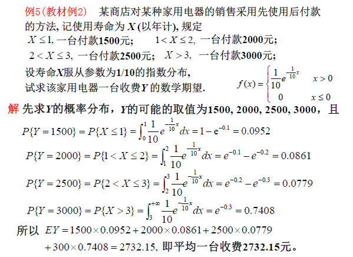
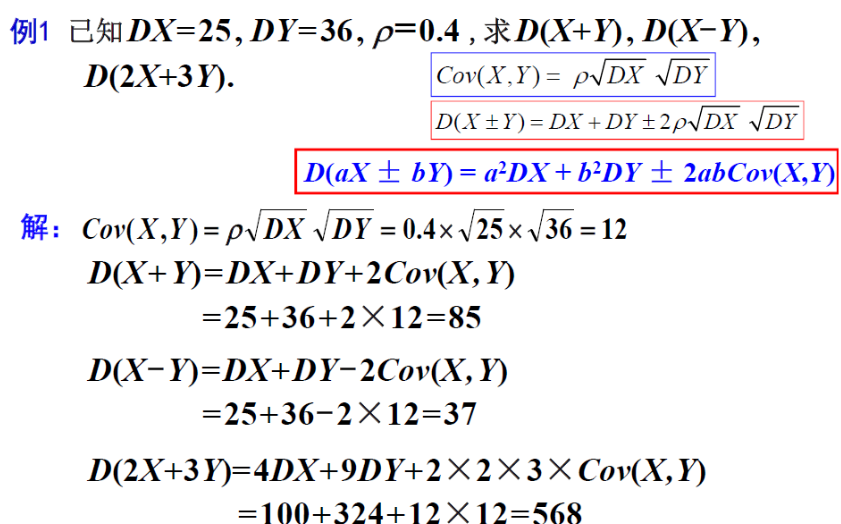

# **4.随机变量的期望和方差**

## **1.数学期望**

#### **1.离散型随机变量的数学期望**

###### **0.引例**

###### **1.离散型随机变量期望的定义**

>**定义:设离散型随机变量X的概率函数是$P(X=x_k)=p_k \ (k=1,2,\cdots)$**
>>**若级数$\sum^{\infty}_{k=1}x_k p_k$绝对收敛,则称此级数的和为数学期望,即**
>>
>>$$EX = \sum^{\infty}_{k=1}x_k p_k$$
>>
>>**(若级数$\ \sum^{\infty}_{k=1}|x_k p_k| = \sum^{\infty} _{k=1}|x_k| p_k\ $收敛,则绝对收敛)**
>
>**期望用法:如果$\ EX_1>EX_2 \ $,则$ \ X_1 \ $的均值更大,数量更占优势**
>
>**特例:超几何分布,N个产品,M个次品,取n件其中次品的数学期望为$\ \frac{nM}{N}$**

###### **2.例题**

**（直接代入EX=np）**

***

***

***

#### **2.连续型随机变量的数学期望**

###### **1.连续型随机变量的数学期望的定义**

>   **定义:设连续型随机变量X的概率密度为f(x)**
>
>   >   **若积分$\ \int^{+\infty}_{-\infty} xf(x)dx$绝对收敛,则称该积分为数学期望,即**
>   >
>   >   $$EX = \ \int^{+\infty}_{-\infty} xf(x)$$
>   >
>   >   **若无穷限积分$\int^{+\infty}_{-\infty} |xf(x)|dx = \int^{+\infty} _{-\infty} |x|f(x) \ $收敛,则绝对收敛**
>   >
>   >   
>   >
>   >   

###### **2.特例**

>**1.均匀分布:$\quad EX = \int^{+\infty}_{-\infty} xf(x)dx = \int^{b
>} _{a}\frac{x}{b-a}dx = \frac{a+b}{2}$**
>
>$$\begin{cases} 
>\frac{1}{a-b}, & a\leq x\leq b \\ 
>\\
>0, & Oth
>\end{cases}$$
>
>**2.指数分布:$\quad EX = \int^{+\infty}_{-\infty} xf(x)dx = (分部积分法)= \frac{1}{\lambda}$**
>
>$$\begin{cases} 
>    \lambda e^{-\lambda x}, & x>0 \\ 
>    \\
>    0, & x \leq 0
>\end{cases}$$
>
>**3.正态分布:$\quad EX = \int^{+\infty}_{-\infty} xf(x)dx = (换元法+公式)= \mu$**
>
>$$X$$~$$N(\mu,\sigma^2)=\frac{1}{\sqrt{2\pi}\sigma}e^{-\frac{(x-\mu)^2}{2\sigma^2}}$$
>
>**4.柯西分布:$\quad EX = \int^{+\infty}_{-\infty} xf(x)dx = +\infty$(没有期望,因为不绝对收敛)**
>
>$$F(x) = \frac{1}{\pi} \cdot \frac{1}{1+x^2}$$

###### **3.例题**

**(对于每段要通过求定积分计算概率,再乘以对应X)**

#### **3.随机变量函数的数学期望**

**人话:(通过X的分布函数求X的期望,线性关系)**

##### **1.一维随机变量函数的数学期望**

**(带有G(x)的期望)**

>**设X是一随机变量,Y=g(x),g(x)是连续函数**
>
>**1.若X为"离散型"随机变量:其概率函数$p_k = P\{X = x_k\}(k=1,2,\cdots)$**
>
>>**且$\ \sum^{\infty}_{k=1}g(x_k)p_k \ $绝对收敛,则**
>>
>>$$EY = Eg(X) = \sum^{\infty}_{k=1}g(x_k)p_k$$
>
>**2.若X为"连续型"随机变量:其密度函数为f(x)**
>
>>**且$\int^{+\infty}_{-\infty} g(x)f(x)dx$绝对收敛,则**
>>
>>$$EY = Eg(X) = \int^{+\infty}_{-\infty}g(x)f(x)dx(原来是Xf(x))$$
>

##### **2.解释**

**1.对于离散型随机变量,直接对P执行相关变形,然后按照原来离散的方式求期望**

>
>
>
>
>

**2.对于连续型随机变量,直接代入原函数f(x)和现函数G(x),然后求期望**

>

##### **3.二维随机向量函数的数学期望**

**设(X,Y)是二维随机变量,随机变量Z=g(X,Y),二元连续函数g(x,y)**

**1.若(X,Y)为二维离散型随机变量,其联合分布为**

>$P \{X = x_i,Y = y_i \} = p_{ij},(i,j=1,2,\cdots)$
>
>**且$\sum^{\infty}_{i=1} \sum^{\infty} _{j=1}g(x_i,y_j)p _{ij}$绝对收敛,则**
>
>$$EZ = Eg(X,Y) = \sum^{\infty}_{i=1} \sum^{\infty} _{j=1}g(x_i,y_j)p _{ij}$$

**2.若(X,Y)为二维连续型随机变量,其联合密度函数为f(x,y)**

>**且$\int^{+\infty}_{-\infty}\int^{+\infty} _{-\infty}g(x,y)f(x,y)dxdy$绝对收敛,则**
>
>$$EZ = Eg(X,Y) = \int^{+\infty}_{-\infty}\int^{+\infty} _{-\infty}g(x,y)f(x,y)dxdy$$

###### **解释**

**1.对于离散型随机变量,直接进行XY相关的变形,然后求期望**

**2.对于连续型随机变量,直接代入原函数f(x,y)和现函数关系G(x,y),然后求期望**

**注意分段函数**

#### **4.数学期望的性质**

**1.常量C的期望就是常量本身:EC=C**

**2.E(X+C) = EX+C(C是常数)**

>

**3.E(CX) = CEX(C是常数)**

**4.E(kX+b) = kEX +b**

***
**5.对于两个随机变量E(X+-Y) = EX +- EY(可推广至n个变量)**

**6.两个"相互独立"的随机变量的乘积:E(XY)=EX EY**
>**但是不能由这个式子反推量变量相互独立**
***

#### **5.条件数学期望**

##### **1.离散型随机变量条件数学期望**

###### **定义**

**设(X,Y)为二维离散型随机变量,其联合分布为$P(X=x_i,Y=y_j)=p_{ij}$**

**"在$Y =y_j$条件下随机变量X的分布"为:$\ P(X=x_i|Y=y_j)(i=1,2,\cdots)$**

**若$\sum_i x_i P(X=x_i|Y=y_j)$绝对收敛,则**

**$$E(X|Y=y_j) = \sum_i x_i P(X=x_i|Y=y_j)$$**

**$$同理:E(Y|X=x_i) = \sum_j y_j P(Y=y_j|X=x_i)$$**

***

###### **计算方法**

$$P(Y=y_j|X=x_i) = \frac{P(Y=y_j,X=x_i)}{P(X=x_i)} = \frac{表格内对应的}{X=x_i的增广表}$$

****

###### **Eg**

>
>
>**进一步的,求条件下所有的满足Y项**
>
>

***
##### **2.连续型随机变量条件数学期望**

###### **定义**

**设(X,Y)是二维连续型随机变量,条件密度函数分别是f(x|y)和f(y|x)**

>**若$\int^{\infty}_{-\infty}xf(x|y)$绝对收敛,则**
>
>$$E(X|Y=y) = \int^{\infty}_{-\infty}xf(x|y)dx$$
>
>$$同理:E(Y|X=x) = \int^{\infty}_{-\infty} yf(y|x)dy$$
>

###### **计算方式**

$$f(x|y) = \frac{f(x,y)}{f_Y(y)} = \frac{XY的联合密度}{Y的分布密度}$$

$$f(x|y=a) = f(x|y)代入条件常量$$

$$E(X|Y=a) = \int^{+\infty}_{-\infty} xf(x|y=a)$$

###### **Eg**

（先求边缘密度函数，再求条件密度函数，再代值）

>
>
>
>
>
>
>**先求标准条件分布,再代入条件对应的常量**

## **2.方差**

**0.对于期望相同,我们需要一个新的变量来反映数据的离散程度**

##### **1.方差定义**

>$\ E(X-EX)^2 \ $**前提:(设X是随机变量,且期望EX存在)(称作DX/VarX)**
##### **2.使用方式**

**均值相同的情况下DX越小,X的取值越集中;DX越大,X的取值越分散**

##### **3.性质**

>   **1.离差定义:XS-EX,且E(X-EX)=0**
>
>   **2.标准差:$\sqrt{DX}$为X的标准差(或均方差),记作$\sigma(X)$或$\sigma_X$**
>
>   **3.期望对应的内容:刻画了数据项和期望的平均偏差程度,DX越大越分散**
>
>   **4.期望(均值)不存在,方差肯定不存在;期望(均值)存在,方差不一定存在**

##### **4.计算方式**

**(使用重要计算公式)**$$DX = E(X-EX)^2 = EX^2 - (EX)^2$$

>**1.对于离散型随机变量:$\quad$"变量X的平方乘以概率"$\quad$减去$\quad$"EX的平方"**
>
>>
>>
>>***
>>
>>
>
>**记住:均匀分布:$\quad DX = EX^2 - (EX)^2 = \frac{(b-a)^2}{12}$**
>
>>>$$
>>>F(x) = 
>>>\begin{cases} 
>>>\frac{1}{a-b}, & a\leq x\leq b \\ 
>>>\\
>>>0, & Oth
>>>\end{cases}
>>>$$
>>>$$EX = \frac{a+b}{2}$$
>
>**2.对于连续型随机变量:按照公式取对应的平方即可**
>>
>

***
**其它题型:**

**Eg1:通过重要公式替换$EX^2$并继续计算$EX^2 = DX + (EX)^2$ **

>>
>
>**Eg2:更进一步的,根据重要公式+定义xf(x)反推参数**
>>

##### **5.计算性质**

>   **1.常数的方差等于0**
>
>   **2.D(X+C)=DX (常数会影响均值,但是不会改变分布)**
>
>   **3.D(CX)=$C^2DX\quad$(因为重要公式有个平方)**
>
>   **4.D(kX+b)=$k^2 DX \quad$(根据2,3)**
>
>   ****
>
>   **对于两个独立的随机变量X和Y**
>
>   **5.D(X+-Y) = D(X+Y)(考虑分布的叠加,无论加减,可推导n个)**

##### **6.随机变量X的标准化**

**随机变量X的标准化!!(协方差要用)**

$$X^* = \frac{X-EX}{\sqrt{DX}},则EX^*=0,DX ^*=1$$

**比如 X~$N(\mu,\sigma^2),Y=\frac{(x-\mu)}{\sigma}$ ~$N(0,1)$**

## **3.常见的数学期望与方差**

|   分布名称   |                           概率密度                           |      期望E(X)       |       变形E(X^2)        |       方差D(X)        |     表示方式      |
| :----------: | :----------------------------------------------------------: | :-----------------: | :---------------------: | :-------------------: | :---------------: |
|   0-1分布    |                   $P\{X=K\} = p^k q^{1-k}$                   |         $p$         |           $p$           |         $pq$          |     X~B(1,p)      |
|   二项分布   |                $P\{X=K\} = C^k_n p^k q^{n-k}$                |        $np$         |      $npq+n^2-p^2$      |         $npq$         |     X~B(n,p)      |
|   几何分布   |                  $P\{X=k\} = (1-p)^{k-1}q$                   |    $\frac{1}{p}$    |    $\frac{2-p}{p^2}$    |   $\frac{1-p}{p^2}$   |      X~GE(p)      |
|   泊松分布   |        $P\{X=k\} = \frac{\lambda^k}{k!}e^{-\lambda}$         |      $\lambda$      |   $\lambda^2+\lambda$   |       $\lambda$       |   X~P(\lambda)    |
|   均匀分布   | $f(x) = \begin{cases}\frac{1}{b-a} & a\leq x\leq b \\0, & Oth\end{cases}$ |   $\frac{a+b}{2}$   | $\frac{a^2+b^2+c^3}{3}$ | $\frac{(b-a)^2}{12}$  |     X~U[a,b]      |
|   指数分布   | $f(x) = \begin{cases} \lambda e^{-\lambda x} & x>0 \\0 & x\leq0\end{cases}$ | $\frac{1}{\lambda}$ |  $\frac{2}{\lambda^2}$  | $\frac{1}{\lambda^2}$ |  X~Exp(\lambda)   |
|   正态分布   | $\phi(x) = \frac{1}{\sqrt{2\pi}\sigma}e^{-\frac{(x-\mu)^2}{2\sigma^2}}$ |        $\mu$        |            -            |      $\sigma^2$       | X~N(\mu,\sigma^2) |
| 标准正态分布 |      $\phi(x) = \frac{1}{\sqrt{2\pi}}e^{-\frac{x}{2}}$       |         $0$         |            -            |          $1$          |     X~N(0,1)      |

指数分布/正态分布/泊松分布  相互独立的随机变量之和任服从对应分布

均匀分布/指数分布/几何分布/t分布/f分布不符合

****

***
#### **1.离散型分布的数学期望和方差**

***
**1.0-1分布:**
>**$EX = p$**
>
>**$EX^2 = p$**
>
>**$DX = EX^2 - (EX)^2 = pq \quad$(p+q=1)**
>

****

**2.二项分布:X~B(n,p):$\quad P(X=k) = C^{k}_{n}p^{j} q^{(n-k)}\quad$其中q=1-p**

>   **$EX = \sum^{k}_{n}k C^{k} _{n} p^{k}q^{n-k} = np \quad$**
>
>   **$DX = npq$**

**注意:X~B(n,p)还可以表示n重伯努利A发生的次数,DX和EX是一样的**

>

****

**3.几何分布:X~P(X=k):$(1-p)^{k-1}p \ (k=1,2,\cdots)$**

>   **$EX = \sum^{\infty}_{k=1}k(1-p)^{k-1}p = \frac{1}{p}$**
>
>   **$EX^2 = \sum^{\infty}_{k=1}k^2(1-p)^{k-1} = \frac{2-p}{p^2}$**
>
>   **$DX = EX^2 - (EX)^2 = \frac{1-p}{p^2}$**
>
>   

***

**4.泊松分布:P(X=k):$\quad \frac{\lambda^k}{k!}e^{-\lambda}(\lambda>0,k=0,1,2,\cdots)$**

>   **$EX = \lambda$**
>
>   **$DX = \lambda$**
>
>   

****

#### **2.连续型分布的数学期望和方差**

***
**1.均匀分布**
$$
f(x) = 
\begin{cases}
\frac{1}{b-a} & a\leq x\leq b \\
0 & Oth
\end{cases}
\\
\\
D(aX) = a²D(X)
$$

>**$EX = \frac{a+b}{2}$**
>
>**$DX = \frac{(b-a)^2}{12}$**
>
>>
>

****

**2.指数分布**
$$
f(x) = 
\begin{cases}
\lambda e^{-\lambda x} & x \geq 0 \\
0 & Oth
\end{cases}
$$

>**$EX = \frac{1}{\lambda}$**
>
>**$EX^2 = \int^{+\infty}_{-\infty}x^2 f(x)dx = \frac{2}{\lambda^2}$**
>
>**$DX = \frac{1}{\lambda^2}$**
>
>>
>>
>>
>

***

**3.正态分布**

$$\phi(x) = \frac{1}{\sqrt{2\pi}\sigma}e^{\frac{-(x-\mu)^2}{2\sigma^2}}$$

>**$EX = \mu$**
>
>**$DX = \int^{+\infty}_{-\infty}(x-\mu)^2 = \sigma^2$**
>
>

## **4.协方差和相关系数**

***
#### **1.协方差**

**提出背景:边缘分布不能推导出联合分布**

**$\because D(X \pm Y) = DX + DY \pm 2E\{(X-EX)(Y-EY)\}$**

**$\therefore E[(X-EX)(Y-EY)]$就是协方差,Cov(X,Y)**
***
##### **1.协方差的基本用法**

>**1.X和Y的协方差反映X与Y之间相关关系**
>
>**2.Cov(X,X) = DX**
>
>**3.D(X $\pm$ Y) = DX + DY $\pm$ 2Cov(X,Y)**
>>**可推广至n个:**
>
>>**$D(\sum^{n}_{i=1}X_i) = \sum^{n} _{i=1}DX_i + 2\sum^{n} _{1\leq i<j \leq n}Cov(X_i,Y_j)$**
>

##### **2.协方差的计算**

###### **0.主要的计算方法**

**Cov(X,Y)=EXY-EXEY（联合分布-两个边缘分布的乘积）**

>**""求EX,EY,EXY,计算EXY-EXEY""**

###### **1.离散型随机变量的协方差**

**(直接画增广然后找)**

>

###### **2.连续型随机变量的协方差**

**(求所有边缘密度和联合密度,然后求对应的期望)**

>

##### **3.协方差的性质**

**$0.协方差等于0，则XY相互独立；但是XY相互独立，不能推导出协方差等于0$**

**$1.Cov(X,Y) = Cov(Y,X) \quad$(前后替换)**

**$2.Cov(aX,bY) = abCov(X,Y) \quad$(提出系数)**

**$3.Cov(X_1+X_2,Y) = Cov(X_1,Y) + Cov(X_2,Y) \quad$(可拆性)**

**$4.Cov(X,Y_1+Y_2) = Cov(X,Y_1) + Cov(X,Y_2) \quad$(可拆性)**

**$5.Cov(X,c) = Cov(c,X) = 0 \quad$(常数变0)**

**$6.D(X \pm Y) = DX + DY + 2Cov(X,Y) \quad$(基本公式1)**

**$7.D(aX \pm bY) = a^2 DX + b^2 DY + 2abCov(X,Y) \quad$(基本推论公式)**

##### **4.协方差矩阵**

$$
\Sigma =
\begin{bmatrix}
\text{Cov}(X_1,X_1) & \text{Cov}(X_1, X_2) & \cdots & \text{Cov}(X_1, X_n) \\
\text{Cov}(X_2, X_1) & \text{Cov}(X_2,X_2) & \cdots & \text{Cov}(X_2, X_n) \\
\vdots & \vdots & \ddots & \vdots \\
\text{Cov}(X_n, X_1) & \text{Cov}(X_n, X_2) & \cdots & \text{Cov}(X_n,X_n)
\end{bmatrix}
$$

>**显然1:主对角线:$Cov(X_i,X_i)=DX_i (i=1,2,\cdots,n)$**
>
>**显然2:矩阵关于主对角线对称**
>
>***
>**注意还有二维协方差矩阵的问题**
>
>
>
>>**注意这里Cov(X,Y)直接看了次对角线(因为对称,看一个值就行)**
>

##### **5.协方差的标准化**

**(如果XY的度量单位不同)**

>   $X\rightarrow X^* = \frac{X-EX}{\sqrt{DX}}$
>
>   $Y\rightarrow Y^* = \frac{Y-EY}{\sqrt{DY}}$
>
>   $\rho = Cov(X^*,Y^*) = E(X^* Y^*)-EX^* EY^* = \frac{Cov(X,Y)}{\sqrt{DX}\sqrt{DY}}$
>
>   **$D(\frac{X-EX}{\sqrt{DX}}) = 1$**

***
#### **2.相关系数**

***
##### **1.定义**

**由上面标准化可知:**

>$\rho = Cov(X^*,Y^*) = E(X^* Y^*)-EX^* EY^* = \frac{Cov(X,Y)}{\sqrt{DX}\sqrt{DY}}$
>
>**$\rho \ $称为X与Y的相关系数**
>
>**推广1:$\quad Cov(X,Y) = \rho \sqrt{DX}\sqrt{DY}$**
>
>**推广2:$\quad D(X \pm Y) = DX +DY \pm 2\rho \sqrt{DX}\sqrt{DY}$**
>***

**(以上公式可以通过相关系数,求协方差和方差)**

>
>
>
>
>>**注意这里E(XY)的求法是每个XY对应的p和XY相乘后相加,只不过题目0省略了**
>
>
>
>>**方法1:比较传统,求边缘分布,求方差,协方差,求相关系数**
>
>
>
>>**方法2:主要是直接使用联合密度和求方差的公式求对应内容**

##### **2.相关系数的性质**

>   **1.$\rho(X,Y) = \rho(Y,X)$**
>
>   **2.设随机变量X与Y的相关系数为$\rho$,则$|\rho|\leq 1 $**
>
>   **3.2.设随机变量X与Y的相关系数为$\rho$,则$|\rho| = 1 $的充要条件**
>
>   (X与Y和概率1存在线性关系,即P(Y=aX+b)=1)
>
>   **4.用法(是否相关)**
>
>   
>

## **(最重要的判别关系不相关,正态分布慎用)**

>   **sj2023-2024,两个变量独立->不相关**
>
>   **sj2022-2023,两个变量不相关 不能推出 独立**
>
>   
>
>   

##### **3.Eg**

## **5.随机变量的矩(不讲不考)**

***
**1.原点矩**
***
**定义：随机变量X的k次幂的数学期望叫随机变量的k阶原点矩**

$$v_k = EX^k (k=1,2,\cdots)$$

$$v_k(离散型) = EX^k = \sum_{i}x_i ^{k}p_i$$

$$v_k(连续型) = EX^k = \int^{+\infty}_{-\infty}x^kf(x)dx$$

***

$$v_0 = EX$$

***
**2.中心矩**
***
**定义：随机变量X的离差X-EX的k次幂叫随机变量的k阶中心矩**

$$\mu_k = E(X-EX)^k $$

$$\mu_k(离散型) = E(X-EX)^k = \sum_i(x_i-EX)^k p_i$$

$$\mu_k(连续型) = E(X-EX)^k = \int^{+\infty}_{-\infty}(x-EX)^k f(x)dx$$

***
$$\mu_1 = E(X-EX) = 0$$

$$\mu_2 = E(X-EX)^2 = DX$$

