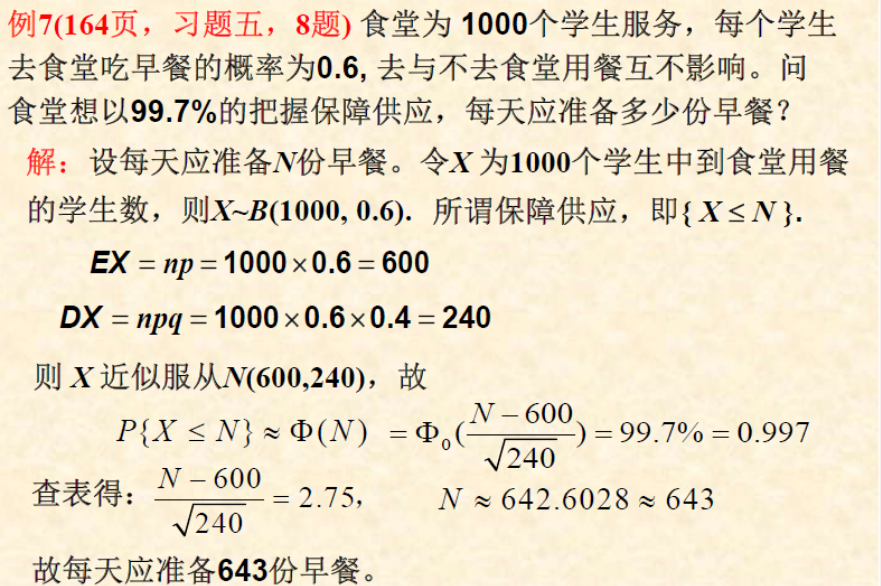
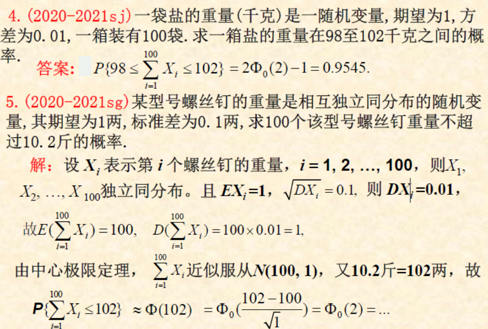

# **5.大数定律**

***
## **1.大数定律**

***
#### **0.问题提出**

###### **1.频率的稳定性**

**试验次数n越大，频率越趋于概率p的倾向的稳定**

>   $$lim_{n\rightarrow \infty}\frac{m_n}{n} = P(A) = P（不讨论这个）$$
>
>   $$lim_{n\rightarrow \infty}P\{|\frac{m_n}{n} - p|<\epsilon\} =1(而是这个)$$

###### **2.大数定律的概念**

**用来阐明大量的随机变量的平均结果具有稳定性的定理**

***
#### **1.切比雪夫（Chebyshev）不等式**

###### **1.定义**

>**设随机变量X的期望EX和方差DX存在，则对任意$\sigma >0$,有**
>
>$$P\{|X-EX|\geq \epsilon\} \leq \frac{DX}{\epsilon^2}(大于等于+小于等于)$$
>
>$\Leftrightarrow P\{|X-EX|<\epsilon\}\geq 1-\frac{DX}{\epsilon^2}(小于+大于等于)$(主要用这个做预测)
>
>$$(|x-EX|\geq \epsilon \Leftrightarrow \frac{|x-EX|}{\epsilon} \geq 1 \geq \frac{(x-EX)^2}{\epsilon^2} \geq 1 \Leftrightarrow \frac{DX}{\epsilon^2})$$
>
>**X的方差越小，$P\{|X-EX|<\epsilon\}$就越大，X的取值就越集中在EX附近**
###### **2.作用**

>**作用1：用于估计概率（不是很准），只用知道期望和方差即可**
>
>**作用2：用于证明切比雪夫大数定律**

###### **3.Eg**

>**Eg:一枚均匀硬币1000次，用切比雪夫不等式估现正面次在450~550次的概率**
>
>**X~B(1000,1/2),EX = np = 500,DX = npq = 250**
>>
>(n：试验次数,p:成功概率,q:失败概率)
>
>$P\{450\leq X \leq 550\} = P\{-50\leq X-500 \leq 50\} = P\{|X-500|\leq 50\}$
>>
>(需要调整为EX的大小)
>
>$\geq 1 - \frac{DX}{\epsilon^2} = 1 - \frac{250}{50^2} = 0.9$
>>
>(非标准式,要用1减)
>
>**Eg(圣井)：$EX = \mu,DX = \epsilon^2$,求切比雪夫不等式$P\{|X-\mu|\geq 2\sigma\} \leq ?$**
>
>>$P\{|X-\mu|\geq 2\sigma\} \leq \frac{DX}{\sigma^2} =\frac{\sigma^2}{(2\sigma)^2} = \frac{1}{4}$
>

***
#### **2.大数定律**

>**前提都是，存在随机变量序列，对应的期望和方差都存在**
>
>**作用:反映了随着n的增大,均值趋近一个常数**

**0.基本定义**

>**1.设$X_1,X_2,\cdots,X_n$是一随机变量序列，如果存在常数a，使得任意$\epsilon > 0$,都有**
>
>$$lim_{n\rightarrow \infty}P\{|X_n-a|<\epsilon\} =1\quad(或等价于lim_{n\rightarrow \infty}P\{|X_n-a|\geq \epsilon\} =0)$$
>
>**称随机变量序列{$X_n$}依概率收敛于a，简记作$\ X_n \Rightarrow^{p}  a$**
>
>>   **解释：随着n增大$|X_n-a|<\epsilon$的概率越来越接近于1，Xn的取值就密集在a附近**
>>
>>   **变形：$(X_n-X)\rightarrow^{p}0 \ \Leftrightarrow  \ X_n \rightarrow^{p}X$**
>
>**2.对任何正数$m\geq 2$,若$X_1,X_2,\cdots,X_n$相互独立，则称随机变量序列是相互独立，若有相同分布，则称是独立同分布的**
>
>**3.服从大数定理判别：数学期望$E(X_k)$存在，若对于任意$\epsilon >0$,有**
>
>$$lim_{n\rightarrow \infty}\{|\frac{1}{n}\sum^{n}_{k=1}X_k - \frac{1}{n}\sum^{n}_{k=1}E(X_k)|<\epsilon\} = 1$$
>
>***
>
>**主要思想:称Var序列Xn服从大数定律（反映了“平均结果依赖率”收敛于一个常数）**
>
>$$E(\frac{1}{n}\sum^{n}_{k=1}X_k) = \frac{1}{n}E(\sum^{n}_{k=1}X_k) = \frac{1}{n}\sum^{n}_{k=1}EX_k$$

##### **1.切比雪夫大数定律**

**1.定义**

>**存在序列，期望，方差，在方差有界的条件下（$DX_i\leq M$），对于任意的$\epsilon > 0$，恒有**
>
>$$lim_{n\rightarrow \infty}\{\big|\frac{1}{n}\sum^{n}_{i=1}X_i - \frac{1}{n}\sum^{n}_{i=1}EX_i\big|<\epsilon\} = 1\quad (等价于lim_{n\rightarrow \infty}\{\big|\frac{1}{n}\sum^{n}_{i=1}X_i - \frac{1}{n}\sum^{n}_{i=1}EX_i\big|\geq\epsilon\} = 0)$$
>
>**n足够大，变量算术平均后得到的Var$\frac{1}{n}\sum^{n}_{i=1}|X_i|$将密集聚集在期望$\frac{1}{n}\sum^{n}_{i=1}EX_i$(n足够大,值趋于定值)**

**2.推论**

>**推论：对正态分布$EX_i=\mu,DX_i=\sigma^2,有$**
>
>>$$lim_{n\rightarrow \infty}P\{\big|\frac{1}{n}\sum^{n}_{i=1}X_i-\mu \big|<\epsilon\} =1,即：\frac{1}{n}\sum^{n}_{i=1}X_i\Rightarrow^{p}\mu$$
>
>**推论：方差的存在性去掉，则有**
>
>>$$E(\frac{1}{n}\sum^{n}_{k=1}X_k) = \frac{1}{n}E(\sum^{n}_{k=1}X_k) = \frac{1}{n}\sum^{n}_{k=1}EX_k = \frac{1}{n}\sum^{n}_{k=1}\mu = \frac{1}{n}n\mu = \mu$$

##### **2.辛钦（qin）大数定律**

>**存在序列，存在期望$EX_i = \mu$,则对于任意的$\epsilon >0$，恒有**
>
>$$lim_{n\rightarrow \infty}\{\big| \frac{1}{n} \sum^{n}_{i=1} X_i - \mu \big|<\epsilon\} =1(即：\frac{1}{n}\sum^{n}_{i=1}X_i\Rightarrow^{p}\mu)$$
>
>**作用**
>
>**算术平均值法则有了理论依据，对Var.X进行n次独立观测，算术平均值收敛于期望$EX=\mu$(即可以使用算术平均数代替期望)**

##### **3.伯努利大数定律**

>**设$m_n$是n重伯努利时间A发生的次数，p是A在每次试验的概率则有**
>
>$$lim_{n\rightarrow \infty}P\{\big|\frac{m_n}{n}-p \big|<\epsilon\}=1 (等价于lim_{n\rightarrow \infty}P\{\big|\frac{m_n}{n}-p \big|\geq\epsilon\}=0)$$
>
>**n足够大时，$\frac{m_n}{n}\rightarrow^{p}p$**
>
>**作用：**
>
>**频率的稳定性(数学意义)多次试验任何事件A发生频率将（依概率）收敛于（概率）**
>
>**Eg:任何事件A发生的频率依概率收敛于事件A的概率(True)(2020-2021 sj)**

**4.小概率事件**

**小概率事件的实际不发生原理(基于伯努利定理)**

****

****
## **2.中心极限定理**

#### **0.引理**

>**一个随机变量,如果它是很多个相互独立的随机变量之和,当求和项无限增加时,这一总和的分布就趋于正态分布**
**定理(作用)**

**用来阐释大量的独立随机变量和的极限分布是正态分布的一系列定理,称为中心极限定理**

#### **1.中心极限定理**

##### **主要都是求出EX和DX,作为近似正态分布的参数,通过标准化求值**

##### **1.复习**

###### **1.正态分布标准化**

>X ~ N($\mu,\sigma^2$),$\frac{X-EX}{\sqrt{DX}} = \frac{X-\mu}{\sigma}$~ N(0,1)

###### **2.求离散型和连续型随机变量"落在某区间"的概率**

>**1.设变量**
>
>**2.求出$X_i$的期望和方差$(EX_i = \mu,DX_i = \sigma^2)$**
>
>**3.可以直接代入,或者除以n(都是两种正态分布)**
>
>**4.表示出正态分布,并且用标准正态分布进行查表**

##### **2.(独立同分布中心极限定理)(林德伯格-列维中心极限定理)**

**该定理对离散型和连续型都适用**

>
>
>**设$X_1,X_2,\cdots,X_n$为独立同分布的随机变量序列,$EX_i=\mu,DX_i = \sigma^2 > 0$**
>$$
>lim_{n\rightarrow \infty}P\{{\frac{\sum^{n}_{i=1}-n\mu}{\sqrt{n}\sigma}\leq x}\} = \Phi_0(x) (其中\Phi_0(x)是标准正态函数)
>$$

>$$
>即 \sum^{n}_{i=1} X_i \ to \ N(n\mu,n\sigma^2) \quad (填入期望和方差即可)
>$$

>   ($EX  = \frac{a+b}{2}\quad , DX = \frac{(a-b)^2}{12}$)

****

##### **3.(二项分布的极限分布是正态分布)(棣di莫弗-拉普拉斯定理)**

**设$Y_n$服从参数为n,p的二项分布,则对任意实数x有:**
$$
lim_{n\rightarrow}P{\frac{Y_n-np}{\sqrt{np(1-p)}}\leq x} = \Phi_0(x)
$$

>   
>
>   
>
>   
>
>   

##### **4.考试题**

