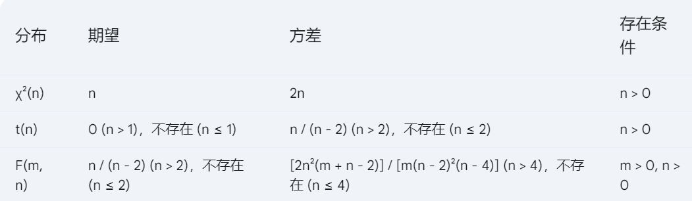

# **数理统计**

## **0.引入**

**概率论:已知随机变量的分布,求对应的性质特征,以及应用**

**数理统计:对数据的统计分析,寻找随机变量服从的分布和数学特征,得到一种规律(经验论)**

**数理统计的步骤:收集带有随机误差的数据->对数据进程处理分析->得出信息->做出统计推断**

## **1.总体与样本**

#### **1.总体**

**总体:具有一定共性的研究对象的集合(可用当作随机变量)**

**个体:总体中的每个元素**

>   **个体的每个数量指标也可以作为一个总体**

**定义:统计学中随机变量X为总体,并把随机变量X的分布称为总体**

**总体的分类:有限总体/无限总体(近似无限总体)**

**总体的分布:具有两重性(关心总体的数量指标,关系个体的数值指标)**

**总体X的分布(随机变量的分布):它的分布函数就称作X的分布**

***

#### **2.样本**

**随机抽样:从X中抽取部分个体,简称抽样**

**样本:所抽取的部分个体的全体称为总体的一个样本(n个个体的数值指标(X1~Xn)称为一个样本)**

**样本容量:样本所含个体的数目**

**样本的二重性:做实验前是一个随机向量,做实验后是一组观测值**

**抽样方式:不重复抽样和重复抽样(对无限总体效果都一样的)**

**简单随机样本:进行重复抽样所得的 满足以下性质的 随机样本**

>   **代表性:每个样本中的个体 和 样本向量 具有相同的分布**
>
>   **独立性:每个样本的个体 相互独立**

**小样本和大样本:n->无穷,为大样本,n有限,为小样本**

**样本的数字变化:全部的均值和方差/部分的均值和方差表示方法不同**

***

#### **3.样本的分布**

##### **定义**

**总体X的容量为n的样本是n维随机变量,其中的样本相互独立且与总体X同分布,则称样本个体的联合分布 为样本的分布**

**即$F(x_1,x_2,\cdots,x_n) = F(x_1)F(x_2)\cdots F(x_n) = \prod^{n}_{i=1} F(x_i)$**

##### **对于连续型总体X**

>   (其中密度函数为f(x))
>
>   **则密度函数:$f(x_1,x_2,\cdots ,x_n) = f(x_1)f(x_2)\cdots f(x_n) = \prod^{n}_{i=1}f(x_i)$**

##### **对于离散型总体X**

>   (其中概率函数为P(X=x)=P(x))
>
>   **则概率函数$P(X_1=x_1,X_2=x_2,\cdots,X_n=x_n) = P(x_1)P(x_2)\cdots P(x_n) = \prod^{n}_{i=1}P(x_i)$**

##### **对于样本的密度函数**

###### **1.指数分布**

>   $$f(x) =
>   \begin{cases}
>   \lambda e^{-\lambda x},& x>0 \\
>   0,&  Oth 
>   \end{cases}$$
>
>   $$f(x_1,x_2,\cdots ,x_n) =
>   \begin{cases}
>   \prod^{n}_{i=1} = \lambda^n e^{-\lambda \sum^{n}_{i=1}x},& x_i>0,i=1,2,\cdots n \\
>   0,&  Oth 
>   \end{cases}$$

###### **2.0-1分布**

>   $$P \{X = x\} = p^x(1-p)^{1-x},(x=0,1)$$
>
>   $$P\{X_1 = x_1 , X_2 = x_2,\cdots,X_n =x_n\} = P\{X_1 = x_1\}P\{X_2 = x_2\}\cdots P\{X_n = x_n\}$$
>
>   $\Leftrightarrow \prod^{n}_{i=1}[p^{x_i}(1-p)^{1-x_i}] = p^{\sum^{n}_{i=1}x_i}(1-p)^{n-\sum^{n}_{i=1}x_i}$

###### **3.正态分布**

>   **X~N$$(\mu,\sigma^2)$$**
>
>   **X~$\phi(x) = \frac{1}{\sqrt{2\pi}\sigma}exp\{-\frac{(x_i-\mu)^2}{2 \sigma^2}\}$**
>
>   **$(x_1,x_2,\cdots ,x_n)$~$\phi(x_1,x_2,\cdots ,x_n) = \prod^{n}_{i=1}\phi(x_i)$**
>
>   $\Leftrightarrow = \prod^{n}_{i=1}\frac{1}{\sqrt{2\pi}\sigma}exp\{-\frac{(x_i - \mu)^2}{2 \sigma^2}\}$
>
>   $\Leftrightarrow (\frac{1}{\sqrt{2\pi}\sigma})^n exp\{-\frac{1}{2\sigma^2}\sum^{n}_{i=1}(x_i-\mu)^2\}$

###### **4.泊松分布**

>   **$P\{X = x\} = \frac{\lambda^x}{x!}e^{-\lambda},x = 0,1,2,\cdots$**
>
>   $$P\{X_1 = x_1 , X_2 = x_2,\cdots,X_n =x_n\} = P\{X_1 = x_1\}P\{X_2 = x_2\}\cdots P\{X_n = x_n\}$$
>
>   $\prod^{n}_{i=1}[\frac{\lambda^{x_i}}{x_i !}e^{-\lambda}] = \frac{\lambda^{\sum^{n}_{i=1}}}{x_1 ! x_2 ! \cdots x_n !}e^{-n\lambda}$(其中样本为非负整数)

## **2.统计量**

#### **0.定义**

**设$(X_1,X_2,\cdots,X_n)$是X的样本,$g(x_1,x_2,\cdots,x_n)$是已知的n元实值函数,其中不包含任何参数**

**统计量:完全由样本决定的量$T = g(X_1,X_2,\cdots,X_n)$(随机变量)**

#### **1.性质**

**1.二重性**

>   **统计量是随机变量,把样本观测值代入统计量,又是一个观测值**

**2.作用**

>   **统计量是样本"数学加工后"的浓缩,从而可用进行统计推断**

**3.二义性**

>   **用于统计时称作"统计量",用于检验时称作"检验统计量"**

**4.统计量是样本的已知函数,不包含任何未知参数**

#### **2.常用统计量(需要记住)**

**1.样本均值**

$$\overline{X} = \frac{1}{n}\sum^{n}_{1}X_i$$**(反映了总体均值信息)**

**2.样本方差**

$(S_0)^2 = \frac{1}{n}\sum^{n}_{i=1}(X_i - \overline{X})^2$

**3.样本方差(修正后的)**

$$S^2 = \frac{1}{n-1}\sum^{n}_{i=1}(X_i - \overline{X})^2$$**(反映了总体方差的信息)**

**4.样本标准差**

$$S = \sqrt{S^2} = \sqrt{\frac{1}{n-1} \sum^{n}_{i=1}(X_i - \overline{X})^2}$$**(这里用的修正后的)**

**5.样本k阶原点矩**

$$A_k = \frac{1}{k}\sum^{n}_{i=1}X_i^k$$**(反映了总体k阶矩的信息)**

**6.样本k阶中心矩**

$$B_k = \frac{1}{n}\sum^{n}_{i=1}(X_i - \overline{X})^k$$**(反映了总体k阶中心矩的信息)**

**7.两个样本之间的协方差(相关矩)**

$$S_{12} = \frac{1}{n}\sum^{n}_{i=1}(X_i - \overline{X})(Y_i - \overline{Y}),(\quad \overline{X} = \frac{1}{n}\sum^{n}_{i=1}X_i,\quad \overline{Y} = \frac{1}{n}\sum^{n}_{i=1}Y_i)$$

**8.两个样本之间的相关系数**

$$R = \frac{S_{12}}{S_1 S_2}(S_1^2 = \frac{1}{n}\sum^{n}_{i=1}(X_i - \overline{X})^2 , S_2^2 = \frac{1}{n}\sum^{n}_{i=1}(Y_i - \overline{Y})^2)$$

#### **3.统计量相关例题**

**1.取某型号火箭8枚进行射程试验，测得数据如下（单位：km）**54，52，49，57，43，47，50，51,求均值和方差

>   **(1) $\overline{x} = \frac{1}{8}\sum^{n}_{x=1}=50.375 $**
>
>   **(2)$s^2 = \frac{1}{8-1}\sum^{8}_{i=1}(x_i-50.375)^2 = 18.27  $**

**2.泊松分布,求$E\overline{X},D\overline{X} $**

>**(0)$\quad EX = \lambda,DX = \lambda $**
>
>**(1)$\quad E\overline{X} =E(\frac{1}{n}\sum^{n}_{i=1}X_i)=\frac{1}{n}\sum^{n}_{i=1}EX_i = \frac{1}{n}n\lambda = \lambda $**
>
>**(2)$\quad D\overline{X} = \frac{1}{n^2}\sum^{n}_{i=1}DX_i =DX_i = \frac{1}{n^2}n\lambda = \frac{\lambda}{n} $**

#### **4.样本均值和样本方差的性质**

**设总体X的均值$EX=\mu$,方差$DX=\sigma^2$,样本全部来自总体X,则**

>   **$E\overline{X} = \mu =EX $**
>
>   **$D\overline{X} = \frac{1}{n}\sigma^2=\frac{1}{n}DX $**
>
>   **$ES^2 = \sigma^2=DX $**

**需要注意的是修正后的样本方差**

>   $S^2 = \frac{n}{n-1}S_0^2 \Rightarrow S_0^2 = \frac{n-1}{n}S^2 $
>
>   $ES_0^2 = \frac{n-1}{n}ES^2 = \frac{n-1}{n}\sigma^2 \not= (\sigma^2 = DX) $

#### **5.样本均值和样本方差相关例题**

**1.X~N(21,25),$X_1,X_2,\cdots,X_{25}$为X的一个样本,则$D\overline{X}  $**

>   **$\because D\overline{X} = \frac{1}{n}DX,\quad (n=25,DX=25) $**
>
>   $\therefore D\overline{X} = \frac{1}{n}DX = \frac{25}{25} =1 $

**2.X~B(n,p),$(X_1,X_2,\cdots,X_{20} )$是一个样本,$E\overline{X} $?**

>   **$E\overline{X} =\sum^n \frac{1}{n} EX =np $**

**(2019-2020sj)3.设总体X服从正态分布，EX=-1,$EX^2 =2,X_1,X_2,\cdots,X_n$ 是来自总体X的样本,则$\overline{X}=\frac{1}{n}\sum^{n}_{i=1}X_i$~__分布**

>   **首先$\overline{X} $和X一样也服从正态分布**
>
>   $\because E\overline{X}=EX=-1,D\overline{X}=\sum^n \frac{1}{n}DX = DX $
>
>   $\therefore D\overline{X} = \sum^n(\frac{1}{n})^2DX =\frac{1}{n}  $
>
>   **所以服从$\overline{X}=\frac{1}{n}\sum^{n}_{i=1}X_i ~ N(-1,\frac{1}{n}) $分布**

**(2021-2022sj)存在参数,秒选**

**(2021-2022sj)样本量计算方差**

## **3.抽样分布**

#### **1.正态分布(关注样本均值时)**

##### **定义**

**若$X_1,X_2,\cdots,X_n $相互独立,$i=1,2,3.\cdots,n $则有$\sum^{n}_{i=1}a_iX_i$~$N(\sum^{n}_{i=1}a_i\mu_i,\sum^{n}_{i=1}a_i^2\sigma^2 ) $**

>   **特别的,如果$a_i = \frac{1}{n} $,也是统计量的正态分布**

**统计量正态分布的定义:**

>   **若总体X~N$(\mu,\sigma^2 ),X_1,X_2,\cdots,X_n $是来自总体X的样本,则有**
>
>   $\overline{X} = \frac{1}{n}\sum^{n}_{i=1}X_i$~$N(\mu, \frac{\sigma^2}{n})$ =$\frac{\overline{X}-\mu}{\frac{\sigma}{\sqrt{n}}}$= $\frac{\overline{X}-\mu}{\sigma}\sqrt{n}$~$N(0,1)$**(标准化)**
>
>   **(样本化以后,方差除以n,所以$\sigma \rightarrow \frac{\sigma}{\sqrt{n}}$ )**

##### **例题**

**从正态总体中抽容量为16样本，设样本均值与总体均值之差的绝对值在4以上的概率为0.02,求总体的标准差DX。**

>   **设总体X~N$(\mu,\sigma^2 )$,则样本的均值X~N$(\mu,\frac{\sigma^2}{n} )=N(\mu,\frac{\sigma^2}{16})$**
>
>   **由题意可知,$P(|\overline{X}-\mu|>4)=0.02 $,开始求$\sigma$,(易知样本量也符合正态分布)**
>
>   $\Leftrightarrow P(|\overline{X}-\mu| \leq 4)= 1- 0.02 = 0.98  $
>
>   标准差公式$\sigma = \frac{\sigma}{\sqrt{n}} $
>
>   $\therefore p(|\frac{\overline{X}-\mu}{\frac{\sigma}{\sqrt{16}}}| \leq \frac{4}{\frac{\sigma}{\sqrt{16}}}) = 0.98 $**(正态分布的标准化:减均值除以标准差)**
>
>   $\Leftrightarrow p(-\frac{\overline{X}-\mu}{\frac{\sigma}{\sqrt{16}}} \leq \frac{4}{\frac{\sigma}{\sqrt{16}}}\leq \frac{\overline{X}-\mu}{\frac{\sigma}{\sqrt{16}}} ) = 2\Phi_0(\frac{4}{\frac{\sigma}{\sqrt{16}}})-1=0.98  $ 
>
>   $\therefore \Phi_0(\frac{4}{\frac{\sigma}{\sqrt{16}}}) = 0.99 \quad \therefore \frac{4}{\frac{\sigma}{\sqrt{16}}} \approx 2.33 \quad \therefore \sigma=\frac{16}{2.33}\approx 6.87 $
>

>   ****
>
>   **进一步的解释**
>
>   
>
>   
>
>   
>
>   
>
>   **回顾$\Phi_0 $的相关计算公式:**
>
>   
>
>   ***

**2.调节一个装瓶机使其对每个瓶子的罐装量均值为 μ盎司，通过观察,这台装瓶机对每个瓶子的罐装量服从标准差σ=1.0盎司的正态分布。随机抽取由这台机器罐装的9个 瓶子形成一个样本，并测定每个瓶子的罐装量，试确定 "样本均值 偏离总体均值 不超过0.3盎司"的概率。**

>   **根据题目可知,装瓶器对罐子服从正态分布X~N$(\mu,(1.0)^2) $**
>
>   $\therefore \overline{X} $~$N(\mu,\frac{(1.0)^2}{n}) = N(\mu,\frac{1}{9}) $
>
>   $\therefore$**样本均值的分布为** $\frac{\overline{X}-mu}{\sqrt{\frac{1}{9}}} $~$N(0,1)$
>
>   **求$P\{|\overline{X}-\mu|\leq 0.3\} = P\{|\frac{\overline{X}-\mu}{\sqrt{\frac{1}{9}}}| \leq \frac{0.3}{\sqrt{\frac{1}{9}}}\} = P\{|\frac{\overline{X}-\mu}{\frac{1}{9}}| \leq 0.9\} $**
>
>   **$\therefore P\{-0.9 \leq \frac{\overline{X}-\mu}{\frac{1}{9}}\leq 0.9\} $**
>
>   $\therefore 2{\Phi_0}(0.9)-1 = 2*0.8159-1=0.6318$
>
>   **心得:首先知道基本分布,然后得到样本值的标准正态分布,根据要求的内容化为最简形式,查表**

## **重要性质:自由度的运用**

#### **2.$\lambda^2 $分布(关注样本方差或平方和)**

**(标准正态平方和)**

##### **定义**

**若X的密度函数为以下内容,则称X服从自由度为n的$\lambda^2$分布**

>   $\tau(t) = \int^{+\infty}_{0}x^{t-1}e^{-x}dx $
>
>   $$f(x) =
>   \begin{cases}
>   \frac{1}{2^{\frac{n}{1}}\tau(\frac{n}{2})}e^{-\frac{x}{2}}x^{\frac{n}{2}-1},& x>0 \\
>   0,&  x\leq 0
>   \end{cases}$$
>
>   **判断式:$X_1^2+X_2^2+\cdots + X_n^n ,每个X_i服从标准正态分布(0,1)$**

 **若 Z₁, Z₂, ..., Zₙ 是 n 个相互独立的、服从标准正态分布 N(0, 1) 的随机变量，则它们的平方和服从自由度为 n 的卡方分布，记作 χ²(n)。**

##### **概率密度曲线图**

>   **学校只要求会画出曲线**
>
>   **$\lambda^2(1)$的密度函数在x=0,趋于无穷大,y作为渐进线**
>
>   **$\lambda^2(2)$是$\lambda = \frac{1}{2} $的指数分布**

##### **性质**

**1.($\lambda^2$分布的经典模式)如果随机变量样本相互独立,且同服从正态分布,它们的平方和**

>   **$\lambda^2 = X_1^2 + X_2^2 + \cdots + X_n^2                                                                                                                                                                                                                                                                                                                                                                                                                                                                                                                                                                                                                                                                  $**
>
>   **自由度:表示独立(自由取值)的随机变量的个数**
>
>   **利用该定理可用构造服从$\lambda^2$的随机变量,或者判断是否服从 **
>

**推论:**

**1.若$X_1,X_2,\cdots,X_n$相互独立,同服从于正态分布$N(\mu_1,\sigma^2) $则$\sum^{n}_{i=1}(\frac{(X_i - \mu_i)^2}{\sigma_i}) $~$\lambda^2(n) $**

**2.若随机变量X~N(0,1),则$X^2$ ~ $\lambda^2(1) $**

**2.若X~$\lambda^2(n) $,则X的期望和方差为:EX=n,DX=2n(其中n是自由度)**

**3.若X~$\lambda^2(n) $,则当n充分大时,X近似服从N(n,2n)(或者是$\frac{X-n}{\sqrt{n}} $近似服从N(0,1))**

**4.若X~$\lambda^2(n) $Y~$\lambda^2(m) $,且XU相互独立,则:$\sum^{n}_{i=1}X_i$~$\lambda^2(\sum^{n}_{i=1}n_i) $**

##### **$\lambda^2 $分布的上a分位数**

**定义**

**对于给定的a(0<a<1),称满足条件:$P\{\lambda^2 > \lambda_a^2(n)\}= a$**(取决于a和自由度n)

>   **if$\lambda^2_{0.95} (10)=2.94 $,即$P\{\lambda^2(10)>3.94\}=0.95 $**

##### **例题**

**1.(2020-2021sj)**

>   **解释:XY服从正态分布(X,Y)的联合分布不一定服从二维正态分布**
>
>   **$\rho_{XY}=0$,X与Y不一定相互独立(少了XY相互独立和服从标准正态分布的条件) **

***

**2.(2020-2021sj)**

**若随机变量$X_1,X_2,\cdots,X_n $都服从标准正态分布,则$\sum^{n}_{i=1}X_i^2 $~$\lambda^2(n) $**

>   **错!!少了相对独立的条件**

***

3.**(分位数)**

**已知随机变量X**~$\lambda^2 (10) $,**求满足P{X>a}=0.025,求P{X<b}=0.05的a和b**

>   **P{X>a}=0.025,$\therefore a = \lambda^2_{0.025}(10)=20.5 $**
>
>   **P{X<b}=0.05,$\therefore b= \lambda^2_{0.95}(10)=3.94 $**

>   ****

**4.设$X_1,X_2,\cdots,X_6 $为来自总体N(0,$2^2$)的样本,求$P\{\sum^{6}_{i=1}X_i^2 > 6.54\} $**

>   **转换为统计量的正态分布:$\frac{X_i-0}{2} $~N(0,1),$i=1,2,\cdots,6 $,且相互独立**
>
>   Xᵢ~N(0,2²)，所以(Xᵢ-0)/2=Xᵢ/2~N(0,1)。
>
>   因此，(Xᵢ/2)² ~ χ²(1)。
>
>   $\because \sum^{6}_{i=1}(\frac{(X_i-0)^2}{2}) = \sum^{6}_{i=1}\frac{X_i^4}{4} $~$\lambda^2(6) $
>
>   $\therefore P\{\sum^6_{i=1}X_i^2 > 6.54 \}= P\{\sum^{6}_{i=1}\frac{X_i^2}{4}>\frac{6.54}{4}   \} = P\{\lambda^2 (6)>\frac{6.54}{4} = 1.635  \} $
>
>   (化为标准形式->套入卡方分布)
>
>   **查附表a=0.95**

****

**5.设总体X~N(0,$\sigma^2$),从总体取出容量为6的样本,令$Y = (X_1+X_2+X_3)^2 + (X_4+X_5+X_6)^2 $确定常数c,使得cY服从$\lambda^2 $分布**

>   **快速解法:两个n=3,所以它们方差都是$3\sigma^2 $,标准化后方差则是$\frac{1}{3\sigma^2} $**
>
>   **对于每组$X_1+X_2+X_3 $,它们的方差都是$3\sigma^2 $(可加性),标准差都是$\sqrt{3}\sigma $**
>
>   **标准化:$\frac{X_1+X_2+X_3}{\sqrt{3}\sigma} $~N(0,1) $\quad \frac{X_4+X_5+X_6}{\sqrt{3}\sigma} $~N(0,1)**
>
>   **计算卡方分布:$(\frac{X_1+X_2+X_3}{\sqrt{3}\sigma})^2 $~$\lambda^2(0,1)$ $\quad (\frac{X_4+X_5+X_6}{\sqrt{3}\sigma})^2 $~$\lambda^2(0,1)$**
>
>   **$\therefore$根据可加性,得到$\frac{1}{3\sigma^2}Y = \lambda^2(2) $**
>
>   c = 1/(3σ²)
>
>   ****
>
>   **进一步的,E(cY)= 对应卡方分布的2,EY=$\frac{2}{c} $**

****

**设样本$X_1,X_2,\cdots,X_6 $来自总体N(0,1),$Y=C(X_1 + X_2 + X_3)^2+C(X_4 + X_5 + X_6)^2 $确定常数C使Y服从卡方分布**

>   **首先要服从卡方分布,即Y要服从标准正态分布**
>
>   但$(X_1 + X_2 + X_3) $~N(0,3),(单个服从标准,组不符合标准)因此需要对整体除以$ \sqrt{3} $使得符合标准正态分布
>
>   $\therefore \frac{X_1+X_2+X_3}{\sqrt{3}} $~N(0,1)
>
>   **对原式:I=$C (\sqrt{3})^2 (\frac{X_1+X_2+X_3}{\sqrt{3}})^2 =1 \quad C = \frac{1}{3}$**
>
>   **原式就有两个卡方项,服从$\lambda^2(2) $**

***

**根据56两题可以知道,根据单项符合的正态分布+自由度->决定卡方分布,所以在确定自由度的情况下,可以直接得到C=1/自由度 * 对应的 sigma^2**

>   **注意,尽量不要秒,比如第一问,单个sigma为抽象值**

****

#### **3.t分布(关注样本均值,但没有方差)**

**(标准正态分布除以n个平方和[卡方])其中n就是自由度**

##### **定义**

**若随机变量的密度函数满足以下式子,则称X服从自由度是n的t分布X~t(n)**

>   $f(x) =\frac{\tau(\frac{n+1}{2})}{\sqrt{n\pi}\tau(\frac{n}{2})}(1+\frac{x^2}{n})^{-\frac{n+1}{2}},-\infty<x<+\infty $
>
>   **判断式:$x = \frac{X_1}{\frac{X_2}{n}},X_1->N(0,1),X_2->\lambda^2(n) $**

 **若 X ~ N(0, 1)，Y ~ χ²(n)，且 X 和 Y 相互独立，则 t = X / √(Y/n) 服从自由度为 n 的 t 分布，记作 t(n)。**

##### **概率密度曲线图**

>   **注意:如果卡方的次数越大,越接近标准正态分布 **

##### **性质**

**若X~N(0,1), Y~$\lambda^2(n)$,X和Y独立,则随机变量服从自由度为n的t分布**

>   **$T= \frac{X}{\sqrt{\frac{Y}{n}}} = \frac{x}{\sqrt{Y}}\sqrt{n} $**

##### **t分布的a分位点**

**对于给定的a(0<a<1),则满足条件$P\{t>t_a(n) \}=a $的点称为t分布的**

**上a分位数,或a水平的上侧分位数**

##### **例题**

**1.若X~N($\mu,\sigma^2 $),$\frac{Y}{\sigma^2}$~$\lambda^2(n) $,且X与Y相互独立,则T = $\frac{X-\mu}{\sqrt{Y}}\sqrt{n}$~t(n)**

>   **证明:$\frac{X-\mu}{\sigma}$~N(0,1),且与Y相互独立**
>
>   $\therefore T= \frac{\frac{X-\mu}{\sigma}}{\sqrt{\frac{\frac{Y}{\sigma^2}}{n}}} = \frac{X-\mu}{\sqrt{Y}}\sqrt{n}$~$t(n)$

**2.设$X_1,X_2,X_3,X_4 $是来自于正态总体N(0,1)的一个样本,**

**则统计量$\frac{X_1-X_2}{\sqrt{X_3^2 + X^2_4}} $服从什么分布?自由度为?**

>   **直接看的,t分布,分母2个平方,自由度为2**

**3.设样本$X_1,X_2,\cdots,X_5 $来自总体N(0,1),$Y=\frac{C(X_1+X_2)}{(X_3)^2 + (X_4)^2 + (X_5)^2}^{\frac{1}{2}} $,试确定常数C使Y服从t分布**

>   **根据判断式:t分布 $\frac{N(0,1)}{\frac{\lambda^2(n)}{n}} $**
>
>   **对于原式I:**
>
>   >   **分子:不是标准正态分布L->$ C \sqrt{2}\frac{(X_1+X_2)}{\sqrt{2}} $**
>   >
>   >   **分母:是卡方3,需要除以3->$\sqrt{3} \sqrt{\frac{(X_3^2+X_4^2+X_5^2)}{3}} $**
>   >
>   >   $\therefore \frac{C\sqrt{2}}{\sqrt{3}}=1 ,C=\sqrt{\frac{3}{2}} $

**4.分位点**

#### **4.F分布(两个样本方差的比值)**

**(卡方分布除以卡方分布,几卡就除以几)**

>   **判断式:$X = \frac{\frac{X_1}{n_1}}{\frac{X_2}{n_2}},X_1->\lambda^2(n_1),X_2 -> \lambda^2(n_2) $**
>
>   

**若 X ~ χ²(m)，Y ~ χ²(n)，且 X 和 Y 相互独立，则 F = (X/m) / (Y/n) 服从自由度为 (m, n) 的 F 分布，记作 F(m, n)。**

##### **概率密度曲线图**

>   **n1不变,n2增大,越立**

##### **性质**

**1.若X~$\lambda^2(n_1)$, Y~$\lambda^2(n_2)$,XY独立,则$F=\frac{\frac{X}{n_1}}{\frac{Y}{n_2}} $服从自由度为(n1,n2)的F分布F~F($n_1,n_2 $) **

**2.$F_{1-a}(m,n) = \frac{1}{F_a(m,n)},F_a(n,m) = \frac{1}{F_{1-a}(m,n)} $**

>   **比如:$F_{0.95}(m,n) = \frac{1}{F_{0.05}(n,m)} $**

##### **F分布的a分位点**

**定义:对于给定的a(0<a<1),随机变量F~F(m,n),称满足条件:$P\{F > F_a(m,n)\}=a $**

>   
>
>   $F_{0.05}(15.8)=3.22 \therefore P\{F(15.8)>3,22\}=0.05$

##### **例题**

**1.设$(X_1,X_2,\cdots,X_6)$为来自总体X~N($0,\sigma^2$)的样本,则$\frac{2(X_1^2 + X_2^2)}{X^2_3+X^2_4+X^2_5+X^2_6} $~?**

>   **解:根据F定义式,上下分别两个卡方,一个2,一个4**

**(很常考的)**

**2.(2021-2022sj)**

**3.(2020-2021sg)**

>   **原因:两个加起来,符合(0,2)的正态**

**4.设F~F(10,15),求$\lambda_1,\lambda_2 $,使得$P\{F>\lambda_1\}=0.01,P\{F<\lambda_2 \}=0.01 $**

>   $\lambda_1 = F_{0.01}(10.15) = 3.80 $(直接查表)
>
>   $\because P\{F < \lambda_2\} = 0.01,\therefore P\{\frac{1}{F}>\frac{1}{\lambda_2}\} = 0.01 $(F分布表都是右侧,所以要先倒式查右侧)
>
>   又$\frac{1}{F}->F(15,10),\therefore\frac{1}{\lambda_2} = F_{0.01}(15,10)=4.56.\lambda_2 = \frac{1}{4.56}=0.293 $

#### **5.*正态总体下抽样分布**

##### **单样本抽样分布**

**假设样本$(X_1,X_2,\cdots,X_n)来自正态总体X~N(\mu,\sigma^2) $,最常用的是均值和方差**

**定理1:设总体X~N($\mu,\sigma^2 $),$X_1,X_2,\cdots,X_n $是来自X的样本**

>   **$\overline{X}=\frac{\sum^{n}_{i=1}X_i}{n}$~$N(\mu,\frac{\sigma^2}{n}) $正态分布**
>
>   **两个标准化样本/全体的方差:6.6 6.7**
>
>   **$(\frac{(n-1)S^2}{\sigma^2}) = \frac{\sum^{n}_{i=1}(X_i-\overline{X_i})^2}{\sigma^2} $~$\lambda^2(n-1) $(样本之间并不独立,存在约束条件,自由度-1) **
>
>   (使用了样本均值 X̄ 来估计总体均值 μ,多了约束条件$\sum^n(X_i-\overline{X})=0 $)
>
>   $ (\frac{n\overline{X}}{\sigma^2})= \frac{\sum^{n}_{i=1}(X_i-\mu)^2}{\sigma^2}= \sum^{n}_{i=1}(\frac{(X_i - \mu)}{\sigma})^2 $~$\lambda^2(n)$**(全体之间相互独立,卡方分布)**
>
>   **($\frac{(n-1)S^2}{\sigma^2}和\frac{n\overline{X}}{\sigma^2}$是相互独立的,并且两者相除,$\frac{n\overline{X}^2}{S^2}$服从F(1,n-1)的分布)**

>   **所以根据上面两个式子,将其标准化:**$\frac{\overline{X}-\mu}{\frac{\sigma}{\sqrt{n}}} $~$N(0,1)$**标准正态分布**
>
>   **如果没有$\sigma $使用样本方差S来代替,则有$\frac{\overline{X}-\mu}{\frac{S}{\sqrt{n}}} $~t(n-1)t分布**
>
>   **例题1:样本的方差就是总体的方差**

##### **Eg**

**设总体X的均值是$\mu $,方差$\sigma^2 $存在,($X_1,X_2,\cdots,X_n$)是样本,$\overline{X},S^2$为样本的方差**

**求E($S^2$);若X~N($\mu,\sigma $),求D($S^2 $)**

>   **解:$\sum^{n}_{i=1}(X_i-\overline{X})^2 = \sum^{n}_{i=1}X_i^2 - 2X\overline{X} + n\overline{X}^2 = \sum^{n}_{i=1}X_i^2 - 2\overline{X}n\overline{X} + n\overline{X}^2 $**
>
>   $\Leftrightarrow  \sum^{n}_{i=1}X_i^2 - 2n\overline{X}^2 + n\overline{X}^2$
>
>   $\Leftrightarrow \sum^{n}_{i=1}X^2_i - n\overline{X}^2 $
>
>   $E(S^2) = E[\frac{1}{n-1}\sum^{n}_{i=1}(X_i-\overline{X})^2] $
>
>   $代入1式 \therefore E[\frac{1}{n-1}(\sum^{n}_{i=1}X_i^2-n\overline{X}^2)]$
>
>   $\Leftrightarrow \frac{1}{n-1}[\sum^{n}_{i=1}(\sigma^2 + \mu^2)- n(\frac{\sigma^2}{n}+\mu^2)]=\sigma^2 $

>   $\because 服从相关分布 \therefore \frac{(n-1)S^2}{\sigma^2}$~$\sigma^2(n-1)$
>
>   $\Rightarrow D[\frac{(n-1)S^2}{\sigma^2}]=2(n-1)(卡方分布的性质)$
>
>   **$D(S^2) = \frac{2\sigma^4}{n-1} $(总体求局部样本)**

**2.(2020-2021sj)**

**设总体X~N(0,$\sigma^2 $),($X_1,X_2,\cdots,X_n $)是一个样本,则$\frac{n\overline{X}^2}{S^2} $~?**

>   **解:已知局部方差,分子分母都是平方,可以排除t分布,基本两个卡方分布组成的F分布**
>
>   $\frac{n\overline{X}}{\sigma^2}服从卡方(1),\frac{(n-1)S^2}{\sigma^2}服从卡方(n-1)\therefore 服从F(n-1)分布 $
>
>   使用n-1的原因是使这个统计量服从自由度为 (n-1) 的卡方分布。而要构建 F 分布，我们需要两个**独立的**卡方分布变量。

**3.设总体X~N(0,$\sigma^2 $),从中取出一个容量为10的样本,求**

>   **1.$P\{\frac{\sigma^2}{4}\leq \frac{1}{10}\sum^{10}_{i=1}(X_i-\mu)^2 \leq 2.3\sigma^2  \} $**
>
>   **2.$P\{\frac{\sigma^2}{4}\leq \frac{1}{10} \sum^{10}_{i=1}(X_i - \overline{X})^2 \leq 2.3\sigma^2\} $**
>
>   ***
>
>   (1)解:$\sum^{n}_{i=1}(\frac{X_i-\mu}{\sigma})^2 = \frac{1}{\sigma^2}\sum^{n}_{i=1}(X_i-\mu)^2 $~$\lambda^2(n) $
>
>   将n=10代入:$\sum^{10}_{i=1}(\frac{X_i-\mu}{\sigma})^2 = \frac{1}{\sigma^2}\sum^{10}_{i=1}(X_i-\mu)^2 $~$\lambda^2(10) $
>
>   $\therefore P\{\frac{\sigma^2}{4}\leq \frac{1}{10}\sum^{10}_{i=1}(X_i-\mu)^2\leq 2.3 \sigma^2 \} = P\{\frac{10}{4}\leq \frac{1}{\sigma^2}\sum^{10}_{i=1}(X_i-\mu)^2 \leq 23\}$
>
>   (**凑出关键式,然后卡方分布查表**)
>
>   $\therefore P\{2.5\leq \lambda^2(10)\leq 23\} = P\{\lambda^2(10)>2.5\}-P\{\lambda^2(10)>23\}  = 0.99-0.01 =0.98$
>
>   ***
>
>   (2)解:$P\{\frac{\sigma^2}{4} \leq \frac{1}{10}\sum^{10}_{i=1}(X_i-\overline{X})^2 \leq 2.3\sigma^2 \} = P\{\frac{10}{4}\leq\frac{1}{\sigma^2}\sum^{n}_{i=1}(X_i-\overline{X})^2\leq 23 \} $
>
>   =$P\{2.5\leq \lambda^2(9) \leq 23 \} = P\{\lambda^2(9)> 2.5 \}-P\{\lambda^2(9)>23 \} = 0.98-0.005=0.975$

**4.必做!!**

****

****

****

##### **双样本抽样分布**

**4.设样本**

**($X_1,X_2,\cdots,X_m $)来自正态总体X~N($\mu_1,\sigma_1^2 $),**

**($Y_1,Y_2,\cdots,Y_n$)来自正态总体Y~N($\mu_2,\sigma_2^2 $),**

**XY独立**,则

>   $\overline{X} = \frac{1}{m}\sum^{m}_{i=1} X_i$
>
>   $\overline{Y} = \frac{1}{n}\sum^{n}_{i=1} Y_i$
>
>   $S_1^2 = \frac{1}{m-1}\sum^{m}_{i=1}(X_i-\overline{X})^2 $
>
>   $S_2^2 = \frac{1}{n-1}\sum^{n}_{i=1}(Y_i-\overline{Y})^2 $
>
>   $S_w^2 = \frac{1}{m+n-2}[(m-1)S_1^2 + (n-1)S_2^2]=\frac{1}{m+n-2}[\sum^{m}_{i=1}(X_i-\overline{X})^2+\sum^{n}_{i=1}(Y_i-\overline{Y})^2]$
>
>   (1)$U = \frac{(\overline{X}-\overline{Y}) - (\mu_1-\mu_2)}{\sqrt{\frac{\sigma_1^2}{m} + \frac{\sigma_2^2}{n}}}$(标准正态分布)
>
>   (2)$F = \frac{\frac{S^2_1}{\sigma^2_1}}{\frac{S^2_2}{\sigma^2_2}} = \frac{S^2_1}{S^2_2}\times\frac{\sigma^2_2}{\sigma^2_1} $F分布(m-1,n-1)
>
>   (3)当$\sigma^2_1 = \sigma^2_2 = \sigma^2,T = \frac{(\overline{X}-\overline{Y}) - (\mu_1-\mu_2)}{S_w \sqrt{\frac{\sigma_1^2}{m} + \frac{\sigma_2^2}{n}}} $(服从t(m+n-2)的分布)

## **4.经验分布函数**