# **2.命题逻辑等值运算**

**学校里面没讲消解:只讲了主析取范式(合取范式)以及它的运用**

>   **消解认为会了所以不讲不考(人工智能导论)**


***
## **1.等值式**

***
#### **1.定义**

**如果等价式$A\leftrightarrow{B}$是重言式(为真),则AB等值,记作$A \Leftrightarrow{B}$**

>**注意是等值,不是等价(只是真假可以替换)**
>
>**注意符号不同:$A \Leftrightarrow{B}$,并且$\Leftrightarrow$不是联结词**
>
>**注意可能存在哑元:哑元的真值不影响命题的真值(出现在抵消/永真式)**
***
#### **2.基本等值式**

**<font color=red>(开关法+电路法)$\vee$表示并联,$\wedge$表示串联 </font>**

###### **1.双元等值式**

>**双重否定表肯定:$ \neg\neg{A} \Leftrightarrow{A}$**
>
>**幂等律(同元律):$ A\vee A \Leftrightarrow{A} , A \wedge A \Leftrightarrow {A}$**
>
>**交换律(同逻辑前后交换律):$ A \vee B \Leftrightarrow{B}\vee{A} ,A \wedge B \Leftrightarrow{B}\wedge{A} $**
>
>**结合律(同逻辑前后交换律):$ (A \vee B)\vee{C} \leftrightarrow A \vee(B \vee C) \quad (\wedge{一样})$**
>
>**\*分配律(内外逻辑交换律):$ A\vee(B \wedge C) \Leftrightarrow (A \vee {B}) \wedge (B \vee{C})$**
>
>**\*德摩根律(非逻辑分配律):$ \neg(A \vee{B}) \Leftrightarrow \neg{A} \wedge\neg{B}$**
>
>**吸收律(析取哑元):$A \vee(A\wedge{B}) \Leftrightarrow A , A \wedge(A\vee{B}) \Leftrightarrow A$**
>
****
###### **2.单元等值式**

**<font color=red>(开关法)</font>**

>**零律(赋值比较法):$A \vee{1} \Leftrightarrow{1},A \wedge{0} \Leftrightarrow{0}$**
>
>>   (两个开关,和一个永开开关并联,则开;和关开关串联,则关)
>
>**同一律(赋值比较法):$A \vee{0} \Leftrightarrow{A},A \wedge{1} \Leftrightarrow{A}$**
>
>>   (两个开关,和一个永开开关串联/和一个永关开关并联,取决于原开关)
>
>**(析取1)排中律(赋值比较法):$A \vee{\neg{A}} \Leftrightarrow 1$**
>
>>   (两个相反的开关并联,无论如何都为开)
>
>**(合取0)矛盾律(赋值比较法):$A \wedge{\neg{A}} \Leftrightarrow 0$**
>
>>   (两个相反的开关串联,无论如何都为关)

***
###### **3.蕴含等值式**

**<font color=red>(逻辑法,如果A闭合,B必须闭合)</font>**

**注意以下式子中包含条件和结果,不能换位执行**

>**\*蕴含等值式: $A \rightarrow B \Leftrightarrow $ <font color=red>$\neg{A}\vee{B} $</font>**
>
>>   (解释:只与A相关,和B无关[并联],<font color=red>A真B假为假</font>)
>
>**等价等值式:$A \leftrightarrow B \Leftrightarrow (A\rightarrow{B})\wedge(B\rightarrow{A}) \Leftrightarrow $<font color=red>${(\neg{A} \vee{B}) \wedge{(\neg{B} \vee{A}})}$</font>**
>
>>   (解释:A和B同真假时为真)
>
>**\*假言易位:$A \rightarrow B \Leftrightarrow \neg{B} \rightarrow \neg{A}$**
>
>>   (解释:蕴含式,如果B是假的,A肯定是假的,因为只与A相关)
>
>**等价否定等值式:$A \leftrightarrow{B} \Leftrightarrow \neg{A} \leftrightarrow{\neg{N}}$**
>
>**归谬论:$(A \rightarrow B)\wedge(A \rightarrow{\neg{B}}) \Leftrightarrow{\neg{A}}$**
>
>>   (解释:A不能同时存在推导出B和非B,所以不存在A)
>
>****
>

###### **4.等值演算和置换规则**

>**性质:**
>
>**1. 自反性:$A \Leftrightarrow{A}$**
>
>**2. 对称性:$A \Leftrightarrow{B}$,则$B \Leftrightarrow{A}$**
>
>**3. 传递性:$A \Leftrightarrow{B}$,且$B \Leftrightarrow{C}$,则$A \Leftrightarrow{C}$**
>
>**4. 置换规则:公式等价,则对应的命题公式也等价**

***
#### **3.例题**

***
**Eg1:证明$p\rightarrow(q\rightarrow{r}) \Leftrightarrow{(p \wedge{q})} \rightarrow r$**

$解: \quad p\rightarrow(q\rightarrow{r})$

$\Leftrightarrow \neg{p}\vee{(\neg{q}\vee{r})} \quad (蕴含等值式)$

$\Leftrightarrow (\neg{p}\vee \neg{q})\vee{r} \quad (同号前后交换律)$

$\Leftrightarrow \neg{(p\wedge{q})} \vee{r} \quad (德摩根律)$ 

$\Leftrightarrow (p \wedge{q})\rightarrow{r} \quad (蕴含等值式)$

***
**证明不等值的方法:**

>**1. 真值表**
>
>**2. 得到一侧的成真赋值组合带入另一侧**
>
>**3. 等值演算化简后观察(一般都是蕴含/德摩根/分配律)**
>
>$(p \rightarrow{q})\rightarrow \underbrace{\Leftrightarrow} _{(蕴含公式)}\neg(\neg(p)\vee{q})\vee{r} \underbrace{\Leftrightarrow}_{(德摩根律)}(p \wedge{\neg{q}})\vee{r}$

***
**Eg3:判断下面的类型:**

**1.$q \wedge{\neg{(p\rightarrow{q})}}$**

>$\Leftrightarrow q \wedge \neg{(\neg{p}\vee{q})} \quad (蕴含公式)$
>
>$\Leftrightarrow q \wedge(p \wedge \neg{q}) \quad (德摩根律)$
>
>$\Leftrightarrow p \wedge{(q \wedge{\neg{q}})} \quad (同号前后交换)$
>
>$\Leftrightarrow p \wedge{0} \quad (矛盾律)$
>
>$0 \quad (零律)$
>
>$\therefore 是矛盾式$
>
>```
>p -> q -> \not{q} 永远不会通
>```

**2.$(p \rightarrow q)\leftrightarrow{(\neg{q}\rightarrow{\neg{p}})}$<font color=red>一般直接看,而不转化</font>**

>$ \Leftrightarrow (\neg{p}\vee{q})\leftrightarrow (q \vee{\neg{p}}) \quad (蕴含公式)$
>
>$\Leftrightarrow (\neg{p}\vee{q})\leftrightarrow{(\neg{p}\vee{q})} \quad (哑元消除)$
>
>$1 \quad \therefore 重言式$
>
>(这两个本来就是蕴含式的本质)

**3. $((p\wedge{q})\vee{(p\wedge{\neg{q}})\wedge{r}})$<font color=red>(注意开关法:最后和p和r有关)</font>**

>$\Leftrightarrow (p \wedge{(q \vee{\neg{q}})\wedge{r}}) \quad (反向分配律)$
>
>$\Leftrightarrow p \wedge{1} \wedge{r}\quad (排中律)$
>
>$\Leftrightarrow p \wedge{r} \quad(同一律)$
>
>```
>p - q      - 
>            | - r ->
>p - \not{q}-
>
>和q无关,但是也不是永真永假
>```

***
## **2.析取范式和合取范式**

#### **1.定义和分类**

**范式（Normal Form）是指将逻辑表达式以特定形式表示的标准化结构**

>**析取范式（Disjunctive Normal Form, DNF）**
>>**形式:**$(A_1 \wedge B_1 \wedge \cdots)\vee{(A_2 \wedge B_2 \wedge \cdots)} \vee{\cdots}$
>
>**合取范式（Conjunctive Normal Form, CNF）**
>>**形式:**$(A_1 \vee B_1 \vee \cdots)\wedge{(A_2 \vee B_2 \vee \cdots)} \wedge{\cdots}$
>
>**唯一不足:范式不唯一**
>
***
#### **2.概念**

>**文字:命题变项(命题主体)及其否定的总称(Layer 0,不分[析取合取])**
>
>**简单析取式:有限个文字构成的析取式(Layer 1)**
>
>**简单析取式:有限个文字构成的合取式(Layer 1)**
>
>**析取范式:由有限个简单合取式组成的析取式(Layer 2)**
>
>**合取范式:由有限个简单析取式组成的合取式(Layer 2)**
>
>**范式——析取范式与合取范式的总称(Layer 3)**
>
***
#### **3.性质**

###### **1.$P \vee \neg{P}$**

>**1. 一个简单析取式是重言式,当且仅当它同时还含有命题变项和它的否定式**
>
>**2. 一个简单合取式是矛盾式,当且仅当它同时还含有命题变项和它的否定式**

###### **2. $(A_1 \& A_2 \& A_3 \cdots)$**

>**3. 一个析取范式是矛盾式,当且仅当它每个简单合取式都是矛盾式**
>
>**4. 一个合取范式是重言式,当且仅当它的每个简单析取式都是重言式**

###### **3. 范式存在定理**

>**任何命题公式都有与其等值的析取范式和合取范式**

***
#### **4.求范式的步骤**

**(和之前化简命题公式差不多)**

###### **1. 消去A中的蕴含式**

>$$A \rightarrow B \Leftrightarrow \neg{A}\vee{B}$$
>
>$$A \leftrightarrow B \Leftrightarrow (\neg{A}\vee{B})\wedge{(A \vee{\neg{B}})}$$

###### **2. 消去否定联结词或者德摩根律**

>$$\neg{\neg{A}} \Leftrightarrow A$$
>
>$$\neg{(A \vee{B})} \Leftrightarrow \neg{A} \wedge{\neg{B}}$$
>
>$$\neg{(A \wedge{B})} \Leftrightarrow \neg{A} \vee{\neg{B}}$$

###### **3. 使用分配律**

>$$A \vee{(B \wedge{C})} \Leftrightarrow (A\vee{B})\wedge(A \vee{C})$$
>
>$$A \wedge{(B \vee{C})} \Leftrightarrow (A\wedge{B})\vee(A \wedge{C})$$

****
#### **5.例题**

**求下列公式的析取范式和合取范式**

**1.**$(p \rightarrow \neg{q}) \vee{\neg{r}}$

>$$\Leftrightarrow (\neg{p} \vee{\neg{q}}) \vee{\neg{r}} \quad (消去\rightarrow)$$
>
>$$\Leftrightarrow \neg{p} \vee{\neg{p}} \vee{\neg{r}} \quad (结合律)$$
>
>$$\therefore最后结果是三个简单合取组成的析取式,也是一个析取组成的合取式$$

**解释:单独的非命题每个都是算一个合取;任意两个根据结合律做析取也行**

**2.**$(p \rightarrow \neg{q})\rightarrow r$

>$$\Leftrightarrow (\neg{p} \vee{\neg{q}}) \rightarrow r \quad (消去蕴含式)$$
>
>$$\Leftrightarrow \neg{(\neg{p} \vee{\neg{q}})} \vee{r} (消去蕴含式)$$
>
>$$析取范式: \quad (p \wedge{q}) \vee{r}\quad (德摩根律)$$
>
>$$合取范式: \quad (p \vee{r}) \wedge{(q \vee{r})} \quad (分配律))$$

***
#### **6.极小项和极大项**

**<font color=red>(直接考虑成极端串联和并联)</font>**

###### **1.定义**

**极小项:简单"析取"式中**

>**1.若每个命题变项均以文字的形式出现且仅出现一次**
>
>**2. 并且第 i 个文字出现在左起第 i 位上**
>
>**3.只能在特殊序列中为真,不能为永真**
>
>**4.编码中肯定为1,否定为0.然后按照二进制**

**极大项:简单"合取"式中**

>**1.若每个命题变项均以文字的形式出现且仅出现一次**
>
>**2. 并且第 i 个文字出现在左起第 i 位上**
>
>**3.只能在特殊序列中为假,不能为永假**
>
>**4.编码中否定为1,肯定为0**
>
>$Eg:(P \vee{Q}) \ (P \vee{\neg{Q}}) \ (\neg{P}\vee{Q}) \ (\neg{P}\vee{\neg{Q}})$
>
>**p∨¬q∨¬r:0* 2²+1* 2¹+1*2⁰=0+2+1=3**

###### **2.目的**

**极小极大项常用于将逻辑表达式转换为析取范式或合取范式**

**任何逻辑函数都可以表示为真值为1的极小项的析取**

$$\because f(P,Q): (\neg{P}\wedge{Q}) = (P \wedge{\neg{Q}}) = 1$$ 

$$\therefore f(P,Q) = (\neg{P}\wedge{Q}) \vee{(P \wedge{\neg{Q}})}$$

**任何逻辑函数都可以表示为真值为1的极大项的合取**

$$\because f(P,Q): (\neg{P}\vee{Q}) = (P \vee{\neg{Q}}) = 0$$ 

$$\therefore f(P,Q) = (\neg{P}\vee{Q}) \wedge{(P \vee{\neg{Q}})}$$

###### **<font color=red>3.性质</font>**

**1. n个命题中有$2^n$个极小项和$2^n$个极大项**

**2. $2^n$个极小项(极大项)均互不等值**

>   **命名:(这就是为什么两项只有M3没有M4,因为二进制只能出来0-3)**

**3.每个极项当且仅当其赋值与编码相同时,其真值为(T小F大)**

>**极小项:**
>
>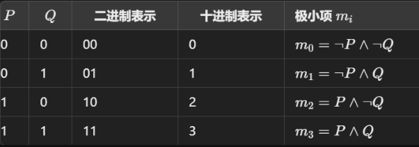
>
>**极大项:**
>
>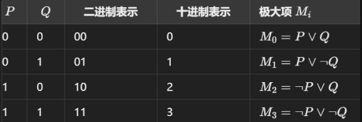
>
>**补充:三位二进制对应的十进制**

|  x₁  |   x₂ |   x₃ | Output |
| :--: | ---: | ---: | -----: |
|  0   |    0 |    0 |      0 |
|  0   |    0 |    1 |      1 |
|  0   |    1 |    0 |      2 |
|  0   |    1 |    1 |      3 |
|  1   |    0 |    0 |      4 |
|  1   |    0 |    1 |      5 |
|  1   |    1 |    0 |      6 |
|  1   |    1 |    1 |      7 |

>>**极小值极大值的关系:$\ \neg{m_i} \Leftrightarrow{M_i} \quad \neg{M_i} \Leftrightarrow{m_i}$**
>
#### **7.主析取范式和主合取范式**

***

###### **1.定义**

**析取范式:"有限个"简单合取式 析取 构成的命题公式**

**合取范式:"有限个"简单析取式 合取 构成的命题公式**


**主范式<font color=red>(存在性和唯一性)</font>**

**主析取范式:由极小项"合取构成"的析取范式**

$(\neg{p} \wedge{\neg{q}} \wedge{r})\vee{(\neg{p}\wedge{q}\wedge{r})} \Leftrightarrow m_1 \vee{m_3}$

**主合取范式:由极大项"析取构成"的合取范式**

$(p\vee{q}\vee{\neg{r}})\wedge{(\neg{p}\vee{\neg{q}}\vee{\neg{r}})} \Leftrightarrow M_1 \vee{M_7}$


**<font color=red>主要区别:主范式中的每个组成项包含所有变元</font>**

**<font color=red>(注意:如果一个式子是永真式,它的主范式是定值1,组成主范式的项都是1)</font>(永假一样)**

***
###### **2.求公式主范式的步骤**

>
>**1. 将命题变项转化为范式,两边分开看**
>
>**2.<font color=red>(缺元补元,保证每个析取项都有所有变量)</font>通过排中律 展开+分配律**
>
>**3. 消去重复的极小(极大项),也就是用极小(极大项)命名代替极小(极大项)**
>
>**4. 将极小(极大)项并入范式\按下标从小到大进行排列**
>
***
###### **3.\*例题**

**1. 求公式$A = (p \rightarrow \neg{q}) \rightarrow r$的主析取范式和主合取范式**

>   **解:**$$\Leftrightarrow \neg{(\neg{p} \vee{\neg{q}})}\vee{r} $$**(蕴含式)**
>
>   $$\Leftrightarrow (p \wedge{q}) \vee{r}$$**(德摩根律)**
>
>   $$\therefore$$ **析取范式:**$$ \neg{(\neg{p} \vee{\neg{q}})}\vee{r} $$
>
>   >   **对于$(p \wedge{q})$(缺元补元)**
>   >
>   >   $$\Leftrightarrow (p \wedge{q}) \wedge{(\neg{r} \vee{r})} \quad (排中律)$$
>   >
>   >   $$\Leftrightarrow (p \wedge{q} \wedge{\neg{r}}) \vee{(p \wedge{q}\wedge{r})}$$
>   >
>   >   $$\Leftrightarrow m_6 \vee{m_7}$$
>   >
>   >   **对于r(缺元补元)**
>   >
>   >   $$\Leftrightarrow (\neg{p}\vee{p})\wedge{(\neg{q}\vee{q})\wedge{r}} \quad (排中律)$$
>   >
>   >   $$\Leftrightarrow (\neg{p} \wedge{\neg{q}} \wedge{r})\vee{(\neg{p} \wedge{q} \wedge{r})}\vee{(p \wedge{ \neg{q}} \wedge{r})}\vee{(p \wedge{q} \wedge{r})}(对三个元素进行完全展开律)$$
>
>   **或者不用展开,直接写基于其中项和缺失项的全排列**
>
>   $$\Leftrightarrow \therefore m_1 \vee{m_3} \vee{m_5} \vee{m_7}$$
>
>   **得到主析取范式:**
>
>   $$\therefore (p \rightarrow \neg{q})\rightarrow r \Leftrightarrow m_1 \vee{m_3} \vee{m_5} \vee{m_6} \vee{m_7 \Leftrightarrow \sum{(1,3,5,6,7)}}$$

**(其实然后就可以直接写主合取范式了,但是后面再补充一下:)**

$$\therefore (p \rightarrow \neg{q})\rightarrow r \Leftrightarrow M_0 \wedge{M_2} \wedge{M_4} \Leftrightarrow \prod{(0,2,4)}$$

$$题干 \Leftrightarrow (p \wedge{q})\vee r \Leftrightarrow (p\vee{r})\wedge{(q \vee{r})}(合取范式)$$

>**对于$(p\vee{r})$:**
>
>$$\Leftrightarrow p \vee{(q\wedge{\neg{q}})} \vee{r}$$
>
>$$\Leftrightarrow (p \vee{q} \vee{r})\wedge{(p \vee{\neg{q}} \vee{r})}$$
>
>$$\Leftrightarrow M_0 \wedge M_2$$
>
>**对于$q \vee{r} \ $:**
>
>$$\Leftrightarrow (p \wedge{\neg{p}})\vee{q}\vee{r}$$
>
>$$\Leftrightarrow (p \vee{q} \vee{r}\wedge(\neg{p} \vee{q} \vee{r})$$
>
>$$\Leftrightarrow M_0 \wedge{M_4}$$

**得到主合取范式:**

$$\therefore (p \rightarrow \neg{q})\rightarrow r \Leftrightarrow M_0 \wedge{M_2} \wedge{M_4} \Leftrightarrow \prod{(0,2,4)}$$

***
**主析取范式求法2:真值表里面的T对应项的析取**
>**求$P\rightarrow{Q}$的主析取范式**

|  P   |  Q   | P->Q |
| :--: | :--: | ---: |
|  0   |  0   |    T |
|  0   |  1   |    T |
|  1   |  0   |    F |
|  1   |  1   |    T |

$$\therefore (P\wedge{Q})\vee(P\wedge{\neg{Q}})\vee(\neg{P}\wedge\neg{Q})$$
***
###### **4.主范式的应用**

**1. 求公式的成真陈假赋值**

>**设公式A含有n个命题变项,A的主析取范式有s个极小项,则A有s个成真赋值,其余$2^n - s$都是成假赋值**
>
>>**并且这些成真(假)赋值就是极小项的二进制系数(比如1就是001)**
>
>**设公式A含有n个命题变项,A的主析取范式有s个极大项,则A有s个成假赋值,其余$2^n - s$都是成真赋值**
>
>>**并且这些成真(假)赋值就是极大项的二进制系数(比如1就是001)**

**2. 判断公式类型:**

>**a. A为重言式(永真式):**
>
>>**A的主析取范式含全部$2^n$个极小项**
>
>>**A的主合取范式不含任何极大项, 记为1**
>
>**b. A为矛盾式(永假式):**
>
>>**A的主析取范式含全部$2^n$个极小项**
>
>>**A的主合取范式不含任何极小项, 记为0**
>
>**c. A为可满足式**
>**至少含一个极小项和极大项(不是所有都是)**

**3. 判断两个公式是否等值**

**4. 通过一个主取范式求另一类(补集)**

***
###### **5.例题**

**$1: A \Leftrightarrow \neg{(p \rightarrow q)\wedge{q}}$**

>$$A \Leftrightarrow \underbrace{\neg{(\neg{p}\vee{q})}\wedge{q}}_{蕴含式} \Leftrightarrow \underbrace{(p \wedge{\neg{q}})\wedge{q}}_{德摩根律} \Leftrightarrow \underbrace{p \wedge{(\neg{q}\wedge{q})}}_{零律} \Leftrightarrow 0 \quad 矛盾式$$
>
>(这里发现式子是矛盾式,所以主范式都是0,项也都是0)

**$2: B \Leftrightarrow p \rightarrow (p\vee{q})$**

>$$\underbrace{\neg{p}\vee{(p \vee{q})}}_{蕴含式} \Leftrightarrow \underbrace{(\neg{p}\vee{p })\vee{q}}_{前后结合律} \Leftrightarrow 1 \Leftrightarrow m_0 \vee{m_1} \vee{m_2} \vee{m_3}$$

**$3. C \Leftrightarrow \neg{(p \vee{q})} \rightarrow{r}$**

>$$C \Leftrightarrow \neg{(p \vee{q})}\vee{r} \Leftrightarrow (\neg{p} \wedge{\neg{q}})\vee{r}$$
>
>$$\Leftrightarrow(\neg{p}\wedge{\neg{q}}\wedge{r})\vee{(\neg{p}\wedge{\neg{q}}\wedge{\neg{r}})\vee{(\neg{p}\wedge{\neg{q}}\wedge{r})\vee{(\neg{p}\wedge{q}\wedge{r})\vee{(p \wedge{\neg{q}}\wedge{r})\vee{(p \wedge{q} \wedge{r})}}}}}(展开式)$$
>
>$$\Leftrightarrow m_0 \vee{m_1} \vee{m_2} \vee{m_3} \vee{m_5} \vee{m_7}\quad (非重言式的可满足式)$$

***
**4.判断是否等值:**

$$对于: p \rightarrow (q \rightarrow r)  \quad\&\quad (p \wedge{q})\rightarrow{r} \quad\&\quad (p\rightarrow{q})\rightarrow{r}$$

>   $$p \rightarrow (q \rightarrow r) = m_0 \vee{m_1} \vee{m_2} \vee{m_3} \vee{m_4} \vee{m_5} \vee{m_7}$$
>
>   $$(p \wedge{q})\rightarrow{r} = m_0 \vee{m_1} \vee{m_2} \vee{m_3} \vee{m_4} \vee{m_5} \vee{m_7}$$
>
>   $$(p\rightarrow{q})\rightarrow{r} =  m_1  \vee{m_3} \vee{m_4} \vee{m_5} \vee{m_7}$$

$$\therefore quotation 1 = quotation 2 \neq quotation3$$
***
**主析取范式小技巧:**
>**1.公式:**
>
>$$A\vee{1} = 1 \quad A \wedge{0} = 0(零律)$$
>
>$$A\wedge{1} = A \quad A \vee{0} = A(同一律)$$
>
>**2.Instead 展开,写全排列**
>
>>**比如p/q/r三个变元,如果出现缺少r的情况(&表示随便真假)**
>
>>$$(主析取范式): (\&{p} \vee \&{q} \vee{r})\wedge{(\&{p} \vee \&{q} \vee{\neg{r}})} \wedge \cdots$$
>
>>$$(主合取范式):(\&{p} \wedge \&{q} \wedge{r})\vee{(\&{p} \wedge \&{q} \wedge{\neg{r}})} \vee \cdots$$
***
## **3.联结词的完备集**

#### **1.n元真值函数定义**

**$\{ 0, 1\}^n$**

>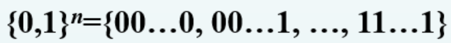
>
>**包含$2^n$个长为n的0,1符号串,共有$2^{2^n}$个n元真值函数**

#### **2.性质**

**任何一个含n个命题变项的命题公式A都对应唯一的一个n元真值函数F,F对应A的真值表**

>**比如**$$p \rightarrow q , \neg{p}\vee{q}$$ 的真值都对应 $$ \ F^{(2)}_{13}$$(即2元变量,13的二进制1101)
>
>>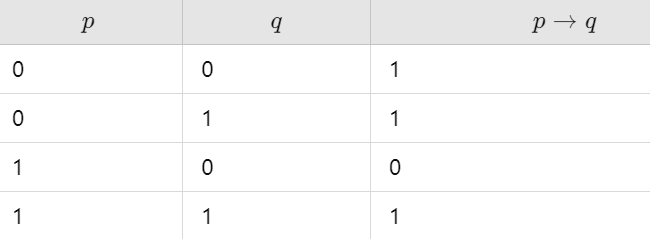
>>
>>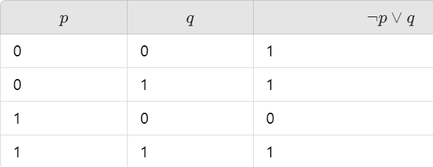

***

#### **3.联结词完备集**

**设S是一个联结词集合,如果任何n($n \geq 1$)元真值函数都可以由仅含S中的联结词构成的公式表示,则称S式联结词完备集**

**其中$S = \{\neg,\wedge,\vee\}$是联结词完备集**

>$S_1 = \{\neg,\wedge,\vee,\rightarrow\} \quad S_2 = \{\neg,\wedge,\vee,\rightarrow,\leftrightarrow\}$
>
>$S_3 = \{\neg,\wedge\} \quad S_4 = \{\neg \vee\}$
>
>$S_5 = \{\neg,\rightarrow\}$
>
>**记住这个就行:$\{\wedge,\vee,\rightarrow,\leftrightarrow\}$以及它的子集都不是联结词完备集**

***
#### **4.复合联结词**

**定义:设pq是两个命题,$\neg{(p \wedge{q})}$称为p与q的与非式,记作$p\uparrow{q}$**
>**$\uparrow$称为与非联结词**
>
>**定义:设pq是两个命题,$\neg{(p \vee{q})}$称为p与q的或非式,记作$p\downarrow{q}$**
>**$\downarrow$称为或非联结词**
>
>**性质:$\{\uparrow\}与\{\downarrow\}$为联结词完备集**

***
## **4.可满足性问题与消解法**

#### **1.空简单析取式**

**不含任何文字的简单析取式称作空简单析取式,记作$ \ \lambda \ $**

**约定:简单析取式不同时含有命题变项和它的否定**
>**S:合取范式/C:简单析取式/l:文字/$ \alpha$:赋值/带下角标或'文字l的补$l^c$**
>>若$l = \neg{p} \quad 则 l^c = p$
>>
>>>   (一个合取范式是可满足的，意味着存在一种赋值，使得这个合取范式为真。)
>>
>>$S \approx S':S是可满足的当且仅当S'是可满足的$
>>
>>>   (两个合取范式是等价的，意味着它们在所有赋值下取值相同。)
>>
>>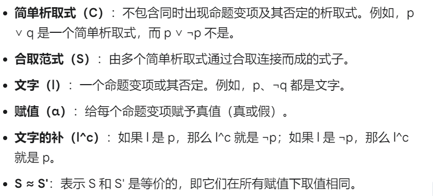
>
***
#### **2.消解定义**

**设$C_1 = l \vee{C_{1}^{'}} \ , \ C_2 = l^c \vee{C_{2}^{'}} \ , \ (C_1,C_2不含l和l^c)$**

>**其中**
>
>**$l$ 和 $l^c$ 是互补的文字（即一个是另一个的否定）。**
>
>**$C_1'$ 和 $C_2'$ 是不包含 $l$ 和 $l^c$ 的析取式。**

**$称C_{1}^{'}\vee{C_{2}^{'}}为C_1,C_2(以l和l^c为消解文字)的消解式或消解结果,记作Res(C_1,C_2)$**

****

#### **3.消解方法及例题**

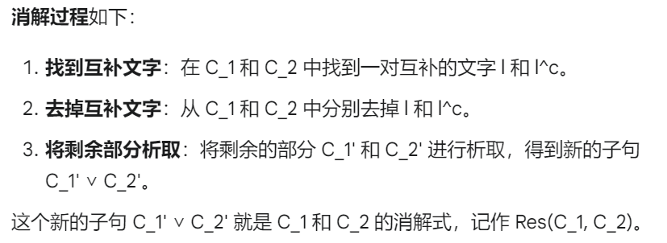

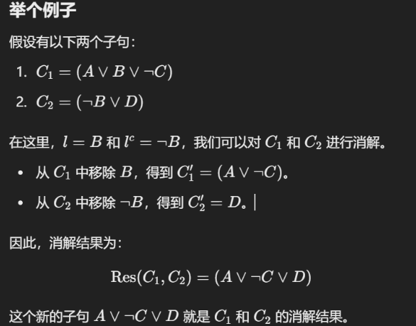
$$
\therefore 比如 \ Res(\neg{p}\vee{q}\vee{r},p\vee{q}\vee{\neg{s}}) = q \vee{r} \vee{\neg{s}}
$$


***
#### **4.消解规则**

###### **1.定理**

**$\quad C_1 \wedge{C_2} \approx Res(C_1,C_2)$**

>**人话:通过消解法,原命题和消解命题在逻辑上是等价的**
***
###### **2.消解序列与合取范式的否证**

**定理**

**设S是一个合取范式,$C_1,C_2,\cdots,C_n$是一个简单析取式序列,**

**如果对每个i,$C_i$是S的一个简单析取式/$Res(C_j,C_k)$**

**则此序列式S导出$C_n$的消解序列,当$C_n = \lambda$称此序列式S的一个否证**

>
>**如果能够导出空子句，那么这个合取范式是不可满足的，也就是有矛盾**
>
>**比如消解到某一步** $$Res(C_3,C_4) = \neg{p} \vee{p} = \lambda$$ (没有变元),**则为S的否证**
>
>>   <font color=red>(但是否证 不是 一定导出空子句,也可能导出重复空子句)</font>

***
###### **3.消解算法**

**消解法主要是在析取子句之间使用的!!合取不行!!!**

**消解算法的目标是通过不断应用消解规则来简化公式，直到得到一个空子句（表示矛盾），从而证明该公式不可满足。消解算法的主要步骤如下：**
>
>**1.将公式转换为合取范式（CNF）：**
>>**首先，输入的命题逻辑公式需要转换为等价的合取范式（CNF）。CNF 是一组析取式的合取形式，即它由若干子句（每个子句是一个或多个文字的析取）组成。**
>
>**2.否定要证明的结论：**
>>**将 P 的否定 ¬P 加入到原始知识库中（即与其他子句合取）。**
>
>**3.应用消解规则：**
>>**找出其中的一对互补文字l和¬l。应用消解规则将新子句$\lambda$加入到知识库中。**
>
>**4.检查空子句（矛盾）：**
>>**空子句的出现：如果得到一个空子句，表示公式$\lambda$不可满足，因此 
>>是可证明的（也就是说，原公式是必然为真的）。**
>
>>**如果无法再进行任何新的消解，且没有得到空子句，则公式是可满足的**
***
###### **4.例题**

**(直接分组两两消解即可)**

>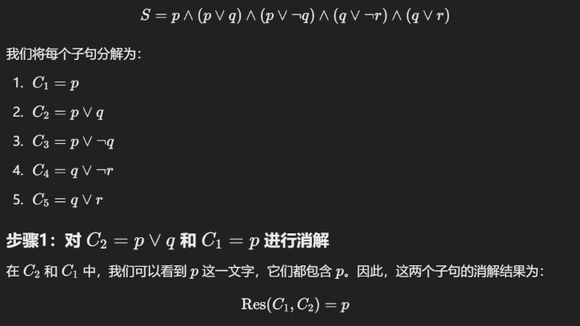
>
>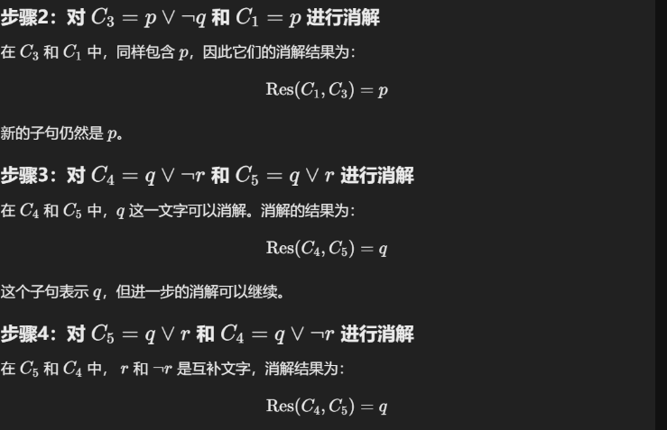
>
>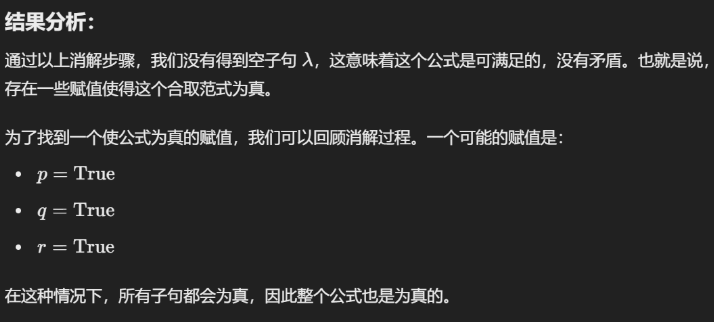
>
>****
>
>**Eg2:S = (p ∨ q) ∧ (¬p ∨ r) ∧ (¬q ∨ ¬r)**
>
>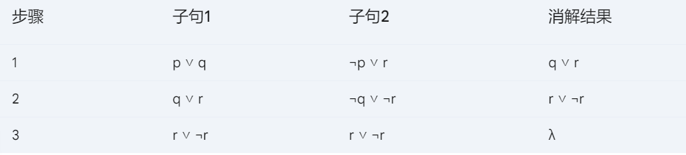
>
>(这个就不满足了)

***
**主要内容**
>**等值式与等值演算**
>
>**基本等值式（16组，24个公式）**
>
>**主析取范式与主合取范式**
>
>**联结词完备集**
>
>**消解法**