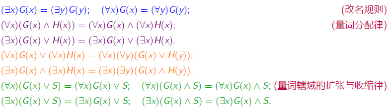

# **4.一阶逻辑基本概念(谓词)**

**研究内容:在命题逻辑的基础上添加量词,达到表示个体和总体之间的数量关系**

## **1.个体词谓词**

#### **0.命题逻辑的局限**

>   **1.对简单命题进行分解,利用个体词/谓词/量词来描述它们**
>
>   **2.研究个体与总体的内在联系和数量关系**
>
>   **(->所以使用个体词/谓词/量词 来描述这些内容)**

**在原子命题中**

>   **个体词:可以独立存在的客体(主语/宾语)**
>
>   **谓词:用以刻画 客体性质和客体之间关系**

#### **1.个体词(小写字母表示)**

>   **研究对象中可以独立存在的客体(主语)**
>
>   **个体常项:表示 具体或特定的 个体词**
>
>   **个体变项:表示 抽象的或泛指的 个体词**
>
>   **个体域:个体的取值范围**
>
>   >   **只有个体变项才会考虑个体域(有穷集合/无穷集合/全总个体域)**

#### **2.谓词(大写字母表示)**

###### **1.谓词定义**

>   **描述[个体词性质]和[个体间关系]的词(sth是什么/sth1和sth2)**

###### **2.谓词常项(0元谓词)**

**表示 具体性质或关系(单独的定义)或者动作:F(x)G(statement)**

###### **3.谓词变项(n元谓词)**

**表示 抽象的或者泛指的关系(和sth2...存在的进一步关系)**

>   **没有具体解释关系是什么**

###### **4.谓词的注意事项**

>   **1.谓词中的个体词顺序不能随意更改**
>
>   **2.(一元谓词:描述个体的特性)(n元谓词:n个个体间的关系)**
>
>   **3.谓词P$(x_1,x_2,\cdots,x_n)$单独不是命题,需要定义$X_i$,用个体常项代替**
>
>   **4.0元谓词:没有任何个体变量的谓词 + 个体常量 = 命题**

****

#### **3.复合命题的谓词符号化**

>   
>
>   
>
>   **注意所有集合还是全总个体域**
>
>   

****

#### **4.Eg**

**例：下列语句属于 0元谓词变项 的是（C）**

>   **李磊和王华是好朋友(两者关系,2元谓词)**
>
>   **2 和3 的关系是L(关系变项L,没有解释关系是什么)**
>
>   **北京是中国的首都(客观事实,没有变项xy)**
>
>   **x 与y 的乘积是24(变项xy)**

***

## **2.谓词公式的符号化表示**

**给出自然语言,进行谓词符号化**

#### **1.符号化表示的方法**

**1.首先对于部分个体,请先定义M(x),使得性质只在限定个体中运用**

>   **描述性质用蕴含($公式: 个体\rightarrow 性质$)**
>
>   ****
>
>   **所有的人都长着长头发:**
>
>   **如果确定个体域是全总个体域:$ \ \forall x (M(x)\rightarrow F(x))$**
>
>   **如果确定个体域是人:$\quad \forall x F(x)$**
>
>   **[x]表示个体 [M(sth)]表示人的全总个体域 [F(x)]表示有长头发**

**2.注意全部全体和部分全体(假设)的自然语言区别**

>   **$\forall xF(x) \rightarrow \exists yG(y) (部分全体假设) \quad$**
>
>   **(如果对于所有x,满足F(x),则存在某个y满足G(y))**
>
>   **$\forall x (F(x) \rightarrow \exists yG(y)) (全部全体)\quad$**
>
>   **(对于全部x,如果满足F(x),则存在某个y满足G(y))**

****

**🫵🫵:对于$\rightarrow$和$\wedge$的进一步思考:**

**一般量词是$\ \forall$的时候都会使用$\rightarrow$(描述绝对性质)**

>   **解释:将蕴含式化简,得到"要么不是所指对象""要么没有这个性质"($\neg{A}\vee{B}$)**
>
>   **进一步的,这就是$\wedge$和$\forall$之间不存在分配律的原因**

**一般量词是$\ \exists$的时候都会使用$\wedge$(描述个体,表达多个性质同时成立)**

>   **对于其中一个对象或者是有的人,不能直接加上强相关**
>
>   **不然会认为不是ta就没有这个性质🧐**

#### **2.Eg**

**将下列命题符号化**

>   **兔子比乌龟跑得快**
>
>   **有的兔子比乌龟跑得快**
>
>   **并不是所有的兔子都比乌龟跑得快**
>
>   **不存在跑得相同快的两只兔子**

****

>   **定义:两个个体变项x和y,F(x)是兔子G(x)是乌龟,H(x,y)是x比y跑得快,L(x,y)是跑得一样快,N(x,y)表示x和不一样**
>
>   $\forall x \forall y (F(x) \wedge G(y) \rightarrow H(x,y)) $
>
>   $\exists x (F(x) \wedge \forall y (G(y) \rightarrow H(x,y)))$
>
>   $\neg \forall x \forall y (F(x)\wedge G(y) \rightarrow H(x,y))$
>
>   $\neg \exists x \exists y (F(x)\wedge F(y) \wedge N(x,y) \wedge L(x,y))$
>
>   >   (不存在两个不同的兔子,它们跑的一样快)

**Eg2:**

>   **最后一个例子充分说明了x和y表示的是个体,而不能表示具体的个体种类**
>
>   
>
>   
>
>   **对于第二个例子:我们表达的是三个条件同时存在的情况**

***

## **3.一阶逻辑公式**

### **3.量词**

#### **1.量词的定义**

>   **(x称为作用变量,将量词加到它前面)**
>
>   **1.全称量词$(\forall x)$:对于所有的x**
>
>   **2.存在量词$(\exists x)$:至少有一个x**
>
>   

#### **2.量词加入谓词公式**

**3.谓词逻辑符号化的规则**

>   **(一元特性谓词:一元谓词的一种,只不过强调刻画个体词特性)**
>
>   **1.对于全称量词$\ \forall$,刻画其个体域的特性谓词**
>
>   >   **作为蕴含式前件加入**
>
>   **2.对于存在量词$\ \exists $,刻画其个体域的特性谓词**
>
>   >   **作为合取式之合取项加入**

## **4.谓词合式公式**

#### **1.四类符号**

>   **1.常量符号:表示个体域D中的某个元素,小写字母表示**
>
>   **2.变量符号:表示个体域D中的任意元素,小写字母表示**
>
>   **3.函数符号:n元函数符号可以是所属个体域集合的任意一个函数,小写字母表示**
>
>   **4.谓词符号:n元谓词符号可以是所属个体域集合的任意一个谓词,大写字母表示**

#### **2.函数符号的目的**

>   **函数可以用于表达个体词之间的转换关系**

#### **3.谓词逻辑的项**

>   **定义:任意的常量或变量符号是项->套上函数还是项 **
>
>   **(如此有限次的递归调用,依然成立)**
>
>   >   **比如:f(g(x,y),h(a,g(x,y),z))也是项**

#### **4.原子公式定义**

>   **$P(x_1,x_2,\cdots,x_n)$是n元谓词,$t_1,t_2,\cdots,t_n$是项,则$P(t_1,t_2,\cdots,t_n) $是原子谓词**

#### **5.合式公式定义**

>   **1.原子公式是合式公式**
>
>   **2.(合式公式组合)合式公式之间的逻辑关系也是合式公式**
>
>   >   **$(\neg G)(\neg H)(G\vee H)(G\wedge H)(G\leftrightarrow H)(G\rightarrow H) $**
>
>   **3.(合式公式个体组合)合式公式和个体变量也是合式公式**
>
>   >   $(\forall x)G \quad(\exists x)G $
>
>   **4.有限次的组合**
>
>   >   **注意要满足基本的,比如并运算要二元**

## **5.自由变元与约束变元**

#### **1.定义**

>   **对于合式公式G**
>
>   >   **自由变元:变元x不是约束出现**
>   >
>   >   **约束变元:变元x在量词的辖域内**

**(量词后有括号,括号内的子公式就是该量词的辖域)**

****

#### **2.例子**

>   

****

#### **3.两个规则**

###### **1.约束变元的改名规则**

>   **将量词中的变元 及其 量词辖域中此变量的所有约束 用 新的个体变元替换**

###### **2.自由变元的代入规则**

>   **公式中出现该自由变元的每处都用新的个体变元替换**

###### **3.Eg**

>   **$(\forall x)(P(x)\rightarrow Q(x,y)\wedge R(x,y)) $中约束变元x进行改名**
>
>   >   **$(\forall z)(P(z)\rightarrow Q(z,y)\wedge R(x,y)) $**
>
>   **$(\forall x)(P(x)\rightarrow Q(x,y)) $中的自由变元y进行代入 **
>
>   >   $(\forall x)\rightarrow Q(x,z)\wedge R(x,z) $

****

#### **4.闭式**

**1.定义**

>   **设G是任意一个公式,若G中无自由出现的个体变元,则G是封闭的合式公式**

**2.Eg**

>   **$(\forall x)(P(x)\rightarrow (\exists y)R(x,y)) $是闭式**
>
>   **$(\exists x)P(x)\wedge Q(x,y) $不是闭式**

## **6.公式的解释与分类**

#### **1.公式的解释**

**谓词逻辑中公式G的每个解释I的组成**

>   **1.非空的个体域集合D**
>
>   **2.G中的每个"常量符号",指定D中某个特定元素**
>
>   **3.G中的每个"n元函数符号",指定某个特定的函数**
>
>   **4.G中的每个"n元谓词符号,指定某个特定的谓词"**

#### **2.Eg**

>   **设定解释如下**
>
>   **1.个体域为$D = \{\alpha ,\beta\} $**
>
>   **2.a指定为$\alpha $**
>
>   **3.$f(\alpha) = \beta,f(\beta) = \alpha $**
>
>   **4.$P(\alpha) = 1,P(\beta)=0, Q(\alpha,\beta)= 1,Q(\beta,\alpha)= 1,Q(\beta,\beta)= 1 $**
>
>   **公式:$(\exists x)(P(f(x))\wedge Q(x,f(a))) $在解释中的真值 **
>
>   >   **当$x = \alpha$时**
>   >
>   >   $P(f(x))\wedge Q(x,f(a))$
>   >
>   >   $\Leftrightarrow P(f(\alpha)\wedge Q(\alpha,f(\alpha)))  $
>   >
>   >   $\Leftrightarrow P(\beta)\wedge Q(\alpha,\beta) $
>   >
>   >   $\Leftrightarrow 0\wedge 1 = 0 $
>   >
>   >   **当$x = \beta$时**
>   >
>   >   $P(f(x))\wedge Q(x,f(a))$
>   >
>   >   $\Leftrightarrow P(f(\beta)\wedge Q(\beta,f(\alpha)))  $
>   >
>   >   $\Leftrightarrow P(\alpha)\wedge Q(\beta,\beta) $
>   >
>   >   $\Leftrightarrow 1\wedge 1 = 1 $

***

#### **3.公式的类型**

**1.有效公式:如果公式G在它所有解释下取值都为真**

**2.矛盾公式:如果公式G在它所有解释下取值都为假**

**3.可满足公式:至少有一种解释使得公式G取值为真**

****

**谓词公式的可判定性:**

>   **1.谓词逻辑是不可判定的**
>
>   **2.只含有一元谓词变项的公式是可判定的**
>
>   **3.n元谓词公式P中无量词和其它自由变元,可判定的**
>
>   **4.个体域有穷时的谓词公式时可判定的**

***

**代换示例:对于多元命题公式,可以用$A_i$处处替代$p_i$,所得公式A为A0的代换示例**

>   **永真式的代换实例都是永真式,矛盾式的代换实例都是矛盾式**

****

## **7.公式的等价关系**

#### **1.等价关系定义**

>   **如果公式$G \leftrightarrow H $是有效公式，则公式G,H 称为等价的，记为G = H。**

#### **2.代入实例定义**

>   **如果公式$G(P_1,P_2,\cdots,P_n) $是命题公式,$P_1,P_2,\cdots,P_n $是命题变元**
>
>   **当使用 任意的谓词公式$G_i $代入 命题变元**
>
>   **$G(G_1,G_2,\cdots,G_n) $称为代入实例(人话代入即可)**

#### **3.代入实例Eg**

>   **命题公式 G(P, Q) 为 (P → Q)∧(¬Q∨ P)。**
>
>   **设G₁为A(x)（例如，“x 是偶数”），G₂为 B(y)例如，“y 是质数”）。**
>
>   **则 G 的一个代入实例为 (A(x) → B(y)) ∧ (¬B(y) ∨ A(x))。**

#### **4.谓词演算中的基本等价公式**

###### **1.定义**

>   **假设两个只含自由变元的公式G(x),H(x),S是不含x的公式,则有**

###### **2.基本等价公式**

>   (0)消去量词等值式:D={$a_1,a_2,\cdots,a_n$}
>
>   >   $\forall xA(x) \Leftrightarrow A(a_1)\wedge A(a_2)\wedge \cdots \wedge A(a_n)$
>   >
>   >   $\exists xA(x) \Leftrightarrow A(a_1)\vee A(a_2)\vee \cdots \vee A(a_n)$
>
>   (1)改名规则
>
>   $(\exists x)G(x) = (\exists y)G(y) \Leftrightarrow (\forall x)G(x) = (\forall y)G(y)$
>
>   (2)量词转换律
>
>   $\neg(\exists x)G(x) = (\forall x)\neg G(x) \Leftrightarrow \neg(\forall x)G(x) = (\exists x)\neg G(x)$
>
>   (3)量词辖域的扩张与收缩(存在变,全局不变)
>
>   $\forall x(A(x)\vee B) \Leftrightarrow \forall xA(x)\vee B$
>
>   $\forall x(A(x)\wedge B) \Leftrightarrow \forall xA(x)\wedge B$
>
>   $\exists x(A(x)\vee B) \Leftrightarrow \exists xA(x)\vee B$
>
>   $\exists x(A(x)\wedge B) \Leftrightarrow \exists xA(x)\wedge B$
>
>   
>
>   >   **解释:对于A(x)的全部x都能推导b,那么A(x)的部分也能推导b**
>   >   $$
>   >   \forall x(A(x)\rightarrow B) \Leftrightarrow \exists xA(x)\rightarrow B
>   >   $$
>   >
>   >   $$
>   >   \exists x(A(x)\rightarrow B) \Leftrightarrow \forall (A(x)\rightarrow B
>   >   $$
>
>   (4)量词分配律
>
>   $\forall x(A(x)\wedge B(x)) \Leftrightarrow \forall xA(x)\wedge \forall xB(x)$
>
>   $\exists x(A(x)\vee B(x)) \Leftrightarrow \exists xA(x)\vee \exists xB(x)$
>
>   (5)量词前提(非官方)
>
>   
>
>   (6)量词相同,换名(非官方)
>
>   
>
>   **结论:$\ \neg(\exists x)P(x)= (\forall x)\neg P(x)$**

****

## **8.前束范式**

#### **1.范式**

>   **每个公式都有与之等值的范式,是一种统一的表达形式**

#### **2.前束范式**

>   **G的一切量词都在该公式的最前端,辖域都指向公式最后称公式G是一个前述范式**

#### **3.前束范式求解**

>   **1.消去蕴含和双蕴含**
>
>   **2.反复运用量词转换律/德摩根律/双重否定律:直到所有$\neg $都到内部**
>
>   >   $\ \neg(\exists x)G(x)= (\forall x)\neg G(x)$
>
>   **3.使用等价公式将所有量词提到最前端**
>
>   

