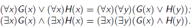
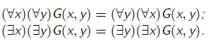
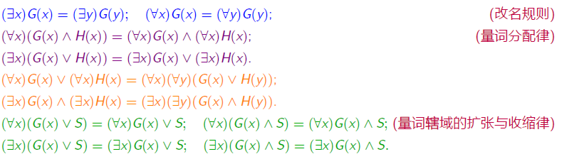
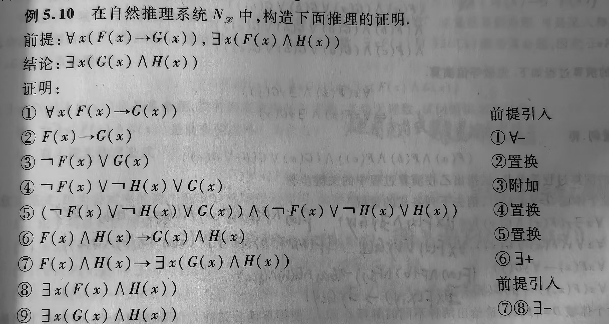
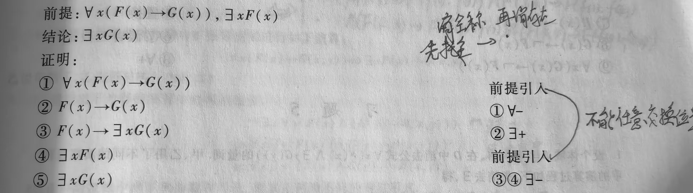

# **5.一阶逻辑等值演算**

## **1.推理形式和推理规则**

#### **1.等价关系定义**

>   **如果公式$G \leftrightarrow H $是有效公式，则公式G,H 称为等价的，记为G = H。**

#### **2.代入实例定义**

>   **如果公式$G(P_1,P_2,\cdots,P_n) $是命题公式,$P_1,P_2,\cdots,P_n $是命题变元**
>
>   **当使用 任意的谓词公式$G_i $代入 命题变元**
>
>   **$G(G_1,G_2,\cdots,G_n) $称为代入实例(人话代入即可)**

#### **3.代入实例Eg**

>   **命题公式 G(P, Q) 为 (P → Q)∧(¬Q∨ P)。**
>
>   **设G₁为A(x)（例如，“x 是偶数”），G₂为 B(y)例如，“y 是质数”）。**
>
>   **则 G 的一个代入实例为 (A(x) → B(y)) ∧ (¬B(y) ∨ A(x))。**

#### **4.谓词演算中的基本等价公式**

###### **1.定义**

>   **假设两个只含自由变元的公式G(x),H(x),S是不含x的公式,则有**

###### **2.基本等价公式**

>   (0)消去量词等值式:D={$a_1,a_2,\cdots,a_n$}
>
>   >   $\forall xA(x) \Leftrightarrow A(a_1)\wedge A(a_2)\wedge \cdots \wedge A(a_n)$
>   >
>   >   $\exists xA(x) \Leftrightarrow A(a_1)\vee A(a_2)\vee \cdots \vee A(a_n)$
>
>   (1)改名规则
>
>   $(\exists x)G(x) = (\exists y)G(y) \Leftrightarrow (\forall x)G(x) = (\forall y)G(y)$
>
>   (2)量词转换律
>
>   $\neg(\exists x)G(x) = (\forall x)\neg G(x) \Leftrightarrow \neg(\forall x)G(x) = (\exists x)\neg G(x)$
>
>   (3)量词辖域的扩张与收缩(存在变,全局不变)
>
>   $\forall x(A(x)\vee B) \Leftrightarrow \forall xA(x)\vee B$
>
>   $\forall x(A(x)\wedge B) \Leftrightarrow \forall xA(x)\wedge B$
>
>   $\exists x(A(x)\vee B) \Leftrightarrow \exists xA(x)\vee B$
>
>   $\exists x(A(x)\wedge B) \Leftrightarrow \exists xA(x)\wedge B$
>
>   
>
>   >   **解释:对于A(x)的全部x都能推导b,那么A(x)的部分也能推导b**
>   >   $$
>   >   \forall x(A(x)\rightarrow B) \Leftrightarrow \exists xA(x)\rightarrow B
>   >   $$
>   >
>   >   $$
>   >   \exists x(A(x)\rightarrow B) \Leftrightarrow \forall (A(x)\rightarrow B
>   >   $$
>
>   (4)量词分配律
>
>   $\forall x(A(x)\wedge B(x)) \Leftrightarrow \forall xA(x)\wedge \forall xB(x)$
>
>   $\exists x(A(x)\vee B(x)) \Leftrightarrow \exists xA(x)\vee \exists xB(x)$
>
>   (5)量词前提(非官方)
>
>   
>
>   (6)量词相同,换名(非官方)
>
>   
>
>   **结论:$\ \neg(\exists x)P(x)= (\forall x)\neg P(x)$**

****

## **2.前束范式**

#### **1.范式**

>   **每个公式都有与之等值的范式,是一种统一的表达形式**

#### **2.前束范式**

>   **G的一切量词都在该公式的最前端,辖域都指向公式最后称公式G是一个前述范式**

#### **3.前束范式求解**

>   **1.消去蕴含和双蕴含**
>
>   **2.反复运用量词转换律/德摩根律/双重否定律:直到所有$\neg $都到内部**
>
>   >   $\ \neg(\exists x)G(x)= (\forall x)\neg G(x)$
>
>   **3.使用等价公式将所有量词提到最前端**
>
>   

## **3.置换规则、换名规则、代替规则**

***

**1.置换规则**

>   **设$\Omega(A)$是含A的公式,如果$A\Leftrightarrow B$则有$\Omega(A) \Leftrightarrow \Omega(B)$**

**2.换名规则**

>   **在量词辖域中,把一个变量替换成另一个没出现过的变量(比如x换成z)**

**3.代替规则**

>   **和换名规则类似,对于自由变量也可以换名字**

****

**Eg:使用不同的形式符号化并且证明等价**

>**解:令F(x):x是人,G(x):x犯错误**
>
>$a.\neg \exists x(F(x)\wedge \neg G(x)) \quad b. \forall x(F(x)\rightarrow G(x))$
>
>**对a进行化简:**
>
>**$\leftrightarrow \forall x\neg (F(x)\wedge \neg (G(x))) \quad 量词否定式$**
>
>$\Leftrightarrow \forall x(\neg F(x)\vee G(x))(德摩根律)$
>
>$得证:I \Leftrightarrow \forall x(F(x)\rightarrow G(x))(蕴含式)$

***

**Eg:将公式化简为只有约束出现/自由出现的个体变项**

>$\forall x(F(x,y,z)\rightarrow \exists yG(x,y,z))$
>
>>**解:$\Leftrightarrow x(F(x,y,z)\rightarrow \exists tG(x,t,z)) (换名规则)$**
>
>>$\Leftrightarrow \forall x\exists t(F(x,y,z)\rightarrow G(x,t,z)) (辖域扩张等值式)$
>
>>**解:$\Leftrightarrow x(F(x,u,z)\rightarrow \exists yG(x,y,z)) (代替规则)$**
>
>>$\Leftrightarrow \forall x\exists y(F(x,u,z)\rightarrow G(x,y,z)) (辖域扩张等值式)$
>
>**结论:对自由变量进行代替规则更快更方便**

***

**Eg:设个体域D={a,b,c}消去下述公式的量词:$\forall x \exists y(F(x)\rightarrow G(y))$**

>**最优解:辖域缩小等值式**
>
>>$\Leftrightarrow \forall x(F(x)\rightarrow \exists yG(y))$
>
>>$\Leftrightarrow \forall x(F(x)\rightarrow G(a)\vee G(b)\vee G(c))$
>
>>$\Leftrightarrow (F(a)\rightarrow G(a)\vee G(b)\vee G(c))\wedge(F(b)\rightarrow G(a)\vee G(b)\vee G(c))\wedge(F(c)\rightarrow G(a)\vee G(b)\vee G(c))$

***

**给定解释I求真值:**

>$D = {2.3}$
>
>$\overline{f}:\overline{f}(2)=3,\overline{f}(3)=2$
>
>$\overline{F}(x):x是奇数 \ \overline{G}(x,y):(x=2\vee y=2) \ \overline{L}(x,y):x=y$
>
>$\exists x(F(f(x))\wedge G(x,f(x)))$
>$(F(f(2))\wedge G(2,f(2)))\vee(F(f(3))\wedge G(3,f(3)))$
>
>$\Leftrightarrow (1\wedge 1)\vee(0\wedge 1)\Leftrightarrow 1$

**复习:**

**否定符号,量词由公式转移到命题上,变号(否定等值式)**

**谓词联结词,全合部析,量词转移到个体常项,不变号(展开律)**

**量词控制的常项公式是单一变量,量词内外转移,不变号(辖域变换)**

**带蕴含的部分全体假设,量词转移到常项公式前,变号去括号(部分转移)**

**a.前束范式存在定理:一阶逻辑中的任何公式都存在与之等值的前束范式**

## **4.推理系统**

#### **1.推理定律**

>**永真式的蕴含式($A_1 \wedge A_2 \wedge \cdots \wedge A_k \rightarrow B$)**

#### **2.命题逻辑推理定律**

>$$\forall xF(x)\wedge \exists yG(y) \rightarrow \forall xF(x)(自动成立真假不分)$$
>
>**基本等值式:双重否定表肯定,否定量词前移**
>
>**其它常用定理:结合律/分配律/全合析部**

#### **3.量词规则**

>**$(\forall -)$全称量词消去规则:$\forall xP(x)$为真,P(a)也为真**
>
>**$(\forall +) $全称量词引入规则:P(a)为永真,$\forall xP(x)$也为真**
>
>**$(\exists -)$部分量词消去规则:已知存在一个个体使得$\exists xP(x)$成立,直接举例一个**
>
>**($\exists +$)部分量词引入规则:如果某个个体P(a)使G(x)成立,$\exists xP(x)$**

#### **4.自然推理系统NL及其推理规则**

>**目标：在已知的前提下，使用逻辑规则推导出结论**
>
>**规则分类:引入规则/消去规则/假设规则**

#### **5.Eg**

>**解:设F(x):x是自然数$\quad$G(x):x是整数**
>
>**前提:$\forall x(F(x)\rightarrow G(x)),\exists xF(x)$**
>
>**结论:$\exists xG(x)$**

>**证明:**
>
>$$1.\exists x F(x) (前提引入)$$
>
>$$2.F(x)(\exists -,直接给出例子)$$
>
>$$3.\forall x(F(x)\rightarrow G(x)) (前提引入)$$
>
>$$4.F(c)\rightarrow G(c) (\forall -)$$
>
>$$5.G(c) (2,4推理)$$
>
>$$6.\exists xG(x) (\exists +)$$

****

**Eg2:**

**Eg3:**

## **5.总结**

**1.解题思路**

>   **1.结论是"条件形式"或"析取形式",使用CP规则**
>
>   **2.结论需要"消去量词",使用规则US和规则ES**
>
>   **3.结论需要定量,使用规则UG和规则EG**
>
>   **4.证明题:使用命题演算中的直接证明和间接证明**
>
>   **5.结论需要消去"不含量词的子公式",使用基本等价式(归一律)**
>
>   **6.证明中对含有量词的公式,引用谓词中的基本等价公式和基本蕴含式**

 

**复习策略:主要是一阶逻辑命题的符号化/公式的解释/判断类型(涉及分类讨论)**