# **6.集合代数**

## **1.集合**

#### **1.定义**

>   **集合是由指定范围内的满足给定条件的所有对象聚集在一起构成，每一个对象称**
>   **为这个集合的元素。**

#### **2.集合的表示**

(用大写字母表示集合,用小写字母表示元素)

>**a.列元素法：$\quad A = \{a,b,c,\cdots , z\}$**
>
>**b.谓词表示法:用谓词概述元素的属性:$\quad B = \{x|x\in R \wedge x^2 -1 =0\}$**
>
>c.枚举法/叙述法/文氏图/

#### **3.集合元素的性质**

>   **无序性/确定性/任意性**

#### **4.元素与集合的关系**

>   **隶属关系包括$ \ \in \ , \notin$**
>
>   **可以使用树形图并表示元素与集合的隶属关系,比如$\ A = \{\{a, b\},\{\{b\}\},d\}$**
>
>   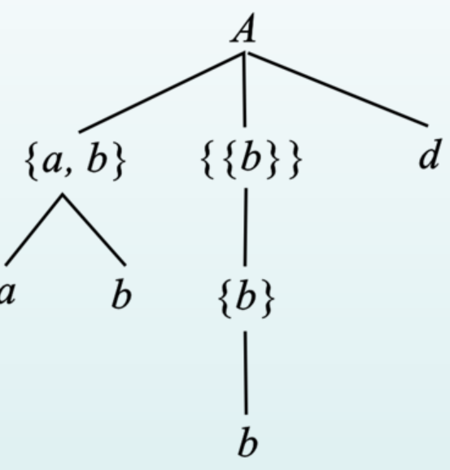

#### **5.集合的基数**

>   **定义:集合A的元素个数称为集合的基数(不包含嵌套)**
>
>   **区分:有限集和无限集**
>
>   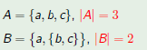

#### **6.集合与集合之间的关系**

>**$\ \subset \ \not\subset \ \supset \ \not\supset \  \subseteq \ \supseteq \ = \ \not=$**
>
>$$(A是B的子集,或者是A包含于B)A \subseteq B \Leftrightarrow \forall x (x\in A \rightarrow x \in B) $$
>
>$$(A不是B的子集,或者是A包含于B)A \not\subseteq B \Leftrightarrow \exists x (x\in A \vee \neg (x \in B)) $$
>
>$$(证明A等于B的唯一方法,则AB相互是对方的子集)A = B \Leftrightarrow A \subseteq B \wedge B \subseteq A$$
>
>$$A \subset B \Leftrightarrow A \subseteq B \wedge A \not= B$$
>
>$$A \not\subset B \Leftrightarrow \exists x (x\in A \wedge x \not\in B)$$
>
>**注意:$\subseteq 和 \in$是不同层次的问题**
>
>****

#### **7.集合的类型**

**空集/全集/幂集**

**空集 $\emptyset$:不含有任何元素的集合,是任何集合的子集**

$$Eg: \ \{x | x\in R \wedge x^2 +1 =0\}(可以有很多形式,但是都是空集)$$

**幂集:$P(A) = \{x|x\subseteq A \}$(注意空集的幂集不是空集)**

>**$记作P(A)或$2^A(如果A是数量,这个也可以表示基数数量)$**

$$Eg: \ P(\emptyset) = \{\emptyset\} \ but \ P\{\emptyset\} = \{\emptyset ,\{\emptyset\}\}$$

**全集E:包含了所有集合的集合,具有相对性(仅针对问题)**

#### **8.集合的运算**

***
###### **1.初级运算**

>$$(并) \ A\bigcup B = \{x|x \in A \vee x \in B\}$$
>
>$$(交) \ A\bigcap B = \{x|x \in A \wedge x \in B\}$$
>
>$$(相对补) A - B = \{x | x \in A \wedge x \not\in B \}$$
>
>$$(对称差,异或) A \bigoplus B = (A-B)\bigcup (B-A) = (A\bigcup B) - (A\bigcap B)$$
>
>$$(绝对补) \~ A = E - A $$
>
>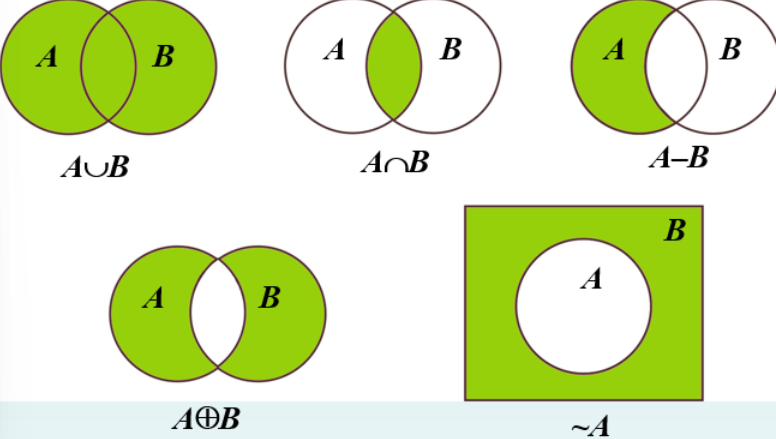
>
>**并和交可以推广到"有穷"个集合上**
***
###### **2.基本恒等式**

>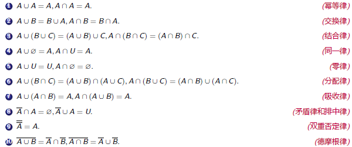
>
>$$A \subseteq \Leftrightarrow A - B = \emptyset$$
>
>$$A \bigcap B = \emptyset \Leftrightarrow A - B = A$$
>
***
**3.集合相等的证明**

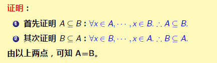

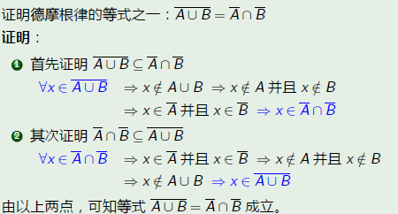

**下面的内容书上没有**

****

**广义运算**

>**广义并:**
>
>**$\bigcup A  = \{x|\exists z (z \in A \wedge x \in z)\}$(对集合内元素并运算)**
>
>**广义交:**
>
>**$ (A \not = \emptyset,也就是蕴含式为永真不成立) \quad \bigcap A = \{x | \forall z(z \in A \rightarrow x \in z)\}$**
>
>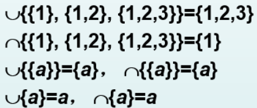

**广义运算的性质:**

>**1.$\ \bigcup \emptyset = \emptyset 和 \bigcap \emptyset \ $无意义**
>
>**2.单元集$\{x\}$的广义并和广义交都等于x(单一元素)**
>
>**3.广义运算可以减少集合的层次**
>
>**4.广义运算一般情况下可以转变为初级运算**
>
>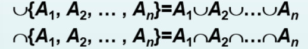

****
**运算的优先权规定**
>**一类运算:广义运算,幂集和~运算(都是单元运算符,由右向左执行)**
>
>**二类运算:初级运算(之间没有优先级,只和括号确定)**

>**Eg:A = $\{\{a\},\{a,b\}\}$,计算$\bigcap\bigcup A\bigcup{(\bigcup\bigcup A - \bigcup\bigcap A)} $**
>>$= \bigcap\{a,b\}\bigcup{(\bigcup\{a,b\} - \bigcup\{a\})}$
>
>>$ = (a\bigcap b)\bigcup{((a\bigcup b)-a)}$
>
>>$ = (a\bigcap b)\bigcup{(b-a)}$
>
>>$b$
>

**2.涉及两个不同运算的算律:**

>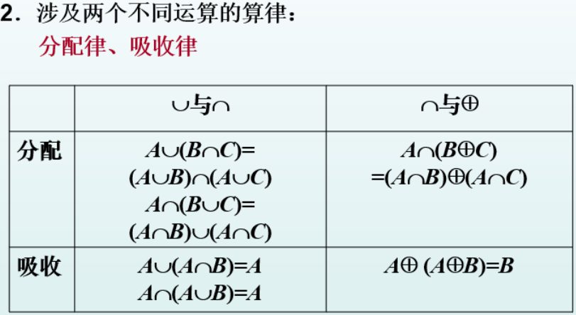
>
>**3.涉及补运算的算律:**
>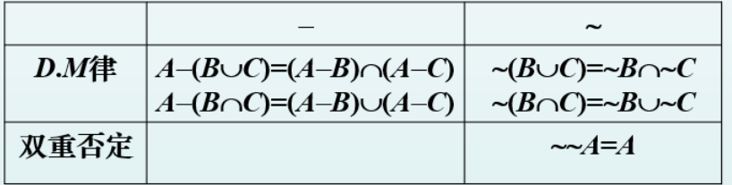
>
>**4.涉及全集和补集的算律**
>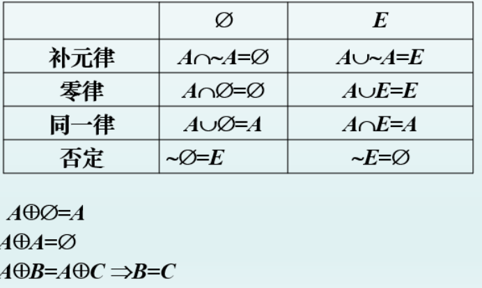