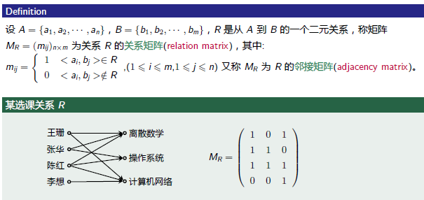
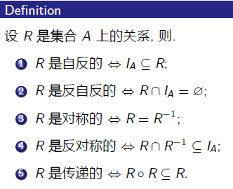
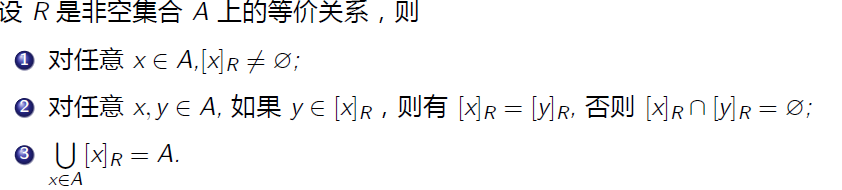
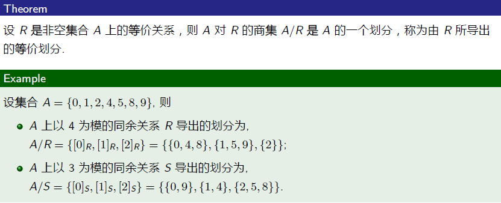

# **7.二元关系**

## **1.有序对与笛卡儿积**

#### **1.序偶<x,y>**

>   **由两个元素按照一定的次序组成的二元组**

#### **2.笛卡尔积**

>   **AB是两个集合,$A\times B = \{<x,y>|(x\in A)\wedge (y\in B) \} $为集合A与B的笛卡尔积**

#### **3.笛卡儿积的性质**

>   **1.不满足交换律:$A \times B \not = B \times A $**
>
>   **2.不满足结合律**
>
>   **3.$A \times B = \emptyset $当且仅当 $A = \emptyset,B = \emptyset $**
>
>   **4.笛卡儿积对 并运算 和 交运算 满足分配律**

#### **4.推广至n个**

>   **1.n重有序组**
>
>   **n个元素$a_1,a_2,\cdots,c_n $按照一定次序组成的n元组**
>
>   **2.n元笛卡儿积**
>
>   **$A_1,A_2,\cdots,A_n $是n个集合,则集合**
>
>   **$A_1 \times A_2 \times \cdots \times A_n = \{<a_1,a_2,\cdots,a_n> |a_i\in A ,i = 1,2,3,\cdots,n\} $ **
>
>   **为集合$A_1,A_2,\cdots,A_n $的笛卡儿积**

## **2.二元关系**

#### **1.定义**

>   **AB为两个集合,称$A\times B $的任意子集R为从A到B的一个二元关系,简称关系**

#### **2.标记**

>   **若$<x,y>\in R , \quad xRy \ $,则称x对y有关系R**
>
>   **若$<x,y>\not\in R , \quad x\not R y \ $,则称x对y有关系R**

#### **3.二元关系例题**

>   ###### **1.写出二元关系**
>
>   
>
>   ###### **2.写出所有关系**
>
>   

#### **4.重要性质**

###### **1.重要关系**

(空关系/全关系/恒等关系)

>   

###### **2.有限集合二元关系数量**

>   

#### **5.定义域和值域**

**定义**

>   **设R是从A到B的二元关系,A为关系R的前域,B为关系R的后域**
>
>   **定义域(domR):$C = \{x|x\in A,\exists y \in B , <x,y>\in R \} $**
>
>   **值域(ranR):$D = \{y|y\in B,\exists x \in A,<x,y>\in R \} $**
>
>   **域:$fldR = domR \bigcup ranR $**
>
>   

>   

#### **6.推广至n元**


## **3.关系的运算**

#### **1.表示方式**

##### **1.枚举法和叙述法**

>   

##### **2.图形表示(网络/环/矩阵)**

>   
>
>   
>
>   ****

##### **3.对于邻接矩阵**

>   >   **1.定义方式**
>   >
>   >   
>   >
>   >   **2.创建方法**
>   >
>   >   
>   >
>   >   **3.举例**
>   >
>   >   
>   >
>   >   **4.布尔矩阵的积运算**
>   >
>   >   

****

#### **2.关系的基本运算**

###### **1.关系定义(并交差补)**

>   

###### **2.Eg**

>   

###### **3.关系的复合定义**

>   **设ABC三个集合,R是从A到B的关系,S是B到C的关系,复合关系R是A到C的关系**
>
>   **记作$R \circ S $,$\ \circ \ $称为复合运算**
>
>   ($R \circ S  = \{<x,z>|(x\in A)\wedge (z\in C)\wedge (\exists y)(y\in B \wedge xRy \wedge ySz)\} $)
>
>   Eg:
>
>   

###### **4.复合关系解释(形式)**

>   **理解为关系图的首尾连接/关系矩阵的布尔运算**
>
>   

#### **3.关系的逆运算**

###### **1.定义**

>   **设AB是两个集合，R是A到B的关系，则从B到A的关系是逆运算$R^{-1} $**

###### **2.几个性质**


###### **3.逆运算的表示方法**

**(定义域和值域反过来值域和定义域/关系图的反向连接/关系矩阵的转置)**


**4.左复合右复合**

>   比如F={<3,3>,<6,2>},G={2,3}
>
>   G对F的右复合:$F\circ G =\{6,3\}$,只看F的右边,在G前连接
>
>   G对F的左复合:$F\circ G =\{6,3\}$,只看F的左边,在G后连接

**5.限制与像**

**设R={<1,2>,<1,3>,<2,2>,<2,4>,<3,2>}**

>   **限制:$R \uparrow \{A\} $:以A为前序的所有序列**
>
>   >   **$R \uparrow \{A\} = \{<1,2>,<1,3>\} $**
>   >
>   >   **$R \uparrow \emptyset = \emptyset $**
>
>   **像:$R[{A}]$:以A为前序的所有序列的后序**
>
>   >   $R\{[1]\} = \{2,3\} $
>   >
>   >   $R\{\emptyset\} = \emptyset $

## **4.关系的性质**

#### **1.结合律与同一律**

###### **1.定义**

>   **ABCD是四个集合,RST是(A到B)(B到C)(C到D)的二元关系,IAIB是AB的恒等关系**
>
>   $(R\circ S)T = R\circ (S\circ T) $**(二元关系的交换律)**
>
>   $I_A \circ R = R \circ I_B = R $**(恒等关系的意义)**

###### **2.二元关系相等的证明**

**(作业题可能有)**

>   **关系相等->集合相等->即证两个序列相互包含**
>
>   
>
>   

****

#### **2.复合关系的分配律**


****

#### **3.逆运算性质定律**

###### **1.复合运算的逆运算**

>   

###### **2.非复合运算的逆运算**

>   

****

#### **4.关系的幂运算(复合幂运算)**

###### **1.幂运算规则**

>   1.$R^0 = I_A $
>
>   2.$R^1 = R $
>
>   3.$R^{n+1} = R^n \circ R =R\circ R^n $
>
>   4.$R^{m+n} = R^{n+m} = R^m \circ R^n = R^n \circ R^m $
>
>   5.$R^{mn} = R^{nm} ,m,n\in N$

###### **2.Eg(一般找到重复项)**

>   
>
>   

###### **3.幂运算的收敛性**

>   **定义**
>
>   **设A是有限集合,且$|A|=n $,R是A上的关系,则:**
>   $$
>   \bigcup^{\infty}_{i=1} R^i = \bigcup^{n}_{i=1} R^i
>   $$
>   **解释**
>
>   **A × A 是有限集，其子集个数也是有限的，而并集运算又是单调递增的，因此经过有限步运算后必然会达到稳定状态。**
>
>   **证明**
>
>   
>
>   

****

#### **5.关系的性质**

(设R是集合A上的关系)

#### **6.自反性与反自反性**

###### **1.定义**

>   **对任意的$x\in A $,都有$<x,x>\in R $,称R在A上是自反的,具有自反性**
>
>   **对任意的$x \in A $,都有$<x,x>\not\in R $,称R在A上是反自反的,具有反自反性**
>
>   

###### **2.判断自反反自反的方法(关系图)**

>   自反:每个结点都有指向自己的环**(必须每个都有!!)**
>
>   反自反:当且仅当它的关系图中没有任何自环(必须每个都没有!!)


###### **3.判断自反反自反的方法(关系矩阵,看主对角线)**

>   自反:主对角线都是1
>
>   反自反:主对角线都是0
>
>   都不是:1和0都有


****

#### **7.对称性和反对称性**

###### **1.定义**

>   

###### **2.判断对称性与反对称性的方法(关系图)**

(对称:除自环外,所有结点都是无向边(即从A到B和从B到A))

(反对称:除自环外,不能出现成对的箭头)

(非对称:不能存在自环,且只有单向边)

(对称+反对称:只有自环)

**<font color=red>开始的话只看边就行,不用看自反</font>**


###### **3.判断对称性与反对称性的方法(关系矩阵)**


****

#### **8.传递性**

###### **1.定义**

>   

###### **2.判断关系的传递性(关系图)**

>   传递:任何不同节点,都存在传递的边(1到2,2到3,...,n-1到n)
>
>   
>
>   (3不是传递,因为缺少<1,3>的关系)
>
>   (4不是传递,<1,2><2,1>缺少<1,1>自环)

****

#### **9.关系性质的判定定理**

**1.目的**

>   **通过关系图和关系矩阵无法定义抽象关系,所以使用约定约束**

**2.内容**

>   

**3.汇总**

>   

**4.多个关系的关系性质**

>   

**5.关系性质的保守性(运算后关系变化)**


## **5.关系的闭包**

**1.定义**

>   

**2.闭包求解**

>   
>
>   

**3.利用关系运算求闭包**


## **6.等价关系与划分**

#### **1.等价关系定义**

>   **设R是非空集合A上的关系, R是自反的对称的传递的,则称R是A的er**

#### **2.Eg**

>   

#### **3.等价类**

>   
>
>   

#### **4.等价类的性质**

>   

#### **5.商集**

>   **R是非空集合A上的等价关系,由R确定的一切等价类的集合，称为A是R的商集**
>
>   

#### **6.集合的划分以及等价划分**

>   
>
>   

#### **7.等价关系:由等价划分确定**

>   
>
>   (只看第一步就足够了)
>
>   

#### **8.Eg(先划分再套公式求关系)**

>   
>
>   

## **7.偏序关系**

#### **1.偏序关系定义**

>R是非空集合A上的关系, **R是自反的反对称的传递的**，则称R为A上的偏序
>
>(用“⩽”来表示偏序关系)
>
>

#### **2.可比与覆盖**

>   
>
>   >   正整数集合上的整除关系中:
>   >
>   >   2与4可比,6与3可比,4和3不可比(两两间是否整除)
>   >
>   >   4覆盖2,6覆盖2:
>   >
>   >   ```txt
>   >   4: 1/2/4   ->2
>   >   6: 1/2/3/6 ->2
>   >   不存在其它因子
>   >   哈斯图单线
>   >   ```
>   >
>   >   8不覆盖2,12不覆盖2
>   >
>   >   ```txt
>   >   8:1,2,4,8
>   >   12:1,2,3,4,6,12
>   >   存在其它因子
>   >   哈斯图多段线
>   >   ```

#### **3.哈斯图及特殊元素**

###### **1.定义**

>   (取消回环/取消传递最终边/重写排列)
>
>   
>
>   

###### **2.最大元和最小元**

>   **(如果有多分支则不存在最元)**
>
>   
>
>   

###### **3.极大元和极小元**

>   (如果有多分支都写上)
>
>   
>
>   

###### **4.上界和上确界**

>   
>
>   (上界:大于等于当前序列的最顶/已经在顶层则没有)
>
>   (上确界:大于等于的某个确切值)
>
>   

###### **5.下界和下确界**

>   
>
>   (下界:小于等于当前序列的最底/已经在底层则没有)
>
>   (上确界:小于等于的某个确切值)
>
>   

###### **6.注意事项**

>   