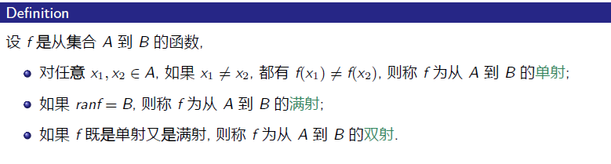
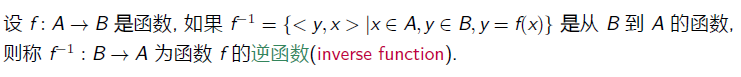

# **8.函数**

## **1.函数的定义与性质**

#### **1.函数定义**

>   

#### **2.判断函数**

>   
>
>   (不是函数:x存在一对多/x没有对应像)

#### **3.函数集定义**

>   

>   

#### **4.函数的个数**

>   

#### **5.关系和函数的差别**

>   

## **2.双射函数与集合的基数**

#### **1.单射/双射/满射**

**1.定义**

>   (x取部分/x和y取部分/x和y全都取)
>
>   
>
>   
>
>   >   (进一步解释,可看可不看)
>   >
>   >   

**2.判断函数类型**

>   **单射：** 不同的输入对应不同的输出（“一对一”）。
>
>   >**如果 x₁ ≠ x₂，则 f(x₁) ≠ f(x₂)。**
>
>   **满射：** 每个输出都能找到至少一个输入对应（“至少一对一”）。
>
>   >**对于任意的 y，都存在一个 x，使得 f(x) = y。**
>
>   
>
>   >   **解释f1:**
>   >
>   >   **不是单射:因为存在 x₁≠x₂，但f(x₁)=f(x₂)。例如f(1)=1，f(-1)=1**
>   >
>   >   **不是满射:因为对于任何负数y，都找不到实数x使得 f(x)=x²=y。**

**3.典型映射**

>   

**4.Eg(证明函数类型)**

>   
>
>   ****
>
>   **方法:**
>
>   
>
>   ****
>
>   

## **3.函数的复合运算和逆运算**

#### **1.定义**

>   **f:A->B,g:B->C这两个函数的复合运算**
>   $$
>   f \circ g = \{<x,z>|x\in A,z\in C,\exists y \in B,使得y=f(x)且z=g(y)\}
>   $$

#### **2.Eg(存在左复合和右复合)**

>   

#### **3.Eg(复合嵌套)**

>   

#### **4.复合运算的保守性(传递)**

>   

#### **5.函数的逆**

>   

#### **6.Eg(逆函数的例子)**

>   

**7.逆函数的性质**

>   