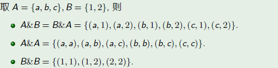
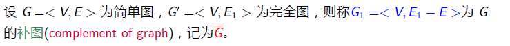
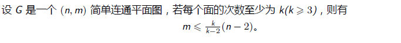

# **9.图论**

## **1.图**

#### **1.无序对和无序积**

>   **AB为任意集合,$A\& B = \{(a,b)|a\in A,b\in B\} $为A与B的无序积**
>
>   (和序偶不同:$<a,b>\not = <b,a> $)(无序积:$(a,b) = (b,a) $)
>
>   

#### **2.图**

>   **定义:一个图是一个序偶<V,E>,记作G=<V,E>**
>
>   (其中$V  =\{v_1,v_2,\cdots,v_n\} $是有限非空集合,即结点集)
>
>   (其中E是有限集合,称为边集,E中每个元素都有V中的结点对与之对应,称为边)
>
>   

#### **3.图的表示**

##### (1.图形/集合表示法)

>   

##### (2.邻接矩阵表示法)

###### **1.定义**

>   

###### **2.Eg**

>   

###### **3.邻接点与邻接边**

>   **定义**
>
>   
>
>   **Eg**
>
>   

#### **4.特殊图**

>   **零图:仅由孤立结点组成的图**
>
>   **平凡图:仅含有一个结点的零图**
>
>   (n,m)图:n个结点,m个边

#### **5.图的分类**

###### **1.按照边有无方向**

>   **无向边:无向图**
>
>   **有向边:有向图**
>
>   **两者都有:混合图**
>
>   

###### **2.按照有无平行边**

>   **平行边:**
>
>   >   **有向图:两结点间若有 同始点和同终点 的边**
>   >
>   >   **无向图:两结点间 的边**
>
>   **重数:两节点间的平行边数**
>
>   >   **多重图:存在平行边的图**
>   >
>   >   **线图:非多重图**
>   >
>   >   >   **简单图:无环的线图**
>
>   **Eg:**
>
>   

###### **3.按有无权值分类**

>   **定义**
>
>   
>
>   
>
>   

###### **4.混合分类**

>   

****

#### **6.子图和补图**

###### **1.定义**

>   (子图/真子图/生成子图/导出子图)
>
>   
>
>   

###### **2.完全图**

>   **1.定义**
>
>   
>
>   **2.性质**
>
>   
>
>   **3.Eg**
>
>   

###### **3.补图**

>   **1.定义**
>
>   
>
>   **2.解释**
>
>   >   **补图就是完全图删除图G中的边**
>   >
>   >   **所以反过来,图G+补图=完全图**
>   >
>   >   (但是结点依然不变)
>
>   **3.Eg**
>
>   
>
>   

###### **4.补图的邻接矩阵**

>   

#### **7.握手定理**

###### **1.结点的度数**

>   (无向图:结点数)(有向图:入度和出度)
>
>   
>
>   

###### **2.最大度和最小度**

>   

###### **3.邻接矩阵计算度数**

>   
>
>   (主要看行和列)
>
>   

###### **4.握手定理**

>图中每条边都有两个端点(环的两个端点相同)，所以一个边肯定是两个结点。
>
>

###### **5.Eg(结点和边)**

>   

###### **6.握手定理推论**

>   **1.度数为奇数的结点个数为偶数**
>
>   **2.有向图中各结点的 出度之和 等于 入度之和 等于 边数 **
>
>   >   
>
>   **3.度数序列**
>
>   
>
>   (按照结点的顺序写)

#### **8.图的同构**

###### **0.现象**

>   

###### **1.定义**

>   

###### **2.解释**

>   

###### **3.判断**

**(看了以后直接写出结点相同即可)**

>   

###### **4.同构的必要条件**

>   
>
>   (比如)
>
>   

#### **9.图的运算**

(并运算/差运算/交运算/异或运算)

## **2.特殊图**

#### **1.欧拉图**

###### **1.定义(边的一笔画)**

>   

###### **2.Eg**

>   

###### **3.无项欧拉图**

>   

###### **4.有向欧拉图**

>   

###### **5.一笔画问题**

**在连通前提下**

>   **对无向图所有顶点度数为偶数**
>
>   **对有向图所有顶点入度等于出度.**

****

#### **2.哈密顿图**

###### **1.定义(顶点的一笔画)**

>   
>
>   

###### **2.Eg**

>   

###### **3.必要条件**

>   **推论**
>
>   
>
>   

###### **4.必要条件的具体应用**

>   **只能判断哈密顿回路 不存在**
>
>   **(移除后的连通分量数 大于 移除的结点个数 所以不存在哈曼顿回路)**
>
>   	

###### **5.充分条件**

>   
>
>   (n个顶点,任意两个没有直接相连的顶点的度数加起来都大于等于n-1,则有)
>
>   ****
>
>   
>
>   (n个顶点,任意两个没有直接相连的顶点的度数加起来都大于等于n,则有)
>
>   ****
>
>   
>
>   (n个顶点（n大于等于3，并且每个顶点的度数都至少是n/2，则有)
>
>   

****

#### **3.树**

###### **1.无向树**

>   
>
>   

###### **2.树的性质**

>   
>
>   

###### **3.树性质的运用**

>   
>
>   
>
>   (1.计算顶点度数之和:4+3+2+x)
>
>   (2.计算顶点数:3+x照抄)
>
>   (3.求边(树的性质):边的数量比顶点数少1:2+x)
>
>   (4.求树叶(握手定理):顶点数是边数的2倍:4+3+2+x = 2(2+x),x=5

###### **4.生成树(子树)**

>   
>
>   

###### **5.生成树存在的条件**

>   

###### **6.生成树的生成**

>   (破圈法和逼圈法不常用,更常用bfs)
>
>   
>
>   (bfs生成生成树)
>
>   

###### **7.最小生成树**

>   **1.无向树**
>
>   
>
>   **2.Kruskal算法(点的搜索)**
>
>   **3.Prim算法(边的搜索建立)**

#### **4.平面图**

###### **1.定义**

>   

###### **2.Eg**

>   
>
>   

###### **3.面和边界**

>   
>
>   **存在关系**
>
>   

###### **4.欧拉公式**

###### **5.欧拉公式推论**

>   1.(用于证明不是平面图)
>
>   
>
>   
>
>   ****
>
>   2.(用于证明不是平面图)
>
>   
>
>   

###### **6.平面图的判断**

>   **1.同胚**
>
>   
>
>   **2.收缩**
>
>   
>
>   **3.库拉托夫斯基定理**
>
>   (注意:)
>
>   ($K_5 $**指包含5个顶点的完全图 **$K_{3,3}$**指完全二部图,其中两个点集合各有3结点**)
>
>   (即这个图不能通过加点删点缩点变成$K_5,K_{3,3}$)
>
>   
>
>   

