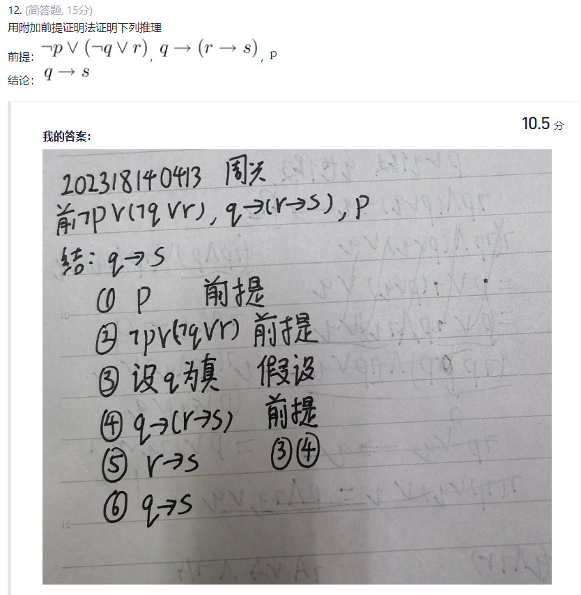
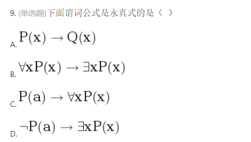

## **1.命题逻辑**

#### 注意

>   B(蕴含式,非前件则非后件)

****

#### 注意

C

****

D

****

#### 注意

C 

****

#### 注意(快速过一遍)

6.   (判断题, 6分)逻辑连接词  满足结合律(F)
7.   T
8.   T

9.F

**10.F**

>   (注意真假,析取假,合取真,析取极大,合取极小)
>
>   正确的说法应该是：
>
>   **一个合取范式是永真式当且仅当它的每个简单析取式都是永真式。**
>
>   或者反过来说：
>
>   **一个析取范式是永假式当且仅当它的每个简单合取式都是永假式。**

****

## **2.数理逻辑**

#### 注意

A

****

#### **注意**

B

>   同一命题公式的主析取范式和主合取范式都是**唯一**的。

****

#### **注意(2^0+ 2^1 = 3)**

****

注意(题目问题)

C

****

#### **注意**

B

>   **量词后面必须紧跟一个变量**
>
>   **使用括号明确量词作用域**
>
>   **使用正确的逻辑联结词(不能不写或者使用逗号/顿号)**
>
>   **约束关系不能冲突(即不能既自由又约束)**
>
>   A:相同量词约束了一个变量x(换名规则修改)
>
>   C:违反2和3:Ax和By的联结词不存在,语义错误
>
>   D:使用逗号而不是逻辑联结词

****

#### 注意

C

****

#### **注意**

D

>   

****

C

****

A

****

B

>   AD都没有前束
>
>   C是存在否定,需要移到后面(**三次德摩根的推广**)
>
>   >   
>   >
>   >   

****

## **3.数理逻辑2**

B

****

#### **注意(一直展开一直分类)**

D

>   

****

C

****

A

****

#### **注意**

A

****

D

****

B

****

#### **注意**

C

>   **(注意A选项和C选项有点小差异)**
>
>   这个公式的含义是“存在一个 y，使得对于所有的 x，x - y = 2 都成立”。
>
>   >   如果找到一个y,那么x将会成为一个定值
>
>   这个公式的含义是“对于所有的 x，都存在一个 y，使得 x - y = 2 成立”。

****

#### 注意(全体推部分没问题)

****

**注意(合式公式的必要条件)**

>**原子公式：** 单个命题变元或命题常项是合式公式。
>
>**否定联结词：** 如果 A 是合式公式，则 ¬A 也是合式公式。
>
>**二元联结词：** 如果 A 和 B 是合式公式，则 (A ∧ B), (A ∨ B), (A → B), (A ↔ B) 也是合式公式。
>
>**有限性：** 只有有限次地应用上述规则形成的符号串才是合式公式。
>
>****
>
>A. (P ∨ → Q) 缺少连接对象。∨ 是一个二元联结词，需要连接两个命题
>
>C. (P - Q) 使用了非标准的联结词“-”
>
>**D. ∧Q → R ∧ 前面缺少连接对象。∧ 是一个二元联结词，需要连接两个命题。

****

## **4.集合论**

#### 注意

C

>⊂ 意味着 A 中的**所有元素**都必须是 B 中的元素。
>
>但是B中没有单独的a,b两个元素

****

D

****

#### **注意(等价关系的定义)**

C

>   R同时满足以下三个性质是**自反性/对称性/传递性**，则称R是A上的**等价**
>
>   R同时满足以下三个性质是**自反的/反对称/传递性**，则称R为A上的**偏序**
>
>   R同时满足以下四个性质是**自反/反对称/传递性/连通性**,则称R为A上的**全序**

****

#### 注意结论

D

****

#### 注意可比和覆盖

D

>   **A.应该是反对称**
>
>   **B.小于关系不是,整除关系是**
>
>   **C.8 和 12 都没有覆盖 2。只有 2 覆盖 4**
>
>   

#### **填空题(7/8)**

****

>   (1) {a,b,c}
>
>    dom(R)（定义域）/ran(R) (值域/像集)/ fld(R) (域)=dom+ran
>
>   限制: R={(1,a),(2, b),(3, a)},X={1,2}那么R↾X ={(1,a),(2,b)}。
>
>   像:R={(1,a),(2,b),(3,a)},X={1,3}，那么 R[X] = {a}。

****

对称

****

512

>   先求笛卡尔积的数量|A| = n，那么 |A × A| = n * n = n²。=9
>
>   再求幂集 |P(S)| = 2m = 29=512

****

****

## **5.集合论2**

B

****

#### 注意

C(先2*2得到4个笛卡儿积的数量,然后2^4得到二元关系数量)

****

#### 注意

B 

>   每一种集合划分都对应着该集合上的等价关系
>
>   给定一个划分，可以定义一个等价关系.给定一个等价关系，可以得到一个划分

****

#### **注意**

>   C.15
>
>   幂集的大小只是表示**子集的所有可能性**，而等价关系却表示**集合的划分**，这是两个完全不同的概念。
>
>   等价关系本质上是将集合划分为若干个**不相交的等价类**(使用贝尔数)
>
>   

****

B

****

## 证明 (F◦G)⁻¹ **=** G⁻¹◦F⁻¹

>   $$
>   1.对左侧方程:(x, y) ∈ (F◦G)⁻¹\quad
>   \therefore (y, x) ∈ F◦G。
>   \\ \\
>   2.添加中间变量z,存在一个 z ∈ A，使得 (y, z) ∈ G 并且 (z, x) ∈ F。
>   \\ \\
>   \therefore(x, z) ∈ F⁻¹ 并且 (z, y) ∈ G⁻¹
>   \\ \\
>   \therefore  (x, y) ∈ G⁻¹◦F⁻¹。
>   $$
>
>   $$
>   对右面一样,引入z\\ \\
>   在一个 z ∈ A，使得 (x, z) ∈ F⁻¹ 并且 (z, y) ∈ G⁻¹。
>   \\
>   (x, z) ∈ F⁻¹ 意味着 (z, x) ∈ F。\\
>   (z, y) ∈ G⁻¹ 意味着 (y, z) ∈ G。\\
>   \\
>   ，(y, x) ∈ F◦G 意味着 (x, y) ∈ (F◦G)⁻¹。
>   $$
>
>   

## 证明 F◦(G∪H)=(F◦G)∪(F◦H)

>   $$
>   证明 F◦(G∪H) ⊆ (F◦G)∪(F◦H)
>   \\
>   对方程左侧有(x, y) ∈ F◦(G∪H)
>   \\
>   存在一个 z，使得 (x, z) ∈ (G∪H) 并且 (z, y) ∈ F。
>   \\
>   \\
>   因为 (x, z) ∈ (G∪H)，根据并集的定义
>   \\这意味着 (x, z) ∈ G 或者 (x, z) ∈ H。
>   \\
>   \\
>   情况 1：(x, z) ∈ G。
>   \\
>   由于 (z, y) ∈ F，根据关系复合的定义，这意味着 (x, y) ∈ F◦G。
>   \\
>   情况 2：(x, z) ∈ H。
>   \\由于 (z, y) ∈ F，根据关系复合的定义，这意味着 (x, y) ∈ F◦H。
>   \\
>   \\
>   \therefore (x, y) ∈ (F◦G)∪(F◦H)。
>   $$
>
>   ****
>
>   $$
>   反向证明 (F◦G)∪(F◦H) ⊆ F◦(G∪H)
>   \\
>   
>   对方程左侧 (x, y) ∈ (F◦G)∪(F◦H)
>   \\
>   (x, y) ∈ F◦G 或者 (x, y) ∈ F◦H。
>   \\
>   \\
>   (x, y) ∈ F◦G:存在一个 z，使得 (x, z) ∈ G 并且 (z, y) ∈ F
>   \\
>   因为 (x, z) ∈ G，所以 (x, z) ∈ (G∪H)
>   \\
>   \\
>   (x, y) ∈ F◦H:存在一个 z，使得 (x, z) ∈ H 并且 (z, y) ∈ F。\\
>   因为 (x, z) ∈ H，所以 (x, z) ∈ (G∪H)。
>   \\
>   \\
>   在两种情况下，我们都有 (x, y) ∈ F◦(G∪H)。
>   \\
>   所以，(F◦G)∪(F◦H) ⊆ F◦(G∪H)。

>   $$

****

## 证明R◦R⁻¹是对称关系

证明如果 R 是集合 A 上的自反关系，那么 R◦R⁻¹ 是集合 A 上的对称关系

>   $$
>   假设 (x, y) ∈ R◦R⁻¹
>   \\
>   存在一个 z ∈ A，使得 (x, z) ∈ R⁻¹ 并且 (z, y) ∈ R。
>   \\
>   (x, z) ∈ R⁻¹ 意味着 (z, x) ∈ R。(直接置反)
>   \\
>   (z, x) ∈ R 并且 (z, y) ∈ R。
>   \\
>   \\
>   证明 (y, x) ∈ R◦R⁻¹
>   \\
>   存在个 w ∈ A，使得 (y, w) ∈ R⁻¹ 并且 (w, x) ∈ R。
>   \\
>   (z, y) ∈ R，根据逆关系的定义，(y, z) ∈ R⁻¹。
>   \\
>    (z, x) ∈ R。
>   \\
>   \\
>   选择 w = z。那么我们有 (y, z) ∈ R⁻¹ 并且 (z, x) ∈ R。
>   \\
>   根据关系复合的定义，这意味着 (y, x) ∈ R◦R⁻¹。
>   \\
>   得证: (x, y) ∈ R◦R⁻¹，那么 (y, x) ∈ R◦R⁻¹。
>   $$
>
>   ****
>
>   或者直接套结论但不推荐
>   $$
>   证明 (R◦R⁻¹) 是对称的，我们需要证明 (R◦R⁻¹)⁻¹ = R◦R⁻¹。
>   \\
>   关系复合的逆运算有如下性质：(F◦G)⁻¹ = G⁻¹◦F⁻¹
>   \\
>   逆运算的逆运算是其本身：(R⁻¹)⁻¹ = R
>   \\
>   因此(R◦R⁻¹)⁻¹ = (R⁻¹)⁻¹◦R⁻¹ = R◦R⁻¹
>   $$
>   

## 证明：S∩R是A上的反对称关系

已知：非空集合 A 上的二元关系 R 和 S 是反对称关系；

证明：S∩R 也是 A 上的反对称关系。

>   $$
>   假设 (a, b) ∈ S∩R 且 (b, a) ∈ S∩R。\\
>   \\
>   (a, b) ∈ S∩R 表示 (a, b) ∈ S 且 (a, b) ∈ R。\\
>   (b, a) ∈ S∩R 表示 (b, a) ∈ S 且 (b, a) ∈ R。\\
>   \\
>   因为 S 是反对称关系，且 (a, b) ∈ S 且 (b, a) ∈ S\\根据反对称的定义，我们得出 a = b。
>   \\
>   同样地，因为 R 是反对称关系，且 (a, b) ∈ R 且 (b, a) ∈ R\\根据反对称的定义，我们得出 a = b。
>   \\
>   \\
>   因此，如果 (a, b) ∈ S∩R 且 (b, a) ∈ S∩R，则 a = b
>   $$

s
