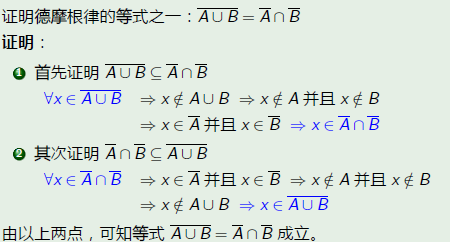
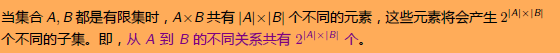
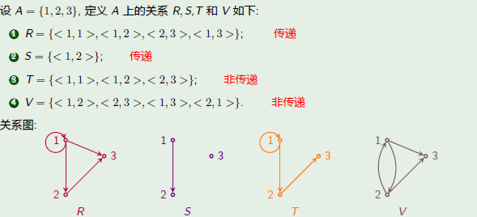
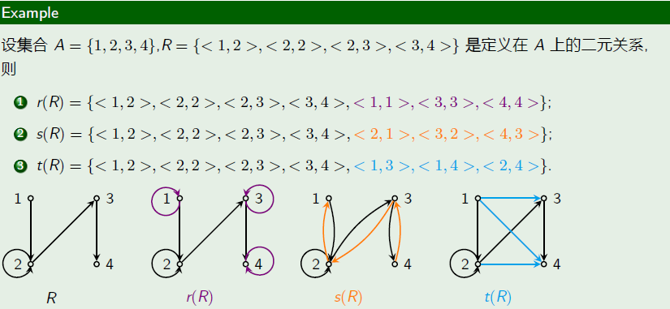

## 1.命题逻辑

析取符号$\vee$,表示或者,两真才真

合取符号$\wedge$,表示不仅而且,一真都真

## 2.命题逻辑和等价式

1.$\vee$表示并联,$\wedge$表示串联

2.基本等值式里面有个吸收律

>   $A \vee(A\wedge{B}) \Leftrightarrow A , A \wedge(A\vee{B}) \Leftrightarrow A$
>
>   两者并联,只看A开关

3.单元等值式要考虑一下

>   

4.单蕴含:$A \rightarrow B \Leftrightarrow $ $\neg{A}\vee{B} $

>   $A \rightarrow B \Leftrightarrow \neg{B} \rightarrow \neg{A}$

5.双蕴含:$A \leftrightarrow B  \Leftrightarrow $${(\neg{A} \vee{B}) \wedge{(\neg{B} \vee{A}})}$

****

6.析取范式:极小项(m)组成,真为1,否定为0,不能是永真式

7.合取范式:极大项(M)组成,真为0,否定为1,不能是永假式

8.补元,析取(并联)0开关$A \wedge{\neg{A}} \Leftrightarrow 0$,合取(串联)1开关$A \vee{\neg{A}} \Leftrightarrow 1$

>   所以补元补**相同方向的**一个**相反开关**的就行
>
>   

****

9.联结词完备集::$\{\wedge,\vee,\rightarrow,\leftrightarrow\}$以及它的子集都不是联结词完备集

## 3.命题逻辑的推理

1.命题证明方式:等值运算法(化简,但不能证明不成立)/主析取范式法/假设赋值法

2.自然推理(PT规则:前提开始慢慢推)

>
>
>
>
>

3.蕴含式:附加前提(CP PT规则:假设结论):设结论蕴含式前件为真

4.归谬法(反证法):结论取反后加入前提

## 4.一阶逻辑

1.**所有个体还是全总个体域(默认全总个体域)**

>   所有个体:直接量词+谓词$\forall xG(x)$
>
>   全总个体域:**F(x)为个体**,G(x)为动作
>
>   >   量词为所有:$\forall x (F(x)\rightarrow G(x))$
>   >
>   >   量词为存在:$\exists x(F(x)\wedge G(x))$

2.多个个体项的描述:个体项之间只用合取(表示和)

3.自由变元和约束变元:改名原则和代入规则(新个体换旧个体)

4.闭式:无自由出现的个体变元

5.解释:分多种情况考虑代入不同的x

>   

6.谓词演算中的等价式:换名规则/否定内移的量词转换/量词辖域扩张/全体推部分

>   

7.自然推理系统NL

>自然推理系统NL是**在自然推理TP规则的基础上**添加了量词的扩张收缩消去的过程.
>
>

8.总结:

>   1.   结论是“条件形式”或“析取形式”，使用 CP 规则(假设前件为真)
>   2.   结论需要消去量词:
>
>   >   全称消去:如果有 ∀x P(x)，则可以推出 P(a)，a 是个体域中的任意个体。
>   >
>   >   存在消去:如果有 ∃x P(x)，则可以推出 P(a)，a 是一个新的个体常量
>
>   3.   结论需要引入量词:
>
>   >   全称引入:如果可以推出 P(a)，a 是任意个体，则可以推出 ∀xP(x)
>   >
>   >   存在引入:如果有 P(a)，a 是个体域中的某个个体，则可以推出 ∃x P(x)。
>
>   4.   证明题：使用命题演算中的直接证明和间接证明(正推)
>   5.   操作子公式需要引入导线
>   6.   证明含有量词的公式,最好只使用等价公式和基本蕴含式

## 4.5 求前束范式

>   所有变部分
>
>   
>
>   >   也可以消蕴含:
>   >   $$
>   >    ⇔ ¬(∃x(F(x)→G(x,y))) ∨ (∀yH(y)→∀zR(y,z))\\
>   >   \\
>   >   ⇔ ¬(∃x(¬F(x)∨G(x,y))) ∨ (¬(∀yH(y)) ∨ ∀zR(y,z))
>   >   \\
>   >   (消去否定量词)
>   >   \\
>   >   ⇔ (∀x ¬(¬F(x)∨G(x,y))) ∨ (∃y ¬H(y) ∨ ∀zR(y,z))\\
>   >   \\
>   >   ⇔ (∀x (F(x)∧¬G(x,y))) ∨ (∃y ¬H(y) ∨ ∀zR(y,z))
>   >   \\
>   >   (前半部分有y,可能会引起歧义)
>   >   \\
>   >   ⇔ (∀x (F(x)∧¬G(x,y))) ∨ (∃w ¬H(w) ∨ ∀zR(w,z))
>   >   \\
>   >   (前束范式)
>   >   \\
>   >   ⇔ ∀x ∃w ∀z ( (F(x)∧¬G(x,y)) ∨ (¬H(w) ∨ R(w,z)) )
>   >   $$
>   >   

## 5.等价关系

1.集合的基数

2.证明题

3.二元关系数量(先求A*B,然后再取幂)

4.关系的复合运算

5.关系的逆运算

6.限制和像(先写限制再写像)

>   

7.自反性

自反:都有自环**(必须每个都有!!)**

反自反:完全没有任何自环**(必须每个都没有!!)**

8.对称性(对称:自环对称边对称,反对称:边不对称/不存在边)

9.传递性(序列中应传尽传)

10.闭包求解(按照基本要求补全)

11.关系分类

>   R同时满足以下三个性质是**自反性/对称性/传递性**，则称R是A上的**等价**
>
>   R同时满足以下三个性质是**自反的/反对称/传递性**，则称R为A上的**偏序**
>
>   R同时满足以下四个性质是**自反/反对称/传递性/连通性**,则称R为A上的**全序**

12.可比与覆盖

>   

