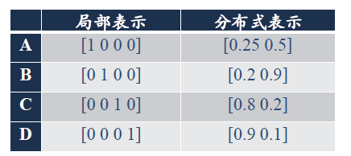

# **Chap1:Introduction**

[(Obligatory)chap1(Introduction)概述]((Obligatory)chap1(Introduction)概述.pptx)

**<font color=red>损失函数(单个样本) = 风险函数(整个样本)</font>**

## **0.领域划分**

###### **1.神经网络与深度学习**

**神经网络:一种以神经元为基本单元的模型**

**深度学习:一类以机器学习问题,主要解决贡献度分配问题**

**神经网络与深度学习:人工智能的一个领域**

>   

###### **2.深度学习课程概述**

>   
>
>   

###### **3.顶会**


###### **4.图灵测试**

“一个人在不接触对方的情况下，通过一种特殊的方式，和对方进行一系列的问答。如果在相当长时间内，他无法根据这些问题判断对方是人还是计算机，那么就可以认为这个计算机是智能的”。
						---Alan Turing [1950]

**目的:图灵测试是促使人工智能从哲学探讨到科学研究的一个重要因素，引导了人工智能的很多研究方向。因为要使得计算机能通过图灵测试，计算机必须具备理解语言、学习、记忆、推理、决策等能力。**

###### **5.人工智能**

**定义:人工智能就是让机器具有人类的智能(计算机控制+智能行为)**

**<font color=red>标志性事件:1956年达特茅斯(Dartmouth)会议提出了人工智能的名称</font>**

**进化方向:**

>

## **1.发展历史**


## **2.开发人工智能系统**

###### **1.专家知识(人工规则)**

###### **2.机器学习构建映射函数f()**

###### **3.对样本提取特征,设计学习算法,对输入进行预测**

****

###### **4.对于知识的处理**

>

## **3.机器学习与数据表示**

###### **1.机器学习的基本流程**


**1.数据预处理**

>   对数据的原始形式
>
>   初步的数据清理（去掉一些有缺失特征的样本，或去掉一些冗余的数据特征等）
>
>   初步的数据加工（对数值特征进行缩放和归一化等）
>
>   并构建成可用于训练机器学习模型的数据集

**2.特征提取**

>从数据的原始特征中提取一些对特定机器学习任务有用的高质量特征
>
>在图像分类中提取边缘、尺度不变特征变换特征
>
>在文本分类中去除停用词等

**3.特征转换**

>对特征进行进一步的加工，比如降维和升维
>
>降维包括特征抽取和特征选择
>
>常用的特征转换方法:主成分分析/线性判别分析

**4.预测**

>   学习一个函数并进行预测

###### **2.机器学习和浅层学习**

浅层学习:不涉及特征学习,特征主要靠人工经验或特征转换方法抽取

>   **所以机器学习模型的性能主要取决于数据的好坏**

###### **3.机器学习的核心:数据表示**

>   **机器学习->需要数据表示->需要人类智能(==进行目标的明确==)**

## **4.表示学习**

###### **1.表示学习**

>   **1.定义:表示学习是如何自动从数据中学习好的表示**
>
>   **2.过程:初见提高特征表示维度(从底层特征->中层特征->高层特征),提升预测准确性**
>
>   **3.好的表示学习策略必须具备一定的深度**
>
>   >   深度:输入到输出之间的路径
>   >
>   >   (涉及信用分配:将预测的误差（或信用）反向传播回网络的每一层)
>   >
>   >   **Schmidhuber: 10 is sure deep**
>
>   >特征重用:指数级的表示能力
>   >
>   >抽象表示与不变性:抽象表示需要多步的构造

###### **2.传统的特征提取和表示学习**

**传统的特征提取**

>   **线性投影:通过线性变换将原始数据投影到一个新的低维子空间中。**
>
>   >   **PCA (Principal Component Analysis，主成分分析)** 
>   >
>   >   一种无监督的线性降维方法，旨在找到数据中==方差最大的几个主成分==，并将数据投影到这些主成分所张成的子空间中。
>   >
>   >   **LDA (Linear Discriminant Analysis，线性判别分析)** 
>   >
>   >   一种监督的线性降维方法，旨在找到能够==最大化类别之间距离并最小化类别内部距离的投影方向==，从而更好地进行分类。
>
>   **非线性嵌入:数据呈现复杂的非线性结构,通过非线性变换将数据映射到低维空间**
>
>   >   **LLE (Locally Linear Embedding，局部线性嵌入)**
>   >
>   >   一种非线性降维方法，假设每个数据点都可以由其邻居点的线性组合表示，并在低维空间中保持这种局部线性关系。
>   >
>   >   **Isomap (Isometric Mapping，等距映射)** 
>   >
>   >   一种非线性降维方法，旨在保持数据点之间的测地距离（沿着数据流形的距离），即使在降维后也能反映原始数据的全局结构。
>   >
>   >   **谱方法 (Spectral Methods)**
>   >
>   >   一类基于图论的降维方法，通过构建数据的相似性图，并分析图的谱（例如，拉普拉斯矩阵的特征向量）来实现降维。
>
>   **自编码器**
>
>   >**自编码器 (Autoencoders)** 
>   >
>   >它通过训练一个神经网络来重构输入数据，中间的瓶颈层（编码层）的输出可以被认为是原始数据的一种低维表示或提取的特征。

**特征提取与表示学习**

>   特征提取:基于任务或先验对去除无用特征(特征工程)
>
>   >   解释:传统的特征提取通常需要人工设计或选择特征，并且很大程度上依赖于对任务的理解和领域知识。目标是去除被认为对任务无用的特征。
>
>   表示学习:通过深度模型学习高层语义特征
>
>   >   解释:旨在让模型自动地从原始数据中学习到有用的、层次化的特征表示。这些特征通常具有更高的语义含义，并且能够更好地适应各种下游任务，而无需过多的人工干预。

###### **3.表示学习的主要问题:语义鸿沟**

>   **人们对图像文本的理解无法直接从 底层特征 直接获取**
>
>   (即人们对图像的理解不是基于像素值)

###### **4.表示学习中好的数据表示**

>   **1.应该具有很强的表示能力**
>
>   **2.应该使后序的学习任务变得简单**
>
>   **3.应该具有一般性,是任务或领域独立的**

###### **5.数据语义的表示形式**

>   **局部表示:离散表示(符号表示)/独热编码表示**
>
>   >   **<font color=deeppink>缺陷:太长了,余弦相似性无法进行(向量积是0)</font>**
>   >
>   >   
>
>   **分布式表示:压缩\低维\稠密向量**
>
>   >   **<font color=red>优势:可以用O(N)个参数表示O(2k)区间</font> **
>   >
>   >   **受限玻尔兹曼机/稀疏编码/自编码器/多层神经网络**
>   >
>   >   **都可以使用 O(N) 个参数来表示高达 O(2<sup>k</sup>) 的输入区域**
>
>   


## **5.深度学习**

**<font color=deeppink>深度学习是机器学习的一个子问题,其主要目的是从数据中自动学习到有效的特征表示</font>**

**<font color=red>1.深度学习=表示学习+机器学习(决策学习)</font>**

>   通过构建具有一定“深度”的模型，可以让模型来自动学习好的特征表示（从底层特征，到中层特征，再到高层特征），从而最终提升预测或识别的准确性。
>
>   

###### **2.深度学习的关键问题:贡献度分配(CAP)**

>**(Credit Assignment Problem，CAP)**
>
>**即一个系统中不同的组件或其参数对最终系统输出结果的贡献或影响**
>
>**<font color=red>关键问题在于:</font>**
>
>```txt
>深度学习可以看作一种强化学习（Reinforcement Learning，RL），
>每个内部组件并不能直接得到监督信息，需要通过整个模型的最终监督信息（奖励）
>得到，并且有一定的延时性．
>```

###### **3.端到端学习**

>   ==**定义:是指在学习过程中不进行分模块或分阶段训练，直接优化任务的总体目标**==
>
>   **优点:不需要对每个模块进行单独优化+前一步的错误不会传播到后面**

###### **4.数学描述**

 

>   其中每个f()一般都是偏导数

## **6.神经网络**

###### **1.赫布法则**

>   
>
>   **其中短期记忆转化为长期记忆的过程称为凝固作用**

###### **2.人工神经元**

>   **1.人工神经元(求和->非线性处理->激活)**
>
>   
>
>   **2.激活函数**
>
>   

###### **3.人工神经网络的三方面**

**a.神经元的激活规则**

>**主要是指神经元输入到输出之间的映射关系，一般为非线性函数。**

**b.网络的拓扑结构**

>**不同神经元之间的连接关系。**

**c.学习算法**

>**通过训练数据来学习神经网络的参数。**

###### **4.人工神经网络的结构**

>   人工神经网络由神经元模型构成
>
>   这种由许多神经元组成的信息处理网络具有并行分布结构。
>
>   虽然这里将神经网络结构大体上分为三种类型，但是大多数网络都是复合型结构，即一个神经网络中包括多种网络结构。


****


>   其中f()是一种提取特征的规则(一般是偏导数)

****


求和->非线性处理->激活

****

网络的拓扑结构:是否循环算法

>   
>
>   前馈神经网络/记忆网络/图网络
>
>   >   **1.前馈神经网络**
>   >
>   >   
>   >
>   >   
>   >
>   >   **求偏导数大->这个方向重要**
>   >
>   >   
>   >
>   >   

****


