# **chap2(ML&SVM)支持向量机线性模型**

[(Obligatory)chap2(ML&SVM)支持向量机线性模型]((Obligatory)chap2(ML&SVM)支持向量机线性模型.pptx)

## **1.机器学习**

#### **1.机器学习定义**

>**机器学习就是让计算机从数据中进行自动学习，得到某种知识（或规律）**
>
>(在早期的工程领域，机器学习也经常称为模式识别PR)

对于固定的无法学习的参数,叫做超参数

#### **2.机器学习基本概念**

**数据名词:**

>   **1.特征:对象的特征(颜色大小形状)->所有特征构成特征向量$x =[x_1,x_2,\cdots,x_n]^T $**
>
>   **2.标签(属性Attribute):预测的内容(可以是连续值[分数],可以说离散值[是否])**
>
>   **3.样本(Sample)/示例(Instance):一个标记好的特征+标签**
>
>   **4.数据集(Dataset):一系列样本组成的集合->训练集+测试集**

**独立同分布（Identically and Independently Distributed，IID）:**

>   即样本独立地从相同的数据分布中抽取的<font color=deeppink>和样本内部分布无关</font>
>   $$
>   \mathbb{D} = \{(x^{(1)},y^{(1)}),(x^{(2)},y^{(2)}),\cdots,(x^{(N)},y^{(N)})\}
>   $$

**预测函数$f^{*}(x) $:表示特征向量x和标签y之间的映射关系,可以用来求**

>   **1.预测标签的值:$\hat{y} = f^{*}(x) $**
>
>   **2.标签的条件概率:$\mathbb{P}(y|x) = f^{*}_y(x) $**

**训练:通过学习算法$\mathbb{A} $寻找最优预测函数**

**准确率:IID抽取测试集$\mathbb{D^{'}} $,计算准确率**

>   $$
>   Acc(f^{(*)}(x)) = \frac{1}{|\mathbb{D}^{'}|}\sum_{(x,y)\in D}I(f^{*}(x))\\
>   I为指示函数,|\mathbb{D^{'}}|表示数据集的大小
>   $$

#### **3.机器学习的基本流程**

>   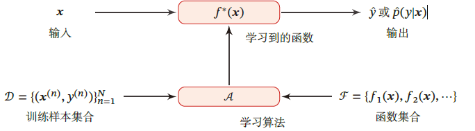

## **2.机器学习的三个基本要素**

##### **1.模型**

>   **目的:找到一个模型近似真实映射函数$g(x)$或真实条件概率分布$p_r(y|x) $**
>
>   **->不知道具体形式,需要假设函数==集合==$\mathbb{F} $,称为==假设空间==**
>   $$
>   \mathbb{F} = \{f(x;\theta)|\theta\in \mathbb{R}^D \}\\
>   \\
>   其中f(x;\theta)称为模型,D称作参数的数量
>   $$

###### **a.线性模型:(参数化的线性函数族)**

>   $$
>   f(x;\theta) = \omega^T x+b\\
>   \\
>   其中参数𝜃 包含了权重向量𝒘 和偏置𝑏．
>   $$

###### **b.非线性模型:<font color=deeppink>(多个非线性基函数$\Phi(x) $的线性组合)</font>**

>   $$
>   f(x;\theta) = \omega^T \Phi(x)+b\\
>   \\
>   其中参数𝜃 包含了权重向量𝒘 和偏置𝑏．
>   $$

###### **c.可学习的非线性模型**

>   **==等价于神经网络==**
>   $$
>   \Phi_k(x) = h (\omega^T_k \Phi'(x)+b_k),\forall 1\leq k \leq K \\
>   \\
>   其中h(\cdot)表示非线性函数,\Phi'(x)是另一组基函数,\omega_k b_k是可学习的参数
>   \\
>   此时f(x;\theta)就等价于神经网络
>   $$

****

##### **2.学习准则**

**前提:训练集独立同分布+样本分布$p_r(x,y) $是固定的**

###### **模型评判准则A:(通过预测数据)**

>   **1.好的模型应该在所有(x,y)的可能取值上都与真实映射函数y=g(x)一致**
>   $$
>   |f(x,\theta^*)-y|<\epsilon,\quad(\forall(x,y)\in \mathbb{X}\times\mathbb{Y})
>   $$
>   **2.好的模型应该在所有样本的可能取值上都与真实概率$p_r(y|x) $分布一致**
>   $$
>   |f_y(x,\theta^*)-p_r(y|x)|<\epsilon \quad(\forall(x,y)\in \mathbb{X}\times\mathbb{Y})
>   $$

###### **模型评判准则B:(通过期望风险ER)**

>   **计算==真实数据分布==上的平均损失**
>
>   >   **优点:它反映了模型在未来未见过的数据上的表现。**
>
>   $$
>   E\mathbb{R}(\theta) = \mathbb{E}_{(x,y)~p_r(x,y)}[\mathbb{L}(y,f(x;\theta))] \\
>   \\
>   其中p_r(x,y)为真实的数据分布,\mathbb{L}(y,f(x;\theta))为损失函数
>   $$

###### **模型评判准则C:(通过经验风险ER)**

>   **不知道真实的数据分布和映射函数,无法计算期望风险$\mathbb{R}(\theta) $,但是可以计算平均损失**
>
>   **计算==训练数据集==上的平均损失**
>
>   >   **优点:如上,经验风险通常被用作期望风险的一个近似。**
>
>   $$
>   ER^{emp}_D(\theta) = \frac{1}{N} \sum_{i=1}^{N} L(y^{(n)},f(x^{(n)};\theta))
>   $$

**<font color=red>学校直接把loss func当准则..</font>**

###### **期望风险 vs 经验风险**

**1.从选择的角度看**

>   **期望风险优先考虑,它本身是后验概率,提供更多信息**
>
>   ==使用经验风险来近似期望风险会产生误差==,但是本身是可训练的(梯度下降优化)
>
>   经验风险和期望风险的误差:泛化误差**<font color=red>(真正的优化的目标)</font>**
>
>   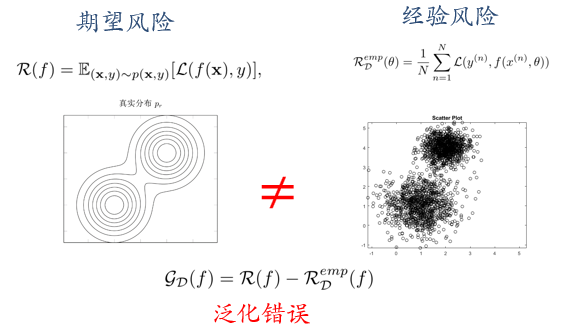

**2.从数学的角度看**

>   **根据大数定理,当训练集无穷大的时候,==经验风险==就趋向于==期望风险== **
>
>   **但是基于经验风险最小化原则,导致模型==在未知数据集上错误率高==:过拟合**

###### **?模型评判标准D:结构风险(SRM)**

>   **在经验风险ER的基础上引入正则化项,避免过拟合**
>   $$
>   \theta^* = argmin_{\theta}\frac{1}{N} \sum_{i=1}^{N} L(y^{(n)},f(x^{(n)};\theta)) + \frac{1}{2}\lambda||\theta||^2
>   \\
>   ||\theta||^2是L2范数的正则化项,\lambda控制正则化强度
>   $$

###### <font color=Deeppink>**==(损失函数)==**</font>

>   **用来量化模型预测和真实标签之间的差异**
>
>   **a.0-1损失函数(0-1 Loss Function）**
>
>   >$$
>   >\mathbb{L}(y,f(x;\theta)) = \{
>   >\begin{matrix}
>   >0 & if \ y=f(x;\theta) \\
>   >1 & if \ y \not = f(x;\theta)
>   >\end{matrix}
>   >$$
>   >
>   >**<font color=deeppink>数学性质极差,不连续且导数等于0,难以优化</font>**
>
>   **b1.平方损失函数（Quadratic Loss Function）**
>
>   >$$
>   >\mathbb{L}(y,f(x;\theta)) =\frac{1}{2}(y-f(x;\theta))^2
>   >$$
>   >
>   >**<font color=deeppink>一般不适用于分类问题</font>**
>
>   **b2.均方误差损失函数 (Mean Squared Error - MSE)**
>
>   >   $$
>   >   MSE = \frac{1}{n} \sum_{i=1}^{n} (yᵢ - ŷᵢ)²
>   >   $$
>   >
>   >   **<font color=deeppink>但是在线性回归的论文中,一般除以2用于抵消分母</font>**
>   >   $$
>   >   if成本函数:J(\theta) = \frac{1}{2m} \sum_{i=1}^{m} (h_\theta(x_i) - y_i)^2 = \frac{1}{2m} \sum_{i=1}^{m} (x_i^T \theta - y_i)^2
>   >   \\
>   >   计算 J(\theta) 对 \theta_j 的偏导数
>   >   \\
>   >   \frac{\partial J(\theta)}{\partial \theta_j} = \frac{1}{2m} \sum_{i=1}^{m} 2 (h_\theta(x_i) - y_i) \frac{\partial}{\partial \theta_j} (x_i^T \theta)
>   >   \\
>   >   \frac{\partial J(\theta)}{\partial \theta_j} = \frac{1}{m} \sum_{i=1}^{m} (h_\theta(x_i) - y_i) x_{ij}
>   >   $$
>   >   **实现代码:**
>   >
>   >   ```python
>   >   # Mean Squared Error, MSE
>   >   # 优点: 数学性质好易于求导优化；对大误差惩罚力度大，使得模型更关注减少大误差
>   >   # 缺点: 对异常值(outliers)非常敏感，异常值会显著增大 MSE
>   >   def costFunction(X, y, theta):
>   >       # 1. 计算预测值 (Hypothesis) \hat{y}
>   >       h = X @ theta # 使用矩阵乘法计算预测值h,可以一次性计算所有预测值
>   >       # 2. 计算误差 (Errors)	error
>   >       errors = h - y
>   >       # 3. 计算平方误差 (Squared Errors)
>   >       squared_errors = errors ** 2
>   >       # 4. 计算均方误差 (Mean Squared Error)
>   >       cost = np.sum(squared_errors) /len(y)  # 除以 2m
>   >       return cost
>   >    ```
>   >   
>   >
>   
>**c.交叉熵损失函数（Cross-Entropy Loss Function）**
>   
>>**==首先需要对标签进行独热编码==**
>   >$$
>   >p(y=c|x;\theta) = f_c(x;\theta)
>   >\\
>   >并且f_c(x;\theta)\in[0,1],\sum^{C}_{c=1}f_c(x;\theta) =1
>   >$$
>   >**<font color=deeppink>对于两个概率分布,使用CE衡量它们的差异</font>**
>   >$$
>   >\mathbb{L}(y,f_c(x;\theta)) = -y^T log f(x;\theta) = -\sum^{C}_{C=1}y_clogf_c(x;\theta)
>   >$$
>   >
>   >>   **比如标签向量$y= [0,0,1]^T $,模型预测的分布$f(x;\theta)=[0.3,0.3,0.4]^T $**
>   >>   $$
>   >>   \therefore L(f(x;\theta))=-(0\times log(0.3)+0\times log(0.3)+1\times log(0.4))=-log(0.4)
>   >>   $$
>   >
>   >**<font color=red>注意$f_c(x;\theta)$也可以看作似然函数,所以交叉熵损失可以看作==负对数似然函数==</font>**
>   
>**d.Hinge损失函数(二分类问题)**
>   $$
>   假设y\in\{-1,+1\},f(x;\theta)\in  \mathbb{R}\\
>   \\
>   \therefore \mathbb{L}(y,f(x;\theta)) = max(0,1-yf(x;\theta))
>   $$

****

###### **(过拟合)**

**1.过拟合定义**

>   **给定假设空间$\mathbb{F} $中的一个假设f,如果存在其它f'也属于$\mathbb{F} $**
>
>   **使得==在训练集上== f的损失 比 f'的损失 小**
>
>   **但在==整个样本空间上==f'的损失 比 f的损失 小**
>
>   就称f过度拟合训练数据

**2.引起过拟合的原因**

>   **训练数据少/噪声/模型能力强**

**3.解决过拟合的方法**

>   **a.数据增强**
>
>   **==b.训练的时候引入正则化项==(Regularization)**
>
>   **c.Dropout适当降低模型能力**

**4.不同的拟合关系**

>   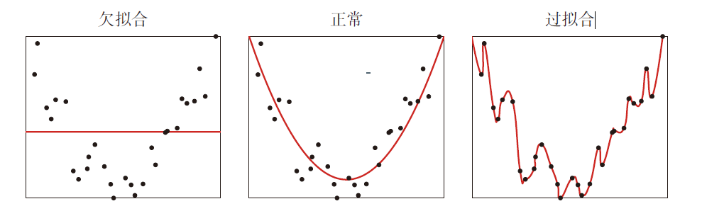

****

###### (Eg)

我们使用平方误差损失函数：$L(h(x), y) = (h - y)^2$。(高斯分布y~N(5,1))

**期望风险ER:**

>   $$
>   ER(h) = E_{y ~ N(5, 1)} [(h - y)^2]
>   \\
>   \Leftrightarrow ER(h) = \int_{-\infty}^{\infty} (h - y)^2 \frac{1}{\sqrt{2\pi}} e^{-\frac{(y - 5)^2}{2}} dy
>   $$
>
>   找到最小化期望风险的最优模型h，我们可以对ER(h)关于h求导并令导数为零：
>   $$
>   \begin{align}
>   \\
>   \frac{d}{dh} ER(h) &= \frac{d}{dh} E[(h - y)^2] = E[\frac{d}{dh} (h - y)^2] 
>   \\
>   \\
>   &= E[2(h - y)] = 2(h - E[y])\rightarrow 0 \\
>   \\
>   \end{align}
>   \\
>   $$
>
>   $$
>   \therefore h = E[y]=5
>   ER(5) = E[(5 - y)^2] = Var(y) = 1
>   $$

**经验风险ER:**

>$$
>ER_emp(h) = \frac{1}{N} \sum_{i=1}^{N} (h - y_i)^2
>$$
>
>找到最小化期望风险的最优模型h，我们可以对$ER_{emp(h)}$关于h求导并令导数为零：
>$$
>\begin{align}
>\frac{d}{dh} ER_emp(h) &= \frac{d}{dh} \frac{1}{N} \sum_{i=1}^{N} (h - y_i)^2 = \frac{1}{N} \sum_{i=1}^{N} 2(h - y_i) \\&= 2(h - \frac{1}{N} \sum_{i=1}^{N} y_i)
>\end{align}
>$$
>
>$$
>2(h - \frac{1}{N} \sum_{i=1}^{N} y_i) = 0  =>  h = \frac{1}{N} \sum_{i=1}^{N} y_i = \bar{y}
>$$
>
>$$\therefore ER_emp(\bar{y}) = \frac{1}{N} \sum_{i=1}^{N} (\bar{y} - y_i)^2$$

****

##### **3.优化算法**

###### **1.参数与超参数**

**参数:$f(x;\theta) $中的$\theta$就是模型的参数<font color=deeppink>(最优化问题)</font>**

**超参数:定义==模型结构==和==优化策略== 的参数<font color=deeppink>(组合优化问题-经验论)</font>**

>   **优化方法有限:网格搜索/随机网格搜索/贝叶斯(网格)搜索**

>   **Eg:**
>
>   **聚类算法:类别的个数**
>
>   **梯度下降法:步长**
>
>   **正则化项:系数**
>
>   **SVM:核函数**

###### **2.早停法(Early Stop)**

**主要思想:如果在验证集上的错误率不再下降，就停止迭代**

>   **所以前提是还需要验证集(Validation Set)**
>
>   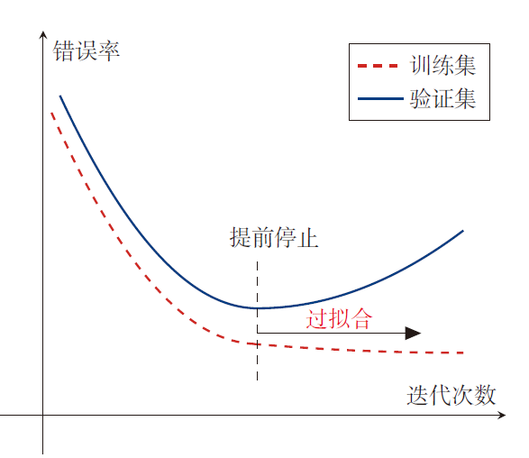

###### ==**3.(N个)梯度下降法(批量梯度下降法BGD)**==

**凸函数:凸优化(共轭梯度/拟牛顿化)**

**非凸函数:最简单的梯度下降法**
$$
\theta_{i+1} = \theta_i - \alpha\frac{\partial \mathbb{D}(\theta)}{\partial\theta} = \theta_i - \alpha\frac{1}{N}\sum^{N}_{n=1} \frac{\partial \mathbb{L}(y^{(n)},f(x^{^{(n)}};\theta))}{\partial\theta}(\alpha是学习率)
$$

>   **直接将整个训练集的风险函数作为目标函数,开销巨大**
>
>   ```python
>   def gradienDescent(X,y,theta,alpha,iters):
>       costs = []
>       for i in range(iters):
>           # forall error
>           predictions = X @ theta 
>           # forall error
>           errors = predictions - y 
>           # 使用平均后的一个临时样本影响全局预测
>           gradient = (1 / len(y)) * (X.T @ errors)  
>           # 注意这一步是向量形式的计算
>           theta = theta - alpha * gradient
>           cost = costFunction(X, y, theta)
>           costs.append(cost)
>       return theta,costs
>   ```

###### ==**4.(n个)小批量梯度下降法**==

**思想:"计算机的并行能力"和"局部最优解处理能力"的trade-off**

>==随机选取==一小部分训练样本来计算梯度并更新参数
>$$
>\theta_{t+1} \leftarrow \theta_t - \alpha \frac{1}{k}\sum_{(x,y)\in S_t}\frac{\partial\mathbb{L}(y,f(x;\theta))}{\partial \theta}
>$$
>
>```python
>def miniBatchGradientDescent(X, y, theta, alpha, iters, batch_size):
>    costs = []
>    m = len(y)
>    for i in range(iters):
>        random_start = np.random.randint(0, m - batch_size)
>        indices = np.arange(random_start, random_start + batch_size)
>        xi = X[indices]
>        yi = y[indices]
>
>        prediction = xi @ theta
>        error = prediction - yi
>        gradient = (1/batch_size) * xi.T @ error
>        theta = theta - alpha * gradient
>        if i % 100 == 0:
>            cost = costFunction(X, y, theta)
>            costs.append(cost)
>    return theta, costs
>```


###### ==**5.(1个)随机梯度下降法(Stochastic Gradient Descent,SGD)**==

**思想:数据之间独立同分布,小样本的优化等于整体的优化**

>   只使用1个样本计算出的==经验风险梯度==来近似==期望风险梯度==
>
>   (经过足够的迭代,随机梯度下降可以收敛到局部最优解)
>
>   **<font color=deeppink>随机梯度下降相当于在批量梯度下降的梯度上引入了随机噪声</font>**
>
>   **<font color=deeppink>在非凸优化问题中，随机梯度下降更容易逃离局部最优点．</font>**
>
>   (这里的噪声指的是迭代方向的随机)
>   $$
>   \theta_{t+1} = (\theta_t-\alpha\frac{\partial J}{\partial \theta_0})
>   $$
>
>   ```python
>   def stochasticGradienDescent(X, y, theta, alpha, iters):
>       costs = []
>       m = len(y)
>       for i in range(iters):
>           random_index = np.random.randint(m)
>           xi = X[random_index:random_index+1] 
>           yi = y[random_index:random_index+1] 
>     		# Single prediction
>           prediction = xi @ theta
>           # Single error
>           error = prediction - yi
>           # 使用一个样本影响全局预测
>           gradient = xi.T @ error  
>           theta = theta - alpha * gradient
>           if i % 100 == 0: 
>               cost = costFunction(X, y, theta)
>               costs.append(cost)
>       return theta, costs
>   ```
>

****

## **3.线性回归**

#### **1.线性回归的基本概念**

**定义:线性回归是一种对自变量和因变量之间关系进行建模的回归分析．**

>   **自变量数量为1时称为简单回归**
>
>   **自变量数量大于1时称为多元回归**

**基本概念**

>   自变量:样本的特征向量$𝒙 ∈ ℝ^𝐷$（每一维对应一个自变量），
>
>   因变量是标签𝑦，这里$𝑦 ∈ ℝ $是连续值（实数或连续整数）
>
>   空间是一组参数化的线性函数:
>   $$
>   f(x;\omega,b) = \omega^T x +b = \hat{\omega}^T\hat{x}\\
>   \\
>   (f(x;\omega,b)称作线性模型,\omega\in \mathbb{R}^D和b \in \mathbb{R}^D均是可学习的参数)
>   $$
>   **<font color=deeppink>注意$\hat{\omega}$是增广权重向量,$\hat{x}$是增广特征向量</font>**
>
>   >   **<font color=deeppink>$\hat{\omega}$是增广了一行1的特征向量</font>**
>   >
>   >   **<font color=deeppink>$\hat{x}$是增广一行b的特征向量</font>**

#### **2.线性回归的参数学习**

**给定训练集$\mathbb{D} = \{(x^{(n)},y^{(n)})\}^N_{n=1} $,学习最优的模型参数$\omega$**

###### **1.经验风险最小化(基于平方损失)**

**定义:构建预测值和实际值的 平方损失函数**

**只是按照定义写出的经验风险函数:**
$$
\mathbb{R}(\omega) = \sum^{N}_{n=1}\mathbb{L}(y^{(n)},f(x^{(n)};\omega ))=\sum^{N}_{n=1}(y^{(n)}-\omega^Tx^{(n)})^2 = ||y-X^T\omega||^2
$$
**==(标准形式)==为了简化计算写出的经验风险函数:(后面求偏导,平方会产生一个前提的2)**
$$
\mathbb{R}(\omega) = \sum^{N}_{n=1}\mathbb{L}(y^{(n)},f(x^{(n)};\omega ))\Rightarrow \frac{1}{2}\sum^{N}_{n=1}(y^{(n)}-\omega^Tx^{(n)})^2 = \frac{1}{2}||y-X^T\omega||^2
\\
求偏导:\frac{\partial \mathbb{R}(\omega)}{\partial \omega} = \frac{\partial(\frac{1}{2}||y-X^T\omega||^2)}{\partial \omega}  = -X(y-X^T\omega)
\\
等于0求最优:\omega^* = (XX^T)^{-1}Xy = (\sum^{N}_{n=1}x^{(n)}(x^{(n)})^T)^{-1}(\sum^{N}_{n=1}x^{(n)}y^{(n)})
$$

>   **平方损失函数$\mathbb{R}(\omega) $是凸函数,所以可以求导等于0的方式得到$\omega^* $的最优解**
>
>   ==(需要注意这里的X不再是样本,而是增广矩阵,增加了一行1)==

**<font color=deeppink>其中$\omega^* = (XX^T)^{-1}Xy $称作解析解</font>**

<font color=red>给出了过拟合的区别,机器学习不等于优化</font>

###### **2.结构风险最小化**

**<font color=red>书上说线性相关性影响$X^T X$的稳定性,但是不影响计算SRM</font>**

###### **解决方法:正则化(所有损害优化的方法)**

>   **增加优化约束:L1L2约束\数据增强**
>
>   **干扰优化过程:权重衰减\SGD\早停**

**a.Lasso回归(Lasso Regression) <font color=deeppink>(L1正则化)</font>**

>   $$
>   \omega^* = (XX^T + \lambda I)^{-1}Xy\\
>   \\
>   \therefore \mathbb{R}(\omega) = \frac{1}{2}||y-X^T\omega||^2 + \lambda||\omega||_1(\lambda >0)(||\omega||_1 = \sum^{d}_{j=1}|\omega_j|)
>   $$

**b.岭回归(Ridge Regression)<font color=deeppink>(L2正则化)</font>**

>   **给$(XX^T)^{-1} $的对角线元素都加上常数$\lambda $(类似结构风险的正则化项)**
>   $$
>   \omega^* = (XX^T + \lambda I)^{-1}Xy\\
>   \\
>   \therefore \mathbb{R}(\omega) = \frac{1}{2}||y-X^T\omega||^2 + \frac{1}{2}\lambda||\omega||^2_2(\lambda >0)(||\omega||^2_2 = \sum^{d}_{j=1}\omega^2_j)
>   $$

###### **(L1,L2范数)**

>   $$
>   ||\omega||_1 = \sum^{d}_{j=1}|\omega_j|\quad||\omega||^2_2 = \sum^{d}_{j=1}\omega^2_j
>   $$
>
>   ==**(L2范数求导有个2,所以前乘以1/2)(L1范数求导是sign(ω),绝对值为1/-1)**==
>
>   从几何上看:L1 范数的约束是一个菱形或一个多面体,L2 范数的约束是一个圆/球
>
>   L1对所有权重的惩罚是线性的，因此更容易将一些不重要的特征的权重压缩到0
>
>   L2对大的权重施加了更大的惩罚，因此倾向于产生更小的更均匀分布的权重。

###### (凸函数证明)

a:Hessian矩阵是半正定矩阵

>   **半正定矩阵:矩阵定义的二次型在任何方向上的投影都是非负的**
>
>   **对于小矩阵:**
>
>   **a.特征值法:计算矩阵M的所有特征值**
>
>   >   所有的特征值都大于等于零，那么M是半正定矩阵。
>   >
>   >   所有的特征值都严格大于零，那么M是正定矩阵。
>   >
>   >   Oth:非半正定矩阵
>
>   **b.主子式法:选取其中k\*k的子矩阵,计算行列式**
>
>   >   当且仅当其所有主子式（不仅仅是顺序主子式）都大于等于零。M是半正定矩阵
>   >
>   >   当且仅当其所有顺序主子式都大于零。M是正定矩阵
>   >
>   >   Oth:非半正定矩阵
>
>   **c.Cholesky 分解 (Cholesky Decomposition)**
>
>   >   存在一个实的下三角矩阵$L$，使得 $M = L\times L^T$,M是半正定矩阵
>   >
>   >   (但$ L $的对角线上可能包含零元素,正定则没有)
>   >
>   >   Oth:非半正定矩阵
>
>   **d.二次型 (Quadratic Form)**
>
>   >   直接判断对于任意非零向量 $z$，是否满足$\ z^T \cdot M\cdot z ≥ 0$
>
>   $$
>   标准形式:L^{(n)}(ω) = \frac{1}{2}(y^{(n)} - ω^T x^{(n)})^2\\
>   \\
>   一阶导:∇_{ω} L^{(n)}(ω) = \frac{∂L^{(n)}(ω)}{∂ω} =  (ω^T x^{(n)} - y^{(n)}) * x^{(n)}\\
>   \\
>   \begin{align}
>   二阶导:H^{(n)} = \frac{∂^2 L^{(n)}(ω)}{(∂ω ∂ω^T)} 
>   &= \frac{∂[(ω^T x^{(n)} - y^{(n)}) * x^{(n)}]}{∂ω^T}
>   \\
>   & = \frac{∂[(Σ_{i}( ω_i x_i^{(n)}) - y^{(n)}) * x^{(n)}]}{∂ω^T} 
>   \\
>   & =  x^{(n)} (x^{(n)})^T
>   \\
>   \\
>   二次型证明:z^T H^{(n)} z &= z^T x^{(n)} (x^{(n)})^T z \\
>   \\&= ( (x^{(n)})^T z )^T ( (x^{(n)})^T z ) \\
>   \\&= ||(x^{(n)})^T z||^2 ≥ 0
>   \end{align}
>   $$

b.基于凸函数的性质

>   **平方函数是凸函数**
>
>   **凸函数关于线性函数的复合还是凸函数**
>
>   **凸函数的非负线性组合也是凸函数**

###### (通过二阶导计算最优参数$\omega^* $)

>   **<font color=deeppink>目的:指找到一组参数w使得似然函数p(y|X;w,σ)最大</font>**
>   $$
>   \omega^* = (XX^T)^{-1}Xy  \\
>   $$
>   **使用的前提是$XX^T$必须存在逆矩阵(可逆)**
>
>   >   即$XX^T$是满秩的
>   >
>   >   ==即每一个特征都和其它特征无关(线性独立性,不要和iid混淆)==
>
>   **如果$XX^T $不可逆**
>
>   >   **参数估计方法1:先使用主成分分析(清楚不同特征的相关性)->最小二乘法估计**
>   >
>   >   **参数估计方法2:使用梯度下降法估计参数,使用公式$\ \omega \leftarrow +\alpha X(y-X^T\omega)　$**
>   >
>   >   <font color=deeppink>(梯度下降的方法也称作最小均方算法(Least Mean Squares，LMS))</font>

###### (微分计算)

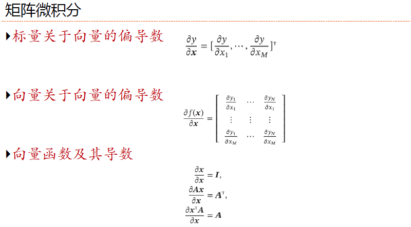

#### **3.非线性回归的参数学习**

###### **0.机器学习任务**

>   **a.学习特征向量X和标签y之间的函数关系**
>
>   ==**b.学习条件概率服从的某个分布**==

###### **1.最大似然估计MLE**

(Maximum Likelihood Estimation，MLE)

假设标签y服从函数加上高斯噪声$\epsilon$ ($\mu=0,\sigma^2=\sigma^2 $)
$$
y = f(x;\omega)+\epsilon=\omega^T x+\epsilon\\
\\
\therefore p(y|x;\omega,\sigma) = \frac{1}{\sqrt{2\pi}\sigma}e^{-\frac{(y-\omega^T x)^2}{2\sigma^2}}
$$
a.参数$\omega$在训练集$\mathbb{D} $上的似然函数为(样本是独立同分布的):
$$
p(y|x;\omega,\sigma) = \prod^{N}_{n=1}p(y^{(n)}|x^{(n)};\omega,\sigma) = \prod^{N}_{n=1}\mathbb{N}(y^{(n)}|\omega^Tx^{(n)};\sigma^2)
$$
b.参数$\omega$在训练集$\mathbb{D} $上的似然函数为(样本不是独立同分布的):
$$
p(y|x;\omega,\sigma)(通常会更加复杂)\\例如，在时间序列分析中，数据点之间存在时间依赖性
$$
**(取对数)为了方便计算,对似然函数取对数**

**<font color=deeppink>最大似然估计就是找到一组参数$\omega $使得似然函数最大</font>**
$$
log\ p(y|x;\omega,\sigma) = \sum^{N}_{n=1}log\mathbb{N}(y^{(n)}|\omega^Tx^{(n)};\sigma^2)(乘法变加法)\\
\\
\frac{\partial logp(y|X;\omega,\sigma)}{\partial \omega}=0\therefore \omega^{ML}=(XX^T)^{-1}Xy
$$
<font color=deeppink>**最大似然估计和最小二乘法估计的解相同证明了：**</font>

>   在高斯噪声的假设下，最大化数据的似然性与最小化预测误差的平方和是等价的优化目标。
>
>   最小二乘法 可以被视为在特定概率模型（带有高斯噪声）下的最大似然估计。
>
>   这为最小二乘法提供了一个坚实的统计学基础和概率解释。

###### **2.最大后验估计MAP**

（Maximum A Posteriori Estimation，MAP)

**前提:最大似然估计的缺点是数据集较少时会发生过拟合**

**解决方法:加上先验知识->使用贝叶斯**

**假设:$\omega $随机向量,服从==零均值各向同性高斯先验分布==$p(\omega;v) $**

>   **它假设我们在观察数据之前相信：**
>
>   -   每个参数最可能的值是 0。
>   -   每个参数的初始不确定性（方差）是相同的，由 `v²` 控制。
>   -   不同的参数之间是相互独立的。
>
>   ****

>   $$
>   p(\omega;v) = \mathbb{N}(\omega;0,v^2I)\\
>   \\
>   \therefore p(\omega|X,y;v,\sigma) = \frac{p(\omega,y|X;v,\sigma)}{\sum_\omega p(\omega,y|X;v,\sigma)}\approx p(y|X,\omega;\sigma)p(\omega;v)\\
>   \\
>   (其中p(y|X,\omega;\sigma)是似然函数,p(\omega;v)是\omega的先验)
>   $$

**性质:**

>这种估计参数𝒘的后验概率分布的方法称为贝叶斯估计，**是一种统计推断问题．**
>
>(采用贝叶斯估计的线性回归也称为贝叶斯线性回归)
>
>**<font color=deeppink>贝叶斯估计是一种参数的区间估计，即参数在一个区间上的分布</font>**
>
>**<font color=deeppink>(最大后验估计则是一个点)</font>**

**最大后验估计**

>   **<font color=deeppink>是指最优参数为后验分布𝑝(𝒘|𝑿,𝒚;𝜈,𝜎) 中概率密度最高的参数：</font>**
>   $$
>   \omega^{MAP} = argmaxp(\omega|X,y;v,\sigma)p(\omega;v)
>   $$
>   **令似然函数为公式中定义的高斯密度函数**
>

==(给定参数ω的情况下，观测到特定数据点的概率密度函数就是高斯密度函数)==
$$
\begin{align}
log p(\omega|X,y;v,\sigma) &\approx log\ p(y|X;\omega,\sigma)+log \ p(\omega;v)\\
&\approx -\frac{1}{2\sigma^2}\sum^{N}_{n=1}(y^{(n)}-\omega^T x^{(n)})^2-\frac{1}{2v^2}\omega^T\omega \\
&=-\frac{1}{2\sigma^2}||y-X^T\omega||^2-\frac{1}{2v^2}\omega^T\omega
\end{align}
$$
其中正则化系数$\lambda = \frac{\sigma^2}{v^2} $

###### **3.估计方式总结(==最大似然估计==和==贝叶斯估计==)**

>   **a.可以看作频率学派和贝叶斯学派对需要估计的参数𝒘的不同解释．**
>
>   **b.$v\rightarrow \infty $**先验分布退化为均匀分布,无信息先验,最大后验退化成最大似然估计

###### (似然函数)

似然 𝑝(𝑥|𝑤)和概率 𝑝(𝑥|𝑤)之间的区别在于：

>   概率 𝑝(𝑥|𝑤) 是描述固定参数𝑤时随机变量𝑥的分布情况
>
>   似然 𝑝(𝑥|𝑤) 则是描述已知随机变量𝑥时不同的参数𝑤对其分布的影响．

###### **4.多项式回归**

$$
\hat{E}(\omega) \frac{1}{2}\sum^{N}_{n=1}\{y(x_n,\omega),t_n\}^2+\frac{\lambda}{2}||\omega||^2\\
\\
(对大的系数进行惩罚)
$$

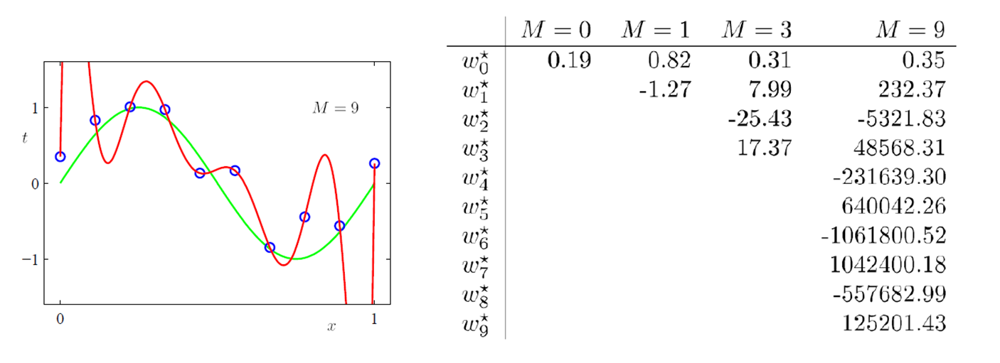

## **4.偏差-方差分解**

**偏差-方差分解（Bias-Variance Decomposition）**

(模型拟合能力和复杂度之间的trade-off)

###### **1.期望错误**

**假设真实分布$p_r(x,y) $,采用平方损失函数,模型的期望错误是**
$$
\begin{align}
\mathbb{R}(f) &= \mathbb{E}_{(x,y)~P_r(x,y)}[(y-f(x))^2]\\
\\
最优模型:f^*(x) &= \mathbb{E}_{(x,y)~P_r(x,y)}[y]\\
\\
\therefore 损失函数 \epsilon &= \mathbb{E}_{(x,y)~P_r(x,y)}[(y-f^*(x))^2]
\\
\\
(将3式代入1式)\mathbb{R}(f) &= \mathbb{E}_{(x,y)~P_r(x,y)}[(y-f^*(x)+f^*(x)-f(x))^2]\\
\\
&=\mathbb{E}_{x~p_r(x)}[(f(x)-f^*(x))^2]+\epsilon\\
\\
&=可优化的模型差距+不可优化的噪音

\end{align}
$$

###### **2.偏差-方差**

$$
\because 模型误差 \mathbb{E}_D[(f_D(x)-f^*(x))^2]\\
\begin{align}
&=\mathbb{E}_D[(f_D(x)-\mathbb{E}_D[f_D(x)]+E_D[f_D(x)]-f^*(x))^2]
\\ \\
&=(\mathbb{E}_D[f_D(x)])^2 + \mathbb{E}_D[(f_D(x)-\mathbb{E}_D[f_D(x)])^2] \\
\\
&= (bias.x)^2+variance.x\\
\\
&= 模型的拟合能力+模型是否容易过拟合
\end{align}
$$

**最小化期望错误等价于最小化偏差和方差之和．**

###### **3.偏差-方差示意图**

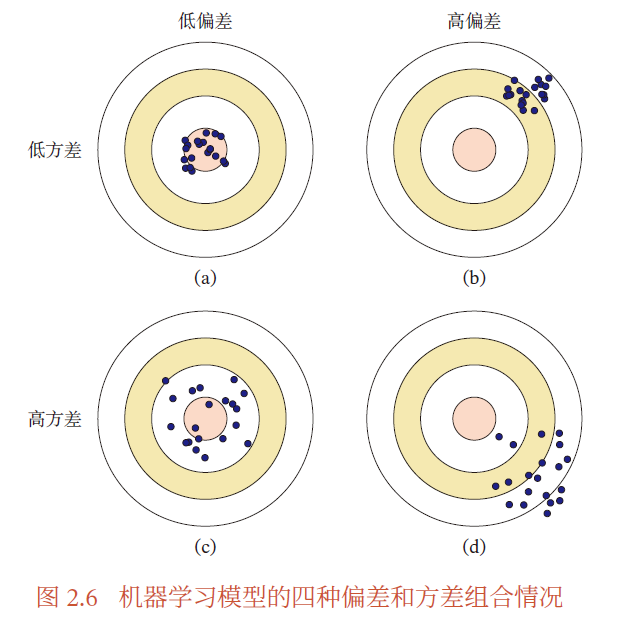

## **5.机器学习算法的种类**

###### **1.监督学习（Supervised Learning）**

**分类依据:训练集的每个样本都有标签,标签类型不同**

**进一步分类**

>   **a.回归:问题中的标签y是连续值(训练映射/概率分布)**
>
>   **b.分类:问题中的标签y是离散的(训练分类器)**
>
>   **c.结构化学习:标签y是结构化的对象(序列/图/树),通过Decode+动态规划**

###### **2.无监督学习（Unsupervised Learning，UL）**

**定义:从不包含目标标签的训练样本中自动学习到一些有价值的信息**

**进一步分类**

>   **a.聚类**
>
>   **b.密度估计**
>
>   **c.特征学习**
>
>   **d.降维**

###### **3.强化学习（Reinforcement Learning，RL）**

**定义:通过交互来学习的机器学习算法,．智能体在和环境的交互中不断学习并调整策略，以取得最大化的期望总回报．**

###### **4.其它学习方式**

**弱监督学习（Weakly Supervised Learning）和半监督学习（Semi-Supervised Learning，SSL）的方法**

**希望从大规模的无标注数据中充分挖掘有用的信息，降低对标注样本数量的要求**

###### **5.不同学习之间的对比**

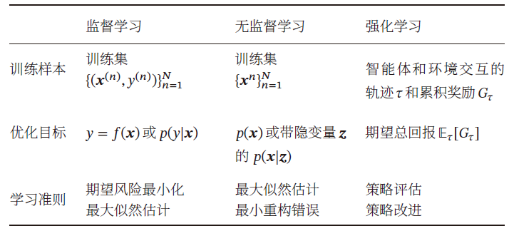

## **6.数据的表示特征**

#### **1.数据特征**

###### **1.图像特征**

**大小为$M \times N $的图片,其维度就是$M \times N $**

###### **2.文本特征**

**将自然语言样本x通过词袋的形式转化为向量形式(局部表示one-hot)**

###### **3.表示学习**

[(Obligatory)chap1(Introduction)概述.md]((Obligatory)chap1(Introduction)概述.md#4.表示学习)

#### **2.传统的特征学习**

###### **1.特征选择**

**a.子集搜索方法**

**最暴力的做法是测试每个特征子集，看机器学习模型哪个子集上的准确率最高．**

>   前向搜索:由空集合开始，每一轮添加该轮最优的特征
>
>   反向搜索:从原始特征集合开始，每次删除最无用的特征

**b.L1正则化**

**L1正则化会导致稀疏特征(不相关的设置为0)，因此间接实现了特征选择．**

###### **2.特征抽取(维数约减/降维)**

**定义:构造一个新的特征空间，并将原始特征投影在新的空间中得到新的表示**

**目的:提高计算效率和减小维度灾难**

**监督特征抽取:(主要目标是提取特征)**

>   **线性判别分析(Linear Discriminant Analysis，LDA)**

**无监督特征抽取:(主要是减少冗余信息和噪声)**

>**主成分分析（Principal Component Analysis，PCA）**
>
>**自编码器（Auto-Encoder，AE）**

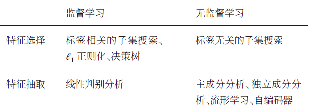

#### **3.深度学习方法**

**优点:建立一个端到端的学习算法，就可以有效地避免它们之间准则的不一致性**

**缺点:如何评价表示学习对最终系统输出结果的贡献或影响，即贡献度分配问题**

## **7.评价标准**

###### **1:准确率**

$$
Acc = \frac{1}{N}\sum^{N}_{n=1}I(y^{(n)} = \hat{y}^{(n)})
$$

###### **2.错误率**

$$
Err = 1-Acc = \frac{1}{N}\sum^{N}_{n=1}(y^{(n)}\not= \hat{y}^{(n)})
$$

###### **3.精确率和召回率**

**1.真正例(True Positive,TP):一个样本的真实类别为𝑐 并且正确预测为类别𝑐．**

**2.假负例（False Negative，FN）：一个样本的真实类别为𝑐但被错误预测为Oth**

**3.假正例（False Positive，FP）：一个样本的真实类别为Oth,预测为c**

**4.真负例（True Negative，TN):一个样本的真实类别为Oth,预测为Oth**

****

**混淆矩阵:**

>   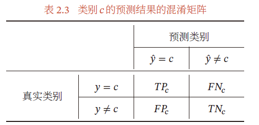

****

**精确率(Precision):在所有类别里面预测为类别c且预测正确的比例:**
$$
Pre = \frac{TP}{TP+FP}
$$
**召回率（Recall）:仅在C类别里面预测为类别c且预测正确的比例:**
$$
Rec = \frac{TP}{TP+FN}
$$
**F值:精确率和召回率的调和(可能表示更关注找出类别c而不是很关注正确率)**
$$
F = \frac{(1+\beta^2)\times Pre \times Rec}{\beta^2\times Pre \times Rec}(其中\beta =1称为F1值)
$$

###### **4.宏平均和微平均**

**宏平均:是每一类的性能指标的算术平均值**

>   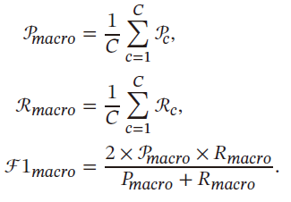

**微平均:每一个样本的性能指标的算术平均值**

**以通过调整分类模型的阈值来进行更全面的评价:**

>AUC（Area Under Curve）曲线
>
>ROC（Receiver Operating Characteristic）曲线
>
>PR（Precision-Recall）曲线
>
>TopN准确率

###### **5.交叉验证(Cross-Validation)**

**把数据集平均分为𝐾组不重复子集，每次选$𝐾 − 1$组作为训练集，剩下一组作为验证集**

>$ 𝐾$一般大于3．
>
>(验证集的所用:选取超参数和模型)
>
>训练集:验证集:测试集:532/721

## **8.理论和定理**

###### **1.PAC学习理论**

计算学习理论定义:有一套理论能够分析问题难度、计算模型能力，为学习算法提供理论保证，并指导机器学习模型和学习算法的设计

**可能近似正确（Probably Approximately Correct，PAC）学习理论内容:**

>   **1.泛化错误**
>   $$
>   \begin{align}
>   \mathbb{R}_D(f) = \mathbb{R}(f) &- \mathbb{R}^{emp}_D(f)
>   \\
>   \\
>   (大数定理)\mathbb{R}_{D\rightarrow \infty }(f) &- \mathbb{R}^{emp}_D(f)=0
>   \end{align}
>   $$
>   **2.近似正确（Approximately Correct）:泛化错误小于一个界限$\epsilon $**
>
>   **3.可能(Probably):学习算法有可能以$1 − 𝛿$ 的概率学习到一个近似正确的假设．**
>   $$
>   PAC = \bigg((R(f) - r^{emp}_{D}(f))\leq \epsilon \bigg)\geq 1 - \delta \\
>   \\(其中𝜖,𝛿 是和样本数量𝑁 以及假设空间ℱ 相关的变量)
>   $$
>   **反过来求样本数量N:**
>   $$
>   N(\epsilon,\sigma)\geq \frac{1}{2\epsilon^2}(log|F|+log\frac{1}{\delta})
>   $$
>   

**可能近似正确（Probably Approximately Correct，PAC）学习理论作用:**

>   **1.定义了"可学习性:**
>
>   ```txt
>   如果存在一个算法，对于该概念类中的任何目标概念，以及任何给定的误差容忍度 (ε) 和置信度 (1-δ)，
>   该算法都能够在多项式时间内（相对于输入大小、1/ε 和 1/δ）输出一个误差小于 ε 的假设，并且其成功的概率至少为 1-δ。
>   则这个概念类是PAC可学习的
>   ```
>
>   **2.引入了样本复杂度**
>
>   它给出了样本数量与误差容忍度、置信度和假设空间复杂度之间的关系。这使得我们可以理论上估计一个学习任务所需的最小数据量
>
>   **3.强调了“假设空间”的重要性** 
>
>   考虑了学习算法可以从哪个**假设空间**中选择假设。假设空间的大小和复杂性直接影响了学习的难度和所需的样本数量。如果假设空间太大，即使有大量数据，也可能学到错误的假设（过拟合）。
>
>   **4.提供了评估学习算法的标准：**
>
>   一个好的学习算法不仅应该在给定的训练数据上表现良好，更重要的是，它应该能够泛化到未见的数据上，并且其泛化误差可以被理论上的界限所约束。
>
>   **5.区分了“可实现”和“不可实现”的情况：**
>
>   PAC学习理论可以帮助我们理解哪些概念类是容易学习的（存在有效的学习算法），哪些概念类是难以学习的，甚至在合理的时间和数据量内是无法学习的。

>   ```
>   假设你正在尝试学习一个简单的二元分类问题，你的假设空间 F 包含 100 个不同的线性分类器 (|F| = 100)。你希望你的模型的泛化误差 ε 小于 0.1 (10%)，并且你希望至少有 95% 的置信度 (δ = 0.05) 满足这个误差要求。
>   
>   将这些值代入公式：
>   N ≥ (1 / (2 * (0.1)²)) * (log(100) + log(1/0.05))
>   N ≥ (1 / (2 * 0.01)) * (log(100) + log(20))
>   假设我们使用自然对数 (ln)：
>   N ≥ (1 / 0.02) * (ln(100) + ln(20))
>   N ≥ 50 * (4.605 + 2.996)
>   N ≥ 50 * 7.601
>   N ≥ 380.05
>   因此，根据这个公式，你需要至少大约 381 个训练样本才能以 95% 的置信度学习到一个泛化误差小于 10% 的线性分类器（从包含 100 个分类器的假设空间中选择）。
>   ```

###### **2.没有免费午餐定理(NFL)**

**对基于迭代的最优化算法，不存在某种算法对所有问题（有限搜索空间内）都有效．**

如果一个算法对某些问题有效，那它一定在另外一些问题上比*纯随机搜索算法*更差．

任何算法都有局限性．必须要具体问题具体分析”．

###### **3.奥卡姆剃刀原理（Occam’s Razor）**

**a.简单的模型泛化能力更好**

(如果有两个性能相近的模型，我们应该选择更简单的模型．)

**b.最小描述长度（Minimum Description Length，MDL）原则**

(即对数据集𝒟，最好的模型𝑓会使得数据集的压缩效果最好，即编码长度最小)

###### **4.丑小鸭定理**

**世界上不存在相似性的客观标准，一切相似性的标准都是主观的**

###### **5.归纳偏置**

很多算法经常会对学习的问题做一些假设

这些假设就称为归纳偏置（Inductive Bias）(又称先验Prior)

## **Oth**

**1.数据的独立同分布$\not=$特征之间 是否存在线性相关性**