# **Chap3(Linear-Model)**

## **0.线性模型**

###### **1.定义**

**给定一个D维样本$x = [x_1,x_2,\cdots,x_D]^T $,其线性组合函数为**
$$
f(x;\omega) = \omega_1x_1+\omega_2x_2+\cdots+\omega_D x_D+b = \omega^T x+b\\
\\
其中\omega=[\omega_1,\omega_2\cdots,\omega_D]^T为D维的权重向量,b为偏置
$$

###### **2.决策函数**

**在分类问题中,输出目标y是离散的标签,无法直接使用$f(x;\omega) $需要引入决策函数**
$$
y = g(f(x,\omega))\\
\\f(x;\omega)也被称判别别函数
$$

###### **3.二分类符号函数(sgn)**

$$
\begin{align}
g(f(x;\omega)) &= sgn(f(x;\omega)) \\
\\
& = \{
\begin{matrix}
+1,& if \ f(x;\omega)>0 \\
-1,& if \ f(x;\omega)<0
\end{matrix}
\end{align}
$$

###### **4.二分类线性模型**

**线性分类模型（Linear Classification Model）**

**线性分类器（Linear Classifier）**

**由一个（或多个）线性的判别函数$𝑓(𝒙; 𝒘) =𝒘^T𝒙 + 𝑏 $和非线性的决策函数$𝑔(⋅)$ 组成**

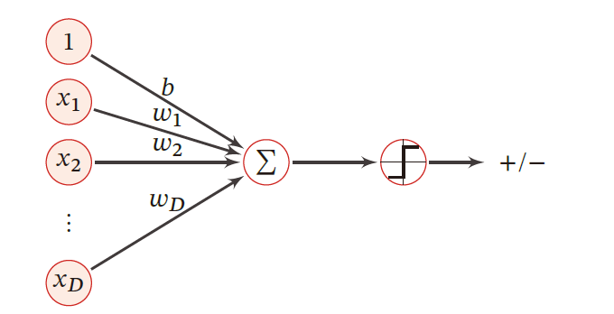

## **1.线性决策函数和决策边界**

#### **1.二分类**

**二分类问题的类别标签y只有两种取值:\{+1,-1\}或\{0,1\} **

**二分类需要的决策边界(超平面):**

>   **线性判别函数$f(x;\omega)=\omega^T x+b $在空间$\mathbb{R}^D$所有满足$f(x;\omega)=0 $的点组成的超平面**
>
>   (其中决策平面和权重向量$\omega $正交)
>
>   每个样本点到决策平面的有向距离为:
>   $$
>   \gamma =\frac{f(x;\omega)}{||\omega||}\\
>   \\
>   (\gamma 可以看作x在\omega方向上的投影)
>   $$

**二分类问题的线性决策边界实例:**

>   **样本向量$x=[x_1,x_2] $,权重向量$\omega = [\omega_1,\omega_2] $**
>
>   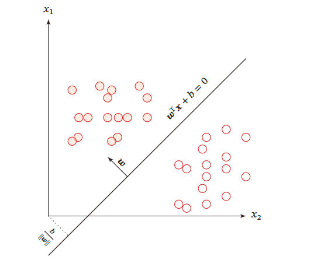
>
>   对于训练集$\mathbb{D} = \{(x^{(n)},y^{(n)})\}^N_{n=1} $,$y^{(n)}\in \{+1,-1 \} $
>   $$
>   \begin{align}\{
>   \begin{matrix}
>   f(x^{(n)};\omega^*)>0  & if& y^{n}=1 \\
>   f(x^{(n)};\omega^*)<0  & if& y^{n}=-1
>   \end{matrix}
>   \end{align}
>   $$
>
>   $$
>   合并以后:y^{(n)}f(x^{(n)};\omega^*)>0 \quad \forall n \in [1,N]\\
>   \\
>   (解释:将实际点代入的正负和结果的正反一致)
>   $$
>
>   **使用0-1损失函数不好的原因:关于$\omega $的导师为0**

#### **2.多分类**

###### **1.多分类的定义**

**多分类问题是指分类的数量C大于2,多分类一般需要多个线性判别函数**

###### **2.多分类判别函数的设计**

>   **1.OvR方式(一对其余):转化为$C$个二分类问题(是A类 & 不是A类)**
>
>   **2.OvO方式(一对一):转化为$C(C-1)/2$个一对一的问题(1+2+...+(C-1))**
>
>   >   (比如训练类A和类B的分类器,再训练类A和类C的分类器...)
>
>   **3.argmax方式:需要C个判别函数(选取概率最大的)**
>
>   >   **argmax的性能最好(决策边界$f_i(x;\omega_i)-f_j(x;\omega_j)=0 $,法向量$\omega_i - \omega_j $)**
>
>   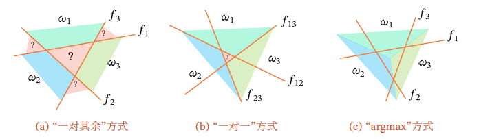
>
>   (多类线性可分:训练集的权重向量中第c类的所有样本满足c类权重最大,则线性可分)
>
>   (则一定存在一个argmax方式可以线性分开)

**解决连续的线性函数不适合进行分类的问题.所以引入非线性函数g(),也称激活函数**

## **(前提)**

**以下的Logistic回归和softmax回归,不能再直接使用预测值的差作为损失依据**

**因为我们需要进行概率分布的损失判定,所以引入了信息熵的概念(表示分布)**

**除此之外,0-1阶跃函数在x是负的区域为0,会直接导致信息的损失**

****

## **为什么是$\omega^T x $ **

因为x是列向量，

想要对应参数$\omega $控制对应的x，就需要一套的参数，就是参数的列

转置以后就是一套参数和x进行概率乘法运算

## **2.Logistic回归**

#### **0.逻辑回归的假设**

>**解决连续的线性函数不适合进行分类的问题.所以引入非线性函数$g(\cdot)$,也称激活函数**
>
>(逆函数$g^{-1}(\cdot) $也称作联系函数)
>
>**逻辑回归的第一假设:数据服从伯努利分布**
>
>**逻辑回归的第二假设:假设样本为正的概率为**
>$$
>p = \frac{1}{1+e^{-\theta^Tx}}
>$$
>**又称作sigmoid函数:函数连续,并且求导简单**
>$$
>\sigma(z)' = (1-\sigma(z))\sigma(z)
>$$

#### **1.Logistic的后验概率(预测概率)**

>   $$
>   \begin{align}
>   &p(y=1|x) =  \sigma(\omega^Tx) = \frac{1}{1+e^{-\omega^Tx}}\\
>   \\
>   &p(y=0|x) =  \ 1-p(y=1|x)=\frac{e^{-\omega^Tx}}{1+e^{-\omega^Tx}}
>   \end{align}
>   $$
>
>   **对后验概率进行变形:**
>   $$
>   \omega^T x = log \frac{p(y=1|x)}{1-p(y=1|x)} = log\frac{p(y=1)|x}{p(y=0)|x}(对数几率)
>   $$

#### **2.logistic的参数学习**

###### **1.后验概率**

**对样本进行预测,输出标签为1的后验概率,记作$\hat{y}^{(n)} $**
$$
\hat{y}^{(n)} = \sigma(\omega^T x^{(n)})
$$

###### **2.表现样本的真实条件概率**

$$
\begin{align}
p_r(y^{(n)} =1|x^{(n)}) &= y^{(n)}\\
\\
p_r(y^{(n)} =0|x^{(n)}) &= 1-y^{(n)}
\end{align}
$$

###### **3.交叉熵损失函数(忽略正则化项)**

**1.首先引入信息熵:表示随机变量不确定性的度量**

==适用于任何两个离散概率分布的信息熵:==

**(两个标签交叉熵的凸组合):预测错了就放大,预测对了通过对数缩小**

**对数函数的影响**

>**对数函数的特性:交叉熵公式中使用了对数函数**
>
>对于正确的分类，模型预测的概率$ \hat{y}$应该接近 1。
>
>($log(1)= 0$，这意味着损失很小)
>
>对于错误的分类,如果模型预测的概率很小（接近 0）
>
>那么$ log(\hat{y}) $会是一个非常大的负数(所以前取负号)

$$
H(P) = -\sum_i P(x_i)logP(x_i)
$$

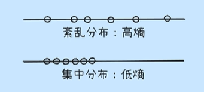

**2.引入交叉熵(描述真实分布和预测分布的度量)**
$$
H(P,Q) = -\sum_i P(x_i)logQ(x_i)
$$
**3.交叉熵损失函数(两个标签交叉熵的凸组合)**

**==标准的二分类（Binary Classification） 交叉熵损失函数==**
$$
\begin{align}
\mathbb{R}(\omega) &= -\frac{1}{N}\sum^{N}_{n=1}\bigg(P_r(y^{(n)}=1|x^{(n)})log\hat{y}^{(n)}+P_r(y^{(n)}=0|x^{(n)})log(1-\hat{y}^{(n)})\bigg)\\
&=-\frac{1}{N}\sum^{N}_{n=1}\bigg(y^{(n)}log\hat{y}^{(n)}+ (1-y^{(n)})log(1-\hat{y}^{(n)})\bigg)
\end{align}
$$
$$
其中\hat{y}^{(n)}=\sigma(\omega^Tx^{(i)})
$$

(N是样本数量,$x^{(n)} $是第n个样本的特征,$y^{(n)} $是第n个样本的真实标签)

($\hat{y}^{(n)} $是 Logistic回归模型对第n个样本预测为标签1的后验概率)

($P_r(y^{(n)}=1|x^{(n)})$是给定$x^{(n)} $时,真实标签为1的条件概率)

($P_r(y^{(n)}=0|x^{(n)})$是给定$x^{(n)} $时,真实标签为0的条件概率)

**如果真实标签=1,只有损失函数前半部分有用**

>   (具体的,如果真实标签是1，模型预测的概率 ŷ 越接近0，则-log(ŷ)的值越大)
>
>   (具体的,如果真实标签是0，模型预测的概率 ŷ 越接近1，则-log(1-ŷ)的值越大)

###### **4.KL散度**

**KL散度是用概率分布q来近似p时所造成的信息损失量。**

>   **(我们使用一个近似的概率分布来代替真实的概率分布时)**
>
>   按照概率分布q的最优编码对真实分布为p的信息进行编码
>
>   其平均编码长度（即交叉熵）H(p,q)
>
>   p的最优平均编码长度（即熵）H(p)
>
>   之间的差异。
>
>   **目的:希望最小化这个KL散度，使得近似分布尽可能地接近真实的后验分布**
>
>   (GAN中KL散度可以用于衡量生成器生成的数据分布与真实数据分布之间的差异)
>
>   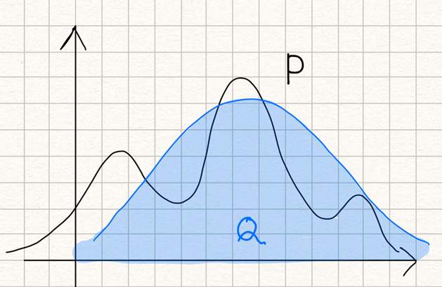
>
>   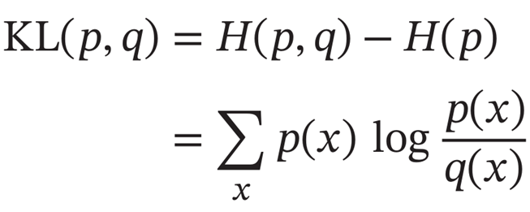

#### **3.Logistic交叉损失函数的偏导数(解析解)**

$$
(logistic函数的导数):\frac{\partial \hat{y}}{\partial \omega^T x} = \hat{y}^{(n)}(1-\hat{y}^{(n)})
$$

****

(交叉熵损失函数的的导数)
$$
\begin{align}

\frac{\partial{\mathbb{R}(\omega)}}{\partial\omega} &= -\frac{1}{N}\sum^{N}_{n=1}\bigg(y^{(n)}\frac{\hat{y}^{(n)}(1-\hat{y}^{(n)})}{\hat{y}^{(n)}}x^{(n)}  - (1-y^{(n)})\frac{\hat{y}^{(n)}(1-\hat{y}^{(n)})}{1-\hat{y}^{(n)}}x^{(n)}  \bigg)\\
&=-\frac{1}{N}\sum^{N}_{n=1}x^{(n)}(y^{(n)}-\hat{y}^{(n)})
\end{align}
$$

#### **4.Logistic交叉线损失函数的梯度下降法**

>   **初始化$\omega =0 $,$\alpha$是学习率,$\hat{y}^{(n)}_{\omega_i} $是参数为$\omega_i $时,Logistic的输出 **
>   $$
>   \omega_{i+1}= \omega_i+\alpha\frac{1}{N}\sum^{N}_{n=1}x^{(n)}\bigg( y^{(n)} - \hat{y}^{(n)}_{\omega_i}  \bigg)
>   $$
>   (还可以使用牛顿法进行优化)

## **3.Softmax回归**

###### **1.Softmax回归的定义**

>   **Softmax回归也称多项/多类的Logistic回归**

**==基于多分类交叉熵损失函数 (基于概率分布)==**
$$
一般形式:R(W) = -\sum^{c}_{y=1}p_r(y|x)log p_\theta(y|x)
\\
(y|x):给定输入 x，真实标签为类别 y 的概率
\\
(最通用的多分类交叉熵形式， 它可以处理更一般的情况)
\\ \\
独热编码形式:R(W) = -\frac{1}{N}\sum^{N}_{n=1}(y^{(n)})^Tlog \hat{y}^{(n)}\\(独热编码下的简化形式,求和项只有对应真实类别才使用)\\
比如[0,0,1]softmax预测[0.3,0.3,0.4]\\
L(\theta) = -(0\times log(0.3)+0 \times log(0.3)+1\times log(0.4))=-log(0.4)
$$
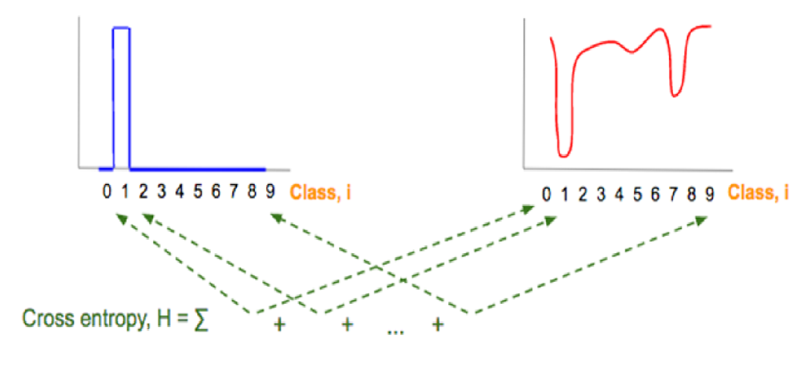

**softmax的可视化**

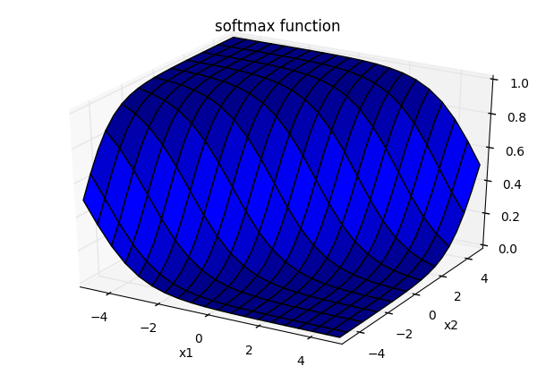

###### **2.Softmax回归预测类别c的条件概率**

$$
p(y=c|x) = softmax(\omega^T_c x) = \frac{e^{(\omega^T_cx)}}{\sum^C_{c'=1}e^{(\omega^T_cx)}} =\frac{e^{(\omega^T_cx)}}{1^T_ce^{(\omega^T_cx)}}(vector) \\
\\
决策函数\hat{y} = argmax\  p(c|x) = argmax \ \omega^T_c x
$$

>   **给定输入x,softmax输出"各个类别"在"所有类别"的概率分布**
>
>   (先通过指数放大,然后进行归一化（除以所有参数的和）,得到每个概率的概率,选择分数最高的)
>
>   输出的是一个包含 N 个概率值的向量，每个值代表了样本属于对应类别的概率，并且这 N 个概率值的和为 1。

###### **3.softmax和logistic的关系**

(都知道softmax是多分类,logistic是二分类,让softmax做二分类就完了)

$$
\hat{y} = argmax \ \omega^T_y x = I\bigg((\omega_1-\omega_0)^Tx>0 \bigg) = I\bigg(\omega^Tx>0 \bigg)
$$

###### **4.softmax的参数学习**

**使用数据的分布式表示(one-hot),即C维的{0,1}来表示标签**
$$
y = [I(1=c),I(2=c),\cdots,I(C=c)]^T
$$

###### **5.softmax的风险函数**

$$
\mathbb{R}(W) = -\frac{1}{N}\sum^{N}_{n=1} \sum^{C}_{c=1}y^{(n)}_c log \hat{y}^{(n)}_c  =-\frac{1}{N}\sum^{N}_{n=1} (y^{(n)})^T log \hat{y}^{(n)}\\
\\
(\hat{y}^{(n)} = softmax(W^T x^{(n)})表示后验概率即预测值)
$$

>   **前者是独热编码C的表达式,后者是向量化表四**

###### **6.softmax的导数(解析解)**

$$
\frac{\partial\mathbb{R}(W)}{\partial W} = -\frac{1}{N}\sum^{N}_{n=1}x^{(n)}(y^{(n)}-\hat{y}^{(n)})^T
$$

###### **7.softmax的梯度下降法**

$$
W_{t+1}\leftarrow W_i+\alpha(\frac{1}{N}\sum^{N}_{n=1}x^{(n)}(y^{(n)}-\hat{y}^{(n)})^T)
$$

****

## **4.Perceptron感知器**

#### **1.Perceptron背景**

**是一种广泛使用的==线性分类器==,是最简单的ANN(人工神经网络)**

**感知器是对生物神经元的简单数学模拟，有与生物神经元相对应的部件**

>   如权重（突触）、偏置（阈值）及激活函数（细胞体），输出为+1 或−1．

#### **2.Perceptron参数学习**

###### **1.基本要求**

**首先给定N个样本$\{(x^{(n)},y^{(n)}) \}^N_{n=1} $**

**其中$y^{(n)}\in \{+1,-1\} $,Prceptron需要找到一组参数$\omega^* $,使得对于每个样本,有**

>   $$
>   y^{(n)}\omega^{*^{T}} x^{(n)}>0,\forall n \in\{1,2,\cdots,n\}
>   $$

###### **2.Perceptron学习策略**

**(一种错误驱动的==在线学习算法==,因为当时还没有梯度下降法)**

**1.初始化**

>   权重向量$\omega $:通常是全0向量
>
>   偏置项b:它允许决策边界不通过原点

**2.更新权重(==基于$y\omega^T x < 0$==)**

>   **每次分错一个样本(x,y)时,$y\omega^T x <0 $,则使用该样本更新权重**
>   $$
>   更新规则:\omega \leftarrow \omega +yx\\
>   y(\omega+yx)^Tx = y\omega^Tx+y^2||x||^2,直到更新为正数
>   $$
>
>   -   如果$y\omega^T x > 0 $,则y与$\omega^T x $ 的符号相同(预测正确)
>   -   如果$y\omega^T x > 0 $,则y与$\omega^T x $ 的符号相同(预测错误)

###### **3.Perceptron损失函数**

$$
\mathbb{L}(\omega;x,y) = max(0,-y\omega^T x)
$$

###### **4.Perceptron的SGD**

$$
\frac{\partial L(\omega;x,y)}{\partial \omega} = \bigg\{
\begin{matrix}
0 & if \quad y\omega^Tx>0 \\
-yx & if \quad y\omega^Tx<0
\end{matrix}
$$

###### **5.Perceptron参数更新可视化**

**红色实心点为正例，蓝色空心点为负例**

**黑色箭头表示当前的权重向量，红色虚线箭头表示权重的更新方向**

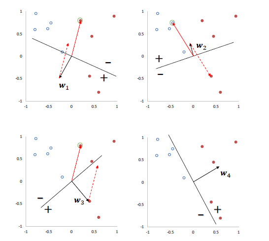

###### **6.Perceptron决策意义**

**1.$y - \omega^T x$的意义:**

>   **1.表示错误率**
>
>   因为激活函数$\hat{y} = I[\omega^T x + b]$,$y-\hat{y} $表示错误,如果结果为0表示预测正确
>
>   **2.和决策边界距离有关**

**2.更新权重(==基于预测标签的错误)==:**

>**如果预测错误 ($y - \hat{y} ≠ 0$)：**
>
>-   如果真实标签是 $+1$ 但预测是 $-1 (y - \hat{y} = +2)$，则 $\omega$会加上 $2αx$。这会使得在下一次遇到类似的输入$ x $时，$\omega^T x$ 的值更有可能增大，从而更有可能被分类为 +1。
>-   如果真实标签是$ -1 $但预测是 $+1 (y - \hat{y} = -2)$，则 $\omega$会减去$ 2αx$。这会使得在下一次遇到类似的输入$ x$时，$\omega^T x $的值更有可能减小，从而更有可能被分类为$ -1$

#### **3.Perceptron的收敛性**

###### **1.Novikoff定理**

**对于两类问题，==如果训练集是线性可分，那么感知器算法在有限次迭代后收敛==**

**然而，如果训练集不是线性可分的，那么这个算法则不能确保会收敛**

###### **2.Perceptron收敛性**

**1.==Perceptron的最大特征 向量的范数==**

**给定训练集$\mathbb{D} = \{(x^{(n)},y^{(n)}) \}^N_{n=1} $,其中$x^{(n)} $为增广特征向量, $y^{(n)}\in \{-1,+1\} $**

**那么存在一个正常数$\gamma $和权重向量$\omega^*$,$\forall n,(\omega^*)^T(y^{(n)}x^{(n)})\geq \gamma $**

$R = \max_{n} ||x^{(n)}||_2$(通过遍历整个训练集并计算样本的范数)

>   **L2 范数（欧几里得范数）:** 
>
>   对于向量 $v = [v_1, v_2, ..., v_n]^T$，其$ L2 $范数为：$||v||_2 = \sqrt{v_1^2 + v_2^2 + ... + v_n^2}$

****

**2.==Perceptron收敛定理==**

**在线性可分的前提下,Perceptron会在$\frac{R^2}{\gamma^2} $步内收敛**

****

**3.==$\gamma $的不可确定性==**

>γ是指数据线性可分的间隔
>
>(更具体地，它是指所有样本点到最优决策超平面的最小距离乘以最优权重向量的范数,**一个较大的 γ 表示更容易被分开的数据**。)

>   **难点:**
>
>   **1.最优权重向量$\omega^* $未知:这是Perceptron算法的目标**
>
>   **2.鸡生蛋,蛋生鸡:最优权重向量$\omega^* $和$＼gamma　$之间相互决策**
>
>   **3.最优分离数据的向量可能并不是具有最大间隔的**
>
>   >   **如果想找到最大间隔的需要更复杂的优化问题(SVM)**
>
>   **可行解决方法**
>
>   **设置最大迭代次数/检查错误率/早停法/检查权重向量是否收敛到较小值**

###### **3.Perceptron辩证收敛性**

**(泛化能力辩证)数据集线性可分,虽然能找到一个超平面,但是不保证泛化能力**

**(方向辩证):Perceptron对数据集顺序比较敏感,找到的超平面往往不一致**

**如果数据集不是线性可分的,永远不会收敛**

#### **4.参数平均Perceptron**

**(Perceptron独有的正则化方法)**

###### **1.Perceptron的差鲁棒性**

(Perceptron学习到的权重向量和训练样本的顺序相关)

>   **if错误向量在后面,即使前面训练都正确,只要出现一个错误向量就会变差**
>
>   (并且这种影响在epoch越大的时候越容易发生)

###### **2.Voted Perceptron(投票感知器)**

**在学习中,将所有K个权重向量保存起来,并且赋予每个权重向量$\omega_k $一个置信系数**

>   (令$\tau_k$为训练过的样本数量,$\tau_{k+1} $是下次权重更新的迭代次数)
>   $$
>   \therefore c_k = \tau_{k+1}-\tau_k
>   $$
>   如果$c_k $越大,表示该权重向量在训练过程更长,分类正确样本数越多
>   $$
>   \therefore \hat{y} = sgn(\sum^{K}_{k=1}c_k \ sgn(\omega^T_K x))
>   $$
>
>   >   $sgn(w_k^T x)$代表了第$ k $个权重向量$ w_k $对输入$ x $的分类结果 (+1 或-1)
>   >
>   >   $sgn\ sgn$表示对所有权重向量的输出进行加权求和
>   >
>   >   >如果总和大于 0，则最终预测结果 `\hat{y} = +1`。
>   >   >
>   >   >如果总和小于 0，则最终预测结果 `\hat{y} = -1`。
>   >   >
>   >   >如果总和等于 0，则最终预测结果 `\hat{y} = 0` (

###### **3.Averaged Perceptron(平均感知器)**

**上面说到,VP需要k个空间来存储权重向量,AP只需要多开一个平均权重向量$\hat{\omega} $**

>   **==迭代还是正常迭代$\omega$,但是还需要通过$\hat{\omega}$进行记录==**
>
>   (缺点:这两个向量都是稠密向量,十分费时)

#### **5.广义Perceptron**

###### **1.(Multi-class)Generalized Perceptron(广义感知器)**

**(还是OvR策略,需要One-hot编码)**

对于给定的输入特征向量$ x$，计算$ x$与每个类别$c$的权重向量的点积，得到得分：
$$
score_c = w_c^T x
$$
模型会将输入$x$分配给得分最高的类别：
$$
\hat{y} = \arg\max_{c \in \{1, 2, ..., C\}} score_c = \arg\max_{c \in \{1, 2, ..., C\}} w_c^T x
$$

****

**训练的迭代:**

如果预测错误（即$\hat{y}^{(n)} \neq y^{(n)}$），则更新相关的权重向量：

>   **增加真实类别的权重:** 将真实类别$ y^{(n)} $的权重向量加上输入特征向量 $x^{(n)}$：
>   $$
>   w_{y^{(n)}} \leftarrow w_{y^{(n)}} + x^{(n)}
>   $$
>   **减少预测类别的权重:** 将预测类别$\hat{y}^{(n)}$的权重向量减去输入特征向量 $x^{(n)}$： 
>   $$
>   w{\hat{y}^{(n)}} \leftarrow w{\hat{y}^{(n)}} - x^{(n)}
>   $$

如果预测正确（$\hat{y}^{(n)} = y^{(n)}$），则权重向量保持不变。

###### **2.Convergence(广义感知器收敛性)**

(基于OvR,所以基本性质都满足)

**如果训练数据不是线性可分的:**

>   **广义感知器算法将不会收敛到一个能够完美分类所有训练样本的解。**
>
>   **它可能会在不同的权重向量集合之间震荡**

## **5.SVM支持向量机**

(Support Vector Machine,还是二分类,但是超平面的泛化能力更强)

**在本章节,不需要使用增广的特征向量和特征权重$\omega$**

**目的：找到离决策线最近的支持向量（一个点），适用于二分类问题**

### **0.SVM定义**

#### **1.SVM超平面**

**给定数据集$\mathbb{D} = \{(x^{(n)},y^{(n)})\}^N_{n=1} $,$y_n \in \{+1.-1\} $**

**==如果样本是线性可分的,即存在超平面==$\omega^T x+b = 0 $**

>   两类样本分开,则对于每个样本,都有$y^{(n)}(\omega^T x+b)>0 $
>
>   (则同号证明预测正确)

**样本到超平面的距离**
$$
\gamma^{(n)}  = \frac{|\omega^T x^{(n)}+b|}{||\omega||} = \frac{y^{(n)}(\omega^T x^{(n)}+b)}{||\omega||}
$$

##### **2.SVM间隔(Margin)**

**定义SVM的间隔等于最小距离:**
$$
\gamma = min \ \gamma^{(n)}
$$

##### **3.SVM样本点到超平面的距离**

**1.基本元素**

>   $\omega = [\omega_1,\omega_2,\cdots,\omega_d]^T \quad$表示超平面的法向量(垂直于超平面)
>
>   $x = [x_1,x_2,\cdots,x_d]^T \quad $表示空间中的一个点
>
>   $ b \quad$表示超平面相对于原点的偏移量

**2.点到超平面的距离**

>   法向量上的单位向量:(法向量除以长度)
>   $$
>   \hat{\omega} = \frac{\omega}{||\omega||_2}
>   $$
>   考虑x可以是从==超平面上的点$x_p $==沿着垂直于超平面方向进行移动得到的
>   $$
>   x^{(n)} = x_p + d\cdot \frac{\omega}{||\omega||_2}\\
>   \\
>   (其中d是方向，x_p在法平面上,满足\omega^T x_p+b = 0)
>   $$
>   (化简操作,两边都乘以$\omega^T $)
>   $$
>   \begin{align}
>   \Rightarrow \omega^T x^{(n)} &= \omega^Tx_p + d\cdot \frac{\omega\cdot\omega^T}{||\omega||_2}\\
>   \\
>   &=\omega^Tx_p + d\cdot \frac{||\omega||^2_2}{||\omega||_2}\\
>   \\
>   &= -b+ d\cdot ||\omega||_2
>   \end{align}
>   $$
>
>   $$
>   \therefore d = \frac{\omega^T x^{(n)}+b}{||\omega||_2}\rightarrow= \frac{|\omega^T x^{(n)}+b|}{||\omega||_2}(距离永远大于0)
>   $$
>
>   (再加上不会影响大小的y标签)
>   $$
>   \therefore d = \frac{y^{(x)}(\omega^T x^{(n)}+b)}{||\omega||_2}
>   $$
>
>   ==y是sgn标签,只有{+1,-1}两个值,只会指定方向,不会改变大小==

##### **4.SVM唯一确定超平面**

>   **唯一确定超平面,限制$||\omega||\cdot \gamma =1 $**
>
>   >   (缩放不变性)
>   >
>   >   >   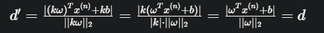
>   >
>   >   (固定尺度)
>   >
>   >   >**解释:因为解决$\omega $和b的不唯一性,约束它们的尺度**
>   >   >
>   >   >(限制函数有两个参数,不方便确定)
>   >
>   >   (简化优化)
>   >
>   >   >   **最后化简结果变成最小化$||\omega||^2_2$(最小长度的平方)**
>
>   $$
>   \begin{align}
>   max \quad & \frac{1}{||\omega||^2_2}\\
>   \\
>   s.t. \quad& y^{(n)}(\omega^Tx^{(n)}+b)\geq 1,\forall n\in[1,2,\cdots,N]
>   \end{align}
>   $$

##### **5.SVM支持向量**

**定义:数据集中所有满足$y^{(n)}(\omega^T x^{(n)}+b) =1  $ 的样本,都叫做支持向量**

##### **6.SVM可视化**

**下面的例子可以看出多个超平面,但是$\gamma$超平面只有一个**

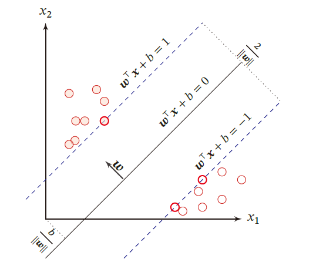

### **1.参数学习**

#### **1.SVM优化问题**

$$
\begin{align}
max \quad & \frac{1}{||\omega||^2_2}\\
\\
s.t.\quad & 1-y^{(n)}(\omega^Tx^{(n)}+b)\leq 0,\forall n \in \{1,2,\cdots,N\}
\end{align}
$$

#### **2.SVM拉格朗日乘数法**

**目标函数带有==不等式约束==,不能直接求导得到解析解**

###### **1.原始优化问题标准化**

>   (函数右侧变为0)
>   $$
>   \begin{align}
>   max \quad & \frac{1}{||\omega||^2_2}\\
>   \\
>   s.t.\quad & 1-y^{(n)}(\omega^Tx^{(n)}+b)\leq 0,\forall n \in \{1,2,\cdots,N\}
>   \end{align}
>   $$

###### **2.构建拉格朗日函数**

**(Lagrangian Function)**

>   **拉格朗日标准函数**
>   $$
>   \mathbb{L}(\omega,b,\lambda) = f(\omega,b)+\sum^{n}_{i=1}\lambda_ng_n(\omega,b)\quad (\lambda_n\geq 0)
>   $$
>   (目标函数+对每个约束函数引入一个拉格朗日乘数)

>   **SVM拉格朗日函数**
>   $$
>   \Lambda(\omega,b,\lambda) =  \frac{1}{2}||\omega||^2_2+\sum^{N}_{n=1}\lambda_n(1-y^{(n)}(\omega^Tx+b))\\
>   \\
>   (\lambda = \lambda_1,\lambda_2,\cdots,\lambda_n,\lambda_n\geq 0)
>   $$

###### **3.拉格朗日对偶函数**

**(Lagrangian Dual Function)**

>(在拉格朗日函数的基础上,关于原始变量$\omega,b $取最小值得到)
>
>**标准拉格朗日对偶函数**
>$$
>G(\lambda) = min \ \mathbb{L}(\omega,b,\lambda)
>$$
>**SVM拉格朗日对偶函数**
>
>>   1.求两个参数求偏导
>>   $$
>>   \frac{\partial \Lambda}{\partial \omega} = \omega -\sum^{N}_{n=1}\lambda_ny^{(n)}x^{(n)} = 0 \quad \therefore\omega = \sum^{N}_{n=1}\lambda_ny^{(n)}x^{(n)}\\
>>   \\
>>   \frac{\partial \Lambda}{\partial \theta} = -\sum^{N}_{n=1}\lambda_ny^{(n)}=0\quad\therefore\sum^{N}_{n=1}\lambda_ny^{(n)}=0
>>   $$
>>   (其中第二个也称作拉格朗日函数在最优解关于原始变量梯度为0)
>>
>>   **==2.代入拉格朗日函数$\Lambda(\omega,b,\lambda)$,得到了SVM拉格朗日对偶函数==**
>>   $$
>>   \Gamma(\lambda) = -\frac{1}{2}\sum^{N}_{n=1}\sum^{N}_{m=1}\lambda_n\lambda_my^{(n)}y^{(m)}(x^{(n)})^Tx^{(m)}+\sum^{N}_{n=1}\lambda_n
>>   $$
>>   **原始问题是最小化$\frac{1}{2}||\omega||^2_2 $,问题转换为最大化$\Gamma(\lambda)　$**

###### **4.拉格朗日对偶函数的性质**

SVM的主优化问题是凸优化问题,满足强对偶性,即可以通过最大化$\Gamma(\lambda) $

**然而$\Gamma(\lambda) $是一个凹函数,最大化$\Gamma(\lambda) $其实是凸优化问题,得到最优解$\lambda^* $**

(==约束代价高,是样本个数,一般的凸优化代价太高,使用高效方法,比如**SMO**算法==)

>   (每个约束对应一个拉格朗日因子->所以最优解可以表示为训练样本的线性组合)

###### **5.SMO算法(Sequential Minimal Optimization)**

>   **在SVM中不是使用GD优化算法,而是SMO算法,本身是QP问题(二次规划求解问题)**
>
>   分治的思想,每次只优化两个拉格朗日乘子,划分为子问题
>
>   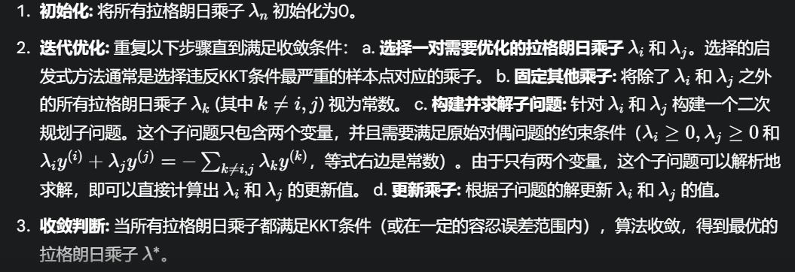

###### **5.额外的好处**

**在对偶形式中，数据点$ x(n) $只以内积$ (x^{(n)})^Tx^{(m)} $的形式出现。**

**这为引入==核函数==来处理非线性可分问题提供了便利。**

**通过替换内积为核函数 $K(x^{(n)},x^{(m)})$，我们可以在不显式地计算高维特征空间的情况下，实现非线性分类。**

###### **(KKT条件补充证明)**

**满足某些规则性条件的情况下,非线性规划问题满足最优解的必要条件**

**1.最优解满足原始问题可行性**

**2.最优解满足对偶可行性**

**3.最优解满足互补松驰性**

>   **拉格朗日乘数和对应的约束要么一个为零,要么它们的乘积为零**
>
>   **如果$\lambda^*_n >0$,则必须有$y^{(n)}(\omega^{*^{T}}x^{(n)}+b^*)-1=0 $**
>
>   (样本点位于间隔的边界上,是一个支持向量)
>
>   **如果$\lambda^*_n =0$,则必须有$y^{(n)}(\omega^{*^{T}}x^{(n)}+b^*)-1>0 $**
>
>   (样本点被正确分类,对优化超平面没有直接贡献)

### **2.核函数**

###### **1.SVM核函数作用**

**核函数可以隐式地从原始特征空间映射到更高维的空间,并解决原始特征空间中的==线性不可分问题==**

###### **2.SVM决策函数**

$$
f(x) = sgn(\omega^{*^T}\Phi(x)+b^*)=sgn\bigg(\sum^{N}_{n=1}\lambda^*_n y^{(n)}k(x^{(n)},x)+b^* \bigg)
$$

###### **3.SVM核函数**

**上式的$k(x,z)=\Phi(x)^T\Phi(z) $叫做核函数**

**其中通常我们不需要显式的给出具体形式,通过核技巧来构造(即只用知道大小)**

>   **知道$K(x_i,x_j)=\Phi(x_i)^T\Phi(x_j)　$的值,就可以计算样本之间的相似度**
>
>   **其中**
>   $$
>   \Phi(x) = [1,\sqrt2 x_1,\sqrt2 x_2,\sqrt2 x_1x_2,x^2_1,x^2_1]^T
>   $$

### **3.软间隔SVM**

(这是SVM的变种,相对于原始SVM,其最终决策函数也只和支持向量有关)

###### **1.SVM软间隔的前提**

**在SVM优化问题中,约束条件严格**

**(如果训练集的样本在特征空间中不是线性可分的,就无法找到最优解)**

所以引入了==松弛变量$\epsilon $==
$$
\begin{align}\mathbb{I} &= min\quad\frac{1}{2}||\omega||^2+C\sum^{N}_{n=1}\epsilon_n\\
s.t\quad&1-y^{(n)}(\omega^T x^{(n)}+b)-\epsilon_n\leq0 \ \forall n\in\{1,2,\cdots,N\}
\end{align}
$$

###### **2.Hinge损失函数**

**引入松弛变量的间隔称为软间隔,然后合并目标函数和约束函数**
$$
min\quad \sum^{N}_{n=1}max\bigg((0,1-y^{(n)}(\omega^T x^{(n)}+b)\bigg)+\frac{1}{2C}||\omega||^2_2
$$
**其中以下损失函数就叫做hinge损失函数**
$$
max\bigg((0,1-y^{(n)}(\omega^T x^{(n)}+b)\bigg)
$$
**$\frac{1}{2C}||\omega||^2_2$看作正则化项$\frac{1}{C} $是正则化系数**

#### **4.SVM和Perceptron**

-   **感知机:** 一个简单的感知机只能学习线性可分的模式，它的决策边界是一个超平面。学习过程通常是通过迭代调整权重来最小化分类错误。
-   **线性SVM:** 即使没有使用非线性核函数，线性SVM与感知机也有本质的区别。SVM的目标是**最大化间隔**，找到一个能够最好地分离两个类别并且具有最大鲁棒性的超平面。感知机可能找到很多个能够分开数据的超平面，但SVM选择的是间隔最大的那个。此外，SVM的决策边界只依赖于**支持向量**，而感知机的决策边界受到所有训练样本的影响。
-   **非线性SVM:** 引入核函数后，SVM能够学习非线性的决策边界，这使得它能够处理更复杂的数据分布。这确实是SVM相对于简单感知机的一个巨大优势。你可以将核函数看作是SVM在数据预处理阶段进行的一种复杂的、非线性的特征转换，使得数据在转换后的空间中更容易被线性超平面分割。

**总结来说：**

-   实际操作中，SVM的对偶问题通常使用SMO等专门的二次规划算法求解，而不是梯度下降。
-   引入核函数的目的是为了处理非线性可分的数据，通过核技巧隐式地将数据映射到高维空间，使得在高维空间中线性可分。我们不需要知道核函数对应的显式特征映射。
-   SVM与感知机的区别不仅在于核函数带来的非线性能力，更在于其优化目标（最大化间隔）、对支持向量的依赖以及更强的泛化能力。核函数可以看作是SVM相对于简单感知机的一个关键性的扩展和提升。

## **6.损失函数对比**

###### **1.Logistic损失函数**

$$
\mathbb{L} = -log\sigma(yf(x;\omega)) = log(1+e^{-yf(x;\omega)})
$$

###### **2.perceptron损失函数**

$$
\mathbb{L_p} = max(0,-yf(x;\omega))
$$

###### **3.Hinge损失函数**

$$
\mathbb{L_hinge}=max(00,1-yf(x;\omega))
$$

###### **4.平方损失函数**

$$
\mathbb{L_S} = (y-f(x;\omega))^2  =(1-yf(x;\omega))^2
$$

###### **5.损失函数的对比**

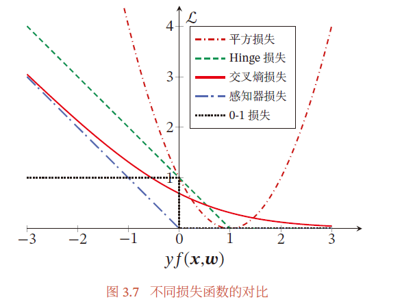

## **7.总结**

###### **1.广义线性模型**

**==一个或多个线性判别函数==+==一个非线性激活函数S==**

###### **2.常见线性模型对比**

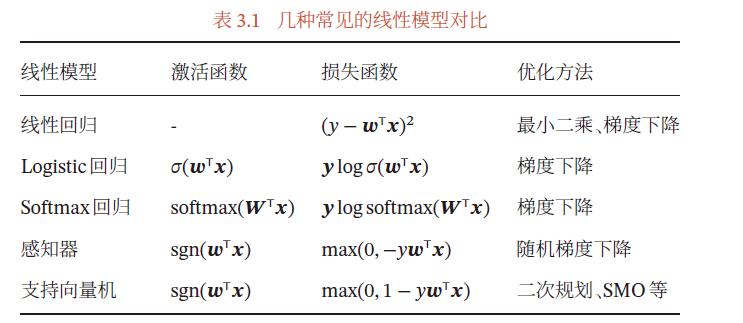

