# **Chap4 FNN**

## **1.神经元**

#### **0.神经元基本术语**

###### **1.人工神经元(Artificial Neuron)**

**模拟生物神经元的结构和特性,给一组输入产生输出**

###### **2.MP神经元**

**1943年提出的神经元模型,其中的激活函数为0-1的阶跃函数**

>   ==然而现在的神经元中的激活函数要求的是连续可导的函数==

###### **3.神经元的组成**

**1.净输入 $z$**

>   **假设神经元接收D个输入$x_1,x_2,\cdots,x_D$,令向量x=[$x_1,x_2,\cdots,x_D $],使用$z\in \mathbb{R} $表示净输入**
>   $$
>   z = \sum^{D}_{d=1}\omega_d x_d + b = \omega^T x +b = \omega^Tx+\omega_0
>   $$
>   **其中$\omega = [\omega_1,\omega_2,\cdots,\omega_D]\in \mathbb{R}^D $是D维的权重向量,$b\in \mathbb{R} $是偏置项**

**2.激活函数(非线性因素)** $f(\cdot) $

>   **为净输入添加非线性因素的工具,输入==净输入==,输出==神经元活性值$\alpha $==**
>
>   **<font color=deeppink>期末考试必考</font>**

**3.可视化内容**

>   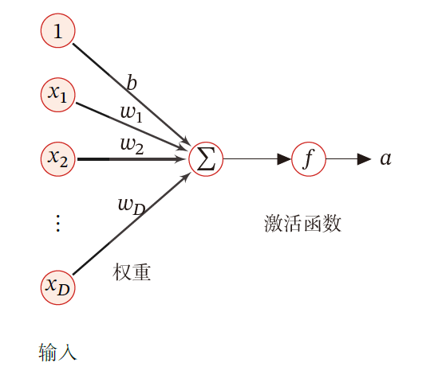

**4.多分类问题的可视化**

>   比如0~9的识别
>
>   首先是10个节点的input layer,然后全连接10个节点的hidden layer,然后hidden每个节点经过activation function以后得到$\sigma(x_i) $的输出

###### **4.激活函数的性质**

**1.连续并可导的非线性函数**

>   ==可导的激活函数**可以直接利用数值优化的方法**学习网络参数==
>
>   **<font color=red>链接神经节点的内容是参数$\omega $,如果要学习的话涉及梯度下降</font>**

**2.尽可能的简单,有利于提高网络的计算效率**

**3.导函数要在一个合适的区域中,否则会影响训练的稳定性和效率**

>   **比如使用0-1值域的函数,全连接以后值域依旧是0-1**
>
>   **<font color=red>如果值域过界,偏导数为0,无法优化->梯度消失/神经元死亡</font>**

**<font color=red>4.不需要单调递增,比如swish函数$f(x) = x * sigmoid(βx)$</font>**

>   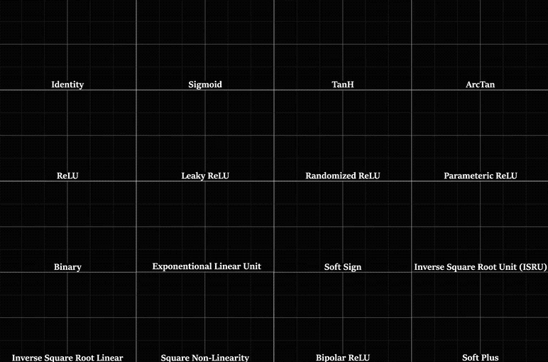


#### **1.Sigmoid函数**

###### **1.性质**

**`sigmoid`函数是指一类S型曲线,为两端饱和函数**

**<font color=deeppink>常见的`sigmoid`函数包括Logistic函数和Tanh函数</font> **


###### **2.Logistic函数**

$$
\sigma(x) = \frac{1}{1+e^{-x}}
$$

**主要作用:将实数域的输入挤压到(0,1)**

**主要性质:**

>   **<font color=deeppink>输出可以直接看作概率分布</font>**
>
>   **<font color=deeppink>Logistic函数可以看作一个软性门,用于控制其它神经元输出信息</font>**

###### **3.tanh函数**

>   $$
>   tanh(x) = \frac{e^{x}-e^{-x}}{e^{x}+e^{-x}}
>   $$
>
>   **(==可以视作放大并且平移后的Logistic函数==):$tanh(x) = 2\sigma(2x)-1 $**

###### **4.Hard-Logistic和Hard-Tanh函数**

**<font color=deeppink>Hard的原理就是对函数在0附近泰勒展开后的分段函数近似</font>**

**1.Hard-Logistic**

>   **Logistic函数的导数(备用)**
>   $$
>   \sigma'(x) = \sigma(x)(1-\sigma(x))
>   $$
>   **对该函数泰勒展开**
>   $$
>   g_l(x)\approx \sigma(0)+x\times \sigma'(0) = 0.25x+0.5
>   $$
>   **Hard-Logistic函数**
>   $$
>   hard-Logistic =
>   \begin{cases}
>   1&g_l(x)\geq 1\\
>   \\
>   g_l &0<g_l(x)<l \\
>   \\
>   0&g_l(x)\leq0
>   \end{cases}
>   \quad = max(min(0.25x+0.5,1),0)
>   $$
>   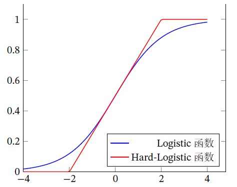

**2.Hard-Tanh**

>   **tanh函数的导数(备用)**
>   $$
>   tanh'(x) = 1-(tanh(x))^2
>   $$
>   **对该Tanh函数在0附近泰勒展开**
>   $$
>   g_t(x)\approx tanh(0)+x\times tanh'(0) = x
>   $$
>   **Hard-tanh函数**
>   $$
>   hard-Tanh = max(min(g_t(x),1),-1)
>   $$
>   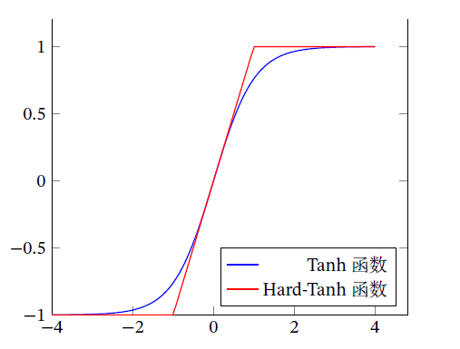

#### **2.ReLU函数**

###### **1.ReLU基本定义**

**ReLu(Rectified Linear Unit,修正线性单元),也称Rectifier函数,也称斜坡函数**

==需要注意,只看右半边就是线性的,但是整体是非线性的==
$$
ReLU(x) = 
\begin{cases}
x & x\geq 0\\
0& x<0
\end{cases} = max(0,x)
$$

###### **2.ReLU的优点和缺点**

**优点**

>   **1.计算简单,只需要加法乘法和比较**
>
>   **2.生物学合理性:==单侧抑制,宽兴奋边界==**
>
>   **3.稀疏性:和生物学兴奋神经比例类似1%~4%**

**缺点**

>   **1.优化困难:非零中心化的,会给后一层引入==偏置偏移==,影响梯度下降效率**
>
>   **2.<font color=deeppink>ReLU死亡问题:参数在一次不恰当的更新后,某个神经元会在之后所有的数据上无法激活</font>**
>
>   (综上,会引入以下的ReLu变种)

###### **3.Leaky ReLU (泄露极小ReLU)**

**主要思想：在x<0时,保持一个很小的梯度$\gamma $,避免永远失活**
$$
LeakyReLu(x) = 
\begin{cases}
x& if \ x>0\\
\\
\gamma x& if\ x\leq 0
\end{cases}
\quad
=max(0,x)+\gamma min(0,x)
\\
\\
if \ \gamma \rightarrow\epsilon(极小值),LeakyReLU = max(x,\gamma x)
$$

###### **4.PReLU（Parametric ReLU,参数ReLU）**

**一种非饱和的函数,引入参数$\gamma_1$,使得每个神经元都有各自的权重**
$$
PReLU_i(x) = 
\begin{cases}
x & if \ x>0\\
\\
\gamma_ix&if\ x\leq0
\end{cases} = max(0,x)+\gamma_imin(0,x)
$$
**如果$\gamma_i=0$,退化成ReLU;如果$\gamma_i$是很小的常数,则成为Leaky ReLU**

###### **5.ELU（Exponential ReLU,指数ReLU）**

$$
ELU(x) = 
\begin{cases}
x & if \ x>0\\
\\
\gamma(e^x - 1)& if \ x\leq 0
\end{cases}
 = max(0,x)+min(0,\gamma(e^x-1))
$$

###### **6.Softplus(平滑ReLU)**

$$
softplus(x) = log(1+e^x)
$$

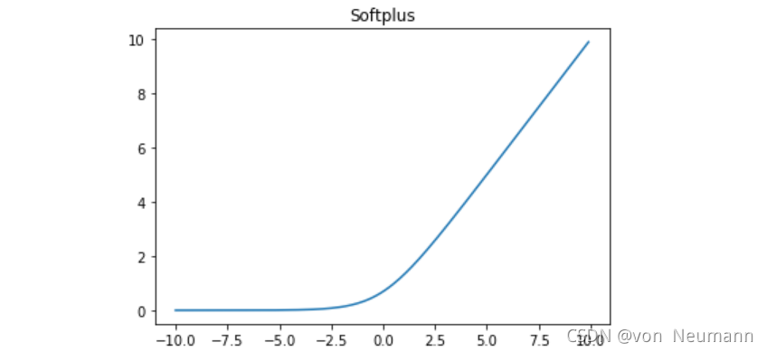

###### **<font color=red>7.DyT（动态双曲正切）(CVPR 2025)</font>**

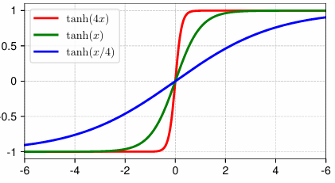

#### **3.Swish函数**

$$
swish(x) = x\sigma(\beta x)\\
\\
\sigma(x)是Logistic函数,\beta是固定超参数
$$

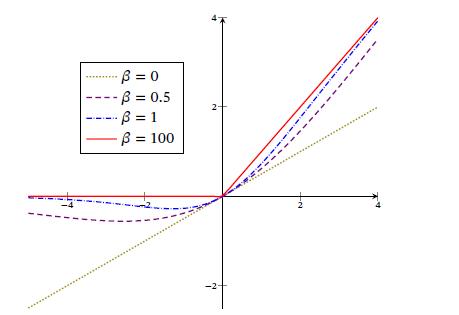

>   $\beta=0,swish\rightarrow\frac{x}{2} $
>
>   $\beta =1,swish\rightarrow近似饱和但是具有非单调性 $
>
>   $\beta\rightarrow +\infty,swish趋近于0-1函数$
>
>   (swish可以看作线性函数和ReLU之间的非线性插值函数)

#### **4.GELU函数**

GELU（Gaussian Error Linear Unit，高斯误差线性单元）

一种通过门控机制来调整其输出值的激活函数
$$
GELU(x) = xP(X\leq x)\\
(P(X\leq x)是高斯分布\mathbb{N}(\mu,\sigma^2)的累计分布函数)
$$
如果$\mu=0.\sigma=1 $,高斯分布的累计分布函数可以使用Tanh和Logistic来近似
$$
GELU(x)\approx 0.5x(1+tanh(\sqrt{\frac{2}{\pi}}(x+0.044715x^3)))\approx x\sigma(1.702 x)
$$

#### **5.Maxout单元**

**也是一种分段线性函数,普通的激活函数的输入是一个标量,Maxout是一个向量**
$$
z_k= \omega^T_k x+b_k (一共有k个)
$$
(每个Maxout单元有**K个**权重向量$\omega_k\in\mathbb{R}^D $和偏置$b_k $)

**Maxout单元的非线性函数定义为**
$$
maxout(x) = max(z_k)
$$
**Maxout 单元不单是净输入到输出之间的非线性映射**

**而是整体学习输入到输出之间的非线性映射关系．**

Maxout 激活函数可以看作任意凸函数的分段线性近似，并且在有限的点上是不可微的

## **2.网络结构**

#### **1.FNN前馈神经网络**

神经元按照层进行分组,每层的信息都是朝一个方向传播,**没有反向传播**

可以用一个有向无环路图进行表示

**包括:全连接前馈网络(FNN)和卷积神经网络(CNN)**

#### **2.MANN记忆增强神经网络**

###### **1.记忆网络基本概念**

记忆网络(反馈网络)，神经元不但可以接收其他神经元的信息，也可接收自己的历史信息

记忆神经网络中的信息传播可以是单向或双向传递，可用一个有向循环图或无向图来表示

###### **2.记忆网络分类**

**包括:循环神经网络、Hopfield 网络、玻尔兹曼机、受限玻尔兹曼机**

**记忆网络可以看作一个程序，具有更强的计算和记忆能力**

###### **3.MANN**

**==为了增强记忆网络的记忆容量，可以引入外部记忆单元和读写机制==**

>称为记忆增强神经网络（Memory Augmented Neural Network，MANN）
>
>**包括:神经图灵机和记忆网络**

#### **3.图网络**

###### **1.图网络的前提**

前馈网络和记忆网络的输入都可以表示为向量或向量序列

**然而实际应用中很多数据是图结构的数据，比如知识图谱、社交网络、分子网络等**

###### **2.图网络的定义**

(图网络是定义在**图结构数据**上的神经网,而不是因为是图)

图中每个节点都由一个或一组神经元构成．节点之间的连接可以有向/可以无向

每个节点可以收到来自相邻节点或自身的信息．

###### **3.图网络的分类**

图卷积网络（Graph Convolutional Network，GCN）

图注意力网络（Graph Attention Network，GAT）

消息传递神经网络（Message Passing Neural Network，MPNN）

## **3.FNN(前馈神经网络)**

###### **1.FNN定义**

神经元的一种拓扑结构,前馈神经网络(FNN)也称作多层感知机(MLP)

>但多层感知器的叫法并不是十分合理
>
>因为前馈神经网络其实是由多层的Logistic 回归模型（连续的非线性函数）组成
>
>而不是由多层的感知器（不连续的非线性函数）组成

**<font color=red>sigmoid和softmax in FNN</font>**

(背景是判别手写字符0~9)

**Sigmoid n个sigmoid输入单个值,输出是独立的==可能性==：** 

```
input -> hidden -> output -> sigmoid activation -> argmax 
256*256   256      10 Neu      10 Neu			 1 result
  		  128
  		  ...
```

**argmax 1个向量n个值,输入一个argmax函数,输出是互斥类别上的==概率分布==**

可以更好跟交叉熵损失函数同步

```
input -> hidden -> output -> softmax activation -> distribution
256*256   256      10 Neu      1vec(10 Neu)		   1 result
  		  128
  		  ...
```

###### **2.FNN结构**

**1.Layer**

==**第$0 $层称为输入层，最后一层称为输出层，其他中间层称为隐藏层**==

**2.Neuron**

>   **$z^l_i $ :表示在第L个Layer的第i个神经元的净输入**
>
>   **$a^{l} $:表示激活值,也可以表示上一层的输出值,<font color=red>但注意$ a^{0}$其实表示为输入层</font>**
>
>   **$W^{L}_{ij} $表示ij两个神经元的连接权重(具体而言是L层的第i个神经元到第j个神经元)****
>
>   **$b^{l} $:表示权重L-1层到L层的偏置项**
>   $$
>   \therefore z^{l} = W^{(l)}a^{(l-1)}+b^{(l)}\\
>   a^{(l)}_i  = \sigma{(z^{l})}
>   $$

**3.前向传播**

>   第0层的激活值$a^{(0)}$
>
>   第1层的激活值$ a^{(1)} = \sigma(z^{1}) = \sigma(W^{(1)T} a^{(0)}+(b))$(或者直接把b放到a向量的增广里面)
>
>   第2层的激活值$ a^{(2)} = \sigma(z^{2}) = \sigma(W^{(2)T} a^{(1)}+(b))$(或者直接把b放到a向量的增广里面)
>
>   **<font color=red>(其中具体的计算:假设一层只有两个Ner)</font>**
>   $$
>   a^1_1 = \sigma(w^1_ {11}x_1+ \omega^1_{21}x_2 )  =\sigma(w^1_{11} a^0_1+ \omega^1_{21}a^0_2 )
>   $$
>   **可以表示为$X = \begin{pmatrix}x_1\\x_2\end{pmatrix},W = \begin{pmatrix}w^1_{11}&w^{1}_{12}\\ w^2_{21}&w^2_{22}\end{pmatrix},目标\sigma[W = \begin{pmatrix}w^1_{11}&w^{1}_{12}\\ w^2_{21}&w^2_{22}\end{pmatrix}] $ (如果有1w层,则W有1w列)**
>
>   $a^1\rightarrow \sigma(W_1^Tx)\rightarrow a^2\rightarrow  \sigma(W^T_2 x)$

**4.构建权重矩阵W**

>   (主要和上一层的参数量和下一层的参数量相关)
>
>   Eg:输入的图片的特征输入维度是512,最后只有10个特征
>
>   输入维度用p表示,输出维度用n表示,权重矩阵的大小就是[n,p]
>
>   ```
>   p:    512      -> 256      ->128     ->64     ->32
>   W:    [256,512]-> [128,256]->[64,128]->[32,64]->[10,32]
>   n:    256      -> 128      ->64      ->32     ->10
>   ```
>
>   **<font color=red>维度缩减的情况:预测和分类的前向传播/高维到低维的特征提取/减少参数避免过拟合</font>**
>
>   **维度不变的情况:RNN的时间步之间保持固定大小**
>
>   **维度放缩:Transformer先将维度增加,然后恢复/自编码器先将维度降低,然后恢复**

**5.学习算法**

>**回归问题:均方误差函数(MSE)**
>
>**分类问题:交叉熵损失函数**
>
>>   比如输入标签10个(独热标签[0,0,0,0,1,0,0,0,0,0])
>>
>>   输出层也是10个[0,0.3...0,1..]
>>
>>   然后用损失函数:两者相减的均方误差

**需要注意的是$ x = a^{0}\rightarrow z^{(1)}\rightarrow a^{(1)}\rightarrow z^{(2)}\rightarrow a^{(2)} $**

**如果把图片的像素拉成一个列向量，会对光照更敏感->使用特征向量（特征工程）**

#### **1.通用近似定理**

**结论:，对于具有线性输出层和一个“挤压”激活函数的隐藏层组成的前馈神经网络，**

**隐藏层神经元的数量足够，它可以近似任何一个定义在实数空间中的有界闭集函数**

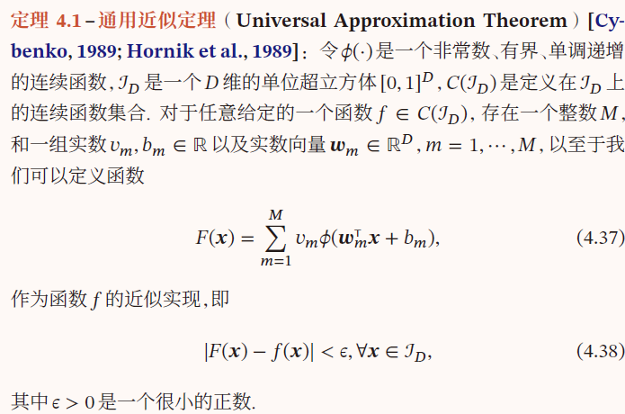

#### **2.应用于机器学习**

**1.特征映射**

FNN可以将原始输入$ x $通过非线性变换$ ϕ(x) $映射到更有用的特征空间，从而提高分类器效果

**2.输出预测**

if使用的分类器是Logistic/softmax分类器,那么分类器可以看作神经网络最后一层

神经网络直接输出不同类别的条件概率𝑝(𝑦|𝒙),即
$$
sigmoid情况:p(y=1|x) = a^{(L)}\\

softmax情况:\hat{y} = softmax(z^{(L)})
$$

#### **3.FNN参数学习**

**类似机器学习:结构化风险函数(正则化)**

>   **正则化项:==从p范数换成了Frobenius范数==**

**<font color=red>参数矩阵W初始化:</font>**

>在全连接神经网络 (FNN) 中，权重矩阵 W 的初始化是一个非常重要的步骤。
>
>**关于权重矩阵能否都等于 0 的问题：**
>
>**==答案是：不能，绝对不能将所有权重初始化为 0。==**
>
>原因在于“对称性问题”（Symmetry Problem）：
>
>1.  如果所有权重都初始化为 0，那么在正向传播时，同一层中的所有神经元接收到的输入（在经过前一层加权求和后）将是相同的（因为 W⋅x 对于所有神经元的输入 x 来说，如果 W 全为 0，结果都是 0，然后加上偏置 b）。
>2.  这意味着在反向传播计算梯度时，同一层中的所有权重会得到完全相同的梯度。
>3.  因此，在参数更新时，同一层中的所有权重会以完全相同的方式进行更新。
>4.  结果是，同一层中的所有神经元将学习到完全相同的特征。无论你设置了多少个神经元，它们的功能都是冗余的，网络的能力将大大受限，无法学习到复杂的模式。网络基本上就等同于只有一个神经元的层。
>
>**关于 FNN 中 W 权重矩阵如何初始化的：**
>
>由于不能初始化为 0，权重通常需要被初始化为**小的随机值**。这样做的目的是：
>
>1.  **打破对称性：** 确保不同神经元在训练开始时具有不同的权重，从而能够学习到不同的特征。
>2.  **避免梯度消失或爆炸：** 合适的初始化可以帮助控制激活值和梯度的尺度，使其在训练过程中不会变得过小（导致梯度消失）或过大（导致梯度爆炸）。
>
>一些常见的权重初始化方法包括：
>
>1.  **随机均匀分布初始化 (Random Uniform Initialization):** 将权重从一个均匀分布 [a,b] 中随机采样。通常 a 和 b 会根据输入和输出神经元的数量进行缩放，以控制方差。
>2.  **随机正态分布初始化 (Random Normal Initialization):** 将权重从一个均值为 0、标准差为 σ 的正态分布中随机采样。标准差 σ 也需要根据层的大小进行调整。
>3.  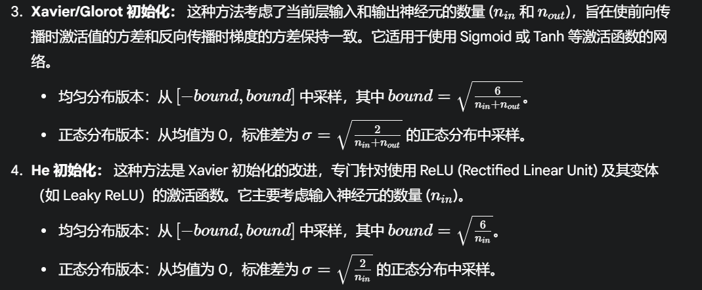
>
>现代深度学习框架（如 TensorFlow, PyTorch）通常提供了这些标准的初始化方法，并且在构建网络层时可以方便地指定使用哪种初始化器。
>
>总之，权重初始化是 FNN 成功训练的关键一步。初始化为 0 会导致网络无法学习，而使用小的随机值（特别是根据层大小和激活函数调整的 Xavier 或 He 初始化）是推荐的做法。

**结构化风险函数(带有正则化项的损失函数)**

>   $$
>   \mathbb{R}(W,b) = \frac{1}{N}\sum^{N}_{n=1}L(y^{(n)},\hat{y}^{(n)})+\frac{1}{2}\lambda||W||^2_F\\
>   \\
>   Frobenius范数:||W||^2_F = \sum^{L}_{l=1}\sum^{M_1}_{i=1}\sum^{M_{i-1}}_{j=1}(w^{(l)}_{ij})^2(每个神经元权重的平方和)\\
>   \\
>   \mathbb{R}(W,b) = \frac{1}{N}\sum^{N}_{n=1}L(y^{(n)},\hat{y}^{(n)})+\frac{1}{2}\lambda(\sum^{L}_{l=1}\sum^{M_1}_{i=1}\sum^{M_{i-1}}_{j=1}(w^{(l)}_{ij})^2)
>   $$

**梯度下降法==(查找损失函数的最小值=查找最优的参数矩阵)==**

>   $$
>   \begin{align}
>   W^{(l)}\leftarrow W^{(l)} - \alpha\frac{\partial\mathbb{R}(W,b)}{\partial W^{(l)}} &= W^{(l)}-\alpha(\frac{1}{N}\sum^{N}_{n=1}(\frac{\partial\mathbb{L}(y^{(n)},\hat{y}^{(n)})}{\partial W^{(l)}})+\lambda W^{(l)}) \\
>   \\
>   b^{(l)}\leftarrow b^{(l)} - \alpha\frac{\partial\mathbb{R}(W,b)}{\partial b^{(l)}} &= b^{(l)}-\alpha(\frac{1}{N}\sum^{N}_{n=1}(\frac{\partial\mathbb{L}(y^{(n)},\hat{y}^{(n)})}{\partial b^{(l)}})
>   \end{align}
>   $$

## **4.反向传播(BP算法)**

###### **1.前提(引入链式法则)**

>   上述梯度下降法会很繁琐:对矩阵进行微分,所以我们先计算Loss对于每个参数的偏导
>   $$
>   \begin{align}\frac{\partial\mathbb{L}(y,\hat{y})}{\partial \omega^{(l)}_{ij}} = \frac{\partial\mathbb{L}(y,\hat{y})}{\partial z^{(l)}}
>   \frac{\partial z^{(l)}}{\partial \omega^{(l)}_{ij}}\\
>   
>   \frac{\partial\mathbb{L}(y,\hat{y})}{\partial b^{(l)}} = \frac{\partial\mathbb{L}(y,\hat{y})}{\partial z^{(l)}}
>   \frac{\partial z^{(l)}}{\partial b^{(l)}}
>   \end{align}
>   \Rightarrow
>   \frac{\partial z^{(l)}}{\partial \omega^{(l)}_{ij}},
>   \frac{\partial z^{(l)}}{\partial b^{(l)}},\frac{\partial\mathbb{L}(y,\hat{y})}{\partial z^{(l)}}
>   $$

**<font color=red>核心公式:$z^{(l)}=W^{(l)}a^{(l-1)}+b^{(l)} $</font>**

**2.计算$\frac{\partial z^{(l)}}{\partial \omega^{(l)}_{ij}}$且($z^{(l)}=W^{(l)}a^{(l-1)}+b^{(l)} $)**

>   
>   $$
>   \begin{align}
>   \frac{\partial z^{(l)}}{\partial \omega^{(l)}_{ij}} 
>   &= 
>   \bigg[
>   \frac{\partial z^{(l)}_1}{\partial \omega^{(l)}_{ij}},\cdots,
>   \frac{\partial z^{(l)}_i}{\partial \omega^{(l)}_{ij}},\cdots,
>   \frac{\partial z^{(l)}_{M_l}}{\partial \omega^{(l)}_{ij}}
>   \bigg]\\
>   &=
>   \bigg[
>   0,\cdots,
>   \frac{\partial (\omega_{i:}^{(l)}a^{(l-1))}+b^{l}_{i})}{\partial \omega^{(l)}_{ij}},\cdots,
>   0
>   \bigg]
>   \\
>   &=
>   \bigg[
>   0,\cdots,
>   a^{(l-1)}_j,\cdots,
>   0
>   \bigg]
>   \end{align}
>   $$
>   **($\omega_{i:}$为权重矩阵𝑾^{(𝑙)} 的第𝑖 行)**

**3.计算**$\frac{\partial z^{(l)}}{\partial b^{(l)}}$且($z^{(l)}=W^{(l)}a^{(l-1)}+b^{(l)} $)

>   **常数项,求导了以后就是单位矩阵**

**4.计算**$\frac{\partial\mathbb{L}(y,\hat{y})}{\partial z^{(l)}}$

>**意义:**
>
>>   **a.表示第𝑙层神经元对最终损失的影响**
>>
>>   **b.最终损失对第𝑙层神经元的敏感程度**
>>
>>   **c.不同神经元对网络能力的贡献程度**
>
>**==因此称作第l层神经元的误差项,用$\delta$表示==**
>$$
>\begin{align}\delta^{(l)} 
>= \frac{\partial\mathbb{L}(y,\hat{y})}{\partial z^{(l)}}
>= 
>\frac{\partial\mathbb{L}(y,\hat{y})}{\partial z^{(l+1)}}
>\frac{\partial z^{(l+1)}}{\partial a^{(l)}}
>\frac{\partial a^{(l)}}{\partial z^{(l)}}
>\end{align}
>\\\quad
>a^{(l)} = f_l(z^{(l)})(激活后的输出值)
>$$
>**<font color=red>也就是说，第𝑙层的误差项可以通过第𝑙+1层的误差项计算</font>**

**5.重写公式(反向求导的形式)**

>$$
>\begin{align}
>\frac{\partial\mathbb{L}(y,\hat{y})}{\partial \omega^{(l)}_{ij}}
>&= 
>\big[
>0,\cdots,a^{(l-1)}_{j},\cdots,0
>[\delta^{(l)}_1,\cdots,\delta^{(l)}_i,\cdots,\delta^{(l)}_{Ml}] 
>\\
>&= \delta^{(l)}_i  a^{(l-1)}_{j}
>\\
>\\
>\big[\frac{\partial\mathbb{L}(y,\hat{y})}{\partial \omega^{(l)}_{ij}}\big]_{ij} &= [\delta^{(l)}_i  a^{(l-1)}_{j}]_{ij}(进一步化为的矩阵形式)
>\end{align}
>$$
>
>**对于每一层而言**
>$$
>\begin{align}
>\frac{\partial\mathbb{L}(y,\hat{y})}{\partial \omega^{(l)}} &= \delta^{(l)}(a^{l-1})^T\\
>\\
>\frac{\partial\mathbb{L}(y,\hat{y})}{\partial b^{(l)}} &= \delta^{(l)}
>\end{align}
>$$

###### **2.反向传播的详细过程**

**使用误差反向传播算法的前馈神经网络训练过程可以分为以下三步：**

>   （1） 前馈计算每一层的净输入$𝒛^{(𝑙)}$ 和激活值$𝒂^{(𝑙)}$，直到最后一层；
>
>   （2） 反向传播计算每一层的误差项𝛿(𝑙)；
>   $$
>   \begin{align}\delta^{(l)} 
>   = \frac{\partial\mathbb{L}(y,\hat{y})}{\partial z^{(l)}}
>   &= 
>   \frac{\partial\mathbb{L}(y,\hat{y})}{\partial z^{(l+1)}}
>   \frac{\partial z^{(l+1)}}{\partial a^{(l)}}
>   \frac{\partial a^{(l)}}{\partial z^{(l)}}\\
>   \\
>   &=\delta^{(l+1)}W^{l+1} ⊙f'(z^{(l)})(隐藏层)\\
>   \\
>   \delta^{(L)} 
>   = \frac{\partial\mathbb{L}(y,\hat{y})}{\partial z^{(l)}}
>   &= 
>   \frac{\partial\mathbb{L}(y,\hat{y})}{\partial \hat{y}}
>   ⊙
>   \frac{\partial \hat{y}}{\partial z^{(l)}}\\
>   \\
>   &=\frac{\partial\mathbb{L}}{\partial \hat{y}^{(L)}}⊙f'(z^{(L)})(最后一层)
>   \end{align}
>   $$
>
>   >   **解释:**
>   >
>   >   $\delta^{(l+1)}$:  $l+1$层的误差项
>   >
>   >   $W^{l+1}$:  $l$层到$l+1$层的权重矩阵
>   >
>   >   $f'(z^{(l)})$:  第$l$层激活函数对净输入的导数
>   >
>   >   >|           | $f(x)$               | $f'(x)$  | $\frac{\partial a^{(l)}}{\partial z^{(l)}}$ |
>   >   >| --------- | -------------------- | -------- | ------------------------------------------- |
>   >   >| $Sigmoid$ | $\frac{1}{1+e^{-x}}$ | $a(1-a)$ | $a^{(l)}(1-a^{(l)})$                        |
>   >   >| $ReLU $   | $max(0,z)$           | -        | -                                           |
>   >   >| $Tanh$    | $tanh(z)$            | $1-a^2$  | $1-(a^{(l)})^2$                             |
>
>   >   **使用Hadamard Product的原因:**
>   >
>   >   $\delta^{(l+1)}$是$[N_{l+1},1]$,$W^{l+1}$是$[N_{l},N_{l+1}]$,乘积是$[N_{l},1]$的列向量
>   >
>   >   $f'(z^l)$是逐元素求导的$[N_l,1]$的向量
>   >   $$
>   >   a = \begin{bmatrix}1&2&3\\4&5&6\\7&8&9\end{bmatrix},b = \begin{bmatrix}1&2&3\\4&5&6\\7&8&9\end{bmatrix}\Rightarrow a⊙b = \begin{bmatrix}1*1&2*2&3*3\\4*4&5*5&6*6\\7*7&8*8&9*9\end{bmatrix}
>   >   $$
>
>   （3） 计算每一层参数的偏导数，并更新参数．

## **5.自动梯度计算**

#### **1.数值微分**

**数值微分（Numerical Differentiation）是用数值方法来计算函数𝑓(𝑥)的导数**
$$
\begin{align}
f'(x) &= lim_{\Delta x\rightarrow0}\frac{f(x+\Delta x)-f(x)}{\Delta x}\\
\\
f'(x) &= lim_{\Delta x\rightarrow0}\frac{f(x+\Delta x)-f(x-\Delta x)}{2\Delta x}
\end{align}
$$
**假设每次正向传播的计算复杂度为$𝑂(𝑁)$，则计算数值微分的总体时间复杂度为$$𝑂(𝑁^2)$$．**

#### **2.符号微分**

**符号微分（Symbolic Differentiation）是一种基于符号计算的自动求导方法．**

符号计算的输入和输出都是数学表达式，一般包括对数学表达式的化简、因式分解、微

分、积分、解代数方程、求解常微分方程等运算．

符号计算的一个优点是符号计算和平台无关，可以在CPU 或GPU 上运行

符号微分也有一些不足之处：

>   1）编译时间较长，特别是对于循环，需要很长时间进行编译；
>
>   2）为了进行符号微分，一般需要设计一种专门的语言来表示数学表达式，并且要对变量（符号）进行预先声明
>
>   3）很难对程序进行调试

#### **3.自动微分**

###### **1.自动微分简介**

自动微分的基本原理是所有的数值计算可以**分解为一些基本操作**，包含 +, −, ×, / 和一些初等函数exp, log, sin, cos 等，然后利用**链式法则**来计算一个复合函数的梯度

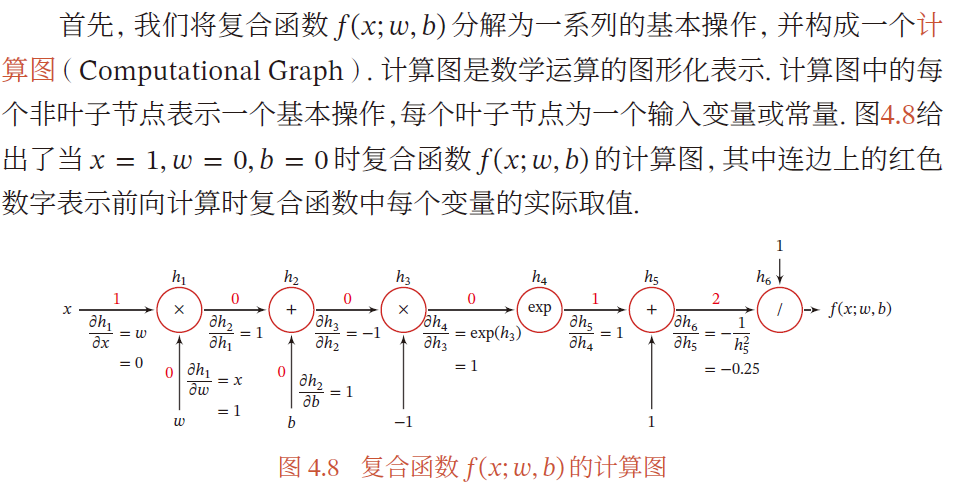

###### **2.前向模式**

$$
\begin{align}
&\frac{\partial h_1}{\partial \omega}
\\
\frac{\partial h_2}{\partial \omega}=&\frac{\partial h_2}{\partial h_1}\frac{\partial h_1}{\partial \omega}
\\
\frac{\partial h_3}{\partial \omega}=&\frac{\partial h_3}{\partial h_2}\frac{\partial h_2}{\partial h_1}\frac{\partial h_1}{\partial 
\omega}
\\
\frac{\partial f(x;\omega,b)}{\partial \omega}=&\frac{\partial h_n}{\partial h_{n-1}}\cdots\frac{\partial h_2}{\partial h_1}\frac{\partial h_1}{\partial 
\omega}
\end{align}
$$

###### **3.反向模式(递归)**

$$
\begin{align}
\frac{\partial f(x;\omega,b)}{\partial h_n}&=???\\
\\
\frac{\partial f(x;\omega,b)}{\partial h_{n-1}} &= \frac{\partial f(x;\omega,b)}{\partial h_{n}}\frac{\partial h_{n}}{\partial h_{n-1}}
\\
\vdots\qquad&=\qquad\vdots\\
\\
\frac{\partial f(x;\omega,b)}{\partial w} &= \frac{\partial f(x;\omega,b)}{\partial h_{1}}\frac{\partial h_{1}}{\partial w}

\end{align}
$$

###### **4.静态计算图和动态计算图**

静态计算图是在编译时构建计算图，计算图构建好之后在程序运行时不能改变.

动态计算图是在程序运行时动态构建．

静态计算图在构建时可以进行优化，并行能力强，但灵活性比较差．

动态计算图则不容易优化，当不同输入的网络结构不一致时，难以并行计算，但灵活性高

###### **5.符号微分与自动微分的对比**

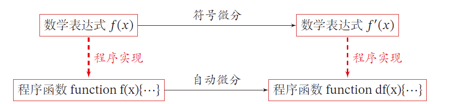

## **6.优化问题**

#### **1.非凸优化问题**

**平方误差损失$(1-y)^2$和交叉熵损失函数$logy$的选择**

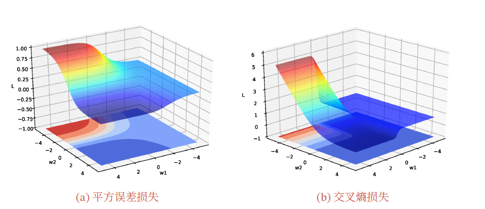

#### **2.梯度消失问题**

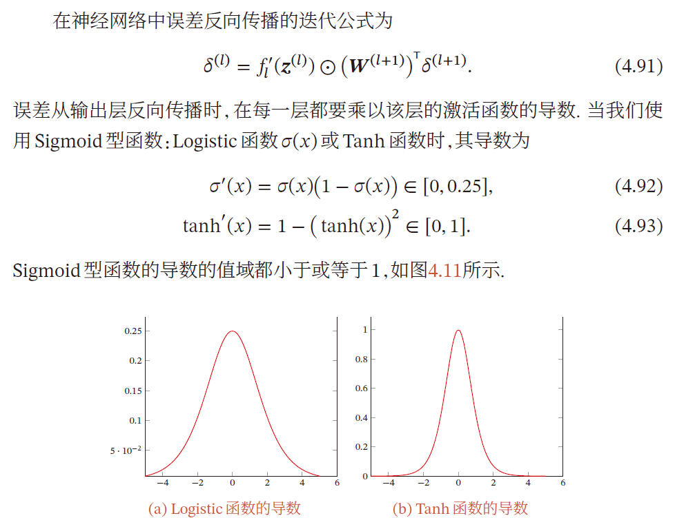

**如果x轴趋近于0,y就趋近于1,每次迭代的剩余量很小,直到消失**

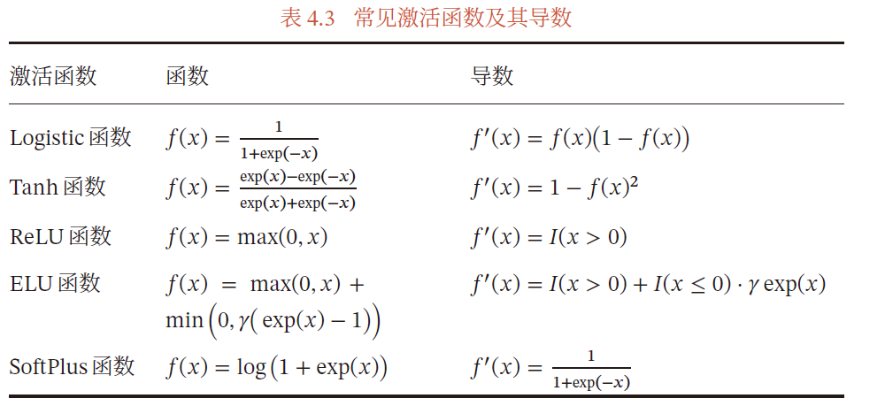