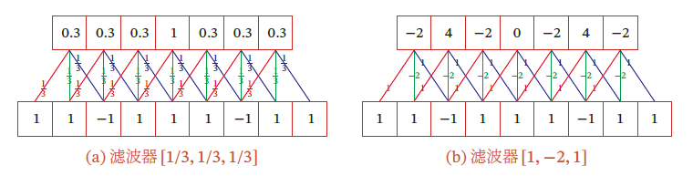
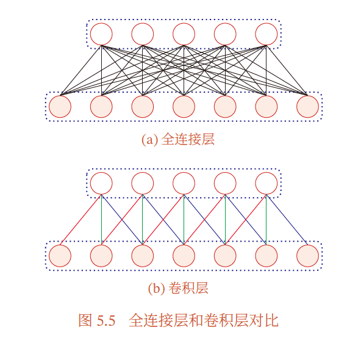
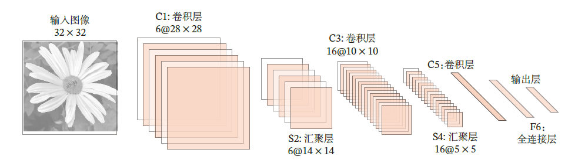
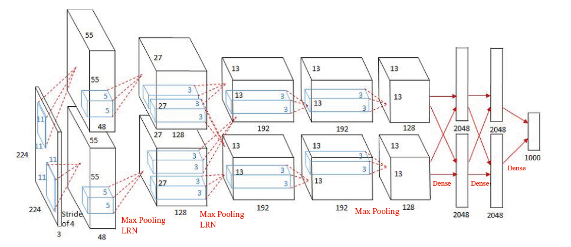
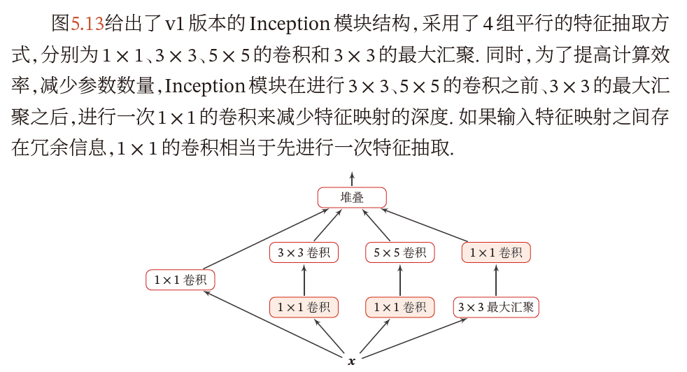
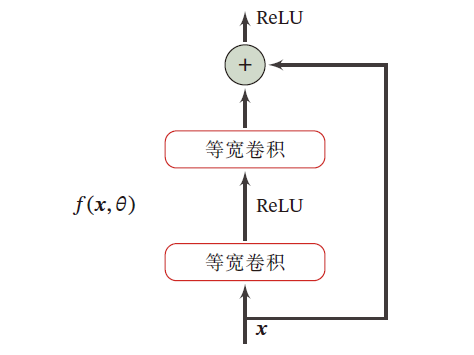

# **Chap 5 CNN**

## **1.卷积**

#### **1.CNN简介**

###### **1.CNN的特性**

**CNN(卷积神经网络)是一种具有<font color=red>局部连接和权重共享特性</font>的==深度前馈神经网络==**

###### **2.CNN产生的原因(FNN的缺点)**

**1.参数太多:if一个图片`100*100*3(ch)`,则需要3w个相互独立的连接 **

(决定参数的因素:数据大小和隐藏层的层数)

<font color=red>(直接导致过拟合问题)</font>

**2.局部不变性特征:自然图像的特性,只进行尺度变换/平移/旋转不影响语义信息**

(FNN需要单独先进行数据增强以后再训练)


###### **3.感受野机制**

**解释:神经元只对某区域的刺激才能激活该神经元**

**CNN中的感受野机制**

>   **==组成:卷积层/汇聚层/全连接层==**
>
>   **==特性:局部连接/权重共享/汇聚==**
>
>   **权重共享:同一个卷积核在输入图像（或上一层的特征图）的不同空间位置上进行卷积运算时，使用的是同一组权重参数**
>
>   **局部连接:卷积核只遍历特征图的部分特征进行计算**
>
>   >   注意特征图之间的元素不是相互独立的:感受野重叠+共享权重

###### **4.CNN的使用邻域**

**图像分类/物体识别/图像分割**

#### **2.卷积**

###### **1.一维卷积(信息学)**

**一维卷积的主要目的:用于计算信号的延迟累积**

**一维卷积的过程:(假设信号发生器每个时刻t产生一个信号$x_t$,信息衰减率为$ w_k$)**

>   (信息衰减率:在k-1个时间步长后,信息为原来的$w_k$倍,$w_1=1,w_2 = \frac{1}{2},w_3=\frac{1}{4} $)
>
>   **那么在时刻t收到的信号$y_t $为信号的累积量**
>   $$
>   y_t = (1\times x_t)+(\frac{1}{2}\times x_{t-1})+(\frac{1}{4}\times x_{t-2}) = \sum^{3}_{k=1}w_kx_{t-k+1}
>   $$
>   **<font color=red>其中$w_1,w_2,\cdots $为滤波器(卷积核),x是信号序列</font>**
>
>   (滤波器的长度远小于信号序列x的长度)

**==这种卷积的过程就是对[t-2,t-1,t]的信号量进行滑动窗口==**

>   (这里卷积核的大小是3,所以如果设置滤波器(卷积核)为[$\frac{1}{3}\frac{1}{3}\frac{1}{3}$],就是求均值)
>
>   

###### **2.二维卷积**

**(二维卷积就是把滑动窗口应用于二维矩阵,即图像上)**

>   $$
>   t_{ij} = \sum^{U}_{u=1}\sum^{V}_{V=1}w_{uv}x_{i=u+1,j-v+1}
>   $$

**==这种卷积的过程就是卷积核和窗口矩阵的点乘法==**

**<font color=red>标准的卷积是需要对卷积核进行反转的,但是深度学习中,卷积核是学习出来的,最终总会达到一个标准值,因此翻转与否都相同</font>**(这种说法也是互相关操作的定义)

###### **3.常见滤波器以及其形式**

**1.均值滤波器**

>   **主要目的:对窗口的所有像素取平均值,去除高斯噪声**
>
>   **主要形式:**
>   $$
>   \begin{bmatrix}1&1&1\\1&1&1\\1&1&1\end{bmatrix}
>   $$

**2.高斯滤波器**

>   **主要目的:基于二维高斯函数,中间的像素权重高,边缘像素权重低,去噪保留边缘**
>
>   **主要形式:(可能的近似形式,$\sigma\approx 0.8 $)**
>   $$
>   \begin{bmatrix}1&2&1\\2&4&2\\1&2&1\end{bmatrix}\quad \begin{bmatrix}\frac{1}{16}&\frac{1}{8}&\frac{1}{16}\\
>   \frac{1}{8}&\frac{1}{4}&\frac{1}{8}\\
>   \frac{1}{16}&\frac{1}{8}&\frac{1}{16}
>   \end{bmatrix}
>   $$

**3.Sobel滤波器**

>   **主要目的:通过计算亮度差异近似图像梯度,检测水平或者垂直方向的边缘**
>
>   检测垂直边缘:突出水平方向的亮度变化(中间为0.左右相反)
>   $$
>   \begin{bmatrix}-1&0&1\\-2&0&2\\-1&0&1\end{bmatrix}
>   $$
>   检测水平边缘:突出垂直方向的亮度变化(中间为0,上下相反)
>   $$
>   \begin{bmatrix}-1&2&-1\\0&0&0\\1&2&1\end{bmatrix}
>   $$

**4.Laplacian滤波器**

>   **主要目的:计算图像的二阶导数,在亮度变化剧烈或者孤立点处响应强烈**
>   $$
>   \begin{bmatrix}0&1&0\\1&-4&1\\0&1&0\end{bmatrix}\quad \begin{bmatrix}1&1&1\\1&-8&1\\1&1&1\end{bmatrix}
>   $$
>   (中心是负数,周围是正数,并且所有系数之和为0)

**5.图像锐化滤波器**

>   **主要目的:增强图像中像素于其周围像素之间的对比度,使得边缘和细节更清晰**
>   $$
>   \begin{bmatrix}0&-1&0\\-1&5&-1\\0&1&0\end{bmatrix}
>   $$
>   (中心增强,周围抑制)

###### **4.卷积变种**

(主要思想是引入了滑动步长stride和零填充padding)

**1.滑动步长stride**

>   **stride = 1,保留更多的原始图像信息,保持空间分辨率**
>
>   (一般设置在网络的前几层)
>
>   **stride = 2,一种常见的下采样方法,减少计算量,增加后序层感受野**
>
>   (一般设置在卷积层后的池化层进行下采样)
>
>   **==stride > 2基本就会导致信息的丢失,不建议==**
>
>   (更大的stride会使得后序的感受野增加更快)

**2.填充padding**

>   (M是神经元数量,K是卷积大小,步长是S)
>
>   **窄卷积,stride=1,两端不补0,卷积输出长度为M-K+1**
>
>   **宽卷积,strde=1,两端补0:P=K-1,卷积输出长度为M+K-1**
>
>   **等宽卷积,stride=1,两端补0:P=(k-1)/2,卷积输出长度为M**

###### **5.卷积的数学性质**

**1.交换性:对于进行宽卷积padding的图片,和二维卷积核,他们之间存在交换性**

**2.导数**

## **2.CNN**

###### **1.使用卷积代替全连接**

**在FNN中,全连接的表示就是$M_i \times M_{l-i}$(权重矩阵)**

**使用卷积代替全连接**

>   **第$l$层的净输入$z^{(l)}$ = ==l-1层活性值$a^{(l-1)}$== $\otimes$ ==卷积核$w^{(l)}\in \mathbb{R}^K $==的卷积**
>   $$
>   z^{(l)} = w^{(l)}\otimes a^{(l-1)}+b^{(l)}
>   $$
>   **其中卷积核$w^{(l)} \in \mathbb{R}^K $是可学习的权重向量**
>
>   **其中$b^{(l)}\in \mathbb{R} $是可学习的偏置**

###### **2.CNN的性质**

**1.局部连接:卷积层的神经元都只和局部窗口内的神经元相连**

>   

**2.权重共享:卷积核只捕捉输入数据的一种特定的局部特征**

>   **如果需要提取多种特征就需要使用多个不同的卷积核**

###### **3.CNN的层种类**

**主要包括:卷积层\激活函数层\Pooling层\全连接层**

**卷积层的主要作用是提取特征:因此也可以决定特征的数量**

**激活函数层:一般使用ReLU引入非线性因素**

**Pooling层:也叫做下采样层,通过下采样策略减少单个特征图的大小**

**全连接层:对展开的神经元进行全连接,计算最后输出结果**

```python
import torch.nn.functional as F
import torch
import torch.nn as nn
import torch.optim as optim

class CNN(nn.module):
    def __init__(self):
        self.conv1 = nn.Conv2d(1,32,3,padding=1)
        self.conv2 = nn.Conv2d(32,64,3,padding=1)
        self.pool = nn.MaxPool2d(2,2)
        self.fc1 = nn.Linear(,)
        self.fc2 = nn.Linear(,)
   def forward(self,x):
        # x = [1,28,28][特征图个数，特征图大小]          
    	x = F.relu(self,conv1(x))   # -> [32,28,28]
        x = self.pool(x)            # -> [32,14,14]
        x = F.relu(self,conv2(x))   # -> [64,14,14]        
        x = self.pool(x)            # -> [64,7,7]
		# x = [64,7,7]
        x = x.view(-1,64*7*7)       
        x = F.relu(self.fc1(x))
        x = self.fc2(x)
        return x
```

## **Padding and Stride**

stride=1 padding=0 上下两个像素被省略

(尺度不变性引入padding)


## **3.参数学习**

**预测值(净输入)**
$$
z^{(l,p)}_{i,j} = \sum^{D}_{d=1}\sum^{K-1}_{k=0}\sum^{K-1}_{m=0}w^{(l,p,d)}_{k,m}\cdot x^{(l-1.d)}_{i+k,j+m}+b^{(l,p)}(z = wx+b)
$$
**目标函数(损失函数)**
$$
\frac{\partial{\mathbb{L}}}{\partial W^{(l,p,d)}_{k',m'} } =\sum_{i,j}\frac{\partial \mathbb{L}}{\partial z^{(l,p)}_{i,j}}\frac{\partial z^{(l,p)}_{i,j} }{\partial W^{(l,p,d)}_{k',m'}} (对于所有输出空间位置)
$$
**分开考虑:**

对于损失函数对净输入的偏导数$\frac{\partial \mathbb{L}}{\partial z^{(l,p)}_{i,j}} $

>**如果当前是最后一层**
>$$
>\begin{align}
>&(\delta^{(L)}_{i,j}) = 
>\frac{\partial \mathbb{L}}{\partial z^{(l,p)}_{i,j}} 
>= \frac{\partial{\mathbb{L}}}{\partial y_{i,j}}\frac{\partial y_{i,j}}{\partial z^{(L)}_{i,j} } 
>\\
>\\
>&(\frac{\partial{\mathbb{L}}}{\partial y_{i,j}}是activationnc对输出y的偏导数)\\
>\\
>&(\frac{\partial y_{i,j}}{\partial z^{(L)}_{i,j} }是输出y对净输入的偏导数=activation )
>\end{align}
>$$
>**否则需要反向传播**
>$$
>\begin{align}
>&(\delta^{(L)}_{i,j}) = 
>\frac{\partial \mathbb{L}}{\partial z^{(l,p)}_{i,j}} 
>=\frac{\partial L}{\partial a^{(l,p)}_{i,j}}\frac{\partial a^{(l,p)}_{i,j}}{\partial z^{(l,p)}_{i,j}}
>\\
>&(\frac{\partial L}{\partial a^{(l,p)}_{i,j}}表示损失函数对当前层激活输出的偏导数or下一层的净输入)
>\\
>\\
>&\therefore \frac{\partial \mathbb{L}}{\partial z^{(l,p)}{i,j}} = \sum_{p'} \sum_{i'} \sum_{j'}
>\frac{\partial\mathbb{L}}{\partial z^{(l+1,p')}{i',j'}}\cdot \frac{\partial z^{(l+1,p')}{i',j'}}{\partial a^{(l,p)}{i,j}}\cdot \frac{\partial a^{(l,p)}{i,j}}{\partial z^{(l,p)}{i,j}}
>\\
>\\
>&(\frac{\partial\mathbb{L}}{\partial z^{(i+1,p')}_{i',j'}}表示下一项的误差项,需要反向传播)
>\\
>\\
>&(\frac{\partial z^{(i+1,p')}_{i',j'}}{\partial a^{(l,p)}_{i,j}}=W^{i-i'}_{j-j'}表示下一层卷积核中连接  a^{(l,p)}_{i,j}  到  z^{(l+1,p')}_{i',j'}的权重)
>\\
>\\
>&(\frac{\partial a^{(l,p)}_{i,j}}{\partial z^{(l,p)}_{i,j}}= \sigma'(z^{(l,p)}{i,j})表示当前层激活函数的导数)
>\end{align}
>$$
>


$$
\frac{\partial\mathbb{L}}{\partial W^{(L,q,d)}} = \frac{\partial \mathbb{L}}{\partial z^{(l,p)}}\otimes x^{(l-1,d)} = \delta^{(l,p)}\otimes x^{(l-1,d)}
$$

>**解释：**
>
>$W^{(l,p,d)}$:卷积核(第l层卷积层,第p个输出特征图,上一层第d个输入特征图)
>
>$z^{(l,p)} $:表示第l层卷积层中,第p个输出特征图的净输入,其中
>$$
>z^{(l,p)} = \sum^{D}_{d=1}W^{(l,p,d)}\otimes x^{(l-1,d)}+b^{(l,p)}\\
>
>(z= Wx+b)
>$$
>$\frac{\partial\mathbb{L}}{\partial z^{(l,p)} } $表示损失函数对净输入的偏导数($\delta ^{(l,p)} $表示)
>

## **4.经典的CNN**

###### **0.计算复现**

**[Batch Size, Channels, Height, Width] -> [B,C,H,W]**

**[$W_{in}$, Kernel, Stride, Paddle] -> [W,K,S,P]**
$$
W_{out} = \lfloor\frac{W-K+2P}{s}\rfloor+1
$$

###### **1.LeNet**

一共7层

(conv->AvgP->conv->AvgP->conv)

```python
import torch
import torch.nn as nn
import torch.nn.functional as F

class LeNet5(nn.Module):
    def __init__(self, num_classes=10):
        # 输入图片大小[N,1,28,28]灰色,彩色就是[N,3,28,28]
        super(LeNet5, self).__init__()
        self.conv1 = nn.Conv2d(in_channels=1, out_channels=6, kernel_size=5, stride=1, padding=0)
		# [N,1,28,28]   # Kernel[28,5,1,0] [W,K,S,P]
        # (28-5+2*0)/1 + 1 = 24 
        # [N,1,24,24] -> 6C -> [N,6,24,24]
        self.pool1 = nn.AvgPool2d(kernel_size=2, stride=2)
		# [N,6,24,24]   # kernel[24,2,2,0] [W,K,S,P]
        # (24-2+2*0)/2 + 1 = 12
        # [N,6,12,12] -> 1C ->[N,6,12,12]
        self.conv2 = nn.Conv2d(in_channels=6, out_channels=16, kernel_size=5, stride=1, padding=0)
		# [N,6,12,12]   # kernel[12,5,1,0]
        # (12-5+2*0)/1 + 1 = 8
        # [N,6,8,8] ->16C -> [N,16,8,8]
        self.pool2 = nn.AvgPool2d(kernel_size=2, stride=2)
		# [N,16,8,8]    # kernel[8,2,2,0]
        # (8-2+2*0)/2 +1 = 5
        # [N,16,5,5] ->1C -> [N,16,5,5]
        self.fc1 = nn.Linear(in_features=16 * 5 * 5, out_features=120)
        # [400,120]
        self.fc2 = nn.Linear(in_features=120, out_features=84)
		# [120,84]
        self.fc3 = nn.Linear(in_features=84, out_features=num_classes)
		# [84,10]
    def forward(self, x):
        x = F.relu(self.conv1(x))
        x = self.pool1(x)
        x = F.relu(self.conv2(x))
        x = self.pool2(x)
        x = torch.flatten(x, 1) 
        x = F.relu(self.fc1(x))
        x = F.relu(self.fc2(x))
        x = self.fc3(x)
        return x
```

###### **2.AlexNet**



$Stride = 1,Padding=0$的情况下:$W_{in} = 32$,$W_{out} = 28$
$$
\therefore 28 = \frac{32-K+2*0}{1}+1\Rightarrow K=5
$$

```python
import torch
import torch.nn as nn
import torch.nn.functional as F
class AlexNet(nn.Module):
    def __init__(self, num_classes=1000):
        super(AlexNet, self).__init__()
        self.features = nn.Sequential(
            # input [N,3,224,224]
            # Layer 1: Conv + ReLU + LRN + MaxPool
            nn.Conv2d(in_channels=3, out_channels=96, kernel_size=11, stride=4, padding=2),
            # [N,3,224,224] # [224,11,4,2][W,K,S,P]
            # (224-11+2*2)/4 +1 = 55
            # [N,3,55,55] ->96C -> [N,96,55,55]
            nn.ReLU(inplace=True), # inplace=True saves memory
            nn.LocalResponseNorm(size=5, alpha=1e-4, beta=0.75, k=2), 
            nn.MaxPool2d(kernel_size=3, stride=2),# Local Response Normalization
			# [N,96,55,55] # [55,3,2,0][W,K,S,P]
            # (55-3+2*0)/2 = 27
            # [N,96,27,27] ->1C -> [N,96,27,27]

            # Layer 2: Conv + ReLU + LRN + MaxPool
            nn.Conv2d(in_channels=96, out_channels=256, kernel_size=5, stride=1, padding=2),
            # [N,96,27,27] # [27,5,1,2][W,K,S,P]
            # (27-5+2*2)/1 +1 = 27
            # [N,96,27,27] ->256C -> [n,256,27,27]
            nn.ReLU(inplace=True),
            nn.LocalResponseNorm(size=5, alpha=1e-4, beta=0.75, k=2),
            nn.MaxPool2d(kernel_size=3, stride=2),
            # [N,256,27,27] # [27,3,2,0][W,K,S,P]
            # (27-3+2*0)/2 +1 =13
            # [N,256,13,13]

            # Layer 3: Conv + ReLU (No LRN here in standard AlexNet)
            nn.Conv2d(in_channels=256, out_channels=384, kernel_size=3, stride=1, padding=1),
            # [N,256,13,13] # [13,3,1,1][W,K,S,P]
            # (13-3+2*1)/1 + 1 =13
            # [N,256,13,13] ->384C ->[N,384,13,13] 
            nn.ReLU(inplace=True),

            # Layer 4: Conv + ReLU
            nn.Conv2d(in_channels=384, out_channels=384, kernel_size=3, stride=1, padding=1),
            # [N,384,13,13]  #[13,3,1,1][W,K,S,P]
            # (13-3+2*1)/1 + 1 = 13
            # [N,384,13,13] ->384C -> [N,384,13,13] 
            nn.ReLU(inplace=True),

            # Layer 5: Conv + ReLU + MaxPool
            nn.Conv2d(in_channels=384, out_channels=256, kernel_size=3, stride=1, padding=1),
            # [N,384,13,13]  #[13,3,1,1][W,K,S,P]
            # (13-3+2*1)/1 + 1 = 13
            # [N,384,13,13] ->256C -> [N,256,13,13] 
            nn.ReLU(inplace=True),
            nn.MaxPool2d(kernel_size=3, stride=2),
            # [N,256,13,13] #[13,3,2,0][W,K,S,P]
            # (13-3+2*0)/2 +1  =6
            # [N,256,6,6]
        )
        
        self.classifier = nn.Sequential(
            nn.Dropout(p=0.5), 
            nn.Linear(in_features=256 * 6 * 6, out_features=4096), 
            nn.ReLU(inplace=True),
            nn.Dropout(p=0.5),
            nn.Linear(in_features=4096, out_features=4096),
            nn.ReLU(inplace=True),
            nn.Linear(in_features=4096, out_features=num_classes), # [4096,1000]
        )
    def forward(self, x):       
        x = self.features(x)
        # The size will be (Batch Size, 256 * 6 * 6) as calculated below
        x = torch.flatten(x, 1)
        x = self.classifier(x)
        return x
```



使用了并行训练,采用了非线性激活函数,使用Dropout

5个卷积层,3个汇聚层(Pool)和3个fc

>   对于特征图的全连接称作Dense

###### **3.GoogleNet**

Inception V1模块通过多个卷积核进行堆叠



变体:为了避免过拟合,用多个小的卷积核代替大的参数核(卷积核)

###### **4.ResNet**

残差网络:通过给非线性的卷积层增加直连边的方式提高传输效率

恒等函数+残差函数(x+f(x,\theta)),在卷积核加上跳连边



好处1:避免梯度消失

**计算模型中的参数方法(计算偏导数):误差反向传播(基本概念要考)**

>   实际设计层数为152层,会出现梯度消失
>
>   增加残差连接可以直接通过跳连边进行反向传播

## **4.5 目标检测**

###### **1.DPM目标检测模型**

传统的目标检测方法双通道滑窗检测

>   特征图->ResNet
>
>   2倍分辨率的特征图的Dense->特征图的局部注意力机制
>
>   (对上述Dense)

缺点:滑窗运动费时,传统方法对光照影响深刻

###### **2.R-CNN**

主要思想:大数量的选择性建议框的warped->传入CNN->二分类问题(?::)

>   输入一张图片
>
>   对于每个建议框使用CNN提取特征,并且组合特征
>
>   使用线性SVM进行建议框的分类
>
>   使用边界框回归算法重新定义目标边界框

###### **3.Fast R-CNN**

在R-CNN的基础上不再使用SVM直接softmax多分类

(传统的R-CNN的主要耗时在划分预选框的时间)

###### **4.Faster R-CNN**

不在原始图片划分候选框,而是在特征图上提取候选框

###### **5.Mask RCNN(加掩码进行半监督学习)**

###### **6.YOLO(You Only Look Once)**

对原始图像划分成网格图,通过可能的区域计算目标存在的概率

## **5.其它卷积方式**

**1.文本序列的卷积**

将文本进行提取(Uni/Bi/Tri的视角)->转换成词向量(一句话是一列,同一个词是一行组成矩阵)->CNN(假如一个词是6维的,所以卷积核可以是6*2/6 *3...)(其中最后全连接之前进行最大池化得到最大概率)


CNN的局部性假设是?合理吗?

>   在处理图像或类似网格结构的数据时，数据中存在许多局部相关的模式或特征，这些特征可以通过关注输入数据的局部区域来有效提取。
>
>   具体来说，它体现在卷积层中：
>
>   1.  **卷积核是局部的：** 卷积核（或称滤波器）的大小相对较小（例如 3x3, 5x5）。每个卷积操作只关注输入特征图上的一个小的局部区域。
>   2.  **输出特征图上的一个点仅与输入特征图上相应位置的一个局部区域相关：** 通过滑动卷积核，输出特征图上的每个神经元（像素点）都只“看到”了输入图像或前一层特征图上的一个有限的局部范围（这就是感受野）。
>   3.  ==对于图像、语音、文本等数据来说，这个假设在很大程度上是**合理且非常有效**的。==    
