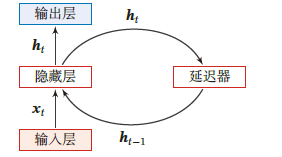
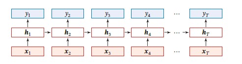
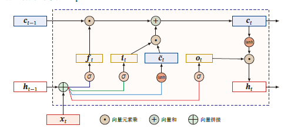

# **RNN &LSTM**

注意RNN的梯度爆炸(长程依赖)是引入门控机制(GRN,LSTM)

以及长短期记忆网络能完成的任务


## **0.引入**

处理带有时间序列的网络模型：循环神经网络

###### **0.神经网络回顾**

**1.对于带有全连接层的网络：输入输出的维度都是固定的，然而序列是可变的**

**2.对于输入的样本x传统的网络默认它们之间不存在关系（独立的），实际上可以有**

###### **1.延时神经网络**

**存在一个额外的延时单位，用于存储网络的历史信息**

>   **历史信息（输入 输出 隐状态）**
>
>   ==不是简单存储到一个地方,而是在网络中的影响==

$$
h^{(l)}_{t} = f(h^{(l-1)}_{t},h^{(l-1)}_{t-1},\cdots,h^{(l-1)}_{t-K}) 
$$

```markdown
input -> conv          -> conv -> output
       \lambda  memory ->
       \lambda  memory ->
```

###### **2.RNN(Recurrent Neural Network,RNN)**

**循环体:隐藏层和延迟器之间的信息流**

>   
>
>   从时间维度展开,就是以记忆为连接的传导单元,每个输出都是当前的输入值和上一次的记忆
>
>   

###### **3.特性**

**前面的NN是具有万能逼近的,RNN还具有图灵完备的特点**

###### **4.应用到机器学习**

**从序列到类别**

>   **法一:直接在标准RNN中进行输出(最后换成分类)**

>   **法二:对RNN的隐藏层进行归一化后进行输出(argmax)**

>   **Eg:判断句子的情感分类**

**同步的序列到序列:输入输出长度一致(反复计算输入+隐藏层)**

>   **Eg:语音识别(使用占位符表示空格,使用CTC避免同数据停留太强)\语音分词->信息提取 **

**异步的序列到序列:输入输出长度不一致(反复自动调用隐藏层)**

>   **Eg:机器翻译**

###### **5.长程依赖问题**

**如果RNN比较理想,会自动对缺失的内容进行填充(如果句子不是特别长)**

**长程的记忆缺失本质是梯度爆炸/梯度消失**(进行了上一次输出和记忆单元的连乘)/记忆容量不够

**解决方法:LSTM/GRU**



intuition:对有用的信息进行筛选

**GRU和LSTM的简化就是门数量的简化**

###### **6.堆叠模型**

只要隐藏层足够深,从记忆层的角度也可以看作神经网络(而非输出器)

**RNN应用:生成代码**