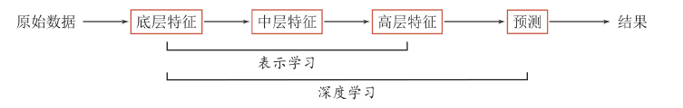
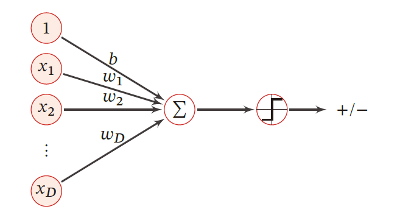
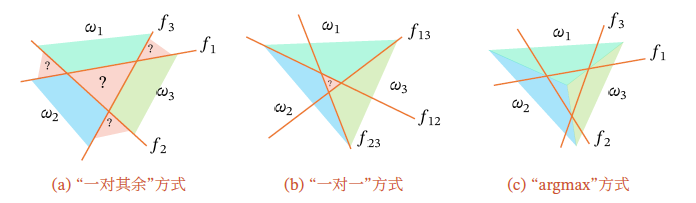
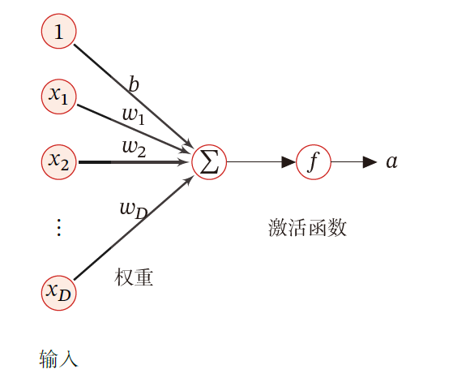
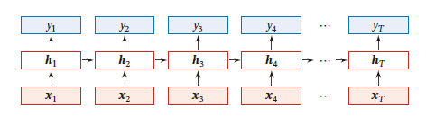

# **RE**

##　考点

主要内容：神经网络（激活函数／激活函数的优缺点）+ 深度学习

>   ...->信号的汇聚->非线性激活

复习方式：ppt

体型:选择题(2*20)/解答题(30分纯概念)/应用题(问题的解决方式)

>   CNN:设计CNN的分类系统的流程
>
>   卷积层/池化层/全连接层的基本概念
>
>   神经网络:基本概念/网络结构/前向传播过程/(反向传播不考)
>
>   模型不同的任务(分类/回归)的区别(损失函数)

>   线性模型->perceptron->NN
>
>   机器学习的缺点:手动设置标签

>   RNN/GRU/LSTM中出现的问题

>   网络的优化(初始化/超参数/梯度修正/正则化)
>
>   出现的问题+解决方法必考解答题

**不考编程!!**

## **Chap1 绪论**

**1.神经网络和人工智能的关系:DL是AI的子领域**

**2.人工智能的定义:让机器具有人类智能**

**3.人工智能产生的标志性事件:达特茅斯会议1956年**

**4.图灵测试**

>一个人在不接触对方的情况下，通过一种特殊的方式，和对方进行一系列的问答。如果在相当长时间内，他无法根据这些问题判断对方是人还是计算机，那么就可以认为这个计算机是智能的

**5.机器学习的本质:构建一个映射函数**

**6.机器学习的流程:特征选取->输出设置->设计算法->进行训练**

**7.浅层学习:不进行特征学习,而是整合信息(信息点/金字塔模型/直方图)**

>   深度学习:端到端的学习

**8.表示学习:==如何从数据中学习好的表示==**

>   从底层特征->中层特征->高层特征
>
>   好的表示:很强的表示能力/使得后序的任务变得简单/具有一般性
>
>   **数据表示是机器学习的核心问题**
>
>   **表示学习的主要问题:语义鸿沟**

**9.传统的特征提取和表示学习(存在不同)**

>   线性投影:PCA/LDA
>
>   非线性嵌入(非线性嵌入):LLE/Isomap/谱方法
>
>   **特征提取:去除无用特征**
>
>   **表示学习:获取高级语义**

**10.==数据语义的表示形式==**

>   局部表示:离散表示(符号表示)/独热编码
>
>   分布式表示:数值表示,可以使用O(N)来表示$O(2^k) $个参数

**11.深度学习 = 表示学习+预测学习**

>   **深度学习是机器学习的一个子领域,通过训练深度神经网络从数据中学习复杂度模式和表示,是一种端到端的学习模型,<font color=red>不需要手动提取特征,即不需要复杂的特征工程</font>**
>
>   **神经网络是受人类大脑启发设计的计算模型,通过大量的神经元组成,通过正向传播形成预测,通过反向传播更新所有参数**
>
>   通过构建有深度的模型,让模型自动学习好的特征表示
>
>   ==具有特征重用,抽象表示与不变性==

**12.深度学习关键问题:贡献度分配(CAP)**

>   一个系统中不同组件/参数对最终系统输出结果的贡献
>
>   ==**端到端的学习:不进行分模块或者分阶段,直接优化任务的总体目标**==

**13.人工神经网络(求和1->非线性处理->激活)**

**14.人工神经网络的三方面(激活规则/拓扑结构/学习算法)**

>   **激活规则:神经元输入输出之间的映射关系**
>
>   **拓扑结构:不同神经元之间的连接关系(前馈/记忆/图)**
>
>   **学习算法:通过训练数据来学习神经网络的参数**

**15.解决贡献度分配问题:求偏导数**

## **Chap2 机器学习概述**

**1.机器学习定义:通过算法使得机器能从大量数据中学习规律从而进行决策**

**常见的机器学习类型:监督学习/无监督学习/强化学习**

>监督学习:有标签数据,优化目标函数,期望风险最小化/MLE
>
>无监督学习:无标签数据,优化数据分布,EM/最小重构错误
>
>强化学习:智能体与环境轨迹r和奖励G,优化总汇报,策略改进

**2.独立同分布:样本独立地从相同的数据分布中抽取的,和样本内部分布无关**

**3.预测函数:表示特征向量x和标签y之间的映射关系**

>   可以有不同的输出:预测标签的值/预测标签的概率

**4.机器学习的三个基本要素:模型,学习准则,优化算法**

>   **模型**:映射函数g(x)或真实条件概率分布$p_r(y|x) $->线性模型/非线性模型
>
>   **学习准则**:通过损失函数对预测值和真实值进行评测(平方损失/期望风险)
>
>   >   **可选:预测和实际数据的距离/期望风险/经验风险/结构风险(岭回归)**
>   >
>   >   经验风险的好处:可训练(梯度下降)
>   >
>   >   $R(w) = \frac{1}{2}\sum^{N}_{i=1}(y^{(n)}-w^Tx^{(n)})^2 \Rightarrow w =(XX^T)^{-1}Xy$
>   >
>   >   期望风险的好处:**更好**,本身是后验概率,提供更多信息
>   >
>   >   >   **<font color=red>但是如果不知道数据分布就无法计算,经验风险近似</font>**
>   >
>   >   结构风险的好处:**更好**,引入先验,引入正则化
>   >
>   >   $R(w) = \frac{1}{2}||y-X^w||^2+\frac{1}{2}\lambda||w||^2\Rightarrow w^* = (XX^T+\lambda I)^{-1}Xy $
>
>   **优化算法**:梯度下降法/SGD/mini-batch
>
>   >   梯度下降法:
>   >   $$
>   >   \theta_{t+1}= \theta_t - \alpha\frac{1}{N}\sum^{N}_{i=1}\frac{\partial L(\theta_t;x^{(i)},y^{(i)})}{\partial\theta}
>   >   $$
>   >   SGD:
>   >   $$
>   >   \theta_{t+1}= \theta_t - \alpha\frac{\partial L(\theta_t;x^{(i)},y^{(i)})}{\partial\theta}
>   >   $$
>   >   mini-batch:
>   >   $$
>   >   \theta_{t+1}= \theta_t - \alpha\frac{1}{B}\sum^{B}_{i=1}\frac{\partial L(\theta_t;x^{(i)},y^{(i)})}{\partial\theta}
>   >   $$

**5.常见的损失函数**

>**a.0-1损失函数(0-1 Loss Function）**
>
>>   $$
>>   \mathbb{L}(y,f(x;\theta)) = \{
>>   \begin{matrix}
>>   0 & if \ y=f(x;\theta) \\
>>   1 & if \ y \not = f(x;\theta)
>>   \end{matrix}
>>   $$
>
>**b1.平方损失函数（Quadratic Loss Function）**
>
>>   $$
>>   \mathbb{L}(y,f(x;\theta)) =\frac{1}{2}(y-f(x;\theta))^2
>>   $$
>
>>   **<font color=deeppink>一般不适用于分类问题</font>**
>
>**b2.均方误差损失函数 (Mean Squared Error-MSE)**
>
>>   $$
>>   MSE = \frac{1}{n} \sum_{i=1}^{n} (yᵢ - ŷᵢ)²
>>   $$
>>
>>   **==$\hat{y}$是模型的输出，注意不要与分类标签混淆==**
>
>**c.交叉熵损失函数（Cross-Entropy Loss Function）**
>
>>   **==首先需要对标签进行独热编码==**
>
>>   **<font color=deeppink>对于两个概率分布,使用交叉熵衡量它们的差异</font>**
>>   >   $$
>>   \begin{align}
>>   \mathbb{R}(\omega) &= 
>>   -\frac{1}{N}\sum^{N}_{n=1}\bigg(y^{(n)}log\hat{y}^{(n)}+ (1-y^{(n)})log(1-\hat{y}^{(n)})\bigg)
>>   \end{align}
>>   $$
>
>>   >**比如标签向量$y= [0,0,1]^T $,模型预测的分布$f(x;\theta)=[0.3,0.3,0.4]^T $**
>>   >$$
>>   >\therefore L(f(x;\theta))=-(0\times log(0.3)+0\times log(0.3)+1\times log(0.4))=-log(0.4)
>>   >$$
>
>>   **<font color=red>注意$f_c(x;\theta)$也可以看作似然函数,所以交叉熵损失可以看作==负对数似然函数==</font>**
>
>**d.Hinge损失函数(二分类问题)**
>$$
>假设y\in\{-1,+1\},f(x;\theta)\in  \mathbb{R}\\
>\\
>\therefore \mathbb{L}(y,f(x;\theta)) = max(0,1-yf(x;\theta))
>$$

**6.正则化(对经验风险最小化的修正)**

>   **定义:所有损害优化的方法都是正则化**
>
>   >增加优化约束:L1/L2约束,数据增强
>   >
>   >干扰优化过程:早停法,权重衰减,SGD

**7.线性回归模型:$f(x;w,b) = w^Tx+b  $(使用增广矩阵包含w和b)**

**8.优化方法:经验风险(最小二乘)/结构风险(岭回归)/最大似然/最大后验**

**9.后验=似然$\times$先验  $p(w|x) = p(x|w)p(w)$**

**10.多项式回归:振荡最剧烈的是过拟合的**

**11.优化机器学习**

>   **trade-off->集成模型**
>
>   **PAC理论(并非PCA): 分析该机器学习方法在什么条件下近似正确**

**11.**

>   没有免费午餐定理:不存在一个算法对所有问题有效
>
>   丑小鸭定理:差异的存在性和差异大小无关
>
>   归纳偏置:对学习的问题做一些假设

## **Chap3 线性模型**

**1.线性==回归模型==的形式:$f(x,\theta) = w^T x+b $**

**2.线性==分类模型==的形式:$g(f(x;w)) $输出0/1**

>   $$
>   \begin{align}
>   g(f(x;\omega)) &= sgn(f(x;\omega))\\\\
>   & = \{
>   \begin{matrix}
>   1,& if \ f(x;\omega)>0 \\
>   0,& if \ f(x;\omega)<0
>   \end{matrix}
>   \end{align}
>   $$
>   
>**由一个（或多个）线性的判别函数$𝑓(𝒙; 𝒘) =𝒘^T𝒙 + 𝑏 $和非线性的决策函数$𝑔(⋅)$ 组成**
>   
>

==**3.线性分类训练:带有完整标注的数据集,二分类线性模型,0-1损失函数**==

**4.多分类的定义多分类问题是指分类的数量C大于2,<font color=deeppink>一般需要多个线性判别函数</font>**

**5.多分类判别函数的设计**

>   **1.OvR方式(一对其余):转化为$C$个二分类问题(是A类 & 不是A类)**
>
>   **2.OvO方式(一对一):转化为$C(C-1)/2$个一对一的问题(1+2+...+(C-1))**
>
>   >   (比如训练类A和类B的分类器,再训练类A和类C的分类器...)
>
>   **3.argmax方式:需要C个判别函数(选取概率最大的)**
>
>   >   **<font color=deeppink>argmax的性能最好(决策边界$f_i(x;\omega_i)-f_j(x;\omega_j)=0 $,法向量$\omega_i - \omega_j $)</font>**
>
>   
>

**解决连续的线性函数不适合进行分类的问题.引入非线性函数g(),也称激活函数**

###### **(前提)**

**Logistic回归和softmax回归,不能再直接使用预测值的差作为损失依据**

>   **<font color=red>因为我们需要进行概率分布的损失判定,所以引入了信息熵的概念(表示分布)</font>**
>
>   **除此之外,0-1阶跃函数在x是负的区域为0,会直接导致信息的损失**

**6.逻辑回归模型:逻辑回归模型是分类器,不能做回归任务**

==**7.逻辑回归模型的假设:数据服从伯努利分布,样本为正的概率是Logistic对应**==

**8.Logistic函数**

>$$
>p = \frac{1}{1+e^{-\theta^Tx}}
>\qquad
>\sigma(z)' = (1-\sigma(z))\sigma(z)
>$$
>
>$$
>\begin{align}
>&p(y=1|x) =  \sigma(\omega^Tx) = \frac{1}{1+e^{-\omega^Tx}}\\
>\\
>&p(y=0|x) =  \ 1-p(y=1|x)=\frac{e^{-\omega^Tx}}{1+e^{-\omega^Tx}}
>\end{align}
>$$

**9.熵和信息熵**

>   熵越低,随机变量信息越少,越稳定
>
>   交叉熵:$H(p,q) = -\sum p(x)log\ q(x)$
>
>   交叉熵损失函数:
>   $$
>   \begin{align}
>   \mathbb{R}(\omega) &= 
>   -\frac{1}{N}\sum^{N}_{n=1}\bigg(y^{(n)}log\hat{y}^{(n)}+ (1-y^{(n)})log(1-\hat{y}^{(n)})\bigg)
>   \end{align}
>   $$
>
>   $$
>   其中\hat{y}^{(n)}=\sigma(\omega^Tx^{(i)})
>   $$
>
>   (N是样本数量,$x^{(n)} $是第n个样本的特征,$y^{(n)} $是第n个样本的真实标签)
>
>   ($\hat{y}^{(n)} $是 Logistic回归模型对第n个样本预测为标签1的后验概率)
>
>   ($P_r(y^{(n)}=1|x^{(n)})$是给定$x^{(n)} $时,真实标签为1的条件概率)
>
>   ($P_r(y^{(n)}=0|x^{(n)})$是给定$x^{(n)} $时,真实标签为0的条件概率)
>
>   交叉熵损失函数求导:
>   $$
>   \begin{align}
>   
>   \frac{\partial{\mathbb{R}(\omega)}}{\partial\omega} 
>   &=-\frac{1}{N}\sum^{N}_{n=1}x^{(n)}(y^{(n)}-\hat{y}^{(n)})
>   \end{align}
>   $$

**10.KL散度:衡量交叉熵和熵之间的差异(交叉熵减去熵)**

**11.Softmax回归**

>**Softmax回归预测类别c的条件概率**
>$$
>p(y=c|x) = softmax(\omega^T_c x) = \frac{e^{(\omega^T_cx)}}{\sum^C_{c'=1}e^{(\omega^T_cx)}} =\frac{e^{(\omega^T_cx)}}{1^T_ce^{(\omega^T_cx)}}(vector) \\
>\\
>决策函数\hat{y} = argmax\  p(c|x) = argmax \ \omega^T_c x
>$$
>
>>   **<font color=deeppink>给定输入x,softmax输出"各个类别"在"所有类别"的概率分布</font>**
>
>>   <font color=red>(先通过指数放大,然后进行归一化（除以所有参数的和）,得到每个概率的概率,选择分数最高的)</font>
>
>>   输出的是一个包含 N 个概率值的向量，每个值代表了样本属于对应类别的概率，并且这 N 个概率值的和为 1。
>
>**softmax和logistic的关系:二分类退化**

**12.Perceptron**

>   (**是一种广泛使用的==线性分类器==,是最简单的ANN(人工神经网络)**)
>
>   **<font color=red>(一种错误驱动的==在线学习算法==,因为当时还没有梯度下降法)</font>**
>
>   ==如果数据线性可分==虽然它是贪心,但是也会收敛

**13.Perceptron学习算法**

>   1.初始化权重向量
>
>   2.使用分类错误的样本来更新权重

**14.Perceptron损失函数**
$$
\mathbb{L}(\omega;x,y) = max(0,-y\omega^T x)
$$

**15.Perceptron的SGD**
$$
\frac{\partial L(\omega;x,y)}{\partial \omega} = \bigg\{
\begin{matrix}
0 & if \quad y\omega^Tx>0 \\
-yx & if \quad y\omega^Tx<0
\end{matrix}
$$

**16.SVM**

**==如果样本是线性可分的,即存在超平面==$\omega^T x+b = 0 $**

>两类样本分开,则对于每个样本,都有$y^{(n)}(\omega^T x+b)>0 $
>
>

**样本到超平面的距离**
$$
\gamma^{(n)}  = \frac{|\omega^T x^{(n)}+b|}{||\omega||} = \frac{y^{(n)}(\omega^T x^{(n)}+b)}{||\omega||}
$$

**17.SVM间隔(Margin)**

>   $$
>   \therefore d = \frac{y^{(x)}(\omega^T x^{(n)}+b)}{||\omega||_2}$$

**18.SVM支持向量**

>   **<font color=deeppink>定义:数据集中所有满足$y^{(n)}(\omega^T x^{(n)}+b) =1  $ 的样本,都叫做支持向量</font>**

**19.SVM学习**

>$$
>\begin{align}
>max \quad & \frac{1}{||\omega||^2_2}\\
>\\
>s.t.\quad & 1-y^{(n)}(\omega^Tx^{(n)}+b)\leq 0,\forall n \in \{1,2,\cdots,N\}
>\end{align}
>$$


## **Chap4 FNN**

**1.净输入 $z$**

>   **假设神经元接收D个输入$x_1,x_2,\cdots,x_D$,令向量x=[$x_1,x_2,\cdots,x_D $],使用$z\in \mathbb{R} $表示净输入**
>   $$
>   z = \sum^{D}_{d=1}\omega_d x_d + b = \omega^T x +b = \omega^Tx+\omega_0
>   $$
>   **其中$\omega = [\omega_1,\omega_2,\cdots,\omega_D]\in \mathbb{R}^D $是D维的权重向量,$b\in \mathbb{R} $是偏置项**

**2.激活函数(非线性因素)** $f(\cdot) $

>   **为净输入添加非线性因素的工具,输入==净输入==,输出==神经元活性值$\alpha $==**
>
>   **<font color=deeppink>期末考试必考</font>**

**3.可视化内容**

>   

**4.多分类问题的可视化**

>   比如0~9的识别->(512*512\*1=262144(展开)->1024)
>
>   首先是10个节点的input layer,然后全连接10个节点的hidden layer,然后hidden每个节点经过activation function以后得到$\sigma(x_i) $的输出
>
>   

**5.激活函数的性质**

>**1.连续并可导的非线性函数**
>
>**2.尽可能的简单,有利于提高网络的计算效率**
>
>**3.导函数要在一个合适的区域中,否则会影响训练的稳定性和效率**
>
>**<font color=red>4.不需要单调递增,比如swish函数$f(x) = x * sigmoid(βx)$</font>**

**6.常见的激活函数**

>**1.sigmoid函数:指一类S型曲线,为两端饱和函数(sigmoid/tanh)**
>
>>   $\sigma(x) = \frac{1}{1+e^{-x}},\sigma'(x) = \sigma(x)(1-\sigma(x))$ (==梯度消失问题==)
>>
>>   $tanh(x) = \frac{e^{x}-e^{-x}}{e^{x}+e^{-x}},tanh'(x) = 1-(tanh(x))^2$ (==梯度消失问题==)
>
>**2.ReLU函数:线性修正单元**
>
>>   $ReLU(x) = 
>>   \begin{cases}
>>   x & x\geq 0\\
>>   0& x<0
>>   \end{cases} = max(0,x)$ ==(神经元死亡问题)==
>>
>>   $LeakyReLu(x) = 
>>   \begin{cases}
>>   x& if \ x>0\\
>>   \gamma x& if\ x\leq 0
>>   \end{cases}
>>   \quad
>>   =max(0,x)+\gamma min(0,x)$
>>
>>   $PReLU_i(x) = 
>>   \begin{cases}
>>   x & if \ x>0\\
>>   \gamma_ix&if\ x\leq0
>>   \end{cases} = max(0,x)+\gamma_imin(0,x) $
>>
>>   $ELU(x) = 
>>   \begin{cases}
>>   x & if \ x>0\\
>>   \gamma(e^x - 1)& if \ x\leq 0
>>   \end{cases}
>>    = max(0,x)+min(0,\gamma(e^x-1))$
>>
>>   $平滑ReLU \ softplus(x) = log(1+e^x)$
>
>

**7.FNN**

>   前馈神经网络(FNN)也称作多层感知机(MLP)
>
>   ==整个网络中无反馈，信号从输入向输出单向传播，可用一个有向无环图表示。==

**<font color=red>8.sigmoid和softmax in FNN</font>**

>(背景是判别手写字符0~9)
>
>**Sigmoid n个sigmoid输入单个值,输出是独立的==可能性==：** 
>
>```
>input -> hidden -> output -> sigmoid activation -> argmax 
>256*256   256      10 Neu      10 Neu			 1 result
>		  128
>		  ...
>```
>
>**argmax 1个向量n个值,输入一个argmax函数,输出是互斥类别上的==概率分布==**
>
>可以更好跟交叉熵损失函数同步
>
>**Sigmoid的损失函数是交叉熵的完整函数**
>
>****
>
>```
>input -> hidden -> output -> softmax activation -> distribution
>256*256   256      10 Neu      1vec(10 Neu)		   1 result
>		  128
>		  ...
>```
>
>**==softmax的损失函数就只有==:$-\sum^{N}_{i=1}y_ilog(\hat{y_i}) $**

**9.FNN部件**

>**1.Layer**
>
>==**第$0 $层称为输入层，最后一层称为输出层，其他中间层称为隐藏层**==
>
>**2.Neuron**
>
>>   **$z^l_i $ :表示在第L个Layer的第i个神经元的净输入**
>
>>   **$a^{l} $:表示激活值,也可以表示上一层的输出值,<font color=red>但注意$ a^{0}$其实表示为输入层</font>**
>
>>   **$W^{L}_{ij} $表示ij两个神经元的连接权重(具体而言是L层的第i个神经元到第j个神经元)****
>
>>   **$b^{l} $:表示权重L-1层到L层的偏置项**
>
>>   **<font color=deeppink>权重传播公式</font>**
>>   $$
>>   \therefore z^{l} = W^{(l)}a^{(l-1)}+b^{(l)}\\
>>   a^{(l)}_i  = \sigma{(z^{l})}
>>   $$
>
>**3.前向传播**
>
>>   第0层的激活值$a^{(0)}$
>
>>   第1层的激活值$ a^{(1)} = \sigma(z^{1}) = \sigma(W^{(1)T} a^{(0)}+(b))$(或者直接把b放到a向量的增广里面)
>
>>   第2层的激活值$ a^{(2)} = \sigma(z^{2}) = \sigma(W^{(2)T} a^{(1)}+(b))$(或者直接把b放到a向量的增广里面)
>
>>   **<font color=red>(其中具体的计算:假设一层只有两个Ner)</font>**
>>   $$
>>   a^1_1 = \sigma(w^1_ {11}x_1+ \omega^1_{21}x_2 )  \sigma(w^1_{11} a^0_1+ \omega^1_{21}a^0_2 )
>>   $$
>>   **可以表示为$X = \begin{pmatrix}x_1\\x_2\end{pmatrix},W = \begin{pmatrix}w^1_{11}&w^{1}_{12}\\ w^2_{21}&w^2_{22}\end{pmatrix},目标\sigma[W = \begin{pmatrix}w^1_{11}&w^{1}_{12}\\ w^2_{21}&w^2_{22}\end{pmatrix}] $ (如果有1w层,则W有1w列)**
>
>>   $a^1\rightarrow \sigma(W_1^Tx)\rightarrow a^2\rightarrow  \sigma(W^T_2 x)$
>
>
>
>**4.构建权重矩阵W**
>
>>   (主要和上一层的参数量和下一层的参数量相关)
>
>>   Eg:输入的图片的特征输入维度是512,最后只有10个特征
>
>>   输入维度用p表示,输出维度用n表示,权重矩阵的大小就是[n,p]
>
>>   ```
>>   p:    512      -> 256      ->128     ->64     ->32
>>   W:    [256,512]-> [128,256]->[64,128]->[32,64]->[10,32]
>>   n:    256      -> 128      ->64      ->32     ->10
>>   ```
>
>>   **<font color=red>维度缩减的情况:预测和分类的前向传播/高维到低维的特征提取/减少参数避免过拟合</font>**
>
>>   **维度不变的情况:RNN的时间步之间保持固定大小**
>
>>   **维度放缩:Transformer先将维度增加,然后恢复/自编码器先将维度降低,然后恢复**
>
>**5.学习算法**
>
>>**回归问题:均方误差函数(MSE)**
>
>>**分类问题:交叉熵损失函数**
>
>>>   比如输入标签10个(独热标签[0,0,0,0,1,0,0,0,0,0])
>
>>>   输出层也是10个[0,0.3...0,1..]
>
>>>   然后用损失函数:两者相减的均方误差
>
>**需要注意的是$ x = a^{0}\rightarrow z^{(1)}\rightarrow a^{(1)}\rightarrow z^{(2)}\rightarrow a^{(2)} $**
>
>**如果把图片的像素拉成一个列向量，会对光照更敏感->使用特征向量（特征工程）**


```
输入数据 (x ∈ ℝ⁴⁰¹)
    │
[ 数据归一化 / 标准化 ]
    │
[ 输入层：401 维 ]
    │
[ 第一隐含层：30 个神经元 + 激活函数 (如 ReLU) ]
    │
[ 第二隐含层：60 个神经元 + 激活函数 (如 ReLU) ]
    │
[ 输出层：10 个神经元 + softmax ]
    │
输出概率向量 ŷ ∈ ℝ¹⁰ （对应分类 0~9）
```

**10.优化中的问题**

>   1.参数过多
>
>   2.陷入局部最优解
>
>   3.梯度消失
>
>   4.解释性差

## **Chap5 CNN**

**1.和FNN的差距**

>   网络上:权重中的参数非常多
>
>   数据上:自然图像具有局部不变性特征

**2.CNN:基于感受野(特定区域的刺激)的机制提出**

**3.CNN的特性:局部连接/权重共享/空间或时间的次采样**

**4.卷积:信号的延迟累计**

**5.卷积计算:先判断输出图的大小(一般是正方形,所有H,W取一个就行)**

>**[$W_{in}$, Kernel, Stride, Paddle] -> [W,K,S,P]**
>$$
>W_{out} = \lfloor\frac{W-K+2P}{s}\rfloor+1
>$$
>然后直接进行矩阵的乘法运算即可(行乘列)
>
>Oth:然后进行通道数的计算(第一次的输入和颜色相关,pool的通道不变)
>$$
>[Batch Size, Channels, Height, Width] -> [B,C,H,W]
>$$
>
>```Python
># 输入图片大小[N,1,28,28]灰色,彩色就是[N,3,28,28]
># conv1:
># [N,1,28,28]   # Kernel[28,5,1,0] [W,K,S,P] #outchannel=6
># (28-5+2*0)/1 + 1 = 24 
># [N,1,24,24] -> 6C -> [N,6,24,24]
>
># pool1:
># [N,6,24,24]   # kernel[24,2,2,0] [W,K,S,P]
># (24-2+2*0)/2 + 1 = 12
># [N,6,12,12] -> 1C ->[N,6,12,12]
>
># x=x.view展开:C*H*W = [N, 128, 7, 7] = 6272
>
># 映射到分类空间:nn.Linear(128*7*7, 10) -> 1个softmax
>
>#
>```

**6.为了避免边缘信息丢失,引入了padding(不直接影响感受野)**

**7.为了控制尺寸,加速计算,引入stride**

**6.CNN的层种类**

>**卷积层+激活层:主要作用是提取特征:因此也可以决定特征的数量**
>
>**激活函数层:一般使用ReLU引入非线性因素**
>
>**Pooling层:也叫做下采样层,通过下采样策略减少单个特征图的大小**
>
>**全连接层:对展开的神经元进行全连接,计算最后输出结果**

**7.感受野**

>   增大卷积核的大小(K)
>
>   增加层数(深度)
>
>   在卷积之前进行汇聚操作
>
>   插入空洞

**8.常见的CNN:LeNet/AlexNet/Inception/ResNet**

>ResNet的残差连接:直接改变了信息流,避免了梯度消失梯度爆炸

## **Chap6 RNN**

**1.和FNN的对比**

>FNN层间是没有连接的,并且无法判断输入样本x之间的关系
>
>==**前面的NN是具有万能逼近的,RNN还具有图灵完备的特点**==
>
>RNN能处理任意长度序列,存在记忆

**2.(很早的记忆网络):TDNN(存储记忆)/AR(历史信息预测)**

**3.RNN**

>   **==使用带有自反馈的神经元,可以处理任意长度的时序数据==**
>
>   
>
>   从时间维度展开,就是以记忆为连接的传导单元,每个输出都是当前的输入值和上一次的记忆
>
>   

**4.RNN的应用**

>   **从序列到类别:输入文本 输出情感标签**
>
>   **同步的序列到序列模式:中文分词/信息抽取/语音识别(序列一致)**
>
>   **异步的序列到序列模式:机器翻译(输入输出序列不一致)**

**5.RNN的长程依赖问题->本质是梯度消失梯度爆炸(累计效应)**

>   梯度消失:改进模型(线性依赖关系/增加非线性)
>
>   梯度爆炸:权重衰减/梯度截断

**6.LSTM和GRU**

>   LSTM引入了门控机制:有选择地保留或者以往信息

## **Chap7 Optimization**

**1.网络优化的问题**

>   结构差异大:无通用算法/参数两多
>
>   非凸优化:初始化问题/局部最优问题
>
>   梯度问题:梯度爆炸梯度消失

**2.网络优化的方法**

>提高优化方法(梯度下降)的效率:动态学习率/梯度修正
>
>提高初始化:数据预处理
>
>修改网络结构得到优化地形:RELU/GELU/残差连接/LayerNorm
>
>超参数优化方法

**2.梯度下降算法改进**

>   SGD/Mini-batch
>
>   学习率:衰减学习率(分段/线性)/自适应的(Adagrad/Adadelta/RMSprop)
>
>   梯度:动量法(积累动量)/梯度截断(也是积累动量)

**3.Adam的方法综合:动量法+RMSprop**

>   

**4.参数初始化:不能为0**

>预训练初始化
>
>随机初始化:高斯分布/均匀分布
>
>固定值初始化

**5.数据预处理**

>归一化(求和平均)
>
>标准化(概率角度:根据均值更新方差)
>
>PCA:主成分分析

**6.BN:更好的尺度不变性,更好的优化地形**

**7.超参数:网格搜索/贝叶斯优化**

**8.正则化:L1和L2/早停法/权重衰减(参数更新)/SGD/Dropout/数据增强**

## **Chap8 Attention**

**1.Transformer的attention**

>首先第一步应该是编码的融合
>
>将图片数据拉成一条传入MLP
>
>**1.Self-Attention**
>
>**2.Multi-Head Attention**

软性注意力+评分:计算注意力分布->计算输入信息的加权平均

