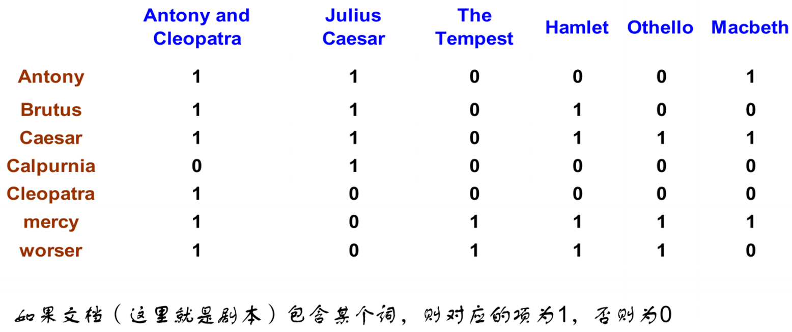
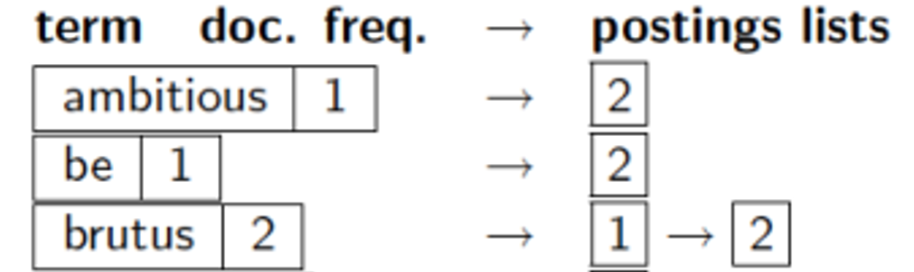
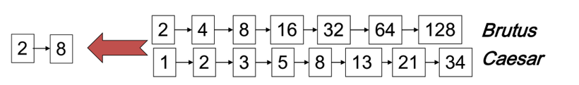
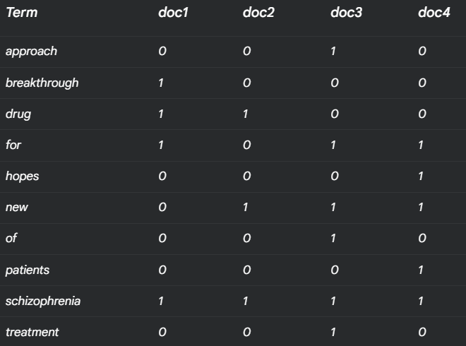

# **第1章 布尔检索**

1.信息检索模型概述:给出了信息,信息分类和信息检索的定义

2.简单的搜索示例:给出了布尔检索 (基于词项文档关联矩阵)

1.3 倒排索引

1.4 布尔检索模型的优化与拓展

## **1.信息和信息检索**

###### **1.基本术语**

**信息检索模型:描述信息检索中的文档,查询和它们之间的关系的数学模型**

>   **==基于文本内容的检索模型==**
>
>   第1章:布尔检索及倒排索引
>
>   第6章:向量模型及检索系统
>
>   第11章:概率模型
>
>   第12章:基于语言建模的检索模型
>
>   **==与内容无关的其他检索模型==**
>
>   第13章:文本分类(基于贝叶斯)

**信息检索(IR):从<font color=red>大规模非结构化数据的集合中</font>找出<font color=red>满足用户需求</font>的资料**

>   **非结构化数据:没有组织的自由格式数据,无法直接使用,通常需要进行数据转换使用**
>
>   >   文字/网页内容/原始信号/音效
>
>   **结构化数据:具有清晰和明显语义的结构**
>
>   >   关系数据库
>
>   **半结构化数据:结构没有规则且变化迅速的结构**
>
>   具有格式标记的网页
>
>   <font color=red>**注意:大部分数据严格意义上不属于结构化数据(可以进一步细化)**</font>

###### **2.信息检索分类**

**(按照任务类型)**

>   **1.聚类任务:基于文档内容自动聚团的任务**
>
>   **2.分类任务:根据固定的信息需求进行分类的任务**

**(按照数据规模)**

>   **1.Web搜索(大规模搜索)**
>
>   **2.特定领域搜索(Domain-specific research)**
>
>   **3.个人信息检索(personal information retrieval)**

###### **3.过程**

浏览->(基于分类)过滤->对结果结果进行处理->存储

****

## **2.布尔检索(词项-文档关联矩阵)**

###### **0.背景**

**《莎士比亚全集》哪些剧本包含Brutus 和Caesar 但是不包含Calpurnia**

###### **1.方法一.线性扫描处理**

**使用Unix下的grepping程序,找到所有包含vocab1和vocab2的剧本,然后排除vocab3**

**<font color=deeppink>结论:搜索太慢,形式不灵活,结果单一不可个性化</font>**

###### **2.方法二.非线性扫描(词项-文档关联矩阵)**

**1.词项文档关联矩阵:记录文档和词项的关系**

>   **是一个由词项(term)组成的关联矩阵(incidence matrix)**
>
>   **<font color=red>词项:由一个或多个词组成的基本单位</font>**
>
>   

**2.使用位运算计算查询结果:**

>   **查找内容:`Brutus`AND`Caesar`AND NOT`Calpurina`**
>
>   <font color=deeppink>**选取前两个词项的行向量,对Calpurina取反后,进行位运算**</font>
>
>   ```TXT
>   110100 AND 110111 AND 101111 = 100100
>   
>   位与运算:
>   
>   1 AND 1 = 1
>   1 AND 0 = 0
>   0 AND 1 = 0
>   0 AND 0 = 0
>   ```
>

**3.得到结论:`100100`**

>   **查找词项文档关联矩阵:`Antony and Cleopatra`以及`Hamlet`**

###### **3.布尔检索模型**

上述的词项文档关联矩阵是布尔检索的一种形式

**布尔检索定义:<font color=red>接收布尔表达式查询</font>,通过逻辑操作符将词项进行操作的查询**

**布尔检索模型**

>   **建立文档集索引(词项文档关联矩阵)->基于索引进行逻辑匹配->得到结果**

## **3.信息检索相关概念**

>   **文档(doc):检索系统的检索对象**
>
>   **语料库/文档集(doc collection):所有文档组成的集合**
>
>   **信息需求:用户想查找的信息主题,<font color=red>和查询不同</font>**
>
>   >   ad hoc检索(需求):用户的每次查询都是新的独立的请求(查询变化刷新,文件不变)
>   >
>   >   Routing检索(需求):用户有一个稳定的长期的信息需求(文件变化刷新,查询不变)
>
>   **相关:一篇文档中 ==对用户需求有价值的信息== 则是相关的**
>
>   >   查准率(precision):满足用户需求的文档/返回的文档
>   >
>   >   召回率(recall):满足用户需求的文档/用户总的文档需求
>
>   >   Eg:100封邮件,10封trash,90封正常,"过滤系统"识别出了15封(8trash,7正常)
>   >
>   >   查准率:8/15
>   >
>   >   召回率:8/10

## **4.布尔检索(倒排索引)**

###### **0.背景**

**问题:对于极大的数据集,建立词项-文档关联矩阵的代价过大(关系过于稀疏)**

**解决方法:只记录1的位置**

数据检索花费的大部分开销是磁盘读写

(没有索引就需要从磁盘上读表的每一个数据页)(如果有索引，则只需查找索引页面就可以了)

###### **1.倒排索引**

**倒排索引：信息检索系统中 <font color=red>将词项反向映射到文档</font> 的索引结构**

**词条：文档 <font color=red>简单划分得到的一系列独立的单词</font>**

**倒排记录(posting):<font color=red>"一个词项,在一个文档" 中的信息</font>**

>   比如可以是一个位置信息:apple-D1
>
>   比如可以是一个频率信息:apple-(D1,[pos1,pos2])

**倒排记录表(posting list):<font color=red>一个词项,在所有文档" 中的信息</font></font>**

>比如可以是多个位置信息:apple(D1,D5)

**倒排索引：所有词项的倒排记录表**

>Term1  -> [DocID1, DocID5, DocID10, ...]  
>
>Term2  -> [DocID2, DocID5, DocID12, ...]  
>
>Term3  -> [DocID1, DocID3, DocID9, ...] 

###### **1.构建倒排索引**

**1.文档解析(Doc Parsing)**

>   **从不同文档格式中收集读取文档,去掉HTML标签等工作**

**2.词条化(Tokenization)**

>   **a.分词:将句子分成词语(不同标准:语义/空格/逗号)**
>
>   **b.去标点符号:移除问号/句号(因为一般不作为检索条件)**
>
>   **c.数字和特殊字符处理:按照要求特殊处理**

**3.词条标准化(Token Normalization)**

>   **目标:转化为更统一的结构,提高准确性和召回率**
>
>   **a.大小写转换**
>
>   **b.词干还原:提取词干**     (Porter Stemmer法移除后缀-ing,-ed,-es)
>
>   **c.词形归并:提取词元**     (根据词语的实际意义进行还原)
>
>   **d.停用词移除:删除没有检索意义的词语(is/the/a)**

**4.建立倒排索引(Reverse Indexing)**

>   **a.建立词项与文档ID对应的序列**
>
>   >   **出现的文档 赋一个连续的整数编号(DocID)**
>
>   **b.排序**
>
>   >   **<font color=red>排序依据:先按照词项的alphabet进行排序,再按照docID进行排序</font>**
>
>   **c.建立索引(词典和倒排表的建立)**
>
>   >   去重:同文章的多次出现的词被合并
>   >
>   >   统计:统计docID的个数,写在词典项
>   >
>   >   排序:按照docID从小到大排序
>   >
>   >   

**<font color=red>倒排记录表不存在重复元素,从小到大</font>**

**<font color=red>词项必须排序!!!!!!,文档ID必须排序!!!</font>**

**<font color=red>必须转义两次:string-int-string</font>**

###### **2.倒排索引考虑的数据结构**

**1.单链表**

>   **在增加文档/页面时,直接在倒排记录表后添加指针即可**(Hash table)

**2.变长数组**

>   **可以通过索引直接访问特定位置的倒排记录**(List)

**3.在Python中的表现形式**

>   ```python
>   dict1 = {keyIndex:list[]}
>   ```

###### **3.建立倒排索引Eg**

**doc1:new house sales top forecasts**

**doc2:home sales rise in July**

**doc3:increase in home sales in July**

**doc4:July new home sales rise**

>```
>forecasts ->1
>home	  ->2,3,4
>house	  ->1
>increase  ->3
>july	  ->2,3,4
>new		  ->1,4
>rise	  ->2,4
>sales	  ->1,2,3,4
>top		  ->1
>```

###### **4.布尔查询AND示例**

**`Brutus`AND`Caesar`->找到它们的倒排记录表->逻辑与运算**



**目前只能处理AND和OR查询,对于NOT查询只能先取反操作**

## **4.布尔检索模型的优化与拓展**

###### **1.时间复杂度讨论**

**对于如下查询,能否在O(x+y)次内完成?**

(其中x和y分别是Brutus和Caesar对应的倒排记录表长度)

>   **a.`Brutus AND NOT Caesar`**
>
>   **b.`Brutus OR NOT Caesar`**

>**a.可以完成**
>
>>   **查找Brutus:x次->查找Caesar:y次->(1)(2)相减**
>>
>>   **得到O(x+y)**
>
>**b.不能**
>
>>   **1.查找Brutus:x次->2.查找Caesar的补集:N次->3.记录Caesar的补集:N-y次**
>>
>>   **得到:O(x+N-y)**
>

###### **2.处理逻辑讨论**

**一般优化逻辑(处理结果估计):<font color=red>应该先处理文档频率小的,再处理文档频率大的</font>**

**进一步优化逻辑(OR结果估计):对OR操作进行估计,对中间结果大小进行估计**

## **5.第1章书面作业**

**<font color=red>(注意按照字母序,注意倒排记录表的docID是int型,不打冒号)</font>**

###### **1.1 创建倒排序列**

**Eg1:画出下列文档集所对应的倒排序列**

```txt
doc1: new home sales top forecasts
doc2: home sales rise in july
doc3: increase in home sales in july
doc4: july new home sales rise
```

>   **解:**
>
>   ```
>forecasts  ->  1
>   home       ->  1, 2, 3, 4
>in         ->  2, 3
>   increase   ->  3
>   july       ->  2, 3, 4
>   new        ->  1, 4
>   rise       ->  2, 4
>   sales      ->  1, 2, 3, 4
>   top        ->  1
>   ```

****

###### **1.2 创建词项-文档矩阵+倒排索引**

**Eg2:考虑文档,画出对应的词项-文档矩阵+画出对应的倒排索引**

```\
doc1 breakthough drug for schizophrenia
doc2 new schizophrenia drug
doc3 new approach for treatment of schizophrenia
doc4 new hopes for schizophrenia patients
```

>
>
>```
>approach       -> 3
>breakthrough   -> 1
>drug           -> 1, 2
>for            -> 1, 3, 4
>hopes          -> 4
>new            -> 2, 3, 4
>of             -> 3
>patients       -> 4
>schizophrenia  -> 1, 2, 3, 4
>treatment      -> 3
>```

****

###### **1.3:**

**对(1.2)的文档集进行查询,返回的结果是?**

**`a.schizophrenia AND drug`**

**`b.for AND NOT(drug OR approch)`**

>   **a:doc1,doc2**
>
>   >   解:
>   >
>   >   **schizophrenia:1111**
>   >
>   >   **drug:1100**
>   >
>   >   <font color=red>1111+1100=1100</font>
>
>   **b.doc4**
>
>   >   解:
>   >
>   >   **drug:1100**
>   >
>   >   **approach:0010**
>   >
>   >   **for:1011**
>   >
>   >   <font color=red>1011 AND NOT(1110 OR 0010)</font>
>   >
>   >   <font color=red>1101 AND NOT 1110</font>
>   >
>   >   <font color=red>1101 AND 0001</font>
>   >
>   >   <font color=red>0001</font>

**书面作业:1-1,1-2,1-3**