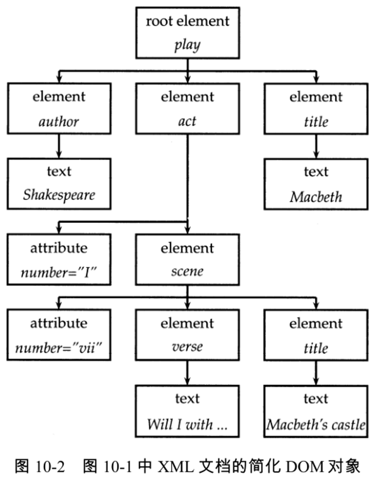
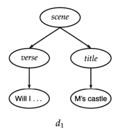
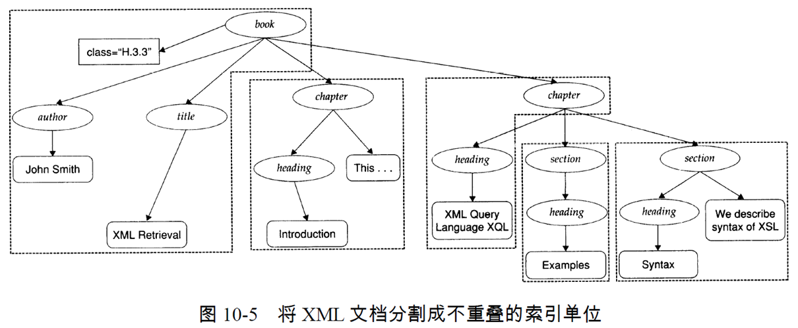
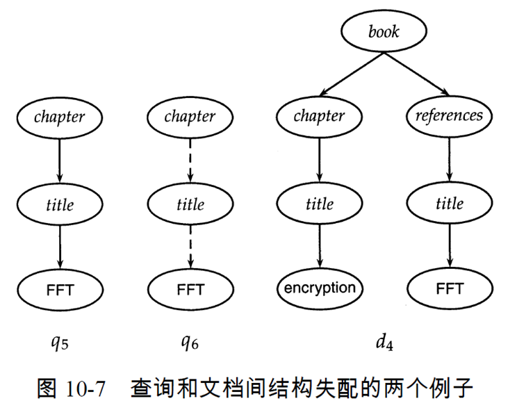
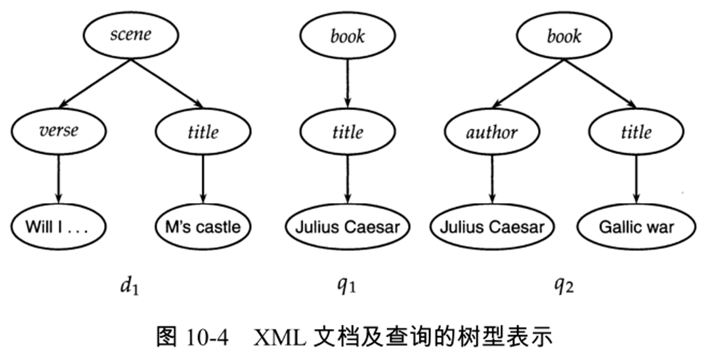
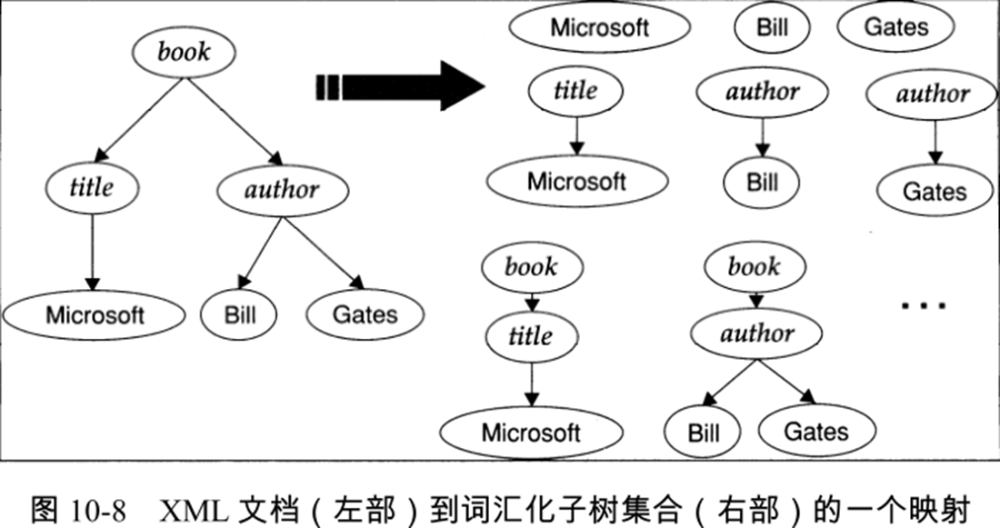
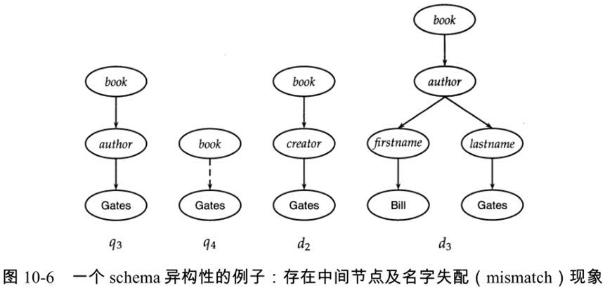
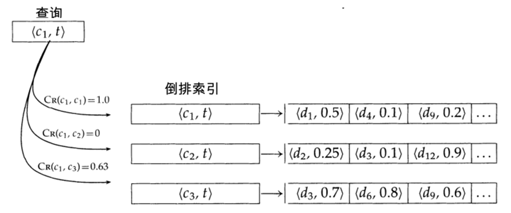

#　**Chap10 XML检索**

首先是XML的基本元素:XML元素/XML属性/XML文档标准/XPath/schema/XML查询

然后是XML查询:查询检索单位,词项统计,schema异构性

基于向量空间模型的XML检索

XML检索的评价:INEX,部件相关度/主要相关度

XML检索:以文本为中心和以数据为中心的对比

**主要是:如何将排序检索模型用于结构化文档搜索**

结构化文档的典型代表：XML

>   XML：扩展标记语言
>
>   XML检索：结构化检索（半结构化检索）
>
>   本章中的XML检索统称为结构化检索、XML查询称为结构化查询

##　**1.XML基本概念**

###### **1.XML的基本元素**

一篇XML文档是一个有序的带标签树,树上的每个结点都是一个XML元素

>   其中内部结点表示元素,叶子结点表示属性和文本
>
>   

###### **2.访问和处理XML文档的标准**

标准是:XML DOM->将元素属性和文本表示为树中的节点

###### **3.XML中的路径表达式标准**

路径:也称作XML上下文(**而不是单纯的路径,是上下文**)

XPath表达式中的node节点 表示 选择满足该表达式的**所有节点**

>**前后元素间用'/'分隔**
>
>>   act/scene 表示选择所有父节点为 act 元素的 scene 元素
>>
>>   结果：这个XPath 表达式会选中 **`element scene`** 节点。
>>
>>   <font color=red>直接返回act/scene</font>
>
>**'//'表示路径中可以插入任意多个元素**
>
>>   play//scene表示选择出现在play元素下的所有scene元素
>>
>>   首先找到root element play->向下查找任意层级的 **`scene`** 元素
>>
>>   ->有一个 **`element act`**，而 **`act`** 下面又有一个 **`element scene`**
>>
>>   <font color=red>(返回所有play下的名为scene的内容)</font>
>
>**XML路径表达式**
>
>>   如果以斜杠开始表示该路径起始于**根元素**
>>
>>   所以`/play/title`是有效的,然而`scene/title`是无效的(scene不是根节点)
>>
>>   `/play/title`会返回一个元素,`/play//titile`则会返回两个(Macbeth和M's castle)
>
>>   可以使用#来指定元素
>>
>>   比如`title#"macbeth"`表示指定标题包含该内容的文档
>>
>>   <font color=red>这个语法不是标准的XML语法,先默认这种写法</font>
>

###### **4.XML查询的常用格式--NEXI**

```xml
//article
[.//yr = 2001 or .//yr=2002]
//section
[about(..summer holidays)]
```

>   这个查询的内容是 2001年到2002年间 有关暑假 的 文章小节
>
>   (双斜杠表示路径中可以插入任意多个元素,方括号中的句点表示该查询子句所修饰的元素)

>   两个yr是属性限制条件,about子句是排序限制条件

**所以XML检索的核心信息检索问题:如何按照NEXI查询中about子句的相关性限制条件进行排序**

###### **5.XML的树结构**

将标准的XML-DOM对象中的属性去掉就可以得到新的树结构

>   

## **2.XML检索中的挑战**

###### **1.XML检索返回的内容是具体的文档部分**

文档集是XML类的结构化文档,然而查询既可以是结构化的也可以是非结构化的

**并且系统返回的不再是DocID而是具体的文档部分**

->所以对应的检索策略是返回包含信息需求的最小单位(需要划分XML的元数据)

###### **2.XML检索对文档的索引时->选取的索引单位**

主要思想:将节点分组,形成多个互不重叠的伪文档



>   缺点:各部分不重叠,文档内容不连贯

可能的解决方法:    (索引单位:书/章/小节/元素)

>   自顶向下:使用最大的一个元素作为索引单位,然后对结果后处理,找到最匹配的子结果
>
>   自底向上:对叶节点搜索,然后进一步将其拓展为更大的大内
>
>   >   但是存在多次筛选以后,结果不一定是全局最优匹配结果(开集)
>
>   所有元素建立索引:全是缺点,很多XML元素并没有实际意义,导致高度冗余性

###### **3.XML检索元素嵌套导致的冗余性**

**(DOM中的元素之间存在相互包含关系)**

###### **4.XML检索元素嵌套导致词项统计信息错误**

可能的解决方法:为XML的每个上下文词项对 计算idf值

>   比如分别计算`author#"Gates"`和`section#"Gates"`的idf值

###### **5.XML检索的schema异构性(多样性)**

IR中的XML文档存在多个来源导致相同的词项但是表示不同->被算作额外的词项


>   以上schema的元素都是`Gates`,但是查询的路径都不一样
>
>   **导致的结果1:可比性元素可能具有不同名称->(d2,d3)**
>
>   **导致的结果2:不同schema采取不同的结构化组织方式->(q3,d3)**

>   可能的解决方法:
>
>   1.近似匹配:对元素名进行某种形式上的近似匹配+文档的自动匹配
>
>   2.拓展查询:将查询中的所有父子关系解释为包含多个中间节点的关系
>
>   >   比如q4直接跳过中间节点`book//#"Gates"`

###### **6.XML检索查询和文档间的结构失配**



基于d4,q5查询失败,进行拓展查询q6,并没有起到作用(因为FFT在reference下)

可能的解决方法:将查询中指定的结构限制条件解释为一些提示线索而不是限制条件

## **3.基于向量空间模型的XML检索**



对于相同的词项可能存在于不同的结构(在title和author中都有),传统系统不支持区分结构信息

**所以XML检索中,我们应该将tiltle中的`Julius Caesar`和author中的`Julius Caesar`区分开**

###### **1.XML检索的词汇化子树**

主要方法:对向量空间中的每一维都考虑单次及其在XML树中的位置信息

>   考虑每个文本节点(叶节点)并将它们分裂成多个节点,每个节点一个词语
>
>   **将向量空间的没一维定义为文档的词汇化子树**
>
>   **<font color=red>将查询和文档表示为词汇化子树空间上的向量,进行sim计算</font>**
>
>   

###### **2.对词汇化子树建立索引**

>   (trade-off:向量空间的维数和查询结果的精度)
>
>   **对所有的 "最终以单个词项结束" 的路径建立索引(XML上下文-词项)**
>
>   结构化词项:XML上下文-词项对,记作<c,t>,c是路径,t是词项

###### **3.基于向量空间模型的XML检索**

>   **<font color=red>检索核心:优先考虑对查询结构相匹配且中间节点数量较少的文档</font>**
>
>   (为了满足这个条件,对每个匹配计算出一个权重)
>
>   **度量方式:查询中路径$C_q$和文档中路径$C_d$的相似度指标是上下文相似度**
>   $$
>   C_R(C_q,C_d) = \begin{cases}
>   \frac{1+|C_q|}{1+|C_d|},&如果C_qC_d匹配成功
>   \\
>   \\
>   0,&如果C_qC_d匹配失败
>   \end{cases}
>   $$
>
>   >   其中$C_qC_R $分别是查询路径和文档路径的节点数目(==算上根节点的路径长度==)
>   >
>   >   匹配成功的条件:可以通过插入节点使得$C_q $转换为$C_d $
>   >
>   >   **完全匹配的话可以直接得到$C_R(C_q,C_d)=1.0 $**
>
>   Eg:
>
>   

>   比如q4:`book-->Gates`和d2:`book->creator->Gates`
>
>   1.判断匹配:q4中间加一个creator就和d2匹配上了
>
>   2.计算:$|C_{q4}|=2,|C_{d2}|=3,\therefore C_R(C_{q4},C_{d2}) = \frac{1+|C_{q4}|}{1+|C_{d2}|} = \frac{3}{4}$

>比如q4:`book-->Gates`和d3:`book->author->lastname->Gates`
>
>1.判断匹配:q4中间加一个author->lastname就和d3匹配上了
>
>2.计算:$|C_{q4}|=2,|C_{d3}|=4,\therefore C_R(C_{q4},C_{d4}) = \frac{1+|C_{q4}|}{1+|C_{d4}|} = \frac{3}{5}$

###### **4.最终文档得分得分计算公式SimNoMerge**

$$
SimNoMerge(q,d)=\sum_{c_k\in B}\sum_{c_t\in B}C_R(c_k,c_l)\sum_{t\in V}weight(q,t,c_k)\frac{weight(d,t,c_l)}{\sum_{c\in B,t\in V}weight^2(d,t,c)}
$$

>   V是非结构化词项的词汇表
>
>   B是所有 XML上下文的集合
>
>   `weight(q,t,c)`和`weight(d,t,c)`分别是词项t在查询q和文档d的上下文c中的权重。



>   d9=1.0\*0.2+0.63*0.6=0.578
>
>   <font color=red>如果倒排记录的权重为0,证明没有可用的上下文,不做计算(这里是$C_R(c_1,c_2)$ )</font>

## **4.XML的评价**

###### **1.INEX**

(一种供参考的文档集/查询集/相关性判断)

>   1.CO(content only)主题:仅基于内容的主题
>
>   2.CAS(content and structure)主题:内容和结构相结合的主题

INEX定义了"部件覆盖度"和"主题相关度"作为相关性判断的两个方面

###### **2.部件覆盖度,主体相关性**

**部件覆盖评价:返回元素在结构上是否正确(在树中的层次不高不低)**

>   等级E:精确覆盖
>
>   等级S/L:覆盖度太小/覆盖度太大有冗余
>
>   等级N:所需求信息不是部件主题

**主题相关性**

>   等级3:强相关/等级2:较相关/等级1:弱相关/等级0:不相关

**合并编码:将判断结果组合成一个数字-字母编码，比如2S(较相关覆盖度小)**


## **5.以文本为中心与以数据为中心的对比**

以文本为中心的 XML（text-centric XML）检索，给文本赋予了更高的优先级。

>   (通过对非结构化检索方法进行调整，使之能够处理额外的结构化限制。)
>
>   (i)长文本字段(如文档的 section)；
>
>   (ii)非精确匹配；
>
>   (iii)按相关度对结果排序。

以数据为中心的 XML（data-centric XML）主要对数值型和非文本的属性值数据进行编码。

>   当对这类 XML 数据进行查询时，很多情况下都需要给出精确的匹配条件。
>
>   这也将重点转移到了 XML文档及查询的**结构**方面。
