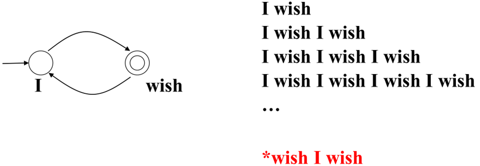
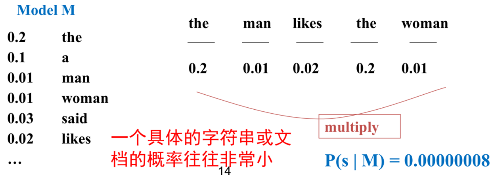
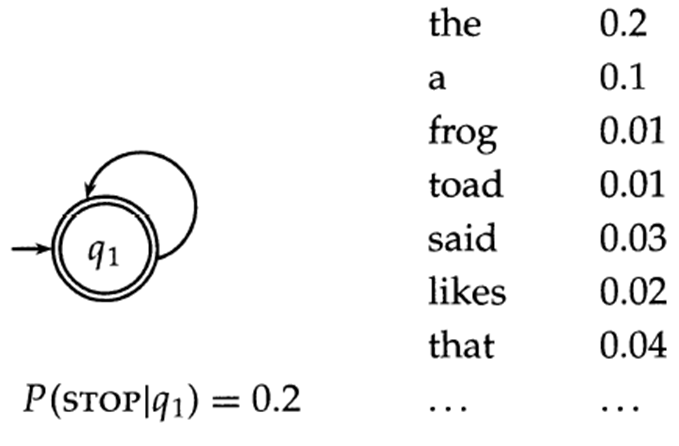
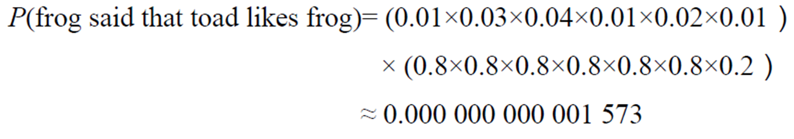
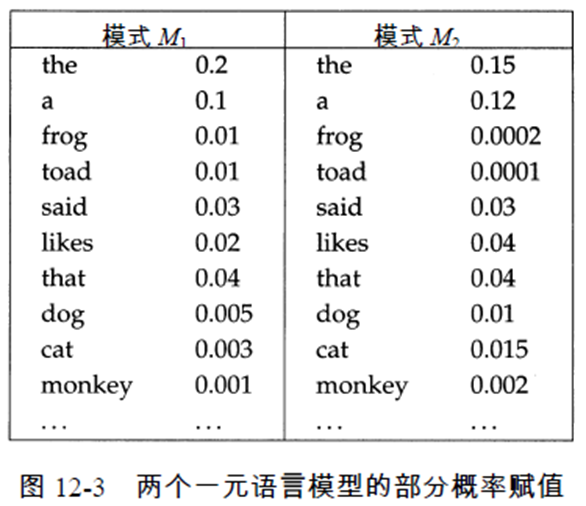
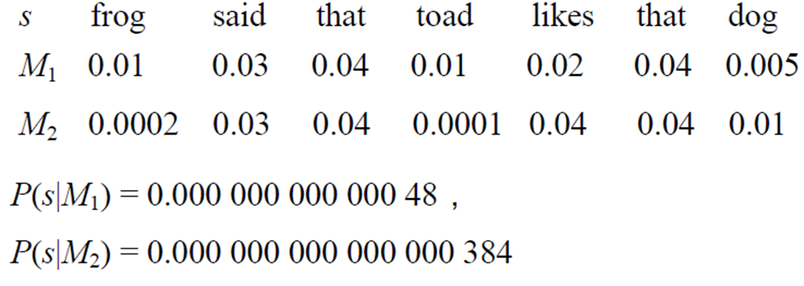
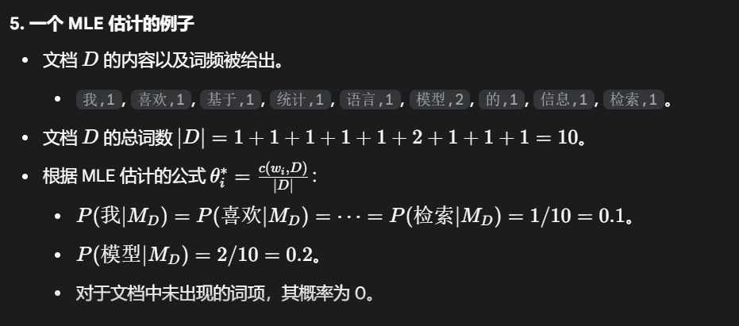
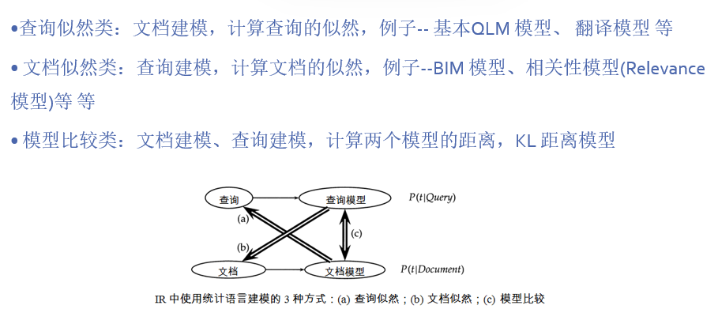
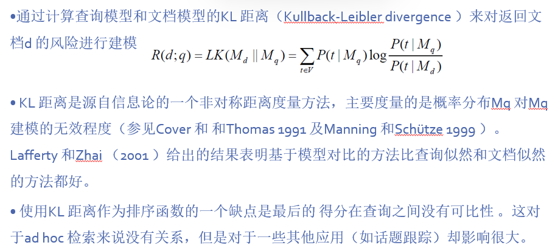
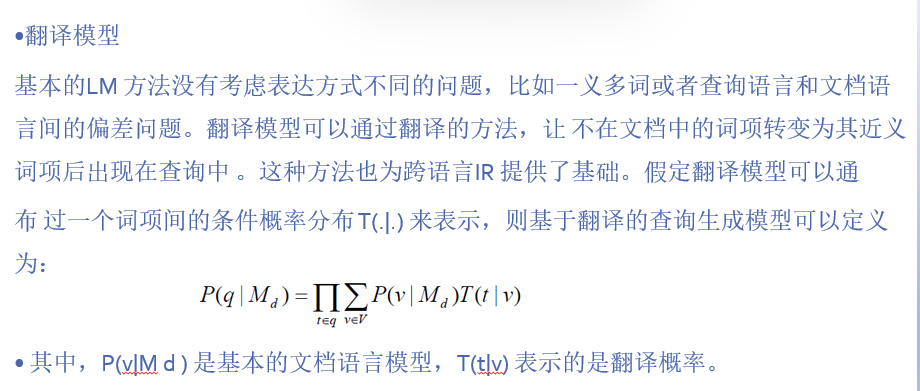

# **Chap12 基于语言建模的信息检索模型**

回顾:概率检索模型是通过概率的方法将查询和文档联系起来(计算条件概率P(R=1|Q=q,D=d))

**不同的文档和查询形式对应不同的计算方法:**

>   文档和查询 表示为词项的集合    -> 相关度使用布尔运算结果
>
>   文档和查询 表示为向量         -> 相关度使用余弦相似度
>
>   文档和查询 表示为随机变量(个数) -> 相关度为随机变量(二值法/非二值法)

(具体回顾Chap11)

## **1.语言模型**

#### **1.概率语言模型**

主要思想:好的查询应该使用 最有可能出现的词 构成查询

>   ->给定查询,如果某篇文档对应的文档模型 可能生成该查询,那么这个文档就是好的
>
>   ==**(查询与文档的相关性 可以转化为 查询与语言模型的相关性)**==

**所以根据每篇文档d建模->得到概率语言模型Md->根据模型生成查询的概率高低进行排序**

###### **1.自动机模型**

如果可以从节点开始走到节点终止,证明存在这个模式

>
>
>其中箭头表示自动机的初始状态,而**双圈节点**是可能的终止状态(带概率的)
>
>->**带概率的自动机则是一种概率语言模型,也是统计语言模型**

###### **2.语言模型**

语言模型是自动机的进阶版,考虑到完整的模式出现的概率很小,语言模型是从词汇表上抽取词汇进行组合生成对应的概率

>   

###### **3.单状态概率有穷状态自动机**

引入**词项发射概率**和**词项前进停止概率**,目的是转变为一个良构的语言模型(显式的停止概率)

>   
>
>   
>
>   p1就是词项前进停止概率和词项发射概率,除了stop其它的都是0.8

###### **4.Eg**

>   
>
>   
>
>   所以证明s由M1的生成概率更大,M1是更好的文档

###### **5.比较语言模型**

>   比较两个模型可以计算似然比,即使用模型的 数据生成概率除以另一个模型的 数据生成概率
>
>   (后序不再讨论停止概率,因为它不会影响似然比的顺序和大小)

#### **2.语言模型的种类**

**1.最简单的模型**

基于词袋模型的各项独立性,直接使用独立的乘法公式
$$
p_{unit}(t_1,t_2,t_3,t_4) = P(t_1)P(t_2)P(t_3)P(t_4)
$$
**2.一元模型**

给有序的词项赋予概率,所以使用多项式分布的概率公式
$$
p(X=x_1,...,x_2,X_k=x_k) = \begin{cases} 
\frac{n!}{x_1!\cdots x_k!}p_1^{x_1}\cdots p_1^{x_1}& \sum^k_{i=1} x_i=n
\\ \\
0& Otherwise
\end{cases}
\\ \\
\therefore P(d) =\frac{L_d!}{tf_{t_1,d}!tf_{t_2,d}!\cdots tf_{t_M,d}!}P(t_1)^{tf_{t_1},d}P(t_2)^{tf_{t_2},d}\cdots
P(t_M)^{tf_{t_M},d}
$$

>   其中M是词项词典的大小

**3.求解一元模型参数**

>   目标:求每个词项 wi 在该模型下被生成的概率 
>
>   由文档生成语言模型的方法是:使用最大似然估计MLE求模型的参数
>
>   设**词项词典大小为L**,则模型参数$M_D$的参数可以视作
>   $$
>   \overline{\theta_D} = (\theta_1,\theta_2,\cdots,\theta_L) = (P(w_1|M_D),P(w_2|M_D),\cdots,P(w_L|M_D))
>   \\ \\
>   MLE:argmax \ \overline{\theta_D} = argmax \ P(D|\overline{\theta_D})
>   $$
>   修改原函数:
>
>   **==使用连乘的原因是:查询是由多个词组成的==**
>   $$
>   P(D|\theta_D) = n!\prod^L_{i=1}\frac{\theta^{t_f}_i}{tf_i!}
>   \qquad s.t. \sum^{L}_{i=1}\theta_i=1
>   \\ \\
>   \therefore L(\lambda,\theta_D) = !\prod^L_{i=1}\frac{\theta^{t_f}_i}{tf_i!}+\lambda(1-\sum^{L}_{i=1}\theta_i)(拉格朗日函数)
>   \\ \\
>   \therefore \theta = \frac{c(w_i,d)}{|d|}
>   $$
>   这里的$ c(w_i,d) $是词项$ w_i $在文档$ d $中出现的次数，∣d∣ 是文档$ d $的总词数**(文档的角度求解模型参数)**
>
>   **==也就是说,在MLE下,一个词项在文档语言模型中的概率就是它在文档中的频率==**

**4.Eg**

>   

**5.拓展模型:多元模型**

一元语言模型:也称作上下文无关语言模型

>存在零概率问题(使用平滑可以优化)/缺乏上下文信息(使用n-gram的多元模型)

二元语言模型:考虑前一个词项的出现情况

>   $$
>   p_{bi} = (t_1,t_2,t_3,t_4) = P(t_1,)P(t_2|t_1)P(t_3|t_2)P(t_4|t_3)
>   $$
>
>   (一阶马尔可夫链)

n-gram模型:n越大,考虑的n个历史信息就越多,估计的参数量就越多,计算越准确

>   $$
>   P(w_1,w_2,\cdots,w_n) = P(w_1)P(w_2\cdots w_n|w_1)=P(w_1)\prod^n_{i=2}P(w_i,w_{i-1},\cdots,w_1)
>   $$

## **2.语言模型的应用**

语言模型的主要作用除了 判断查询和文档的相关性 而且可以识别风格(一种分布)

>   文档和查询都是该总体分布下的一个抽样样本实例

###### **1.查询似然模型**

IR中最早使用的LM模型：

对文档集中的每篇文档ｄ构建对应的语言模型$M_d$,目标是将文档按照相关的似然概率排序

**目标:是使用文档语言模型 Md 来计算整个查询序列 q 出现的概率**

>   主要使用的是贝叶斯公式
>   $$
>   P(d|q) = \frac{P(q|d)P(d)}{P(q)}
>   $$
>   其中P(q)都是一样的,所以关键是P(q|d):表示在文档d对应的语言模型下生成q的概率
>   $$
>   P(q|M_d) = \prod_{t\in q}P(t|M_d)^{c(t,q)}
>   $$
>   这里的$ c(t,q) $是词项$ t $在查询$ q $中出现的次数。**查询的角度应用模型 **
>
>   **==得到的模型是多个词项概率的乘积==**

>   1.对每篇文档对应一个文档模型
>
>   2.计算 查询被视为每个文档模型的随机抽样样本 的概率$P(q|M_{di}) $
>   $$
>   P(q|M_d) = \prod_{t\in q}P_{MLE}(t|M_d) = \prod_{t\in q}\frac{tf_{t,d}}{L_d}\\ \\
>   P(q|M_d) = \prod_{t\in q}P(t|M_d)^{tf_{t,q}} = \prod_{t\in q}(\frac{tf_{t,d}}{L_d})^{tf_{t,d}}
>   $$
>
>   >   第一个公式是PPT中的,考虑的是基于词袋模型的(出现次数只有1/0)
>   >
>   >   第二个公式是GPT的,考虑了具体词项出现的次数
>
>   3.最后根据概率对文档排序

###### **2.平滑方式:线性插值LM**

$$
P(d|q)= \prod_{t\in q}[\lambda P_{MLE}(t|M_d)+(1-\lambda)P_{MLE}(t|M_{coll}))]
$$

>$ P_{MLE}(t|M_d) $(归一化tf):在文档语言模型中t的MLE概率(doc里面的tf)
>
>$P_{MLE}(t|M_{coll}))= \frac{c(t,coll)}{|coll|}$:在整个文档的t的MLE概率(所有doc里面的tf)
>
>$\lambda$是插值系数:
>
>如果 λ 接近 1，表示我们更信任文档自身的词频信息。
>
>如果 λ 接近 0，表示我们更信任整个集合的词频信息。
>
>[==注意中括号内计算的是单个term,插值法主要用于多个term的查询(比如His car)==]
>
>要把query中所有term的概率计算出来然后连乘

###### **3.扩展的LM方法**

