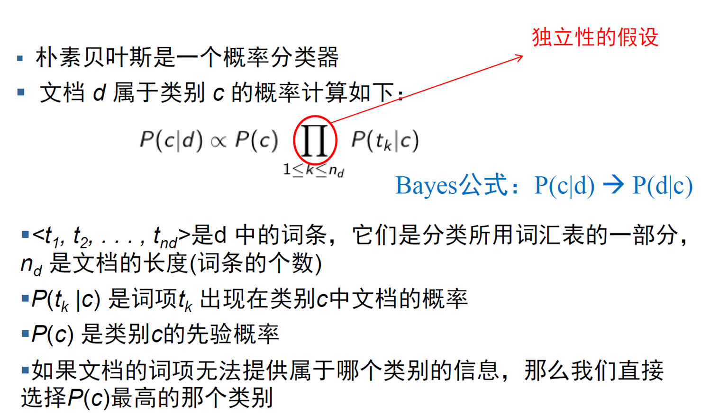
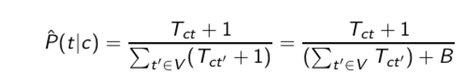
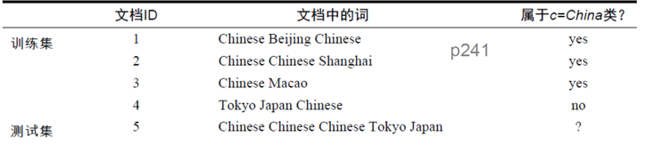
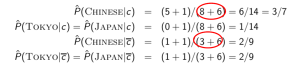
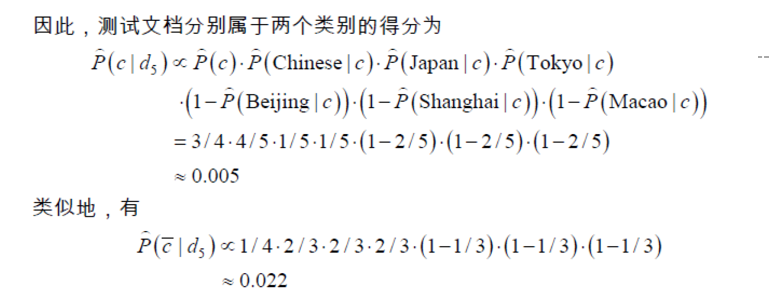

# **Chap13  基于Bayes的文本分类**

**文本分类包括:贝叶斯方法/向量空间/SVM(ML)**

(一种数据挖掘方法,但是这里主要处理的是文本数据)

文本分类以及Bayes方法

基于向量空间的文本分类

支持向量机和及其学习方法

文本分类:给定分类体系,将一个文本分到一个或者多个类别中的过小

给定文档d和标签集合C,利用某种机器学习方法或学习算法,让它学习到一个分类函数,使得将文档映射到类别,判断新的文档d'最可能属于的类别

**只要文本,IR都有用**

应用:搜索结果过滤垃圾邮件分类/相关性分级/敏感内容识别

垂直领域优化:新闻分类/文档分类

个性化推荐:兴趣标签还说呢刚才

自动问答和搜索系统

**贝叶斯**
$$
P(c|d) = \frac{P(c)P(d|c)}{P(d)} = P(c)P(d|c)
\\ \\=\prod_{1\leq k \leq n_D}P(C)P(t_k|c)(多个词项组成文档)
$$

加一平滑的分母等价性需要注意(照片)

>   使用公式$P(C_1) = \prod P(d|c_1),P(C_0) = \prod P(d|c_0)$看谁的概率大
>
>   使用训练集:
>
>   $P(C_1) = \frac{3}{4},P(C_2) = \frac{1}{4}$
>
>   $P(Chinese|c_{yes}) = \frac{5+1}{8+6}  = \frac{3}{7}$ 出现了5次,词条有8个(不取集合)
>
>   词汇表有6个(训练集+测试集的所有)
>
>   $P(Chinese|c_{no}) = \frac{1+1}{3+6} = \frac{2}{9}$
>
>   同样的对Tokyo和Japan计算相同的概率
>
>   
>
>   使用上述计算的概率对测试集进行求解
>
>   $P(C_{yes}|d_5) = P(C_1)\prod P(t|d_5) = \frac{3}{4}(\frac{3}{7})^3 \frac{1}{14} \frac{1}{14} = 0.0003$(三次方因为出现了3次)

时间复杂度:主要是线性检测计算,所以说是O(N)

(**注意上述贝叶斯的公式其实可以等价于一元语言生成模型LM(词项多项式分布)**)

>   相当于是类别C生成q的概率
>
>   **所以也叫做多项式贝叶斯分类**

**多项式模型(近似于多项式分布)和伯努利模型(近似于二项分布)**

伯努利模型:

一开始的3/4和1/4还是不变

不考虑单个文档出现的次数,而是考虑多个文档是否出现(都出现则为n)

$P(Chinese|c) = \frac{3+1}{3+2}$  表示在3个训练集中出现,分母3表示3篇文档(训练集个数)2表示类别的个数(0/1)

$P(japan|c) = \frac{0+1}{3+2}$表示在0个训练集中出现,分母3表示3篇文档(训练集个数)2表示类别的个数(0/1)

伯努利的难点在于:测试集计算的时候对立面也要计算

>   
>
>   

(==需要注意的是,对立面都要单独计算,不能使用1-==)

机器学习里面的是Laplace平滑,和这里的平滑不一样(虽然ML也没讲)

两个模型而言,伯努利更敏感,所以最适合小的数据集

## **2.特征选择**(优化算法)

降维:PCA(高维到低维)/减少空间(互信息/卡方分布)/去噪

特征选择算法:使用K方分布(检验)

## **3.分类评价**

主要是机器学习的评价而不是相关度评价:P/R/F1/AUC/ROC/宏平均/微平均

Mic:pre=acc,不同类别合并除以总个数

Max:不同的precision合并处理类别数

