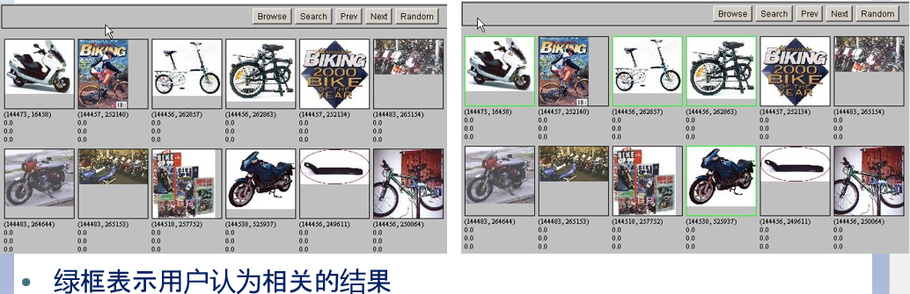
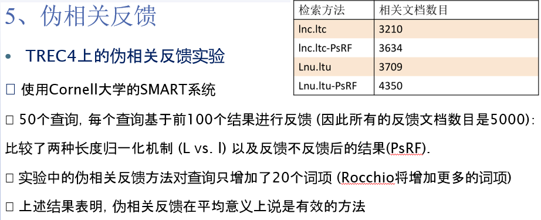
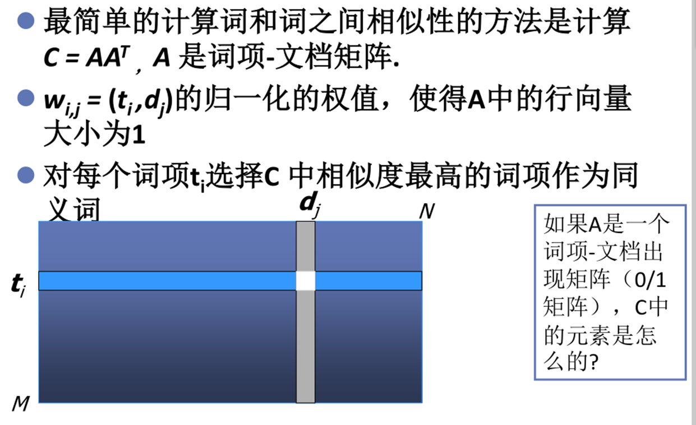

# **Chap9 相关反馈及查询拓展**

交互式相关反馈(Interactive relevance feedback): 在初始检索结果的基础上，通过用户交互指定哪些文档相关或不相关，然后改进检索的结果

>   最著名的相关反馈方法：Rocchio 相关反馈(聚类思想)

伪相关反馈(假设前k个返回结果直接相关)

查询扩展(Query expansion): 通过在查询中加入同义或者相关的词项来提高检索结果

>   主要是词典的自动/手动构建

相关词项的来源: 人工编辑的同义词词典、自动构造的同义词词典、查询日志等等

## **1.查询优化**

查询优化->即提高召回率的方法

局部方法:对用户查询进行局部的即时分析,通过查询的初始匹配文档对原始查询进行修改

>   相关反馈/伪相关反馈/间接相关反馈

全局方法:进行一次性的全局分析来产生同义词词典,使用该词典进行查询拓展

>   基于同义词词典(WordNet查询拓展重构)/自动构建同义词词典(类似于拼写校正)

## **2.相关反馈**

主要思想:用户对返回的结果进行反馈

>   用户给出查询->系统返回结果->用户标记为相关与否->系统计算出新的需求->返回结果->循环

相关反馈分类:

>   用户相关反馈(显式反馈):用户直接参与交互过程
>
>   隐式相关反馈:系统跟踪用户行为来预测返回文档相关性
>
>   伪相关反馈:没有用户参与,直接假设前k篇是相关的进行反馈

Eg:

>   

## **3.相关反馈算法**

###### **0.相关反馈算法**

核心概念:计算质心
$$
\overrightarrow{\mu}(D) = \frac{1}{|D|}\sum_{d\in D}\overrightarrow{v}(d)
$$

>   其中D是一个文档集合,$\overrightarrow{v}(d)$是文档的向量表示

###### **1.Rocchio算法**

(使用向量空间模型来收集反馈,寻找一个查询q)
$$
q = argmax[cos(\overrightarrow{q},\overrightarrow{\mu}(C_r))-cos(\overrightarrow{q},\overrightarrow{\mu}(C_{nr}))]
$$

>   这个其实是一个目标函数,最大化查询和相关文档向量的距离

然后更新,新的查询 = (所有相关文档的平均向量) - (所有不相关文档的平均向量)
$$
q = \frac{1}{|C_r|}\sum_{d_j\in C_r}\overrightarrow{d_j}-\frac{1}{|C_nr|}\sum_{d_j\in C_r}\overrightarrow{d_j}
$$

###### **2.SMART Rocchio算法**

引入一个**优化后的查询向量$\alpha q_0 $**和**正负反馈的权重$\beta,\gamma $**
$$
q =\alpha q_0+\beta\frac{1}{|C_r|}\sum_{d_j\in C_r}\overrightarrow{d_j}-\gamma\frac{1}{|C_nr|}\sum_{d_j\in C_r}\overrightarrow{d_j}
$$

>   依然是新的查询向量向着相关文档移动,远离不相关文档向量

###### **3.相关反馈算法的意义**

相关反馈可以同时提高查全率和查准率,尤其是需要高召回率的情况下,设置$\gamma<\beta $

###### **4.相关反馈算法的作用时机**

**A:用户对于初始查询有充分的认识  +  B:相关文档的原型有良好的形式**

(相关文档和不相关文档的分布十分合适,包括但不限于)

>   相关文档的词项分布相似
>
>   所有相关文档都聚集在原型周围形成一个簇
>
>   不相关文档的词项分布和相关文档的词项分布不相似
>
>   不相关文档和相关文档的相似度很小

不满足A的可能:拼写错误(各种原因的)/用户词汇和文档词汇无关联

不满足B的可能:存在多个簇/查询本身需要多个文档的答案/需要多个具体概念解释

###### **5.相关反馈算法的问题**

(查询的长度)查询过长对于IR系统而言是低效的

(返回的用时)返回给用户的时长过长

(消耗)检索系统需要在测试集中计算,还需要和查询合并计算

(实际交互差)用户的反馈可能不准确或者不存在

###### **6.相关反馈算法的评价**

主要思想:对比初始查询q和优化后的查询q的"查准率-查全率"曲线

方式1:在整个文档集合中评价

>   可以得到显著改善,但是会直接返回相关文档,需要进一步用用户没看到的文档进行评价

方式2:使用剩余文档集合评价

>   评价结果往往比初始查询的结果差,可以有效比较不同相关反馈方法之间的相对效果

方法3:使用两个文档集合

>   在第一个文档集合上使用初始查询q0 ，并进行相关性判定
>
>   在第二个文档集合上使用初始查询q0 和修改过的查询qm 进行评价
>
>   (但是实际优化效果会越来越差)

## **4.间接相关反馈**

>   将用户点击频率高的文档排在前面.点击的多的页面被认为是相关的.
>
>   从用户的点击记录中挖掘信息，进行相关反馈, 这种方法是全局的，并不依赖特定用户或查询.
>
>   通过观察用户对当前检索结果采取的行为来给出对检索结果的相关性判定

用户行为种类

>   鼠标键盘动作：
>
>   点击链接、加入收藏夹、拷贝粘贴、停留、翻页等等
>
>   用户眼球动作

## **5.伪相关反馈**

主要思想:将相关反馈部分的人工操作自动化

算法主体:根据用户查询给出结果列表->**假设前k个结果是相关的**->进行相关反馈

(平均效果很好z,但是对于某些查询可能错的很严重 并且 几步迭代后就可能出现严重的偏移)

## **6.查询拓展**

###### **1.查询拓展的运用**

查询拓展:在相关反馈中,用户给出了相关性的额外输入,运用这些额外信息重新计算查询词项权值

>   
>
>   (**系统给出了额外的可选的查询**)

###### **2.拓展用户查询的方式**

1.利用人工编撰的同义词磁带你

2.全局分析:自动生成同义词词典/统计词汇的共现/利用查询日志

>   **自动生成同义词词典:**
>
>   相似生成依据:如果两个词经常同时出现,则它们相似
>
>   相似生成依据:如果两个词和同样的词在某种语法关系中出现,则它们相似
>
>   **共现同义词辞典**
>
>   计算词与词之间相似度的方法是$C = AA^T $(A是词项文档矩阵)->一个一个算选相似度最高的
>
>   

3.局部分析:分析查询的结果文档集合