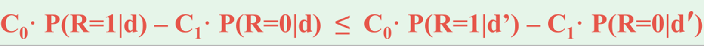
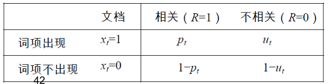
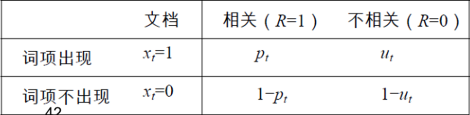
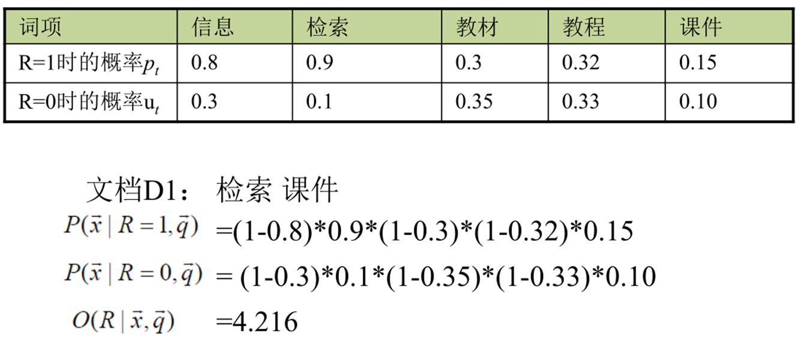
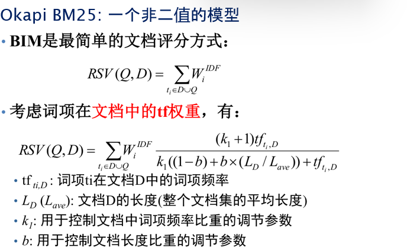
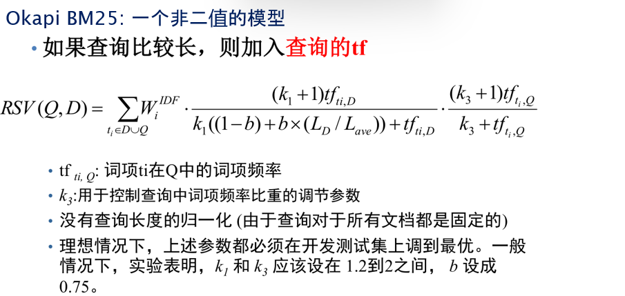

# **Chap11 概率检索模型**

首先回顾概率的基本模型,然后解释概率排序的原理,然后具体到BIM模型和BM25模型

**信息检索模型是指如何对查询和文档进行表示，然后对它们进行相关度计算的框架和方法**

## **概率基础知识**

###### **1.乘法公式**

$$
\begin{align}
P(AB) &= P(A)P(B|A)
\\
\\
P(A_1,A_2,\cdots A_n)&=P(A_1)P(A_2|A_1)\cdots P(A_n|A_1,\cdots,A_{n-1})
\end{align}
$$

###### **2.全概率公式**

假设$A_1,A_2,\cdots,A_n $是样本空间的划分
$$
P(B) = \sum^{n}_{i=1}P(A_i)P(B|A_i)
$$

###### **3.贝叶斯公式**

假设$A_1,A_2,\cdots,A_n $是样本空间的划分
$$
P(A_j|B) = \frac{P(A_j)P(B|A_j)}{\sum^{n}_{i=1}P(A_i)P(B|A_i)}
$$

###### **4.概率检索模型**

通过概率的方法将查询和文档联系起来

>   Eg:定义3个随机变量R/Q/D,相关度R={0,1},查询Q={q1,q2,...},可以通过计算
>
>   $p(R=1|Q=q,D=d)$度量文档和查询的相关度

包括:Logistic回归模型/二级独立概率模型BIM/贝叶斯网络模型...

## **概率排序原理**

• 二元假设检验与概率排序原理

• 概率排序的实现方式

###### **1.概率排序原理**

概率排序原理PRP（probability ranking principle）

>   利用概率模型来估计每篇文档和需求的相关概率P(R=1|d,q)，然后对结果进行排序

输出的结果:用户给定k值的可能性最高的前k篇文档作为结果输出

###### **2.1/0损失**

在"返回一篇不相关文档"或者"不能返回一篇相关文档",将失去一分

>   不考虑风险因子(不会对错误采用不同的权重)

当返回一个无序文档集而不是排序的结果时,可通过贝叶斯最优决策 基于最小损失风险 作出决策

>即返回相关的可能性大于不相关的可能性的文档
>
>当且仅当P(R=1|d,q)>P(R=0|d,q),d相关

**在1/0 损失的情况下，PRP对于最小化期望损失（贝叶斯风险）而言是最优的。**

****

==**如果在返回一个"无序的文档集"时，系统能够为每个文档计算出一个相关概率 P(R=1∣d,q)，那么：按照 P(R=1∣d,q) 从高到低排序并返回前 Top K 的文档集，可以被认为是“天然最优”的。**==

>   注意Topk是排序的,这里的无序是返回的文档集性质

###### **3.基于检索代价的概率排序原理**

PRP认为，如果对于一篇 ==特定的文档d== 及==所有其他未返回的文档d′== 都满足

>C1 表示一篇相关文档未返回所发生的代价  (相关但是漏报的成本,FN)
>
>C0 表示返回一篇不相关文档发生的代价    (不相关但是误报的成本,FP)
>
>(如果TP 和 TN,表示系统表现正确，不应被“惩罚”，因此代价为 0。)
>
>$P(R=1∣d)$：文档 d 是**相关文档**的概率
>
>$P(R=0∣d)= 1−P(R=1∣d)$：文档 d 是**不相关文档**的概率

>期望收益=返回文档的价值(FN)−返回文档的风险(FP) 即价值-风险

>   传统的概率排序是只考虑 $P(R=1∣d)$，也就是哪个文档相关性更高
>
>   现在让排序不仅考虑**准确性**，还考虑**错误的代价大小**

## BIM **模型**

###### **1.二值独立概率模型BIM(Binary Independence Model)**

为了实际中对概率函数P(R|d,q)进行估计,提出了以下假设

>   二值性:当词项t在文档d中出现的时候,$x_t$=1,否则$x_t$=0
>
>   独立性:词项在文档中出现是相互独立的,BIM无法识别词项间关联

核心任务:**估计**文档中的词项如何影响相关性(计算文档d和查询q相关/不相关的后验概率)

>   基于词项出现向量的概率$P(R|\overrightarrow{x},\overrightarrow{q})$对于概率$P(R|d,q) $建模,利用Bayes定理
>   $$
>   \begin{align}
>   P(R=1|\overrightarrow{x},\overrightarrow{q}) &=
>   \frac{P(\overrightarrow{x}|R=1,\overrightarrow{q})P(R=1|\overrightarrow{q})}{P(\overrightarrow{x}|\overrightarrow{q})}
>   \\
>   \\
>   P(R=0|\overrightarrow{x},\overrightarrow{q})&=
>   \frac{P(\overrightarrow{x}|R=0,\overrightarrow{q})P(R=0|\overrightarrow{q})}{P(\overrightarrow{x}|\overrightarrow{q})}
>   \end{align}
>   $$
>   其中$P(R=1|\overrightarrow{q})$表示查询q返回一篇相关文档的先验概率
>
>   其中$P(R=0|\overrightarrow{q})$表示查询q返回一篇不相关文档的先验概率
>
>   其中$P(\overrightarrow{x}|R=1,\overrightarrow{q})$(返回一篇相关文档时文档表示表示为$\overrightarrow{x}$的概率)
>
>   其中$P(\overrightarrow{x}|R=0,\overrightarrow{q})$(返回一篇不相关文档时文档表示表示为$\overrightarrow{x}$的概率)
>
>   其中$P(\overrightarrow{x}|\overrightarrow{q})$表示给定查询q的情况下,文档特征向量为x的概率
>
>   **(其中x是表示文档d的二值词项向量)**

>   (推导方式)
>   $$
>   \begin{align}
>   P(R=1|\overrightarrow{x},\overrightarrow{q}) &=
>   \frac{P(\overrightarrow{x},\overrightarrow{q}|R=1)P(R=1)}{P(\overrightarrow{x},\overrightarrow{q})} 
>   \\ \\
>   (\because P(A,B|C) &= P(A|B,C)P(B|C),对分子,乘法公式)
>   \\ \\
>   &=
>   \frac{P(\overrightarrow{x}|\overrightarrow{q},R=1)P(\overrightarrow{q}|R=1)P(R=1)}{P(\overrightarrow{x},\overrightarrow{q})} 
>   \\ \\
>   (\because P(B|A)P(A) &= P(A|B)P(B),对分子,贝叶斯公式)
>   \\ \\
>   &=
>   \frac{P(\overrightarrow{x}|\overrightarrow{q},R=1)P(R=1|\overrightarrow{q})P(\overrightarrow{q})}{P(\overrightarrow{x}|\overrightarrow{q})P(\overrightarrow{q})}
>   \\ \\&=
>   \frac{P(\overrightarrow{x}|R=1,\overrightarrow{q})P(R=1|\overrightarrow{q})}{P(\overrightarrow{x}|\overrightarrow{q})}
>   \end{align}
>   $$

###### **2.BIM排序函数的推导**

(上面得到的是计算文档 d 与查询 q 相关/不相关的后验概率,给定q以后需要对文档进行排序)

**根据独立性假设,将$P(x|R=1,q) $拆解为各个词项出现概率的乘积**
$$
P(x|R=1,q)=\prod^M_{t=1}P(x_t|R=1,q)\qquad

P(x|R=0,q)=\prod^M_{t=1}P(x_t|R=1,q)
$$
**我们更关心的是相关性比率(odd),即相关概率和不相关概率的比值**
$$
\begin{align}
Odds(R=1|x,q) &= \frac{P(R=1|x,q)}{P(R=0|x,q)} =\frac{\frac{P(\overrightarrow{x}|R=1,\overrightarrow{q})P(R=1|\overrightarrow{q})}{P(\overrightarrow{x}|\overrightarrow{q})}}{\frac{P(\overrightarrow{x}|R=0,\overrightarrow{q})P(R=0|\overrightarrow{q})}{P(\overrightarrow{x}|\overrightarrow{q})}}\\

&= \frac{P(\vec{x}|R=1, q)P(R=1|q)}{P(\vec{x}|R=0, q)P(R=0|q)}
\\
\\
& = \frac{\prod_{t=1}^{M} P(x_t|R=1, q) \cdot P(R=1|q)}{\prod_{t=1}^{M} P(x_t|R=0, q) \cdot P(R=0|q)}(独立性假设)
\\\\ &= \frac{P(R=1|q)}{P(R=0|q)} \prod_{t=1}^{M} \frac{P(x_t|R=1, q)}{P(x_t|R=0, q)}
\end{align}
$$

>   (进一步假设)
>
>   $p_t=P(x_t=1∣R=1,q)$：词项 t 在相关文档中出现的概率。
>
>   $u_t=P(x_t=1∣R=0,q)$：词项 t 在不相关文档中出现的概率。
>
>   $1−p_t=P(x_t=0∣R=1,q)$：词项 t 在相关文档中不出现的概率。
>
>   $1−u_t=P(x_t=0∣R=0,q)$：词项 t 在不相关文档中不出现的概率。
>   $$
>   \begin{align}
>   &= \frac{P(R=1|q)}{P(R=0|q)} \prod_{t=1}^{M} \frac{P(x_t|R=1, q)}{P(x_t|R=0, q)}
>   \\
>   \\
>   &=\frac{P(R=1|q)}{P(R=0|q)} \prod_{t:x_t=1}\frac{p_t}{u_t} \prod_{t:x_t=0}\frac{1-p_t}{1-u_t} 
>   \\ \\
>   (&= O(R∣q) \prod_{t:x_t=1}\frac{p_t}{u_t} \prod_{t:x_t=0}\frac{1-p_t}{1-u_t} 书上的等价写法)
>   \\ \\
>   RSV&= log \frac{P(R=1|q)}{P(R=0|q)} +\sum_{t:x_t=1}log\frac{p_t}{u_t}+ \sum_{t:x_t=0}log\frac{1-p_t}{1-u_t} 
>   \end{align}
>   $$

上面的得到了RSV公式,但是我们需要进一步化简使得可以直接代入混淆矩阵的值   
$$
\because\frac{p_t}{u_t} = \frac{p_t}{u_t}\frac{\frac{1-p_t}{1-u_t}}{\frac{1-p_t}{1-u_t}} = \frac{p_t(1-u_t)}{u_t(1-p_t)}\frac{1-p_t}{1-u_t}
$$

$$
\begin{align}
RSV&= log \frac{P(R=1|q)}{P(R=0|q)} +\sum_{t:x_t=1}log\frac{p_t}{u_t}+ \sum_{t:x_t=0}log\frac{1-p_t}{1-u_t} 
\\ \\
&= log \frac{P(R=1|q)}{P(R=0|q)} +\sum_{t:x_t=1}log\frac{p_t(1-u_t)}{u_t(1-p_t)}-\sum_{t:x_t=1}log\frac{1-p_t}{1-u_t} +\sum_{t:x_t=0}log\frac{1-p_t}{1-u_t} 
\\ \\
&= log \frac{P(R=1|q)}{P(R=0|q)} +\sum_{t:x_t=1}log\frac{p_t(1-u_t)}{u_t(1-p_t)}+\sum_{t:x_t=ALL}log\frac{1-p_t}{1-u_t} 
\\ \\
&= A +\sum_{t:x_t=1}log\frac{p_t(1-u_t)}{u_t(1-p_t)}+K
\end{align}
$$

**所以只需要计算$\sum_{t:x_t=1}log\frac{p_t(1-u_t)}{u_t(1-p_t)} $即可==注意这里要求d和q都等于1==**

>   继续定义$c_t$,可以直接对照混淆矩阵计算了:
>   $$
>   c_t =log\frac{p_t(1-u_t)}{u_t(1-p_t)} = log\frac{p_t}{1-p_t}+log\frac{1-u_t}{u_t}
>   $$
>   

###### **3.RSV的估算方法**                       

**但是现实中,相关性是主观的,并且标注的数据是有限个的,概率$p_t,u_t$未知 **

1.理论上的估算方法

|            | 文档    | 相关个数        | 不相关                 | 总计 |
| ---------- | ------- | --------------- | ---------------------- | ---- |
| (总计前提) |         | S相关文档的总数 | ==N-s==                | N    |
| 词项出现   | $x_t=1$ | ==s==           | df-s                   | df   |
| 词项不出现 | $x_t=0$ | S-s             | (N-df)-(S-s)==(last)== | N-df |

>   $$
>   c_t =log\frac{p_t(1-u_t)}{u_t(1-p_t)} = log\frac{p_t}{1-p_t}+log\frac{1-u_t}{u_t}
>   \\ \\
>   \therefore c_t = log\frac{\frac{s}{(S-s)}}{\frac{(df_t-s)}{(N-df)-(S-s)}}
>   $$
>
>   还是混淆矩阵中竖着看的分数

2.平滑方式

**引入平滑的主要目的是防止得分为log(1)=0,并且系数a也是一种先验知识**

>   加1平滑（拉普拉斯平滑）表示我们假定每个词项至少出现一次。
>
>   (但是更常见的是0.5作为系数)
>   $$
>   c_t = log\frac{\frac{s+\frac{1}{2}}{(S-s+\frac{1}{2})}}{\frac{(df_t-s+\frac{1}{2})}{(N-df)-(S-s)+\frac{1}{2}}}(\alpha =\frac{1}{2})
>   $$

3.参数估计方法($c_t,u_t,P_t$)

>   $c_t$估算:
>
>   >   方法1:解析解
>   >   $$
>   >   c_t =log\frac{p_t(1-u_t)}{u_t(1-p_t)} = log\frac{p_t}{1-p_t}+log\frac{1-u_t}{u_t}= log\frac{\frac{s}{(S-s)}}{\frac{(df_t-s)}{(N-df)-(S-s)}}
>   >   $$
>   >   方法2:交互式迭代
>   >
>   >   1.给出$p_t,u_t $的初始估计
>   >
>   >   2.利用当前估计对相关文档进行预测,将结果返回给用户
>   >
>   >   3.用户进行修正返回相关性结果VR和VNR
>   >
>   >   4.利用已知相关文档和不相关文档对$p_t,u_t $重新估计(足够大的时候$p_t = \frac{|VR_t|}{|VR|} $)
>
>   $u_t$估算:(整个文档集大多数都是不想管的,可以直接用词项频率估算,即$u_t = \frac{df_t}{N} $)
>
>   $p_t $估算:如果已知相关文档,则可以利用已知相关文档中的词项进行估计
>
>   >   直接假设为一个常数比如$p_t=0.5 $
>   >
>   >   或者使用启发式的方法:
>   >   $$
>   >   p_t= \frac{1}{3}+\frac{2}{3}\frac{df_t}{N}
>   >   $$

4.Eg(直接使用后验概率的计算)

>   
>
>   
>
>   解释:
>
>   P(x|R=1,q):给定文档与查询相关的情况下,文档x的特征向量出现的概率
>
>   >   在这里,除了"检索""课件",其它的概率都取反(使用$p_t$计算)
>
>   P(x|R=0,q):给定文档与查询不相关的情况下,文档x的特征向量出现的概率
>
>   >   在这里,除了"检索""课件",其它的概率都取反(使用$u_t$计算)
>
>   最后计算的是Odd:
>   $$
>   \frac{P(R=1|q)}{P(R=0|q)} \prod_{t=1}^{M} \frac{P(x_t|R=1, q)}{P(x_t|R=0, q)}
>   $$

5.Eg(使用$p_t,u_t$的计算)

>   |            | 文档    | 相关个数 | 不相关           | 总计     |
>   | ---------- | ------- | -------- | ---------------- | -------- |
>   | (总计前提) |         | S=100    | ==N-s=400==      | N=500    |
>   | 词项出现   | $x_t=1$ | ==s=35== | df-s=165         | df=200   |
>   | 词项不出现 | $x_t=0$ | S-s=65   | (N-df)-(S-s)=235 | N-df=300 |
>
>   $$
>   \therefore p_t = \frac{s}{S} = \frac{35}{100}\qquad u_t = \frac{df_t-s}{N-S} = \frac{165}{400}
>   \\ \\
>   c_t = log\frac{p_t}{1-p_t}+log\frac{1-u_t}{u_t}代入即可
>   \\ \\
>   平滑c_t\rightarrow p_t = \frac{s+\frac{1}{2}}{S+\frac{1}{2}}\qquad u_t = \frac{df_t-s+\frac{1}{2}}{N-S+\frac{1}{2}}
>   $$

## BM25 **模型**

上面提到的BIM模型存在**需要估计参数,没有考虑tf/文档长度,词项独立性假设前提(必考)**

所以引入了一个非二值的BM25(**更加重视词项频率和文档长度**)

>考虑了单词在查询中的权值以及单词在文档中的权值。

