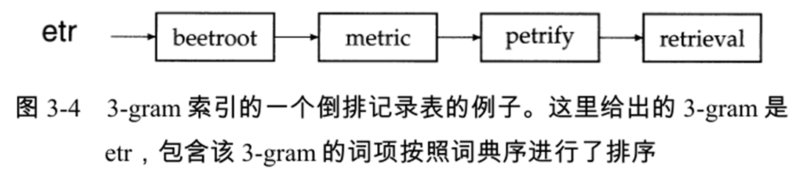
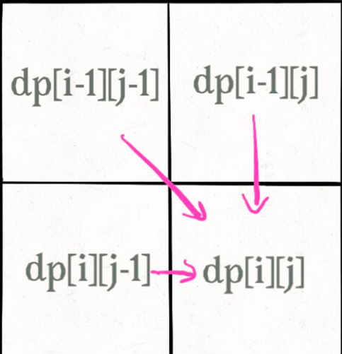
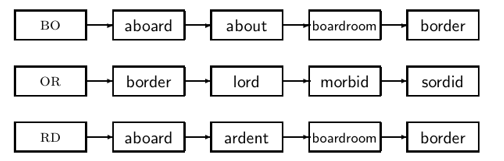
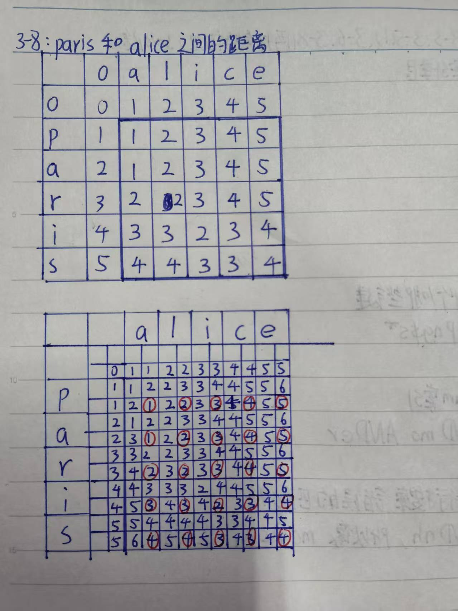

#　**Chap3 词典和容错式检索**

3.1 词典的搜索结构

1.哈希表 2.搜索树(二叉树) 3.Bshu

3.2 通配符查询

1.一般的通配符查询 2.支持通配符查询的 k-gram 索引

3.3 拼写校正 

1.拼写校正的实现 2.拼写校正的方法

①编辑距离

②拼写校正中的 k-gram 索引

③上下文敏感的拼写校正

3.4 基于发音的拼写校正

## **1.词典的搜索结构**

**这一段的主要目的是了解即可,是(第5章)计算平均查找次数的依据**

###### **1.哈希表 -> 字典查询**

**一种根据Key来进行访问的数据结构(其中Key通过哈希函数直接赋值)**

>   优点：在哈希表的定位速度快于树中的定位速度
>
>   缺点：
>
>   >   （1）没办法处理词项的微小变形
>   >
>   >   （2）不支持前缀搜索
>   >
>   >   （3）哈希冲突重新哈希

###### **2.二叉树 -> 最基本且性能一般的查询**

**一个根结点和两棵互不相交的子树组成的结构**

>   满二叉树:所有分支结点都存在左子树和右子树，并且所有叶子都在同一层上
>
>   完全二叉树:节点的编号和二叉树的对应编号位置完全相同

###### **3.B树(平衡的多分树) -> 通配符查询**

(B树中一个节点的子节点数目的==最大值==，用m表示,就是m阶)

>**每个节点最多只有m个子节点。**
>
>**每个非叶子节点（除了根）具有至少⌈m/2⌉子节点。**
>
>如果根不是叶节点，则根至少有两个子节点。
>
>具有k个子节点的非叶节点包含k-1个键。
>
>**所有叶子都出现在同一水平，没有任何信息（高度一致）。**

## **2.通配符查询**

###### **0.通配符使用场景**

>   用户对查询拼写不清楚		(S*dney)
>
>   查询词项存在不同拼写版本	    (color 和 colour)
>
>   查询词项经过了语言学处理           (judicial和 judiciary，查询 judicia* )
>

###### **1.尾通配符查询**

>   **通配符符号*在查询字符串末尾仅出现一次。**(比如查询 mon*)
>
>   >   采用B-树的词典结构，只需要返回区间  $mon \leq W < moo$ 上的词项(..mnop..)
>>
>   >   （1）依次按照字符 m、o、n 从上到下遍历搜索树，
>   >
>   >   （2）列举词典中所有以mon开头的词项集合W
>   >
>   >   （3）在普通倒排索引中进行|W|次查找后取出W中所有词项所对应的文档。

###### **2.首通配符查询**

>   **通配符*在查询字符串开始仅出现一次。**(比如查询$*mon$)
>
>   >   **需要将所有的词项倒转过来**，然后基于它们建一棵附加的反向B树，
>>
>   >   反向$B-$树遍历后可以返回所有包含同一后缀的词项，返回区间$nom ≤ t < non$上的词项$W$

###### **3.一般通配符查询**

>   **词项中间的\*号处理，比如se*mon**
>
>   先使用B-树返回所有前缀为se的词项子集W,再使用反向B-树返回所有后缀为mon的词项子集R
>
>   然后对W和R求交集$W \bigcap R $
>
>   **坏处是开销很大,所以产生了以下几种一般通配符查询**

###### **4.一般通配符查询:轮排索引(permuterm)**

a.在字符集中引入一个新的符号$，用于标识词项结束。

b.构建一个轮排索引，其中对扩展词项的每个旋转结果都构造一个指针来指向原始词项。

>   （1）将每个通配查询旋转，**使*出现在末尾**(反转查询词项)
>
>   （2）将每个旋转后的结果存放在词典中，即B-树中
>
>   >   对于 X, 查询 X\$      (无*)
>   >
>   >   对于 X\*, 查询 \$X*    (X*->$X\*)
>   >
>   >   对于 *X, 查询 X$\*    (\*X->\$\*X->X\$\*)
>   >
>   >   对于 X\*Y, 查询 Y$X*  (X*Y->\$X\*Y->X\*Y\$->Y\$X\*)

>   **对于词项`hello`:`hello\$`,` ello\$h`, `llo\$he`, `lo\$hel`, `o\$hell` `\$hello`**
>
>   **假定通配查询为 hel*o, 那么相当于要查询o$hel\*(上面的规则)**
>
>   **然后根据一般的通配符查询得到最后结果**
>
>   **坏处是:相对于通常的B-树，轮排索引的空间要大4倍以上**

###### **5.一般通配符查询:k-gram 索引**

**K-gram索引思想:由k个字符组成的序列，用一个特殊字符$，表示单词开始或结束。**

>   比如castle所有的3-gram包括\$ca、cas、ast、stl、tle、le$。

**k-gram索引结构:词典+倒排记录**

(1)词典k-gram形式的key(1个单元)

(2)倒排记录表则由包含该k-gram的所有词项组成(N个单元)

**K-gram索引过程**

>   (1)给出查询:比如给出查询mon*
>
>   (2)执行k元布尔查询:(2-gram):$m AND mo AND on
>
>   **==(3)后过滤处理伪正例==**:做简单的字符串匹配操作即可(比如moon和MOON)
>
>   **k-gram索引的空间消耗小,但是需要额外进行后过滤**

## **3.拼写校正**

###### **1.拼写校正的基本原则**

>   **1.(距离最小原则)对于拼写错误的查询,在正确拼写中,选择距离最近的(距离和邻近度)**
>
>   **2.(常见匹配原则)当两个或者多个正确拼写 查询临近度相等时,选择更常见的那个**
>
>   (拼写矫正常见于纠正待索引的文档或用户的查询)

###### **2.拼写校正的方法**

>   **1.词独立法:只检查每个单词本身的拼写错误(编辑距离,K-gram重合度)**
>
>   **2.上下文敏感法:纠错时考虑周围单词**

###### **3.拼写校正方法1:编辑距离(Levenshtein距离)**

>   **定义:指两个字串之间，由一个转成另一个所需的==最少编辑操作次数==**
>
>   >   a.**定义函数edit(i,j)**
>   >
>   >   >   表示第一个字符串长度为i的字串到第二个长度为j的子串的编辑距离
>   >
>   >   **b.动态规划公式**
>   >
>   >   >   **a.`第一个字符串[i-1] == 第二个字符串[j-1]`：** dp\[i][j] = dp\[i-1][j-1]
>   >   >
>   >   >   **b.`第一个字符串[i-1] != 第二个字符串[j-1]`：** dp\[i][j] = min{}
>   >   >
>   >   >   >   **`dp[i-1][j] + 1,`  // 删除操作** 
>   >   >   >
>   >   >   >   **`dp[i][j-1] + 1,`  // 插入操作**
>   >   >   >
>   >   >   >    **`dp[i-1][j-1] + 1` // 替换操作** 

>   **1.初始化**
>
>   >   **第一行:将空字符串转换 "f", "fa", "fai", "fail", "faili", "failin", "failing" **
>   >
>   >   **第一列:将空字符串转换 "s", "sa", "sai", "sail", "sailn"**
>   >
>   >   (所以补充的序号都是index,直观上无实义)
>
>   **2.矩阵补充(只需要比较当前最后一位字母 画2*2的小矩阵)**
>
>   >   
>
>   >   **Eg:dp\[1][1]:'s'和'f'不同:min{dp\[0][0]+1,dp\[0][1]+1,dp\[1][0]+1} = min{2,2,1}=1**
>   >
>   >   (即在矩阵中取+1后的最小值)
>
>   >   **Eg:dp\[2][2]:'a'和'a'相同:代价等于dp\[i-1][j-1]=dp\[1][1]**

|      | 0            | f            | a            | i            | l            | i            | n            | g            |
| ---- | ------------ | ------------ | ------------ | ------------ | ------------ | ------------ | ------------ | ------------ |
| 0    | $\mathbb{0}$ | $\mathbb{1}$ | $\mathbb{2}$ | $\mathbb{3}$ | $\mathbb{4}$ | $\mathbb{5}$ | $\mathbb{6}$ | $\mathbb{7}$ |
| s    | $\mathbb{1}$ | 1            | 2            | 3            | 4            | 5            | 6            | 7            |
| a    | $\mathbb{2}$ | 2            | 1            | 2            | 3            | 4            | 5            | 6            |
| i    | $\mathbb{3}$ | 3            | 2            | 1            | 2            | 3            | 4            | 5            |
| l    | $\mathbb{4}$ | 4            | 3            | 2            | 1            | 2            | 3            | 4            |
| n    | $\mathbb{5}$ | 5            | 4            | 3            | 2            | 2            | 2            | 3            |

###### **4.拼写校正方法2:拼写校正中的k-gram 索引**

因为需要把拼写错误的单词和词典所有的词项进行比较,所有适用k-gram进行筛选

**(当k=2,需要计算的长度为len(term)-1)**

>   **使用k-gram索引返回与查询词q具有很多公共k-gram的词项**
>
>   **列举查询词项中的所有k-gram**

>   **a.初始化:采用2-gram索引, 错误拼写的单词为bord**
>
>   **b.使用gram方法进行划分:2-gram: bo, or, rd**
>
>   **c.列举查询词项的倒排索引**
>
>   
>
>   d.计算Jaccard系数:$\frac{|A\bigcap B|}{|A \bigcup B|} $(A是查询内容,B是对应的k-gram集合),超过阈值才保留
>
>   >   **$A$ = `{"bo", "or", "rd"}`**
>   >
>   >   **$B_i$:`{"border"= {"bo", "or", "rd", "de", "er"}}`**
>   >
>   >   **交集 $(A \bigcap B) $= `{"bo", "or", "rd"}`，大小为 3。**
>   >
>   >   **并集 $(A \bigcap B) $= `{"bo", "or", "rd", "de", "er"}`，大小为 5。**
>   >
>   >   **Jaccard 系数 = $\frac{3}{5} $ = 0.6。**

###### **5.拼写校正方法3:上下文敏感的拼写校正**

**主要思想:通过在线搜索的方式,查找最高结果命中数**

**Eg:**

>flew form munich: flea ->flew, from -> form, munch ->munich
>
>**组合并返回所有可能**
>
>搜索 “flea form munich”
>
>搜索 “flew from munich”
>
>搜索 “flew form munch”
>
>正确查询 “flew from munich” **会有最高的结果命中数**(例如返回网页数)

**存在的问题:基于命中数的算法效率不高，开销也会非常大**

**优化方式:从查询历史中搜索,而不是从文档库中搜索;比较查询被输入的次数；匹配查询校正历史**

## **Homework**

**3-2 写出mama生成的轮排索引条目**

>   mama$
>
>   ama$m
>
>   ma$ma
>
>   a$mam
>
>   $mama

**3-3 查找s\*ng会查找哪些键**

>   (星号及以前内容后移加\$)ng\$s\*

**3-4 对fi\*mo\*er采用2-gram索引**

>   **产生的布尔表达式: fi AND mo AND er**

**3-6 mon\*h只使用2-gram的==与==进行搜索,举例错误的匹配**

**错误的2-gram是mo AND nh,所以moabcdenh是错误的**

(mooth)

