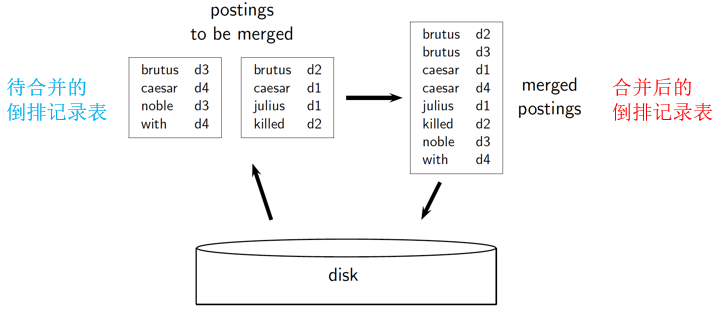
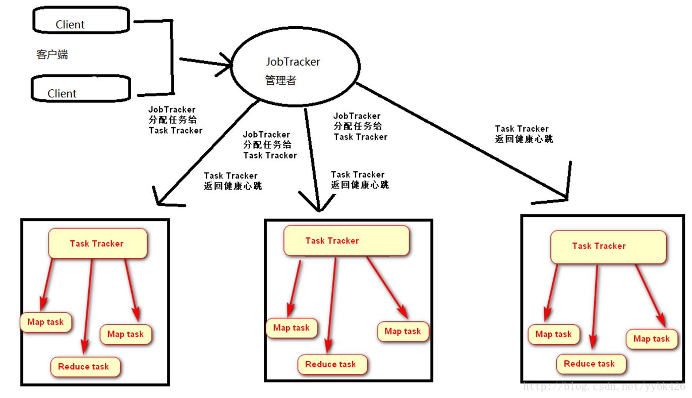
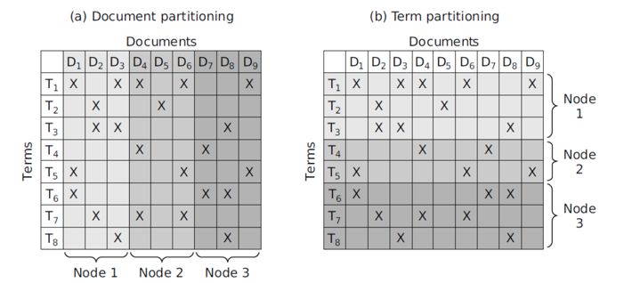
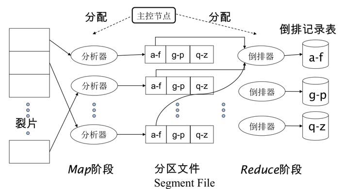
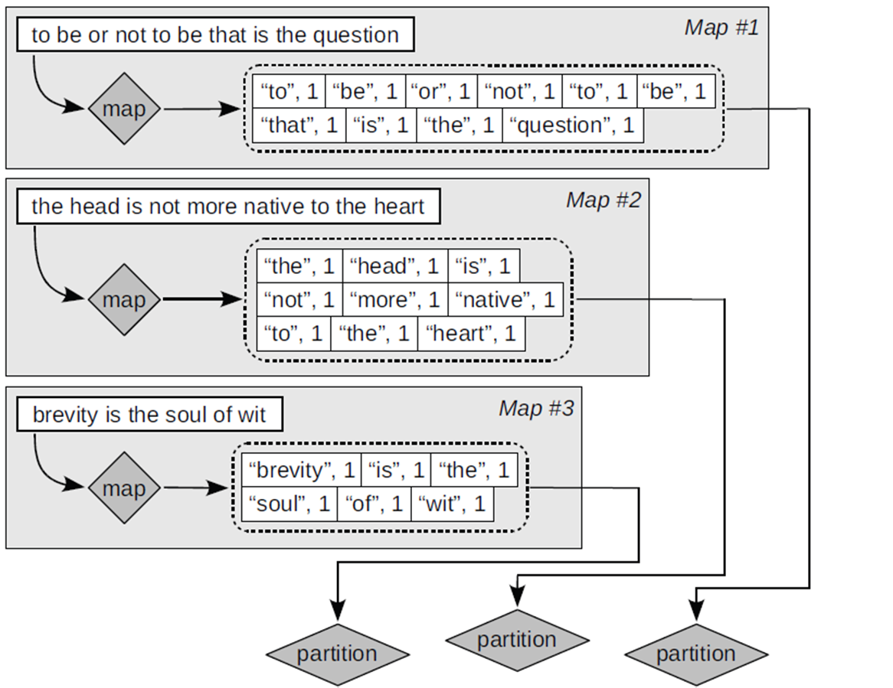
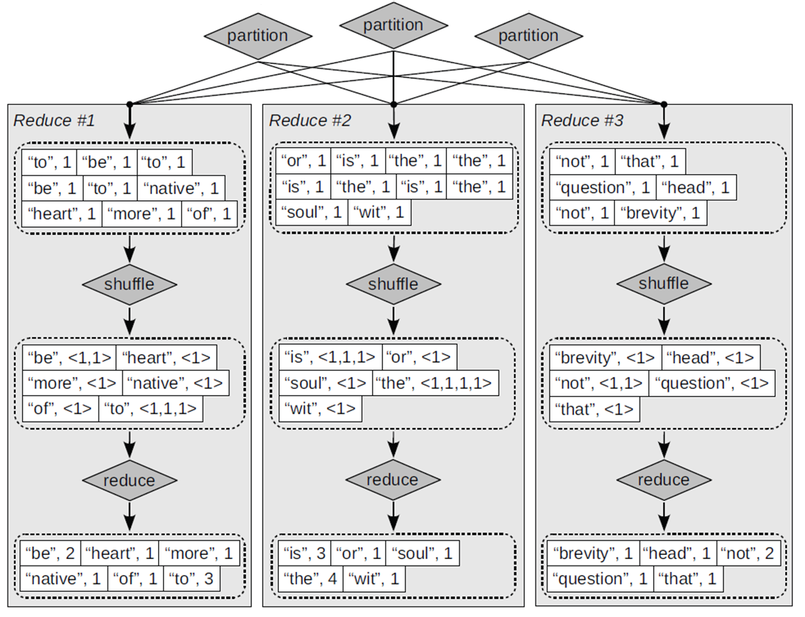
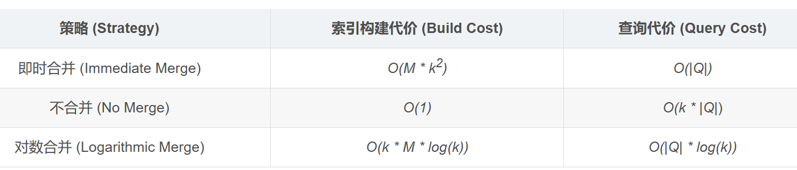

# **Chap4 Index Building**

**两种索引构建算法**: 

>   **基于块的排序索引**BSBI(简单) 

>   **内存式单遍扫描索引**SPIMI (更符合实际情况)

**动态索引构建**: 如何随着文档集变化更新索引

**<font color=red>这一章只有课上讲了一下,并没有留作业题,可能索引构建的相关复杂度会考,简略复习</font>**

## **1.硬件基础**

###### **1.硬件性能参数**

s:平均寻道时间->$5ms = 5\times 10^{-3}s $

b:每个字节的传输时间->$0.02 \mu s = 2\times 10^{-8}s $

b:处理器时钟频率->$10^9 s^{-1} $

p:底层操作时间->$0.01\mu s = 10^{-8}s $

p:内存大小->几个GB

p:磁盘空间大小->1个TB 或者更多

###### **2.存储能力**

大小:IR(信息检索)系统的服务器通常数GB的内存

和内存比较:一般比内存大小高2~3个数量级(TB级别)

容错代价控制:使用多台常规服务器代替一个容错服务器

## **2.语料库**

###### **1.Reuters-RCV1语料(路透社)**

N:文档总数->$8\times 10^5 $

L:每篇文档的平均词条数目->200

M:词项Term总数->$4\times 10^5 $

M:每个词条Token的平均字节数(包含标点)->6

M:每个词条Token的平均字节数(不含空格和标点)->4.5

M:每个词项的平均字节数->7.5

T:词条总数目->$1\times 10^8 $

###### **<font color=red>2.Reuters-RCV1语料的临时文件</font>**

N:文档总数   ->  $8\times 10^5 $ ->$2^{20}  >N(8\times 10^5 )>2^{16}　$->32bits

T:词条总数目 ->  $1\times 10^8 $ ->$2^{27}>N(1\times 10^8 )>2^{16} $  ->32bits

**<font color=red>对于N-T二元表(词条ID-文档ID)</font>:$T \times (32bits+32bits) = 0.8GB$**

**我们需要对0.8GB的ID进行排序,然而实际语料库比0.8GB更大**

###### **<font color=red>3.词典大小/倒排记录大小</font>**

M:词项Term总数 ->  $4\times 10^5 $->$2^{19}>N(4\times 10^5)>2^{16}  $  ->32bits

N:文档总数     ->  $8\times 10^5 $->$2^{20}>N(8\times 10^5 )>2^{16}　$->32bits

**<font color=red>对于词典:$M\times 32bits = 1.6MBytes $</font>**

**<font color=red>对于倒排记录表:$L\times N \times 32bits = 0.64GBytes $</font>**

###### **4.词条化的关键步骤:查找+排序**

这两个步骤尤其是排序:需要对100M的词条进行排序

## **3.大型数据索引构建算法**

###### **1.基于排序的索引构建算法**

**主要思想:在建立索引过程中,需要依次分析==所有的文档==**

**开销:对于`<词项,文档,频数>`占用12字节->但仍然需要很大空间**

**<font color=red>所以我们需要硬盘中间存储的结果</font>**

**<font color=red>同时在硬盘中排序的记录太慢了,需要很多次磁盘寻道,需要外部排序算法</font>**

###### **2.基于块的排序索引BSBI**

(**Blocked sort-based Indexing**)

**1.BSBI基本思想**

>   **1.对每个块都生成倒排记录,排序,写入硬盘中(中间存储)**
>
>   **2.然后将这些块合并成一个长的排序号的倒排记录**
>
>   

**2.BSBI具体步骤**

>   **1.分块:将文档集分割成大小相同的部分**
>
>   **2.排序:将文档解析为词项ID-文档ID->堆满固定空间->排序->放入倒排记录表**
>
>   **3.储存:将中间的临时结果放到磁盘中**
>
>   **4.合并:将所有的中间文件合并成最终的索引**

**3.细节(合并过程)**

>   **1.全局词典:在合并的过程基本不占用内存,但是需要维护<词项,ID>词典**
>
>   **2.合并方式:同时打开读取所有块(n个)对应文件**
>
>   **<font color=red>存在n个读缓冲区,以及一个最终合并的写缓冲区(目的避免寻道时间长)</font>**

###### **3.内存式单遍扫描索引SPIMI**

**1.SPIMI核心思想**

>   **1.为每个块单独生成一个词典,不需要维护全局的<词项,ID>词典**
>
>   **2.不进行排序,有新的<词项,ID>直接在后面添加**
>
>   **3.将单独的索引进行合并**

###### **4.BSBI和SPIMI的区别**

**BSBI:一个全局的<词项,词项ID>字典记录,分块进行索引构建(仍然服从字典序)**

**SPIMI:通过多局部<词项,词项ID>字典记录,将局部索引两两合并,产生全局词典**

###### **5.注意事项**

**<font color=red>注意这两个算法的最后输出都是得到倒排索引</font>**

**倒排索引的主要结构:==全局词典(词汇表)==+倒排记录表**

(构建全局词典的目的是:查询的时候可以直接通过词项ID查找对应的倒排记录)

###### **6.分布式索引构建**

(Distributed Indexing)分而治之



###### **1.DI主要思想**

**1.主控节点:利用集群中的主控节点指挥索引构建工作(默认主控节点是安全的)**

**2.分解任务:将索引构建过程分解为==并行式任务==**

**3.执行任务:主控计算机 给空间机器 分配任务**

###### **2(1)DI 划分数据(partitioning)**

**处理文档:将文档集分割成n个数据片(数据块),每个数据片就是文档子集**



###### **2(2).DI Parser分析器(并行任务1)**

**1.分配任务:主节点将==一个数据片==分配给一个空闲的分析服务器**

**2.生成序列:读取文档并生成<term,doc>对**

**3.预处理对:将<term,doc>划分为j=n的区间(比如a-f,g-p,q-z)**

**4.构建倒排**

###### **2(3).DI Inverters索引器(并行任务2)**

**1.收集倒排索引:对于每个词项分区,倒排器收集所有的<term,doc>**

**2.排序对:对<term,doc>进行排序,写入最终倒排记录表**

###### **3.可视化**



###### **4.MapReduce分布式算法**

**阶段A:索引构建;阶段B:将基于term划分的索引表->转换为基于doc划分的索引表**

即Map:input->list(k,v) Reduce:(k,list(v))->output(SI1,SI2...)

**5.MapReduce可视化**

```
To be, or not to be: that is the question

the head is not more native to the heart("native“ = loyal)

brevity is the soul of wit
```





## **2.动态索引构建**

###### **1.引入**

**目前考虑的构建算法都是静态的(==但是文档会不断加入,也会被删除或者修改==)**

**考虑两种解决方向**

>   **A.周期性对文档集从头开始进行索引重构(Collection)**
>
>   **B.即时合并(Immediate Merge)**

###### **2.Collection**

**和前面的方法一样,重新构建即可**

###### **3.Immediate Merge(合并索引结果)**

**1.主要方法**

>   **主索引维护:在磁盘中维护一个大的索引(Main Index)**
>
>   **辅助索引维护:在内存中维护新文档信息存储在小的辅助索引中**
>
>   ==**合并:同时遍历两个索引将结果进行合并**==
>
>   (合并位置默认辅助索引,若满则主索引)
>
>   **删除文档并记录在无效位向量(Invalidation bit vector)**

**2.代价分析**

>   **在构建索引的代价为$ O(M\times k^2) $,查询时间只需要$|Q| $**
>
>   (M表示单位代价,k表示文件批数,Q表示query长度)

###### **4.Immediate Merge(不合并索引结果)**

**1.主要方法**

>   **主索引维护:在磁盘中维护一个大的索引(Main Index)**
>
>   **辅助索引维护:在内存中维护新文档信息存储在小的辅助索引中**
>
>   **删除文档并记录在无效位向量(Invalidation bit vector)**

**2.代价分析**

>   **在构建索引的代价为$ O(M\times k)$,查询时间需要$k\times |Q| $**
>
>   (M表示单位代价,k表示文件批数,Q表示query长度)

###### **5.Immediate Merge(对数合并)**

**主要思想:维护磁盘上若干个最大大小为$2^i\times M $的索引段**

**边界条件**

>   **条件1:每次合并后,只会得到大小为$k= 2^m\times M $大小的索引**
>
>   **条件2:不会有两个大小相同的索引段**

**主要过程**

>   **1.初始状态:磁盘上没有任何索引(I=0)**
>
>   **2.更新第一批文档**
>
>   >   **在内存中构建文档索引,得到$I_0 $,其大小为$M=2^0\times M $**
>   >
>   >   (条件判断:此时磁盘上只有一个大小为M的索引段$I_0 $,True)
>
>   **3.更新第二批文件**
>
>   >   **在内存中构建文档索引,得到$I_0 $,其大小为$M=2^0\times M $**
>   >
>   >   (条件判断:此时磁盘上只有两个大小为M的索引段$I_0 $,False)
>   >
>   >   **<font color=red>合并操作:merge($I_0,I_0$)为$I_1$,大小为$2^1\times M $  </font>**
>   >
>   >   (条件判断:此时磁盘上只有一个大小为2M的索引段$I_0 $,True)
>
>   **4.更新第三批文件**
>
>   >**在内存中构建文档索引,得到$I_0 $,其大小为$M=2^0\times M $**
>   >
>   >(条件判断:磁盘有一个大小为M的索引段$I_0 $,有一个大小为M的索引段$I_1 $,True)
>
>   **5.更新第四批文件**
>
>   >**在内存中构建文档索引,得到$I_0 $,其大小为$M=2^0\times M $**
>   >
>   >(条件判断:此时磁盘上只有两个大小为M的索引段$I_0 $,False)
>   >
>   >**<font color=red>合并操作:merge($I_0,I_0$)为$I_1$,大小为$2^1\times M $  </font>**
>   >
>   >(条件判断:此时磁盘上只有两个大小为2M的索引段$I_1 $,False)
>   >
>   >**<font color=red>合并操作:merge($I_1,I_1$)为$I_2$,大小为$2^2\times M $  </font>**
>   >
>   >(条件判断:此时磁盘上只有一个大小为4M的索引段$I_0 $,True)

**代价分析**

>   **设$k=2^n $(n为合并的次数),那么最后得到的索引$I = K\times M $**
>
>   **==因为不存在两个相同大小的I,所以最多有$I_{log(k)}　$个索引,即O(log(k))==**
>
>   **(查询最高复杂度为$O(|Q|\times log(k)) $)**

**缺点**

>   **缺点：有多个索引使收集范围的统计数据的维护变得复杂。例如，它影响了拼写纠正算法，有了多个索引和一个失效位向量，一个词项的正确数量不再是一个简单的查找。事实上，在对数合并中，IR系统索引维护、查询处理、分发等的所有方面都更加复杂。**

###### **6.summary**

