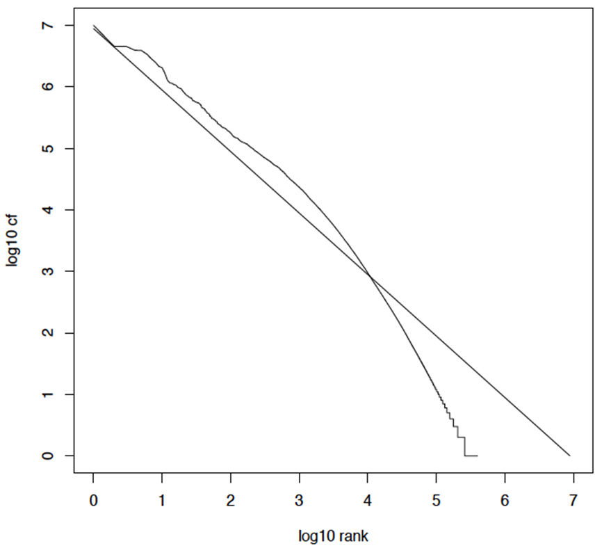

# **Chap5:Index_Compressing索引压缩**

这一章的统计特性可以是选择题,但是主要考的是编码方式

**第三章节提到:使用k-gram进行容错式查询需要使用到dict+list的结构**

==(本章节将涉及所以大小的估计准则+对应的优化方法)==

>   词项数目的估计->Heaps定律
>
>   词项分布的建模->Zipf定律
>
>   词典压缩->单一字符串压缩/按块存储**(涉及计算差值)**/前端编码
>
>   倒排记录表->可变长字节码/一元编码/gamma编码

**1.词典压缩的好处**

>   **增加内存利用率:词典压缩足够小以便放入内存中,甚至和倒排记录放一起**
>
>   **<font color=red>主要目的:将词典放入内存以获得很高的查询吞吐率</font>**

**2.索引压缩的结果**

>   **减少所需的磁盘空间**
>
>   **减少从磁盘读取倒排记录文件所需时间**
>
>   **在搜索引擎中支持更多token的查询**

## **1.词项的统计特性**

###### **1.Reuters-RCV1统计数据**


**<font color=red>30定律原文:出现频率最高的30个词在书面文本中占了30%的出现比例</font>**


###### **2.无损压缩&有损压缩的选择**

**无损压缩:压缩之后所有原始信息都被保留(IR中常用)**

**有损压缩:丢掉一些信息(预处理步骤:大小写转换,停用词去除,词干还原)**

###### **3.词汇量&文档集大小的问题**

**<font color=red>词汇量不可确定,长度为x的不同单词至少有$70^x $个词汇</font>**

**在采用Unicode编码时,词汇量会随着文档集的增大而增长**

###### **4.词项数目的估计**

**1.Heaps定律**

**$M = kT^b $(其中M是词项的数目,T是文档集中词条的个数)**

>其中参数k和b的典型取值是:$30\leq k\leq 100,b\approx 0.5 $
>
>**<font color=red>词汇量大小M和文档集大小T==在对数空间==,存在斜率为$\frac{1}{2}$的线性关系</font>**
>
>==**1.随着文档数目的增加,词汇量会持续增加而不会稳定到一个最大值**==
>
>**==2.大规模文档集的词汇量会非常大==**

**RCV1语料库**

>|             文档总数              |     800,000     |
>| :-------------------------------: | :-------------: |
>|     **每篇文档的平均词条数**      |     **200**     |
>|         **词项总数（M）**         |   **400,000**   |
>| **倒排记录总数（T，即总词条数）** | **160,000,000** |
>
>$$
>M\approx 43.65\times T^{0.49}=43.65\times(160000000)^{0.49}=54.9\times 8317.6=456646
>$$
>(即公式预测的词项总数为456646,和400000相近)
>
>

**2.Zipf定律**

**排名第i多的词项的文档集频率与1/i成正比**

>   **$Cf_i $是文档集频率,即词项$t_i $在文档集中出现的次数,和$\frac{1}{i} $成正比,和$\frac{K}{i}$成正比**
>
>   (其中k是归一化系数,一般是对数便于计算)
>
>   如果最高频词项出现了$cf_1 $次->第二高的$\frac{cf_2}{2}$->第三高的$\frac{cf_3}{3} $
>
>   因为归一化系数可以是对数:$logcf_i=logK=logi　$(一种线性关系)**

**RCV1的Zipf定律**

>   

## **2.压缩-词典压缩**

###### **1.(词典存储)定长数组存储**

**词典存储是定长数组存储的**   <font color=red>词项+文档频率+指针</font>

```
(一共3项)	
	term1 term2 term3 term4	 ...	termn(词项)
	freq1 freq2 freq3 freq4  ...	freqn(文档频率)
	lptr1 lptr2 lptr3 lptr4  ...	lptrn(倒排记录表指针)
```

>   

|       词项个数       | 400000 |
| :------------------: | :----: |
|       平均词项       |  20B   |
|     文档频率存储     |   4B   |
| 词项倒排记录表的指针 |   4B   |

$\therefore M\times(20+4+4)=400000\times 28 =11.2MB $

**缺点:每个词项都是固定数组(没有完全利用空间or超出数组空间)**

****

###### **2.(词典存储)压缩长字符串存储**  

**词典看成单一字符串,并存储词项指针**  

>   <font color=red>N * (文档频率+倒排记录指针+词项指针) + 所有词项(纯字符串)</font>
>
>   <font color=red>N * (文档频率+倒排记录指针+词项指针+平均词项纯字符串)</font>

```
(一共4项)		|	  |	     |	  | 	...		|  (ptr)
			term1 term2 term3 term4	 ...	termn(词项)
			freq1 freq2 freq3 freq4  ...	freqn(文档频率)
			lptr1 lptr2 lptr3 lptr4  ...	lptrn(倒排记录表指针)
```

>   

>   | 词项个数       | 400000 |
>   | -------------- | ------ |
>   | 平均词项大小   | 8B     |
>   | 词项文档频率   | 4B     |
>   | 倒排记录表指针 | 4B     |
>   | 词项指针       | 3B     |
>
>   $400000*(4+4+3+8)=7.6MB$  ==(相对于11.2MB压缩了1/3)==

****

###### **3.(词典存储)按块存储--优化长字符串存储**

**按块存储基本思想:使用数字来表示词项指针**

>   每一个块==保留第一个指针==,其余k-1个指针删除,同时增加k个数字**(分为了k组,每组大小暂定)** 
>
>   <font color=red>注意删除了k-1个指针,留一个作为入口</font>

```
(if k=4)
原来:	|	  |	     |	  | 	(ptr)
	term1 term2 term3 term4	 (词项)
	freq1 freq2 freq3 freq4  (文档频率)
	lptr1 lptr2 lptr3 lptr4  (倒排记录表指针)
	
现在:	|						(ptr)
	l1+t1 l2+t2 l3+t3 l4+t4	 (数字+term)
	freq1 freq2 freq3 freq4  (文档频率)
	lptr1 lptr2 lptr3 lptr4  (倒排记录表指针)
```

>   
>
>   **<font color=red>假设已知长字符串的大小为M,和块大小k</font>**
>   $$
>   M^* = M-(k-1)\times ptr(指针大小)+k
>   $$
>   **节省的空间大小**
>   $$
>   (k-1)\times ptr(指针大小)-k*1
>   $$

>   if块大小k=4(4个一组)
>
>   平均大小:  原来:3B*4=12B;   现在:1\*3+4=7(1个指针4个数字)
>
>   总共 400,000个词项 / 4个词项/组 = 100,000组
>
>   总节省字节数：100,000组 × 5字节/组 = 500,000字节= 0.5MB
>
>   (现在降低到了7.1MB)

###### **4.(词典存储)按块存储--平均查找次数**

**可以通过增大k无限压缩接近最小值**

原来:$400k*(4+4+3+8)=7.6MB$

最小值:$400k*(4+4+1+8)=6.8MB$

**<font color=red>但是问题:随着k的增大,二叉树退化成单链表导致==词典的查找慢的无法忍受==</font>**

**<font color=red>平均查找次数:(1+2\*2+4\*3+4)/8=2.6</font>**

>

**<font color=red>平均比较次数:(1+2\*2+2\*3+2*4+5)/8=3</font>**

>   

###### **5.(词典存储)按块存储+前端编码**

**主要内容:按照词典顺序排列的连续词项之间往往具有==公共前后缀==。**

>   
>
>   最后可以进一步压缩到5.9MB

## **3.倒排记录表压缩**

###### **1.倒排记录表压缩 的背景**

**对于倒排记录表按照文档 ID 的递增顺序来存储一个词项的倒排列表**

>   **<font color=red>进一步的,我们需要存储间距GAP</font>**

###### **2.(方法一)VB编码**

**主要操作:对于一个间距值G,我们想用最少的所需字节来表示$log_2 G bit $**

>   **初始化:先用一个字节来存储G,分配1bit作为延续位c**
>
>   **条件一:如果$G\leq 127 $对7位有效码采用二进制编码并设延续位c=1**
>
>   **条件二:如果$G>127 $,对G低阶的7位编码,用额外的字节对高阶bit位进行编码**
>
>   **最终:设置最后一个字节的延续位为1(c=1),其它字节(c=0)**

**Eg:824的VB编码**

>   1.**(二进制)**将824转换为二进制1100111000(除2余数法)。
>
>   2.**(编码)**根据条件二824>127我们需要对低阶的7位进行编码，并用额外的字节对高阶位进行编码。
>
>   >   **处理低阶的7位:824的低阶7位是 `0111000`（从二进制的右边数起）。**
>   >
>   >   **处理高阶位:剩余的高阶位是 `110`。为了凑足7位在前面补零，得到 `0000110`。**
>
>   3.**设置延续位:** 最后一个字节的延续位设置为 1，其它字节的延续位设置为 0。
>
>   >   **第一个处理的 7 位 (`0111000`) 将成为编码的最后一个字节，延续位设置为1，所以该字节是 `10111000`**
>   >
>   >   **第二个处理的 7 位 (`0000110`) 将成为编码的前一个字节，其延续位设置为0，所以该字节是 `00000110`**
>
>   **4.最终按处理顺序排列，得到 824 的 VB 编码：00000110 10111000。**

**Eg:反过来0000011010111000**

>   (1为最高位的是最后一个编码,倒推)
>
>   **1.划分位数:00000110 10111000**
>
>   **2.还原高低:00000110 00111000**(最后一位编码变换)
>
>   **3.合并消0:11000111000**
>
>   **4.转换二进制:$2*3+2*4+2*5+2*9+2*10=8+6+32+256+512=824$**

###### **3.(方法2)一元编码**

**数字n用n个1后面加1个0表示**

>   **3:1110**
>
>   **5:111110**
>
>   **10:11111111110**

###### **4.(方法3)$\gamma $编码**

**<font color=red>所有编码方法中的最优解</font>  将间距G表示为`长度`和`偏移`的组合**

**主要操作:对于一个间距值G**

>G的偏移是G的二进制编码(去掉最高位的1)
>
>G的长度是G的偏移的长度(去掉最高位的1剩余的,长度的,二进制)

**Eg:13**

>   **G的偏移是G的二进制编码:13->1101->101(==去掉前端的1==)**
>
>   **G的长度是G的偏移的长度:101(是3位)->3->111->1110(<font color=red>3的一元编码</font>)**
>
>   两者结合:1110 101

**Eg:1110101**

>   **读入一元编码直至遇到0结束(一元编码结束符是0): 1110**
>
>   **对一元编码解码,计算后面偏移的长度:  1110->111->3**
>
>   **==所以继续读3位==,最前面加1,得到二进制编码: 101->1101->13**

###### **5.VB和gamma分析**

>   **$\gamma $编码的长度永远是奇数位**
>
>   **G的编码长度为$2[logG]+1bit $(下取整)**
>
>   >   **偏移部分的编码长度是$logG bit$**
>   >
>   >   **长度部分的编码长度是$log G+1 bit $**
>
>   **和VB编码一样,$\gamma $编码也是前缀唯一可解的**
>
>   **对任何分布都使用,并且没有参数**

**<font color=red>但是gamma很少使用,因为解压消耗更高</font>**

>   机器一般都有字边界,超过字边界的操作都会很慢

## **4.RVC1总结**


## **Homework**


