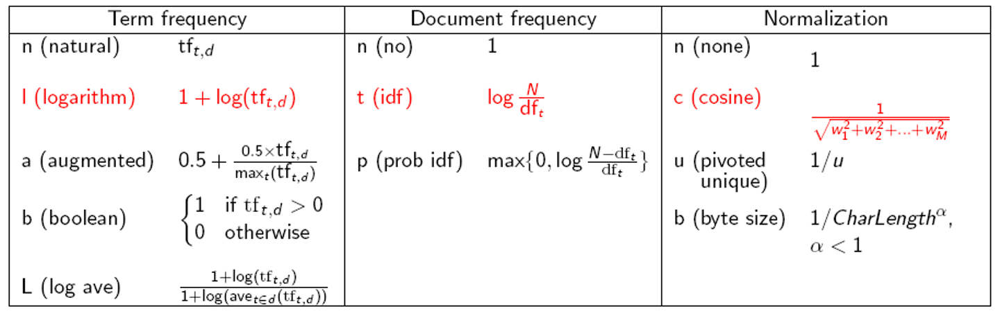

# **Chap6文档评分、词项权重计算及向量空间模型**

考试大题必考的一章节

>   1.参数索引以及域索引
>
>   ==2.词项权重的计算==:进行基本的频率/tf-idf计算
>
>   ==3.向量空间模型==:通过得到的频率计算余弦相似度
>
>   ==4.其它tf-idf计算方法==:要求归一化方式进行计算

## **1.排序式检索**

###### **1.排序式检索背景**

**检索原理:系统根据 文档与query的相关性 返回文档集的文档**

**检索方式:布尔查询和自由文本查询**

**检索范围:只需要返回topk个结果即可(需要一个合适的排序算法)**

###### **2.排序式检索的评分标准1(Jaccard系数)**

$$
Jaccard(A,B)= \frac{|A\bigcap B|}{|A \bigcup B|}\qquad Jaccard(A,A)=1
$$

>   **Query:ides of march**
>
>   **Doc1:caesar died in march**
>
>   **Doc2:the long march**
>   $$
>   \therefore Jaccard(q,doc1)=\frac{1}{6}\quad Jaccard(q,doc2) = \frac{1}{5}
>   $$
>   

###### **2.排序式检索的评分标准2(域加权评分)**

(域加权评分->域的概念->如何确定权重)

**基本思想:除了基本的词项外还考虑了文档的属性信息(元数据)**

>   元数据:和文档相关的特定形式的数据(创建时间,创建格式,作者信息)
>
>   参数化索引:已经确定的信息的集合(比如语言格式的集合,日期的集合)
>
>   域索引:域中自由文本的所有词汇(比如剧情简介)
>
>   **主要是通过域索引来进行评分,通过参数化索引来限制范围(研究可计算的参数化索引)**

**域编码,域加权评分**

>   **域编码:对单篇文档中的I个域进行权重编码,满足$\sum^{l}_{i=1}g_i =1 $**
>
>   **域加权评分:**(其中$g_i$是第i个域的权重,$s_i$是匹配分数[0/1])**通过倒排索引进行计算**
>   $$
>   \sum^l_{i=1}g_is_i
>   $$

**Eg:如果域加权评分越接近,则查询和域越匹配**

>   **比如3个域:author\title\body->g=0.2\0.3\0.5 **
>
>   如果查询CIEL在title和body中:$0.2\times 0 + 0.3\times1+0.5\times1=0.8 $

****

**权重学习方法:基于二分类的机器学习**
$$
\begin{align}
最终得分 \ score(d,q)&=g\cdot s_T(d,q)+(1-g)S_B(d,q)(二分类)
\\
\\
最优权重\ g&= \frac{n_{10}r+n_{01n}}{n_{10r}+n_{10r}+n_{01r}+n_{01n}}
\end{align}
$$

**解释(对于两种评判方法)**

>   **分子:表示的是在两种评分方式给出不同判断时，其中一种方式是正确的**
>
>   **分母:表示的是两种评分方式给出不同判断的所有情况的数量。**
>
>   >**n10r: 方法1相关，方法2不相关，实际相关**
>   >
>   >**n01r：方法1不相关，方法2相关，实际相关**
>   >
>   >**n01n: 方法1不相关，方法2相关，实际不相关**
>   >
>   >**n10n:方法1相关，方法2不相关，实际不相关**

==**使用权重g给新的文档打分**==

>   **对于文档d1，存在标题Title(T)和主体Body(B)**
>
>   **存在一个查询q（比如“string”）**
>
>   假设，如果Title中没有q，则$S_T(d_1,q)=1 $
>
>   假设，如果Body中存在q，则$S_B(d_1,q)=0 $
>
>   那么存在以下公式衡量文档d1和查询q的关系：
>   $$
>   score(d_1,q) = g\cdot S_T(d_1,q)+(1-g)S_B(d_1q)
>   $$

**总的来说，词项矩阵可以是：**

$$0/1->tf->log(tf)->idf->tfidf$$

$$主要用的是tf和tf \times idf$$

## **2.词项频率和权重计算**

词袋模型:词项的集合(词项集),不考虑文本的位置信息

词项频率(tf):词项t在文档中出现的次数==(term frequency)==

>   $$
>   标准tf = \begin{cases}
>   n_t&tf_{t,d}>0\\
>   \\
>   0&Oth
>   \end{cases}
>   \qquad
>   对数tf(wf) = 
>   \begin{cases}
>   1+lg(tf_{t,d})&tf_{t,d}>0\\
>   \\
>   0&Oth
>   \end{cases}
>   $$
>
>   **存在文档-词项匹配得分:同时存在于query和文档d中的词项频率**
>   $$
>   Score(q,d) = \sum_{t\in q\bigcap d}(1+log tf_{t,d})\\
>   
>   (如果等于0则没有公共词项)
>   $$

## **3.tf-idf计算**

###### 1.文档频率(df)

>   出现t的所有文档数目(最适合的权重视角)==(document frequency)==

###### 2.文档集频率(cf)

>   词项t在文档集中出现的次数(不适合的权重视角)==(collection frequency)==

###### 3.逆文档频率(idf)

>   词语**在整个文档集(collection)**的重要程度,如果出现次数过高可以考虑是否为停用词
>
>   **对文档集频率较高的词项==赋予较低的权重==,避免数量绝对影响**
>   $$
>   idf_i= lg\frac{N}{df_t} = 特殊要求(比如直接df)
>   $$
>   (其中N是所有文档的数目,df比较大所以使用对数缩放)
>
>   **只有query中有两个以上的查询词idf才有作用,N和df相除等于1的话idf结果为0**

###### 4.词频-逆文档频率(tf-idf)

>   词语在**单个文档(document)**的重要程度,通过当前文档的频率TF和整个文档集的idf衡量
>   $$
>   \\
>   \begin{align}
>   tf-idf_{t,d} &= tf_{i,d}\times idf_t
>   = n_t\times lg(\frac{N}{df})(标准尺度)
>   \\
>   \\
>   tf-idf_{t,d} &= tf_{i,d}\times idf_t = (1+lg(tf))\times lg(\frac{N}{df})(对数尺度)
>   \end{align}
>   $$
>
>   数值从大到小:少数文档多次出现>少数文档少数出现/多数文档多数出现>所有文档出现
>

##　**3.向量空间模型**

###### **0.向量空间模型表示(词项矩阵)**

1.语言学处理(分词,语言学处理,归一化)

2.构建参考用词袋模型(词项集合,统计词项个数)

3.词项-文档矩阵的构建

>   a.二值表示(出现的为1,否则为0)
>
>   b.词项表示(矩阵对应该词项在不同文档出现的次数)
>
>   c.TF-idf矩阵(矩阵对应该词项在不同文档中的tf-idf)
>
>   >   统计df:根据词项在**所有文档**中出现的次数得到df
>   >
>   >   统计tf:根据词项在**当前文档**中出现的次数得到tf(可能需要归一化:$1+lg(tf)$)
>   >
>   >   计算idf:$log(\frac{N}{df+1}) $
>   >
>   >   计算tf-idf:$tf-idf=tf\times idf$

###### **1.文档相似度计算1:求欧式距离**

受到向量本身长度的影响,即使相似也会有很多差距

###### **2.文档相似度计算2:求夹角(余弦相似度)**

>   好处:在[0,180]上单调递减
>
>   分为归一化和非归一化两种形式
>   $$
>   sim(d_1,d_2)= \frac{\overline{V}(d_1)\cdot \overline{V}(d_2)}{|\overline{V}(d_1)||\overline{V}(d_2)|}(归一化) =\overline{V}(d_1)\cdot \overline{V}(d_2)(非归一化)\\
>   \\
>   $$
>   其中$(\overline{x}\cdot \overline{y} = x_1y_1+x_2y_2+\cdots + x_ny_n)$表示向量的内积

>   Eg:先求词项向量在文档中的归一化->求不同文档之间的sim(内积操作)
>
>   |           | Doc1 | Doc2 | Doc3 |
>   | :-------: | :--: | :--: | :--: |
>   |    car    |  27  |  4   |  24  |
>   |   auto    |  3   |  33  |  0   |
>   | insurance |  0   |  33  |  29  |
>   |   best    |  14  |  0   |  17  |
>
>   **对于car在doc1的sim:**
>   $$
>   \frac{27}{\sqrt{(27)^2+(3)^2+0+(14)^2}} = \frac{27}{\sqrt{934}}\approx\frac{27}{30.56}\approx 0.88
>   $$
>   **对于car在doc2的sim:**
>   $$
>   \frac{4}{\sqrt{(4)^2+(33)^2+(33)^2+0}} = \frac{4}{\sqrt{2194}}\approx\frac{4}{46.84}\approx0.09(0.085)
>   $$
>   **对于car在doc3的sim:**
>   $$
>   \frac{24}{41.30}\approx 0.58
>   $$
>   ...最后得到的词项关于文档的归一化结果(tf归一化)
>
>   |           | Doc1 | Doc2 | Doc3 |
>   | --------- | ---- | ---- | ---- |
>   | car       | 0.88 | 0.09 | 0.58 |
>   | auto      | 0.10 | 0.71 | 0    |
>   | insurance | 0    | 0.71 | 0.70 |
>   | best      | 0.46 | 0    | 0.41 |
>
>   文档余弦相似度计算:直接使用$doc_x \times doc_y$做点积即可**

###### **3.Query和文档的余弦相似度**

首先还需要构建词袋向量以及词项-文档矩阵

## **4.查询**

**1.首先构建词项**

>   $t = D_t \bigcup Q_t$
>
>   **`查询中的向量`和`文档向量的`并集**

**2.计算tf/df/idf**

>tf：查询中是否出现该词项
>
>df:文档频率(词项在文档集的个数)
>
>idf:$log(\frac{N}{df})$(注意这里是N而不是df)

**查询余弦相似度计算:比如查询"car insurance"**

|       | car  | auto | insurance | best |
| :---: | :--: | :--: | :-------: | :--: |
| query |  1   |  0   |     1     |  0   |

|           | Doc1 | Doc2 | Doc3 |
| :-------: | :--: | :--: | :--: |
|    car    | 0.88 | 0.09 | 0.58 |
|   auto    | 0.10 | 0.71 |  0   |
| insurance |  0   | 0.71 | 0.70 |
|   best    | 0.46 |  0   | 0.41 |

$$
(Doc_1,Q) = 0.88\times 1+0.10\times0+0\times1+0.46\times0 = 0.88\\
\\
|D_1| = \sqrt{(0.88)^2+(0.10)^2+0^2+(0.46)^2} = \sqrt{0.996}\approx 0.998\\
\\
|Q| = \sqrt{(1)^2+(0 )^2+(1)^2+(0 )^2} = \sqrt{2}\\
\\
对于doc1:sim(D_1,Q)= \frac{(D_1,Q)}{|D_1||Q|}\approx0.624
\\
对于doc2:sim(D_2,Q) = \frac{(D_2,Q)}{|D_2|Q|}\approx0.6561
\\
对于doc3:sim(D_3,Q) = \frac{(D_3,Q)}{|D_3|Q|}\approx0.908\\
\therefore doc3对于query最相似
$$

****

**考试计算查询和文档相似度**

**计算tf\df\sim = l.t.c(==表示对数df+对数tf+欧式距离==)**

**Wf表示归一化的tf:1+lg(tf)**

## **必考归一化变形**

$$
\begin{align}
wf(归一化tf词项频率)&=\begin{cases}
n(tf不操作)\\
\\
l(tf对数归一化)\\
\\
a(tf-max归一化)\\
\\
b(tf布尔归一化)
\end{cases}
\\
\\
idf(逆文档频率) = lg\frac{N}{df}&=
\begin{cases}
n(df不操作)
\\
\\
t(df对数归一化)
\end{cases}
\\
\\
Wtq(wf-idf,词项频率)&=  
\begin{cases}
n(wf-idf不操作)\\
\\
c(wf-idf余弦归一化[除以欧式距离])
\end{cases}
\end{align}
$$

**所以可能存在组合xxx.yyy(前者表示查询模式;后者表示文档模式)**

>   **Eg:`nnc.ltn`**
>
>   **Eg:`ntc.ntc`和`ltc.ltc`(尤其是ltc)**
>
>   6-4和6-19重点复习

