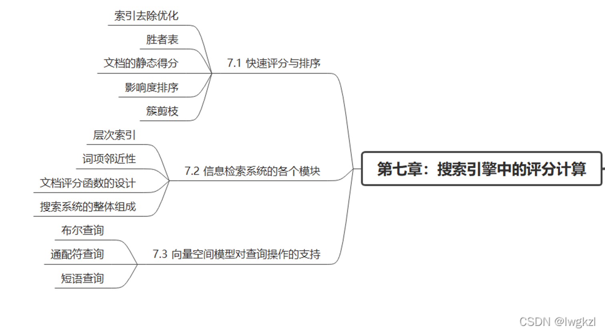
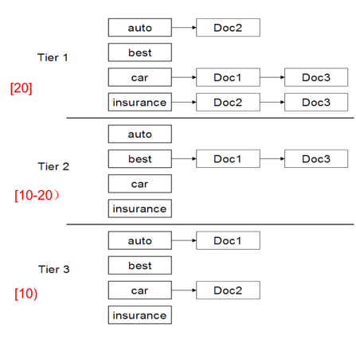
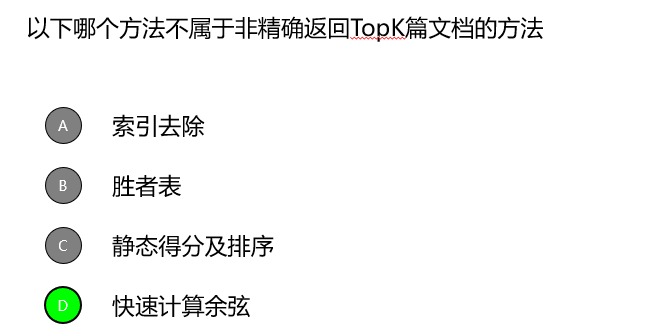
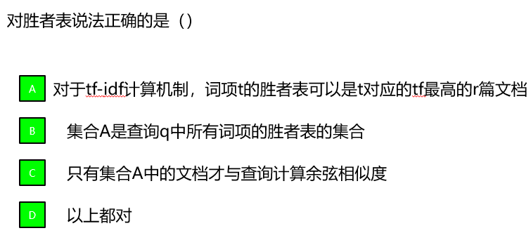
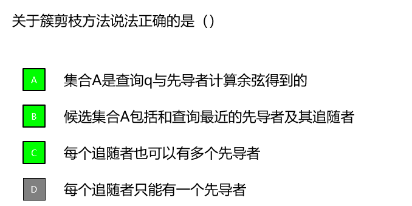
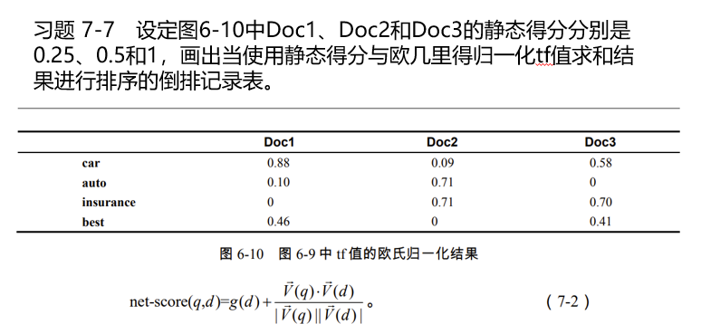
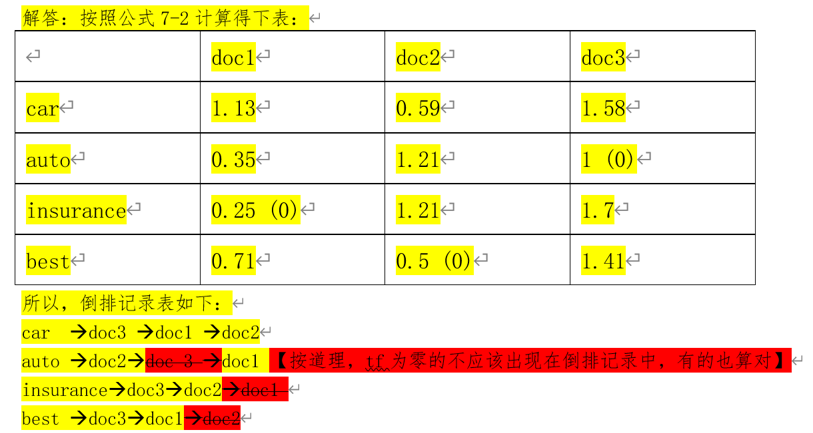

# **Chap7 完整搜索系统中的评分计算**

精确Topk,非精确Topk,搜索系统的组成



## **1.精确topK检索及其加速方法**

###### **0.一般的余弦相似度计算**

对每个文档和查询计算余弦相似度,然后对分数从高往低排序,选出前k个结果

###### **1.优化的余弦相似度计算(加快单次计算)**

**主要思想:对于相同的查询 和 不同的文档,查询的归一化系数都是相同的(不重要所以不算)**
$$
\cos(\vec{q}, \vec{d}) = \frac{\sum_{i=1}^{|V|} q_i d_i}{\sqrt{\sum_{i=1}^{|V|} q_i^2} \sqrt{\sum_{i=1}^{|V|} d_i^2}}
\Rightarrow
\frac{\sum_{i=1}^{|V|} q_i d_i}{ \sqrt{\sum_{i=1}^{|V|} d_i^2}}
$$

###### **2.优化的余弦相似度计算(不排序直接选出Top k篇)**

**主要思想:使用==堆排序==的时候根节点永远都更大,可以直接返回对应的最大值**

构建堆:需要2N次操作

选择出Top k个结果:每个结果需要 2logN 次操作

###### **3.优化的余弦相似度计算(不计算全部N篇文档的得分)**

**主要思想:提高返回质量引入新的得分指标,因为sim只会在(0,1),如果g(d)差值远大于1可以不算**
$$
net-score(q, d) = g(d) + cos(q, d)
$$

>   其中g(d)是质量权重,和用户的需求相关
>
>   (所以用户的需求如果远高于sim的时候就可以减少计算)

## **2.非精确Topk检索**

(这里的非精确:查询部分而不是全部+查询符合要求而不仅是sim)

###### **0.非精确Topk检索查询**

引入非精确的因素是在满足用户需求的前提下,显著降低输出前k篇文章所需的计算复杂度

**使用一个子文档集合A,n(k)<n(A)<<n(N),利用A中的Top K结果代替整个文档集的结果**

###### **1.索引去除查询(直接选取有效文档,部分查询)** 

**主要思想:文档集中 应该至少包含一个 查询中的词项 否则算了也没用(减少文档个数)**

>   进一步思想:只考虑计算idf值超过某个阈值 的文档(避免停用词过多->减少文档个数)
>
>   进一步思想:只考虑计算存在多个查询词项 的文档(-->减少文档个数)

###### **2.胜者表查询(直接选取有效文档,部分查询)**

**主要思想:强行规定几个文档集来计算**

>   胜者表的选取标准:词项-文档集的倒排记录的前n个doc/tf-idf==(截断)==
>
>   
>
>   ```
>   词项：Antony
>     倒排列表（按权重降序排列）：
>       (docID: 3, weight: 0.8)
>       (docID: 4, weight: 0.75)
>       (docID: 8, weight: 0.7)
>       (docID: 16, weight: 0.6)
>       (docID: 32, weight: 0.55)
>       ...
>     胜者表（r=3）：
>       (docID: 3, weight: 0.8)
>       (docID: 4, weight: 0.75)
>       (docID: 8, weight: 0.7)
>   ```

###### **3.静态得分查询(查询符合需求的内容)**==(截断)==

1.net-score评分

>   和前面的精确Top-k思想相同,引入新的评价指标,保证结果的权威性和相关性
>   $$
>   net-score(q, d) =\begin{cases}
>   g(d) + cos(q, d) 
>   \\
>   \\
>   w_1g(d) + w_2cos(q, d)
>   \end{cases}
>   $$
>   **流程:权威性优先所以先按照g(d)权重进行排序->合并->计算sim**

2.全局胜者表

>   和前面的胜者表思路相同,但是胜者表的建立思路不仅是tf-idf,而是g(d)+tf-idf
>
>   选出计算结果最大的r篇文档,进行对应的保存
>
>   查询:系统会获取q中所有词项的全局胜者表(取并集)得到新的文档集A,进行q和A的sim

###### **4.影响度排序查询(直接查询有效文档,部分查询)**

**主要思想:建立带有tf权重排序的词项-文档倒排索引**

1.(查询方式)提前结束

>   对某个 查询词项->倒排记录表 从前往后搜索
>
>   停止条件:扫描了数量达到了r篇/当前记录的tf值已经低于某个阈值

2.(查询方式)idf贡献度标准

>   处理idf较高的 查询词项 -> 直到idf小于一个阈值

###### **5.簇剪枝方法查询**

(计算少数代表性文档的相似度，然后将其所在的簇作为候选集)

**主要思想:对查询q中$\sqrt{N}$个先导者的sim得到最近的先导者L,然后对A中的文档计算sim**

>   也就是将查询的多个向量整合为1个合并向量,减少n次计算

###### **6.参数化索引以及域索引查询**

(符合用户查询的方法)

不直接查找对应元数据文本,而是查找对应的域

>   标题中出现 merchant、作者中出现 william且正文中出现 gentle rain 的文档
>
>   文档的标题域 merchant->作者域 william->正文域 gentle rain
>
>   <font color=red>要实现这样的查询，就需要为每个域（标题、作者、正文）建立独立的倒排索引。</font>

## **3.信息检索系统的各个模块**


**1.层次索引**

(<font color=red>倒排记录表按照重要性降序转化成层次索引</font>)

>从上到下为重要和次重要,如果返回的个数少于K个,则在下一层继续找直到满k个
>
>

**2.词项临近性**

>   令文档 d中包含所有查询词项的最小窗口大小为ω,查询的相邻词项的间隔不能太大 

**3.文档评分函数的设计**

>有余弦相似度、静态得分、近邻性等。

**4.搜索系统的整体组成**

## **4.向量空间模型对查询操作的支持**

1.布尔查询: `“苹果” AND “手机”` 

2.通配符查询:`comput*` 可以匹配 `computer`, `computing`, `computation`

3.短语查询:`“人工智能”` （要求“人工”和“智能”紧密相连，并且顺序固定,窗口ω）

```
布尔查询：向量空间模型与布尔查询融合很困难。向量空间查询的处理基本上是证据累加（evidence accumulation）的方式，即多个查询词项的出现会增加文档的得分；而布尔查询需要用于指定一个表达式，通过词项出现与不出现的组合来选择最终文档。

通配符查询：如果搜索引擎允许用户在自由文本查询中使用通配符，可以把查询中的通配符解释成向量空间模型中的一系列查询词项，然后将所有查询词项加入到查询向量中。

短语查询：向量空间模型难以处理短语查询。首先，词项的次序信息在文档转换成向量的过程中被丢失。其次，即使将二元词也看出词项，不同轴的权重也不是互相独立的。

```

## **5.题目**



>   属于精确返回方式







