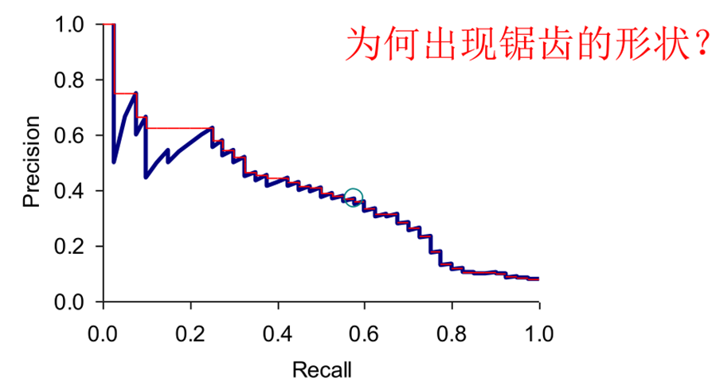
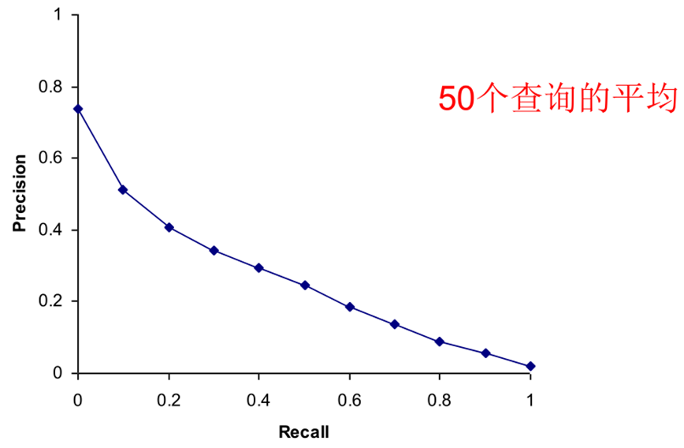

# **Chap8 信息检索的评价**

检索系统的评价概述,无序检索结果的评价,有序检索的评价,为IR系统构建测试集,检索结果的展示

## **1.信息检索系统的评价**

主要的衡量标准是:用户的满意度->搜索结果的相关度

**采用常规的方式来度量信息检索的效果,需要一个测试,测试所需的信息包含**

>   一个文档集:用于评测的评测文档集合
>
>   评测查询集合:一组信息需求集合
>
>   一组相关性判定结果:预先设定好的相关性判断结果

## **2.无序检索结果的评价**

###### **1.正确率和召回率**

对于给定的查询.IR系统返回一系列文档集合,其中文档之间并不考虑先后顺序

==IR中最常用的指标是正确率和召回率==

|               | Relevant       | Nonrelevant    |
| ------------- | -------------- | -------------- |
| Retrieved     | True positive  | False positive |
| Not Retrieved | False negative | True negative  |

>   Eg:本应该有100篇相关文档，某个系统返回200篇文档，其中80篇是真正相关的文档
>
>   Recall = 80/100 =0.8;Precision = 80/200 =0.4
>
>   (返回的用户需要的内容较多,但是和查询相比不够准确)

**以正确率为指标:web检索**

**以召回率为指标:专业情报分析**

###### **2.正确率和召回率的问题**

1.召回率难以计算

>   (解决方法:Pooling)
>
>   ->Pooloing,让多个不同的信息检索系统（或同一系统的不同变体）对同一个查询集进行检索
>
>   ->将每个系统返回的排名前K（例如K=10或K=100）的文档收集起来，形成一个“池”（pool）
>
>   ->人工专家对这个“池”中的所有文档进行相关性判定。

2.正确率和召回率的片面性

>(解决方法:融合指标)
>
>F1分数(召回率和准确率的调和平均值)
>$$
>F_\beta = (1+\beta^2)\frac{PR}{(P\beta^2)+R}\Rightarrow F1 = \frac{2PR}{P+R}\quad(\beta=1or\frac{1}{2})
>$$
>
>>当β=1时，F1分数，表示准确率和召回率同等重要。
>>
>>当β>1时，更侧重召回率（例如，在信息检索中，有时宁可多找一点，也不愿意漏掉）。
>>
>>当β<1时，更侧重准确率（例如，在问答系统中，答案必须准确）。
>
>

3.两个指标都基于无序集合进行计算

>   准确率和召回率计算默认把系统返回的所有文档看作一个无序的集合，不关心文档出现的顺序
>
>   (解决方法:考虑排名的指标)
>
>   P@K (Precision at K)：只计算返回结果中前K个文档的准确率。
>
>   >   例如，P@10 表示前10个结果中的准确率。这直接反映了用户最关心的部分。
>
>   MAP (Mean Average Precision)：平均准确率的平均值。
>
>   >   它计算每个查询的平均准确率，然后对所有查询的平均准确率取平均
>   >
>   >   (计算平均准确率的时候会考虑相关文档在列表中的位置，越靠前贡献越大)
>
>   NDCG (Normalized Discounted Cumulative Gain)：归一化折损累计增益。
>
>   >   这是一个更复杂的指标，它不仅考虑了相关性，还考虑了相关性的等级（例如，高度相关、中度相关）以及文档在列表中的位置（位置越靠后，其相关性的“增益”会被“折损”得越多）。NDCG能够很好地反映用户体验。

## **3.有序检索结果的评价**

**P-R曲线评价**

P/R/F都是基于集合的评价方式,如果搜索系统输出为有序的检索需要进一步拓展:

对于一个特定检索词的有序检索结果

>   系统可能返回任意数量的结果
>
>   考虑Top k返回的情形
>
>   每个k的取值对应一个R和P

>   Eg:Rq={d3,d5,d9,d25,d39,d44,d56,d71,d89,d123}->10篇
>
>   | 1.d123 | 6.d9   | 11.d38                       |
>   | ----------------------------- | :---------------------------- | :--------------------------- |
>   | 2.d84                         | 7.d511                        | 12.d48                       |
>   | 3.d56  | 8.d129                        | 13.d250                      |
>   | 4.d6                          | 9.d187                        | 14.d113                      |
>   | 5.d8                          | 10.d25 | 15.d3 |
>
>   1.d123 ->$R=\frac{1}{10},P = \frac{1}{1} $
>
>   3.d56  ->$R=\frac{2}{10},P=\frac{2}{3} $
>
>   6.d9   ->$R=\frac{3}{10},P=\frac{3}{6}$
>
>   10.d25 ->$R=\frac{4}{10},P=\frac{4}{10} $
>
>   16.d3  ->$R=\frac{5}{10},P=\frac{5}{16} $
>
>   
>
>   >当系统返回的第 (K+1) 篇文档是**不相关**的，那么召回率不变,准确率下降
>   >
>   >当系统返回的第 (K+1) 篇文档是**相关**的，那么召回率和准确率都可能上升。

**插值正确率法**

>   **取后序更高召回率的最高准确率作为当前点的准确率(取下一个锯齿的尖尖)**

###### **2.11点插值正确率**

主要思想:衡量前K个结果的准确率

操作:

>   对于每个查询，计算其在11个固定的召回率水平（0.0, 0.1, ..., 1.0）上的**插值正确率**
>
>   对于测试集中的每个信息需求（查询），计算它在这些固定召回率水平上的插值正确率。
>
>   最后，对于每个召回率水平，将所有查询在该点的插值正确率进行**算术平均**。
>
>   

###### **3.平均正确率(AP)**

**对不同召回率点上的正确率进行平均**

未插值的 AP:是在每篇相关文档**所在位置上**求正确率然后平均。

>   ==(如果相关文档出现在更靠前的位置，对AP的贡献更大)==
>
>   Eg:6个相关结果，系统排序返回了5篇相关文档(第1，第2，第5，第10，第20位)
>   $$
>   AP=(1/1+2/2+3/5+4/10+5/20+0)/6
>   $$

插值的 AP:在**每个召回率水平上计算**此时的插值正确率，然后求平均正确率

>   ==(倾向那些快速返回结果的系统，没有考虑召回率)==
>
>   Eg:6个相关结果，系统排序返回了5篇相关文档(第1，第2，第5，第10，第20位)
>   $$
>   AP=(1/1+2/2+3/5+4/10+5/20)/5
>   $$

###### **4.平均正确率均值 (Mean Average Precision, MAP)**

( 是AP在所有查询上的平均值。)

对**测试集**的每一个查询计算其平均正确率,所有的AP加起来除以查询总数
$$
MAP(Q)= \frac{1}{|Q|}\sum^{|Q|}_{j=1}\frac{1}{m_j}\sum^{m_j}_{k=1}Precision(R_{jk})
$$

>MAP是信息检索领域中**最常用和最重要的单一指标**之一。
>
>它能够全面地衡量一个系统在多个查询上的平均表现，既考虑了准确率和召回率，也考虑了相关文档的排名顺序。
>
>MAP值越高，系统性能越好。

###### **5.R正确率 (R-Precision)**

(检索结果中，在所有相关文档总数位置上的正确率。)

>   **查询的相关文档总数为 ∣Rel∣，系统返回的结果中前 ∣Rel∣ 个文档中有 r 个是相关文档**
>
>   **则 R 正确率是 r/∣Rel∣**

>一个完美的系统，其 R-Precision = 1(n个相关文档在前n次全被返回出来了)

###### **6.GMAP (Geometric Mean Average Precision)**

前提:MAP是算术平均，它可能会被少数几个极好或极差的查询表现所影响

**GMAP定义： 是所有查询的AP值的几何平均。**
$$
GAMP = \sqrt[n]{\prod^n_{i=1}AP_i} = e^{\frac{1}{n}\sum^{n}_{i=1}ln AP_I}
$$

>**几何平均对极端值（尤其是很小的AP值）比算术平均更敏感。**
>
>这意味着一个系统如果在某个查询上表现极差（AP值接近0），GMAP会受到更大的影响，从而更能体现出系统在“难查询”上的不足。

###### **7.NDCG：(Normalized Discounted Cumulative Gain，归一化折损累积增益)**

每个文档不仅仅只有相关和不相关两种情况，而是有相关度级别，比如 0,1,2,3

**相关度级别越高的结果越多越好,相关度级别越高的结果越靠前越好**
$$
NDCG(Q,K) = \frac{1}{|Q|}\sum^{|Q|}_{j=1}Z_{kj}\sum^{k}_{m=1}\frac{2^{R(j,m)}-1}{log_2(1+m)}
$$

>   R（j,d）是文档d对查询j的**相关性得分**
>
>   Zkj 是归一化因子
>
>   m是返回文档的位置

>**完美系统NDCG的值为1**

## **4.为IR构建测试集**

用于测试的查询特特点

>   必须和测试文档集合有密切关系
>
>   最好由领域的专家设计
>
>   随机的查询并不好

###### **1.Kappa指标**

**度量不同判定人之间的一致性==Kappa指标==**
$$
Kappa = \frac{P(A)-P(E)}{1-P(E)}
$$

>   P(A):实际观察到的一致性判断比率
>
>   >   P(A) = N(All-Yes)/N-All
>
>   P(E):随机情况下所期望的一致性判断比率
>
>   >   P(E) = P(nonrelevant)^2^+P(relevant)^2^
>
>   Kappa=0相当于没用的判断,Kappa=1相当于完美判断,K很小需要重新设计判断方法

>   Eg:
>
>   

###### **2.大型搜索的评价**

**1.不同的指标衡量**

搜索引擎常使用top k的正确率来度量 或者 结果所在位置的指标 进行度量

或者 考虑点击历史的整体情况 会相当可靠

**2.更新+小部分测试**

很多用户使用老系统，将一小部分(如 1%)流量被随机导向包含了创新点的新系统

**3.摘要**

对与查询相关的检索结果排序后，我们可以展现一个列表(**标题+摘要**)类似chrome

静态摘要：一个文档的摘要是固定的，与查询无关

>   

动态摘要：与查询相关。摘要说明了为什么这篇文档和查询相关

>   

## **题目**

4、某搜索引擎对查询“人工智能”返回10个结果，经人工标注发现：排名1、3、5的文档相关， 总相关文档数为20

计算：

Precision@5 =  3/5

Recall@5 =  3/20 

