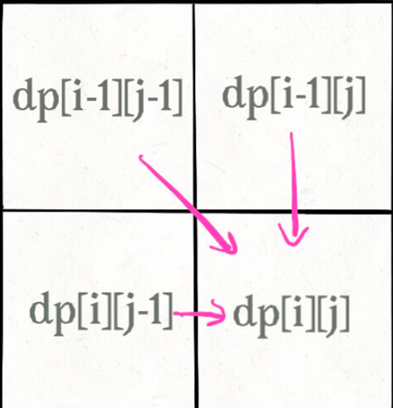
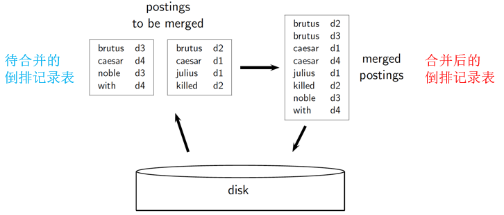
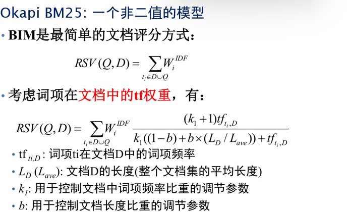

#  **Final Revision**

<font color=Deeppink>Deeppink表示很重要</font>

选择题 10

判断题 10

名词解释 24

简答题 20

计算  36

****

模型:文档+查询+相关度+评价+(公式)

## <font color=red>**Chap1 布尔检索**</font>

#### **1.1 信息检索的概念**

**信息检索(IR):从<font color=red>大规模非结构化数据的集合中</font>找出<font color=red>满足用户需求</font>的资料**

>   **非结构化数据:没有组织的自由格式数据,无法直接使用,需要进行数据转换使用**
>
>   >   文字/网页内容/原始信号/音效
>
>   **结构化数据:具有清晰和明显语义的结构**
>
>   >   关系数据库
>
>   **半结构化数据:结构没有规则且变化迅速的结构**
>
>   >   具有格式标记的网页
>
>   <font color=red>**注意:大部分数据严格意义上不属于结构化数据(可以进一步细化)**</font>

**信息检索模型:描述信息检索中的==文档,查询和它们之间的关系==的数学模型**

>   **==基于文本内容的检索模型==**
>
>   第1章:布尔检索及倒排索引
>
>   第6章:向量模型及检索系统
>
>   第11章:概率模型
>
>   第12章:基于语言建模的检索模型
>
>   **==与内容无关的其他检索模型==**
>
>   第13章:文本分类(基于贝叶斯)

****

#### **1.2 构建倒排索引**

(倒排索引的概念/词项词典/倒排记录和倒排记录表)

###### **1.基本概念**

**词项词典:所有词项的集合**

**倒排索引：信息检索系统中 <font color=red>将词项反向映射到文档</font> 的索引结构**

**倒排记录(posting):     <font color=red>"一个词项,在一个文档" 中的信息</font>**

**倒排记录表(posting list):<font color=red>一个词项,在所有文档" 中的信息</font></font>**

**倒排索引(posting index)：      <font color=red>所有词项的倒排记录表</font>**

###### **2.构建倒排记录表**

>**1.文档解析(Doc Parsing)**
>
>**2.词条化(Tokenization):**分词/去标点符号/数字和特殊字符处理
>
>**3.词条标准化(Token Normalization)**
>
>>   **a.大小写转换**
>>
>>   **b.词干还原:提取词干**     (Porter Stemmer法移除后缀-ing,-ed,-es)
>>
>>   **c.词形归并:提取词元**     (根据词语的实际意义进行还原)
>>
>>   **d.停用词移除:删除没有检索意义的词语(is/the/a)**

###### **3.建立倒排索引**

**<font  color=red>注意排序和去重操作</font>**

>**a.建立词项与文档ID对应的序列**
>
>>   **出现的文档 赋一个连续的整数编号(DocID)**
>
>==**b.排序**==
>
>>   **<font color=red>排序依据:先按照词项的alphabet进行排序,再按照docID进行排序</font>**
>
>**c.建立索引(词典和倒排表的建立)**
>
>>   ==去重==:同文章的多次出现的词被合并
>>
>>   统计:统计docID的个数,写在词典项
>>
>>   排序:按照docID从小到大排序
>>
>>   
>
>**<font color=red>倒排记录表不存在重复元素,从小到大</font>**
>
>**<font color=red>词项必须排序!!!!!!,文档ID必须排序!!!</font>**
>
>**<font color=red>必须转义两次:string-int-string</font>**

>   **收集文档->词条化->语言学处理->建立倒排索引(注意特殊处理:将词项和文档ID对应->去重->==排序==)**

#### **1.3 布尔检索模型的概念**

>   **模型的定义:文档如何表示?查询如何表示?词项文档如何表示**
>
>   ->文档的表示方式:所有词项的集合(词汇表)
>
>   ->查询的表示方式:布尔表达式
>
>   ->词项文档表示方式==**词项文档关联矩阵**==

#### **1.4 基于布尔查询倒排记录表的合并算法**

(上机作业)->**算法思想**:朴素双指针算法(看1.3习题)主要是取集合的过程

#### **<font color=Deeppink>课后作业 1-1,1-2,1-3</font>**

**1.1 创建倒排序列**

**Eg1:画出下列文档集所对应的倒排序列**

```txt
doc1: new home sales top forecasts
doc2: home sales rise in july
doc3: increase in home sales in july
doc4: july new home sales rise
```

>   **解:(字母序+数字序)<font color=red>注意这里的term是alphabet排好序的,后面的docID也是</font>**
>
>   ```
>   forecasts  ->  1
>   home       ->  1, 2, 3, 4
>   in         ->  2, 3
>   increase   ->  3
>   july       ->  2, 3, 4
>   new        ->  1, 4
>   rise       ->  2, 4
>   sales      ->  1, 2, 3, 4
>   top        ->  1
>   ```

****

**1.2 创建 ==词项-文档矩阵== 和 倒排索引**

**Eg2:考虑文档,画出对应的词项-文档矩阵+画出对应的倒排索引**

```\
doc1 breakthough drug for schizophrenia
doc2 new schizophrenia drug
doc3 new approach for treatment of schizophrenia
doc4 new hopes for schizophrenia patients
```

>**词项文档关联矩阵:0-1矩阵**
>
>
>
>**倒排索引:**
>
>```
>approach       -> 3
>breakthrough   -> 1
>drug           -> 1, 2
>for            -> 1, 3, 4
>hopes          -> 4
>new            -> 2, 3, 4
>of             -> 3
>patients       -> 4
>schizophrenia  -> 1, 2, 3, 4
>treatment      -> 3
>```

****

**1.3:对1.2的文档集进行查询,返回的结果是?**

**`a.schizophrenia AND drug`**

**`b.for AND NOT(drug OR approch)`**

**AND：当且仅当两个位都为1时，结果才为1。否则为0。**

**OR：当两个位中至少有一个为1时，结果才为1。否则为0。**

>   **a:返回的结果是doc1,doc2(1100)**
>
>   >   **schizophrenia:1111**
>   >
>   >   **drug:1100**
>   >
>   >   <font color=red>1111+1100=1100</font>
>
>   **b.返回的结果是doc4(0001)**
>
>   >   **drug:1100**
>   >
>   >   **approach:0010**
>   >
>   >   **for:1011**
>   >
>   >   <font color=red>1011 AND NOT(1110 OR 0010)</font>
>   >
>   >   <font color=red>1101 AND NOT 1110</font>
>   >
>   >   <font color=red>1101 AND 0001</font>
>   >
>   >   <font color=red>0001</font>

## **Chap2 词项词典及倒排记录表**

**<font color=red>(这个Chap主要是构建词项词典的过程,以及合并算法)</font>**

>   ==**构建词项词典的过程:文档解析->词条化->停用词去除->归一化**==
>
>   **合并算法:跳表合并+带有位置信息的合并**

#### **2.1 构建词项词典(文档解析)**

>   1.字符序列的解码(ASCII/UTF等编码格式,以及语言的解析)
>
>   2.定义文档单位(颗粒度->章节段落句子)
>
>   >   **索引粒度过大,段落更长:找到更多不相关内容(可能噪声)<font color=red>(正确率高召回率低)</font>**
>   >
>   >   **索引粒度过小,段落更短:错过重要的段落(索引长度变短)<font color=red>(正确率低召回率高)</font>**

****

#### **<font color=Deeppink>2.2 构建词项词典(词项集合确定)</font>**

**词项词典的内容不如倒排索引:都有词项和词项ID,但是倒排索引有额外的位置信息/词项频率**

###### **1.词条化**

**==词条化(概念+词条类+词项的概念/表示)->词条类和词项的区别==**

>   1.**<font color=red>词条化:定义好文档单位以后,将原始字符序列分割成词条token的过程</font>**
>
>   >**Input:"I love cats."**
>   >
>   >**Output: ['I','love','cats']**
>
>   2.词条(Tokens): 在文档中出现的字符序列的一个实例。
>
>   >“I”、“love”、“cats”
>
>   3.词条类(Type)： 相同词条构成的集合
>
>   >   但是比如The和the会被分成两个集合,所以还要处理
>
>   (语言学处理/归一化处理)
>
>   4.词项(Terms):  可能经过归一化后收录的词条类包含在信息检索系统的词典中
>
>   ****
>
>   (文本词条化生成一系列词条->词条归一化取集合构成词条类->词条类处理后词项)
>
>   **词条类和词项的关系:**
>
>   >   其中每个等价类对应一个词项,这些**词项最终用于建立文档**的索引
>   >
>   >   词条类经过归一化处理组成了词项

###### **2.构建词项词典(去除停用词)**

**==去除停用词(什么是停用词[df排序/30-定律],生成停用词的方法)==**

>   1.停用词:在文档和用户需求进行匹配的时候没有价值,需要从词汇表中删除
>
>   2.停用词停用的依据:30定理(词项的文档集频率df)
>
>   >   **<font color=red>具体内容:出现频率最高的30个词在书面文本中占了30%的出现比例</font>**
>   >
>   >   并且作为停用词删除后不太影响最后的结果
>
>   3.生成停用词的方法:人工筛选df高的频率/使用现成的停用词表:RVC1

###### **3.构建词项词典(词项归一化)**

**==词项归一化(概念,归一化的方法[如何建立等价类],如何建立等价类->习题2.2)==**

>   1.词条归一化:将看起来不完全一致的多个**词条**归纳成一个等价类
>
>   >   **方法:隐式建立等价类[如何建立]/手工建立同义词表**
>   >
>   >   (USA U.S.A.->USA)
>   >
>   >   (anti-discrimination antidiscrimination->antidiscrimination)
>
>   2.词项归一化:需要将文档和查询中的**词条**归一化成一致的形式。
>
>   >**方法:重音符号,同义词,近义词,词形变体(单复数,动词时态),时态语态**

###### **4.构建词项词典(词干还原和词形归并)**

**==词干还原与词形归并(概念/Porter算法[最长匹配算法])==<font color=red>会给你一个词项操作</font>**

>   词干还原:(去除前后缀)粗略的去除单词两端词缀的启发式过程
>
>   >   (automate,automatic,automation -> automat)
>
>   >   **==Poter算法:习题2-3[最长匹配算法]==**
>   >
>   >   主要是得到没有歧义的单词
>   >
>   >   书上提到的是复数变单数:去S,IES->I,**SS->SS**,SSES->SS
>   >
>   >   (对于SS结尾的先不变单数,因为有些词本身就有SS)
>
>   词形归并:(合并得到词元)利用词汇表和词形分析去除词缀,转化为基本形式词元

****

#### **2.3 跳表合并算法**

>   随时跳/按照位置跳

****

#### **2.4 含位置信息的倒排记录表**

**这里主要涉及了短语(多个词项)查询的解决方法**

>   背景:用户输入了一系列词,如何对结果进行合并?
>
>   **==1.二元词索引查询(查询的变化)==**
>
>   >比如"词项A 词项B 词项C 词项D"->(AB)AND(BC)AND(CD)
>   >
>   >如此可以增加单个短语到n维
>
>   **==2.位置信息索引(倒排记录的变化)==**
>
>   >   term:DocID:<pos1,pos2,...,posx>
>   >
>   >   主要用于/k的k词临近搜索
>   >
>   >   **返回的是DocID**
>
>   **==3.混合索引机制(策略的变化)==**
>
>   >**由于基于位置的倒排记录表对于长短语的合并效率低(太长了)**
>   >
>   >所以将二元词索引和位置信息索引的方法进行混合

#### <font color=Deeppink>课后作业 2-1,2-2,2-3,2-4,2-6,2-7</font>

**2-1.判断以下说法的正确性**

>   词干操作后
>
>   a.布尔检索系统中,词干还原从不降低正确率(F)->过度归并
>
>   b.布尔检索系统中,词干还原从不降低召回率(T)
>
>   c.词干还原会增大词项词典的大小(F)->一般减少
>
>   d.词干还原应该在构建索引的时候调用,而不应在查询处理的时候使用(F)
>
>   >   **<font color=red>词干还原和词形归并 在构建 在查询 中需要同步使用</font>**

**2-2 归一化(去符号都换成小写)**

>   a.'Cos     ->  cos
>
>   b.Shi'ite  ->  shiite 
>
>   c.cont'd   ->  contd
>
>   d.Hawai'i  ->  hawaii
>
>   e.O'Rourke ->  orourke

**2-3 词干还原**

>   a.abandon/abandonment -> abandon
>
>   b.absorbency/absorbent -> absorb
>
>   c.maketing/markets    -> <font color=red>意思不同不应该合并</font>
>
>   d.university/universe -> <font color=red>意思不同不应该合并</font>
>
>   e.volume/volumes      -> volume

**2-4 词干还原(Poter算法)(去S和es)**

>   circus canaries boss  -> circus canari boss(和意义无关)

**2-6 跳表比较次数<font color=red>(红色表示跳表指针)</font>**

>   **word1:[<font color=red>4</font>,6,10,12,<font color=red>14</font>,16,18,20,<font color=red>22</font>,32,47,81,<font color=red>120</font>,122,157,180]**
>
>   **word2:[47]**
>
>   >   **a.使用标准倒排记录表**
>   >
>   >   比较11次(4,6,10,12,14,16,18,20,22,32,47)
>   >
>   >   **b.使用跳表$\sqrt{n}=4 $**
>   >
>   >   比较6次(4,14,22,120,22,32,47)

**2-7 跳表合并的实际跳转次数(题目规定的跳表)<font color=red>(红色表示跳表指针)</font>**

list1:<font color=red>3</font> 5 9 15 <font color=red>24</font> 39 60 68 <font color=red>75</font> 81 84 89 <font color=red>92</font> 96 97 100 <font color=red>115</font>

list2:3 5 89 95 97 99 100 101

表示跳转成功多少次(而不是比较的次数):只有1次,24到75

合并时比较的次数18次

|  1   |       3        | 3        |
| :--: | :------------: | -------- |
|  2   |       5        | 5        |
|  3   |       9        | 89       |
|  4   |       15       | 89       |
|  5   |       24       | 89       |
|  6   | 跳表算一次比较 | 89       |
|  7   |       75       | 89       |
|  8   |       81       | 89       |
|  9   |       84       | 89       |
|  10  |       89       | 89       |
|  11  |       92       | 95       |
|  12  |       96       | 95       |
|  13  |       96       | 97       |
|  14  |       97       | 97       |
|  15  |      100       | 99       |
|  16  |      100       | 100      |
|  17  |      115       | 101      |
|  18  |      115       | 直接加入 |

都不使用跳表19次

## **Chap3 词典和容错式检索**

#### **3.1 词典搜索**

**==词典搜索的结构(1.哈希表 2.搜索树(二叉树) 3.B树)==**

###### **1.哈希表 -> 字典查询**

**一种根据Key来进行访问的数据结构(其中Key通过哈希函数直接赋值)**

>优点：在哈希表的定位速度快于树中的定位速度
>
>缺点：没办法处理微小变形/不支持前缀搜索/哈希冲突
>

###### **2.二叉树 -> 最基本且性能一般的查询**

**一个根结点和两棵互不相交的子树组成的结构**

>满二叉树:所有分支结点都存在左子树和右子树，并且所有叶子都在同一层上
>
>完全二叉树:节点的编号和二叉树的对应编号位置完全相同

###### **3.B树(平衡的多分树) -> 通配符查询**

**<font color=red>(B树中一个节点的子节点数目的==最大值==，用m表示,就是m阶)</font>**

>**每个节点最多只有m个子节点。**
>
>**每个非叶子节点（除了根）具有至少⌈m/2⌉子节点。**

****

#### **<font color=Deeppink>3.2 通配符查询</font>**

###### **1.一般的通配符查询 (轮排索引)**

==**轮排索引表的具体内容3-2作业**==

>   **[通配符使用场景/首通配符/尾通配符](.\(Obligatory)chap3(Tolerant_retrival)词典和容错式检索.md#2.通配符查询)的部分直接跳过(点击查看)**

背景:使用B-树返回前缀词项子集W,返回后缀词项子集R,求$W \bigcap R $开销大

所以产生了以下几种一般通配符查询

###### **2.一般通配符查询:轮排索引(permuterm)**

**a.在字符集最前面引入一个新的符号$，用于标识词项结束。**

**b.构建一个轮排索引，对扩展词项的每个结果都构造一个指针**

>   （1）将每个通配查询旋转，**使*出现在末尾**(反转查询词项)
>
>   （2）将每个旋转后的结果存放在词典中，即B-树中

>   Eg:
>
>   对于 X, 查询 X\$      (无*)*
>
>   对于 X\*, 查询 \$X*    (X*->$X\*)
>
>   对于 \*X, 查询 X$\*    (\*X->\$\*X->X\$\*)
>
>   对于 X\*Y, 查询 Y$X*  (X*Y->\$X\*Y->X\*Y\$->Y\$X\*)

>   **对于词项`hello`:`hello\$`,` ello\$h`, `llo\$he`, `lo\$hel`, `o\$hell` `\$hello`**每个结果都有一个指针
>
>   
>
>   **假定通配查询为 hel*o, 那么相当于要查询o$hel\*(上面的规则)**
>
>   **然后根据一般的通配符查询得到最后结果**
>
>   **<font color=red>坏处是:相对于通常的B-树，轮排索引的空间要大4倍以上</font>**

###### **2.支持通配符查询的 k-gram 索引**

**(==3-4作业==)**

**K-gram索引思想**

>   **k个字符组成的序列，用一个特殊字符$表示单词开始结束**
>
>   比如castle所有的3-gram包括\$ca、cas、ast、stl、tle、le$。

**K-gram索引形式:N-gram词典+倒排记录**

>

**K-gram索引过程**

>   (1)给出查询:比如给出查询mon*
>
>   (2)执行k元布尔查询:(2-gram):$m AND mo AND on AND N\$
>
>   **==(3)后过滤处理伪正例==**:做简单的字符串匹配操作即可(比如moon和MOON)
>
>   **<font color=red>k-gram索引的空间消耗小,但是需要额外进行后过滤</font>**
>
>   (可见N$会有很大的麻烦)

****

#### **<font color=Deeppink>3.3 拼写校正</font>**

###### ==**1.拼写校正的实现**==

>**1.(距离最小原则)对于拼写错误的查询,在正确拼写中,选择距离最近的(距离和邻近度)**
>
>**2.(常见匹配原则)当两个或者多个正确拼写 查询临近度相等时,选择更常见的那个**

###### ==**2.拼写校正的方法**==

>   **1.词独立法:只检查每个单词本身的拼写错误(编辑距离,K-gram重合度)**
>
>   **2.上下文敏感法:纠错时考虑周围单词**

###### **3.拼写校正方法1:编辑距离(Levenshtein距离)(词独立法)**

>   **定义:指两个字串之间，由一个转成另一个所需的==最少编辑操作次数==**
>
>   a.**定义状态edit(i,j)**
>
>   >   表示第一个字符串长度为i的字串到第二个长度为j的子串的编辑距离
>
>   **b.动态规划公式**
>
>   >   **a.`第一个字符串[i-1] == 第二个字符串[j-1]`：** 
>   >
>   >   dp\[i][j] = dp\[i-1][j-1]
>   >
>   >   **b.`第一个字符串[i-1] != 第二个字符串[j-1]`：**
>   >
>   >    dp\[i][j] = min{}
>   >
>   >   >   **`dp[i-1][j] + 1,`  // 删除操作** 
>   >   >
>   >   >   **`dp[i][j-1] + 1,`  // 插入操作**
>   >   >
>   >   >   **`dp[i-1][j-1] + 1` // 替换操作** 
>   >
>   >   **边界条件:每个字字母对应它的index**

>   **1.初始化**
>
>   >   **第一行:将空字符串转换 "f", "fa", "fai", "fail", "faili", "failin", "failing" **
>   >
>   >   **第一列:将空字符串转换 "s", "sa", "sai", "sail", "sailn"**
>   >
>   >   **在表格中填充边界条件**
>
>   **2.矩阵补充(比较该矩阵的最小值)**
>
>   >   
>   >
>   >   **Eg:dp\[1][1]中's'和'f'不同:**
>   >
>   >   **min{dp\[0][0]+1,dp\[0][1]+1,dp\[1][0]+1} = min{2,2,1}=1**
>   >
>   >   (即在矩阵中取+1后的最小值)
>   >
>   >   **Eg:dp\[2][2]:'a'和'a'相同:代价等于dp\[i-1][j-1]=dp\[1][1]**
>

|      | 0            | f            | a            | i            | l            | i            | n            | g            |
| ---- | ------------ | ------------ | ------------ | ------------ | ------------ | ------------ | ------------ | ------------ |
| 0    | $\mathbb{0}$ | $\mathbb{1}$ | $\mathbb{2}$ | $\mathbb{3}$ | $\mathbb{4}$ | $\mathbb{5}$ | $\mathbb{6}$ | $\mathbb{7}$ |
| s    | $\mathbb{1}$ | 1            | 2            | 3            | 4            | 5            | 6            | 7            |
| a    | $\mathbb{2}$ | 2            | 1            | 2            | 3            | 4            | 5            | 6            |
| i    | $\mathbb{3}$ | 3            | 2            | 1            | 2            | 3            | 4            | 5            |
| l    | $\mathbb{4}$ | 4            | 3            | 2            | 1            | 2            | 3            | 4            |
| n    | $\mathbb{5}$ | 5            | 4            | 3            | 2            | 2            | 2            | 3            |

###### **4.拼写校正方法2:拼写校正中的k-gram 索引**

因为需要把**拼写错误的单词**和**词典所有的词项**进行比较,所以适用k-gram

**<font color=red>(当k=2,需要计算的长度为len(term)-1)</font>**

>   **使用k-gram索引返回与查询词q具有很多公共k-gram的词项**
>
>   **列举查询词项中的所有k-gram**

>   **a.初始化:采用2-gram索引, 错误拼写的单词为bord**
>
>   **b.使用gram方法进行划分:2-gram: bo, or, rd**
>
>   **c.列举查询词项的倒排索引**
>
>   
>
>   d.计算Jaccard系数:$\frac{|A\bigcap B|}{|A \bigcup B|} $(A是查询内容,B是对应的k-gram集合),超过阈值才保留
>
>   >   **$A$ = `{"bo", "or", "rd"}`**
>   >
>   >   **$B_i$:`{"border"= {"bo", "or", "rd", "de", "er"}}`**
>   >
>   >   **交集 $(A \bigcap B) $= `{"bo", "or", "rd"}`，大小为 3。**
>   >
>   >   **并集 $(A \bigcap B) $= `{"bo", "or", "rd", "de", "er"}`，大小为 5。**
>   >
>   >   **Jaccard 系数 = $\frac{3}{5} $ = 0.6。**

###### **5.拼写校正方法3:上下文敏感的拼写校正**

**主要思想:通过在线搜索的方式,查找最高结果命中数**

**Eg:**

>flew form munich: 
>
>flea ->flew, from -> form, munch ->munich
>
>**<font color=red>组合并返回所有可能,命中数最高的就是原本需要的查询</font>**
>
>搜索 “flea form munich”
>
>搜索 “flew from munich”
>
>搜索 “flew form munch”
>
>正确查询 “flew from munich” **会有最高的结果命中数**(例如返回数)

**存在的问题:基于命中数的算法效率不高，开销也会非常大**

**优化方式:从查询历史中搜索,而不是从文档库中搜索;比较查询被输入的次数；匹配查询校正历史**

#### **3.4 发音校正技术(了解)**

#### **<font color=Deeppink>3.5 作业 3-2.3-3.3-5,3-6,3-8,3-10</font>**

**3-2 写出mama生成的轮排索引条目**

>   mama$
>
>   ama$m
>
>   ma$ma
>
>   a$mam
>
>   $mama

**3-3 在一个通配符查询的轮排索引中,如果想查找s\*ng会查找哪些键**

>   (星号及以前内容后移加\$)ng\$s\*

**3-5 对fi\*mo\*er采用2-gram索引**

**==因为每个字段后面有结束符\*,带有结束符的都不要==**

>   **产生的布尔表达式: fi AND mo AND er**

**3-6 考虑通配符查询mon\*h,如果只使用2-gram的==与==进行搜索,那么给出举例错误的匹配**

>   **正确的2-gram是mo AND on **
>
>   **错误的2-gram是mo AND nh,所以比如moabcdenh是错误的**

**3-8 paris和Alice之间的编辑距离(==注意要先进行语言学处理==)**


**3-10 bord和图中每个包含2-gram or的词项之间的Jaccard系数**


首先写出包含2-gram or的所有词项:

{aboard, about, boardroom, border, lord, morbid, sordid, ardent}

然后写出 2-gram(bord) = {bo, or, rd}

然后对每个词项都写出和board对应的Jaccard系数

>   比如aboard和bord:
>
>   aboard$\bigcap$bord = {bo, rd}
>
>   aboard$\bigcup$bord = {ab, bo, oa, or, ar, rd}
>
>   $J(aboard,bord)= \frac{2}{6} = \frac{1}{3}$

>   比如about和bord:
>
>   about$\bigcap$bord = {bo}
>
>   about$\bigcup$bord = {ab, bo, or, ou, rd, ut}
>
>   $J(aboard,bord)= \frac{1}{6}$

## **Chap4 索引构建**

==(没有计算题,没有特殊的重点)==

#### **4.0 硬件(省略)**

#### **4.1 基于排序的索引构建算法**

**主要思想:在建立索引过程中,需要依次分析所有的文档**

#### **4.2 基于块的排序索引BSBI**

==基于块的排序索引(概念[看BSBI的具体步骤])==

###### **1.BSBI基本思想**

>   **1.对每个块都生成倒排记录,排序,写入硬盘中(中间存储)**
>
>   **2.然后将这些块合并成一个长的排序号的倒排记录**
>
>   

###### **2.BSBI具体步骤**

>   **1.分块:将文档集分割成大小相同的部分**
>
>   **2.排序:**
>
>   >   **->将文档解析为词项ID-文档ID**
>   >
>   >   **->堆满固定空间**
>   >
>   >   **->排序**
>   >
>   >   **->放入倒排记录表**
>
>   **3.储存:将中间的临时结果放到磁盘中**
>
>   **4.合并:将所有的中间文件合并成最终的索引**

###### **3.细节(合并过程)**

>   **1.全局词典:在合并的过程基本不占用内存,但是需要维护<词项,ID>词典**
>
>   **2.合并方式:同时打开读取所有块(n个)对应文件**
>
>   **<font color=red>存在n个读缓冲区,以及一个最终合并的写缓冲区(目的避免寻道时间长)</font>**

#### **4.3 内存式单遍扫描索引SPIMI**

==基于内存单遍扫描索引(概念[看SPMI])==

###### **SPIMI核心思想**

>   **1.为每个块单独生成一个词典,不需要维护全局的<词项,ID>词典**
>
>   **2.不进行排序,有新的<词项,ID>直接在后面添加**
>
>   **3.将单独的索引进行合并**

###### **BSBI和SPIMI的区别**

==区别:需要维护的词典个数==

**BSBI:一个全局的<词项,词项ID>字典记录,分块索引构建(仍然服从字典序)**

**SPIMI:多局部<词项,词项ID>字典记录,将局部索引两两合并,产生全局词典**

#### **4.4 分布式索引构建DI**

**1.DI的算法框架**

>**1.主控节点:利用主控节点指挥索引构建工作(默认主控节点是安全的)**
>
>**2.分解任务:将索引构建过程分解为==并行式任务==**
>
>>1.DI划分数据:将文档集分割成n个数据片(数据块)
>>
>>2.DI分析器:分配任务/生成序列/预处理/构建倒排记录
>>
>>3.DI索引器:收集倒排索引/排序
>
>**3.执行任务:主控计算机 给空间机器 分配任务**
>
>

**2.MapReduce**

>阶段A:索引构建
>
>阶段B:将基于词项划分的索引表 转化为 基于文档集划分的索引表
>
>
>
>
>
>

#### **4.5 动态索引构建**

==动态索引构建(性能最好的对数合并算法,也可以直接合并)+Oth索引(略)==

###### **1.动态索引构建的背景**

**目前考虑的构建算法都是静态的(==但是文档会不断加入,即动态的==)**

>**A.周期性对文档集从头开始进行索引重构(Collection)**
>
>==**B.即时合并(Immediate Merge)**==<-这里三种算法都是IM

###### **2.Immediate Merge(合并索引结果,主索引合并)**

<font color=red>**通过定期或在辅助索引满时将新文档的信息与主索引合并来保持最新状态。**</font>

**1.主要方法**

>   **主索引维护:在磁盘中维护一个大的索引(Main Index)**
>
>   **辅助索引维护:在内存中维护新文档信息存储在小的辅助索引中**
>
>   ==**合并:同时遍历两个索引将结果进行合并**==
>
>   (合并位置默认辅助索引,若满则主索引)
>
>   **删除文档并记录在无效位向量(Invalidation bit vector)**

**2.代价分析**

>   **在构建索引的代价为$ O(M\times k^2) $,查询时间只需要$|Q| $**
>
>   (M表示单位代价,k表示文件批数,Q表示query长度)

###### **4.Immediate Merge(不合并索引结果,辅助索引合并查询)**

<font color=red>**与第一种类似，但它不将辅助索引的内容合并到主索引中**</font>

**而是让查询同时在主索引和辅助索引上进行。**

**1.主要方法**

>   **主索引维护:在磁盘中维护一个大的索引(Main Index)**
>
>   **辅助索引维护:在内存中维护新文档信息存储在小的辅助索引中**
>
>   **删除文档并记录在无效位向量(Invalidation bit vector)**

**2.代价分析**

>   **在构建索引的代价为$ O(M\times k)$,查询时间需要$k\times |Q| $**
>
>   (M表示单位代价,k表示文件批数,Q表示query长度)

###### **5.Immediate Merge(对数合并)**

**<font color=red>通过维护一系列不同大小的索引段来优化合并操作</font>**

**主要思想:维护磁盘上若干个最大大小为$2^i\times M $的索引段**

**边界条件**

>   **条件1:每次合并后,只会得到大小为$k= 2^m\times M $大小的索引**
>
>   **条件2:不会有两个大小相同的索引段**

**主要过程**

>   **1.初始状态:磁盘上没有任何索引(I=0)**
>
>   **2.更新第一批文档**
>
>   >   **在内存中构建文档索引,得到$I_0 $,其大小为$M=2^0\times M $**
>   >
>   >   (条件判断:此时磁盘上只有一个大小为M的索引段$I_0 $,True)
>
>   **3.更新第二批文件**
>
>   >   **在内存中构建文档索引,得到$I_0 $,其大小为$M=2^0\times M $**
>   >
>   >   (条件判断:此时磁盘上只有两个大小为M的索引段$I_0 $,False)
>   >
>   >   **<font color=red>合并操作:merge($I_0,I_0$)为$I_1$,大小为$2^1\times M $  </font>**
>   >
>   >   (条件判断:此时磁盘上只有一个大小为2M的索引段$I_0 $,True)
>
>   **4.更新第三批文件**
>
>   >**在内存中构建文档索引,得到$I_0 $,其大小为$M=2^0\times M $**
>   >
>   >(条件判断:磁盘有一个大小为M的索引段$I_0 $,有一个大小为M的索引段$I_1 $,True)
>
>   **5.更新第四批文件**
>
>   >**在内存中构建文档索引,得到$I_0 $,其大小为$M=2^0\times M $**
>   >
>   >(条件判断:此时磁盘上只有两个大小为M的索引段$I_0 $,False)
>   >
>   >**<font color=red>合并操作:merge($I_0,I_0$)为$I_1$,大小为$2^1\times M $  </font>**
>   >
>   >(条件判断:此时磁盘上只有两个大小为2M的索引段$I_1 $,False)
>   >
>   >**<font color=red>合并操作:merge($I_1,I_1$)为$I_2$,大小为$2^2\times M $  </font>**
>   >
>   >(条件判断:此时磁盘上只有一个大小为4M的索引段$I_0 $,True)

**代价分析**

>   **设$k=2^n $(n为合并的次数),那么最后得到的索引$I = K\times M $**
>
>   **==因为不存在两个相同大小的I,所以最多有$I_{log(k)}　$个索引,即O(log(k))==**
>
>   **(查询最高复杂度为$O(|Q|\times log(k)) $)**

**缺点:有多个索引使收集范围的统计数据的维护变得复杂。**

## **<font color=Deeppink>Chap5 索引压缩</font>**

**<font color=Deeppink>重点主要是作业,以及定理对应的参数名称(会套公式),词项+词项频率+索引指针的压缩</font>**

#### **5.1 词项的统计特性**

###### <font color=red>**1.Heaps定律**(作用:词项数目的估计)</font>

>   **<font color=red>词汇量大小M和文档集大小T==在对数空间==,存在斜率为$\frac{1}{2}$的线性关系</font>**
>
>   **$M = kT^b $(其中M是词项的数目,T是文档集中词条的个数,k和b是常数)**
>
>   >其中参数k和b的典型取值是:$30\leq k\leq 100,b\approx 0.5 $
>   >
>   >**1.随着文档数目的增加,词汇量会持续增加而不会稳定到一个最大值**
>   >
>   >**2.大规模文档集的词汇量会非常大**
>
>   Eg:
>
>   |             文档总数              |     800,000     |
>   | :-------------------------------: | :-------------: |
>   |     **每篇文档的平均词条数**      |     **200**     |
>   |         **词项总数（M）**         |   **400,000**   |
>   | **倒排记录总数（T，即总词条数）** | **160,000,000** |
>
>   $$
>   \begin{align}M\approx 43.65\times T^{0.49}
>   =43.65\times(160000000)^{0.49}
>   \\\\=54.9\times 8317.6=456646
>   \end{align}
>   $$

###### **<font color=red>2.Zipf定律(词项在文档中的分布建模)</font>**

>**排名第i多的词项的文档集频率与1/i成正比**
>
>>   **$Cf_i $是文档集频率,即词项$t_i $在文档集中出现的次数,和$\frac{1}{i} $成正比,和$\frac{K}{i}$成正比**
>>
>>   (其中k是归一化系数,一般是对数便于计算)
>>
>>   ==如果最高频词项出现了$cf_1 $次->第二高的$\frac{cf_2}{2}$->第三高的$\frac{cf_3}{3} $==
>>
>>   因为归一化系数可以是对数:$logcf_i=logK=logi　$(一种线性关系)**

#### <font color=red>**5.2 词典压缩(定律+应用)**</font>

**就不复制粘贴了[词典压缩的方法](.\(Obligatory)chap5(Index_Compressing)索引压缩.md#2.压缩-词典压缩)**

>   0.定长数组存储
>
>   1.单一长字符串形式的压缩(看PPT)   **计算压缩节省量!!**
>
>   2.按块压缩(分为k块压缩,每个块)  **计算平均查找次数!!**
>
>   3.按块存储+前端编码

#### **<font color=red>5.3倒排记录表的压缩</font>**

VB和γ都是间距gap的编码!!

###### **1.可变字节编码(即VB编码)**

==注意后7位表示的是间距,最高1位是延续位==

**主要操作:对于一个间距值G,我们想用最少的所需字节来表示$log_2 G bit $**

>   **初始化:先用一个字节来存储G,分配1bit作为延续位c**
>
>   **条件一:如果$G\leq 127 $对7位有效码采用二进制编码并设延续位c=1**
>
>   **条件二:如果$G>127 $,对G低阶的7位编码,用额外的字节对高阶bit位进行编码**
>
>   **最终:设置最后一个字节的延续位为1(c=1),其它字节(c=0)**

**Eg:824的VB编码**

>   1.**(二进制)**将824转换为二进制1100111000(除2余数法)。
>
>   2.**(编码)**根据条件二824>127我们需要对低阶的7位进行编码，并用额外的字节对高阶位进行编码。
>
>   >   **处理低阶的7位:824的低阶7位是 `0111000`（从二进制的右边数起）。**
>   >
>   >   **处理高阶位:剩余的高阶位是 `110`。为了凑足7位在前面补零，得到 `0000110`。**
>
>   3.**设置延续位:** 最后一个字节的延续位设置为 1，其它字节的延续位设置为 0。
>
>   >   **第一个处理的 7 位 (`0111000`) 将成为编码的最后一个字节，延续位设置为1，所以该字节是 `10111000`**
>   >
>   >   **第二个处理的 7 位 (`0000110`) 将成为编码的前一个字节，其延续位设置为0，所以该字节是 `00000110`**
>
>   **4.最终按处理顺序排列，得到 824 的 VB 编码：00000110 10111000。**

**Eg:反过来0000011010111000**

>   (1为最高位的是最后一个编码,倒推)
>
>   **1.划分位数:00000110 10111000**
>
>   **2.还原高低:00000110 00111000**(最后一位编码变换)
>
>   **3.合并消0:11000111000**
>
>   **4.转换二进制:$2*3+2*4+2*5+2*9+2*10=8+6+32+256+512=824$**

###### **2.γ编码**

==(长度[间距二进制+1]+偏移)==

**<font color=red>所有编码方法中的最优解</font>  将间距G表示为`长度`和`偏移`的组合**

**主要操作:对于一个间距值G**

>G的偏移是G的二进制编码(去掉最高位的1)
>
>G的长度是G的偏移的长度(去掉最高位的1剩余的,长度的,一元编码)

**Eg:13**

>   **G的偏移是G的二进制编码:13->1101->101(==去掉前端的1==)**
>
>   **G的长度是G的偏移的长度:101(是3位)->3->111->1110(<font color=red>3的一元编码</font>)**
>
>   两者结合:1110 101

**Eg:1110101**

>   **读入一元编码直至遇到0结束(一元编码结束符是0): 1110**
>
>   **对一元编码解码,计算后面偏移的长度:  1110->111->3**
>
>   **==所以继续读3位==,最前面加1,得到二进制编码: 101->1101->13**

###### **5.VB和gamma分析**

>   **$\gamma $编码的长度永远是奇数位**
>
>   **G的编码长度为$2[logG]+1bit $(下取整)**
>
>   >   **偏移部分的编码长度是$logG bit$**
>   >
>   >   **长度部分的编码长度是$log G+1 bit $**
>
>   **和VB编码一样,$\gamma $编码也是前缀唯一可解的**
>
>   **对任何分布都使用,并且没有参数**

**<font color=red>但是gamma很少使用,因为解压消耗更高</font>**

>   机器一般都有字边界,超过字边界的操作都会很慢

###### **3.一元编码**

**数字n用n个1后面加1个0表示**

>   **3:1110**
>
>   **5:111110**
>
>   **10:11111111110**

#### **<font color=Deeppink>作业:5-4,5-6,5-8</font>**

**结果节省空间和平均比较次数没考?**

(参考)


## **<font color=Deeppink>Chap6 向量权重模型</font>**

#### **6.1 参数化索引及域索引(域索引概念)**

**背景:在返回topk个相关性文档的时候,缺少topk的排序依据**

###### **1.排序式检索的评分标准1(Jaccard系数)**

>**Query:ides of march**
>
>**Doc1:caesar died in march**
>
>**Doc2:the long march**
>$$
>\therefore Jaccard(q,doc1)=\frac{1}{6}\quad Jaccard(q,doc2) = \frac{1}{5}
>$$

###### **2.排序式检索的评分标准2(域加权评分)**

==域加权评分(公式,Eg6-1)+权重学习+最优权重g的(机器学习调整)==

**1.基本思想**

**除了基本的词项外还考虑了文档的属性信息(元数据)**

>元数据:和文档相关的特定形式的数据(创建时间,创建格式,作者信息)
>
>参数化索引:已经确定的信息的集合(比如语言格式的集合,日期的集合)
>
>域索引:域中自由文本的所有词汇(比如剧情简介)

**计算方法:域索引评分为主,参数化索限制范围(<font color=red>**

**2.域编码,域加权评分**

>**域编码:对单篇文档中的I个域进行权重编码,满足$\sum^{l}_{i=1}g_i =1 $**
>
>**<font color=deeppink>域加权评分公式:</font>**通过倒排索引进行计算
>
>(其中$g_i$是第i个域的权重,$s_i$是匹配分数[0/1])
>$$
>\sum^l_{i=1}g_is_i
>$$

**Eg:如果域加权评分越接近,则查询和域越匹配**

>**比如3个域:author\title\body->g=0.2\0.3\0.5 **
>
>如果查询CIEL在title域和body域中:$0.2\times 0 + 0.3\times1+0.5\times1=0.8 $

**==3.权重学习方法:基于二分类的机器学习==**

>$$
>最终得分 \ score(d,q)=g\cdot s_T(d,q)+(1-g)S_B(d,q)(二分类)
>$$
>
>**对于文档d1，存在标题Title(T)和主体Body(B)**
>
>**存在一个查询q（比如“string”）**
>
>假设，如果Title中没有q，则$S_T(d_1,q)=1 $
>
>假设，如果Body中存在q，则$S_B(d_1,q)=0 $
>
>那么存在以下公式衡量文档d1和查询q的关系：
>$$
>score(d_1,q) = g\cdot S_T(d_1,q)+(1-g)S_B(d_1q)
>$$

**==4.最优参数:==**

>$$
>\begin{align}
>最优权重\ g&= \frac{n_{10r}+n_{01n}}{n_{10r}+n_{10n}+n_{01r}+n_{01n}}
>\end{align}
>$$
>
>**解释(对于两种评判方法)**
>
>>**分子:两种评分方式给出不同判断时，其中一种方式是正确的**
>>
>>**分母:表示的是两种评分方式给出不同判断的所有情况的数量。**
>>
>>>   **n10r: 方法1相关，方法2不相关，实际相关**
>>>
>>>   **n01r：方法1不相关，方法2相关，实际相关**
>>>
>>>   **n01n: 方法1不相关，方法2相关，实际不相关**
>>>
>>>   **n10n:方法1相关，方法2不相关，实际不相关**

#### **6.2 词项频率及权重计算(df,tf,tf-idf计算公式)**

==**1.逆文档频率 2.tf-idf权重的计算**==

词袋模型:词项的集合(词项集),不考虑文本的位置信息

###### **0.词项频率(tf)**

>   词项t在文档中出现的次数
>   $$
>   tf = \begin{cases}
>   n_t&tf_{t,d}>0\\
>   \\
>   0&Oth
>   \end{cases}
>   \quad
>   tf(wf) = 
>   \begin{cases}
>   1+lg(tf_{t,d})&tf_{t,d}>0\\
>   \\
>   0&Oth
>   \end{cases}
>   $$

###### **1.文档频率(df)**

>   出现t的所有文档数目(<font color=red>最适合的权重视角</font>)

###### **2.文档集频率(cf)(略)**

>   词项t在文档集中出现的次数(<font color=red>不适合的权重视角</font>)

###### **<font color=deeppink>3.逆文档频率(idf)</font>**

>   背景:词语**在整个文档集(collection)**的重要程度,如果出现次数过高可以考虑是否为停用词(30定理)
>
>   **所以对文档集频率较高的词项==赋予较低的权重==,避免数量绝对影响**
>   $$
>   idf_i= lg\frac{N}{df_t} = 特殊要求(比如直接df)
>   $$
>   (其中N是所有文档的数目,df比较大所以使用对数缩放)
>
>   **<font color=red>有query中有两个以上的查询词idf才有作用,否则$\frac{N}{df}=1->idf=0$</font>**

###### **<font color=deeppink>4.词频-逆文档频率(tf-idf)</font>**

>   词语在**单个文档(document)**的重要程度
>
>   通过当前文档的频率TF和整个文档集的idf衡量
>   $$
>   \begin{align}
>   tf-idf_{t,d} &= tf_{i,d}\times idf_t
>   = n_t\times lg(\frac{N}{df})(标准尺度)
>   \\\\
>   tf-idf_{t,d} &= wf_{i,d}\times idf_t = (1+lg(tf))\times lg(\frac{N}{df})(对数尺度)
>   \end{align}
>   $$
>   
><font color=red>少数文档多次出现>少数文档少数出现/多数文档多数出现>所有文档出现</font>

#### **6.3 向量空间模型(概念)**

==1.对文档如何建模.对查询如何建模.计算相似度+内积==

==2.查询向量的表示==

==3.相似度及其归一化形式的计算==

###### **1.向量空间模型的算法框架**

**1.构建词项文档关联矩阵前:分词+语言学处理+词袋模型(词项集合)表示**

**2.构建词项文档关联矩阵时:其中的数值可以是(二元/TF/TF-IDF)**

**3.构建词项文档关联矩阵后:求欧式距离->求归一化的余弦相似度**

###### **2.向量空间模型说明**

**==1.对文档如何建模?==:前处理(前面提到的)+构建词项文档关联矩阵**

**==2.对查询如何建模?==分词+语言学处理+构建查询向量(基本一样)**

**3.相似度计算方法:内积除以欧式距离**

###### **3.向量空间模型建模**

**<font color=red>查询余弦相似度计算:比如查询"car insurance"</font>**

|       | car  | auto | insurance | best |
| :---: | :--: | :--: | :-------: | :--: |
| query |  1   |  0   |     1     |  0   |

|           | Doc1 | Doc2 | Doc3 |
| :-------: | :--: | :--: | :--: |
|    car    | 0.88 | 0.09 | 0.58 |
|   auto    | 0.10 | 0.71 |  0   |
| insurance |  0   | 0.71 | 0.70 |
|   best    | 0.46 |  0   | 0.41 |


$$
(Doc_1,Q) = 0.88\times 1+0.10\times0+0\times1+0.46\times0 = 0.88\\
\\
|D_1| = \sqrt{(0.88)^2+(0.10)^2+0^2+(0.46)^2} = \sqrt{0.996}\approx 0.998\\
\\
|Q| = \sqrt{(1)^2+(0 )^2+(1)^2+(0 )^2} = \sqrt{2}\\
\\
对于doc1:sim(D_1,Q)= \frac{(D_1,Q)}{|D_1||Q|}\approx0.624
\\
对于doc2:sim(D_2,Q) = \frac{(D_2,Q)}{|D_2|Q|}\approx0.6561
\\
对于doc3:sim(D_3,Q) = \frac{(D_3,Q)}{|D_3|Q|}\approx0.908\\
\therefore doc3对于query最相似
$$


#### **6.4 其它tf-idf的计算方法**

==tf的变换:亚线性尺度变换/最大值归一化==

==文档权重和查询权重匹配==

文档长度的回转归一化(pivot uniqe)

>   
>   $$
>   \begin{align}
>   tf词项频率&=\begin{cases}
>   n(tf不操作)\\
>   \\
>   l(tf对数归一化变成wf)\\
>   \\
>   a(tf-max归一化)\\
>   \\
>   b(tf布尔归一化)
>   \end{cases}
>   \\
>   \\
>   df文档频率&=
>   \begin{cases}
>   n(df不操作)
>   \\
>   \\
>   t(df对数归一化log\frac{N}{df}变成idf)
>   \end{cases}
>   \\
>   \\
>   归一化选择(也叫wf-idf)&=  
>   \begin{cases}
>   n(wf-idf不操作)\\
>   \\
>   c(wf-idf余弦归一化[除以欧式距离])
>   \end{cases}
>   \end{align}
>   $$
>   **<font color=red>组合xxx.yyy(前者表示查询模式;后者表示文档模式)</font>**
>
>   **Eg:`nnc.ltn`和`ntc.ntc`和`ltc.ltc`(尤其是ltc)**

#### **<font color=Deeppink>作业:6-2,6-10,6-15,6-17,6-19</font>**

###### **6-2:$g1 = 0.2, g2 = 0.31 , g3 = 0.49$，对于该文档所有可能的得分？**


###### 6-5:计算最优g值没在考试范围内


###### 6-10:计算tf-idf(tf*idf)

| term      | idf  | tf(D1) | tf(D2) | tf(D3) |
| --------- | ---- | ------ | ------ | ------ |
| car       | 1.65 | 27     | 4      | 24     |
| auto      | 2.08 | 3      | 33     | 0      |
| insurance | 1.62 | 0      | 33     | 29     |
| best      | 1.5  | 14     | 0      | 17     |

| term      | tfidf(D1) | tfidf(D2) | tfidf(D3) |
| --------- | --------- | --------- | --------- |
| car       | 44.55     | 6.6       | 39.6      |
| auto      | 6.24      | 68.54     | 0         |
| insurance | 0         | 53.46     | 46.98     |
| best      | 21        | 0         | 25.5      |

###### 6-15:6-10的基础上计算归一化以后的tf-idf词项权重

(对原来每个文档除以对应的系数即可)
$$
\begin{align}
\Omega_1 &= \sqrt{(44.55)^2+(6.24)^2+(21)^2}\approx 49.65
\\\\
\Omega_2 &= \sqrt{(6.6)^2+(68.64)^2+(53.46)^2}\approx 87.25
\\\\
\Omega_3 &= \sqrt{(39.6)^2+(46.98)^2+(25.5)^2}\approx 66.53
\end{align}
$$

| term      | tfidf(D1) | tfidf(D2) | tfidf(D3) |
| --------- | --------- | --------- | --------- |
| car       | 0.90      | 0.08      | 0.6       |
| auto      | 0.13      | 0.79      | 0         |
| insurance | 0         | 0.61      | 0.7       |
| best      | 0.42      | 0         | 0.38      |

###### 6-17:6-15的基础上查询car insurance计算得分并且排序

查询中出现为1,未出现为0,采用欧式距离对idf进行归一化

**1.写出查询向量:查询Q=[1,0,1,0]**

**2.计算查询和文档间的欧氏距离:**

>   

**3.排序**

>**排序（从最相关到最不相关）：**
>
>1.  **D3** (距离 0.628)
>2.  **D1** (距离 1.097)
>3.  **D2** (距离 1.274)

###### 6-19 词项各类权重计算

**查询Q:"digital cameras"**

**文档D:"digital cameras and video cameras",总数N=10^7^**

**<font color=red>首先需要写出词汇表</font>**

**对于查询Q:**

| term    | tf   | wf   | df(已知)      | idf                                      | qi:wf-idf |
| ------- | ---- | ---- | ------------- | ---------------------------------------- | --------- |
| digital | 1    | 1    | $10^4$        | $lg\frac{10^7}{10^4}=3$                  | 3         |
| cameras | 1    | 1    | $5\times10^4$ | $lg\frac{10^7}{5\times10^4}\approx2.301$ | 2.301     |
| video   | 0    | 0    | $10^5$        | $lg\frac{10^7}{10^5}=2$                  | 0         |

**对于文档D:**$||\Omega|| = \sqrt{(1)^2+(1)^2+(1.301)^2} \approx 1.921$

| term    | tf   | wf    | di:归一化wf | qi-di |
| ------- | ---- | ----- | ----------- | ----- |
| digital | 1    | 1     | 0.520       | 3.112 |
| cameras | 2    | 1.301 | 0.677       |       |
| video   | 1    | 1     | 0.520       |       |

## **Chap7 评分**

#### **7.1 快速评分及排序**

###### **0.精确TopK(书上没有,看PPT)**

**<font color=red>只要提到精确,就只有余弦相似度(只是算不算完的差距)</font>**

**0.一般的余弦相似度计算**

>每个文档和查询计算余弦相似度,然后对分数从高往低排序,选出前k个结果
>

**1.优化的余弦相似度计算(加快单次计算)**

>**主要思想:对于相同的查询 和 不同的文档,查询的归一化系数都是相同的(不重要所以不算)**
>$$
>\cos(\vec{q}, \vec{d}) = \frac{\sum_{i=1}^{|V|} q_i d_i}{\sqrt{\sum_{i=1}^{|V|} q_i^2} \sqrt{\sum_{i=1}^{|V|} d_i^2}}
>\Rightarrow
>\frac{\sum_{i=1}^{|V|} q_i d_i}{ \sqrt{\sum_{i=1}^{|V|} d_i^2}}
>$$
>

**2.优化的余弦相似度计算(不排序直接选出Top k篇)**

>**主要思想:使用==堆排序==的时候根节点永远都更大,可以直接返回对应的最大值**
>
>构建堆:需要2N次操作
>
>选择出Top k个结果:每个结果需要 2logN 次操作
>

**3.优化的余弦相似度计算(不计算全部N篇文档的得分)**

>**主要思想:提高返回质量引入新的得分指标,因为sim只会在(0,1),如果g(d)差值远大于1可以不算**
>$$
>net-score(q, d) = g(d) + cos(q, d)
>$$
>
>>   其中g(d)是质量权重,和用户的需求相关
>>
>>   (所以用户的需求如果远高于sim的时候就可以减少计算)

###### **1.非精确Topk**

引入非精确的因素是在满足用户需求的前提下,显著降低输出前k篇文章所需的计算复杂度

**<font color=deeppink>主要思想:使用一个子文档集合A,n(k)<n(A)<<n(N),利用A中的Top K结果代替整个文档集的结果</font>**

###### **<font color=deeppink>2.胜者表查询(直接选取有效文档,部分查询)</font>**

**主要思想:==预先计算出r个最高权重的文档==,然后对查询q的所有词项求并集生成集合A,集合A中的文档参与sim运算**

>   胜者表的选取标准:词项-文档集的倒排记录的前n个doc/tf-idf==(截断)==
>
>   
>
>   ```
>   词项：Antony
>    倒排列表（按权重降序排列）：
>      (docID: 3, weight: 0.8)
>      (docID: 4, weight: 0.75)
>      (docID: 8, weight: 0.7)
>      (docID: 16, weight: 0.6)
>      (docID: 32, weight: 0.55)
>      ...
>    胜者表（r=3）：
>      (docID: 3, weight: 0.8)
>      (docID: 4, weight: 0.75)
>      (docID: 8, weight: 0.7)
>   ```

###### **<font color=deeppink>3.静态得分查询(查询符合需求的内容)</font>**

(这里g(d)是质量权重,和用户的需求相关==(截断)==)

**1.net-score评分**

>   和前面的精确Top-k思想相同,引入新的评价指标,保证结果的权威性和相关性
>   $$
>   net-score(q, d) =\begin{cases}
>   g(d) + cos(q, d) 
>   \\
>   \\
>   w_1g(d) + w_2cos(q, d)
>   \end{cases}
>   $$
>   **流程:权威性优先所以先按照g(d)权重进行排序->合并->计算sim**

**2.全局胜者表**

>   和前面的胜者表思路相同,但是胜者表的建立思路不仅是tf-idf,而是g(d)+tf-idf
>
>   选出计算结果最大的r篇文档,进行对应的保存
>
>   查询:系统会获取q中所有词项的全局胜者表(取并集)得到新的文档集A,进行q和A的sim

###### **4.影响度排序查询(直接查询有效文档,部分查询)**

**主要思想:建立带有tf权重排序的词项-文档倒排索引**

1.(查询方式)提前结束

>   对某个 查询词项->倒排记录表 从前往后搜索
>
>   停止条件:扫描了数量达到了r篇/当前记录的tf值已经低于某个阈值

2.(查询方式)idf贡献度标准

>   处理idf较高的 查询词项 -> 直到idf小于一个阈值

###### **<font color=deeppink>5.簇剪枝方法查询</font>**

<font color=deeppink>注意先导者追随者的概念</font>

(计算少数代表性文档的相似度，然后将其所在的簇作为候选集)

>   也就是将查询的多个向量整合为1个合并向量,减少n次计算

**算法框架:**

>   **1.文档分组(聚类)**:执行查询之前,文档集合被组织成一组簇(K-means算法)
>
>   <font color=deeppink>先导者:可以是簇的中心/随机初始化/启发式...代表了其所在簇的整体特征</font>
>
>   <font color=deeppink>追随者:簇中的所有其他文档都是该先导者的追随者(语义相似的/距离较近)</font>
>
>   **2.查询阶段剪枝**:
>
>   查询q与所有先导者的相似度->查询q和最好的簇中追随者的相似度->Topk

###### **6.参数化索引以及域索引查询**

(符合用户查询的方法)不直接查找对应元数据文本,而是查找对应的域

>   标题中出现 merchant、作者中出现 william且正文中出现 gentle rain 的文档
>
>   搜索方向:文档的标题域 merchant->作者域 william->正文域 gentle rain
>
>   <font color=red>实现这样的查询需要为每个域（标题、作者、正文）建立独立的倒排索引。</font>

#### **<font color=deeppink>7.2 信息检索系统的组成</font>**

**支持自由文本查询/布尔查询/域查询/字段查询的各个部件**

**流程(文档处理部分)**

>   1.文档输入
>
>   2.语言学处理(语言分析器)
>
>   3.建立索引:元数据域索引/字段索引/层次性位置倒排索引/支持拼写校正和容错式检索的k-gram索引/非topk索引

**流程(查询处理部分)**

>1.查询输入
>
>2.查询分析
>
>3.拼写校正
>
>4.相关性计算(相似度/距离)
>
>5.评分排序(域加权评分/topk评分)<-机器学习训练评分参数
>
>6.输出结果

**流程(评价):**

>   **(无序结果P值,R值,F值)(有序结果MAP,GAMP,NDCG)(相关性kappa)**


#### **7.3 向量空间模型对查询的支持**

布尔查询+通配符查询+短语查询都可以

## **Chap8 信息检索的评价**

**<font color=deeppink>首先是基本概念和正确分类,然后是公式,最后是计算</font>**

#### **1.信息检索系统的评价**

==测试集的组成(文档集,需求)==

主要的衡量标准是:用户的满意度->搜索结果的相关度

**测试集的组成:**

>   一个文档集:        用于评测的**评测文档集合**
>
>   评测查询集合:      一组**信息需求**集合
>
>   一组相关性判定结果: 预先设定好的**相关性判断结果**(相关/不相关)

**测试集的要求:**

>1.对于用户信息需求,相关性判断看成一个二分类问题
>
>2.测试集中的文档及信息需求数量必须合理
>
>3.基于信息需求优先,而不是基于查询结果优先

#### **2.标准测试集**

(书上给的一些测试集,比如Cranfield/TREC/GOV2,略)

#### **3.无序检索结果集合的评价**

==P,R,(R需要用户返回所以不确定->Pooling方法),F值)==

**1.正确率P和召回率R**

|               | Relevant       | Nonrelevant    |
| ------------- | -------------- | -------------- |
| Retrieved     | True positive  | False positive |
| Not Retrieved | False negative | True negative  |

>   Eg:本应该有100篇相关文档，某个系统返回200篇文档，其中80篇是真正相关的文档
>
>   Recall = 80/100 =0.8;Precision = 80/200 =0.4
>
>   (返回的用户需要的内容较多,但是和查询相比不够准确)

**2.Pooling(解决召回率R未知问题->多种结果,人工筛选)**

>->让多个不同的信息检索系统对同一个查询集进行检索
>
>->将每个系统返回的排名前K的文档,组成一个池
>
>->人工专家进行相关性判定

**3.F1分数(解决正确率和召回率各自片面的问题->指标融合)**

>F1分数(召回率和准确率的调和平均值)
>$$
>F_\beta = (1+\beta^2)\frac{PR}{(\beta^2P)+R}\Rightarrow F1 = \frac{2PR}{P+R}\quad(\beta=1or\frac{1}{2})
>$$
>
>>当β=1时，F1分数，表示准确率和召回率同等重要。
>>
>>当β>1时，更侧重召回率（宁可多找一点，也不愿意漏掉）。
>>
>>当β<1时，更侧重准确率（答案必须准确）。
>

#### **4.有序检索结果的评价方法**

==(MAP,R个结果的R正确率,GMAP,NDCG)==

**1.PR曲线(计算P和R然后作图)**

>Eg:Rq={d3,d5,d9,d25,d39,d44,d56,d71,d89,d123}->10篇
>
>| <font color=red>1.d123</font> | <font color=red>6.d9</font>   | 11.d38                       |
>| ----------------------------- | :---------------------------- | :--------------------------- |
>| 2.d84                         | 7.d511                        | 12.d48                       |
>| <font color=red>3.d56</font>  | 8.d129                        | 13.d250                      |
>| 4.d6                          | 9.d187                        | 14.d113                      |
>| 5.d8                          | <font color=red>10.d25</font> | <font color=red>15.d3</font> |
>
>1.d123 ->$R=\frac{1}{10},P = \frac{1}{1} $
>
>3.d56  ->$R=\frac{2}{10},P=\frac{2}{3} $
>
>6.d9   ->$R=\frac{3}{10},P=\frac{3}{6}$
>
>10.d25 ->$R=\frac{4}{10},P=\frac{4}{10} $
>
>16.d3  ->$R=\frac{5}{10},P=\frac{5}{16} $
>
>
>
>>当系统返回的第 (K+1) 篇文档是**不相关**的，召回率不变,准确率下降
>>
>>当系统返回的第 (K+1) 篇文档是**相关**的，召回率和准确率都可能上升。

###### **2.11点插值正确率(人为平滑)**

>   **<font color=red>取后序更高召回率的最高准确率作为当前点的准确率(下一个锯齿的尖尖)</font>**
>
>   主要思想:衡量前K个结果的准确率
>
>   **算法框架**
>
>   1.对查询,计算其在11个固定的召回率水平0.0到1.0上的**插值正确率**
>
>   2.对测试集中的每个信息需求,计算它在固定召回率水平上的插值正确率。
>
>   3.将所有查询在该点的插值正确率进行**算术平均**。
>
>   

###### **3.平均正确率(AP)(量化召回率和位置的关系)**

**对不同召回率点上的正确率进行平均**

未插值的 AP:是在每篇相关文档**所在位置上**求正确率然后平均。

>   ==(如果相关文档出现在更靠前的位置，对AP的贡献更大)==
>
>   6个相关结果，系统排序返回5篇相关文档(第1，第2，第5，第10，第20位),1篇没有
>   $$
>   AP=(1/1+2/2+3/5+4/10+5/20+0)/6
>   $$
>   **一共6篇,最后一篇没找到,计算6篇的未插值平均召回率**

插值的 AP:在**每个召回率水平上计算**此时的插值正确率，然后求平均正确率

>   ==(倾向那些快速返回结果的系统，没有考虑召回率)==
>
>   6个相关结果，系统排序返回5篇相关文档(第1，第2，第5，第10，第20位)
>   $$
>   AP=(1/1+2/2+3/5+4/10+5/20)/5
>   $$
>   **一共6篇,最后一篇没找到,计算5篇的插值平均召回率**

###### **4.平均正确率均值 (Mean Average Precision, MAP)**

(多个查询上AP的平均值)

对**测试集**的每一个查询计算其AP,所有的AP加起来除以查询总数
$$
MAP(Q)= \frac{1}{|Q|}\sum^{|Q|}_{j=1}\frac{1}{m_j}\sum^{m_j}_{k=1}Precision(R_{jk})
$$


>MAP是信息检索领域中**最常用和最重要的单一指标**之一。
>
>它能够全面地衡量一个系统在多个查询上的平均表现，既考虑了准确率和召回率，也考虑了相关文档的排名顺序。
>
>MAP值越高，系统性能越好。

###### **5.R正确率 (R-Precision)**

(检索结果中，在所有相关文档总数位置上的正确率。)

>   **查询的相关文档总数为 ∣Rel∣**
>
>   **系统返回的结果中前 ∣Rel∣ 个文档中有 r 个是相关文档**
>
>   **则 R 正确率是 r/∣Rel∣**

>一个完美的系统，其 R-Precision = 1

###### **6.GMAP (Geometric Mean Average Precision)**

前提:MAP是算术平均，它可能会被少数几个极好或极差的查询表现所影响

**GMAP定义： 是所有查询的AP值的几何平均。**等于对数的求和
$$
GAMP = \sqrt[n]{\prod^n_{i=1}AP_i} = e^{\frac{1}{n}\sum^{n}_{i=1}ln AP_I}
$$

>**几何平均对极端值（尤其是很小的AP值）比算术平均更敏感。**
>
>这意味着一个系统如果在某个查询上表现极差（AP值接近0），GMAP会受到更大的影响，从而更能体现出系统在“难查询”上的不足。

###### **7.NDCG：(归一化折损累积增益)**

不仅仅只有相关和不相关两种情况，而是有相关度级别，比如 0,1,2,3

**相关度级别越高的结果越多越好,相关度级别越高的结果越靠前越好**
$$
NDCG(Q,K) = \frac{1}{|Q|}\sum^{|Q|}_{j=1}Z_{kj}\sum^{k}_{m=1}\frac{2^{R(j,m)}-1}{log_2(1+m)}
$$

>   R（j,d）是文档d对查询j的**相关性得分**
>
>   Zkj 是归一化因子
>
>   m是返回文档的位置

>**完美系统NDCG的值为1**

#### **5.相关性判断**

###### ==1.kappa统计量==

**度量不同判定人之间的一致性==Kappa指标==**
$$
Kappa = \frac{P(A)-P(E)}{1-P(E)}
$$

>   P(A):实际观察到的一致性判断比率
>
>   >   P(A) = N(All-Yes)/N-All
>
>   P(E):随机情况下所期望的一致性判断比率
>
>   >   P(E) = P(nonrelevant)^2^+P(relevant)^2^
>
>   Kappa=0相当于没用的判断,Kappa=1相当于完美判断
>
>   K很小需要重新设计判断方法

>   Eg:
>
>   

###### **2.大型搜索的评价**

使用不同的指标/在线更新+小部分测试/(通过相关性评价)生成摘要

#### <font color=red>作业:8-1,8-8,8-9,8-10</font>

###### 8-1 某个IR返回了8个相关文档和10个不相关文档,一共20个相关文档,求PR


###### 8-8 4篇文档的信息需求,考察前两个系统的前10个结果,相关性判定结果如下

>   系统1 RNRNN NNNRR
>
>   系统2 NRNNR RRNNN
>
>   a.计算MAP
>
>   b.计算两个系统的R,并与a中按照MAP进行排序的结果进行对比
>
>   ```
>   P@1 = 1/1     所以System1的MAP:
>   P@3 = 2/3     MAP = (1+2/3+1/3+2/5)/4 = 0.6
>   P@9 = 3/9
>   P@10= 4/10
>   ```
>
>   ```
>   P@1 = 1/2     所以System2的MAP:
>   P@3 = 2/5     MAP = (1+2/5+3/6+4/7)/4 = 0.492
>   P@9 = 3/6
>   P@10= 4/7
>   ```
>
>   Recall:两个系统都返回了相关的文档4个,并且一共4个,都是1
>
>   所以系统1和系统2的性能相当
>
>   ****
>
>   MAP:系统1的MAP大于系统2的MAP,证明系统1返回的质量高
>
>   所以系统1优于系统2

###### 8-9 在10000篇文档构成的文档集中,某个查询的相关文档总数为8

下面给出前20个有序结果的相关情况,有6篇相关文档
$$
RRNNN \quad NNNRN \quad RNNNR \quad NNNNR
$$

>a.前20篇的P和R?
>
>>   $P = \frac{6}{20}=30\%\quad R  =  \frac{6}{8} = 75\% $
>
>b.前20篇的F1?
>
>>   $F1 = \frac{2PR}{P+R} = \frac{3}{7} $
>
>c.在25%召回率水平上的插值正确率?->Pos2,P@2=2/2=1
>
>d.在33%召回率水平上的插值正确率?->Pos3以后最高的是P@11=0.364
>
>```
>Pos:1  Recall: 1/8  Precision: 1/1
>Pos:2  Recall: 2/8  Precision: 2/2
>Pos:9  Recall: 3/8  Precision: 3/9
>Pos:11 Recall: 4/8  Precision: 4/11
>Pos:15 Recall: 5/8  Precision: 5/15
>Pos:20 Recall: 6/8  Precision: 6/10
>```
>
>e.假设返回的所有结果数目就是20,求MAP(有两篇没选出来)
>$$
>AP = (\frac{1}{1}+\frac{2}{2}+\frac{3}{9}+\frac{4}{11}+\frac{5}{15}+\frac{6}{10}+0+0)/8\approx0.4163
>\\ \\
>MAP = \frac{1}{N}\sum AP = \frac{0.4163}{8}
>$$

###### 8-10 两个判断人员进行了相关性判定,针对该信息需求返回了{4,5,6,7,8}

>   | docID | judge1 | judge2 |
>   | ----- | ------ | ------ |
>   | 1     | 0      | 0      |
>   | 2     | 0      | 0      |
>   | 3     | 1      | 1      |
>   | 4     | 1      | 1      |
>   | 5     | 1      | 0      |
>   | 6     | 1      | 0      |
>   | 7     | 1      | 0      |
>   | 8     | 1      | 0      |
>   | 9     | 0      | 1      |
>   | 10    | 0      | 1      |
>   | 11    | 0      | 1      |
>   | 12    | 0      | 1      |
>
>   a.计算kappa统计量
>
>   >| j1/j2 | YES  | NO   | TOTAL |
>   >| ----- | ---- | ---- | ----- |
>   >| YES   | 2    | 4    | 6     |
>   >| NO    | 4    | 2    | 6     |
>   >| TOTAL | 6    | 6    | 12    |
>   >
>   >P(A) = (2+2)/12 = 1/3
>   >
>   >>   P(r) = (6+6)/(12+12) = 1/2 (Y,T)
>   >>
>   >>   P(nr)= (6+6)/(12+12) = 1/2 (N,T)
>   >
>   >P(E) =  P(r)^2^ + P(nr)^2^ = 1/2
>   >$$
>   >k = \frac{P(A)-P(E)}{1-P(E)}= \frac{\frac{1}{3}-\frac{1}{2}}{1-\frac{1}{2}} = -\frac{1}{3}
>   >$$
>
>   b.返回的{4,5,6,7,8}文档当两个判断都是相关才是相关,求这时的P/R/F1
>
>   >**<font color=red>这个时候相关的只有4,在这个规则下相关的还有3</font>**
>   >
>   >(TP=1,返回文档数=5,总共相关文档数=2)
>   >$$
>   >P = \frac{TP}{TP+FP} = \frac{1}{5}\quad R = \frac{TP}{TotalRelated} = \frac{1}{2}
>   >\\\\
>   >F1 = \frac{2PR}{P+R}=  \frac{2}{7}
>   >$$
>
>   c.当两个判断一个相关就是相关,求这时的P/R/F1
>
>   >   **<font color=red>这个时候相关的有{4,5,6,7,8},同时相关的还有{3,4,5,6,7,8,9,10,11,12}共计10个</font>**
>   >
>   >   (TP=5,返回文档数=5,总共相关文档数=10)
>   >   $$
>   >   P = \frac{TP}{TP+FP} = \frac{5}{5}\quad R = \frac{TP}{TotalRelated} = \frac{1}{2}
>   >   \\\\
>   >   F1 = \frac{2PR}{P+R}=  \frac{2}{3}
>   >   $$

## **Chap9 相关反馈**

相关反馈和伪相关反馈和间接相关反馈的主要思想+什么是查询拓展+思想

**相关反馈的目的是可以同时提高查全率和查准率**

#### **1.相关反馈**

**主要思想:用户对返回的结果进行反馈**

>   用户给出查询->系统返回结果->用户标记为相关与否->系统计算出新的需求->返回结果->循环

###### **0.相关反馈分类**

>   用户相关反馈(显式反馈):用户直接参与交互过程
>
>   隐式相关反馈:系统跟踪用户行为来预测返回文档相关性
>
>   伪相关反馈:没有用户参与,直接假设前k篇是相关的进行反馈

###### **1.Rocchio算法**

(使用向量空间模型来收集反馈,寻找一个查询q)
$$
q = argmax[cos(\overrightarrow{q},\overrightarrow{\mu}(C_r))-cos(\overrightarrow{q},\overrightarrow{\mu}(C_{nr}))]
$$

>   这个其实是一个目标函数,最大化查询和相关文档向量的距离

然后更新,新的查询 = (所有相关文档的平均向量) - (所有不相关文档的平均向量)
$$
q = \frac{1}{|C_r|}\sum_{d_j\in C_r}\overrightarrow{d_j}-\frac{1}{|C_nr|}\sum_{d_j\in C_r}\overrightarrow{d_j}
$$

###### **2.SMART Rocchio算法**

引入一个**优化后的查询向量$\alpha q_0 $**和**正负反馈的权重$\beta,\gamma $**
$$
q =\alpha q_0+\beta\frac{1}{|C_r|}\sum_{d_j\in C_r}\overrightarrow{d_j}-\gamma\frac{1}{|C_nr|}\sum_{d_j\in C_r}\overrightarrow{d_j}
$$

>   依然是新的查询向量向着相关文档移动,远离不相关文档向量

###### **3.相关反馈算法的评价**

主要思想:对比初始查询q和优化后的查询q的"查准率-查全率"曲线

方式1:在整个文档集合中评价

>   可以得到显著改善,但是会直接返回相关文档,需要进一步用用户没看到的文档进行评价

方式2:使用剩余文档集合评价

>   评价结果往往比初始查询的结果差,可以有效比较不同相关反馈方法之间的相对效果

方法3:使用两个文档集合

>   在第一个文档集合上使用初始查询q0 ，并进行相关性判定
>
>   在第二个文档集合上使用初始查询q0 和修改过的查询qm 进行评价
>
>   (但是实际优化效果会越来越差)

#### **2.间接相关反馈**

将用户点击频率高的文档排在前面.点击的多的页面被认为是相关的.

**从用户的点击记录中挖掘信息，进行相关反馈,**

**这种方法是全局的，并不依赖特定用户或查询.**

通过观察用户对当前检索结果采取的行为来给出对检索结果的相关性判定

#### **3.伪相关反馈**

主要思想:将相关反馈部分的操作自动化

算法主体:根据用户查询给出结果->**假设前k个结果是相关的**->进行相关反馈

(平均效果很好z,但是对于某些查询可能错的很严重 并且 几步迭代后就可能出现严重的偏移)

## **Chap10 XML**

#### **1.XML的基本概念**

==(基本模型:DOM,路径表示:XPATH,查询表示:NEXI)==

###### **1.XML的基本元素**

一篇XML文档是一个有序的带标签树,树上的每个结点都是一个XML元素

>   其中内部结点表示元素,叶子结点表示属性和文本
>
>   

###### **2.访问和处理XML文档的标准**

标准是:XML DOM->将元素属性和文本表示为树中的节点

###### **3.XML中的路径表达式标准**

路径:也称作XML上下文(**而不是单纯的路径,是上下文**)

XPath表达式中的node节点 表示 选择满足该表达式的**所有节点**

**前后元素间用'/'分隔**

>act/scene 表示选择所有父节点为 act 元素的 scene 元素
>
>结果：这个XPath 表达式会选中 **`element scene`** 节点。
>
><font color=red>直接返回act/scene</font>

**'//'表示路径中可以插入任意多个元素**

>play//scene表示选择出现在play元素下的所有scene元素
>
>首先找到root element play->向下查找任意层级的 **`scene`** 元素
>
>->有一个 **`element act`**，而 **`act`** 下面又有一个 **`element scene`**
>
><font color=red>返回所有play下的名为scene的内容</font>

**XML路径表达式**

**如果以斜杠开始表示该路径起始于==根元素==**

>所以`/play/title`是有效的,然而`scene/title`是无效的
>
>`/play/title`会返回一个元素,`/play//titile`则会返回两个(Macbeth和M's castle)

**可以使用#来指定元素**

>比如`title#"macbeth"`表示指定标题包含该内容的文档
>
><font color=red>这个语法不是标准的XML语法,先默认这种写法</font>

###### **4.XML查询的常用格式--NEXI**

```xml
//article
[.//yr = 2001 or .//yr=2002]
//section
[about(..summer holidays)]
```

>   这个查询的内容是 2001年到2002年间 有关暑假 的 文章小节
>
>   (双斜杠表示路径中可以插入任意多个元素,方括号中的句点表示该查询子句所修饰的元素)

>   两个yr是属性限制条件,about子句是排序限制条件

**所以XML检索的核心信息检索问题:如何按照NEXI查询中about子句的相关性限制条件进行排序**

###### **5.XML的树结构**

将标准的XML-DOM对象中的属性去掉就可以得到新的树结构

>   

#### **2.XML的挑战问题(略)**

###### **1.XML检索返回的内容是具体的文档部分**

###### **2.XML检索对文档的索引->选取的索引单位不同会导致重叠不连贯**

###### **3.XML检索元素嵌套导致的冗余性**

###### **4.XML检索元素嵌套导致词项统计信息错误**

###### **5.XML检索的schema异构性(多样性)**

>   XML文档存在多个来源导致相同的词项但是表示不同
>
>   (也就是相同的内容被反复表示)

###### **6.XML检索查询和文档间的结构失配**

#### **<font color=deeppink>3.基于向量空间模型的XML</font>**

==(<font color=red>结构化词项,路径+相似度的概念</font>)==

###### **1.XML检索的词汇化子树**

主要方法:对向量空间中的每一维都考虑单次及其在XML树中的位置信息

>   考虑每个文本节点(叶节点)并将它们分裂成多个节点,每个节点一个词语
>
>   **将向量空间的每一维定义为文档的词汇化子树**
>
>   **<font color=red>将查询和文档表示为词汇化子树空间上的向量,进行sim计算</font>**
>
>   

###### **2.对词汇化子树建立索引**

>   (trade-off:向量空间的维数和查询结果的精度)
>
>   **对所有的 "最终以单个词项结束" 的路径建立索引(XML上下文-词项)**
>
>   结构化词项:XML上下文-词项对,记作<c,t>,c是路径,t是词项

###### **3.基于向量空间模型的XML检索**

>   **<font color=red>检索核心:优先考虑对查询结构相匹配且中间节点数量较少的文档</font>**
>
>   (为了满足这个条件,对每个匹配计算出一个权重)
>
>   **度量方式:查询中路径$C_q$和文档中路径$C_d$的相似度指标是上下文相似度**
>   $$
>   C_R(C_q,C_d) = \begin{cases}
>   \frac{1+|C_q|}{1+|C_d|},&如果C_qC_d匹配成功
>   \\
>   \\
>   0,&如果C_qC_d匹配失败
>   \end{cases}
>   $$
>
>   >   其中$C_qC_R $分别是查询路径和文档路径的节点数目(==算上根节点的路径长度==)
>   >
>   >   匹配成功的条件:可以通过插入节点使得$C_q $转换为$C_d $
>   >
>   >   **完全匹配的话可以直接得到$C_R(C_q,C_d)=1.0 $**
>
>   Eg:
>
>   

>   比如q4:`book-->Gates`和d2:`book->creator->Gates`
>
>   1.判断匹配:可以匹配(q4中间加一个creator就和d2匹配上了)
>
>   2.计算:$|C_{q4}|=2,|C_{d2}|=3,\therefore C_R(C_{q4},C_{d2}) = \frac{1+|C_{q4}|}{1+|C_{d2}|} = \frac{3}{4}$

>比如q4:`book-->Gates`和d3:`book->author->lastname->Gates`
>
>1.判断匹配:可以匹配(q4中间加一个author->lastname就和d3匹配上了)
>
>2.计算:$|C_{q4}|=2,|C_{d3}|=4,\therefore C_R(C_{q4},C_{d4}) = \frac{1+|C_{q4}|}{1+|C_{d4}|} = \frac{3}{5}$

###### **4.最终文档得分计算公式SimNoMerge**

**查询$ q $与文档$ d $之间的结构感知型相似度(不单是词袋的相似度)**

通过$C_R(c_k, c_l)$项精确结构匹配（只有上下文完全一致才计算）
$$
SimNoMerge(q,d)=\sum_{c_k\in B}\sum_{c_t\in B}C_R(c_k,c_l)\sum_{t\in V}weight(q,t,c_k)\frac{weight(d,t,c_l)}{\sum_{c\in B,t\in V}weight^2(d,t,c)}
$$

>   V是非结构化词项的词汇表
>
>   B是所有 XML上下文的集合
>
>   `weight(q,t,c)`和`weight(d,t,c)`分别是词项t在查询q和文档d的上下文c中的权重。


>   d9=1.0\*0.2+0.63*0.6=0.578
>
>   <font color=red>如果倒排记录的权重为0,证明没有可用的上下文,不做计算(这里是$C_R(c_1,c_2)$=0 )</font>

#### **<font color=deeppink>4.XML的评价</font>**

==(主体相关度,部件覆盖度[3e2l...])==

###### **1.INEX**

(一种供参考的文档集/查询集/相关性判断)

>   1.CO(content only)主题:仅基于内容的主题
>
>   2.CAS(content and structure)主题:内容和结构相结合的主题

INEX定义了"部件覆盖度"和"主题相关度"作为相关性判断的两个方面

###### **2.部件覆盖度,主体相关性**

**部件覆盖评价:返回元素在结构上是否正确(E,S/L,N表示)**

**(描述的是在树中的层次不高不低)**

>   等级E:精确覆盖
>
>   等级S/L:覆盖度太小/覆盖度太大有冗余
>
>   等级N:所需求信息不是部件主题

**主题相关性(3,2,1表示)**

>   等级3:强相关/等级2:较相关/等级1:弱相关/等级0:不相关

**<font color=red>部件主题合并编码:</font>**

**将判断结果组合成一个数字-字母编码，==比如2S(较相关,覆盖度小)==**


## 最后两章都是概念

## **Chap11 概率检索模型**

#### **1.概率论基础知识(略)**

#### **2.概率排序原理(略)**

0-1风险:在"返回一篇不相关文档"或者"不能返回一篇相关文档",将失去一分

>   在1/0损失的情况下，PRP对于最小化期望损失（贝叶斯风险）是最优的。

概率排序原理PRP:

>   概率模型来估计每篇文档和需求的相关概率P(R=1|d,q)，然后进行排序

#### **<font color=deeppink>3.二值独立模型BIM(Binary Independence Model)</font>**

(概念,文档查询,相关性NB)

###### 1.排序函数的推导 略

>   **我们更关心的是相关性比率(odd),即相关概率和不相关概率的比值**
>   $$
>   \begin{align}
>   Odds(R=1|x,q) &= \frac{P(R=1|x,q)}{P(R=0|x,q)} 
>   \\\\ &= \frac{P(R=1|q)}{P(R=0|q)} \prod_{t=1}^{M} \frac{P(x_t|R=1, q)}{P(x_t|R=0, q)}
>   \end{align}
>   $$
>   (即存在词项的正向概率乘以其余词项的逆概率)

###### 2.概率估计方法RSV(N,df,相关S)

>   对上面的Odd进一步推导->RSV公式->可带入混淆矩阵的RSV公式
>   $$
>   \begin{align}RSV&= log \frac{P(R=1|q)}{P(R=0|q)} +\sum_{t:x_t=1}log\frac{p_t}{u_t}+ \sum_{t:x_t=0}log\frac{1-p_t}{1-u_t}
>   \\ \\
>   &= A +\sum_{t:x_t=1}log\frac{p_t(1-u_t)}{u_t(1-p_t)}+K
>   \end{align}
>   $$
>   所以计算$c_t$即可
>   $$
>   c_t =log\frac{p_t(1-u_t)}{u_t(1-p_t)} = log\frac{p_t}{1-p_t}+log\frac{1-u_t}{u_t}
>   $$
>   $p_t=P(x_t=1∣R=1,q)$：词项$ t $在相关文档中出现的概率。
>
>   $u_t=P(x_t=1∣R=0,q)$：词项$ t $在不相关文档中出现的概率。
>
>   $1−p_t=P(x_t=0∣R=1,q)$：词项$ t $在相关文档中不出现的概率。
>
>   $1−u_t=P(x_t=0∣R=0,q)$：词项$ t $在不相关文档中不出现的概率。

###### 3.RSV的计算

|            | 文档    | 相关个数        | 不相关                 | 总计 |
| ---------- | ------- | --------------- | ---------------------- | ---- |
| (总计前提) |         | S相关文档的总数 | ==N-s==                | N    |
| 词项出现   | $x_t=1$ | ==s==           | df-s                   | df   |
| 词项不出现 | $x_t=0$ | S-s             | (N-df)-(S-s)==(last)== | N-df |

>>   $$
>>   c_t =log\frac{p_t(1-u_t)}{u_t(1-p_t)} = log\frac{p_t}{1-p_t}+log\frac{1-u_t}{u_t}
>>   \\ \\
>>   \therefore c_t = log\frac{\frac{s}{(S-s)}}{\frac{(df_t-s)}{(N-df)-(S-s)}} = log\frac{\frac{s+\frac{1}{2}}{(S-s+\frac{1}{2})}}{\frac{(df_t-s+\frac{1}{2})}{(N-df)-(S-s)+\frac{1}{2}}}(\alpha =\frac{1}{2}平滑)
>>   $$
>>
>>   还是混淆矩阵中竖着看的分数
>
>4.Eg(直接使用后验概率的计算)
>
>>   
>>   $$
>>   \because odd = \frac{P(R=1|q)}{P(R=0|q)} \prod_{t=1}^{M} \frac{P(x_t|R=1, q)}{P(x_t|R=0, q)}
>>   $$
>>   
>>
>>   解释:
>>
>>   P(x|R=1,q):给定文档与查询相关的情况下,文档x的特征向量出现的概率
>>
>>   >   在这里,除了"检索""课件",其它的概率都取反(使用$p_t$计算)
>>
>>   P(x|R=0,q):给定文档与查询不相关的情况下,文档x的特征向量出现的概率
>>
>>   >   在这里,除了"检索""课件",其它的概率都取反(使用$u_t$计算)
>>
>>   最后计算的是Odd:
>>   $$
>>   \frac{P(R=1|q)}{P(R=0|q)} \prod_{t=1}^{M} \frac{P(x_t|R=1, q)}{P(x_t|R=0, q)}
>>   $$
>
>5.Eg(使用$p_t,u_t$的计算)
>
>>   |            | 文档    | 相关个数 | 不相关           | 总计     |
>>   | ---------- | ------- | -------- | ---------------- | -------- |
>>   | (总计前提) |         | S=100    | ==N-S=400==      | N=500    |
>>   | 词项出现   | $x_t=1$ | ==s=35== | df-s=165         | df=200   |
>>   | 词项不出现 | $x_t=0$ | S-s=65   | (N-df)-(S-s)=235 | N-df=300 |
>>
>>   $$
>>   \therefore p_t = \frac{s}{S} = \frac{35}{100}\qquad u_t = \frac{df_t-s}{N-S} = \frac{165}{400}
>>   \\ \\
>>   c_t =log\frac{p_t(1-u_t)}{u_t(1-p_t)}代入即可
>>   \\ \\
>>   平滑c_t\rightarrow p_t = \frac{s+\frac{1}{2}}{S+\frac{1}{2}}\qquad u_t = \frac{df_t-s+\frac{1}{2}}{N-S+\frac{1}{2}}
>>   $$
>

###### 3.实际概率估计 略

###### 4.基于概率的相关反馈算法 略

#### **4.模型相关频率和扩展**

###### 1.概率模型的评论 略

###### 2.词项之间的树型依赖

###### **3.BM25模型**

BM25模型不是二值而是强调tf->状态检索值的计算方式,RSV计算方式

BIM模型存在**<font color=red>需要估计参数,没有考虑tf/文档长度,词项独立性假设前提</font>**

所以引入了一个非二值的BM25==(**更加重视词项频率和文档长度**)==

>考虑了单词在查询中的权值以及单词在文档中的权值。




## **Chap12 基于语言模型**

#### **1.语言模型**

(概念[映射函数/公式看书])==Md怎么来的==

###### **1.有穷自动机和语言模型(了解)**

**1.自动机模型**

如果可以从节点开始走到节点终止,证明存在这个模式

**2.语言模型**

语言模型是从词汇表上抽取词汇进行组合生成对应的概率

**3.单状态概率有穷状态自动机**

引入**词项发射概率**和**词项前进停止概率**,目的是转变为一个良构的语言模型

>

###### **2.一元模型/二元模型的概念**

**1.一元模型**

给有序的词项赋予概率,所以使用多项式分布的概率公式
$$
p(X=x_1,...,x_2,X_k=x_k) = \begin{cases} 
\frac{n!}{x_1!\cdots x_k!}p_1^{x_1}\cdots p_1^{x_1}& \sum^k_{i=1} x_i=n
\\ \\
0& Otherwise
\end{cases}
\\ \\
\therefore P(d) =\frac{L_d!}{tf_{t_1,d}!tf_{t_2,d}!\cdots tf_{t_M,d}!}P(t_1)^{tf_{t_1},d}P(t_2)^{tf_{t_2},d}\cdots
P(t_M)^{tf_{t_M},d}
$$

>   其中M是词项词典的大小

**2.一元模型的参数**
$$
\theta = \frac{c(w_i,d)}{|d|}
$$

>   这里的$ c(w_i,d) $是词项$ w_i $在文档$ d $中出现的次数，∣d∣ 是文档$ d $的总词数

**3.一元模型的例子**

>
>
>**存在0概率问题,需要平滑!!**

**4.二元语言模型以及多元语言模型**

一元语言模型:也称作上下文无关语言模型

>存在零概率问题(使用平滑可以优化)/缺乏上下文信息(使用n-gram的多元模型)

二元语言模型:考虑前一个词项的出现情况

>   $$
>   p_{bi} = (t_1,t_2,t_3,t_4) = P(t_1,)P(t_2|t_1)P(t_3|t_2)P(t_4|t_3)
>   $$
>
>   (一阶马尔可夫链)

n-gram模型:n越大,考虑的n个历史信息就越多,估计的参数量就越多,计算越准确

>   $$
>   P(w_1,w_2,\cdots,w_n) = P(w_1)P(w_2\cdots w_n|w_1)=P(w_1)\prod^n_{i=2}P(w_i,w_{i-1},\cdots,w_1)
>   $$

#### **2.查询似然模型**

**(文档,查询(抽样分布),排序(概率)**

###### **1.IR的查询似然模型(概念167)**

==IR中最早使用的LM模型==

==对文档集中的每篇文档ｄ构建对应的语言模型$M_d$,目标是将文档按照相关的似然概率排序==

==文档如何表示?查询如何表示?==

###### **1.查询似然模型**

IR中最早使用的LM模型：

对文档集中的每篇文档ｄ构建对应的语言模型$M_d$,目标是将文档按照相关的似然概率排序

**目标:是使用文档语言模型 Md 来计算整个查询序列 q 出现的概率**

>   主要使用的是贝叶斯公式
>   $$
>   P(d|q) = \frac{P(q|d)P(d)}{P(q)}
>   $$
>   其中P(q)都是一样的,所以关键是P(q|d):表示在文档d对应的语言模型下生成q的概率
>   $$
>   P(q|M_d) = \prod_{t\in q}P(t|M_d)^{c(t,q)}
>   $$
>   这里的$ c(t,q) $是词项$ t $在查询$ q $中出现的次数。<font color=red>**查询的角度应用模型 **</font>
>
>   **==得到的模型是多个词项概率的乘积==**

>   1.**对每篇文档对应一个文档模型**
>
>   2.计算 **查询被视为每个文档模型的随机抽样样本** 的概率$P(q|M_{di}) $
>   $$
>   P(q|M_d) = \prod_{t\in q}P_{MLE}(t|M_d) = \prod_{t\in q}\frac{tf_{t,d}}{L_d}\\ \\
>   P(q|M_d) = \prod_{t\in q}P(t|M_d)^{tf_{t,q}} = \prod_{t\in q}(\frac{tf_{t,d}}{L_d})^{tf_{t,d}}
>   $$
>
>   >   第一个公式是PPT中的,考虑的是基于词袋模型的(出现次数只有1/0)
>   >
>   >   第二个公式是GPT的,考虑了具体词项出现的次数
>
>   3.最后根据概率对文档排序

###### **2.平滑方式:线性插值LM**

$$
P(d|q)= \prod_{t\in q}[\lambda P_{MLE}(t|M_d)+(1-\lambda)P_{MLE}(t|M_{coll}))]
$$

>$ P_{MLE}(t|M_d) $(归一化tf):在文档语言模型中t的MLE概率(doc里面的tf)
>
>$P_{MLE}(t|M_{coll}))= \frac{c(t,coll)}{|coll|}$:在整个文档的t的MLE概率(所有doc里面的tf)
>
>$\lambda$是插值系数:
>
>如果 λ 接近 1，表示我们更信任文档自身的词频信息。
>
>如果 λ 接近 0，表示我们更信任整个集合的词频信息。
>
>[==注意中括号内计算的是单个term,插值法主要用于多个term的查询(比如His car)==]
>
>要把query中所有term的概率计算出来然后连乘

###### **2.查询生成概率估计**

假设定义文档集由下面四个文档组成:

为该文档集建立一个查询似然模型.

采用文档语言模型和文档集语言模型的混合模型,**权重均为0.5**

采用MLE来估计两个一元模型

计算click,shears,click shears下每篇文档模型对应的概率,并用这些概率来返回文档排序,对于查询click shears最后的排序是?

>   

